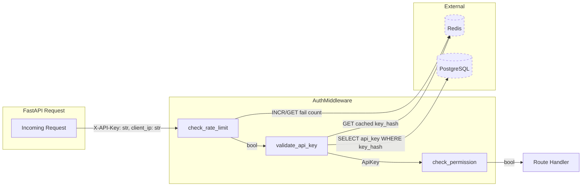
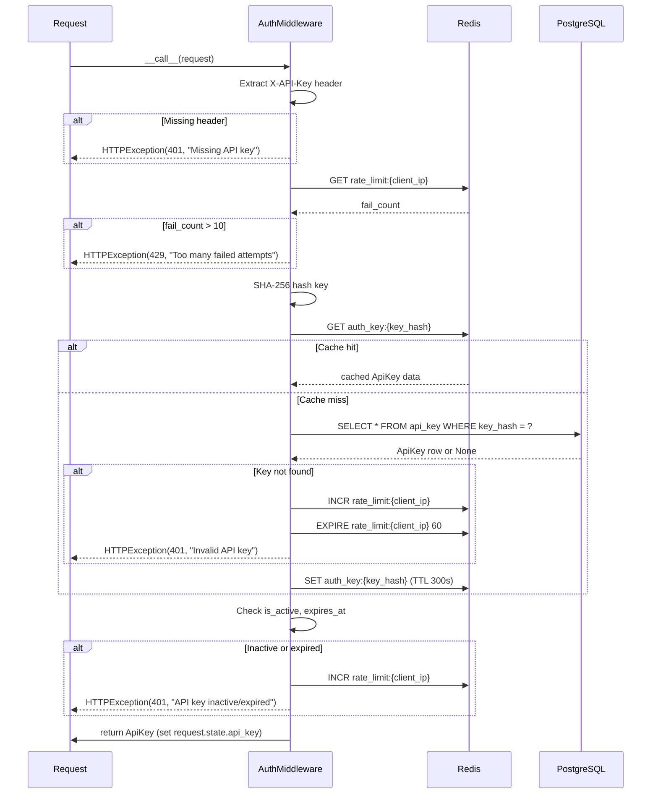
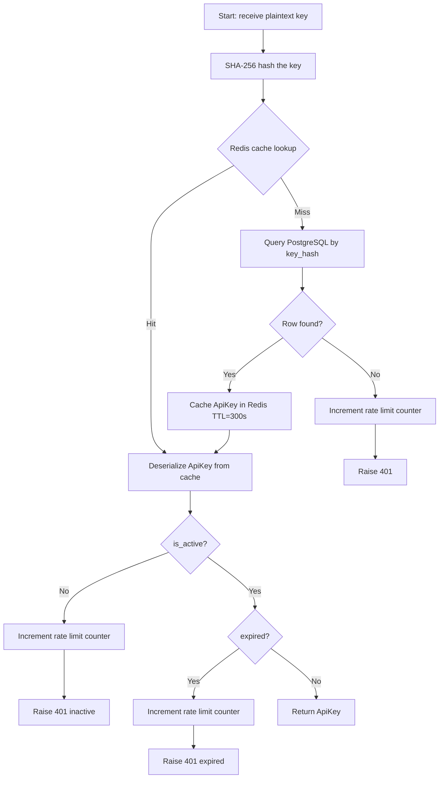
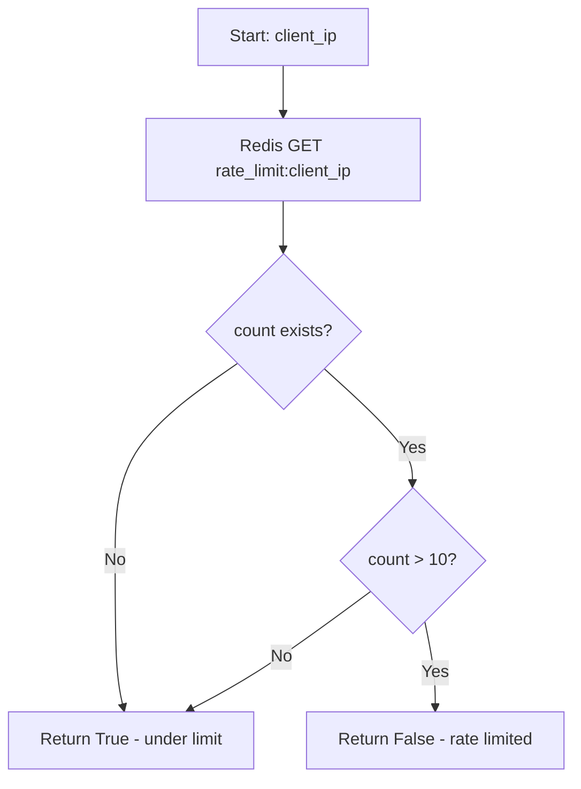
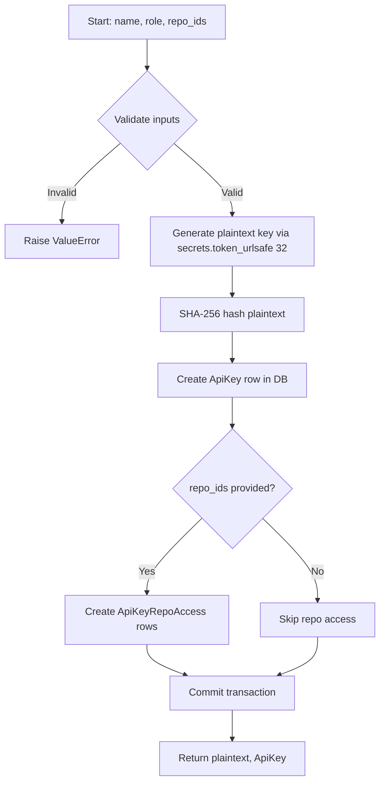
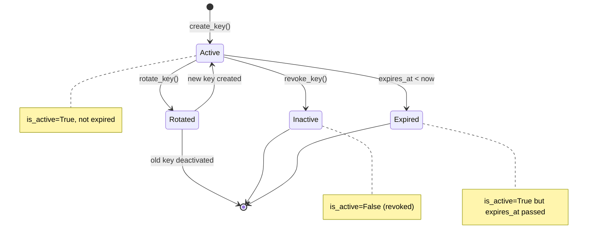

# Feature Detailed Design: API Key Authentication (Feature #16)

**Date**: 2026-03-21
**Feature**: #16 — API Key Authentication
**Priority**: high
**Dependencies**: Feature #2 (Data Model & Migrations)
**Design Reference**: docs/plans/2026-03-21-code-context-retrieval-design.md § 4.5
**SRS Reference**: FR-014

## Context

This feature implements the authentication and authorization logic for the Code Context Retrieval API. It provides an `AuthMiddleware` FastAPI dependency that validates API keys (via SHA-256 hash lookup in PostgreSQL with Redis caching), enforces rate limiting on failed attempts, and checks role-based permissions. It also provides an `APIKeyManager` for CRUD operations on API keys (create, revoke, rotate, list). This feature implements the auth *logic* only — REST endpoints are delivered in Feature #17.

## Design Alignment

### Classes

- **AuthMiddleware**: FastAPI dependency callable that extracts the `X-API-Key` header, validates it against PostgreSQL (with Redis cache), enforces rate limiting, and attaches the key's role to request state.
  - `validate_api_key(key: str) -> ApiKey`
  - `check_permission(api_key: ApiKey, action: str) -> bool`
  - `check_rate_limit(client_ip: str) -> bool`
  - `check_repo_access(api_key: ApiKey, repo_id: UUID) -> bool`

- **APIKeyManager**: Service class for API key lifecycle management.
  - `create_key(name: str, role: str, repo_ids: list[UUID] | None) -> tuple[str, ApiKey]`
  - `revoke_key(key_id: UUID) -> None`
  - `rotate_key(key_id: UUID) -> tuple[str, ApiKey]`
  - `list_keys() -> list[ApiKey]`

### Permission Model

| Role | Query | List Repos | Register Repo | Reindex | Manage Keys | Metrics |
|------|:-----:|:----------:|:-------------:|:-------:|:-----------:|:-------:|
| read | yes (scoped) | yes (allowed only) | no | no | no | no |
| admin | yes (all) | yes (all) | yes | yes | yes | yes |

### Interaction Flow

1. Incoming request → `AuthMiddleware.__call__` extracts `X-API-Key` header
2. Rate limit check via Redis (`check_rate_limit`)
3. SHA-256 hash the key → look up in Redis cache → fallback to PostgreSQL (`validate_api_key`)
4. Check expiry, active status
5. Attach `ApiKey` and role to `request.state`
6. If validation fails → increment Redis failure counter → raise `HTTPException(401)` or `HTTPException(429)`

- **Third-party deps**: `hashlib` (stdlib), `secrets` (stdlib), `redis.asyncio` (existing), `sqlalchemy.ext.asyncio` (existing), `fastapi` (existing)
- **Deviations**: AuthMiddleware is implemented as a FastAPI dependency (not ASGI middleware) per instruction — this is consistent with FastAPI best practices for per-route auth.

## SRS Requirement

**FR-014** (Priority: Must)

**EARS**: When a client sends a request to the query API, the system shall validate the provided API key against the stored key records and reject unauthenticated requests with a 401 status.

**Acceptance Criteria**:
- Given a valid API key in the `X-API-Key` header, when a query request is made, then the system shall process the request normally.
- Given an invalid or missing API key, when a query request is made, then the system shall return 401 Unauthorized without executing the query.
- Given an expired API key, when a query request is made, then the system shall return 401 Unauthorized.
- Given more than 10 failed authentication attempts from the same IP within 1 minute, then the system shall return 429 Too Many Requests for subsequent attempts from that IP.

## Component Data-Flow Diagram



## Interface Contract

| Method | Signature | Preconditions | Postconditions | Raises |
|--------|-----------|---------------|----------------|--------|
| `AuthMiddleware.__call__` | `__call__(request: Request) -> ApiKey` | FastAPI app has DB session factory and Redis client in `app.state` | Returns validated `ApiKey`; sets `request.state.api_key` | `HTTPException(401)` if key missing/invalid/expired/inactive; `HTTPException(429)` if rate limited |
| `validate_api_key` | `validate_api_key(key: str) -> ApiKey` | `key` is a non-empty string; DB session available | Returns `ApiKey` with `is_active=True` and non-expired | `HTTPException(401)` if key not found, inactive, or expired |
| `check_rate_limit` | `check_rate_limit(client_ip: str) -> bool` | Redis client connected | Returns `True` if under limit, `False` if limit exceeded | None (returns bool) |
| `check_permission` | `check_permission(api_key: ApiKey, action: str) -> bool` | `api_key` is validated; `action` is a valid action string | Returns `True` if role permits action | None (returns bool) |
| `check_repo_access` | `check_repo_access(api_key: ApiKey, repo_id: UUID) -> bool` | `api_key` is validated; DB session available | Returns `True` if admin or repo_id in scoped list | None (returns bool) |
| `APIKeyManager.create_key` | `create_key(name: str, role: str, repo_ids: list[UUID] \| None = None) -> tuple[str, ApiKey]` | `name` non-empty; `role` in `{"read", "admin"}`; DB session available | Stores SHA-256 hash in DB; returns `(plaintext_key, ApiKey)` | `ValueError` if `name` empty or `role` invalid |
| `APIKeyManager.revoke_key` | `revoke_key(key_id: UUID) -> None` | `key_id` exists in DB | Sets `is_active=False` on the key | `KeyError` if key_id not found |
| `APIKeyManager.rotate_key` | `rotate_key(key_id: UUID) -> tuple[str, ApiKey]` | `key_id` exists in DB and `is_active=True` | Old key deactivated; new key created with same name/role/repos; returns `(new_plaintext, new_ApiKey)` | `KeyError` if key_id not found; `ValueError` if key inactive |
| `APIKeyManager.list_keys` | `list_keys() -> list[ApiKey]` | DB session available | Returns all keys (active and inactive); plaintext never exposed | None |

**Design rationale**:
- `AuthMiddleware` is a callable class (FastAPI `Depends`) rather than ASGI middleware so it can be selectively applied per-route (e.g., health endpoint excluded).
- API keys are 32-byte `secrets.token_urlsafe` (43 chars) — sufficient entropy for brute-force resistance.
- Rate limit uses Redis `INCR` + `EXPIRE` (not sliding window) for simplicity — a 60-second fixed window is acceptable given the 10-attempt threshold.
- Redis key cache TTL is 300 seconds to balance freshness with DB load; revocation invalidates the cache entry immediately.
- `check_permission` uses a static role-action map, not DB lookups, for speed.

## Internal Sequence Diagram



## Algorithm / Core Logic

### validate_api_key

#### Flow Diagram



#### Pseudocode

```
FUNCTION validate_api_key(key: str) -> ApiKey
  key_hash = SHA256(key.encode()).hexdigest()

  // Step 1: Check Redis cache
  cached = await redis.get(f"auth_key:{key_hash}")
  IF cached IS NOT None:
    api_key = deserialize(cached)
  ELSE:
    // Step 2: Query PostgreSQL
    api_key = await db.execute(
      SELECT * FROM api_key WHERE key_hash = key_hash
    ).scalar_one_or_none()
    IF api_key IS None:
      await _increment_rate_limit(client_ip)
      RAISE HTTPException(401, "Invalid API key")
    // Step 3: Cache result
    await redis.set(f"auth_key:{key_hash}", serialize(api_key), ex=300)

  // Step 4: Validate active status
  IF NOT api_key.is_active:
    await _increment_rate_limit(client_ip)
    RAISE HTTPException(401, "API key is inactive")

  // Step 5: Validate expiry
  IF api_key.expires_at IS NOT None AND api_key.expires_at < utcnow():
    await _increment_rate_limit(client_ip)
    RAISE HTTPException(401, "API key has expired")

  RETURN api_key
END
```

#### Boundary Decisions

| Parameter | Min | Max | Empty/Null | At boundary |
|-----------|-----|-----|------------|-------------|
| `key` | 1 char | no limit | Raise 401 "Missing API key" (caught in `__call__` before reaching this method) | 1-char key: valid input, will hash and fail lookup → 401 |
| `expires_at` | any past datetime | any future datetime | `None` means no expiry (valid forever) | `expires_at == utcnow()`: treated as expired (strict less-than comparison on remaining time) |

#### Error Handling

| Condition | Detection | Response | Recovery |
|-----------|-----------|----------|----------|
| Key not found in DB | `scalar_one_or_none()` returns `None` | `HTTPException(401, "Invalid API key")` | Caller retries with correct key |
| Key inactive | `api_key.is_active == False` | `HTTPException(401, "API key is inactive")` | Admin must reactivate or create new key |
| Key expired | `api_key.expires_at < utcnow()` | `HTTPException(401, "API key has expired")` | Admin rotates key |
| Redis unavailable | `redis.get()` raises exception | Fallback to DB lookup (log warning) | Redis reconnects automatically |
| DB unavailable | `session.execute()` raises exception | `HTTPException(503, "Service unavailable")` | Caller retries |

### check_rate_limit

#### Flow Diagram



#### Pseudocode

```
FUNCTION check_rate_limit(client_ip: str) -> bool
  redis_key = f"rate_limit:{client_ip}"
  count = await redis.get(redis_key)
  IF count IS None:
    RETURN True
  IF int(count) > 10:
    RETURN False
  RETURN True
END

FUNCTION _increment_rate_limit(client_ip: str) -> None
  redis_key = f"rate_limit:{client_ip}"
  new_count = await redis.incr(redis_key)
  IF new_count == 1:
    await redis.expire(redis_key, 60)  // 60-second window
END
```

#### Boundary Decisions

| Parameter | Min | Max | Empty/Null | At boundary |
|-----------|-----|-----|------------|-------------|
| `fail_count` | 0 | no limit | `None` (no key in Redis) → treated as 0 | count=10: allowed (limit is >10); count=11: blocked |
| `client_ip` | valid IPv4/IPv6 | valid IPv4/IPv6 | Empty string: treated as valid key (edge case, won't occur in practice) | N/A |

#### Error Handling

| Condition | Detection | Response | Recovery |
|-----------|-----------|----------|----------|
| Redis unavailable | `redis.get()` raises exception | Return `True` (fail open) and log warning | Redis reconnects; rate limiting resumes |

### create_key

#### Flow Diagram



#### Pseudocode

```
FUNCTION create_key(name: str, role: str, repo_ids: list[UUID] | None = None) -> tuple[str, ApiKey]
  // Step 1: Validate
  IF name IS empty:
    RAISE ValueError("name must not be empty")
  IF role NOT IN ("read", "admin"):
    RAISE ValueError("role must be 'read' or 'admin'")

  // Step 2: Generate key
  plaintext = secrets.token_urlsafe(32)
  key_hash = SHA256(plaintext.encode()).hexdigest()

  // Step 3: Store in DB
  api_key = ApiKey(key_hash=key_hash, name=name, role=role, is_active=True)
  session.add(api_key)

  // Step 4: Associate repos (for read role scoping)
  IF repo_ids IS NOT None:
    FOR repo_id IN repo_ids:
      access = ApiKeyRepoAccess(api_key_id=api_key.id, repo_id=repo_id)
      session.add(access)

  await session.commit()
  RETURN (plaintext, api_key)
END
```

#### Boundary Decisions

| Parameter | Min | Max | Empty/Null | At boundary |
|-----------|-----|-----|------------|-------------|
| `name` | 1 char | no limit | Empty string → `ValueError` | 1-char name: valid |
| `role` | "read" or "admin" | "read" or "admin" | `None` → `ValueError` | Exact match required |
| `repo_ids` | empty list | no limit | `None` → no repo scoping (admin default) | Empty list `[]` → no repo access rows created (read key with no repo access) |

#### Error Handling

| Condition | Detection | Response | Recovery |
|-----------|-----------|----------|----------|
| Empty name | `len(name.strip()) == 0` | `ValueError("name must not be empty")` | Caller provides valid name |
| Invalid role | `role not in {"read", "admin"}` | `ValueError("role must be 'read' or 'admin'")` | Caller provides valid role |
| DB constraint violation | `IntegrityError` from SQLAlchemy | Rollback, re-raise | Caller retries or checks for duplicates |

## State Diagram



## Test Inventory

| ID | Category | Traces To | Input / Setup | Expected | Kills Which Bug? |
|----|----------|-----------|---------------|----------|-----------------|
| T01 | happy path | VS-1, FR-014 AC-1 | Valid API key in `X-API-Key` header | `AuthMiddleware` returns `ApiKey`; `request.state.api_key` set | Missing header extraction |
| T02 | happy path | VS-1 | Valid admin key, action="query" | `check_permission` returns `True` | Wrong role-action mapping |
| T03 | happy path | VS-1 | Valid read key, action="query", repo in scoped list | `check_permission` returns `True` and `check_repo_access` returns `True` | Missing read-role query permission |
| T04 | happy path | VS-4, FR-014 | `create_key("test", "read")` | Returns `(plaintext, ApiKey)` with `len(plaintext) == 43`, `ApiKey.key_hash == SHA256(plaintext)` | Wrong hash algorithm or key length |
| T05 | happy path | Interface Contract | `list_keys()` with 3 keys in DB | Returns list of 3 `ApiKey` objects, no plaintext exposed | Missing list implementation |
| T06 | happy path | Interface Contract | `revoke_key(key_id)` on active key | Key's `is_active` set to `False` in DB | Revoke not persisting |
| T07 | happy path | Interface Contract | `rotate_key(key_id)` on active key | Old key deactivated; new key returned with same name/role | Rotate not deactivating old key |
| T08 | happy path | Interface Contract | `validate_api_key` with key cached in Redis | Returns `ApiKey` without hitting DB | Cache bypass bug |
| T09 | error | VS-2, FR-014 AC-2 | Missing `X-API-Key` header | `HTTPException(401)` with detail "Missing API key" | Missing header check |
| T10 | error | VS-2, FR-014 AC-2 | Invalid API key (not in DB) | `HTTPException(401)` with detail "Invalid API key" | Missing DB lookup failure path |
| T11 | error | FR-014 AC-3 | Expired API key (`expires_at` in the past) | `HTTPException(401)` with detail "API key has expired" | Missing expiry check |
| T12 | error | Interface Contract | Inactive API key (`is_active=False`) | `HTTPException(401)` with detail "API key is inactive" | Missing active check |
| T13 | error | VS-3, FR-014 AC-4 | 11 failed attempts from same IP within 1 minute | `HTTPException(429)` on 12th attempt | Rate limit not enforced |
| T14 | error | Interface Contract | `revoke_key` with non-existent `key_id` | `KeyError` raised | Missing existence check in revoke |
| T15 | error | Interface Contract | `rotate_key` with non-existent `key_id` | `KeyError` raised | Missing existence check in rotate |
| T16 | error | Interface Contract | `rotate_key` on inactive key | `ValueError` raised | Rotating already-revoked key |
| T17 | error | Interface Contract | `create_key("", "read")` | `ValueError("name must not be empty")` | Missing name validation |
| T18 | error | Interface Contract | `create_key("test", "superadmin")` | `ValueError("role must be 'read' or 'admin'")` | Missing role validation |
| T19 | error | Interface Contract | `check_permission(read_key, "manage_keys")` | Returns `False` | Read role escalation |
| T20 | error | Interface Contract | `check_permission(read_key, "register_repo")` | Returns `False` | Missing action in deny list |
| T21 | error | Interface Contract | `check_repo_access(read_key, unscoped_repo_id)` | Returns `False` | Missing repo scoping |
| T22 | boundary | Algorithm boundary | `fail_count == 10` (exactly at limit) | Request allowed (limit is >10) | Off-by-one in rate limit |
| T23 | boundary | Algorithm boundary | `fail_count == 11` (one over limit) | Request blocked (429) | Off-by-one in rate limit |
| T24 | boundary | Algorithm boundary | `expires_at == utcnow()` exactly | Treated as expired → 401 | Off-by-one in expiry comparison |
| T25 | boundary | Algorithm boundary | `expires_at` is `None` | Key valid forever — no expiry check | None-handling bug in expiry |
| T26 | boundary | Algorithm boundary | `create_key("x", "read", [])` empty repo_ids list | Key created with no repo access rows | Empty list treated as None |
| T27 | boundary | Algorithm boundary | 1-character name in `create_key` | Key created successfully | Off-by-one in name length check |
| T28 | state | State Diagram | Create → Revoke → Validate | 401 returned for revoked key | Revoked key still accepted |
| T29 | state | State Diagram | Create → Rotate → Validate old key | 401 for old key; new key works | Old key not deactivated on rotate |
| T30 | error | Error handling table | Redis unavailable during `validate_api_key` | Falls back to DB lookup; logs warning | Missing Redis fallback |
| T31 | error | Error handling table | Redis unavailable during `check_rate_limit` | Returns `True` (fail open); logs warning | Rate limit blocks all when Redis down |
| T32 | happy path | Interface Contract | `create_key("test", "read", [repo_id])` | `ApiKeyRepoAccess` row created with correct `api_key_id` and `repo_id` | Missing repo_ids association |
| T33 | error | Interface Contract | Admin key `check_repo_access` for any repo | Returns `True` (admin bypasses scoping) | Admin blocked by scoping |
| T34 | happy path | Interface Contract | `revoke_key` invalidates Redis cache for that key_hash | Subsequent `validate_api_key` does not use stale cache | Stale cache after revocation |

**Negative test ratio**: 17 negative/error tests out of 34 total = 50% (exceeds 40% minimum).

## Tasks

### Task 1: Write failing tests

**Files**: `tests/test_auth.py`

**Steps**:
1. Create test file with imports for `pytest`, `pytest_asyncio`, `unittest.mock`, `hashlib`, `secrets`, `uuid`, `datetime`, `fastapi.HTTPException`
2. Create fixtures: mock `AsyncSession`, mock `RedisClient`, mock `Request` with headers and `client.host`
3. Write test functions for each row in Test Inventory:
   - Test T01: `test_valid_api_key_returns_api_key` — valid key in header, mock DB returns matching ApiKey
   - Test T02: `test_admin_check_permission_query` — admin key, action="query"
   - Test T03: `test_read_key_query_with_repo_access` — read key, scoped repo
   - Test T04: `test_create_key_returns_plaintext_and_model` — create_key returns 43-char plaintext
   - Test T05: `test_list_keys_returns_all` — list_keys with 3 keys
   - Test T06: `test_revoke_key_sets_inactive` — revoke sets is_active=False
   - Test T07: `test_rotate_key_deactivates_old_creates_new` — rotate lifecycle
   - Test T08: `test_validate_uses_redis_cache` — cached key skips DB
   - Test T09: `test_missing_header_raises_401` — no X-API-Key → 401
   - Test T10: `test_invalid_key_raises_401` — key not in DB → 401
   - Test T11: `test_expired_key_raises_401` — expired key → 401
   - Test T12: `test_inactive_key_raises_401` — is_active=False → 401
   - Test T13: `test_rate_limit_exceeded_raises_429` — 11 failures → 429
   - Test T14: `test_revoke_nonexistent_raises_key_error` — missing key_id
   - Test T15: `test_rotate_nonexistent_raises_key_error` — missing key_id
   - Test T16: `test_rotate_inactive_raises_value_error` — inactive key
   - Test T17: `test_create_empty_name_raises_value_error` — empty name
   - Test T18: `test_create_invalid_role_raises_value_error` — bad role
   - Test T19: `test_read_key_cannot_manage_keys` — check_permission returns False
   - Test T20: `test_read_key_cannot_register_repo` — check_permission returns False
   - Test T21: `test_read_key_no_access_to_unscoped_repo` — check_repo_access returns False
   - Test T22: `test_rate_limit_at_10_allowed` — exactly 10 failures → allowed
   - Test T23: `test_rate_limit_at_11_blocked` — 11 failures → blocked
   - Test T24: `test_expires_at_now_is_expired` — boundary expiry
   - Test T25: `test_no_expiry_is_valid_forever` — expires_at=None
   - Test T26: `test_create_key_empty_repo_ids_list` — empty list
   - Test T27: `test_create_key_single_char_name` — 1-char name
   - Test T28: `test_revoked_key_rejected_on_validate` — state: revoked
   - Test T29: `test_rotated_old_key_rejected` — state: rotated
   - Test T30: `test_redis_down_falls_back_to_db` — Redis exception → DB fallback
   - Test T31: `test_redis_down_rate_limit_fails_open` — Redis exception → allow
   - Test T32: `test_create_key_with_repo_ids` — repo access rows created
   - Test T33: `test_admin_bypasses_repo_scoping` — admin access all repos
   - Test T34: `test_revoke_invalidates_cache` — cache cleared on revoke
4. Run: `pytest tests/test_auth.py`
5. **Expected**: All tests FAIL (ImportError or AttributeError — classes not yet implemented)

### Task 2: Implement minimal code

**Files**:
- `src/shared/services/auth_middleware.py`
- `src/shared/services/api_key_manager.py`

**Steps**:
1. Create `src/shared/services/auth_middleware.py`:
   - Define `ROLE_PERMISSIONS` dict mapping roles to allowed actions
   - Implement `AuthMiddleware` class with `__init__(self, session_factory, redis_client)`
   - Implement `__call__(self, request: Request) -> ApiKey` — extract header, check rate limit, validate key, set request.state
   - Implement `validate_api_key(key: str, client_ip: str) -> ApiKey` per Algorithm pseudocode
   - Implement `check_rate_limit(client_ip: str) -> bool` per Algorithm pseudocode
   - Implement `_increment_rate_limit(client_ip: str) -> None` per Algorithm pseudocode
   - Implement `check_permission(api_key: ApiKey, action: str) -> bool` using `ROLE_PERMISSIONS`
   - Implement `check_repo_access(api_key: ApiKey, repo_id: UUID) -> bool` — admin returns True, read checks `ApiKeyRepoAccess`
   - Implement `_invalidate_cache(key_hash: str) -> None` — delete Redis cache entry

2. Create `src/shared/services/api_key_manager.py`:
   - Implement `APIKeyManager` class with `__init__(self, session_factory, redis_client)`
   - Implement `create_key(name, role, repo_ids)` per Algorithm pseudocode
   - Implement `revoke_key(key_id)` — lookup, set inactive, invalidate cache, commit
   - Implement `rotate_key(key_id)` — validate active, revoke old, create new with same name/role/repos
   - Implement `list_keys()` — SELECT all from api_key table

3. Run: `pytest tests/test_auth.py`
4. **Expected**: All tests PASS

### Task 3: Coverage Gate

1. Run: `pytest --cov=src/shared/services/auth_middleware --cov=src/shared/services/api_key_manager --cov-branch --cov-report=term-missing tests/test_auth.py`
2. Check thresholds: line >= 90%, branch >= 80%. If below: return to Task 1 to add tests for uncovered branches.
3. Record coverage output as evidence.

### Task 4: Refactor

1. Extract `RATE_LIMIT_WINDOW = 60` and `RATE_LIMIT_MAX_FAILURES = 10` and `CACHE_TTL = 300` as class constants for configurability.
2. Ensure all Redis key prefixes are constants (`RATE_LIMIT_PREFIX = "rate_limit:"`, `AUTH_KEY_PREFIX = "auth_key:"`).
3. Run full test suite: `pytest tests/test_auth.py`
4. All tests PASS.

### Task 5: Mutation Gate

1. Run: `mutmut run --paths-to-mutate=src/shared/services/auth_middleware.py,src/shared/services/api_key_manager.py`
2. Check threshold: mutation score >= 80%. If below: improve assertions in test cases to kill surviving mutants.
3. Record mutation output as evidence.

### Task 6: Create example

1. Create `examples/16-api-key-authentication.py`
2. Update `examples/README.md` with entry for example 16.
3. Run example to verify.

## Verification Checklist

- [x] All verification_steps traced to Interface Contract postconditions
  - VS-1 → `AuthMiddleware.__call__` postcondition (returns ApiKey, sets request.state)
  - VS-2 → `AuthMiddleware.__call__` raises `HTTPException(401)`
  - VS-3 → `check_rate_limit` + `__call__` raises `HTTPException(429)`
  - VS-4 → `APIKeyManager.create_key` postcondition (stores hash, returns plaintext)
- [x] All verification_steps traced to Test Inventory rows
  - VS-1 → T01, T02, T03
  - VS-2 → T09, T10
  - VS-3 → T13, T22, T23
  - VS-4 → T04
- [x] Algorithm pseudocode covers all non-trivial methods (`validate_api_key`, `check_rate_limit`, `create_key`)
- [x] Boundary table covers all algorithm parameters
- [x] Error handling table covers all Raises entries
- [x] Test Inventory negative ratio >= 40% (50%)
- [x] Every skipped section has explicit "N/A — [reason]" (no sections skipped)
