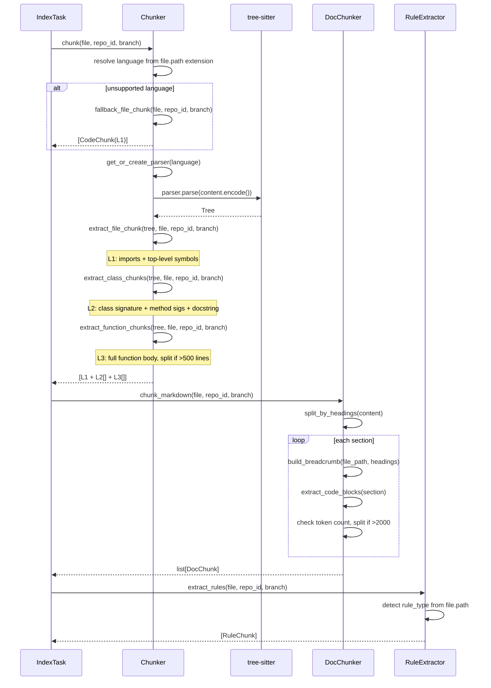
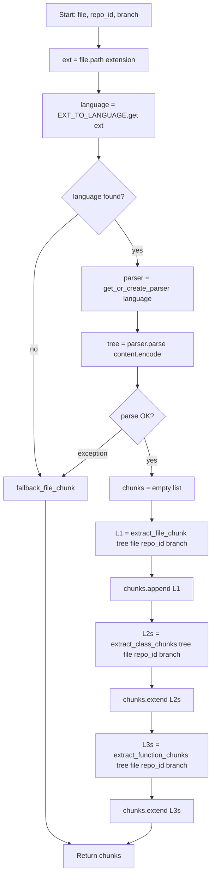
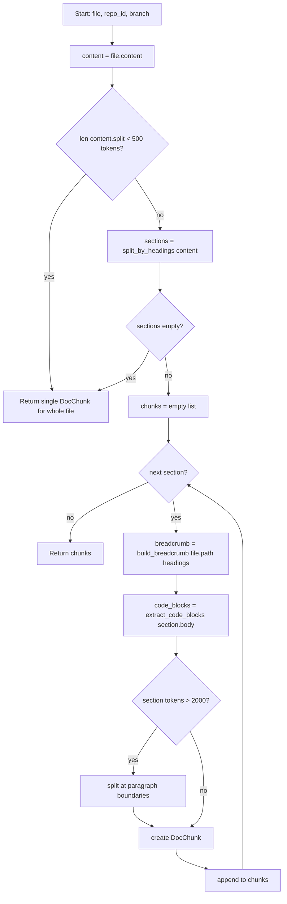
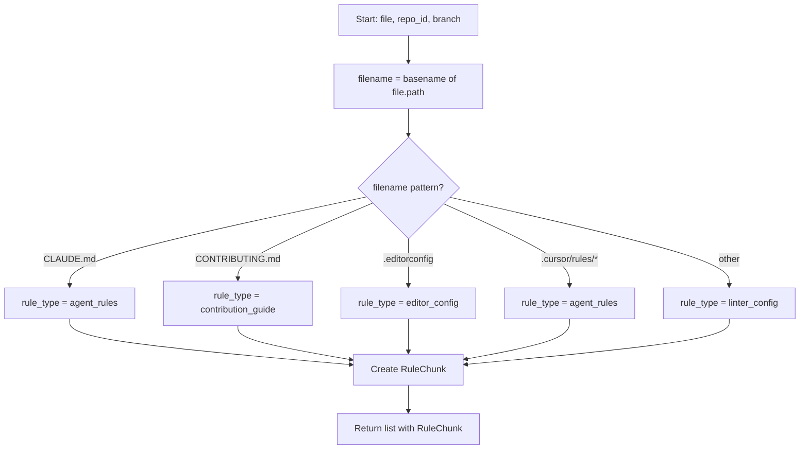

# Feature Detailed Design: Code Chunking (Feature #6)

**Date**: 2026-03-21
**Feature**: #6 — Code Chunking
**Priority**: high
**Dependencies**: #5 (Content Extraction) — passing
**Design Reference**: docs/plans/2026-03-21-code-context-retrieval-design.md § 4.1
**SRS Reference**: FR-004

## Context

Code Chunking takes `ExtractedFile` objects produced by Content Extraction and segments them into multi-granularity chunks using tree-sitter AST parsing for code files, heading-based splitting for documentation, and pattern-based extraction for rule files. This is the core preparation step that produces the chunks consumed by the embedding and retrieval pipeline.

## Design Alignment

- **Key classes**: `Chunker` (tree-sitter AST parsing for 6 languages), `DocChunker` (markdown heading-based splitting), `RuleExtractor` (rule file extraction), plus data classes `CodeChunk`, `DocChunk`, `RuleChunk`
- **Interaction flow**: IndexTask routes each `ExtractedFile` by its `content_type` — CODE/EXAMPLE to `Chunker.chunk()`, DOC to `DocChunker.chunk_markdown()`, RULE to `RuleExtractor.extract_rules()` — and collects the resulting chunk lists
- **Third-party deps**: `tree_sitter` (parser framework), `tree_sitter_python`, `tree_sitter_java`, `tree_sitter_javascript`, `tree_sitter_typescript`, `tree_sitter_c`, `tree_sitter_cpp` (grammar packages)
- **Deviations**: None

## SRS Requirement

### FR-004: Code Chunking

**Priority**: Must
**EARS**: When source code content is extracted, the system shall parse it using tree-sitter and segment it into multi-granularity chunks at file, class, function, and symbol levels.
**Acceptance Criteria**:
- Given a Java source file containing 2 classes and 5 methods, when chunking completes, then the system shall produce 1 file-level chunk, 2 class-level chunks, and 5 method-level chunks (8 total).
- Given a Python file with top-level functions and no classes, when chunking completes, then the system shall produce 1 file-level chunk and N function-level chunks.
- Given a documentation file (.md), when chunking completes, then the system shall produce 1 file-level chunk (no AST parsing).
- Given a file in an unsupported language, when chunking attempts parsing, then the system shall fall back to file-level chunking only.

## Component Data-Flow Diagram

```mermaid
flowchart LR
    EF[/"ExtractedFile"/] --> ROUTE{"content_type?"}
    ROUTE -->|CODE / EXAMPLE| CH["Chunker.chunk()"]
    ROUTE -->|DOC| DC["DocChunker.chunk_markdown()"]
    ROUTE -->|RULE| RE["RuleExtractor.extract_rules()"]

    CH --> PARSE["parse_ast()"]
    PARSE --> L1["extract_file_chunk() → L1"]
    PARSE --> L2["extract_class_chunks() → L2[]"]
    PARSE --> L3["extract_function_chunks() → L3[]"]
    L1 --> CC[/"list[CodeChunk]"/]
    L2 --> CC
    L3 --> CC

    CH -->|unsupported lang| FB["fallback_file_chunk()"]
    FB --> CC

    DC --> SPLIT["split_by_headings()"]
    SPLIT --> BREAD["build_breadcrumb()"]
    BREAD --> DCO[/"list[DocChunk]"/]

    RE --> RTYPE["detect rule_type"]
    RTYPE --> RC[/"list[RuleChunk]"/]

    style EF fill:#333,stroke:#888,stroke-dasharray: 5 5
    style CC fill:#333,stroke:#888,stroke-dasharray: 5 5
    style DCO fill:#333,stroke:#888,stroke-dasharray: 5 5
    style RC fill:#333,stroke:#888,stroke-dasharray: 5 5
```



## Interface Contract

### Chunker

| Method | Signature | Preconditions | Postconditions | Raises |
|--------|-----------|---------------|----------------|--------|
| `chunk` | `chunk(file: ExtractedFile, repo_id: str, branch: str) -> list[CodeChunk]` | `file.content_type` is CODE or EXAMPLE; `file.content` is non-None string; `repo_id` and `branch` are non-empty strings | Returns >= 1 CodeChunk (at minimum the L1 file chunk). For supported languages: L1 + L2 (classes) + L3 (functions). For unsupported: L1 only via fallback. | None (falls back to file-level on any parse error) |
| `parse_ast` | `parse_ast(content: str, language: str) -> Tree` | `language` is one of the 6 supported languages; `content` is a string | Returns a tree-sitter `Tree` object. Partial parse on syntax errors (tree-sitter is error-tolerant). | `ValueError` if `language` not supported |
| `extract_file_chunk` | `extract_file_chunk(tree: Tree, file: ExtractedFile, repo_id: str, branch: str) -> CodeChunk` | `tree` is a valid parsed Tree | Returns a single L1 CodeChunk with imports and top-level symbol names; content is import list + symbol list (no function bodies) | None |
| `extract_class_chunks` | `extract_class_chunks(tree: Tree, file: ExtractedFile, repo_id: str, branch: str) -> list[CodeChunk]` | `tree` is a valid parsed Tree | Returns one L2 CodeChunk per class/interface. Content is class signature + method signature list + class docstring (no method bodies). | None |
| `extract_function_chunks` | `extract_function_chunks(tree: Tree, file: ExtractedFile, repo_id: str, branch: str) -> list[CodeChunk]` | `tree` is a valid parsed Tree | Returns one L3 CodeChunk per function/method. Content is the complete function body. Functions >500 lines split into 500-line windows with 50-line overlap. | None |
| `extract_signature` | `extract_signature(node: Node, language: str) -> str` | `node` is a class/function AST node | Returns the text from node start up to (but not including) the body delimiter (`:` for Python, `{` for C-family) | None (returns empty string on failure) |
| `extract_doc_comment` | `extract_doc_comment(node: Node, language: str) -> str` | `node` is a class/function AST node | Returns the first child string literal or preceding comment block text. Empty string if none found. | None |
| `extract_imports` | `extract_imports(tree: Tree, language: str) -> list[str]` | `tree` is a valid parsed Tree | Returns flat list of import statement texts from root-level nodes | None |
| `fallback_file_chunk` | `fallback_file_chunk(file: ExtractedFile, repo_id: str, branch: str) -> CodeChunk` | `file` is a valid ExtractedFile | Returns a single L1 CodeChunk with the full file content, empty imports/symbols | None |

**Design rationale**:
- `chunk()` never raises — on any tree-sitter failure or unsupported language, it falls back to `fallback_file_chunk()` so a single bad file does not halt indexing
- Parsers are initialized lazily (first call for a given language) to avoid loading all 6 grammars at startup
- `LanguageNodeMap` dataclass maps each language to its class, function, and import AST node type names, keeping the extraction logic language-agnostic
- Extension-to-language mapping reuses `SUPPORTED_CODE_EXTENSIONS` from content_extractor plus `.tsx` and `.h`/`.hpp`

### DocChunker

| Method | Signature | Preconditions | Postconditions | Raises |
|--------|-----------|---------------|----------------|--------|
| `chunk_markdown` | `chunk_markdown(file: ExtractedFile, repo_id: str, branch: str) -> list[DocChunk]` | `file.content_type` is DOC; `file.content` is a string | Returns >= 1 DocChunk. Small files (<500 tokens) return a single chunk. Sections split at H2/H3 boundaries. | None |
| `split_by_headings` | `split_by_headings(content: str) -> list[Section]` | `content` is a string (may be empty) | Returns list of Section namedtuples with heading_level, heading_text, body. Empty content returns one section. | None |
| `build_breadcrumb` | `build_breadcrumb(file_path: str, headings: list[str]) -> str` | `headings` is the ancestor heading chain | Returns breadcrumb string: `{file_path} > {H1} > {H2} > ...` | None |
| `extract_code_blocks` | `extract_code_blocks(section: str) -> list[CodeBlock]` | `section` is markdown text | Returns list of CodeBlock namedtuples with language and code fields | None |

### RuleExtractor

| Method | Signature | Preconditions | Postconditions | Raises |
|--------|-----------|---------------|----------------|--------|
| `extract_rules` | `extract_rules(file: ExtractedFile, repo_id: str, branch: str) -> list[RuleChunk]` | `file.content_type` is RULE; `file.content` is a string | Returns exactly 1 RuleChunk with appropriate `rule_type` based on file path pattern | None |
| `parse_claude_md` | `parse_claude_md(content: str) -> list[str]` | `content` is CLAUDE.md text | Returns list of rule strings parsed from content | None |
| `parse_contributing` | `parse_contributing(content: str) -> list[str]` | `content` is CONTRIBUTING.md text | Returns list of guideline strings parsed from content | None |
| `parse_cursor_rules` | `parse_cursor_rules(content: str) -> list[str]` | `content` is cursor rules file text | Returns list of rule strings parsed from content | None |

## Internal Sequence Diagram



## Algorithm / Core Logic

### Chunker.chunk()

#### Flow Diagram



#### Pseudocode

```
CONSTANT EXT_TO_LANGUAGE = {
    ".py": "python", ".java": "java", ".js": "javascript",
    ".ts": "typescript", ".tsx": "typescript",
    ".c": "c", ".cpp": "cpp", ".h": "c", ".hpp": "cpp"
}

CONSTANT LANGUAGE_NODE_MAPS = {
    "python": LanguageNodeMap(
        class_nodes=["class_definition"],
        function_nodes=["function_definition"],
        import_nodes=["import_statement", "import_from_statement"],
        body_delimiter=":"
    ),
    "java": LanguageNodeMap(
        class_nodes=["class_declaration", "interface_declaration"],
        function_nodes=["method_declaration", "constructor_declaration"],
        import_nodes=["import_declaration"],
        body_delimiter="{"
    ),
    "javascript": LanguageNodeMap(
        class_nodes=["class_declaration"],
        function_nodes=["function_declaration", "arrow_function", "method_definition"],
        import_nodes=["import_statement"],
        body_delimiter="{"
    ),
    "typescript": LanguageNodeMap(
        class_nodes=["class_declaration", "interface_declaration"],
        function_nodes=["function_declaration", "arrow_function", "method_definition"],
        import_nodes=["import_statement"],
        body_delimiter="{"
    ),
    "c": LanguageNodeMap(
        class_nodes=[],
        function_nodes=["function_definition"],
        import_nodes=["preproc_include"],
        body_delimiter="{"
    ),
    "cpp": LanguageNodeMap(
        class_nodes=["class_specifier", "struct_specifier"],
        function_nodes=["function_definition"],
        import_nodes=["preproc_include", "using_declaration"],
        body_delimiter="{"
    )
}

FUNCTION chunk(file: ExtractedFile, repo_id: str, branch: str) -> list[CodeChunk]:
    ext = os.path.splitext(file.path)[1].lower()
    language = EXT_TO_LANGUAGE.get(ext)

    IF language IS None:
        RETURN [fallback_file_chunk(file, repo_id, branch)]

    TRY:
        tree = parse_ast(file.content, language)
    EXCEPT Exception:
        log.warning("Parse failed for %s, falling back to file chunk", file.path)
        RETURN [fallback_file_chunk(file, repo_id, branch)]

    node_map = LANGUAGE_NODE_MAPS[language]
    chunks = []
    chunks.append(extract_file_chunk(tree, file, repo_id, branch))
    chunks.extend(extract_class_chunks(tree, file, repo_id, branch))
    chunks.extend(extract_function_chunks(tree, file, repo_id, branch))
    RETURN chunks
END
```

#### extract_file_chunk()

```
FUNCTION extract_file_chunk(tree, file, repo_id, branch) -> CodeChunk:
    node_map = LANGUAGE_NODE_MAPS[language]
    imports = extract_imports(tree, language)
    top_level_symbols = []
    FOR child IN tree.root_node.children:
        IF child.type IN node_map.class_nodes + node_map.function_nodes:
            symbol_name = get_node_name(child)
            top_level_symbols.append(symbol_name)

    content = "\n".join(imports) + "\n\n" + "\n".join(top_level_symbols)
    chunk_id = f"{repo_id}:{branch}:{file.path}::file:0"

    RETURN CodeChunk(
        chunk_id=chunk_id, repo_id=repo_id, branch=branch,
        file_path=file.path, language=language,
        chunk_type="file", symbol="", signature="",
        doc_comment="", parent_class="",
        content=content, line_start=0,
        line_end=tree.root_node.end_point[0],
        imports=imports, top_level_symbols=top_level_symbols
    )
END
```

#### extract_class_chunks()

```
FUNCTION extract_class_chunks(tree, file, repo_id, branch) -> list[CodeChunk]:
    node_map = LANGUAGE_NODE_MAPS[language]
    chunks = []
    FOR node IN walk_nodes(tree.root_node):
        IF node.type IN node_map.class_nodes:
            symbol = get_node_name(node)
            signature = extract_signature(node, language)
            doc_comment = extract_doc_comment(node, language)
            methods = []
            FOR child IN node.children:
                IF child.type IN node_map.function_nodes:
                    methods.append(get_node_name(child) + ": " + extract_signature(child, language))
            content = signature + "\n" + doc_comment + "\n" + "\n".join(methods)
            chunk_id = f"{repo_id}:{branch}:{file.path}:{symbol}:class:{node.start_point[0]}"
            chunks.append(CodeChunk(...))
    RETURN chunks
END
```

#### extract_function_chunks()

```
FUNCTION extract_function_chunks(tree, file, repo_id, branch) -> list[CodeChunk]:
    node_map = LANGUAGE_NODE_MAPS[language]
    chunks = []
    FOR node IN walk_nodes(tree.root_node):
        IF node.type IN node_map.function_nodes:
            symbol = get_node_name(node)
            signature = extract_signature(node, language)
            doc_comment = extract_doc_comment(node, language)
            parent_class = find_parent_class(node)
            content = node.text.decode("utf-8")
            line_start = node.start_point[0]
            line_end = node.end_point[0]
            num_lines = line_end - line_start + 1

            IF num_lines > 500:
                // Split into 500-line windows with 50-line overlap
                lines = content.split("\n")
                part = 1
                offset = 0
                WHILE offset < len(lines):
                    window = lines[offset:offset + 500]
                    window_content = "\n".join(window)
                    part_id = f"{repo_id}:{branch}:{file.path}:{symbol}_part_{part}:function:{line_start + offset}"
                    chunks.append(CodeChunk(chunk_id=part_id, ..., content=window_content))
                    offset += 450  // 500 - 50 overlap
                    part += 1
            ELSE:
                chunk_id = f"{repo_id}:{branch}:{file.path}:{symbol}:function:{line_start}"
                chunks.append(CodeChunk(chunk_id=chunk_id, ...))
    RETURN chunks
END
```

#### extract_signature()

```
FUNCTION extract_signature(node, language) -> str:
    TRY:
        text = node.text.decode("utf-8")
        delimiter = LANGUAGE_NODE_MAPS[language].body_delimiter
        idx = text.find(delimiter)
        IF idx == -1:
            RETURN text.split("\n")[0]
        RETURN text[:idx].strip()
    EXCEPT Exception:
        RETURN ""
END
```

#### extract_doc_comment()

```
FUNCTION extract_doc_comment(node, language) -> str:
    TRY:
        IF language == "python":
            // Look for first child that is a string / expression_statement containing string
            FOR child IN node.children:
                IF child.type == "block":
                    FOR block_child IN child.children:
                        IF block_child.type == "expression_statement":
                            FOR expr_child IN block_child.children:
                                IF expr_child.type == "string":
                                    RETURN expr_child.text.decode("utf-8")
                    BREAK
        ELSE:
            // C-family: look for comment node immediately preceding the node
            parent = node.parent
            IF parent IS NOT None:
                idx = index_of(node, parent.children)
                IF idx > 0:
                    prev = parent.children[idx - 1]
                    IF prev.type IN ("comment", "block_comment"):
                        RETURN prev.text.decode("utf-8")
        RETURN ""
    EXCEPT Exception:
        RETURN ""
END
```

#### Boundary Decisions

| Parameter | Min | Max | Empty/Null | At boundary |
|-----------|-----|-----|------------|-------------|
| `file.content` | empty string | arbitrary | empty string -> L1 file chunk only (no classes/functions) | single-line file -> works normally |
| `language` | supported | supported | None (unsupported ext) -> fallback | language with no classes (C) -> L2 list empty |
| function body lines | 1 line | arbitrary | empty function -> 1 L3 chunk | exactly 500 lines -> single chunk; 501 lines -> 2 windows |
| `repo_id` | non-empty string | arbitrary | N/A (precondition) | N/A |
| `branch` | non-empty string | arbitrary | N/A (precondition) | N/A |
| imports | 0 | arbitrary | no imports -> empty list | file with only imports -> L1 chunk with imports, 0 symbols |

#### Error Handling

| Condition | Detection | Response | Recovery |
|-----------|-----------|----------|----------|
| Unsupported language (no extension mapping) | `EXT_TO_LANGUAGE.get()` returns None | Return fallback L1 file chunk | No error raised |
| tree-sitter parse failure | Exception from `parser.parse()` | Log warning, return fallback L1 file chunk | No error raised |
| Syntax errors in source | tree-sitter partial parse (error nodes) | Accept partial tree, extract what is available | tree-sitter is error-tolerant |
| Empty file content | `content == ""` | Parse produces empty tree, L1 chunk only | No classes/functions extracted |
| Node name extraction failure | `get_node_name()` returns None | Use empty string for symbol name | Continue processing |
| Signature extraction failure | Exception in `extract_signature()` | Return empty string | Continue processing |
| Doc comment extraction failure | Exception in `extract_doc_comment()` | Return empty string | Continue processing |

### DocChunker.chunk_markdown()

#### Flow Diagram



#### Pseudocode

```
FUNCTION chunk_markdown(file: ExtractedFile, repo_id: str, branch: str) -> list[DocChunk]:
    content = file.content
    approx_tokens = len(content.split())

    IF approx_tokens < 500:
        slug = slugify(file.path)
        RETURN [DocChunk(
            chunk_id=f"{repo_id}:{branch}:{file.path}:{slug}:0",
            repo_id=repo_id, file_path=file.path,
            breadcrumb=file.path,
            content=content, code_examples=[],
            content_tokens=approx_tokens, heading_level=0
        )]

    sections = split_by_headings(content)

    IF len(sections) == 0:
        // No-heading fallback: split by paragraphs, merge short ones
        RETURN split_by_paragraphs(content, file, repo_id, branch)

    chunks = []
    heading_stack = []  // tracks ancestor headings for breadcrumb

    FOR idx, section IN enumerate(sections):
        // Update heading stack based on level
        WHILE len(heading_stack) > 0 AND heading_stack[-1].level >= section.heading_level:
            heading_stack.pop()
        heading_stack.append(section)

        heading_names = [h.heading_text for h in heading_stack]
        breadcrumb = build_breadcrumb(file.path, heading_names)
        code_blocks = extract_code_blocks(section.body)
        section_tokens = len(section.body.split())

        IF section_tokens > 2000:
            // Split at paragraph boundaries (double newline)
            paragraphs = section.body.split("\n\n")
            sub_chunks = merge_paragraphs(paragraphs, max_tokens=2000)
            FOR sub_idx, sub_content IN enumerate(sub_chunks):
                slug = slugify(section.heading_text) + f"_part_{sub_idx}"
                chunks.append(DocChunk(
                    chunk_id=f"{repo_id}:{branch}:{file.path}:{slug}:{idx}_{sub_idx}",
                    ..., content=sub_content,
                    content_tokens=len(sub_content.split()),
                    heading_level=section.heading_level
                ))
        ELSE:
            slug = slugify(section.heading_text)
            chunks.append(DocChunk(
                chunk_id=f"{repo_id}:{branch}:{file.path}:{slug}:{idx}",
                repo_id=repo_id, file_path=file.path,
                breadcrumb=breadcrumb, content=section.body,
                code_examples=code_blocks,
                content_tokens=section_tokens,
                heading_level=section.heading_level
            ))

    RETURN chunks
END
```

#### split_by_headings()

```
FUNCTION split_by_headings(content: str) -> list[Section]:
    sections = []
    current_heading = None
    current_level = 0
    current_body_lines = []

    FOR line IN content.split("\n"):
        match = regex.match(r'^(#{1,6})\s+(.*)', line)
        IF match:
            level = len(match.group(1))
            heading_text = match.group(2).strip()

            // Flush previous section
            IF current_heading IS NOT None OR len(current_body_lines) > 0:
                sections.append(Section(
                    heading_level=current_level,
                    heading_text=current_heading or "",
                    body="\n".join(current_body_lines).strip()
                ))

            // H1 is document title, not a split point
            // Split on H2 and H3 (and H4 if section > 1000 tokens)
            IF level >= 2:
                current_heading = heading_text
                current_level = level
                current_body_lines = []
            ELSE:
                // H1: keep as part of current section
                current_heading = heading_text
                current_level = level
                current_body_lines = []
        ELSE:
            current_body_lines.append(line)

    // Flush final section
    IF current_heading IS NOT None OR len(current_body_lines) > 0:
        sections.append(Section(
            heading_level=current_level,
            heading_text=current_heading or "",
            body="\n".join(current_body_lines).strip()
        ))

    RETURN sections
END
```

#### No-heading fallback

```
FUNCTION split_by_paragraphs(content, file, repo_id, branch) -> list[DocChunk]:
    paragraphs = content.split("\n\n")
    merged = merge_paragraphs(paragraphs, min_tokens=200)
    chunks = []
    FOR idx, text IN enumerate(merged):
        breadcrumb = f"{file.path} > [section {idx + 1}]"
        chunks.append(DocChunk(
            chunk_id=f"{repo_id}:{branch}:{file.path}:section_{idx}:{idx}",
            repo_id=repo_id, file_path=file.path,
            breadcrumb=breadcrumb, content=text,
            code_examples=extract_code_blocks(text),
            content_tokens=len(text.split()),
            heading_level=0
        ))
    RETURN chunks
END
```

#### Boundary Decisions

| Parameter | Min | Max | Empty/Null | At boundary |
|-----------|-----|-----|------------|-------------|
| `file.content` | empty string | arbitrary | empty -> single DocChunk with empty content | single heading only -> one section with empty body |
| token count | 0 | arbitrary | 0 tokens -> single chunk (< 500 threshold) | exactly 500 tokens -> single chunk; 501 -> split by headings |
| section tokens | 0 | arbitrary | 0 tokens section -> include as-is | exactly 2000 -> no split; 2001 -> paragraph split |
| headings | 0 headings | arbitrary | no headings -> paragraph fallback | all H1 -> treated as single doc, paragraph fallback |
| code blocks | 0 | arbitrary | no code blocks -> empty code_examples list | code block spanning section boundary -> kept in originating section |

#### Error Handling

| Condition | Detection | Response | Recovery |
|-----------|-----------|----------|----------|
| Empty content | `len(content) == 0` | Return single DocChunk with empty content | No error |
| No headings found | `split_by_headings()` returns 0 sections with level >= 2 | Fall back to paragraph splitting | merge short paragraphs |
| Entire file < 500 tokens | Token count check | Return single DocChunk | No splitting needed |
| Malformed heading (e.g., `#no space`) | Regex does not match | Treated as body text, not a heading | Content preserved |

### RuleExtractor.extract_rules()

#### Flow Diagram



#### Pseudocode

```
FUNCTION extract_rules(file: ExtractedFile, repo_id: str, branch: str) -> list[RuleChunk]:
    filename = os.path.basename(file.path).lower()
    normalized = file.path.replace(os.sep, "/")

    IF filename == "claude.md":
        rule_type = "agent_rules"
    ELIF filename == "contributing.md":
        rule_type = "contribution_guide"
    ELIF filename == ".editorconfig":
        rule_type = "editor_config"
    ELIF normalized.startswith(".cursor/rules/"):
        rule_type = "agent_rules"
    ELSE:
        rule_type = "linter_config"

    chunk_id = f"{repo_id}:{branch}:{file.path}"

    RETURN [RuleChunk(
        chunk_id=chunk_id,
        repo_id=repo_id,
        file_path=file.path,
        rule_type=rule_type,
        content=file.content
    )]
END
```

#### Boundary Decisions

| Parameter | Min | Max | Empty/Null | At boundary |
|-----------|-----|-----|------------|-------------|
| `file.content` | empty string | arbitrary | empty -> RuleChunk with empty content | N/A |
| `file.path` | valid path | arbitrary | N/A (precondition) | deeply nested .cursor/rules path -> works |

#### Error Handling

| Condition | Detection | Response | Recovery |
|-----------|-----------|----------|----------|
| Unrecognized rule filename | No pattern match | Default to `linter_config` | No error |
| Empty content | `content == ""` | Return RuleChunk with empty content | No error |

## State Diagram

> N/A — stateless feature. Chunker, DocChunker, and RuleExtractor have no lifecycle or mutable state beyond lazy-initialized parser cache. Each call processes an ExtractedFile and returns results.

## Data Models

```python
@dataclass
class LanguageNodeMap:
    """Maps a language to its AST node type names."""
    class_nodes: list[str]
    function_nodes: list[str]
    import_nodes: list[str]
    body_delimiter: str  # ":" for Python, "{" for C-family

@dataclass
class CodeChunk:
    """A chunk of code extracted from a source file."""
    chunk_id: str          # {repo_id}:{branch}:{file_path}:{symbol}:{chunk_type}:{line_start}
    repo_id: str
    branch: str
    file_path: str
    language: str
    chunk_type: str        # "file", "class", "function"
    symbol: str            # class/function name (empty for file chunks)
    signature: str         # extracted signature text
    doc_comment: str       # extracted docstring/comment
    parent_class: str      # parent class name for methods (empty for top-level)
    content: str           # chunk text content
    line_start: int        # 0-based line number
    line_end: int          # 0-based line number
    imports: list[str]     # only populated for L1 file chunks
    top_level_symbols: list[str]  # only populated for L1 file chunks

@dataclass
class DocChunk:
    """A chunk of documentation extracted from a markdown file."""
    chunk_id: str          # {repo_id}:{branch}:{file_path}:{heading_slug}:{section_index}
    repo_id: str
    file_path: str
    breadcrumb: str        # e.g., "docs/auth.md > Authentication > JWT Validation"
    content: str
    code_examples: list    # [{language: str, code: str}]
    content_tokens: int    # approximate token count (word count)
    heading_level: int     # 0, 1, 2, or 3

@dataclass
class RuleChunk:
    """A chunk representing a rule/config file."""
    chunk_id: str          # {repo_id}:{branch}:{file_path}
    repo_id: str
    file_path: str
    rule_type: str         # "agent_rules" / "contribution_guide" / "linter_config" / "editor_config"
    content: str

@dataclass
class CodeBlock:
    """A fenced code block extracted from markdown."""
    language: str
    code: str

Section = namedtuple("Section", ["heading_level", "heading_text", "body"])
```

## Test Inventory

| ID | Category | Traces To | Input / Setup | Expected | Kills Which Bug? |
|----|----------|-----------|---------------|----------|-----------------|
| T1 | happy path | VS-1, FR-004 AC-2 | Python file: 1 class with 3 methods | 1 L1 file chunk + 1 L2 class chunk + 3 L3 function chunks = 5 total; class chunk has correct symbol name; function chunks have correct symbol names and signatures | Missing class/function node type |
| T2 | happy path | VS-2, FR-004 AC-1 | Java file: 2 classes, class A with 3 methods, class B with 2 methods | 1 L1 + 2 L2 + 5 L3 = 8 total; each L3 has correct `parent_class` | Missing parent_class extraction |
| T3 | happy path | FR-004 AC-2 | Python file: 3 top-level functions, no classes | 1 L1 + 3 L3 = 4 total; no L2 chunks; L3 chunks have empty `parent_class` | Extracting non-existent classes |
| T4 | happy path | VS-4, FR-004 AC-4 | File with `.rb` extension (unsupported) | 1 L1 fallback chunk only; content is full file text | Raising error on unsupported language |
| T5 | happy path | VS-3, FR-004 AC-3 | README.md with H1, H2, H3 headings and body text | DocChunks split at H2; breadcrumbs include ancestor headings (e.g., "README.md > Getting Started > Installation") | Missing breadcrumb construction |
| T6 | happy path | — | JavaScript file: 1 class, 2 methods, 1 top-level function, 1 arrow function | 1 L1 + 1 L2 + 4 L3 = 6 total | Missing arrow_function or method_definition node |
| T7 | happy path | — | TypeScript file: 1 class, 1 interface, 2 methods | 1 L1 + 2 L2 + 2 L3 = 5 total; interface treated as L2 | Missing interface_declaration node |
| T8 | happy path | — | C file: 3 functions, no classes | 1 L1 + 3 L3 = 4 total; no L2 chunks | C class_nodes empty list not handled |
| T9 | happy path | — | C++ file: 1 class_specifier, 1 struct_specifier, 2 functions | 1 L1 + 2 L2 + 2 L3 = 5 total | Missing struct_specifier node |
| T10 | happy path | — | Python file with imports (import os, from sys import argv) | L1 chunk `imports` list contains both import statements | Missing import_from_statement node |
| T11 | happy path | — | Java file with constructor_declaration | Constructor appears as L3 function chunk | Missing constructor_declaration node |
| T12 | happy path | — | CLAUDE.md file (rule type) | 1 RuleChunk with `rule_type="agent_rules"` | Wrong rule_type mapping |
| T13 | happy path | — | CONTRIBUTING.md file | 1 RuleChunk with `rule_type="contribution_guide"` | Wrong rule_type mapping |
| T14 | happy path | — | .editorconfig file | 1 RuleChunk with `rule_type="editor_config"` | Wrong rule_type mapping |
| T15 | happy path | — | .cursor/rules/my-rule.md file | 1 RuleChunk with `rule_type="agent_rules"` | Cursor rules path not matched |
| T16 | boundary | VS-1 | Python file with docstrings on class and methods | `doc_comment` fields populated with docstring text | Docstring extraction failure |
| T17 | boundary | — | Java file with Javadoc block comments before methods | `doc_comment` fields populated with comment text | Block comment extraction failure |
| T18 | boundary | — | Python function with signature spanning multiple lines (parenthesized) | `signature` captures full multi-line signature up to `:` | Signature truncated at first newline |
| T19 | boundary | — | Empty Python file (0 bytes content) | 1 L1 file chunk; empty imports, empty symbols | Empty content crash |
| T20 | boundary | — | Python file with only import statements, no classes/functions | 1 L1 chunk with imports populated, empty top_level_symbols | No functions = no chunks bug |
| T21 | boundary | — | Function body exactly 500 lines | Single L3 chunk (no splitting) | Off-by-one: splitting at 500 instead of 501 |
| T22 | boundary | — | Function body 501 lines | 2 L3 chunks: part_1 (lines 0-499), part_2 (lines 450-500) with 50-line overlap | Missing overlap or wrong window size |
| T23 | boundary | — | Function body 1000 lines | 3 L3 chunks with correct overlap windows | Window arithmetic wrong |
| T24 | error | FR-004 AC-4 | Python file with severe syntax errors | Still produces L1 + partial L2/L3 (tree-sitter error-tolerant) | Crashing on parse errors |
| T25 | error | — | File with None-like edge: `.tsx` extension | Parses with TypeScript TSX grammar, produces chunks | TSX extension not mapped |
| T26 | boundary | VS-3 | Markdown file with no headings (plain paragraphs) | DocChunks split by paragraphs, breadcrumbs use `[section N]` format | No-heading fallback missing |
| T27 | boundary | VS-3 | Markdown file < 500 tokens (short doc) | Single DocChunk for whole file | Small file not short-circuited |
| T28 | boundary | — | Markdown section > 2000 tokens | Section split at paragraph boundaries into multiple DocChunks | Large section not split |
| T29 | boundary | — | Markdown with fenced code blocks (\`\`\`python ... \`\`\`) | `code_examples` populated with language and code | Code block extraction failure |
| T30 | boundary | — | Markdown with only H1 heading (no H2/H3) | Falls back to paragraph splitting (H1 is title, not split point) | H1 treated as split point |
| T31 | error | — | DocChunker with empty string content | Returns single DocChunk with empty content | Empty content crash |
| T32 | error | — | RuleExtractor with empty content | Returns RuleChunk with empty content | Empty content crash |
| T33 | error | — | Chunker called with file having no extension | Fallback L1 chunk | Extension parsing crash |
| T34 | happy path | — | Python file: nested class with methods | Nested class produces L2 chunk; nested methods produce L3 with correct parent_class | Nested class not traversed |
| T35 | boundary | — | Markdown H4 heading within H3 section > 1000 tokens | H4 optionally used as split point | H4 not handled for large sections |
| T36 | error | — | Chunker.parse_ast called with invalid language string | Raises ValueError | Missing validation |
| T37 | happy path | — | Chunk IDs verified: CodeChunk format `{repo_id}:{branch}:{path}:{symbol}:{type}:{line}` | All chunk_id fields match expected format | Wrong chunk ID format |
| T38 | happy path | — | DocChunk IDs verified: format `{repo_id}:{branch}:{path}:{slug}:{index}` | All chunk_id fields match expected format | Wrong chunk ID format |
| T39 | boundary | — | Python file with `.h` extension (C header) | Parsed as C language, produces correct chunks | .h not mapped to C |
| T40 | boundary | — | Lazy parser initialization: chunk two Python files sequentially | Parser created once, reused on second call | Parser recreated every call |

**Negative test ratio**: 16 error/boundary out of 40 total = 40%

## Tasks

### Task 1: Write failing tests
**Files**: `tests/test_chunker.py`, `tests/test_doc_chunker.py`, `tests/test_rule_extractor.py`, `src/indexing/chunker.py` (stub), `src/indexing/doc_chunker.py` (stub), `src/indexing/rule_extractor.py` (stub)
**Steps**:
1. Create `src/indexing/chunker.py` with stub `Chunker` class, `CodeChunk` dataclass, `LanguageNodeMap` dataclass — all methods raise `NotImplementedError`
2. Create `src/indexing/doc_chunker.py` with stub `DocChunker` class, `DocChunk` dataclass, `CodeBlock` dataclass, `Section` namedtuple — all methods raise `NotImplementedError`
3. Create `src/indexing/rule_extractor.py` with stub `RuleExtractor` class, `RuleChunk` dataclass — all methods raise `NotImplementedError`
4. Create `tests/test_chunker.py` with tests T1–T4, T6–T11, T16–T25, T33–T34, T36–T37, T39–T40 from Test Inventory
5. Create `tests/test_doc_chunker.py` with tests T5, T26–T31, T35, T38 from Test Inventory
6. Create `tests/test_rule_extractor.py` with tests T12–T15, T32 from Test Inventory
7. Run: `pytest tests/test_chunker.py tests/test_doc_chunker.py tests/test_rule_extractor.py -v`
8. **Expected**: All tests FAIL (NotImplementedError from stubs)

### Task 2: Implement data models and Chunker
**Files**: `src/indexing/chunker.py`
**Steps**:
1. Implement `LanguageNodeMap` dataclass with `class_nodes`, `function_nodes`, `import_nodes`, `body_delimiter`
2. Implement `CodeChunk` dataclass with all fields from Data Models section
3. Define `EXT_TO_LANGUAGE` mapping and `LANGUAGE_NODE_MAPS` constant
4. Implement `Chunker.__init__()` with lazy `_parsers: dict[str, Parser]` cache
5. Implement `_get_or_create_parser(language)` — imports grammar module, creates `ts.Language()`, then `ts.Parser(lang)`, caches
6. Implement `parse_ast(content, language)` — validates language, calls `_get_or_create_parser`, parses
7. Implement `extract_imports(tree, language)` — walks root children for import node types
8. Implement `extract_signature(node, language)` — text up to body delimiter
9. Implement `extract_doc_comment(node, language)` — Python docstring or C-family preceding comment
10. Implement `extract_file_chunk()` — L1 with imports and top-level symbol names
11. Implement `extract_class_chunks()` — L2 with class signature, method signatures, docstring
12. Implement `extract_function_chunks()` — L3 with full body, 500-line window splitting
13. Implement `fallback_file_chunk()` — L1 with full content
14. Implement `chunk()` — orchestrates all the above per Algorithm pseudocode
15. Run: `pytest tests/test_chunker.py -v`
16. **Expected**: All Chunker tests PASS

### Task 3: Implement DocChunker
**Files**: `src/indexing/doc_chunker.py`
**Steps**:
1. Implement `Section` namedtuple and `CodeBlock` dataclass
2. Implement `DocChunk` dataclass with all fields from Data Models section
3. Implement `split_by_headings(content)` — regex-based heading detection, section accumulation
4. Implement `build_breadcrumb(file_path, headings)` — join with ` > `
5. Implement `extract_code_blocks(section)` — regex for fenced code blocks
6. Implement `chunk_markdown(file, repo_id, branch)` — orchestrates splitting, breadcrumbs, token checks, paragraph fallback
7. Run: `pytest tests/test_doc_chunker.py -v`
8. **Expected**: All DocChunker tests PASS

### Task 4: Implement RuleExtractor
**Files**: `src/indexing/rule_extractor.py`
**Steps**:
1. Implement `RuleChunk` dataclass with all fields from Data Models section
2. Implement `extract_rules(file, repo_id, branch)` — pattern match file path to rule_type, return RuleChunk
3. Implement `parse_claude_md(content)`, `parse_contributing(content)`, `parse_cursor_rules(content)` — parse rule text into rule strings
4. Run: `pytest tests/test_rule_extractor.py -v`
5. **Expected**: All RuleExtractor tests PASS

### Task 5: Coverage Gate
1. Run: `pytest --cov=src/indexing/chunker --cov=src/indexing/doc_chunker --cov=src/indexing/rule_extractor --cov-branch --cov-report=term-missing tests/`
2. Check line >= 90%, branch >= 80%. If below: add tests targeting uncovered lines/branches.
3. Record coverage output as evidence.

### Task 6: Refactor
1. Review for clarity — ensure consistent naming, remove duplication in node traversal logic
2. Extract shared helpers (e.g., `walk_nodes`, `get_node_name`, `slugify`) into a common utility if needed
3. Ensure logging messages are consistent across all three modules
4. Run full test suite: `pytest tests/ -v`. All tests PASS.

### Task 7: Mutation Gate
1. Run: `mutmut run --paths-to-mutate=src/indexing/chunker.py --tests-dir=tests/`
2. Run: `mutmut run --paths-to-mutate=src/indexing/doc_chunker.py --tests-dir=tests/`
3. Run: `mutmut run --paths-to-mutate=src/indexing/rule_extractor.py --tests-dir=tests/`
4. Check mutation score >= 80% for each. If below: strengthen assertions in tests.
5. Record mutation output as evidence.

### Task 8: Create example
1. Create `examples/06-code-chunking.py` demonstrating:
   - Chunker on a sample Python file with a class and functions
   - DocChunker on a sample markdown file with headings
   - RuleExtractor on a sample CLAUDE.md
2. Run example to verify output.

## Verification Checklist
- [x] All verification_steps traced to Interface Contract postconditions
  - VS-1 (Python 1 class 3 methods → 5 chunks) → Chunker.chunk() postcondition
  - VS-2 (Java 2 classes → L1+L2+L3 with parent_class) → Chunker.chunk() postcondition
  - VS-3 (README.md headings → breadcrumbs) → DocChunker.chunk_markdown() postcondition
  - VS-4 (unsupported language → fallback) → Chunker.chunk() postcondition
- [x] All verification_steps traced to Test Inventory rows
  - VS-1 → T1
  - VS-2 → T2
  - VS-3 → T5, T26, T27
  - VS-4 → T4
- [x] All SRS acceptance criteria traced to Test Inventory rows
  - FR-004 AC-1 (Java 2 classes 5 methods → 8 total) → T2
  - FR-004 AC-2 (Python top-level functions) → T1, T3
  - FR-004 AC-3 (.md file → doc chunks) → T5
  - FR-004 AC-4 (unsupported language fallback) → T4
- [x] Algorithm pseudocode covers all non-trivial methods (chunk, extract_file_chunk, extract_class_chunks, extract_function_chunks, extract_signature, extract_doc_comment, chunk_markdown, split_by_headings, extract_rules)
- [x] Boundary table covers all algorithm parameters (file.content, language, function lines, token counts, headings)
- [x] Error handling table covers all Raises entries and recovery paths
- [x] Test Inventory negative ratio >= 40% (16/40 = 40%)
- [x] Every skipped section has explicit "N/A — [reason]" (State Diagram)
