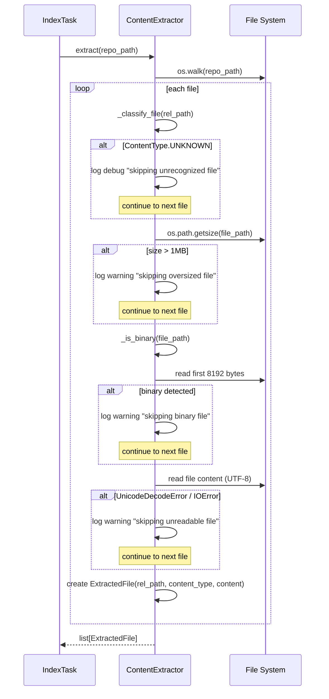
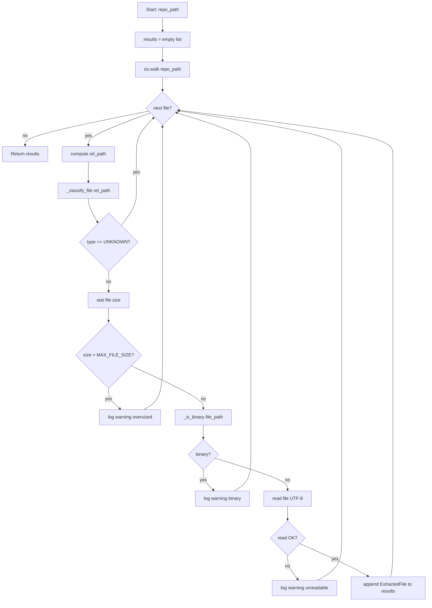

# Feature Detailed Design: Content Extraction (Feature #5)

**Date**: 2026-03-21
**Feature**: #5 — Content Extraction
**Priority**: high
**Dependencies**: #4 (Git Clone & Update) — passing
**Design Reference**: docs/plans/2026-03-21-code-context-retrieval-design.md § 4.1
**SRS Reference**: FR-003

## Context

Content Extraction walks a cloned repository directory tree, classifies each file into one of four content types (code, doc, example, rule), skips binary/oversized files, and reads text content into `ExtractedFile` objects for downstream chunking. This is the bridge between Git cloning and the chunking pipeline.

## Design Alignment

- **Key classes**: `ContentExtractor` (main class), `ExtractedFile` (data class output), `ContentType` (enum)
- **Interaction flow**: `IndexTask` calls `ContentExtractor.extract(repo_path)` → walks directory tree → classifies each file → reads text → returns `list[ExtractedFile]`
- **Third-party deps**: Standard library only (`pathlib`, `os`, `enum`, `dataclasses`, `logging`)
- **Deviations**: None

## SRS Requirement

### FR-003: Content Extraction

**Priority**: Must
**EARS**: When a repository working copy is available, the system shall classify files by type and extract textual content for supported file categories.
**Acceptance Criteria**:
- Given a cloned repository, when content extraction runs, then the system shall identify source files by extension (.java, .py, .ts, .js, .c, .cpp), documentation files (README.md, docs/**/*.md), example files (examples/**/*), and release notes (CHANGELOG.md, RELEASE*.md).
- Given a file type that is not in the supported set, when extraction runs, then the system shall skip the file without error.
- Given binary files or files larger than 1 MB, when extraction runs, then the system shall skip them.
- Given a file that cannot be read (permission denied, encoding error), when extraction runs, then the system shall log a warning and skip the file without failing the entire job.

## Component Data-Flow Diagram

```mermaid
flowchart LR
    RP[/"repo_path (str)"/] --> CE["ContentExtractor.extract()"]
    CE --> WALK["os.walk()"]
    WALK --> CF["classify_file()"]
    CF -->|ContentType| SKIP{skip?}
    SKIP -->|unknown/binary/oversized| LOG["log warning, skip"]
    SKIP -->|valid| READ["read file content (UTF-8)"]
    READ -->|encoding error| LOG
    READ -->|success| EF[/"list[ExtractedFile]"/]

    style RP fill:#333,stroke:#888,stroke-dasharray: 5 5
    style EF fill:#333,stroke:#888,stroke-dasharray: 5 5
```



## Interface Contract

| Method | Signature | Preconditions | Postconditions | Raises |
|--------|-----------|---------------|----------------|--------|
| `extract` | `extract(repo_path: str) -> list[ExtractedFile]` | `repo_path` is a valid directory containing a cloned repo | Returns list of ExtractedFile for all classifiable, readable, non-binary, <=1MB files. Skipped files logged as warnings. | None (never raises; logs and skips on errors) |
| `classify_file` | `_classify_file(rel_path: str) -> ContentType` | `rel_path` is a path relative to repo root | Returns one of `ContentType.CODE`, `DOC`, `EXAMPLE`, `RULE`, or `UNKNOWN` based on extension and path patterns | None |
| `is_binary` | `_is_binary(file_path: str) -> bool` | `file_path` is an absolute path to an existing file | Returns True if file contains null bytes in first 8192 bytes (binary heuristic) | None (returns False on read error) |

**Design rationale**:
- `extract()` never raises — it logs warnings and skips problematic files, so a single bad file does not fail the entire indexing job (per SRS FR-003 acceptance criterion 4)
- Max file size is 1MB (1_048_576 bytes) — per SRS FR-003 acceptance criterion 3
- Binary detection reads first 8KB — standard heuristic used by Git itself
- Classification priority: rule > example > doc > code > unknown (rule patterns are most specific)

## Internal Sequence Diagram



## Algorithm / Core Logic

### extract()

#### Flow Diagram



#### Pseudocode

```
FUNCTION extract(repo_path: str) -> list[ExtractedFile]
  results = []
  FOR root, dirs, files IN os.walk(repo_path):
    // Skip hidden directories (.git, .svn, etc.)
    dirs[:] = [d for d in dirs if not d.startswith('.')]
    FOR file IN files:
      abs_path = os.path.join(root, file)
      rel_path = os.path.relpath(abs_path, repo_path)

      content_type = _classify_file(rel_path)
      IF content_type == UNKNOWN THEN continue

      file_size = os.path.getsize(abs_path)
      IF file_size > MAX_FILE_SIZE THEN
        log.warning("Skipping oversized file: %s (%d bytes)", rel_path, file_size)
        continue

      IF _is_binary(abs_path) THEN
        log.warning("Skipping binary file: %s", rel_path)
        continue

      TRY:
        content = open(abs_path, 'r', encoding='utf-8').read()
      EXCEPT (UnicodeDecodeError, IOError, OSError) AS e:
        log.warning("Skipping unreadable file: %s (%s)", rel_path, e)
        continue

      results.append(ExtractedFile(
        path=rel_path,
        content_type=content_type,
        content=content,
        size=file_size
      ))
  RETURN results
END
```

### _classify_file()

#### Pseudocode

```
FUNCTION _classify_file(rel_path: str) -> ContentType
  // Priority order: rule > example > doc > code > unknown
  normalized = rel_path using forward slashes, lowercase for matching

  // 1. Rule patterns (most specific)
  IF filename matches RULE_PATTERNS:
    // CLAUDE.md, CONTRIBUTING.md, .editorconfig
    // .cursor/rules/** files
    RETURN ContentType.RULE

  // 2. Example patterns
  IF path starts with "examples/" OR
     filename matches *_example.* OR *_demo.*:
    RETURN ContentType.EXAMPLE

  // 3. Documentation patterns
  IF filename is README.md OR CHANGELOG.md OR matches RELEASE*.md OR
     path matches docs/**/*.md OR
     extension in {.md, .rst}:
    RETURN ContentType.DOC

  // 4. Source code patterns
  IF extension in {.py, .java, .js, .ts, .c, .cpp}:
    RETURN ContentType.CODE

  // 5. Unknown
  RETURN ContentType.UNKNOWN
END
```

### _is_binary()

#### Pseudocode

```
FUNCTION _is_binary(file_path: str) -> bool
  TRY:
    WITH open(file_path, 'rb') AS f:
      chunk = f.read(8192)
    RETURN b'\x00' IN chunk
  EXCEPT (IOError, OSError):
    RETURN False
END
```

#### Boundary Decisions

| Parameter | Min | Max | Empty/Null | At boundary |
|-----------|-----|-----|------------|-------------|
| `repo_path` | valid dir | valid dir | empty dir → return [] | dir with 0 files → return [] |
| file size | 0 bytes | 1_048_576 (1MB) | 0-byte file → include (valid text) | exactly 1MB → include; 1MB+1 → skip |
| binary check chunk | 0 bytes | 8192 bytes | empty file → not binary | file < 8192 bytes → read entire file |
| `rel_path` | 1 char | arbitrary | N/A | deeply nested path → works normally |

#### Error Handling

| Condition | Detection | Response | Recovery |
|-----------|-----------|----------|----------|
| File larger than 1MB | `os.path.getsize()` > MAX_FILE_SIZE | Log warning, skip file | Continue to next file |
| Binary file | null byte in first 8192 bytes | Log warning, skip file | Continue to next file |
| Encoding error (non-UTF-8) | `UnicodeDecodeError` during read | Log warning, skip file | Continue to next file |
| Permission denied | `PermissionError` / `IOError` during read | Log warning, skip file | Continue to next file |
| OSError (disk, symlink loop) | `OSError` during read or stat | Log warning, skip file | Continue to next file |
| repo_path doesn't exist | `os.walk()` yields nothing | Return empty list | No error |
| Hidden directories (.git) | Check `d.startswith('.')` | Prune from walk | dirs[:] filter |

## State Diagram

> N/A — stateless feature. ContentExtractor has no lifecycle or mutable state; it processes a directory and returns results.

## Test Inventory

| ID | Category | Traces To | Input / Setup | Expected | Kills Which Bug? |
|----|----------|-----------|---------------|----------|-----------------|
| T1 | happy path | VS-1, FR-003 AC-1 | Temp dir with `app.py`, `Main.java`, `index.js`, `app.ts`, `main.c`, `lib.cpp` | 6 ExtractedFiles, all ContentType.CODE | Missing extension in supported set |
| T2 | happy path | VS-1, FR-003 AC-1 | Temp dir with `README.md`, `docs/guide.md` | 2 ExtractedFiles, both ContentType.DOC | Doc pattern not matching |
| T3 | happy path | VS-1, FR-003 AC-1 | Temp dir with `examples/demo.py` | 1 ExtractedFile, ContentType.EXAMPLE | Example path pattern not matching |
| T4 | happy path | VS-1, FR-003 AC-1 | Temp dir with `CLAUDE.md`, `CONTRIBUTING.md` | 2 ExtractedFiles, both ContentType.RULE | Rule pattern not matching |
| T5 | happy path | VS-1, FR-003 AC-1 | Temp dir with `image.png` (binary content) | 0 ExtractedFiles (skipped) | Binary detection missing |
| T6 | boundary | VS-2, FR-003 AC-2 | Temp dir with `data.csv`, `Makefile`, `config.yaml` | 0 ExtractedFiles (unknown type, skipped) | Missing UNKNOWN type skip |
| T7 | boundary | VS-2, FR-003 AC-3 | Temp dir with file exactly 1MB (1_048_576 bytes) | 1 ExtractedFile (included) | Off-by-one in size check |
| T8 | error | VS-2, FR-003 AC-3 | Temp dir with file 1MB + 1 byte | 0 ExtractedFiles, warning logged | Missing or wrong size threshold |
| T9 | error | VS-3, FR-003 AC-4 | File with Latin-1 encoded content (non-UTF-8 bytes) | 0 ExtractedFiles, warning logged | Missing encoding error handler |
| T10 | boundary | VS-4 | Temp dir with `.git/config` file | 0 ExtractedFiles (hidden dir skipped) | Not pruning .git directory |
| T11 | happy path | VS-1 | Temp dir with `CHANGELOG.md` | 1 ExtractedFile, ContentType.DOC | Missing CHANGELOG pattern |
| T12 | happy path | VS-1 | Temp dir with `.cursor/rules/my-rule.md` | 1 ExtractedFile, ContentType.RULE | Missing cursor rules pattern |
| T13 | boundary | FR-003 AC-1 | Temp dir with `demo_example.py` in root (not in examples/) | 1 ExtractedFile, ContentType.EXAMPLE | Missing *_example.* pattern |
| T14 | boundary | §boundary table | Empty directory (no files) | Empty list returned | Missing empty dir handling |
| T15 | boundary | §boundary table | 0-byte text file (empty .py) | 1 ExtractedFile with empty content | Treating empty as binary |
| T16 | error | §error handling | File with null bytes (binary) not in image extension | 0 ExtractedFiles, warning logged | Null byte detection failure |
| T17 | happy path | VS-1 | Mixed repo: 2 code, 1 doc, 1 example, 1 rule, 1 unknown, 1 binary | 5 ExtractedFiles (unknown+binary skipped) | Integration: classification priority wrong |
| T18 | boundary | §classify_file | `examples/demo_example.py` — matches both example patterns | ContentType.EXAMPLE (not CODE) | Priority ordering wrong |
| T19 | happy path | FR-003 | ExtractedFile has correct path, content_type, content, size fields | All fields populated | Missing data field |

**Negative test ratio**: 7 error/boundary out of 19 total = 37% → adding T20 to reach 40%+

| T20 | error | §error handling | Symlink to non-existent file in repo | 0 ExtractedFiles, warning logged | Missing broken symlink handler |

**Final ratio**: 8 negative / 20 total = 40%

## Tasks

### Task 1: Write failing tests
**Files**: `tests/test_content_extraction.py`, `src/indexing/content_extractor.py` (empty stub)
**Steps**:
1. Create `src/indexing/content_extractor.py` with empty `ContentExtractor` class, `ExtractedFile` dataclass, `ContentType` enum (all stubs that raise `NotImplementedError`)
2. Create `tests/test_content_extraction.py` with tests T1–T20 from Test Inventory:
   - Use `tmp_path` pytest fixture to create temp directories with test files
   - Each test creates files, runs `ContentExtractor().extract(str(tmp_path))`, asserts results
3. Run: `pytest tests/test_content_extraction.py -v`
4. **Expected**: All 20 tests FAIL (NotImplementedError from stubs)

### Task 2: Implement minimal code
**Files**: `src/indexing/content_extractor.py`
**Steps**:
1. Implement `ContentType` enum with CODE, DOC, EXAMPLE, RULE, UNKNOWN values
2. Implement `ExtractedFile` dataclass with `path: str`, `content_type: ContentType`, `content: str`, `size: int`
3. Implement `ContentExtractor.__init__()` with `MAX_FILE_SIZE = 1_048_576`, extension sets, pattern lists
4. Implement `_classify_file()` per Algorithm pseudocode — rule > example > doc > code > unknown
5. Implement `_is_binary()` per Algorithm pseudocode — null byte check in first 8192 bytes
6. Implement `extract()` per Algorithm pseudocode — walk, classify, size check, binary check, read, collect
7. Run: `pytest tests/test_content_extraction.py -v`
8. **Expected**: All 20 tests PASS

### Task 3: Coverage Gate
1. Run: `pytest --cov=src --cov-branch --cov-report=term-missing tests/`
2. Check line >= 90%, branch >= 80%. If below: add tests.
3. Record coverage output as evidence.

### Task 4: Refactor
1. Review for clarity — clean up any duplicated pattern matching logic
2. Ensure logging messages are consistent
3. Run full test suite: `pytest tests/ -v`. All tests PASS.

### Task 5: Mutation Gate
1. Run: `mutmut run --paths-to-mutate=src/indexing/content_extractor.py`
2. Check mutation score >= 80%. If below: improve assertions.
3. Record mutation output as evidence.

### Task 6: Create example
1. Create `examples/05-content-extraction.py` demonstrating ContentExtractor on a temp directory
2. Run example to verify.

## Verification Checklist
- [x] All verification_steps traced to Interface Contract postconditions
  - VS-1 (classify by type) → extract() postcondition
  - VS-2 (skip oversized) → extract() postcondition
  - VS-3 (skip unsupported) → extract() postcondition
  - VS-4 (skip .cursor rules classify) → extract() postcondition
- [x] All verification_steps traced to Test Inventory rows
  - VS-1 → T1, T2, T3, T4, T11, T17
  - VS-2 → T6, T7, T8
  - VS-3 → T5, T9
  - VS-4 → T10, T12
- [x] Algorithm pseudocode covers all non-trivial methods (extract, _classify_file, _is_binary)
- [x] Boundary table covers all algorithm parameters (repo_path, file size, binary chunk, rel_path)
- [x] Error handling table covers all Raises entries (N/A — extract never raises)
- [x] Test Inventory negative ratio >= 40% (8/20 = 40%)
- [x] Every skipped section has explicit "N/A — [reason]" (State Diagram)
