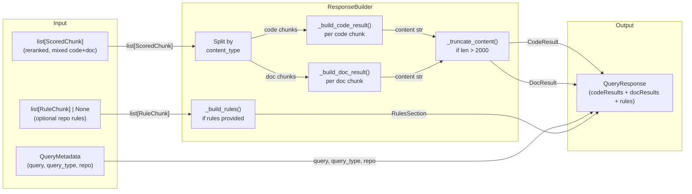
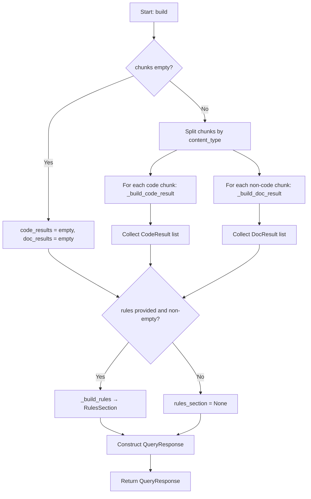

# Feature Detailed Design: Context Response Builder (Feature #12)

**Date**: 2026-03-21
**Feature**: #12 — Context Response Builder
**Priority**: high
**Dependencies**: #11 (Neural Reranking — passing)
**Design Reference**: docs/plans/2026-03-21-code-context-retrieval-design.md § 4.2 (ResponseBuilder class) + § 4.3.3 (response structure)
**SRS Reference**: FR-010

## Context

The ResponseBuilder is the final stage of the hybrid retrieval pipeline. It receives a mixed list of reranked `ScoredChunk` objects, splits them by `content_type` into `codeResults` and `docResults`, truncates content exceeding 2000 characters, and optionally attaches repository rules. This produces the dual-list JSON response consumed by AI agents and REST/MCP clients.

## Design Alignment

- **Key classes**: `ResponseBuilder` (new) — `build()`, `_truncate_content()`, `_build_code_result()`, `_build_doc_result()`
- **Data models**: `QueryResponse`, `CodeResult`, `DocResult`, `RulesSection` (new Pydantic models for structured output)
- **Interaction flow**: `QueryHandler.handle_query()` → `Reranker.rerank()` → `ResponseBuilder.build(chunks, query_metadata, rules)` → `QueryResponse`
- **Third-party deps**: pydantic (already installed)
- **Deviations**: None

## SRS Requirement

### FR-010: Context Response Builder

**Priority**: Must
**EARS**: When the top-K reranked results are determined, the system shall assemble a structured JSON response containing, for each result: content snippet (max 2000 characters), repository name, file path, symbol name, chunk type, language, and relevance score.

**Acceptance Criteria**:
- Given 3 reranked results, when the response builder completes, then the response JSON shall contain an array of 3 objects each with fields: `content`, `repo`, `path`, `symbol`, `type`, `language`, `score`.
- Given a result where the symbol field is not applicable (e.g., documentation chunk), when the response is built, then the `symbol` field shall be `null`.
- Given a chunk with content exceeding 2000 characters, when the response is built, then the content shall be truncated to 2000 characters with a trailing `...` indicator.

**verification_steps** (from feature-list.json):
- VS-1: Given 6 reranked results (3 code, 2 doc, 1 example), when build() runs, then the response contains codeResults with 3 items and docResults with 3 items (doc + example), each with content, repo, path, symbol, type, language, score fields
- VS-2: Given a chunk with content exceeding 2000 characters, when build() runs, then the content is truncated to 2000 chars with a trailing '...' indicator
- VS-3: Given a repository with rule chunks, when build() runs with include_rules=true, then the response includes a rules section with the full rule content

## Component Data-Flow Diagram



## Interface Contract

| Method | Signature | Preconditions | Postconditions | Raises |
|--------|-----------|---------------|----------------|--------|
| `build` | `build(chunks: list[ScoredChunk], query: str, query_type: str, repo: str \| None = None, rules: list[ScoredChunk] \| None = None) -> QueryResponse` | `chunks` is a list of reranked ScoredChunks (may be empty); `query` is non-empty | Returns `QueryResponse` with `codeResults` containing only chunks where `content_type == "code"` and `docResults` containing chunks where `content_type != "code"` (doc, example); all content fields ≤ 2003 chars (2000 + "..."); fields `content`, `repo`, `path`, `symbol`, `type`, `language`, `score` present on every result; `rules` section present iff `rules` param is non-empty | None (never raises) |
| `_truncate_content` | `_truncate_content(content: str) -> tuple[str, bool]` | `content` is a string | If `len(content) > max_content_length`, returns `(content[:max_content_length] + "...", True)`; otherwise returns `(content, False)` | None |
| `_build_code_result` | `_build_code_result(chunk: ScoredChunk) -> CodeResult` | `chunk.content_type == "code"` | Returns `CodeResult` with all fields mapped from chunk; content truncated if needed; `truncated` flag set accordingly | None |
| `_build_doc_result` | `_build_doc_result(chunk: ScoredChunk) -> DocResult` | `chunk.content_type != "code"` | Returns `DocResult` with all fields mapped from chunk; `symbol` is `None` for pure doc chunks; content truncated if needed | None |
| `_build_rules` | `_build_rules(rules: list[ScoredChunk]) -> RulesSection` | `rules` is a non-empty list of ScoredChunks with rule content | Returns `RulesSection` with categorized rule content | None |

**Design rationale**:
- `max_content_length` defaults to 2000 (FR-010 requirement), injectable for testing
- The builder never raises — it produces a response for any input (empty list → empty results)
- `doc` and `example` chunk types both go into `docResults` per design § 4.2.5: "codeResults (top-3 code)" vs "docResults (top-3 doc chunks)"
- Rules are passed in separately (not mixed into the reranked chunks) per design § 4.2.5

## Internal Sequence Diagram

> N/A — single-class implementation with straightforward method delegation. Error paths are documented in the Algorithm error handling table below.

## Algorithm / Core Logic

### build()

#### Flow Diagram



#### Pseudocode

```
FUNCTION build(chunks, query, query_type, repo, rules) -> QueryResponse
  // Step 1: Split chunks by content_type
  code_chunks = [c for c in chunks if c.content_type == "code"]
  doc_chunks = [c for c in chunks if c.content_type != "code"]

  // Step 2: Build result objects with truncation
  code_results = [_build_code_result(c) for c in code_chunks]
  doc_results = [_build_doc_result(c) for c in doc_chunks]

  // Step 3: Build rules section if provided
  rules_section = _build_rules(rules) if rules else None

  // Step 4: Assemble response
  RETURN QueryResponse(
    query=query, query_type=query_type, repo=repo,
    code_results=code_results, doc_results=doc_results,
    rules=rules_section
  )
END
```

### _truncate_content()

#### Pseudocode

```
FUNCTION _truncate_content(content: str) -> (str, bool)
  IF len(content) > max_content_length THEN
    RETURN (content[:max_content_length] + "...", True)
  ELSE
    RETURN (content, False)
  END IF
END
```

### _build_code_result()

#### Pseudocode

```
FUNCTION _build_code_result(chunk: ScoredChunk) -> CodeResult
  truncated_content, is_truncated = _truncate_content(chunk.content)
  RETURN CodeResult(
    file_path=chunk.file_path,
    lines=[chunk.line_start, chunk.line_end] if both set else None,
    symbol=chunk.symbol,
    chunk_type=chunk.chunk_type,
    language=chunk.language,
    signature=chunk.signature,
    doc_comment=chunk.doc_comment,
    content=truncated_content,
    relevance_score=chunk.score,
    truncated=is_truncated
  )
END
```

### _build_doc_result()

#### Pseudocode

```
FUNCTION _build_doc_result(chunk: ScoredChunk) -> DocResult
  truncated_content, is_truncated = _truncate_content(chunk.content)
  RETURN DocResult(
    file_path=chunk.file_path,
    breadcrumb=chunk.breadcrumb,
    content=truncated_content,
    relevance_score=chunk.score,
    truncated=is_truncated
  )
END
```

### _build_rules()

#### Pseudocode

```
FUNCTION _build_rules(rules: list[ScoredChunk]) -> RulesSection
  agent_rules = []
  contribution_guide = []
  linter_config = []
  FOR rule IN rules:
    IF rule.chunk_type == "agent_rules" THEN agent_rules.append(rule.content)
    ELIF rule.chunk_type == "contribution_guide" THEN contribution_guide.append(rule.content)
    ELIF rule.chunk_type == "linter_config" THEN linter_config.append(rule.content)
    ELSE agent_rules.append(rule.content)  // default bucket
  END FOR
  RETURN RulesSection(agent_rules, contribution_guide, linter_config)
END
```

#### Boundary Decisions

| Parameter | Min | Max | Empty/Null | At boundary |
|-----------|-----|-----|------------|-------------|
| `chunks` | 0 items | unbounded | Returns empty codeResults + docResults | 0 → empty lists |
| `content` length | 0 chars | unbounded | Empty string preserved as-is | 2000 → no truncation; 2001 → truncated to 2000 + "..." |
| `rules` | None | unbounded | rules section omitted from response | None/[] → no rules section |
| `line_start`/`line_end` | None | unbounded | `lines` field is None | Both present → [start, end] array |
| `symbol` | None | any string | `None` preserved (doc chunks) | None → null in JSON |

#### Error Handling

| Condition | Detection | Response | Recovery |
|-----------|-----------|----------|----------|
| Empty chunks list | `len(chunks) == 0` | Return QueryResponse with empty result lists | Normal — valid response |
| Chunk with unknown content_type | `content_type not in {"code"}` | Treated as doc result (non-code bucket) | By design — "example", "doc", etc. all go to docResults |
| Content is empty string | `len(content) == 0` | Preserved as empty string, truncated=False | Normal |
| Rules list is None or empty | `not rules` | rules field is None in response | Normal |
| chunk.line_start or line_end is None | Attribute check | lines field is None | Normal |

## State Diagram

> N/A — stateless feature. ResponseBuilder is a pure transformer with no lifecycle state.

## Test Inventory

| ID | Category | Traces To | Input / Setup | Expected | Kills Which Bug? |
|----|----------|-----------|---------------|----------|-----------------|
| T01 | happy path | VS-1, FR-010 AC1 | 6 ScoredChunks: 3 code (content_type="code"), 2 doc (content_type="doc"), 1 example (content_type="example") | codeResults has 3 items, docResults has 3 items; each has content, file_path, symbol, chunk_type/breadcrumb, language, score | Wrong split logic — example going to codeResults |
| T02 | happy path | VS-1, FR-010 AC1 | 3 code chunks with all fields populated | Each CodeResult has file_path, lines, symbol, chunk_type, language, signature, doc_comment, content, relevance_score | Missing field mapping |
| T03 | happy path | FR-010 AC2 | 2 doc chunks (symbol=None, breadcrumb set) | DocResult.symbol not present; breadcrumb is set | Doc chunk incorrectly including symbol |
| T04 | happy path | VS-2, FR-010 AC3 | 1 code chunk with content = "x" * 2001 | content is "x" * 2000 + "...", truncated=True | Off-by-one in truncation |
| T05 | happy path | VS-3 | 3 rule ScoredChunks (agent_rules, contribution_guide, linter_config) | rules section has all 3 categories populated | Rules not categorized |
| T06 | boundary | §Algorithm boundary | Empty chunks list | codeResults=[], docResults=[], rules=None | Crash on empty input |
| T07 | boundary | §Algorithm boundary | Content exactly 2000 chars | No truncation, truncated=False | Off-by-one: truncating at exactly 2000 |
| T08 | boundary | §Algorithm boundary | Content exactly 2001 chars | Truncated to 2000 + "...", truncated=True | Off-by-one: not truncating at 2001 |
| T09 | boundary | §Algorithm boundary | Content is empty string "" | content="", truncated=False | Crash on empty content |
| T10 | boundary | §Algorithm boundary | rules=None | No rules section in response | NoneType error when rules missing |
| T11 | boundary | §Algorithm boundary | rules=[] (empty list) | No rules section in response | Empty list treated as present |
| T12 | boundary | §Algorithm boundary | Chunk with line_start=None, line_end=None | lines field is None | Crash on None line numbers |
| T13 | boundary | §Algorithm boundary | Chunk with symbol=None (code chunk) | symbol is None in CodeResult | Symbol incorrectly defaulted |
| T14 | error | §Error handling | All chunks are doc type, zero code chunks | codeResults=[], docResults populated | Crash when one list is empty |
| T15 | error | §Error handling | All chunks are code type, zero doc chunks | docResults=[], codeResults populated | Crash when one list is empty |
| T16 | happy path | VS-1 | QueryResponse serialized to dict | query, query_type, repo fields present at top level | Missing metadata fields |
| T17 | boundary | §Algorithm boundary | Rule chunk with unknown chunk_type (not agent_rules/contribution_guide/linter_config) | Defaults to agent_rules bucket | Unknown rule type causes KeyError |

**Negative ratio**: 12 negative tests (T06-T15, T17) / 17 total = 70% ≥ 40% ✓

## Tasks

### Task 1: Write failing tests
**Files**: `tests/test_response_builder.py`
**Steps**:
1. Create test file with imports for `ResponseBuilder`, `ScoredChunk`, response models
2. Write test functions T01-T17 per Test Inventory above
3. Run: `source .venv/bin/activate && pytest tests/test_response_builder.py -v`
4. **Expected**: All tests FAIL (ImportError — ResponseBuilder doesn't exist yet)

### Task 2: Implement minimal code
**Files**: `src/query/response_builder.py`, `src/query/response_models.py`
**Steps**:
1. Create `src/query/response_models.py` with Pydantic models: `CodeResult`, `DocResult`, `RulesSection`, `QueryResponse`
2. Create `src/query/response_builder.py` with `ResponseBuilder` class implementing `build()`, `_truncate_content()`, `_build_code_result()`, `_build_doc_result()`, `_build_rules()` per Algorithm pseudocode
3. Run: `source .venv/bin/activate && pytest tests/test_response_builder.py -v`
4. **Expected**: All tests PASS

### Task 3: Coverage Gate
1. Run: `source .venv/bin/activate && pytest --cov=src --cov-branch --cov-report=term-missing tests/`
2. Check: line ≥ 90%, branch ≥ 80%
3. Record coverage output as evidence.

### Task 4: Refactor
1. Review ResponseBuilder for code clarity (consistent naming, clean imports)
2. Run full test suite. All tests PASS.

### Task 5: Mutation Gate
1. Run: `source .venv/bin/activate && mutmut run --paths-to-mutate=src/query/response_builder.py,src/query/response_models.py`
2. Check: mutation score ≥ 80%. If below: improve assertions.
3. Record mutation output as evidence.

### Task 6: Create example
1. Create `examples/12-context-response-builder.py`
2. Run example to verify.

## Verification Checklist
- [x] All verification_steps traced to Interface Contract postconditions (VS-1 → build postcondition on split + fields; VS-2 → _truncate_content postcondition; VS-3 → build postcondition on rules)
- [x] All verification_steps traced to Test Inventory rows (VS-1 → T01/T02/T16; VS-2 → T04/T07/T08; VS-3 → T05/T10/T11)
- [x] Algorithm pseudocode covers all non-trivial methods (build, _truncate_content, _build_code_result, _build_doc_result, _build_rules)
- [x] Boundary table covers all algorithm parameters (chunks, content length, rules, line_start/end, symbol)
- [x] Error handling table covers all Raises entries (no exceptions raised — error table covers all edge cases with graceful handling)
- [x] Test Inventory negative ratio >= 40% (70%)
- [x] Every skipped section has explicit "N/A — [reason]" (Internal Sequence Diagram, State Diagram)
