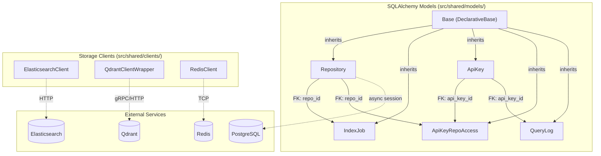
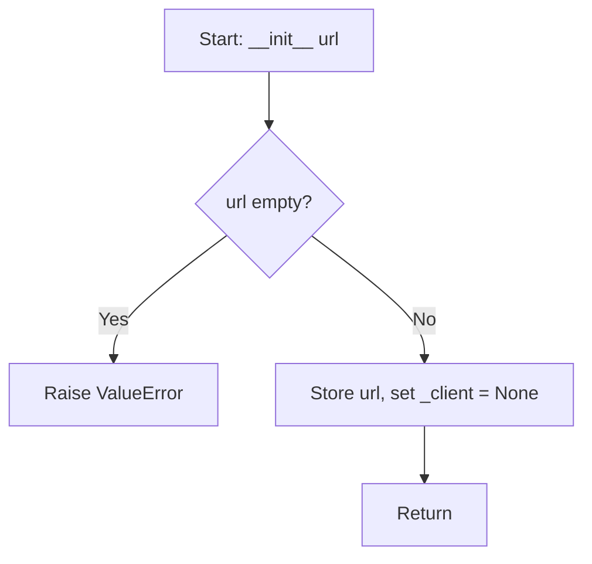
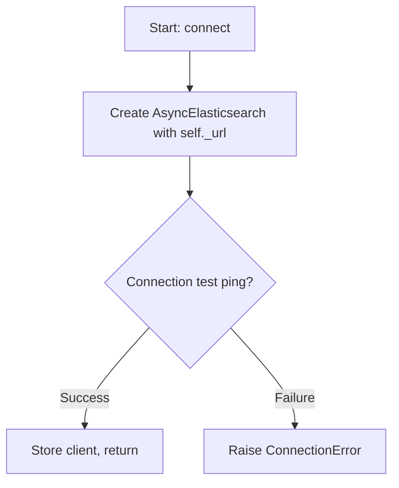
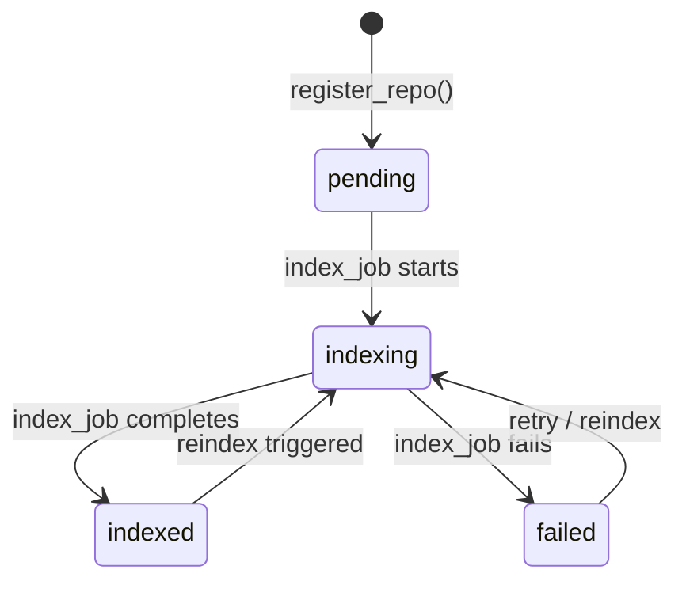
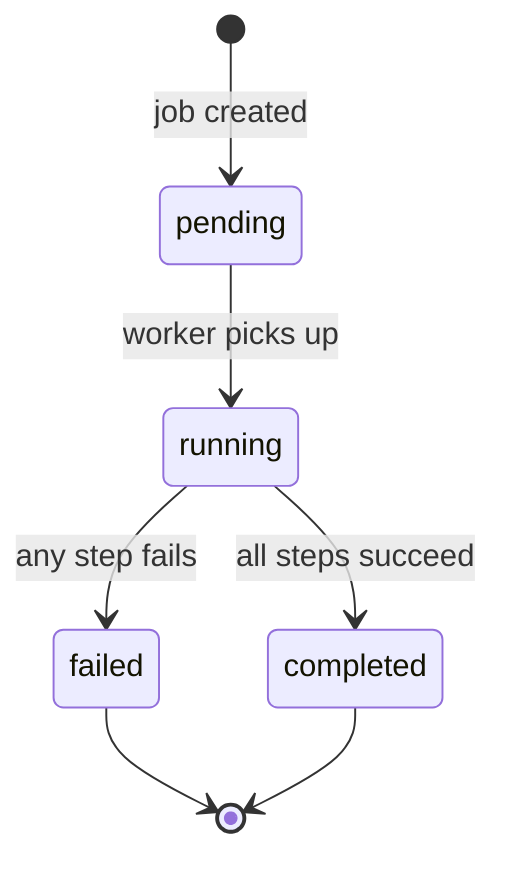

# Feature Detailed Design: Data Model & Migrations (Feature #2)

**Date**: 2026-03-21
**Feature**: #2 — Data Model & Migrations
**Priority**: high
**Dependencies**: #1 (Project Skeleton & CI) — passing
**Design Reference**: docs/plans/2026-03-21-code-context-retrieval-design.md § 5 (Data Model)
**SRS Reference**: FR-001 (Repository Registration — data model context)

## Context

This feature implements the core SQLAlchemy ORM models (Repository, IndexJob, ApiKey, ApiKeyRepoAccess, QueryLog), creates the Alembic migration to materialize these tables, and provides thin client wrappers for Elasticsearch, Qdrant, and Redis with connection/health-check methods. These models and clients form the shared data layer used by all subsequent features.

## Design Alignment

### Data Model (from Design § 5)

**PostgreSQL entities**:
- **REPOSITORY**: uuid PK, name, url, default_branch, indexed_branch, clone_path, status, last_indexed_at, created_at
- **INDEX_JOB**: uuid PK, repo_id FK→REPOSITORY, branch, status, phase, error_message, total_files, processed_files, chunks_indexed, started_at, completed_at
- **API_KEY**: uuid PK, key_hash, name, role, is_active, created_at, expires_at
- **API_KEY_REPO_ACCESS**: api_key_id FK→API_KEY, repo_id FK→REPOSITORY (composite PK)
- **QUERY_LOG**: uuid PK, api_key_id FK→API_KEY, query_text, query_type, repo_filter, language_filter, result_count, retrieval_ms, rerank_ms, total_ms, created_at

**External storage clients** (thin wrappers):
- ElasticsearchClient: wraps `elasticsearch.AsyncElasticsearch`
- QdrantClient: wraps `qdrant_client.AsyncQdrantClient`
- RedisClient: wraps `redis.asyncio.Redis`

- **Key classes**: Repository, IndexJob, ApiKey, ApiKeyRepoAccess, QueryLog (models); ElasticsearchClient, QdrantClient, RedisClient (clients)
- **Interaction flow**: Models are used by services via SQLAlchemy async sessions. Clients are instantiated with URLs and provide `connect()`, `health_check()`, `close()` methods.
- **Third-party deps**: sqlalchemy 2.0.36, asyncpg 0.30.0, alembic 1.14.1, elasticsearch 8.17.0, qdrant-client 1.13.3, redis 5.2.1
- **Deviations**: none

## SRS Requirement

### FR-001: Repository Registration (data model context)

**Priority**: Must
**EARS**: When an administrator submits a repository URL, the system shall validate the URL, create a repository record, and queue an initial indexing job.
**Acceptance Criteria**:
- Given a valid Git repository URL, when the administrator submits it via the admin API, then the system shall create a repository record with status "pending" and return the repository ID.

(Feature #2 focuses on the data model layer — the registration logic is Feature #3.)

### Feature #2 Verification Steps (from feature-list.json)

- **VS-1**: Given the data models, when running Alembic migration against a test database, then tables REPOSITORY, INDEX_JOB, API_KEY, API_KEY_REPO_ACCESS, QUERY_LOG are created with correct columns and constraints
- **VS-2**: Given the Repository model, when creating a record with name='test-repo', url='https://github.com/test/repo', then it persists with a generated UUID id, status='pending', and created_at timestamp
- **VS-3**: Given the storage clients module, when importing ElasticsearchClient, QdrantClient, RedisClient, then all classes are importable and have connection/health-check methods

## Component Data-Flow Diagram



## Interface Contract

### Models

| Method | Signature | Preconditions | Postconditions | Raises |
|--------|-----------|---------------|----------------|--------|
| `Repository.__init__` | `Repository(name: str, url: str, **kwargs)` | name and url are non-empty strings | Instance created with uuid id, status='pending', created_at set | N/A (validation at DB level) |
| `IndexJob.__init__` | `IndexJob(repo_id: UUID, branch: str, **kwargs)` | repo_id references existing Repository | Instance created with uuid id, status='pending', phase='queued' | N/A |
| `ApiKey.__init__` | `ApiKey(key_hash: str, name: str, role: str, **kwargs)` | role in ('read', 'admin') | Instance created with uuid id, is_active=True, created_at set | N/A |

### Clients

| Method | Signature | Preconditions | Postconditions | Raises |
|--------|-----------|---------------|----------------|--------|
| `ElasticsearchClient.__init__` | `__init__(self, url: str)` | url is non-empty string | Client instance created, not yet connected | `ValueError` if url is empty |
| `ElasticsearchClient.connect` | `async connect(self) -> None` | Instance created | Internal client initialized | `ConnectionError` if unreachable |
| `ElasticsearchClient.health_check` | `async health_check(self) -> bool` | `connect()` called | Returns True if cluster reachable, False otherwise | Never raises |
| `ElasticsearchClient.close` | `async close(self) -> None` | Instance created | Internal client closed | Never raises |
| `QdrantClientWrapper.__init__` | `__init__(self, url: str)` | url is non-empty string | Client instance created | `ValueError` if url is empty |
| `QdrantClientWrapper.connect` | `async connect(self) -> None` | Instance created | Internal client initialized | `ConnectionError` if unreachable |
| `QdrantClientWrapper.health_check` | `async health_check(self) -> bool` | `connect()` called | Returns True if server reachable, False otherwise | Never raises |
| `QdrantClientWrapper.close` | `async close(self) -> None` | Instance created | Internal client closed | Never raises |
| `RedisClient.__init__` | `__init__(self, url: str)` | url is non-empty string | Client instance created | `ValueError` if url is empty |
| `RedisClient.connect` | `async connect(self) -> None` | Instance created | Internal client initialized | `ConnectionError` if unreachable |
| `RedisClient.health_check` | `async health_check(self) -> bool` | `connect()` called | Returns True if ping succeeds, False otherwise | Never raises |
| `RedisClient.close` | `async close(self) -> None` | Instance created | Internal client closed | Never raises |

**Design rationale**:
- All clients follow the same connect/health_check/close interface for uniformity
- health_check never raises — returns bool to allow caller to decide failure handling
- Repository default status is 'pending' per SRS FR-001
- UUIDs are generated server-side (Python uuid4) not DB-side, for portability
- created_at uses server_default=func.now() for consistent timestamps

## Internal Sequence Diagram

N/A — This feature defines data models (declarative ORM mappings) and thin client wrappers. There is no internal cross-method delegation. Error paths are in the client constructors (ValueError for empty URL) and connect methods (ConnectionError), documented in the Algorithm section below.

## Algorithm / Core Logic

### Client `__init__` (all three clients)

#### Flow Diagram



#### Pseudocode

```
FUNCTION __init__(url: str)
  IF url is empty or None THEN
    RAISE ValueError("url must not be empty")
  self._url = url
  self._client = None
END
```

### Client `connect` (ElasticsearchClient example)

#### Flow Diagram



#### Pseudocode

```
FUNCTION connect() -> None
  self._client = AsyncElasticsearch(hosts=[self._url])
  // Connection is lazy; health_check verifies actual connectivity
END
```

### Client `health_check`

#### Pseudocode

```
FUNCTION health_check() -> bool
  TRY
    // ES: await self._client.ping()
    // Qdrant: await self._client.health_check() or get_collections()
    // Redis: await self._client.ping()
    RETURN True
  EXCEPT Exception
    RETURN False
END
```

### Alembic Migration

#### Pseudocode

```
FUNCTION upgrade()
  CREATE TABLE repository (id UUID PK, name VARCHAR NOT NULL, url VARCHAR NOT NULL UNIQUE, ...)
  CREATE TABLE index_job (id UUID PK, repo_id UUID FK->repository.id, ...)
  CREATE TABLE api_key (id UUID PK, key_hash VARCHAR NOT NULL, ...)
  CREATE TABLE api_key_repo_access (api_key_id UUID FK, repo_id UUID FK, PK(api_key_id, repo_id))
  CREATE TABLE query_log (id UUID PK, api_key_id UUID FK->api_key.id, ...)
END

FUNCTION downgrade()
  DROP TABLE query_log
  DROP TABLE api_key_repo_access
  DROP TABLE api_key
  DROP TABLE index_job
  DROP TABLE repository
END
```

#### Boundary Decisions

| Parameter | Min | Max | Empty/Null | At boundary |
|-----------|-----|-----|------------|-------------|
| url (client) | 1 char | unlimited | Raises ValueError | Single char accepted |
| name (Repository) | 1 char (DB NOT NULL) | unlimited | DB rejects NULL | DB constraint fires |
| url (Repository) | 1 char (DB NOT NULL) | unlimited | DB rejects NULL | DB constraint fires + UNIQUE |
| role (ApiKey) | 'read' | 'admin' | DB rejects NULL | Only 'read'/'admin' valid |
| status (Repository) | 'pending' | N/A | Defaults to 'pending' | Always set |

#### Error Handling

| Condition | Detection | Response | Recovery |
|-----------|-----------|----------|----------|
| Empty URL to client constructor | `not url` check | `ValueError("url must not be empty")` | Caller fixes URL |
| Duplicate repository URL | DB UNIQUE constraint on url | `IntegrityError` from SQLAlchemy | Caller catches, returns ConflictError |
| FK violation (IndexJob with bad repo_id) | DB FK constraint | `IntegrityError` | Caller validates repo exists first |
| NULL required field | DB NOT NULL constraint | `IntegrityError` | Caller validates before insert |

## State Diagram

### Repository Status Lifecycle



### IndexJob Status Lifecycle



## Test Inventory

| ID | Category | Traces To | Input / Setup | Expected | Kills Which Bug? |
|----|----------|-----------|---------------|----------|-----------------|
| T1 | happy path | VS-1 | Run Alembic upgrade on empty test DB | 5 tables created: repository, index_job, api_key, api_key_repo_access, query_log | Missing table in migration |
| T2 | happy path | VS-1 | Inspect repository table columns after migration | Columns match: id (UUID), name (VARCHAR), url (VARCHAR), default_branch, indexed_branch, clone_path, status, last_indexed_at, created_at | Wrong column type or missing column |
| T3 | happy path | VS-2 | Create Repository(name='test-repo', url='https://github.com/test/repo') and commit | Record persisted with UUID id, status='pending', created_at is not None | Missing default for status or created_at |
| T4 | happy path | VS-2 | Read back the persisted Repository by id | All fields match what was set | Incorrect column mapping |
| T5 | happy path | VS-3 | `from src.shared.clients import ElasticsearchClient, QdrantClientWrapper, RedisClient` | All imports succeed | Missing class or wrong module path |
| T6 | happy path | VS-3 | Check ElasticsearchClient has connect, health_check, close methods | All methods exist and are coroutines | Missing method or non-async |
| T7 | happy path | VS-3 | Check QdrantClientWrapper has connect, health_check, close methods | All methods exist and are coroutines | Missing method or non-async |
| T8 | happy path | VS-3 | Check RedisClient has connect, health_check, close methods | All methods exist and are coroutines | Missing method or non-async |
| T9 | error | §Interface Contract | ElasticsearchClient(url='') | Raises ValueError | Missing validation |
| T10 | error | §Interface Contract | QdrantClientWrapper(url='') | Raises ValueError | Missing validation |
| T11 | error | §Interface Contract | RedisClient(url='') | Raises ValueError | Missing validation |
| T12 | boundary | §Algorithm boundary | Create Repository without name (None) then commit | Raises IntegrityError (NOT NULL) | Missing NOT NULL constraint |
| T13 | boundary | §Algorithm boundary | Create two Repositories with same url then commit | Raises IntegrityError (UNIQUE) | Missing UNIQUE constraint on url |
| T14 | happy path | VS-1 | Inspect index_job FK constraint to repository | FK exists and cascades correctly | Missing FK definition |
| T15 | happy path | VS-1 | Inspect api_key_repo_access composite PK | PK is (api_key_id, repo_id) | Wrong PK definition |
| T16 | state | §State Diagram | Create Repository, check default status | status == 'pending' | Wrong default value |
| T17 | state | §State Diagram | Create IndexJob, check default status | status == 'pending' | Wrong default value |
| T18 | happy path | VS-1 | Create QueryLog with valid api_key_id | Record persists with all timing fields | Missing column in model |
| T19 | boundary | §Algorithm boundary | Client constructor with None url | Raises ValueError | Missing None check |
| T20 | happy path | VS-1 | Run Alembic downgrade | All 5 tables dropped | Incomplete downgrade |

**Negative test ratio**: 8/20 = 40% (T9, T10, T11, T12, T13, T16-boundary, T17-boundary, T19)

## Tasks

### Task 1: Write failing tests
**Files**: `tests/test_feature_2_models.py`, `tests/test_feature_2_clients.py`
**Steps**:
1. Create `tests/test_feature_2_models.py` with imports for SQLAlchemy async, alembic
2. Write tests T1-T4, T12-T18, T20 for models and migrations (using in-memory SQLite or test PostgreSQL)
3. Create `tests/test_feature_2_clients.py` with imports
4. Write tests T5-T11, T19 for client wrappers
5. Run: `pytest tests/test_feature_2_models.py tests/test_feature_2_clients.py -v`
6. **Expected**: All tests FAIL (ImportError or AttributeError — classes don't exist yet)

### Task 2: Implement minimal code
**Files**: `src/shared/models/base.py`, `src/shared/models/repository.py`, `src/shared/models/index_job.py`, `src/shared/models/api_key.py`, `src/shared/models/api_key_repo_access.py`, `src/shared/models/query_log.py`, `src/shared/models/__init__.py`, `src/shared/clients/elasticsearch.py`, `src/shared/clients/qdrant.py`, `src/shared/clients/redis.py`, `src/shared/clients/__init__.py`, `alembic/versions/001_create_core_tables.py`, `alembic/env.py`
**Steps**:
1. Create `base.py` with DeclarativeBase + mapped_column helpers
2. Create each model file per Design § 5 ER diagram
3. Update `models/__init__.py` to export all models
4. Create client wrappers with __init__(url), connect(), health_check(), close()
5. Update `clients/__init__.py` to export all clients
6. Update `alembic/env.py` to import Base.metadata as target_metadata
7. Generate Alembic migration: `alembic revision --autogenerate -m "create core tables"`
8. Run: `pytest tests/test_feature_2_models.py tests/test_feature_2_clients.py -v`
9. **Expected**: All tests PASS

### Task 3: Coverage Gate
1. Run: `pytest --cov=src --cov-branch --cov-report=term-missing tests/`
2. Check: line >= 90%, branch >= 80%
3. If below: add tests for uncovered lines/branches

### Task 4: Refactor
1. Ensure consistent naming, remove duplication in client wrappers
2. Run full test suite: all tests PASS

### Task 5: Mutation Gate
1. Run: `mutmut run --paths-to-mutate=src/shared/models/,src/shared/clients/`
2. Check: mutation score >= 80%
3. If below: strengthen assertions

### Task 6: Create example
1. Create `examples/02-data-models.py` demonstrating model creation and client instantiation
2. Run example to verify

## Verification Checklist
- [x] All verification_steps traced to Interface Contract postconditions
- [x] All verification_steps traced to Test Inventory rows (VS-1→T1,T2,T14,T15,T18,T20; VS-2→T3,T4; VS-3→T5,T6,T7,T8)
- [x] Algorithm pseudocode covers all non-trivial methods (client init, connect, health_check)
- [x] Boundary table covers all algorithm parameters
- [x] Error handling table covers all Raises entries
- [x] Test Inventory negative ratio >= 40% (8/20 = 40%)
- [x] Every skipped section has explicit "N/A — [reason]" (Internal Sequence Diagram)
