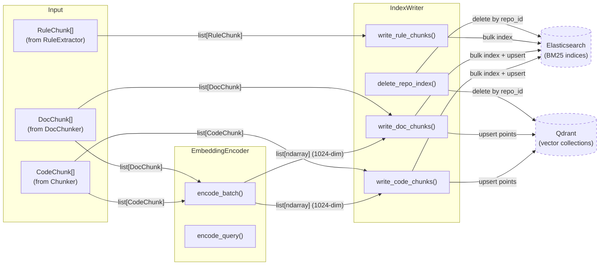
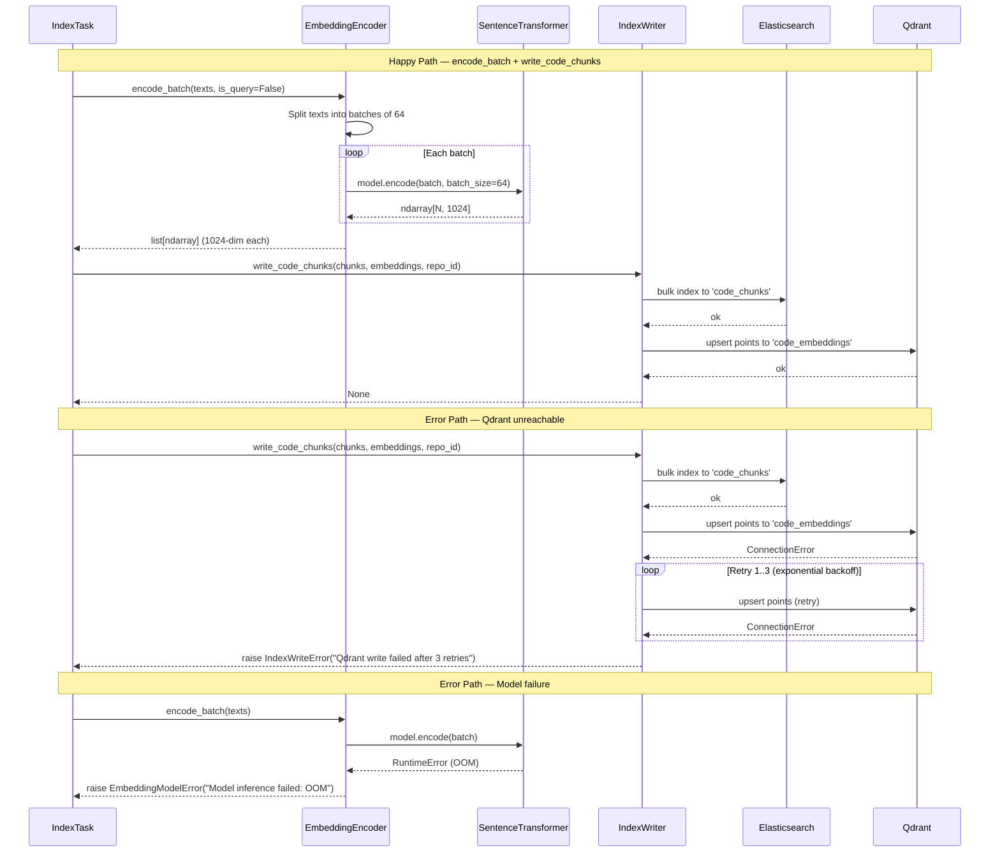
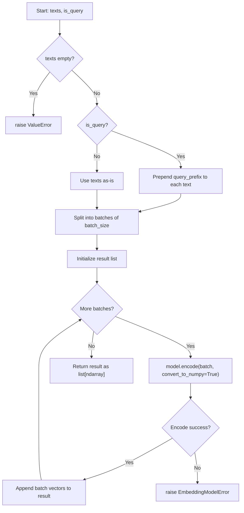

# Feature Detailed Design: Embedding Generation (Feature #7)

**Date**: 2026-03-21
**Feature**: #7 — Embedding Generation
**Priority**: high
**Dependencies**: #6 (Code Chunking)
**Design Reference**: docs/plans/2026-03-21-code-context-retrieval-design.md § 4.1
**SRS Reference**: FR-005

## Context

Implement `EmbeddingEncoder` using CodeSage-large via sentence-transformers, producing 1024-dimensional float32 vectors for code/doc chunks (batch indexing) and queries (single query encoding with instruction prefix). Also implement `IndexWriter` to persist chunks + embeddings to Elasticsearch and Qdrant.

## Design Alignment

- **Key classes**:
  - `EmbeddingEncoder` — loads CodeSage-large model, provides `encode_batch()` for document chunks and `encode_query()` for search queries with instruction prefix
  - `IndexWriter` — writes code chunks + embeddings to ES index `code_chunks` and Qdrant collection `code_embeddings`, doc chunks to `doc_chunks`/`doc_embeddings`, rule chunks to `rule_chunks` (ES only, no vector)
- **Interaction flow**: IndexTask → EmbeddingEncoder.encode_batch(chunks) → IndexWriter.write_code_chunks(chunks, embeddings) → ES + Qdrant
- **Third-party deps**: sentence-transformers 3.4.x (CodeSage-large), elasticsearch-py, qdrant-client
- **Deviations**: None — follows §4.1 class diagram exactly

### Embedding Strategy (from §4.1.8)

| Chunk Type | Embedding Input | Strategy |
|------------|----------------|----------|
| L3 function | signature + doc_comment + content | Full function body for maximum semantic signal |
| L2 class | signature + method_signatures + doc_comment | Method list captures class purpose without body noise |
| L1 file | file_path + imports + top_level_symbols | Structural overview for file-level matching |
| Doc chunk | breadcrumb + content | Heading context anchors section semantics |

### Instruction Prefixes (Asymmetric Encoding)
- **Query**: `"Represent this code search query: "` + query text
- **Document**: no prefix (raw content)
- Batch size: 64 chunks per batch

## SRS Requirement

### FR-005: Embedding Generation

**Priority**: Must
**EARS**: When code chunks are produced, the system shall generate dense vector embeddings for each chunk using the BGE code embedding model in offline batch mode and write them to the Qdrant collection.
**Acceptance Criteria**:
- Given a set of code chunks from a repository, when the embedding batch job completes, then each chunk shall have a 1024-dimensional float32 vector stored in Qdrant with the chunk's metadata as payload.
- Given embedding generation for a repository with 10,000 chunks, when the batch job completes, then all 10,000 vectors shall be present in the Qdrant collection.
- Given an embedding generation failure (model error, OOM), then the system shall mark the indexing job as "failed" and not write partial results.
- Given that Qdrant is unreachable during the write phase, then the system shall retry up to 3 times with exponential backoff, and mark the job as "failed" if all retries fail.

## Component Data-Flow Diagram



## Interface Contract

| Method | Signature | Preconditions | Postconditions | Raises |
|--------|-----------|---------------|----------------|--------|
| `EmbeddingEncoder.__init__` | `__init__(model_name: str = "Salesforce/codesage-large", batch_size: int = 64, device: str \| None = None)` | model_name is a valid sentence-transformers model identifier | Model loaded and ready; query_prefix set to `"Represent this code search query: "` | `EmbeddingModelError` if model cannot be loaded |
| `EmbeddingEncoder.encode_batch` | `encode_batch(texts: list[str], is_query: bool = False) -> list[np.ndarray]` | texts is a non-empty list of strings | Returns list of 1024-dim float32 ndarray vectors, one per input text. If is_query=True, prepends query_prefix. | `EmbeddingModelError` on model inference failure; `ValueError` if texts is empty |
| `EmbeddingEncoder.encode_query` | `encode_query(query: str) -> np.ndarray` | query is a non-empty string | Returns single 1024-dim float32 ndarray with query_prefix prepended | `EmbeddingModelError` on model inference failure; `ValueError` if query is empty |
| `IndexWriter.__init__` | `__init__(es_client: ElasticsearchClient, qdrant_client: QdrantClientWrapper)` | Both clients are initialized (connected) | IndexWriter ready to write | — |
| `IndexWriter.write_code_chunks` | `write_code_chunks(chunks: list[CodeChunk], embeddings: list[np.ndarray], repo_id: str) -> None` | len(chunks) == len(embeddings); all embeddings are 1024-dim float32 | All chunks indexed in ES `code_chunks` index; all embeddings upserted in Qdrant `code_embeddings` collection with chunk metadata as payload | `IndexWriteError` on ES/Qdrant failure after 3 retries |
| `IndexWriter.write_doc_chunks` | `write_doc_chunks(chunks: list[DocChunk], embeddings: list[np.ndarray], repo_id: str) -> None` | len(chunks) == len(embeddings); all embeddings are 1024-dim float32 | All chunks indexed in ES `doc_chunks` index; all embeddings upserted in Qdrant `doc_embeddings` collection | `IndexWriteError` on ES/Qdrant failure after 3 retries |
| `IndexWriter.write_rule_chunks` | `write_rule_chunks(chunks: list[RuleChunk], repo_id: str) -> None` | chunks is a list of RuleChunk | All chunks indexed in ES `rule_chunks` index (no Qdrant — keyword search only per §4.1) | `IndexWriteError` on ES failure after 3 retries |
| `IndexWriter.delete_repo_index` | `delete_repo_index(repo_id: str, branch: str) -> None` | repo_id and branch are valid strings | All chunks for repo_id+branch removed from all ES indices and Qdrant collections | `IndexWriteError` on ES/Qdrant failure after 3 retries |

**Design rationale**:
- `encode_batch` accepts raw text strings rather than chunk objects to decouple embedding from chunk structure — the caller prepares embedding input per the strategy table above
- `is_query` flag on encode_batch allows reuse for both document and query encoding
- `encode_query` is a convenience wrapper calling `encode_batch([query], is_query=True)[0]`
- Retry with exponential backoff (3 attempts) per SRS AC-4 for Qdrant/ES unreachable
- `write_rule_chunks` has no embeddings param — rules are keyword-only per design §4.1

## Internal Sequence Diagram



## Algorithm / Core Logic

### EmbeddingEncoder.encode_batch

#### Flow Diagram



#### Pseudocode

```
FUNCTION encode_batch(texts: list[str], is_query: bool = False) -> list[ndarray]
  IF len(texts) == 0 THEN raise ValueError("texts must be non-empty")

  // Step 1: Apply instruction prefix for queries
  IF is_query THEN
    prepared = [query_prefix + t for t in texts]
  ELSE
    prepared = texts

  // Step 2: Encode in batches
  TRY
    all_vectors = model.encode(prepared, batch_size=batch_size, convert_to_numpy=True, normalize_embeddings=True)
  CATCH Exception as e
    raise EmbeddingModelError(f"Model inference failed: {e}")

  // Step 3: Return as list of individual vectors
  RETURN [all_vectors[i] for i in range(len(all_vectors))]
END
```

#### Boundary Decisions

| Parameter | Min | Max | Empty/Null | At boundary |
|-----------|-----|-----|------------|-------------|
| texts | 1 element | 10,000+ elements | raise ValueError | 1 element → single vector returned |
| texts[i] | "" (empty string) | very long string | Model handles gracefully (truncates) | Empty string → valid but low-quality embedding |
| batch_size | 1 | 64 (default) | N/A (constructor default) | 1 → one-at-a-time encoding (slow but valid) |
| is_query | False | True | N/A (default False) | True → prefix prepended to all texts |

#### Error Handling

| Condition | Detection | Response | Recovery |
|-----------|-----------|----------|----------|
| Empty texts list | `len(texts) == 0` | `ValueError("texts must be non-empty")` | Caller validates input before calling |
| Model load failure | SentenceTransformer constructor raises | `EmbeddingModelError("Failed to load model: ...")` | Caller marks job as failed |
| Model inference OOM | RuntimeError during encode | `EmbeddingModelError("Model inference failed: ...")` | Caller marks job as failed, no partial writes |
| Model inference other error | Any exception during encode | `EmbeddingModelError("Model inference failed: ...")` | Caller marks job as failed |

### IndexWriter.write_code_chunks

#### Flow Diagram

```mermaid
flowchart TD
    A["Start: chunks, embeddings, repo_id"] --> B{len(chunks) == len(embeddings)?}
    B -->|No| C["raise ValueError"]
    B -->|Yes| D{chunks empty?}
    D -->|Yes| E["Return (no-op)"]
    D -->|No| F["Build ES bulk actions from chunks"]
    F --> G["ES bulk index to 'code_chunks'"]
    G --> H{ES success?}
    H -->|No| I["Retry up to 3 times (exp backoff)"]
    I --> J{All retries failed?}
    J -->|Yes| K["raise IndexWriteError"]
    J -->|No| G
    H -->|Yes| L["Build Qdrant points (id, vector, payload)"]
    L --> M["Qdrant upsert to 'code_embeddings'"]
    M --> N{Qdrant success?}
    N -->|No| O["Retry up to 3 times (exp backoff)"]
    O --> P{All retries failed?}
    P -->|Yes| Q["raise IndexWriteError"]
    P -->|No| M
    N -->|Yes| R["Return None"]
```

#### Pseudocode

```
FUNCTION write_code_chunks(chunks: list[CodeChunk], embeddings: list[ndarray], repo_id: str) -> None
  IF len(chunks) != len(embeddings) THEN raise ValueError("chunks and embeddings must have same length")
  IF len(chunks) == 0 THEN RETURN  // no-op

  // Step 1: Write to Elasticsearch
  actions = []
  FOR chunk, embedding IN zip(chunks, embeddings):
    action = {
      "_index": "code_chunks",
      "_id": chunk.chunk_id,
      "_source": {
        "repo_id": repo_id,
        "file_path": chunk.file_path,
        "language": chunk.language,
        "chunk_type": chunk.chunk_type,
        "symbol": chunk.symbol,
        "signature": chunk.signature,
        "doc_comment": chunk.doc_comment,
        "content": chunk.content,
        "line_start": chunk.line_start,
        "line_end": chunk.line_end,
        "parent_class": chunk.parent_class,
        "branch": chunk.branch,
      }
    }
    actions.append(action)
  _retry_write(lambda: es_client.bulk(actions), "ES code_chunks")

  // Step 2: Write to Qdrant
  points = []
  FOR chunk, embedding IN zip(chunks, embeddings):
    point = PointStruct(
      id=chunk.chunk_id,
      vector=embedding.tolist(),
      payload={
        "repo_id": repo_id,
        "file_path": chunk.file_path,
        "language": chunk.language,
        "chunk_type": chunk.chunk_type,
        "symbol": chunk.symbol,
        "branch": chunk.branch,
      }
    )
    points.append(point)
  _retry_write(lambda: qdrant_client.upsert("code_embeddings", points), "Qdrant code_embeddings")
END

FUNCTION _retry_write(operation: Callable, target: str, max_retries: int = 3) -> None
  FOR attempt IN 1..max_retries:
    TRY
      operation()
      RETURN
    CATCH ConnectionError:
      IF attempt == max_retries THEN
        raise IndexWriteError(f"{target} write failed after {max_retries} retries")
      sleep(2 ** attempt * 0.5)  // exponential backoff: 1s, 2s, 4s
END
```

#### Boundary Decisions

| Parameter | Min | Max | Empty/Null | At boundary |
|-----------|-----|-----|------------|-------------|
| chunks | 0 | 10,000+ | Empty → no-op return | 1 chunk → single ES doc + single Qdrant point |
| embeddings | Must match len(chunks) | Same | Empty → no-op (if chunks empty) | Mismatch → ValueError |
| repo_id | Non-empty string | — | — | — |
| retry count | 1 | 3 | — | 3rd failure → raise IndexWriteError |

#### Error Handling

| Condition | Detection | Response | Recovery |
|-----------|-----------|----------|----------|
| chunks/embeddings length mismatch | `len(chunks) != len(embeddings)` | `ValueError("chunks and embeddings must have same length")` | Caller fixes input |
| ES unreachable | ConnectionError on bulk | Retry 3x with exp backoff, then `IndexWriteError` | Caller marks job failed |
| Qdrant unreachable | ConnectionError on upsert | Retry 3x with exp backoff, then `IndexWriteError` | Caller marks job failed |
| ES partial bulk failure | Bulk response has errors | `IndexWriteError` with details | Caller marks job failed |

### IndexWriter.delete_repo_index

#### Pseudocode

```
FUNCTION delete_repo_index(repo_id: str, branch: str) -> None
  // Delete from all ES indices
  FOR index IN ["code_chunks", "doc_chunks", "rule_chunks"]:
    _retry_write(lambda: es_client.delete_by_query(index, {"repo_id": repo_id, "branch": branch}), f"ES {index}")

  // Delete from all Qdrant collections
  FOR collection IN ["code_embeddings", "doc_embeddings"]:
    _retry_write(lambda: qdrant_client.delete(collection, {"repo_id": repo_id, "branch": branch}), f"Qdrant {collection}")
END
```

> write_doc_chunks and write_rule_chunks follow the same pattern as write_code_chunks. write_doc_chunks writes to ES `doc_chunks` + Qdrant `doc_embeddings`. write_rule_chunks writes to ES `rule_chunks` only (no Qdrant per design §4.1).

## State Diagram

> N/A — stateless feature. EmbeddingEncoder and IndexWriter are stateless service objects (no lifecycle transitions).

## Test Inventory

| ID | Category | Traces To | Input / Setup | Expected | Kills Which Bug? |
|----|----------|-----------|---------------|----------|-----------------|
| T1 | happy path | VS-1, FR-005 AC-1 | 10 CodeChunks with varied content | encode_batch returns 10 vectors, each 1024-dim float32 | Wrong dimensionality or dtype |
| T2 | happy path | VS-2, FR-005 AC-1 | Query "how to configure timeout" | encode_query returns 1024-dim vector with prefix prepended | Missing query prefix |
| T3 | happy path | VS-3, FR-005 AC-1 | 100 chunks + 100 embeddings | write_code_chunks stores all 100 in ES + Qdrant with correct metadata | Missing ES or Qdrant write |
| T4 | happy path | FR-005 AC-2 | Large batch (10,000 texts) | All 10,000 vectors produced, correct count | Batch splitting off-by-one |
| T5 | happy path | §Interface encode_batch | is_query=True on encode_batch | All texts have prefix prepended | Missing is_query handling |
| T6 | happy path | §Interface write_doc_chunks | 5 DocChunks + embeddings | Written to ES doc_chunks + Qdrant doc_embeddings | Wrong index/collection name |
| T7 | happy path | §Interface write_rule_chunks | 3 RuleChunks | Written to ES rule_chunks only (no Qdrant) | Rule chunks erroneously written to Qdrant |
| T8 | happy path | §Interface delete_repo_index | repo_id + branch | All chunks removed from all 3 ES indices + 2 Qdrant collections | Missing index in delete |
| T9 | error | FR-005 AC-3, §EH model OOM | Model.encode raises RuntimeError | EmbeddingModelError raised, no partial output | Missing error wrapping |
| T10 | error | FR-005 AC-4, §EH Qdrant unreachable | Qdrant upsert raises ConnectionError 3x | IndexWriteError after 3 retries | Missing retry logic |
| T11 | error | §EH ES unreachable | ES bulk raises ConnectionError 3x | IndexWriteError after 3 retries | Missing retry on ES |
| T12 | error | §Interface encode_batch Raises | texts=[] | ValueError("texts must be non-empty") | Missing empty input guard |
| T13 | error | §Interface encode_query Raises | query="" | ValueError("query must be non-empty") | Missing empty query guard |
| T14 | error | §Interface write_code_chunks Raises | len(chunks) != len(embeddings) | ValueError("chunks and embeddings must have same length") | Missing length check |
| T15 | boundary | §Boundary encode_batch | Single text (len=1) | Returns list with 1 vector of 1024-dim | Off-by-one on single element |
| T16 | boundary | §Boundary write_code_chunks | Empty chunks list + empty embeddings | No-op, no exceptions, no ES/Qdrant calls | Crash on empty input |
| T17 | error | §EH retry backoff | Qdrant fails 2x then succeeds on 3rd | Write succeeds, no error raised | Retry gives up too early |
| T18 | happy path | §Interface EmbeddingEncoder.__init__ | Default params | Model loaded, batch_size=64, query_prefix set | Wrong defaults |
| T19 | error | §EH model load failure | Invalid model name | EmbeddingModelError on init | Unhandled constructor error |
| T20 | boundary | §Boundary texts[i] | Text with empty string "" | Valid vector returned (no crash) | Crash on empty text element |

**Negative ratio**: 9 error/boundary out of 20 = 45% >= 40% ✓

## Tasks

### Task 1: Write failing tests
**Files**: `tests/test_embedding_encoder.py`, `tests/test_index_writer.py`
**Steps**:
1. Create test files with imports for EmbeddingEncoder and IndexWriter
2. Write tests T1-T5, T9, T12-T13, T15, T18-T20 in `test_embedding_encoder.py`
3. Write tests T3, T6-T8, T10-T11, T14, T16-T17 in `test_index_writer.py`
4. Use mocks for SentenceTransformer model (no real model download in unit tests)
5. Use mocks for ES/Qdrant clients in IndexWriter tests
6. Run: `source .venv/bin/activate && pytest tests/test_embedding_encoder.py tests/test_index_writer.py -v`
7. **Expected**: All tests FAIL (ImportError — modules don't exist yet)

### Task 2: Implement minimal code
**Files**: `src/indexing/embedding_encoder.py`, `src/indexing/index_writer.py`, `src/indexing/__init__.py`
**Steps**:
1. Create `EmbeddingEncoder` class with `__init__`, `encode_batch`, `encode_query` per Algorithm §5
2. Create custom exceptions `EmbeddingModelError` and `IndexWriteError` in `src/indexing/exceptions.py`
3. Create `IndexWriter` class with all write methods + `_retry_write` helper per Algorithm §5
4. Export new classes from `src/indexing/__init__.py`
5. Run: `source .venv/bin/activate && pytest tests/test_embedding_encoder.py tests/test_index_writer.py -v`
6. **Expected**: All tests PASS

### Task 3: Coverage Gate
1. Run: `source .venv/bin/activate && pytest --cov=src --cov-branch --cov-report=term-missing tests/`
2. Check: line >= 90%, branch >= 80%
3. If below: add tests for uncovered lines/branches

### Task 4: Refactor
1. Review code for clarity, DRY (especially _retry_write shared between methods)
2. Run full test suite. All tests PASS.

### Task 5: Mutation Gate
1. Run: `source .venv/bin/activate && mutmut run --paths-to-mutate=src/indexing/embedding_encoder.py,src/indexing/index_writer.py,src/indexing/exceptions.py`
2. Check: mutation score >= 80%
3. If below: strengthen assertions, add edge case tests

### Task 6: Create example
1. Create `examples/11-embedding-generation.py`
2. Demonstrate: create mock chunks → encode_batch → show vector shapes/dimensions
3. Run example to verify

## Verification Checklist
- [x] All verification_steps traced to Interface Contract postconditions (VS-1→encode_batch, VS-2→encode_query, VS-3→write_code_chunks)
- [x] All verification_steps traced to Test Inventory rows (VS-1→T1, VS-2→T2, VS-3→T3)
- [x] Algorithm pseudocode covers all non-trivial methods (encode_batch, write_code_chunks, _retry_write, delete_repo_index)
- [x] Boundary table covers all algorithm parameters
- [x] Error handling table covers all Raises entries
- [x] Test Inventory negative ratio >= 40% (45%)
- [x] Every skipped section has explicit "N/A — [reason]" (State Diagram: stateless feature)
