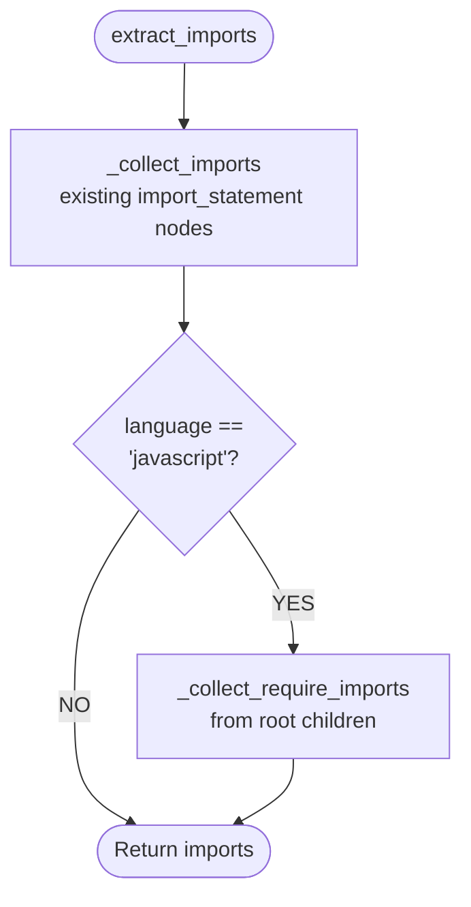

# Feature #36 — JavaScript: prototype-assigned functions + require() imports — Detailed Design

**Date**: 2026-03-21
**Feature ID**: 36
**Feature Title**: JavaScript: prototype-assigned functions + require() imports
**SRS Ref**: FR-004 (Wave 2, acceptance criteria for JS prototype-assigned L3 chunks and require() import extraction)
**Design Ref**: §4.1.4, JavaScript node mappings, Prototype-assigned function detection, CommonJS require() import detection

---

## 1. Overview

The current JavaScript chunker handles `function_declaration`, `arrow_function` (in `const x = () => ...` declarations), `method_definition`, and `class_declaration`. Two common JavaScript patterns are NOT detected:

- **Prototype-assigned functions** (`obj.method = function(...){}` or `obj.method = (...) => {}`) — these are `expression_statement > assignment_expression` where the left side is a `member_expression` and the right side is a `function_expression` or `arrow_function`. No L3 chunk is produced.
- **CommonJS require() imports** (`var x = require('module')`) — these are `variable_declaration` or `lexical_declaration` containing a `call_expression` where the function identifier is `require`. The current `extract_imports` only collects `import_statement` nodes, so `require()` calls are invisible to the L1 file chunk's imports list.

This feature extends:

1. `_walk_functions` to detect prototype-assigned functions and create L3 chunks with `symbol = property_name`.
2. `_collect_imports` (or a new JS-specific path in `extract_imports`) to detect `require()` calls and add the module path to the imports list.

**Scope**: JavaScript only. No other languages are affected.

### Tree-sitter AST findings

| Construct | Top-level node | Structure | Key child |
|-----------|---------------|-----------|-----------|
| `obj.method = function(...){}` | `expression_statement` | `assignment_expression` → left: `member_expression`, right: `function_expression` | `property_identifier` on member_expression |
| `obj.method = (...) => {}` | `expression_statement` | `assignment_expression` → left: `member_expression`, right: `arrow_function` | `property_identifier` on member_expression |
| `var x = require('mod')` | `variable_declaration` | `variable_declarator` → `call_expression` with `identifier` = "require" | `string` child in `arguments` |
| `const x = require('mod')` | `lexical_declaration` | `variable_declarator` → `call_expression` with `identifier` = "require" | `string` child in `arguments` |

---

## 2. Component Data-Flow Diagram

N/A — single-class feature. The changes modify two walker methods (`_walk_functions` and `extract_imports`/`_collect_imports`) and add two helper functions in the existing `Chunker` module. No new classes or components are introduced.

---

## 3. Interface Contract

No new public methods are added. Existing methods gain new behavior for JavaScript prototype-assigned functions and require() imports:

| Method / Config | Signature | Preconditions | Postconditions | Raises |
|-----------------|-----------|---------------|----------------|--------|
| `Chunker._walk_functions` | `(node, file, repo_id, branch, language, node_map, chunks, parent_class) -> None` | `language == "javascript"`, top-level node is `expression_statement` containing `assignment_expression` with `member_expression` LHS and `function_expression` or `arrow_function` RHS | An L3 function chunk is appended with `symbol` = property_identifier text, `content` = full expression_statement text, `chunk_type` = "function" | (no new exceptions) |
| `Chunker.extract_imports` | `(tree, language) -> list[str]` | `language == "javascript"`, root contains `variable_declaration` or `lexical_declaration` with `require()` call_expression | The returned imports list includes the string argument of each `require()` call (e.g., `"express"`, `"path"`) | (no new exceptions) |
| `_is_prototype_assign` | `(node: ts.Node) -> tuple[str, ts.Node] \| None` (NEW helper) | `node.type == "expression_statement"` | Returns `(property_name, function_node)` if the pattern matches, else `None` | (no new exceptions) |
| `_collect_require_imports` | `(node: ts.Node, imports: list[str]) -> None` (NEW helper) | `node` is a root-level child | Appends require() module paths to `imports` for any `variable_declaration` or `lexical_declaration` containing `require()` calls | (no new exceptions) |

**Verification step traceability**:
- VS-1 ("res.status = function(code){...} → L3 with symbol='status'") → `_walk_functions` + `_is_prototype_assign` postconditions
- VS-2 ("obj.handler = (req, res) => {...} → L3 with symbol='handler'") → `_walk_functions` + `_is_prototype_assign` postconditions
- VS-3 ("var express = require('express') → imports includes 'express'") → `extract_imports` + `_collect_require_imports` postconditions
- VS-4 ("multiple require() calls → all module paths in imports") → `extract_imports` + `_collect_require_imports` postconditions

---

## 4. Internal Sequence Diagram

N/A — the changes are pattern-matching additions to existing walker methods. The prototype detection is a simple conditional check in `_walk_functions`, and the require detection is a parallel import collection path. Error paths documented in Algorithm §5 error handling table.

---

## 5. Algorithm / Core Logic

### 5a. Prototype-assigned function detection

**Flow diagram**:

```mermaid
flowchart TD
    S([_walk_functions: child node]) --> IS_EXPR{child.type ==<br/>'expression_statement'?}
    IS_EXPR -- NO --> OTHER[Continue to existing checks]
    IS_EXPR -- YES --> CALL_HELPER[Call _is_prototype_assign]
    CALL_HELPER --> MATCH{Returns<br/>(prop_name, func_node)?}
    MATCH -- None --> OTHER
    MATCH -- YES --> ADD[_add_function_chunk<br/>node=expression_statement<br/>name=prop_name]
    ADD --> NEXT([Continue walking])
```

**Pseudocode for `_is_prototype_assign`**:

```
FUNCTION _is_prototype_assign(node: Node) -> tuple[str, Node] | None
  // Precondition: node.type == "expression_statement"
  // Step 1: Find assignment_expression child
  FOR child IN node.children:
    IF child.type == "assignment_expression":
      assign = child
      BREAK
  ELSE:
    RETURN None

  // Step 2: Check LHS is member_expression, RHS is function
  lhs = None
  rhs = None
  FOR child IN assign.children:
    IF child.type == "member_expression":
      lhs = child
    IF child.type IN ("function_expression", "arrow_function"):
      rhs = child

  IF lhs is None OR rhs is None:
    RETURN None

  // Step 3: Extract property name from member_expression
  FOR child IN lhs.children:
    IF child.type == "property_identifier":
      prop_name = child.text
      RETURN (prop_name, rhs)

  RETURN None
END
```

**Pseudocode for `_walk_functions` addition** (inserted before existing function_nodes check):

```
// In _walk_functions, for each child:
IF child.type == "expression_statement" AND language == "javascript":
  result = _is_prototype_assign(child)
  IF result is not None:
    (prop_name, func_node) = result
    _add_function_chunk(child, prop_name, file, repo_id, branch, language, parent_class, chunks)
    CONTINUE
```

### 5b. CommonJS require() import detection

**Flow diagram**:



**Pseudocode for `_collect_require_imports`**:

```
FUNCTION _collect_require_imports(node: Node, imports: list[str]) -> None
  // Walk root-level children
  FOR child IN node.children:
    IF child.type IN ("variable_declaration", "lexical_declaration"):
      FOR declarator IN child.children:
        IF declarator.type == "variable_declarator":
          FOR sub IN declarator.children:
            IF sub.type == "call_expression":
              func_name = None
              arg_str = None
              FOR call_child IN sub.children:
                IF call_child.type == "identifier" AND call_child.text == b"require":
                  func_name = "require"
                IF call_child.type == "arguments":
                  FOR arg IN call_child.children:
                    IF arg.type == "string":
                      // Extract string content (strip quotes)
                      raw = arg.text.decode("utf-8")
                      arg_str = raw.strip("'\"")
              IF func_name == "require" AND arg_str is not None:
                imports.append(arg_str)
END
```

### 5c. Boundary decisions table

| Parameter | Min | Max | Empty/Null | At boundary |
|-----------|-----|-----|------------|-------------|
| member_expression LHS | `a.b` (2 parts) | `a.b.c.d` (deep chain) | N/A — must have property_identifier | Extracts last property_identifier |
| require() argument | single char `"x"` | long path `"@scope/pkg/sub"` | Empty string `""` → still added | Scoped package with `/` works |
| Number of require() calls | 0 → no additions | Many (e.g., 20+) | File with no requires → imports unchanged | All collected |
| RHS function type | `function_expression` | `arrow_function` | Neither → no match | Both produce L3 chunk |

### 5d. Error handling table

| Condition | Detection | Response | Recovery |
|-----------|-----------|----------|----------|
| expression_statement has no assignment_expression | `_is_prototype_assign` returns None | Node is skipped, no chunk created | Normal flow continues |
| assignment_expression has member_expression LHS but RHS is not a function | `_is_prototype_assign` returns None (rhs check fails) | Node is skipped | Normal — `obj.x = 42` is not a function |
| member_expression has no property_identifier | `_is_prototype_assign` returns None | Node is skipped | Edge case: computed property `obj[key] = function(){}` |
| require() call with no string argument | `arg_str` remains None | Call is skipped, not added to imports | `require(variable)` is dynamic, skip |
| Non-JS file passed to require detection | Language check `== "javascript"` | require collection path not entered | Only JS triggers this path |

---

## 6. State Diagram

N/A — stateless feature. Chunking is a pure transformation with no object lifecycle.

---

## 7. Test Inventory

| ID | Category | Traces To | Input / Setup | Expected | Kills Which Bug? |
|----|----------|-----------|---------------|----------|-----------------|
| T01 | happy path | VS-1 | JS file: `res.status = function(code) { return code; };` | L3 chunk with symbol="status", chunk_type="function" | Missing prototype detection |
| T02 | happy path | VS-2 | JS file: `obj.handler = (req, res) => { return 42; };` | L3 chunk with symbol="handler", chunk_type="function" | Arrow function variant missed |
| T03 | happy path | VS-3 | JS file: `var express = require('express');` | L1 file chunk imports includes "express" | Missing require() detection |
| T04 | happy path | VS-4 | JS file with 3 require() calls (var/const/let) | L1 file chunk imports includes all 3 module names | Only one declaration type handled |
| T05 | happy path | VS-1,2 | JS file with prototype function + normal function_declaration + class | L3 chunks for prototype fn + normal fn + class methods; L2 for class | Prototype detection breaks normal flow |
| T06 | boundary | §5c | JS file: `a.b.c.d = function() {};` — deep member chain | L3 chunk with symbol="d" (last property_identifier) | Wrong property extracted from deep chain |
| T07 | boundary | §5c | JS file: `obj.x = 42;` — non-function assignment | No L3 chunk for this expression | False positive on non-function assigns |
| T08 | boundary | §5c | JS file with `require()` using scoped package: `const a = require('@scope/pkg');` | imports includes "@scope/pkg" | Scoped package string not extracted |
| T09 | boundary | §5c | JS file with dynamic require: `const a = require(dynamicVar);` | No import added for dynamic require | Crash on non-string argument |
| T10 | boundary | §5c | JS file with no prototype assigns and no requires — only normal functions | Normal L3 chunks produced, no extras | Prototype/require detection interferes with existing behavior |
| T11 | error | §5d | JS file: `obj[key] = function() {};` — computed property | No L3 chunk (no property_identifier) | Crash on computed member_expression |
| T12 | boundary | §5c | JS file with require() with no semicolons (ASI) | require() still detected and module path extracted | Parser-dependent edge case |
| T13 | boundary | §5c | Empty JS file | L1 file chunk with empty imports, no L3 chunks | Crash on empty input |
| T14 | happy path | VS-1 | JS file: prototype function content includes full expression_statement text | Chunk content is `res.status = function(code) { return code; };` | Content is only the function_expression, missing context |

Negative tests: T06, T07, T08, T09, T10, T11, T12, T13 = 8/14 = 57% >= 40%

---

## 8. TDD Task Decomposition

### Task 1: Write failing tests
**Files**: `tests/test_chunker.py`
**Steps**:
1. Add test functions for T01-T14 from the Test Inventory above
2. Each test creates a JS `ExtractedFile`, calls `chunker.chunk()`, and asserts:
   - T01/T02: L3 chunk exists with correct symbol and chunk_type
   - T03/T04: L1 chunk imports contain expected module names
   - T05: Both prototype and normal chunks coexist
   - T06: Deep chain extracts last property
   - T07: Non-function assignment produces no L3 chunk
   - T08: Scoped package string preserved
   - T09: Dynamic require produces no import
   - T10: Normal JS file unaffected
   - T11: Computed property produces no L3 chunk
   - T12: ASI-style require detected
   - T13: Empty file produces only L1
   - T14: Chunk content includes full statement text
3. Run: `pytest tests/test_chunker.py -v -k "js_prototype or js_require"`
4. **Expected**: All new tests FAIL (features not implemented yet)

### Task 2: Implement minimal code
**Files**: `src/indexing/chunker.py`
**Steps**:
1. Add `_is_prototype_assign(node: ts.Node) -> tuple[str, ts.Node] | None` helper function per §5a pseudocode
2. Add prototype detection branch in `_walk_functions` — check `child.type == "expression_statement"` and `language == "javascript"`, call `_is_prototype_assign`, create L3 chunk if match
3. Add `_collect_require_imports(node: ts.Node, imports: list[str]) -> None` helper per §5b pseudocode
4. Modify `extract_imports` to call `_collect_require_imports` when `language == "javascript"`
5. Add prototype-assigned symbols to `extract_file_chunk` top_level_symbols collection
6. Run: `pytest tests/test_chunker.py -v`
7. **Expected**: All tests PASS

### Task 3: Coverage Gate
1. Run: `pytest --cov=src --cov-branch --cov-report=term-missing tests/`
2. Check thresholds: line >= 90%, branch >= 80%
3. Record coverage output as evidence

### Task 4: Refactor
1. Review new code for clarity and consistency with existing wave 2 patterns
2. Run full test suite: `pytest tests/ -v`
3. All tests PASS

### Task 5: Mutation Gate
1. Run: `mutmut run --paths-to-mutate=src/indexing/chunker.py`
2. Check threshold: mutation score >= 80%
3. Record mutation output as evidence

### Task 6: Create example
1. Create `examples/09-js-prototype-require-chunking.py`
2. Run example to verify

---

## Verification Checklist
- [x] All verification_steps traced to Interface Contract postconditions
- [x] All verification_steps traced to Test Inventory rows
- [x] Algorithm pseudocode covers all non-trivial methods
- [x] Boundary table covers all algorithm parameters
- [x] Error handling table covers all Raises entries
- [x] Test Inventory negative ratio >= 40% (57%)
- [x] Every skipped section has explicit "N/A — [reason]"
