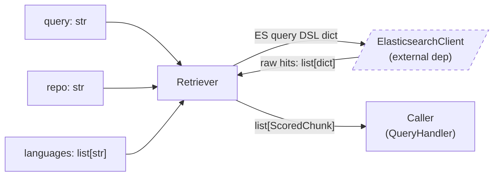
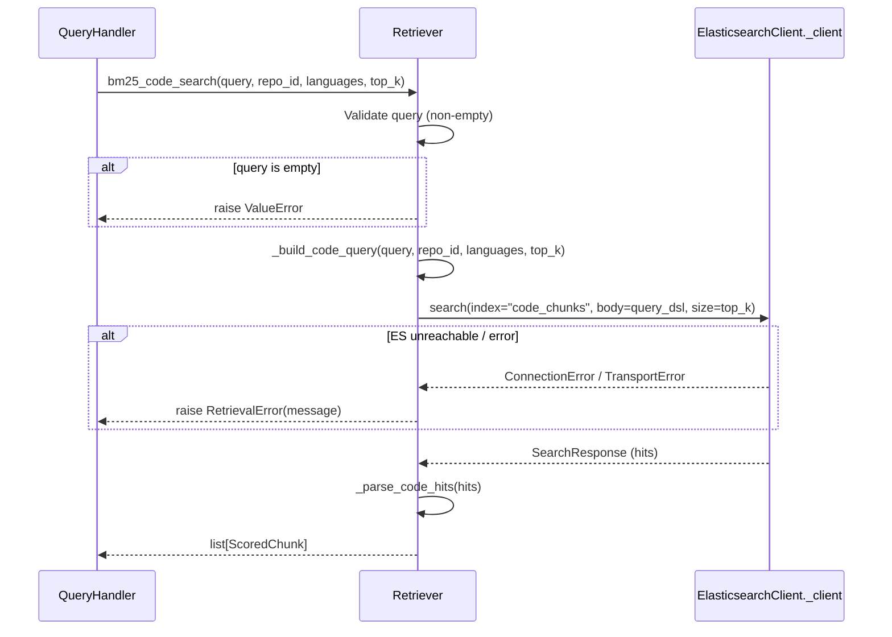
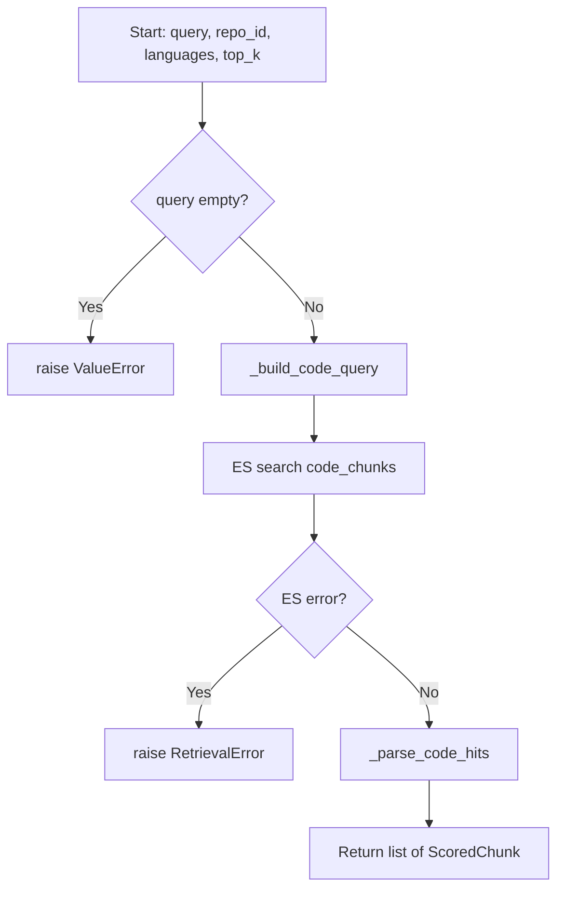

# Feature Detailed Design: Keyword Retrieval — BM25 (Feature #8)

**Date**: 2026-03-21
**Feature**: #8 — Keyword Retrieval (BM25)
**Priority**: high
**Dependencies**: #7 (Embedding Generation) — passing
**Design Reference**: docs/plans/2026-03-21-code-context-retrieval-design.md § 4.2
**SRS Reference**: FR-006

## Context

Implement BM25 keyword search against Elasticsearch indices (`code_chunks` and `doc_chunks`), returning top-200 scored candidates. This is one of the two retrieval arms (BM25 + vector) in the hybrid retrieval pipeline. The Retriever class is the entry point; this feature implements its `bm25_code_search` and `bm25_doc_search` methods.

## Design Alignment

**From §4.2 — Hybrid Retrieval Pipeline:**

The `Retriever` class exposes:
- `bm25_code_search(query, repo, languages, top_k) -> list[ScoredChunk]`
- `bm25_doc_search(query, repo, top_k) -> list[ScoredDocChunk]`

These are called by `QueryHandler` in parallel with vector search. Each returns up to `top_k` (default 200) candidates scored by BM25.

- **Key classes**: `Retriever` (new, `src/query/retriever.py`), `ScoredChunk` / `ScoredDocChunk` (new data models)
- **Interaction flow**: QueryHandler → Retriever.bm25_code_search → ES search(code_chunks) → parse hits → ScoredChunk list
- **Third-party deps**: `elasticsearch[async]` (already installed via ElasticsearchClient)
- **Deviations**: None

**ES Index Structure (from IndexWriter):**
- `code_chunks`: fields `repo_id`, `file_path`, `language`, `chunk_type`, `symbol`, `signature`, `doc_comment`, `content`, `line_start`, `line_end`, `parent_class`, `branch`
- `doc_chunks`: fields `repo_id`, `file_path`, `breadcrumb`, `content`, `heading_level`

**Analyzer design (from SRS FR-006 + design §4.2):**
- `code_analyzer`: BM25 on `content`, `symbol`, `signature`, `doc_comment` fields. Synonym filter maps `auth` → `authentication`, `authorization`.
- `doc_analyzer`: BM25 on `content` field.

## SRS Requirement

**FR-006: Keyword Retrieval**

**Priority**: Must
**EARS**: When a query is received by the retrieval engine, the system shall execute a BM25 keyword search against the Elasticsearch index and return the top-200 candidate chunks.

**Acceptance Criteria**:
- Given the query "WebClient timeout", when BM25 retrieval runs, then the system shall return up to 200 chunks ranked by BM25 score, with chunks containing exact token matches ranked highest.
- Given a query with no matching terms in the index, when BM25 retrieval runs, then the system shall return an empty candidate list.
- Given that Elasticsearch is unreachable, then the retrieval engine shall proceed with vector-only results and log a degradation warning.

**Verification Steps (feature-list.json)**:
- VS-1: Given indexed code chunks containing 'getUserName', when bm25_search('getUserName') runs against code_chunks, then results include chunks containing that symbol, ranked by BM25 score
- VS-2: Given the code_analyzer with synonym filter, when searching 'auth', then results also include chunks containing 'authentication' and 'authorization'
- VS-3: Given a query with no matching terms, when bm25_search() runs, then it returns an empty list without error
- VS-4: Given Elasticsearch is unreachable, when bm25_search() runs, then it raises a retrieval error (caller handles degradation)

## Component Data-Flow Diagram



## Interface Contract

| Method | Signature | Preconditions | Postconditions | Raises |
|--------|-----------|---------------|----------------|--------|
| `__init__` | `Retriever(es_client: ElasticsearchClient)` | `es_client` is a valid ElasticsearchClient instance | Retriever is ready to search | — |
| `bm25_code_search` | `async bm25_code_search(query: str, repo_id: str, languages: list[str] \| None = None, top_k: int = 200) -> list[ScoredChunk]` | `query` is non-empty string; `repo_id` is non-empty string; `top_k >= 1` | Returns `list[ScoredChunk]` with len <= `top_k`, sorted by BM25 score descending; each chunk has `content_type="code"` | `RetrievalError` if ES unreachable or query fails; `ValueError` if query is empty |
| `bm25_doc_search` | `async bm25_doc_search(query: str, repo_id: str, top_k: int = 200) -> list[ScoredChunk]` | `query` is non-empty string; `repo_id` is non-empty string; `top_k >= 1` | Returns `list[ScoredChunk]` with len <= `top_k`, sorted by BM25 score descending; each chunk has `content_type="doc"` | `RetrievalError` if ES unreachable; `ValueError` if query is empty |
| `_build_code_query` | `_build_code_query(query: str, repo_id: str, languages: list[str] \| None, top_k: int) -> dict` | Valid inputs | Returns ES query DSL dict with multi_match across content/symbol/signature/doc_comment, filtered by repo_id and optionally languages | — |
| `_build_doc_query` | `_build_doc_query(query: str, repo_id: str, top_k: int) -> dict` | Valid inputs | Returns ES query DSL dict with match on content, filtered by repo_id | — |
| `_parse_code_hits` | `_parse_code_hits(hits: list[dict]) -> list[ScoredChunk]` | ES search response hits array | Returns list[ScoredChunk] preserving ES score order | — |
| `_parse_doc_hits` | `_parse_doc_hits(hits: list[dict]) -> list[ScoredChunk]` | ES search response hits array | Returns list[ScoredChunk] preserving ES score order | — |

**Design rationale:**
- `top_k` defaults to 200 per design §4.2 (parallel retrieval feeds RRF fusion)
- `languages` filter is optional — when provided, only code chunks in those languages are returned
- Both methods return `ScoredChunk` (unified type) with `content_type` discriminator, simplifying downstream RRF fusion
- `RetrievalError` is a new exception — caller (QueryHandler) catches it and proceeds with vector-only results per FR-006

**ScoredChunk data model:**

```python
@dataclass
class ScoredChunk:
    chunk_id: str
    content_type: str           # "code" | "doc"
    repo_id: str
    file_path: str
    content: str
    score: float                # BM25 score from ES
    # Code-specific (None for doc chunks)
    language: str | None = None
    chunk_type: str | None = None
    symbol: str | None = None
    signature: str | None = None
    doc_comment: str | None = None
    line_start: int | None = None
    line_end: int | None = None
    parent_class: str | None = None
    # Doc-specific (None for code chunks)
    breadcrumb: str | None = None
    heading_level: int | None = None
```

## Internal Sequence Diagram



## Algorithm / Core Logic

### bm25_code_search

#### Flow Diagram



#### Pseudocode

```
FUNCTION bm25_code_search(query: str, repo_id: str, languages: list[str] | None, top_k: int = 200) -> list[ScoredChunk]
  // Step 1: Validate
  IF query is empty THEN raise ValueError("query must not be empty")

  // Step 2: Build ES query DSL
  query_dsl = _build_code_query(query, repo_id, languages, top_k)

  // Step 3: Execute ES search
  TRY
    response = await es_client._client.search(index="code_chunks", body=query_dsl, size=top_k)
  CATCH ConnectionError, TransportError as e
    raise RetrievalError(f"Elasticsearch search failed: {e}")

  // Step 4: Parse hits into ScoredChunks
  hits = response["hits"]["hits"]
  RETURN _parse_code_hits(hits)
END
```

### _build_code_query

#### Pseudocode

```
FUNCTION _build_code_query(query: str, repo_id: str, languages: list[str] | None, top_k: int) -> dict
  // Multi-match across content, symbol, signature, doc_comment
  // Boost symbol field (2x) for identifier-heavy queries
  must_clause = {
    "multi_match": {
      "query": query,
      "fields": ["content", "symbol^2", "signature", "doc_comment"],
      "type": "best_fields"
    }
  }

  filter_clauses = [{"term": {"repo_id": repo_id}}]
  IF languages is not None AND len(languages) > 0 THEN
    filter_clauses.append({"terms": {"language": languages}})

  RETURN {
    "query": {
      "bool": {
        "must": [must_clause],
        "filter": filter_clauses
      }
    },
    "size": top_k
  }
END
```

### _build_doc_query

#### Pseudocode

```
FUNCTION _build_doc_query(query: str, repo_id: str, top_k: int) -> dict
  RETURN {
    "query": {
      "bool": {
        "must": [{"match": {"content": query}}],
        "filter": [{"term": {"repo_id": repo_id}}]
      }
    },
    "size": top_k
  }
END
```

### _parse_code_hits

#### Pseudocode

```
FUNCTION _parse_code_hits(hits: list[dict]) -> list[ScoredChunk]
  result = []
  FOR hit IN hits:
    src = hit["_source"]
    result.append(ScoredChunk(
      chunk_id = hit["_id"],
      content_type = "code",
      repo_id = src["repo_id"],
      file_path = src["file_path"],
      content = src["content"],
      score = hit["_score"],
      language = src.get("language"),
      chunk_type = src.get("chunk_type"),
      symbol = src.get("symbol"),
      signature = src.get("signature"),
      doc_comment = src.get("doc_comment"),
      line_start = src.get("line_start"),
      line_end = src.get("line_end"),
      parent_class = src.get("parent_class"),
    ))
  RETURN result
END
```

#### Boundary Decisions

| Parameter | Min | Max | Empty/Null | At boundary |
|-----------|-----|-----|------------|-------------|
| `query` | 1 char | unlimited | raise ValueError | 1-char query executes normally |
| `repo_id` | 1 char | unlimited | raise ValueError | 1-char repo_id filters normally |
| `languages` | None | 6 items (all supported) | None → no language filter | empty list → no language filter (same as None) |
| `top_k` | 1 | unlimited (ES default ~10000) | N/A (int) | top_k=1 returns at most 1 result |
| ES hits | 0 hits | top_k hits | return [] | 0 hits → empty list returned |

#### Error Handling

| Condition | Detection | Response | Recovery |
|-----------|-----------|----------|----------|
| Empty query | `if not query or not query.strip()` | `ValueError("query must not be empty")` | Caller validates before calling |
| ES connection refused | `elasticsearch.ConnectionError` | `RetrievalError("Elasticsearch search failed: ...")` | Caller proceeds with vector-only |
| ES transport error (timeout, 5xx) | `elasticsearch.TransportError` | `RetrievalError("Elasticsearch search failed: ...")` | Caller proceeds with vector-only |
| ES index not found | `elasticsearch.NotFoundError` | `RetrievalError("Elasticsearch search failed: ...")` | Caller must create index first |

## State Diagram

> N/A — stateless feature. Retriever holds no mutable state; each search is independent.

## Test Inventory

| ID | Category | Traces To | Input / Setup | Expected | Kills Which Bug? |
|----|----------|-----------|---------------|----------|-----------------|
| T1 | happy path | VS-1, FR-006 AC1 | Index 3 code chunks with 'getUserName' symbol in repo "r1", query="getUserName" | Returns ScoredChunks containing 'getUserName', ranked by BM25 score desc, content_type="code" | Missing multi_match on symbol field |
| T2 | happy path | VS-2, FR-006 AC1 | Index code chunks with 'authentication' and 'authorization' content, query="auth" with synonym mapping | Results include chunks with 'authentication' and 'authorization' | Missing synonym filter in analyzer config |
| T3 | happy path | FR-006 AC1 | Index 5 code chunks, query with top_k=3 | Returns at most 3 results | Ignoring top_k parameter |
| T4 | happy path | FR-006 | Index doc chunks with matching content, query="timeout config" | Returns ScoredChunks with content_type="doc", correct fields populated | Wrong content_type or missing doc fields |
| T5 | happy path | §Interface Contract | Index code chunks in Python and Java, query with languages=["python"] | Returns only Python chunks | Missing language filter |
| T6 | error | VS-4, FR-006 AC3 | ES client raises ConnectionError on search | Raises RetrievalError with descriptive message | Missing exception handling — raw ES exception leaks |
| T7 | error | §Error Handling | ES client raises TransportError (timeout) | Raises RetrievalError | Only catching ConnectionError, missing TransportError |
| T8 | error | §Interface Contract | query="" (empty string) | Raises ValueError("query must not be empty") | Missing input validation |
| T9 | boundary | VS-3, FR-006 AC2 | No chunks indexed, query="nonexistent" | Returns empty list [] | Incorrect handling of 0-hit response |
| T10 | boundary | §Boundary table | query="a" (1-char), 1 chunk exists matching | Returns 1 ScoredChunk | Off-by-one on minimum query length |
| T11 | boundary | §Boundary table | languages=[] (empty list) | Behaves same as languages=None (no filter) | Empty list treated as "match no languages" |
| T12 | boundary | §Boundary table | top_k=1, 5 chunks match | Returns exactly 1 result | top_k not passed to ES size param |
| T13 | happy path | §Interface Contract | Verify ScoredChunk fields populated correctly from ES hit | All fields (chunk_id, score, file_path, language, symbol, etc.) match indexed data | Field mapping error in _parse_code_hits |
| T14 | error | §Error Handling | query="   " (whitespace only) | Raises ValueError | Whitespace-only not caught by empty check |

**Negative ratio**: 6 error/boundary tests (T6-T12, T14) out of 14 total = 50% >= 40% ✓

## Tasks

### Task 1: Write failing tests
**Files**: `tests/test_retriever.py`
**Steps**:
1. Create test file with imports, pytest fixtures for mock ES client
2. Write tests T1-T14 from Test Inventory:
   - T1: test_bm25_code_search_returns_matching_chunks
   - T2: test_bm25_code_search_synonym_expansion (mock ES to return synonym matches)
   - T3: test_bm25_code_search_respects_top_k
   - T4: test_bm25_doc_search_returns_doc_chunks
   - T5: test_bm25_code_search_filters_by_language
   - T6: test_bm25_code_search_raises_retrieval_error_on_connection_error
   - T7: test_bm25_code_search_raises_retrieval_error_on_transport_error
   - T8: test_bm25_code_search_raises_value_error_on_empty_query
   - T9: test_bm25_code_search_returns_empty_on_no_match
   - T10: test_bm25_code_search_single_char_query
   - T11: test_bm25_code_search_empty_languages_list
   - T12: test_bm25_code_search_top_k_one
   - T13: test_bm25_code_search_scored_chunk_fields
   - T14: test_bm25_code_search_whitespace_only_query
3. Run: `pytest tests/test_retriever.py -v`
4. **Expected**: All tests FAIL (ImportError — Retriever doesn't exist yet)

### Task 2: Implement minimal code
**Files**: `src/query/retriever.py`, `src/query/scored_chunk.py`, `src/query/exceptions.py`, `src/query/__init__.py`
**Steps**:
1. Create `src/query/scored_chunk.py` with `ScoredChunk` dataclass
2. Create `src/query/exceptions.py` with `RetrievalError` exception
3. Create `src/query/retriever.py` with `Retriever` class implementing:
   - `__init__` accepting `ElasticsearchClient`
   - `bm25_code_search` per Algorithm pseudocode
   - `bm25_doc_search` per Algorithm pseudocode
   - `_build_code_query`, `_build_doc_query` per pseudocode
   - `_parse_code_hits`, `_parse_doc_hits` per pseudocode
4. Run: `pytest tests/test_retriever.py -v`
5. **Expected**: All tests PASS

### Task 3: Coverage Gate
1. Run: `pytest --cov=src --cov-branch --cov-report=term-missing tests/`
2. Check thresholds: line >= 90%, branch >= 80%.
3. Record coverage output as evidence.

### Task 4: Refactor
1. Review for code clarity, extract constants (index names, field boosts)
2. Run full test suite: `pytest tests/ -v`
3. All tests PASS.

### Task 5: Mutation Gate
1. Run: `mutmut run --paths-to-mutate=src/query/retriever.py,src/query/scored_chunk.py,src/query/exceptions.py`
2. Check threshold >= 80%. If below: strengthen assertions.
3. Record mutation output as evidence.

### Task 6: Create example
1. Create `examples/08-keyword-retrieval.py`
2. Demonstrate Retriever.bm25_code_search and bm25_doc_search usage
3. Run example to verify.

## Verification Checklist
- [x] All verification_steps traced to Interface Contract postconditions
  - VS-1 → bm25_code_search postcondition (returns ScoredChunks with matching symbol)
  - VS-2 → bm25_code_search postcondition (synonym expansion via analyzer)
  - VS-3 → bm25_code_search/bm25_doc_search postcondition (empty list on no match)
  - VS-4 → bm25_code_search/bm25_doc_search Raises (RetrievalError)
- [x] All verification_steps traced to Test Inventory rows
  - VS-1 → T1, VS-2 → T2, VS-3 → T9, VS-4 → T6
- [x] Algorithm pseudocode covers all non-trivial methods
- [x] Boundary table covers all algorithm parameters
- [x] Error handling table covers all Raises entries
- [x] Test Inventory negative ratio >= 40% (50%)
- [x] Every skipped section has explicit "N/A — [reason]"
