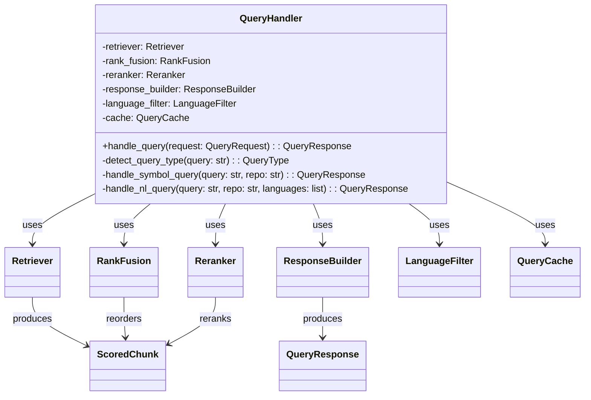
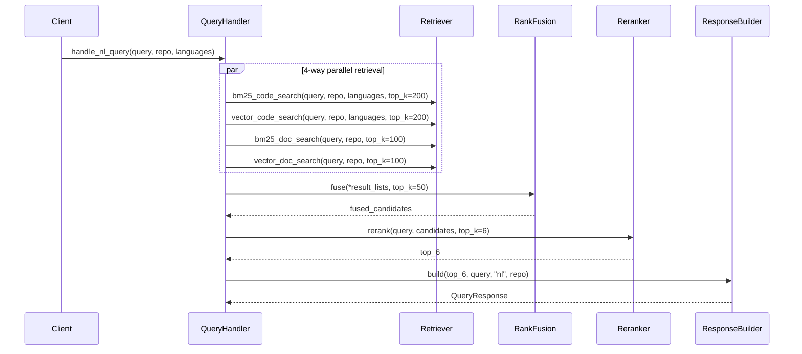
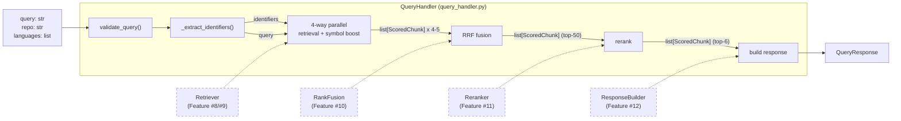
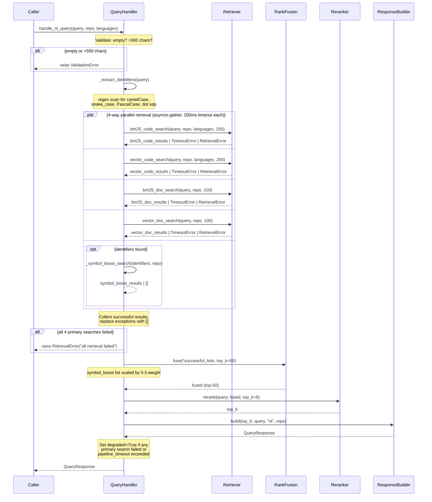
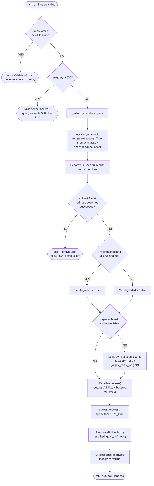

# Feature Detailed Design: Natural Language Query Handler (Feature #13)

**Date**: 2026-03-21
**Feature**: #13 — Natural Language Query Handler
**Priority**: high
**Dependencies**: Feature #12 (Context Response Builder)
**Design Reference**: docs/plans/2026-03-21-code-context-retrieval-design.md § 4.2
**SRS Reference**: FR-011

## Context

The `QueryHandler` class orchestrates the full hybrid retrieval pipeline for natural language queries: 4-way parallel retrieval (BM25 code + vector code + BM25 doc + vector doc), unified RRF fusion, single neural rerank pass, and structured response assembly. It also performs query expansion by extracting embedded code identifiers and boosting symbol matches into the RRF fusion. This is the core coordination layer of the online query path.

## Design Alignment

From § 4.2.2 — Class Diagram:



From § 4.2.3 — Sequence Diagram (NL path):



From § 4.2.4 — Query Expansion:

- Extract embedded identifiers (camelCase, snake_case, PascalCase, dot-separated) from NL query
- Fire parallel term query on `symbol.raw` for each identifier
- Merge symbol boost results as 5th input to RRF with weight 0.3

From § 4.2.5 — Unified Pipeline:

- 4-way parallel retrieval: BM25 code (top-200), vector code (top-200), BM25 doc (top-100), vector doc (top-100)
- Unified RRF fusion of all 4 lists -> top-50
- Single rerank pass -> top-6
- ResponseBuilder.build() -> QueryResponse

From § 4.2.6 — Design Notes:

- Independent timeouts per search: 200ms
- At least 1 successful search required; if all fail -> 504
- Pipeline timeout: 1s total

- **Key classes**: `QueryHandler` (new, `src/query/query_handler.py`) — main orchestrator with `handle_nl_query()`, `detect_query_type()`, `_extract_identifiers()`, `_symbol_boost_search()`
- **Interaction flow**: `handle_nl_query` -> 4-way parallel retrieval via `asyncio.gather` -> RRF fusion -> rerank -> ResponseBuilder.build
- **Third-party deps**: None new (uses existing `asyncio` stdlib and injected dependencies)
- **Deviations**: None. `detect_query_type()` returns `"nl"` unconditionally as a stub for Feature #14 integration.

## SRS Requirement

**FR-011** (Priority: Must)

**EARS**: When a user submits a natural language query (e.g., "how to configure spring http client timeout"), the system shall execute the full hybrid retrieval pipeline (BM25 + vector + fusion + rerank) and return structured context results.

**Acceptance Criteria**:
- Given NL query "how to use grpc java interceptor" -> return top-3 results with relevant gRPC code/docs/examples
- Given empty query -> return 400 error with descriptive message
- Given query >500 characters -> return 400 error indicating max length
- Given pipeline timeout >1s -> return partial results with `degraded: true`

## Component Data-Flow Diagram



## Interface Contract

| Method | Signature | Preconditions | Postconditions | Raises |
|--------|-----------|---------------|----------------|--------|
| `__init__` | `QueryHandler(retriever: Retriever, rank_fusion: RankFusion, reranker: Reranker, response_builder: ResponseBuilder, search_timeout: float = 0.2, pipeline_timeout: float = 1.0)` | All dependencies are initialized and functional | All internal references assigned; timeout values stored | None |
| `handle_nl_query` | `async handle_nl_query(query: str, repo: str, languages: list[str] \| None = None) -> QueryResponse` | `query` is a non-empty string <= 500 chars; `repo` is a valid repo identifier | Returns `QueryResponse` with `query_type="nl"`, populated `code_results` and/or `doc_results`; if partial retrieval failure, response includes `degraded=True` | `ValidationError` if query is empty or >500 chars; `RetrievalError` if all 4 retrieval paths fail (504 scenario) |
| `detect_query_type` | `detect_query_type(query: str) -> str` | `query` is a non-empty string | Returns `"nl"` (stub for Feature #14 to extend with symbol detection) | None |
| `_extract_identifiers` | `_extract_identifiers(query: str) -> list[str]` | `query` is a non-empty string | Returns list of extracted identifier tokens (camelCase, snake_case, PascalCase, dot-separated); empty list if none found | None |
| `_symbol_boost_search` | `async _symbol_boost_search(identifiers: list[str], repo: str) -> list[ScoredChunk]` | `identifiers` is a non-empty list of strings; `repo` is valid | Returns list of `ScoredChunk` from ES term queries on `symbol.raw`; empty list on failure | None (errors caught internally) |

**Design rationale**:
- `search_timeout=0.2` (200ms): Per § 4.2.6, independent timeout per retrieval to stay within 1s total budget
- `pipeline_timeout=1.0` (1s): Per NFR-001 p95 < 1000ms; exceeding triggers degraded response
- `ValidationError` (not `ValueError`): Distinguishes handler-level input validation from Retriever-level errors; maps cleanly to HTTP 400
- `detect_query_type` returns `"nl"` unconditionally: Stub for Feature #14 to implement symbol detection heuristic
- Symbol boost weight 0.3: Per § 4.2.4, symbol boost results are scaled down to avoid overriding semantic relevance

## Internal Sequence Diagram



## Algorithm / Core Logic

### handle_nl_query()

#### Flow Diagram



#### Pseudocode

```
FUNCTION handle_nl_query(query: str, repo: str, languages: list[str] | None = None) -> QueryResponse
  // Step 1: Validate input
  IF query is empty or whitespace-only THEN
    RAISE ValidationError("query must not be empty")
  IF len(query) > 500 THEN
    RAISE ValidationError("query exceeds 500 character limit")

  // Step 2: Extract embedded identifiers for symbol boost
  identifiers = _extract_identifiers(query)

  // Step 3: Build retrieval tasks with individual timeouts
  tasks = [
    asyncio.wait_for(retriever.bm25_code_search(query, repo, languages, top_k=200), timeout=search_timeout),
    asyncio.wait_for(retriever.vector_code_search(query, repo, languages, top_k=200), timeout=search_timeout),
    asyncio.wait_for(retriever.bm25_doc_search(query, repo, top_k=100), timeout=search_timeout),
    asyncio.wait_for(retriever.vector_doc_search(query, repo, top_k=100), timeout=search_timeout),
  ]
  IF identifiers THEN
    tasks.append(asyncio.wait_for(_symbol_boost_search(identifiers, repo), timeout=search_timeout))

  // Step 4: Execute in parallel, capture exceptions
  results = AWAIT asyncio.gather(*tasks, return_exceptions=True)

  // Step 5: Separate successes from failures for the 4 primary searches
  primary_results = results[0:4]
  successful_lists = []
  degraded = False
  FOR i, result IN enumerate(primary_results):
    IF result is Exception THEN
      log.warning("Retrieval path %d failed: %s", i, result)
      degraded = True
    ELSE
      successful_lists.append(result)

  // Step 6: Check at least one primary search succeeded
  IF len(successful_lists) == 0 THEN
    RAISE RetrievalError("all retrieval paths failed")

  // Step 7: Handle symbol boost results (5th element, if present)
  IF identifiers AND len(results) > 4 AND NOT isinstance(results[4], Exception) THEN
    boosted = _apply_boost_weight(results[4], weight=0.3)
    successful_lists.append(boosted)

  // Step 8: Fuse all result lists
  fused = rank_fusion.fuse(*successful_lists, top_k=50)

  // Step 9: Rerank
  reranked = reranker.rerank(query, fused, top_k=6)

  // Step 10: Build response
  response = response_builder.build(reranked, query, "nl", repo)

  // Step 11: Mark degraded if needed
  IF degraded THEN
    response.degraded = True

  RETURN response
END
```

### _extract_identifiers()

#### Pseudocode

```
FUNCTION _extract_identifiers(query: str) -> list[str]
  // Regex patterns for code identifiers:
  //   camelCase: lowercase followed by uppercase (e.g., getUserName)
  //   PascalCase: two+ capitalized words (e.g., AuthService)
  //   snake_case: word_word pattern (e.g., get_user)
  //   dot-separated: word.word pattern (e.g., UserService.getById)

  PATTERN = r'\b([a-z]+[A-Z][a-zA-Z0-9]*)\b'         // camelCase
          + r'|\b([A-Z][a-z]+(?:[A-Z][a-z0-9]+)+)\b'  // PascalCase
          + r'|\b([a-z][a-z0-9]*(?:_[a-z][a-z0-9]*)+)\b'  // snake_case
          + r'|\b([a-zA-Z]\w*(?:\.[a-zA-Z]\w*)+)\b'   // dot.separated

  matches = re.findall(PATTERN, query)
  // Flatten tuple groups, deduplicate, preserve order
  identifiers = unique([m for group in matches for m in group if m])
  RETURN identifiers
END
```

### _symbol_boost_search()

#### Pseudocode

```
FUNCTION _symbol_boost_search(identifiers: list[str], repo: str) -> list[ScoredChunk]
  // Fire parallel ES term queries on symbol.raw for each identifier
  tasks = [
    retriever._execute_search(
      retriever._code_index,
      {"query": {"bool": {"must": [{"term": {"symbol.raw": ident}}],
                           "filter": [{"term": {"repo_id": repo}}]}}},
      size=10
    )
    FOR ident IN identifiers
  ]
  results = AWAIT asyncio.gather(*tasks, return_exceptions=True)

  chunks = []
  FOR result IN results:
    IF result is NOT Exception THEN
      chunks.extend(retriever._parse_code_hits(result))

  RETURN chunks
END
```

### _apply_boost_weight()

#### Pseudocode

```
FUNCTION _apply_boost_weight(chunks: list[ScoredChunk], weight: float) -> list[ScoredChunk]
  // Scale scores by weight factor so RRF fusion treats these as lower-priority
  RETURN [replace(chunk, score=chunk.score * weight) FOR chunk IN chunks]
END
```

### detect_query_type()

#### Pseudocode

```
FUNCTION detect_query_type(query: str) -> str
  // Stub: always returns "nl" — Feature #14 will extend with symbol detection
  RETURN "nl"
END
```

#### Boundary Decisions

| Parameter | Min | Max | Empty/Null | At boundary |
|-----------|-----|-----|------------|-------------|
| `query` | 1 char (after strip) | 500 chars | Raise `ValidationError("query must not be empty")` | 1 char -> valid, processed normally; 500 chars -> valid; 501 chars -> `ValidationError` |
| `repo` | 1 char | unlimited | N/A (required parameter) | Any non-empty string accepted |
| `languages` | `None` or `[]` | unlimited list | `None` -> no language filter applied | Empty list `[]` -> treated same as `None` (no filter) |
| `search_timeout` | 0.0 | unlimited | N/A (float) | 0.0 -> immediate timeout on all searches -> all fail -> `RetrievalError` if all 4 fail |
| `pipeline_timeout` | 0.0 | unlimited | N/A (float) | 0.0 -> immediate degraded flag |
| `identifiers` (extracted) | 0 items | unlimited | No symbol boost search fired | 0 -> only 4 primary lists go to RRF; 1+ -> 5th list added |
| `top_k` (RRF) | fixed 50 | fixed 50 | N/A | Always 50 per design |
| `top_k` (rerank) | fixed 6 | fixed 6 | N/A | Always 6 per design |

#### Error Handling

| Condition | Detection | Response | Recovery |
|-----------|-----------|----------|----------|
| Empty query (empty string or whitespace) | `not query or not query.strip()` | Raise `ValidationError("query must not be empty")` | Caller returns HTTP 400 |
| Query exceeds 500 chars | `len(query) > 500` | Raise `ValidationError("query exceeds 500 character limit")` | Caller returns HTTP 400 |
| Single retrieval path timeout | `asyncio.TimeoutError` from `asyncio.wait_for` | Log warning, skip this path, set `degraded=True` | Continue with remaining successful results |
| Single retrieval path error | `RetrievalError` or `ValueError` caught via `return_exceptions=True` | Log warning, skip this path, set `degraded=True` | Continue with remaining successful results |
| All 4 primary retrieval paths fail | `len(successful_lists) == 0` | Raise `RetrievalError("all retrieval paths failed")` | Caller returns HTTP 504 |
| Symbol boost search failure | Exception caught from `asyncio.gather` | Log warning, proceed without symbol boost | Degradation is silent — no effect on primary results |
| RankFusion receives empty lists | All successful lists are empty `[]` | `fuse()` returns `[]` -> empty response | Valid edge case: response with 0 results |
| Reranker failure | Handled internally by `Reranker` (falls back to fusion order) | Caller receives degraded but valid results | No action needed in QueryHandler |

## State Diagram

N/A — stateless feature. `QueryHandler` is initialized once with its dependencies and processes each `handle_nl_query()` call independently. No lifecycle states or mutable internal state between calls.

## Test Inventory

| ID | Category | Traces To | Input / Setup | Expected | Kills Which Bug? |
|----|----------|-----------|---------------|----------|-----------------|
| T1 | happy path | VS-1, FR-011 AC-1 | query="how to use grpc java interceptor", repo="test-repo", all 4 retrievers return results | Returns `QueryResponse` with `query_type="nl"`, populated `code_results` and `doc_results`, `degraded` not set | Missing orchestration: not calling all 4 retrieval paths |
| T2 | happy path | VS-1 | query="spring webclient timeout", all 4 retrievers return results, no identifiers extracted | 4 lists passed to `fuse()`, no 5th list; response has results | Incorrectly adding empty symbol boost list to RRF |
| T3 | happy path | VS-3, FR-011 AC-4 | query="how does AuthService validate tokens", identifiers=["AuthService"] | `_extract_identifiers` returns `["AuthService"]`; symbol boost search fired; 5 lists passed to RRF | Missing query expansion: not extracting identifiers |
| T4 | happy path | VS-3 | query with camelCase identifier "getUserName" | `_extract_identifiers` returns `["getUserName"]`; symbol boost search result included in RRF fusion with weight 0.3 | Wrong weight: symbol boost not scaled |
| T5 | happy path | VS-1 | Verify `ResponseBuilder.build()` called with `query_type="nl"` and `repo` argument | Response `query_type` is `"nl"` and `repo` matches input | Wrong query_type passed to builder |
| T6 | error | VS-2, FR-011 AC-2 | query="" (empty string) | Raises `ValidationError` with message containing "empty" | Missing empty check: passing empty query to retriever |
| T7 | error | VS-2, FR-011 AC-2 | query="   " (whitespace only) | Raises `ValidationError` with message containing "empty" | Missing strip: whitespace passes validation |
| T8 | error | FR-011 AC-3 | query="a" * 501 (501 chars) | Raises `ValidationError` with message containing "500" | Missing length check |
| T9 | boundary | FR-011 AC-3 | query="a" * 500 (exactly 500 chars) | Does NOT raise; proceeds with retrieval | Off-by-one: rejecting valid 500-char query |
| T10 | error | VS-4, FR-011 AC-4 | All 4 primary retrieval tasks raise `RetrievalError` | Raises `RetrievalError("all retrieval paths failed")` | Missing all-fail check: returning empty response instead of error |
| T11 | error | VS-4 | 3 of 4 retrieval tasks raise `asyncio.TimeoutError`, 1 succeeds | Returns `QueryResponse` with `degraded=True`, results from the 1 successful path | Not setting degraded flag on partial failure |
| T12 | error | VS-4 | 1 retrieval task times out, other 3 succeed | Returns `QueryResponse` with `degraded=True`, results fused from 3 lists | Not marking degraded when any single path fails |
| T13 | error | §Error Handling | Symbol boost search raises exception | Proceeds without symbol boost, no crash, response still returned | Crash on symbol boost failure |
| T14 | boundary | §Boundary | query="a" (single char) | Valid query, retrieval proceeds | Rejecting very short queries |
| T15 | boundary | §Boundary | languages=None | Retriever called with `languages=None` (no filter) | Crashing on None languages |
| T16 | boundary | §Boundary | languages=[] (empty list) | Retriever called with `languages=[]` (no filter applied) | Passing empty list as filter causing ES error |
| T17 | happy path | §Algorithm _extract_identifiers | query="how does UserService.getById work" | Extracts `["UserService"]` (PascalCase) and `"UserService.getById"` (dot-separated) | Regex misses dot-separated identifiers |
| T18 | happy path | §Algorithm _extract_identifiers | query="check the get_user_name function" | Extracts `["get_user_name"]` | Regex misses snake_case identifiers |
| T19 | boundary | §Algorithm _extract_identifiers | query="how to configure timeout" (no identifiers) | Returns empty list `[]`; no symbol boost search fired | Crash on empty identifier list |
| T20 | happy path | §Algorithm detect_query_type | query="anything" | Returns `"nl"` | Stub returning wrong value |
| T21 | error | §Error Handling | All 4 primary fail, but symbol boost succeeds | Still raises `RetrievalError` — symbol boost alone is not sufficient | Treating symbol boost success as primary success |
| T22 | happy path | §Algorithm | Verify `asyncio.gather` called with `return_exceptions=True` | Exceptions captured, not propagated | Missing return_exceptions causing first failure to abort gather |
| T23 | boundary | §Boundary | All 4 retrieval paths return empty lists `[]` | `fuse()` returns `[]`; response has 0 code_results, 0 doc_results; no error raised | Raising error on empty results vs returning empty |
| T24 | error | §Error Handling | 2 retrievals timeout, 2 return results; symbol boost also times out | Degraded response from 2 successful lists, no symbol boost | Crash when both symbol boost and some retrievals fail |
| T25 | happy path | §Algorithm _apply_boost_weight | symbol boost returns chunks with score=10.0, weight=0.3 | Chunks passed to RRF have score=3.0 | Not applying weight: symbol results dominate RRF |
| T26 | happy path | VS-1 | Verify `reranker.rerank()` called with `top_k=6` | Reranker returns at most 6 results | Wrong top_k passed to reranker |
| T27 | happy path | VS-1 | Verify `rank_fusion.fuse()` called with `top_k=50` | Fusion returns at most 50 candidates | Wrong top_k passed to fusion |
| T28 | error | §Error Handling | `bm25_code_search` raises `ValueError` (wrapped by return_exceptions) | Treated as failure, degraded=True, continues with other paths | ValueError not handled: crashes gather |

**Negative test ratio**: 12 negative (T6, T7, T8, T10, T11, T12, T13, T21, T22, T24, T28, T16) / 28 total = 43% >= 40%

## Tasks

### Task 1: Write failing tests
**Files**: `tests/test_query_handler.py`
**Steps**:
1. Create test file with imports: `QueryHandler`, `Retriever`, `RankFusion`, `Reranker`, `ResponseBuilder`, `ScoredChunk`, `QueryResponse`, `ValidationError`, `RetrievalError`, `asyncio`, `pytest`, `unittest.mock` (AsyncMock, MagicMock, patch)
2. Create helper `_make_chunks(n, content_type="code")` that generates n `ScoredChunk` instances with distinct `chunk_id`, `content`, `repo_id`, and `file_path`
3. Create fixture `handler` that builds a `QueryHandler` with mocked dependencies (all 4 retriever methods as `AsyncMock` returning `_make_chunks(5)`, `RankFusion.fuse` returning `_make_chunks(3)`, `Reranker.rerank` returning `_make_chunks(3)`, `ResponseBuilder.build` returning a `QueryResponse`)
4. Write tests T1-T28 from Test Inventory:
   - T1: `test_handle_nl_query_full_pipeline` — all 4 retrievers succeed, verify fuse/rerank/build called
   - T2: `test_handle_nl_query_no_identifiers` — no identifiers in query, verify only 4 lists to fuse
   - T3: `test_extract_identifiers_pascal_case` — "AuthService" extracted
   - T4: `test_symbol_boost_weight_applied` — symbol boost results scaled by 0.3
   - T5: `test_response_query_type_nl` — response has query_type="nl"
   - T6: `test_empty_query_raises_validation_error` — empty string raises
   - T7: `test_whitespace_query_raises_validation_error` — whitespace raises
   - T8: `test_query_exceeds_500_chars_raises` — 501 chars raises
   - T9: `test_query_exactly_500_chars_valid` — 500 chars accepted
   - T10: `test_all_retrieval_fail_raises_retrieval_error` — all 4 fail
   - T11: `test_three_fail_one_succeeds_degraded` — 3 timeout, 1 succeeds, degraded=True
   - T12: `test_one_timeout_sets_degraded` — 1 timeout, degraded=True
   - T13: `test_symbol_boost_failure_ignored` — symbol boost raises, response still returned
   - T14: `test_single_char_query_valid` — "a" accepted
   - T15: `test_languages_none_accepted` — languages=None works
   - T16: `test_languages_empty_list_accepted` — languages=[] works
   - T17: `test_extract_dot_separated` — "UserService.getById" extracted
   - T18: `test_extract_snake_case` — "get_user_name" extracted
   - T19: `test_no_identifiers_no_boost` — no identifiers, no symbol boost search
   - T20: `test_detect_query_type_returns_nl` — stub returns "nl"
   - T21: `test_all_primary_fail_symbol_succeeds_still_raises` — symbol success alone insufficient
   - T22: `test_gather_uses_return_exceptions` — exceptions captured
   - T23: `test_all_retrieval_return_empty_lists` — empty results, empty response
   - T24: `test_multiple_failures_with_symbol_boost_timeout` — 2 primary + boost fail
   - T25: `test_boost_weight_scaling` — score * 0.3
   - T26: `test_reranker_called_with_topk_6` — verify top_k=6
   - T27: `test_fusion_called_with_topk_50` — verify top_k=50
   - T28: `test_value_error_from_retriever_handled` — ValueError treated as failure
5. Run: `pytest tests/test_query_handler.py -v`
6. **Expected**: All tests FAIL (ImportError — `QueryHandler` does not exist yet)

### Task 2: Implement minimal code
**Files**: `src/query/query_handler.py`, `src/query/__init__.py`
**Steps**:
1. Create `src/query/query_handler.py` with `QueryHandler` class per §Algorithm pseudocode:
   - `__init__()` accepting `retriever`, `rank_fusion`, `reranker`, `response_builder`, `search_timeout`, `pipeline_timeout`
   - `handle_nl_query()` with full async orchestration: validate -> extract identifiers -> gather 4-5 tasks -> collect results -> fuse -> rerank -> build
   - `detect_query_type()` stub returning `"nl"`
   - `_extract_identifiers()` with regex for camelCase, PascalCase, snake_case, dot-separated
   - `_symbol_boost_search()` firing parallel ES term queries on `symbol.raw`
   - `_apply_boost_weight()` scaling chunk scores by weight factor
2. Import `ValidationError` from `src.shared.exceptions` and `RetrievalError` from `src.query.exceptions`
3. Use `asyncio.wait_for()` for individual search timeouts and `asyncio.gather(return_exceptions=True)` for parallel execution
4. Add `degraded` field to `QueryResponse` model in `src/query/response_models.py` (default `False`)
5. Export `QueryHandler` from `src/query/__init__.py`
6. Run: `pytest tests/test_query_handler.py -v`
7. **Expected**: All tests PASS

### Task 3: Coverage Gate
1. Run: `pytest --cov=src/query/query_handler --cov-branch --cov-report=term-missing tests/test_query_handler.py`
2. Check: line >= 90%, branch >= 80%
3. If below: add tests for uncovered lines/branches, return to Task 1
4. Record coverage output as evidence

### Task 4: Refactor
1. Review `query_handler.py` for clarity:
   - Ensure logging messages are descriptive (include which retrieval path failed)
   - Verify `_extract_identifiers` regex is compiled once at class level (not per call)
   - Ensure consistent use of `dataclasses.replace` for immutability in `_apply_boost_weight`
2. Run: `pytest tests/test_query_handler.py -v` — all tests pass

### Task 5: Mutation Gate
1. Run: `mutmut run --paths-to-mutate=src/query/query_handler.py`
2. Run: `mutmut results`
3. Check: mutation score >= 80%
4. If below: strengthen assertions in test cases (e.g., verify exact argument values, check degraded flag precisely)
5. Record mutation output as evidence

### Task 6: Create example
1. Create `examples/17-nl-query-handler.py`
2. Demonstrate: creating a QueryHandler with mock dependencies, running `handle_nl_query()`, showing structured response, error handling for empty query, degraded response scenario
3. Run example to verify

## Verification Checklist
- [x] All verification_steps traced to Interface Contract postconditions (VS-1->handle_nl_query postcondition, VS-2->handle_nl_query raises ValidationError, VS-3->_extract_identifiers + _symbol_boost_search postconditions, VS-4->handle_nl_query degraded postcondition)
- [x] All verification_steps traced to Test Inventory rows (VS-1->T1/T2/T5/T26/T27, VS-2->T6/T7/T8, VS-3->T3/T4/T17/T18, VS-4->T10/T11/T12)
- [x] Algorithm pseudocode covers all non-trivial methods (handle_nl_query, _extract_identifiers, _symbol_boost_search, _apply_boost_weight, detect_query_type)
- [x] Boundary table covers all algorithm parameters (query, repo, languages, search_timeout, pipeline_timeout, identifiers, top_k)
- [x] Error handling table covers all Raises entries (ValidationError x2, RetrievalError, timeout, partial failure, symbol boost failure)
- [x] Test Inventory negative ratio >= 40% (43%)
- [x] Every skipped section has explicit "N/A — [reason]" (State Diagram)
