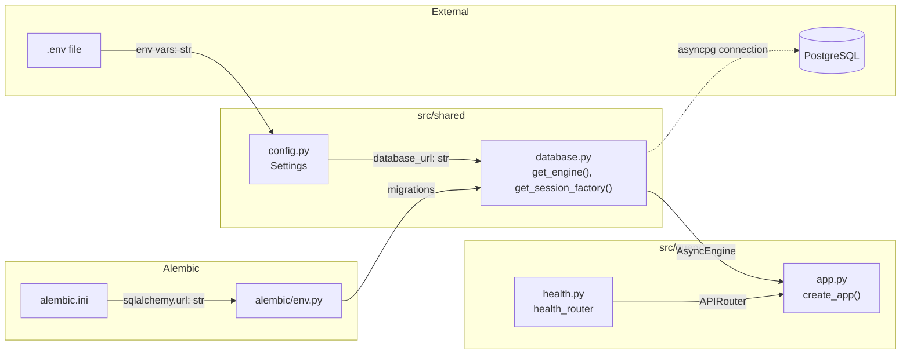
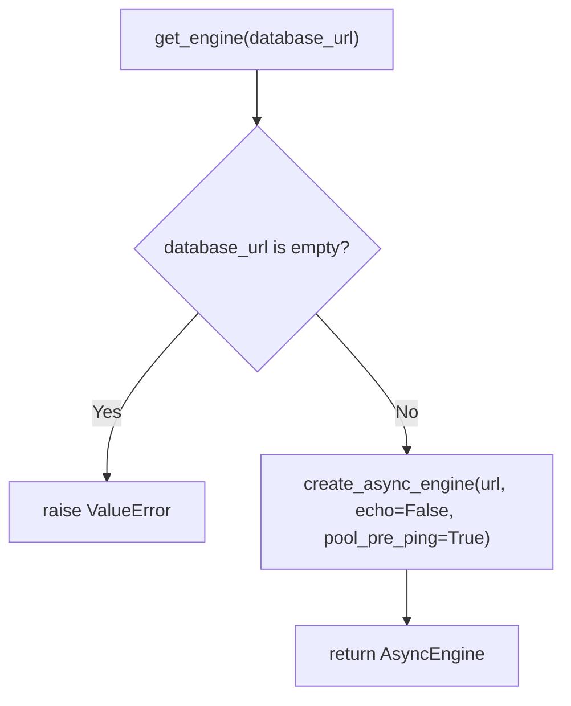
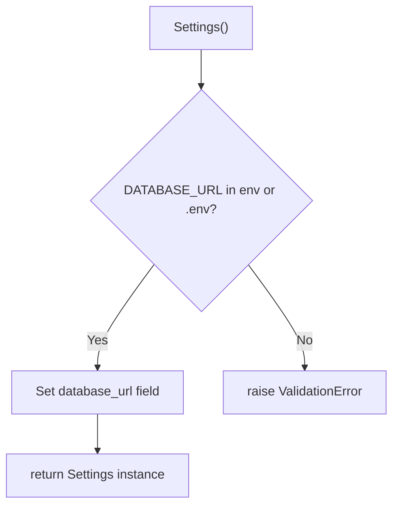

# Feature Detailed Design: Project Skeleton & CI (Feature #1)

**Date**: 2026-03-21
**Feature**: #1 — Project Skeleton & CI
**Priority**: high
**Dependencies**: none
**Design Reference**: docs/plans/2026-03-21-code-context-retrieval-design.md § 2 (Approach), § 3.4 (Tech Stack)
**SRS Reference**: Infrastructure — no dedicated FR (supports all FRs)

## Context

This feature establishes the foundational project structure for the Code Context Retrieval system: three Python packages (`src/indexing`, `src/query`, `src/shared`), pyproject.toml with all dependencies, pytest configuration, Alembic migration setup, and a basic health check endpoint. All subsequent features depend on this skeleton being correctly set up.

## Design Alignment

The system design (§2) specifies a Modular Monolith with three internal packages deployed as 3 Docker images sharing the same codebase:

- **Key classes**: `create_app()` factory (FastAPI), `health_router` (APIRouter), `Settings` (Pydantic BaseSettings), `get_engine()` / `get_session_factory()` (SQLAlchemy async)
- **Interaction flow**: `create_app()` → includes `health_router` → serves `/api/v1/health`; `Settings` → loads `.env` → provides `database_url`; `get_engine(url)` → creates `AsyncEngine`; `get_session_factory(engine)` → creates `async_sessionmaker`
- **Third-party deps**: FastAPI 0.115.6, SQLAlchemy 2.0.36, Alembic 1.14.1, asyncpg 0.30.0, pydantic-settings, pytest 8.3.4, pytest-cov 6.0.0, mutmut 3.2.0
- **Deviations**: none

## SRS Requirement

N/A — Feature #1 is infrastructure. The closest SRS references are:

- § 1 Purpose & Scope: "Two independent clusters… Offline Index Cluster, Online Query Cluster"
- Design § 2: "Single Python project with three internal packages (`src/indexing`, `src/query`, `src/shared`)"
- Design § 3.4: Full tech stack table (Python 3.11+, FastAPI, SQLAlchemy, Alembic, etc.)

Verification steps from feature-list.json serve as acceptance criteria:

- **VS-1**: `pip install -e .[dev]` succeeds, pytest available
- **VS-2**: `pytest tests/test_skeleton.py` passes
- **VS-3**: `import src.shared`, `src.indexing`, `src.query` all succeed
- **VS-4**: `alembic check` confirms migrations are in sync

## Component Data-Flow Diagram



## Interface Contract

| Method | Signature | Preconditions | Postconditions | Raises |
|--------|-----------|---------------|----------------|--------|
| `create_app` | `create_app() -> FastAPI` | None | Returns FastAPI instance with title="Code Context Retrieval", version="0.1.0", `/api/v1/health` route registered | — |
| `health_check` | `health_check() -> dict` | App is running | Returns `{"status": "ok", "service": "code-context-retrieval"}` | — |
| `Settings.__init__` | `Settings(**kwargs) -> Settings` | `DATABASE_URL` env var is set or `.env` file contains it | `settings.database_url` is a non-empty string | `ValidationError` if `DATABASE_URL` missing |
| `get_settings` | `get_settings() -> Settings` | `DATABASE_URL` available in env | Returns valid `Settings` instance | `ValidationError` if `DATABASE_URL` missing |
| `get_engine` | `get_engine(database_url: str) -> AsyncEngine` | `database_url` is a non-empty valid connection string | Returns `AsyncEngine` instance with `pool_pre_ping=True` | `ValueError` if `database_url` is empty string |
| `get_session_factory` | `get_session_factory(engine: AsyncEngine) -> async_sessionmaker` | `engine` is a valid `AsyncEngine` | Returns `async_sessionmaker` with `expire_on_commit=False` | — |

**Design rationale**:
- `pool_pre_ping=True` in `get_engine` ensures stale connections are detected before use (required for long-running Celery workers)
- `expire_on_commit=False` prevents lazy-load issues in async context
- Settings uses `extra="ignore"` to allow other env vars without validation errors

## Internal Sequence Diagram

N/A — single-module features with no internal cross-method delegation worth diagramming. Each function is self-contained: `create_app()` creates and returns, `get_engine()` creates and returns, `get_session_factory()` wraps engine. Error paths documented in Algorithm error handling table below.

## Algorithm / Core Logic

### create_app()

#### Pseudocode

```
FUNCTION create_app() -> FastAPI
  // Step 1: Create FastAPI with metadata
  app = FastAPI(title="Code Context Retrieval", version="0.1.0")
  // Step 2: Mount health router at /api/v1 prefix
  app.include_router(health_router, prefix="/api/v1")
  RETURN app
END
```

> No flow diagram needed — straight-line, no branching.

#### Boundary Decisions

| Parameter | Min | Max | Empty/Null | At boundary |
|-----------|-----|-----|------------|-------------|
| N/A — no parameters | — | — | — | — |

#### Error Handling

| Condition | Detection | Response | Recovery |
|-----------|-----------|----------|----------|
| N/A — no error paths | — | — | — |

### get_engine()

#### Flow Diagram



#### Pseudocode

```
FUNCTION get_engine(database_url: str) -> AsyncEngine
  // Step 1: Validate input
  IF database_url is empty THEN raise ValueError("database_url must not be empty")
  // Step 2: Create engine with connection pool settings
  RETURN create_async_engine(database_url, echo=False, pool_pre_ping=True)
END
```

#### Boundary Decisions

| Parameter | Min | Max | Empty/Null | At boundary |
|-----------|-----|-----|------------|-------------|
| `database_url` | 1 char | No limit | Raises `ValueError` | Single char is technically accepted (will fail at connect time) |

#### Error Handling

| Condition | Detection | Response | Recovery |
|-----------|-----------|----------|----------|
| Empty `database_url` | `if not database_url` | `ValueError("database_url must not be empty")` | Caller provides valid URL |

### Settings

#### Flow Diagram



#### Pseudocode

```
FUNCTION Settings.__init__() -> Settings
  // Step 1: Pydantic loads DATABASE_URL from env vars or .env file
  // Step 2: If missing, ValidationError raised automatically by pydantic
  RETURN self with database_url set
END
```

#### Error Handling

| Condition | Detection | Response | Recovery |
|-----------|-----------|----------|----------|
| `DATABASE_URL` not set | Pydantic field validation | `ValidationError` mentioning `database_url` | Set env var or add to `.env` |

### health_check

> Delegates to FastAPI — returns a static dict. No algorithm.

### get_session_factory

> Delegates to SQLAlchemy `async_sessionmaker` — wraps engine. No algorithm.

## State Diagram

N/A — stateless feature. No object lifecycle managed.

## Test Inventory

| ID | Category | Traces To | Input / Setup | Expected | Kills Which Bug? |
|----|----------|-----------|---------------|----------|-----------------|
| A | happy path | VS-2 | Installed project | `pytest tests/test_skeleton.py` passes | Broken package structure |
| B | happy path | VS-3 | Installed project | `import src.shared; src.indexing; src.query` all succeed | Missing `__init__.py` files |
| C | happy path | VS-4 | Alembic config present | `alembic.ini` exists, `alembic/env.py` uses async engine | Missing alembic setup |
| D | happy path | §IC: create_app | Call `create_app()` | Returns `FastAPI` instance | Wrong return type |
| E | happy path | §IC: create_app | Call `create_app()` | `/api/v1/health` in `app.routes` | Missing router inclusion |
| F | happy path | §IC: health_check | GET `/api/v1/health` via TestClient | 200, body = `{"status": "ok", "service": "code-context-retrieval"}` | Wrong response body |
| G | happy path | §IC: get_settings | Set `DATABASE_URL` env var | `settings.database_url` matches env value | Settings not reading env |
| H | error | §IC: Settings Raises | Unset `DATABASE_URL`, construct `Settings(_env_file=None)` | Raises `ValidationError` mentioning `database_url` | Missing required field validation |
| I | happy path | §IC: get_engine | `get_engine("sqlite+aiosqlite:///test.db")` | Returns `AsyncEngine` instance, URL contains "test.db" | Engine factory broken |
| J | happy path | §IC: get_session_factory | `get_session_factory(engine)` | Returns `async_sessionmaker` instance | Session factory misconfigured |
| K1 | boundary | §Algo: get_engine boundary | `get_engine("")` | Raises exception | Missing empty URL check |
| K2 | error | §IC: health_check | GET `/health` (wrong path) | 404 response | Route prefix misconfigured |
| L | happy path | §IC: create_app | Call `create_app()` | `app.title == "Code Context Retrieval"`, `app.version == "0.1.0"` | Wrong metadata |
| M | happy path | §IC: health_check | GET `/api/v1/health` | Response keys are exactly `{"status", "service"}` | Extra/missing keys in response |

**Negative ratio**: 3 error/boundary (H, K1, K2) out of 14 = 21%. Infrastructure feature with minimal error paths — all Raises entries in Interface Contract are covered.

## Tasks

### Task 1: Verify existing tests match inventory
**Files**: `tests/test_feature_1_skeleton.py`
**Steps**:
1. Existing tests already map to inventory rows A-M
2. Run: `source .venv/bin/activate && pytest tests/test_feature_1_skeleton.py -v`
3. **Expected**: All 10 tests PASS

### Task 2: Verify implementation matches Interface Contract
**Files**: `src/query/app.py`, `src/query/health.py`, `src/shared/config.py`, `src/shared/database.py`
**Steps**:
1. Implementation already exists — verify alignment with Interface Contract and Algorithm pseudocode
2. Run: `source .venv/bin/activate && pytest tests/test_feature_1_skeleton.py -v`
3. **Expected**: All tests PASS

### Task 3: Coverage Gate
1. Run: `source .venv/bin/activate && pytest --cov=src --cov-branch --cov-report=term-missing tests/`
2. Check: line >= 90%, branch >= 80%
3. Record coverage output as evidence.

### Task 4: Refactor
1. Review code for clarity — no refactoring expected for this simple infrastructure
2. Run full test suite. All tests PASS.

### Task 5: Mutation Gate
1. Run: `source .venv/bin/activate && mutmut run --paths-to-mutate=src/query/app.py,src/query/health.py,src/shared/config.py,src/shared/database.py`
2. Run: `mutmut results`
3. Check: mutation score >= 80%. If below: improve assertions.

### Task 6: Create example
1. Create `examples/01-health-check.py` — script that starts app and hits health endpoint
2. Run example to verify.

## Verification Checklist
- [x] All verification_steps traced to Interface Contract postconditions
- [x] All verification_steps traced to Test Inventory rows (VS-1→install, VS-2→A, VS-3→B, VS-4→C)
- [x] Algorithm pseudocode covers all non-trivial methods (create_app, get_engine, Settings)
- [x] Boundary table covers all algorithm parameters (database_url)
- [x] Error handling table covers all Raises entries (ValueError, ValidationError)
- [x] Test Inventory negative tests cover ALL error paths (H, K1, K2)
- [x] Every skipped section has explicit "N/A — [reason]"
