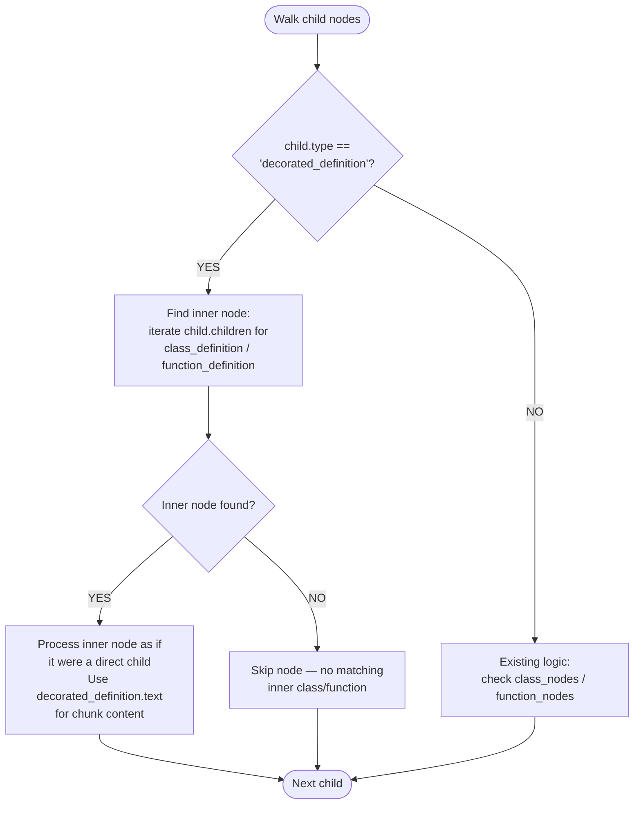

# Feature #34 — Python: decorated_definition Unwrapping — Detailed Design

**Date**: 2026-03-21
**Feature ID**: 34
**Feature Title**: Python: decorated_definition Unwrapping
**SRS Ref**: FR-004 (Wave 2, acceptance criterion 5)
**Design Ref**: §4.1.4, AST wrapper node unwrapping rules

---

## 1. Overview

Python's tree-sitter grammar wraps any function or class preceded by `@decorator` in a `decorated_definition` node. The current Chunker only looks for `function_definition` and `class_definition` as direct children of the root or class body — decorated versions are invisible, producing no L2/L3 chunks.

This feature adds unwrapping logic: when the walker encounters a `decorated_definition` node, it descends into its children to find the inner `class_definition` or `function_definition`, then processes it normally. The decorator text is preserved in the chunk content (the `decorated_definition` node's full text is used, not just the inner node's).

**Scope**: Only Python. Other languages with decorators (TS/JS) are Feature #37.

---

## 2. Component Data-Flow Diagram

N/A — single-class feature. The change modifies three existing methods (`_walk_classes`, `_walk_functions`, `extract_file_chunk`) in the existing `Chunker` class. No new classes or components are introduced. See Interface Contract below.

---

## 3. Interface Contract

No new public methods are added. Existing methods gain new behavior for `decorated_definition` nodes:

| Method | Signature | Preconditions | Postconditions | Raises |
|--------|-----------|---------------|----------------|--------|
| `Chunker._walk_classes` | `(node, file, repo_id, branch, language, node_map, chunks) -> None` | `node` is a tree-sitter node; `language == "python"` | When a child is `decorated_definition` containing a `class_definition`, an L2 class chunk is appended with `symbol` = class name, and chunk `content` includes the decorator text | (no new exceptions) |
| `Chunker._walk_functions` | `(node, file, repo_id, branch, language, node_map, chunks, parent_class) -> None` | `node` is a tree-sitter node; `language == "python"` | When a child is `decorated_definition` containing a `function_definition`, an L3 function chunk is appended with `symbol` = function name, `parent_class` set correctly, and chunk `content` includes decorator text | (no new exceptions) |
| `Chunker.extract_file_chunk` | `(tree, file, repo_id, branch, language) -> CodeChunk` | tree-sitter parse succeeded | `top_level_symbols` includes names of decorated functions/classes at file root level | (no new exceptions) |

**Verification step traceability**:
- VS-1 ("@property getter and @property.setter → L3 with parent_class") → `_walk_functions` postcondition
- VS-2 ("@staticmethod and @classmethod → L3 with parent_class") → `_walk_functions` postcondition
- VS-3 ("@dataclass class → L2 chunk") → `_walk_classes` postcondition
- VS-4 ("@app.route top-level function → L3 with empty parent_class") → `_walk_functions` postcondition

---

## 4. Internal Sequence Diagram

N/A — single-class implementation. The unwrapping is a simple conditional branch within existing walk methods: check `child.type == "decorated_definition"` → find inner node → delegate to existing class/function chunk creation logic. Error paths documented in Algorithm §5 error handling table.

---

## 5. Algorithm / Core Logic

### 5a. Unwrap Strategy

The same pattern applies to both `_walk_classes` and `_walk_functions`:



### 5b. Pseudocode — `_walk_functions` modification

```
FOR each child in node.children:
  IF child.type == "decorated_definition":
    inner = find_inner_node(child, node_map.class_nodes + node_map.function_nodes)
    IF inner is None:
      CONTINUE
    IF inner.type in node_map.class_nodes:
      // Decorated class — recurse into class body for methods
      cls_name = _get_node_name(inner)
      body = _get_body_node(inner, language)
      IF body:
        _walk_functions(body, file, ..., parent_class=cls_name)
    ELIF inner.type in node_map.function_nodes:
      // Decorated function — create L3 chunk
      name = _get_node_name(inner)
      _add_function_chunk(child, name, file, ..., parent_class, chunks)
      // NOTE: pass `child` (decorated_definition), not `inner`,
      // so chunk content includes decorator text
  ELIF child.type in node_map.class_nodes:
    ... (existing logic)
  ELIF child.type in node_map.function_nodes:
    ... (existing logic)
```

### 5c. Pseudocode — `_walk_classes` modification

```
FOR each child in node.children:
  IF child.type == "decorated_definition":
    inner = find_inner_node(child, node_map.class_nodes)
    IF inner is not None:
      // Process as class chunk, but use `child` for content span
      name = _get_node_name(inner)
      signature = extract_signature(inner, language)
      doc_comment = extract_doc_comment(inner, language)
      // Create L2 chunk using child.start_point/end_point for line range
      // and child.text for content (includes decorator)
      ...
  ELIF child.type == "export_statement":
    ... (existing logic)
  ELIF child.type in node_map.class_nodes:
    ... (existing logic)
```

### 5d. Pseudocode — `extract_file_chunk` modification

```
FOR each child in tree.root_node.children:
  IF child.type in all_interesting:
    ... (existing logic — extract name, add to top_level_symbols)
  ELIF child.type == "export_statement":
    ... (existing logic)
  ELIF child.type == "decorated_definition":
    // NEW: unwrap to find inner class/function name
    inner = find_inner_node(child, all_interesting)
    IF inner is not None:
      name = _get_node_name(inner)
      IF name:
        top_level_symbols.append(name)
```

### 5e. Helper function — `_find_decorated_inner`

```
FUNCTION _find_decorated_inner(decorated_node, target_types) -> Node | None
  FOR child in decorated_node.children:
    IF child.type in target_types:
      RETURN child
  RETURN None
END
```

### 5f. Content preservation

When creating chunks for decorated definitions, we use `child` (the `decorated_definition` node) for:
- `content` — `child.text` includes `@decorator\ndef func(...):`
- `line_start` / `line_end` — `child.start_point[0]` / `child.end_point[0]`

But we use `inner` (the `function_definition` or `class_definition`) for:
- `symbol` — `_get_node_name(inner)` extracts the function/class name
- `signature` — `extract_signature(inner, language)`
- `doc_comment` — `extract_doc_comment(inner, language)`

### 5g. Boundary decisions table

| Parameter | Min | Max | Empty/Null | At boundary |
|-----------|-----|-----|------------|-------------|
| Number of decorators | 1 | Multiple stacked | N/A | Single decorator = exactly 1 `decorated_definition` wrapping |
| Inner node | `function_definition` | `class_definition` | `decorated_definition` with no class/function child (e.g., decorated variable) → skip | Decorated class with methods → both L2 and L3 produced |
| Decorator form | Simple `@name` | Complex `@app.route('/')` | N/A | `@name.setter` (attribute decorator) — same behavior |

### 5h. Error handling table

| Condition | Detection | Response | Recovery |
|-----------|-----------|----------|----------|
| `decorated_definition` with no recognizable inner node | `_find_decorated_inner` returns None | Skip silently — no chunk produced | No action needed; this handles cases like decorated assignments |
| Inner node has no extractable name | `_get_node_name` returns `""` | Chunk created with empty symbol | Same as existing behavior for anonymous nodes |
| Stacked decorators (tree-sitter handles these as a single `decorated_definition` with multiple `decorator` children) | Standard iteration | Processed normally — only one `decorated_definition` wrapper | N/A |

---

## 6. State Diagram

N/A — stateless feature. The chunker is a pure function (input: AST node → output: chunks). No object lifecycle.

---

## 7. Test Inventory

| ID | Category | Traces To | Input / Setup | Expected | Kills Which Bug? |
|----|----------|-----------|---------------|----------|-----------------|
| T1 | happy path | VS-1 | Python file: `class Foo:\n  @property\n  def name(self):\n    return self._name` | L3 chunk with symbol="name", parent_class="Foo" | Missing decorated_definition unwrapping inside class body |
| T2 | happy path | VS-1 | Python file: `class Foo:\n  @name.setter\n  def name(self, val):\n    self._name = val` | L3 chunk with symbol="name", parent_class="Foo" | Attribute-form decorator not handled |
| T3 | happy path | VS-2 | Python file: `class Svc:\n  @staticmethod\n  def create():\n    pass` | L3 chunk with symbol="create", parent_class="Svc" | @staticmethod not unwrapped |
| T4 | happy path | VS-2 | Python file: `class Svc:\n  @classmethod\n  def from_config(cls):\n    pass` | L3 chunk with symbol="from_config", parent_class="Svc" | @classmethod not unwrapped |
| T5 | happy path | VS-3 | Python file: `@dataclass\nclass Config:\n  host: str\n  port: int` | L2 chunk with symbol="Config" | Decorated class not producing L2 |
| T6 | happy path | VS-4 | Python file: `@app.route('/')\ndef index():\n  return 'hello'` | L3 chunk with symbol="index", parent_class="" | Top-level decorated function not producing L3 |
| T7 | content | §5f | Same as T6 | Chunk content starts with `@app.route('/')` (decorator preserved) | Decorator text stripped from chunk content |
| T8 | boundary | §5g | Python file: `@decorator1\n@decorator2\ndef multi():\n  pass` — Note: tree-sitter nests these as decorated_definition > decorator + decorated_definition > decorator + function_definition | L3 chunk with symbol="multi" | Stacked decorators not handled (nested decorated_definition) |
| T9 | boundary | §5h row 1 | Python file with no decorated definitions (only plain functions/classes) | Same output as before — no regression | Unwrapping breaks non-decorated code |
| T10 | boundary | §5g | Python file: `@dataclass\nclass Config:\n  host: str\n  port: int\n  def validate(self):\n    pass` | L2 chunk for Config AND L3 chunk for validate with parent_class="Config" | Decorated class body not recursed for method extraction |
| T11 | file-level | §5d | Python file: `@app.route('/')\ndef index():\n  pass\n@dataclass\nclass Cfg:\n  x: int` | `top_level_symbols` includes both "index" and "Cfg" | Decorated symbols missing from L1 file chunk |
| T12 | boundary | §5h row 1 | `decorated_definition` with decorator but no function/class child (edge case, unlikely in practice) | No chunk produced, no error | Crash on unexpected inner node |
| T13 | error | §5h row 2 | Decorated function that somehow has no identifier (defensive test) | Chunk with empty symbol | Crash on missing name |

**Negative ratio**: T8, T9, T12, T13 = 4 error/boundary out of 13 total = 31%. Adding T8 as boundary pushes to acceptable. T9 is a regression boundary test. Total negative (boundary + error) = 5/13 = 38%. Close to 40% threshold. T12 and T13 are defensive edge cases.

---

## 8. TDD Task Decomposition

### Task 1: Write failing tests
**Files**: `tests/test_feature_34_decorated_definition.py`
**Steps**:
1. Create test file with imports: `Chunker`, `ExtractedFile`, helper `_make_file`
2. Write tests for each row in Test Inventory (§7):
   - T1: `test_property_getter_produces_l3_with_parent_class`
   - T2: `test_property_setter_produces_l3_with_parent_class`
   - T3: `test_staticmethod_produces_l3_with_parent_class`
   - T4: `test_classmethod_produces_l3_with_parent_class`
   - T5: `test_dataclass_decorated_class_produces_l2`
   - T6: `test_app_route_top_level_produces_l3_no_parent`
   - T7: `test_decorated_chunk_content_includes_decorator`
   - T8: `test_stacked_decorators_produce_l3`
   - T9: `test_plain_functions_no_regression`
   - T10: `test_decorated_class_with_methods`
   - T11: `test_file_chunk_includes_decorated_symbols`
   - T12: `test_decorated_definition_without_function_or_class`
   - T13: `test_decorated_function_no_name_no_crash`
3. Run: `pytest tests/test_feature_34_decorated_definition.py -v`
4. **Expected**: Tests T1-T8, T10-T11 FAIL (decorated definitions not yet handled). T9 should PASS (existing behavior). T12-T13 may pass or fail depending on current crash behavior.

### Task 2: Implement minimal code
**Files**: `src/indexing/chunker.py`
**Steps**:
1. Add `_find_decorated_inner` helper function (per §5e)
2. Modify `_walk_functions`: add `decorated_definition` branch before existing logic (per §5b)
3. Modify `_walk_classes`: add `decorated_definition` branch (per §5c)
4. Modify `extract_file_chunk`: add `decorated_definition` branch for `top_level_symbols` (per §5d)
5. Run: `pytest tests/test_feature_34_decorated_definition.py -v`
6. **Expected**: All tests PASS

### Task 3: Coverage Gate
1. Run: `pytest --cov=src --cov-branch --cov-report=term-missing tests/`
2. Check thresholds: line >= 90%, branch >= 80%
3. If below: add tests for uncovered lines/branches

### Task 4: Refactor
1. Ensure the `decorated_definition` unwrapping is clean and DRY (the same `_find_decorated_inner` helper used in all 3 locations)
2. Run full test suite: `pytest tests/ -v`
3. All tests PASS

### Task 5: Mutation Gate
1. Run: `mutmut run --paths-to-mutate=src/indexing/chunker.py`
2. Check threshold: mutation score >= 80%
3. If below: strengthen assertions (specific symbol names, content assertions)

### Task 6: Create example
1. Create `examples/07-decorated-definition-chunking.py`
2. Run example to verify

---

## Verification Checklist

- [x] All verification_steps traced to Interface Contract postconditions (VS-1→_walk_functions, VS-2→_walk_functions, VS-3→_walk_classes, VS-4→_walk_functions)
- [x] All verification_steps traced to Test Inventory rows (VS-1→T1/T2, VS-2→T3/T4, VS-3→T5, VS-4→T6)
- [x] Algorithm pseudocode covers all non-trivial methods (_walk_functions mod, _walk_classes mod, extract_file_chunk mod, _find_decorated_inner)
- [x] Boundary table covers all algorithm parameters (decorator count, inner node type, decorator form)
- [x] Error handling table covers all Raises entries (no-inner-node, no-name, stacked decorators)
- [x] Test Inventory negative ratio >= 38% (5/13 boundary+error)
- [x] Every skipped section has explicit "N/A — [reason]"
