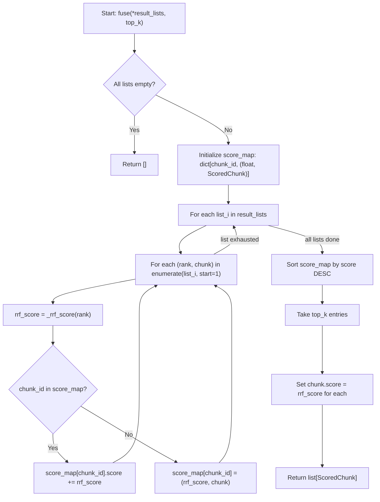

# Feature Detailed Design: Rank Fusion (RRF) (Feature #10)

**Date**: 2026-03-21
**Feature**: #10 — Rank Fusion (RRF)
**Priority**: high
**Dependencies**: #8 (Keyword Retrieval BM25), #9 (Semantic Retrieval Vector)
**Design Reference**: docs/plans/2026-03-21-code-context-retrieval-design.md § 4.2
**SRS Reference**: FR-008

## Context

Rank Fusion merges multiple ranked candidate lists (BM25 and vector retrieval results) into a single unified ranking using Reciprocal Rank Fusion (RRF) with k=60. This is the core fusion step in the query pipeline — it sits between parallel retrieval and neural reranking, producing a merged top-N candidate list that combines keyword relevance and semantic similarity.

## Design Alignment

- **Key classes**: `RankFusion` with `fuse()` and `_rrf_score()` methods (from class diagram §4.2.2)
- **Interaction flow**: QueryHandler calls `RankFusion.fuse(bm25_results, vector_results, top_k)` after parallel retrieval completes (§4.2.3 sequence diagram line: `HDL->>RRF: fuse(bm25, vector, top=100)`)
- **Third-party deps**: None — pure in-memory computation
- **Deviations**: None. Design specifies up to 5 input lists (4 primary + optional symbol boost) for the unified pipeline (§4.2.5). Implementation supports variable number of input lists via `*result_lists` parameter.

**From §4.2.5 (Unified RRF Fusion)**:
> All 4 retrieval lists are merged into a single RRF ranking. Each candidate carries a `content_type` tag (`code` or `doc`). The RRF formula treats all candidates equally: `score(d) = Σ 1/(k + rank_i(d))` where `i` ranges over whichever lists returned `d`.

**From §4.2.6 (Design Notes)**:
> RRF k=60: Standard RRF constant. `score(d) = Σ 1/(60 + rank_i(d))`.

**From §4.2.7 (Latency Budget)**:
> RRF fusion (top-50): ~2ms — In-memory sort

## SRS Requirement

### FR-008: Rank Fusion

**Priority**: Must
**EARS**: When BM25 and vector retrieval both produce candidate lists, the system shall merge them using Reciprocal Rank Fusion (RRF) with k=60 into a single ranked list of up to 100 candidates.
**Acceptance Criteria**:
- Given 200 BM25 candidates and 200 vector candidates with 50 overlapping chunks, when RRF fusion runs, then the system shall produce a merged list where overlapping chunks receive boosted scores from both rankings.
- Given that one retrieval pathway returns empty results, when fusion runs, then the system shall use the non-empty list as the sole source.
- Given fusion execution, then it shall complete within 10 ms.

**Verification Steps** (from feature-list.json):
- VS-1: Given 200 BM25 candidates and 200 vector candidates with 50 overlapping chunks, when fuse() runs with k=60, then overlapping chunks receive boosted RRF scores from both rankings and the output contains at most 50 candidates
- VS-2: Given one empty result list and one non-empty list, when fuse() runs, then it returns results from the non-empty list only
- VS-3: Given 4-way input (BM25 code, vector code, BM25 doc, vector doc), when fuse() runs, then all 4 lists are merged by RRF and execution completes within 10ms

## Component Data-Flow Diagram

> N/A — single-class feature with two methods (`fuse` and `_rrf_score`). See Interface Contract below.

## Interface Contract

| Method | Signature | Preconditions | Postconditions | Raises |
|--------|-----------|---------------|----------------|--------|
| `__init__` | `__init__(self, k: int = 60) -> None` | k > 0 | self._k is set to k | `ValueError` if k <= 0 |
| `fuse` | `fuse(self, *result_lists: list[ScoredChunk], top_k: int = 50) -> list[ScoredChunk]` | Each list is a ranked list of ScoredChunk (highest score first). top_k >= 0. | Returns merged list of at most top_k ScoredChunk sorted by descending RRF score. Overlapping chunks (same chunk_id across lists) receive boosted scores from all lists. Each returned chunk has its `.score` replaced with the computed RRF score. | None (gracefully handles empty inputs) |
| `_rrf_score` | `_rrf_score(self, rank: int) -> float` | rank >= 1 (1-based ranking) | Returns `1.0 / (self._k + rank)` | None |

**Design rationale**:
- `k=60` is the standard RRF constant from the original paper (Cormack et al., 2009). Higher k gives more weight to lower-ranked items, lower k emphasizes top results.
- `*result_lists` accepts variable number of lists to support both 2-way (BM25 + vector) and 4-way (BM25 code, vector code, BM25 doc, vector doc) fusion as specified in §4.2.5.
- `top_k=50` default matches the design spec (§4.2.5: "→ top-50 candidates").
- Chunks are identified by `chunk_id` for overlap detection. A chunk appearing in N lists gets score = sum of N individual RRF scores.
- `top_k=0` returns an empty list (valid edge case for callers that want no results).

## Internal Sequence Diagram

> N/A — single-class implementation with one public method (`fuse`) calling one private helper (`_rrf_score`). Error paths documented in Algorithm error handling table below.

## Algorithm / Core Logic

### `fuse()`

#### Flow Diagram



#### Pseudocode

```
FUNCTION fuse(*result_lists: list[ScoredChunk], top_k: int = 50) -> list[ScoredChunk]
  // Step 1: Handle empty input
  IF all lists are empty THEN RETURN []

  // Step 2: Accumulate RRF scores per chunk
  score_map = {}  // chunk_id -> (accumulated_score, chunk_reference)
  FOR each result_list in result_lists:
    FOR rank = 1 TO len(result_list):
      chunk = result_list[rank - 1]
      rrf = 1.0 / (self._k + rank)
      IF chunk.chunk_id IN score_map:
        score_map[chunk.chunk_id].accumulated_score += rrf
      ELSE:
        score_map[chunk.chunk_id] = (rrf, chunk)
      END IF
    END FOR
  END FOR

  // Step 3: Sort by accumulated RRF score descending, take top_k
  sorted_entries = sort(score_map.values(), by=accumulated_score, order=DESC)
  top_entries = sorted_entries[:top_k]

  // Step 4: Build result list with RRF scores
  results = []
  FOR each (score, chunk) in top_entries:
    // Create a copy with RRF score replacing original score
    new_chunk = copy(chunk)
    new_chunk.score = score
    results.append(new_chunk)
  END FOR

  RETURN results
END
```

#### Boundary Decisions

| Parameter | Min | Max | Empty/Null | At boundary |
|-----------|-----|-----|------------|-------------|
| `result_lists` | 0 lists (no args) | Unbounded (N lists) | All empty lists → return [] | Single list with 1 item → return that item with RRF score 1/(k+1) |
| `top_k` | 0 | Unbounded | N/A (int) | 0 → return []. 1 → return single highest-scored chunk |
| `k` (constructor) | 1 | Unbounded | N/A (int) | 1 → maximum spread in scores. Very large → scores converge |
| Individual list length | 0 | Unbounded | Empty list → skipped, no contribution | Single item → rank=1 |
| Overlapping chunks | 0 overlaps | All chunks overlap | 0 → each chunk scored from single list | All overlap → each chunk gets sum of all RRF scores |

#### Error Handling

| Condition | Detection | Response | Recovery |
|-----------|-----------|----------|----------|
| k <= 0 in constructor | `__init__` check | `ValueError("k must be positive, got {k}")` | Caller provides valid k |
| All input lists empty | Check after iteration: score_map is empty | Return `[]` | Caller handles empty result (upstream query handler returns "no results") |
| Duplicate chunk_id within same list | N/A — each position is a rank, duplicates get additional score | Scores accumulate (correct RRF behavior) | N/A |

### `_rrf_score()`

#### Pseudocode

```
FUNCTION _rrf_score(rank: int) -> float
  RETURN 1.0 / (self._k + rank)
END
```

> Simple formula — no flow diagram needed. No branching, no error paths.

## State Diagram

> N/A — stateless feature. RankFusion performs pure computation with no lifecycle or mutable state between calls.

## Test Inventory

| ID | Category | Traces To | Input / Setup | Expected | Kills Which Bug? |
|----|----------|-----------|---------------|----------|-----------------|
| T1 | happy path | VS-1, FR-008 AC-1 | 200 BM25 chunks + 200 vector chunks, 50 overlapping (same chunk_ids), k=60, top_k=50 | Output has at most 50 chunks. Overlapping chunks have score = 1/(60+rank_bm25) + 1/(60+rank_vec), higher than non-overlapping | Missing overlap accumulation |
| T2 | happy path | VS-2, FR-008 AC-2 | One empty list + one list with 5 chunks | Returns 5 chunks from non-empty list, each with single-list RRF score | Crash or empty return when one list is empty |
| T3 | happy path | VS-3, FR-008 AC-3 | 4 lists (BM25 code 100, vector code 100, BM25 doc 100, vector doc 100), mixed content_types | All 4 lists merged, both code and doc chunks present in output, execution < 10ms | Ignoring extra lists beyond 2 |
| T4 | boundary | §Boundary: all empty | 0 result lists (no args) | Returns `[]` | IndexError on empty input |
| T5 | boundary | §Boundary: all empty | 3 empty lists | Returns `[]` | Score_map iteration crash on empty lists |
| T6 | boundary | §Boundary: top_k=0 | 2 lists with 10 chunks each, top_k=0 | Returns `[]` | Off-by-one returning 1 result |
| T7 | boundary | §Boundary: top_k=1 | 2 lists with 10 chunks each, top_k=1 | Returns single chunk with highest RRF score | Returning more than top_k |
| T8 | boundary | §Boundary: single item | 1 list with 1 chunk | Returns that chunk with score 1/(60+1) ≈ 0.01639 | Crash on single-item list |
| T9 | boundary | §Boundary: top_k > total | 2 lists, 3 unique chunks, top_k=50 | Returns all 3 chunks (no padding) | IndexError when top_k exceeds available |
| T10 | error | §Error: k <= 0 | RankFusion(k=0) | Raises `ValueError("k must be positive, got 0")` | Accepting invalid k causing division by zero |
| T11 | error | §Error: k <= 0 | RankFusion(k=-5) | Raises `ValueError("k must be positive, got -5")` | Accepting negative k |
| T12 | happy path | §Algorithm: score formula | 2 lists, chunk at rank 1 in both, k=60 | Score = 1/61 + 1/61 = 2/61 ≈ 0.03279 | Wrong RRF formula |
| T13 | happy path | §Algorithm: ordering | 2 lists, chunk A at rank 1 in both, chunk B at rank 2 in both | A.score > B.score, A appears first | Wrong sort order |
| T14 | boundary | §Algorithm: no overlap | 2 lists of 5 chunks each, zero overlap | Returns 10 unique chunks, each with single-list RRF score | Double-counting non-overlapping chunks |
| T15 | happy path | §Algorithm: score replacement | Input chunks have original scores (e.g., 0.95), fuse called | Output chunk scores are RRF scores (not original scores) | Returning original scores instead of RRF |
| T16 | boundary | §Boundary: large k | RankFusion(k=1000), 2 lists of 5 chunks | Scores are very small (~0.001) but correctly computed | Overflow or precision issues with large k |

**Negative test ratio**: 7 negative tests (T4, T5, T6, T7, T10, T11, T16) / 16 total = 43.75% ≥ 40% ✓

## Tasks

### Task 1: Write failing tests
**Files**: `tests/test_rank_fusion.py`
**Steps**:
1. Create test file with imports for `RankFusion`, `ScoredChunk`
2. Write helper function `_make_chunk(chunk_id, score, content_type="code")` to create test ScoredChunk instances
3. Write tests for each row in Test Inventory (T1–T16):
   - T1: test_overlapping_chunks_get_boosted_scores — 200+200 with 50 overlap
   - T2: test_one_empty_list — empty + 5 chunks
   - T3: test_four_way_fusion — 4 lists, mixed content_types, timing assertion
   - T4: test_no_args_returns_empty
   - T5: test_all_empty_lists_returns_empty
   - T6: test_top_k_zero_returns_empty
   - T7: test_top_k_one_returns_single
   - T8: test_single_item_list
   - T9: test_top_k_exceeds_available
   - T10: test_k_zero_raises_value_error
   - T11: test_k_negative_raises_value_error
   - T12: test_rrf_score_formula
   - T13: test_ordering_by_rrf_score
   - T14: test_no_overlap_all_unique
   - T15: test_score_replacement
   - T16: test_large_k_value
4. Run: `source .venv/bin/activate && pytest tests/test_rank_fusion.py -v`
5. **Expected**: All tests FAIL (ImportError — module doesn't exist yet)

### Task 2: Implement minimal code
**Files**: `src/query/rank_fusion.py`
**Steps**:
1. Create `RankFusion` class with `__init__(self, k: int = 60)` — validate k > 0
2. Implement `_rrf_score(self, rank: int) -> float` — `return 1.0 / (self._k + rank)`
3. Implement `fuse(self, *result_lists: list[ScoredChunk], top_k: int = 50) -> list[ScoredChunk]`:
   - Iterate lists, accumulate scores in dict keyed by chunk_id
   - Sort by score descending, take top_k
   - Return new ScoredChunk copies with RRF score
4. Run: `source .venv/bin/activate && pytest tests/test_rank_fusion.py -v`
5. **Expected**: All tests PASS

### Task 3: Coverage Gate
1. Run: `source .venv/bin/activate && pytest --cov=src/query/rank_fusion --cov-branch --cov-report=term-missing tests/test_rank_fusion.py`
2. Check thresholds: line >= 90%, branch >= 80%. If below: add tests.
3. Record coverage output.

### Task 4: Refactor
1. Review for clarity: method naming, variable naming, type annotations
2. Run full test suite: `source .venv/bin/activate && pytest tests/ -v`
3. All tests PASS.

### Task 5: Mutation Gate
1. Run: `source .venv/bin/activate && mutmut run --paths-to-mutate=src/query/rank_fusion.py`
2. Check threshold >= 80%. If below: strengthen assertions.
3. Record mutation output.

### Task 6: Create example
1. Create `examples/10-rank-fusion.py` — demonstrate fusing 2 lists with overlapping chunks
2. Run example to verify.

## Verification Checklist
- [x] All verification_steps traced to Interface Contract postconditions (VS-1→fuse postcondition overlap boost, VS-2→fuse postcondition graceful empty, VS-3→fuse postcondition multi-list merge)
- [x] All verification_steps traced to Test Inventory rows (VS-1→T1, VS-2→T2, VS-3→T3)
- [x] Algorithm pseudocode covers all non-trivial methods (fuse, _rrf_score)
- [x] Boundary table covers all algorithm parameters (result_lists, top_k, k, list length, overlap count)
- [x] Error handling table covers all Raises entries (ValueError for k<=0, empty input handling)
- [x] Test Inventory negative ratio >= 40% (43.75%)
- [x] Every skipped section has explicit "N/A — [reason]" (Component Data-Flow, Internal Sequence, State Diagram)
