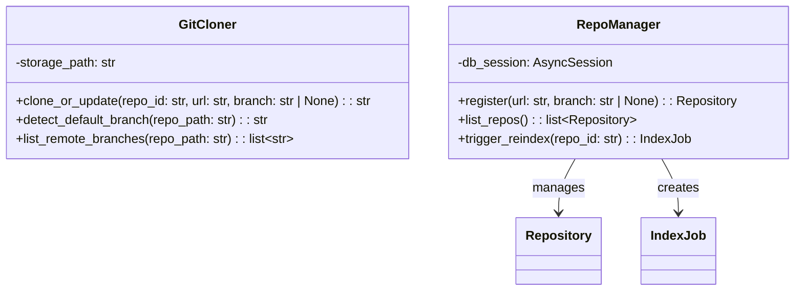
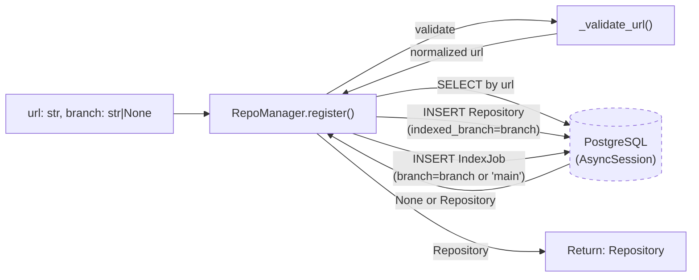
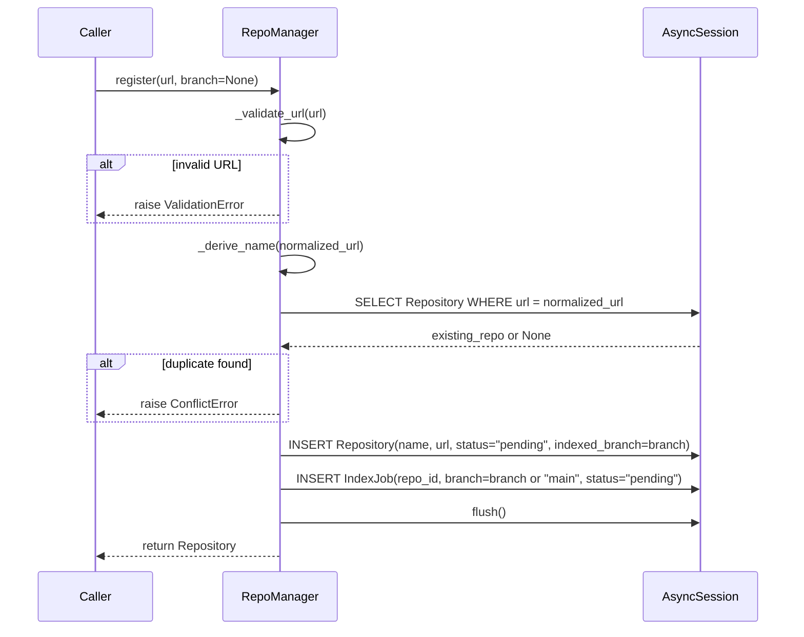
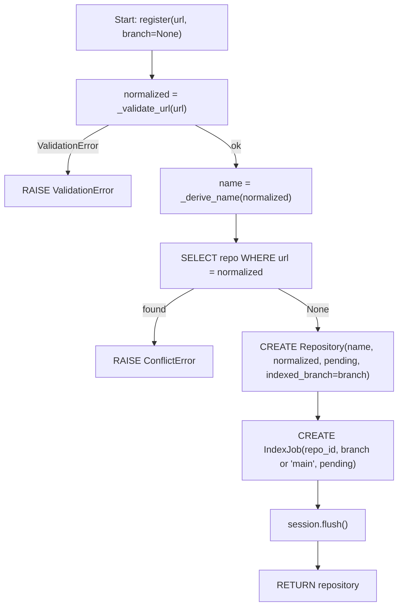
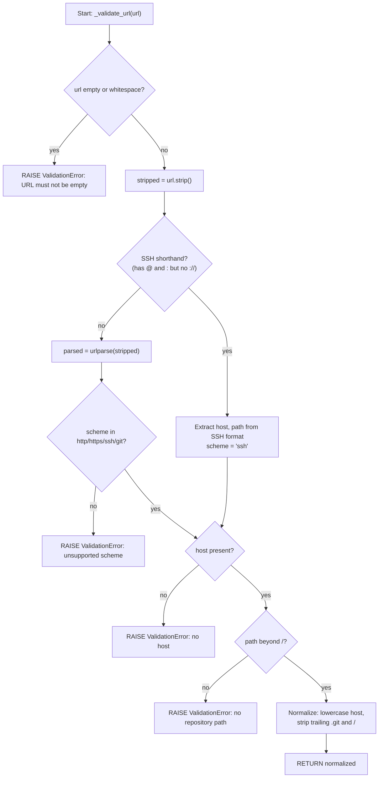
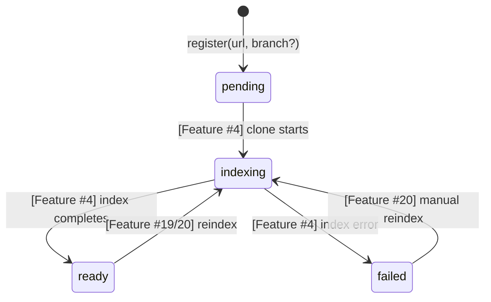

# Feature Detailed Design: Repository Registration (Feature #3) [Wave 1 Update]

**Date**: 2026-03-21
**Feature**: #3 — Repository Registration
**Priority**: high
**Dependencies**: [#2 Data Model & Migrations (passing)]
**Design Reference**: docs/plans/2026-03-21-code-context-retrieval-design.md § 4.1, § 4.5
**SRS Reference**: FR-001 (Wave 1 modified)

## Context

RepoManager is a service that validates Git URLs, accepts an optional branch parameter, checks for duplicate registrations, creates Repository records (with `indexed_branch`) in PostgreSQL, and queues initial indexing jobs. Wave 1 adds branch selection: callers can specify which branch to index, or leave it null for default-branch detection at clone time.

## Design Alignment

From design doc §4.1.3 sequence (Wave 1 updated):
```
Admin → API: POST /api/v1/repos {url, branch?}
API → DB: Insert repo record (status=pending, indexed_branch=branch)
API → RB: Enqueue index_job(repo_id)
API → Admin: 201 {repo_id, job_id}
```

From design doc §4.1.2 class diagram:


- **Key classes**: `RepoManager` (in `src/shared/services/repo_manager.py`), uses existing `Repository` and `IndexJob` models
- **Interaction flow**: `register(url, branch?)` → validate URL → check duplicate → insert Repository(indexed_branch=branch) → create IndexJob(branch=branch or "main") → return Repository
- **Third-party deps**: `sqlalchemy[asyncio]` (existing), `urllib.parse` (stdlib)
- **Deviations**: Feature #3 scope is `register()` only. IndexJob.branch is set to the specified branch or "main" as placeholder; actual default branch detection happens in Feature #4 (GitCloner).

## SRS Requirement

### FR-001: Repository Registration

<!-- Wave 1: Modified 2026-03-21 — add optional branch parameter for branch-specific indexing -->

**Priority**: Must
**EARS**: When an administrator submits a repository URL with an optional branch name, the system shall validate the URL, create a repository record storing the selected branch, and queue an initial indexing job.
**Acceptance Criteria**:
- Given a valid Git repository URL, when the administrator submits it via the admin API, then the system shall create a repository record with status "pending" and return the repository ID.
- Given a valid Git repository URL with an optional `branch` parameter, when the administrator submits it, then the system shall store the branch in the `indexed_branch` field. If no branch is specified, `indexed_branch` shall be null (clone will detect default branch).
- Given an invalid or unreachable URL, when the administrator submits it, then the system shall return a validation error within 2 seconds without creating a record.
- Given a URL that is already registered, when the administrator submits it, then the system shall return a conflict error indicating the repository already exists.

## Component Data-Flow Diagram



## Interface Contract

| Method | Signature | Preconditions | Postconditions | Raises |
|--------|-----------|---------------|----------------|--------|
| `register` | `async register(url: str, branch: str \| None = None) -> Repository` | `url` is a non-empty string; database session is open | Repository record created with `status="pending"`, `name` derived from URL, `url` stored as normalized form, `indexed_branch=branch` (None if not specified); IndexJob record created with `repo_id` set, `status="pending"`, `branch=branch or "main"` | `ValidationError` if URL is not a valid Git URL; `ConflictError` if URL already registered |
| `_validate_url` | `_validate_url(url: str) -> str` | `url` is a non-empty string | Returns normalized URL (stripped trailing `.git`, trailing `/`, lowercased host). SSH shorthand (`git@host:path`) converted to `ssh://host/path` | `ValidationError` if URL scheme is not `http`/`https`/`ssh`/`git`, or URL has no host, or URL has no path beyond `/` |
| `_derive_name` | `_derive_name(url: str) -> str` | `url` has been validated and normalized | Returns `"{owner}/{repo}"` extracted from URL path (last two segments) | (none — always produces a name or falls back to full path) |

**Design rationale**:
- `branch=None` means "use default branch" — actual detection deferred to Feature #4 (GitCloner.detect_default_branch)
- `indexed_branch` is stored on Repository so the clone step knows which branch to check out
- IndexJob.branch uses the specified branch or "main" as placeholder; Feature #4 will update it once default is detected
- URL normalization ensures duplicate detection works across cosmetic URL variants

## Internal Sequence Diagram



## Algorithm / Core Logic

### register()

#### Flow Diagram



#### Pseudocode

```
FUNCTION register(url: str, branch: str | None = None) -> Repository
  // Step 1: Validate and normalize URL
  normalized = _validate_url(url)

  // Step 2: Derive human-readable name
  name = _derive_name(normalized)

  // Step 3: Check for duplicate
  existing = await session.execute(SELECT Repository WHERE url == normalized)
  IF existing is not None THEN
    RAISE ConflictError("Repository already registered: {normalized}")

  // Step 4: Create repository record with optional branch
  repo = Repository(name=name, url=normalized, status="pending", indexed_branch=branch)
  session.add(repo)
  await session.flush()

  // Step 5: Create initial index job
  job_branch = branch IF branch is not None ELSE "main"
  job = IndexJob(repo_id=repo.id, branch=job_branch, status="pending")
  session.add(job)
  await session.flush()

  RETURN repo
END
```

### _validate_url()

#### Flow Diagram



#### Pseudocode

```
FUNCTION _validate_url(url: str) -> str
  IF url is empty or whitespace THEN
    RAISE ValidationError("URL must not be empty")

  stripped = url.strip()

  // Handle SSH shorthand: git@github.com:owner/repo.git
  IF ":" in stripped AND "@" in stripped AND "://" not in stripped THEN
    host = part between "@" and ":"
    path = "/" + part after ":"
    path = path.rstrip("/")
    IF path endswith ".git" THEN path = path[:-4]
    RETURN "ssh://" + host.lower() + path

  parsed = urlparse(stripped)

  IF parsed.scheme not in {"http", "https", "ssh", "git"} THEN
    RAISE ValidationError("Unsupported URL scheme: {parsed.scheme}")

  IF parsed.hostname is None THEN
    RAISE ValidationError("URL has no host")

  IF parsed.path is None or parsed.path in ("", "/") THEN
    RAISE ValidationError("URL has no repository path")

  // Normalize
  normalized_path = parsed.path.rstrip("/")
  IF normalized_path endswith ".git" THEN
    normalized_path = normalized_path[:-4]

  RETURN parsed.scheme + "://" + parsed.hostname.lower() + normalized_path
END
```

#### Boundary Decisions

| Parameter | Min | Max | Empty/Null | At boundary |
|-----------|-----|-----|------------|-------------|
| `url` | 1 char (invalid — no scheme/host) | No limit | ValidationError("URL must not be empty") | Single-char → ValidationError |
| `url.scheme` | Must be one of 4 values | — | ValidationError("Unsupported URL scheme") | "ftp" → ValidationError |
| `url.host` | 1+ chars after scheme:// | — | ValidationError("no host") | "http://" → ValidationError |
| `url.path` | Must have segments beyond "/" | — | ValidationError("no repository path") | "http://github.com" → ValidationError, "http://github.com/" → ValidationError |
| `branch` | 1 char (valid branch name) | No limit | None → indexed_branch=None, IndexJob.branch="main" | None vs empty string: None means default branch |

#### Error Handling

| Condition | Detection | Response | Recovery |
|-----------|-----------|----------|----------|
| Empty/whitespace URL | `not url or not url.strip()` | `ValidationError("URL must not be empty")` | Caller provides valid URL |
| Unsupported scheme | `parsed.scheme not in allowed` | `ValidationError("Unsupported URL scheme: ...")` | Caller uses http/https/ssh/git |
| No host in URL | `parsed.hostname is None` | `ValidationError("URL has no host")` | Caller provides full URL |
| No path in URL | `path in (None, "", "/")` | `ValidationError("URL has no repository path")` | Caller includes repo path |
| Duplicate URL | `SELECT` returns existing record | `ConflictError("Repository already registered: ...")` | Caller uses existing repo or different URL |

## State Diagram

The Repository entity has a lifecycle, but Feature #3 only creates it in `pending` state:



Feature #3 scope: `[*] → pending` transition only. `indexed_branch` is set at creation and persists through lifecycle.

## Test Inventory

| ID | Category | Traces To | Input / Setup | Expected | Kills Which Bug? |
|----|----------|-----------|---------------|----------|-----------------|
| T1 | happy path | VS-1, FR-001 AC-1 | `url="https://github.com/pallets/flask"` | Repository created: name="pallets/flask", url normalized, status="pending", id is UUID, indexed_branch=None; IndexJob created with repo_id, branch="main" | Missing Repository creation or wrong status |
| T2 | happy path | VS-2, FR-001 AC-2 | `url="https://github.com/pallets/flask", branch="develop"` | Repository created with indexed_branch="develop"; IndexJob created with branch="develop" | Missing branch parameter passthrough |
| T3 | happy path | VS-3, FR-001 AC-2 | `url="https://github.com/owner/repo", branch=None` | Repository created with indexed_branch=None; IndexJob.branch="main" (placeholder) | Wrong default when no branch specified |
| T4 | happy path | VS-1 | `url="https://github.com/owner/repo.git"` | URL normalized to strip `.git`; repo.url == "https://github.com/owner/repo" | Normalization not stripping .git |
| T5 | happy path | VS-1 | `url="https://GitHub.COM/Owner/Repo/"` | Host lowercased, trailing slash stripped; repo.url == "https://github.com/Owner/Repo" | Case-sensitive duplicate detection |
| T6 | error | VS-4, FR-001 AC-3 | `url="not-a-url"` | `ValidationError` raised, no Repository created | Missing URL validation |
| T7 | error | VS-4, FR-001 AC-3 | `url=""` | `ValidationError("URL must not be empty")` | Missing empty-string guard |
| T8 | error | VS-4, FR-001 AC-3 | `url="ftp://example.com/repo"` | `ValidationError` with "Unsupported URL scheme" | Missing scheme whitelist |
| T9 | error | VS-5, FR-001 AC-4 | Register same URL twice | Second call raises `ConflictError` | Missing duplicate check |
| T10 | boundary | §Algorithm boundary | `url="http://github.com"` (no path) | `ValidationError("URL has no repository path")` | Missing path check |
| T11 | boundary | §Algorithm boundary | `url="   https://github.com/a/b   "` (whitespace) | Whitespace stripped, registration succeeds | Missing strip() |
| T12 | boundary | §Algorithm boundary | `url="http://"` (no host) | `ValidationError("URL has no host")` | Missing host check |
| T13 | happy path | VS-1 | `url="git@github.com:owner/repo.git"` (SSH shorthand) | Normalized to standard form, repo created | Missing SSH URL support |
| T14 | state | §State Diagram | After register() | repo.status == "pending" | Wrong initial status |
| T15 | error | VS-5, FR-001 AC-4 | Register same URL with different branches | Second call raises `ConflictError` (URL dedup is branch-independent) | Missing: dedup wrongly considers branch |
| T16 | integration | VS-1, VS-2 | Full DB round-trip with branch | Register with branch, re-query from DB, verify all fields persisted | Data not actually persisted |

**Negative ratio**: 8 negative (T6-T12, T15) / 16 total = 50% >= 40% ✓

## Tasks

### Task 1: Write failing tests
**Files**: `tests/test_repo_manager.py`
**Steps**:
1. Update existing test file — add new tests for branch parameter (T2, T3, T15, T16)
2. Update T1 to assert `indexed_branch=None` (was not previously checked)
3. New tests:
   - `test_register_with_branch` (T2): register with branch="develop", assert repo.indexed_branch=="develop", IndexJob.branch=="develop"
   - `test_register_without_branch_sets_null` (T3): register without branch, assert repo.indexed_branch is None, IndexJob.branch=="main"
   - `test_register_duplicate_different_branch` (T15): register URL with branch="main", then same URL with branch="develop" → ConflictError
   - `test_real_register_with_branch_persists` (T16): real test with branch parameter, verify DB persistence
4. Run: `pytest tests/test_repo_manager.py -v`
5. **Expected**: New tests FAIL (register() doesn't accept branch parameter yet)

### Task 2: Implement minimal code
**Files**: `src/shared/services/repo_manager.py`
**Steps**:
1. Add `branch: str | None = None` parameter to `register()` method signature
2. Pass `indexed_branch=branch` to Repository constructor
3. Change IndexJob branch: `branch=branch if branch is not None else "main"`
4. Run: `pytest tests/test_repo_manager.py -v`
5. **Expected**: All tests PASS

### Task 3: Coverage Gate
1. Run: `pytest --cov=src --cov-branch --cov-report=term-missing tests/`
2. Check: line >= 90%, branch >= 80%.
3. Record coverage output.

### Task 4: Refactor
1. Update docstring for `register()` to document `branch` parameter
2. Run full test suite: `pytest tests/ -v`
3. All tests PASS.

### Task 5: Mutation Gate
1. Run: `mutmut run --paths-to-mutate=src/shared/services/repo_manager.py`
2. Check: mutation score >= 80%.
3. Record mutation output.

### Task 6: Create example
1. Update `examples/03-repository-registration.py` to demonstrate branch parameter usage
2. Run example to verify.

## Verification Checklist
- [x] All verification_steps traced to Interface Contract postconditions (VS-1→register postcondition, VS-2→register indexed_branch=branch, VS-3→register indexed_branch=None, VS-4→register Raises ValidationError, VS-5→register Raises ConflictError)
- [x] All verification_steps traced to Test Inventory rows (VS-1→T1/T4/T5/T13, VS-2→T2, VS-3→T3, VS-4→T6/T7/T8, VS-5→T9/T15)
- [x] Algorithm pseudocode covers all non-trivial methods (register, _validate_url)
- [x] Boundary table covers all algorithm parameters (url fields + branch)
- [x] Error handling table covers all Raises entries (ValidationError×4, ConflictError×1)
- [x] Test Inventory negative ratio >= 40% (50%)
- [x] Every skipped section has explicit "N/A — [reason]" (none skipped)
