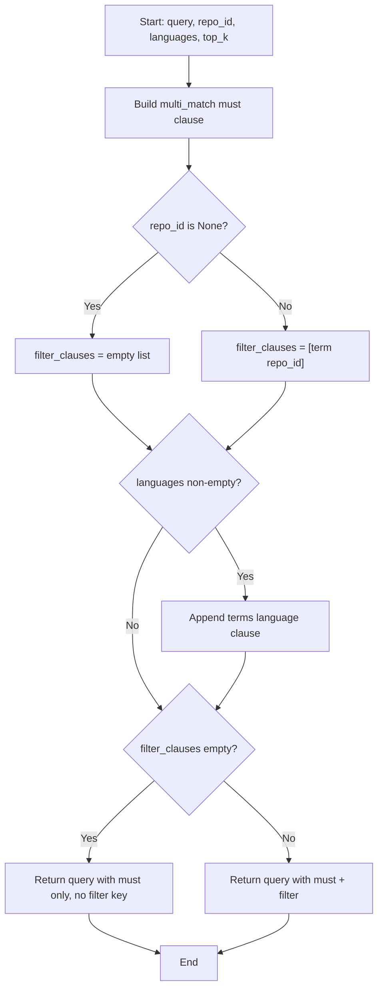

# Feature Detailed Design: Repository-Scoped Query (Feature #15)

**Date**: 2026-03-21
**Feature**: #15 — Repository-Scoped Query
**Priority**: high
**Dependencies**: #12 (Context Response Builder) — passing
**Design Reference**: docs/plans/2026-03-21-code-context-retrieval-design.md § 4.2
**SRS Reference**: FR-013

## Context

The Retriever currently requires `repo_id` as a mandatory parameter on all search methods, meaning every query must be scoped to a single repository. Feature #15 makes repository filtering **optional**: when `repo_id` is `None`, searches span all indexed repositories; when specified, results are restricted to that repository only. This enables cross-repository code search — a key use case for multi-repo organizations.

## Design Alignment

This feature modifies the Hybrid Retrieval Pipeline (§4.2). The Retriever class diagram already shows `repo: str` parameters on all public methods. The change makes these `repo: str | None` and conditionally applies ES filter clauses and Qdrant payload filters.

- **Key classes**: `Retriever` (modify `_build_code_query`, `_build_doc_query`, `_build_qdrant_filter`), `QueryHandler` (modify `handle_nl_query`, `handle_symbol_query`, `_run_pipeline`, `_symbol_boost_search` signatures)
- **Interaction flow**: Same as §4.2.3 sequence diagram — repo filter is applied at the ES/Qdrant query construction level, no pipeline changes
- **Third-party deps**: No new dependencies — elasticsearch-py and qdrant-client already support optional filters
- **Deviations**: None

## SRS Requirement

### FR-013: Repository-Scoped Query

**Priority**: Must
**EARS**: Where a repository filter is specified in the query, the system shall restrict retrieval to chunks from the specified repository only.
**Acceptance Criteria**:
- Given query "timeout" with repository filter "spring-framework", when retrieval runs, then all returned chunks shall belong to the spring-framework repository.
- Given a repository filter for a non-existent repository, when queried, then the system shall return an empty result set with a 200 status.

**Additional verification_step** (from feature-list.json):
- Given a query without repo_filter, when retrieval runs, then it searches across all indexed repositories.

## Component Data-Flow Diagram

N/A — single-class modification feature. The change is localized to query construction helpers inside `Retriever` and parameter type changes in `QueryHandler`. See Interface Contract below.

## Interface Contract

| Method | Signature | Preconditions | Postconditions | Raises |
|--------|-----------|---------------|----------------|--------|
| `Retriever.bm25_code_search` | `async bm25_code_search(query: str, repo_id: str \| None = None, languages: list[str] \| None = None, top_k: int = 200) -> list[ScoredChunk]` | query is non-empty | When repo_id is not None, all returned chunks have `repo_id == repo_id`. When repo_id is None, chunks from any repo may be returned. | `ValueError` if query empty; `RetrievalError` on ES failure |
| `Retriever.bm25_doc_search` | `async bm25_doc_search(query: str, repo_id: str \| None = None, top_k: int = 200) -> list[ScoredChunk]` | query is non-empty | Same repo scoping guarantee as above | `ValueError` if query empty; `RetrievalError` on ES failure |
| `Retriever.vector_code_search` | `async vector_code_search(query: str, repo_id: str \| None = None, languages: list[str] \| None = None, top_k: int = 200) -> list[ScoredChunk]` | query is non-empty, embedding encoder available | Same repo scoping guarantee | `ValueError` if query empty; `RetrievalError` on embedding/Qdrant failure |
| `Retriever.vector_doc_search` | `async vector_doc_search(query: str, repo_id: str \| None = None, top_k: int = 200) -> list[ScoredChunk]` | query is non-empty, embedding encoder available | Same repo scoping guarantee | `ValueError` if query empty; `RetrievalError` on embedding/Qdrant failure |
| `Retriever._build_code_query` | `_build_code_query(query: str, repo_id: str \| None, languages: list[str] \| None, top_k: int) -> dict` | N/A (internal) | When repo_id is None, no `repo_id` term in filter. When not None, `{"term": {"repo_id": repo_id}}` in filter. | N/A |
| `Retriever._build_doc_query` | `_build_doc_query(query: str, repo_id: str \| None, top_k: int) -> dict` | N/A (internal) | Same filter conditional as above | N/A |
| `Retriever._build_qdrant_filter` | `_build_qdrant_filter(repo_id: str \| None, languages: list[str] \| None) -> Filter \| None` | N/A (internal) | Returns `None` when both repo_id and languages are None. Otherwise builds Filter with applicable conditions. | N/A |
| `QueryHandler.handle_nl_query` | `async handle_nl_query(query: str, repo: str \| None = None, languages: list[str] \| None = None) -> QueryResponse` | query non-empty, ≤500 chars | Response `repo` field matches input; chunks filtered by repo when specified | `ValidationError`, `RetrievalError` |
| `QueryHandler.handle_symbol_query` | `async handle_symbol_query(query: str, repo: str \| None = None) -> QueryResponse` | query non-empty, ≤200 chars | Same repo scoping guarantee; ES term/fuzzy queries omit repo filter when None | `ValidationError`, `RetrievalError` |

**Design rationale**:
- `repo_id` defaults to `None` (not empty string) — `None` means "all repos", an empty string would be ambiguous
- `_build_qdrant_filter` returns `None` (not empty Filter) when no conditions exist — qdrant-client accepts `None` for unfiltered search
- Symbol query handler's inline ES queries must also conditionally include the repo filter

## Internal Sequence Diagram

N/A — single-class implementation. The change is in query construction helpers, not cross-method delegation. Error paths are documented in Algorithm §5 error handling table.

## Algorithm / Core Logic

### `_build_code_query` (modified)

#### Flow Diagram



#### Pseudocode

```
FUNCTION _build_code_query(query: str, repo_id: str | None, languages: list | None, top_k: int) -> dict
  must_clause = multi_match(query, fields=[content, symbol^2, signature, doc_comment])
  filter_clauses = []
  IF repo_id is not None THEN
    filter_clauses.append(term(repo_id=repo_id))
  END IF
  IF languages is not None AND len(languages) > 0 THEN
    filter_clauses.append(terms(language=languages))
  END IF
  IF filter_clauses is empty THEN
    RETURN {"query": {"bool": {"must": [must_clause]}}}
  ELSE
    RETURN {"query": {"bool": {"must": [must_clause], "filter": filter_clauses}}}
  END IF
END
```

#### Boundary Decisions

| Parameter | Min | Max | Empty/Null | At boundary |
|-----------|-----|-----|------------|-------------|
| `repo_id` | 1-char string | N/A | `None` → no filter | Single char → valid filter |
| `languages` | 1-element list | N/A | `None` or `[]` → no filter | `["python"]` → single terms clause |

#### Error Handling

| Condition | Detection | Response | Recovery |
|-----------|-----------|----------|----------|
| repo_id is None | `if repo_id is not None` check | Omit repo_id filter clause | N/A — valid behavior |
| Non-existent repo_id value | ES returns 0 hits | Empty results list | Caller receives `[]` — no error |

### `_build_doc_query` (modified)

Same pattern as `_build_code_query` but simpler — only `repo_id` filter, no language filter.

#### Pseudocode

```
FUNCTION _build_doc_query(query: str, repo_id: str | None, top_k: int) -> dict
  must_clause = match(content=query)
  IF repo_id is not None THEN
    RETURN {"query": {"bool": {"must": [must_clause], "filter": [term(repo_id=repo_id)]}}}
  ELSE
    RETURN {"query": {"bool": {"must": [must_clause]}}}
  END IF
END
```

### `_build_qdrant_filter` (modified)

#### Pseudocode

```
FUNCTION _build_qdrant_filter(repo_id: str | None, languages: list | None) -> Filter | None
  conditions = []
  IF repo_id is not None THEN
    conditions.append(FieldCondition(key="repo_id", match=MatchValue(value=repo_id)))
  END IF
  IF languages is not None AND len(languages) > 0 THEN
    conditions.append(FieldCondition(key="language", match=MatchAny(any=languages)))
  END IF
  IF conditions is empty THEN
    RETURN None
  ELSE
    RETURN Filter(must=conditions)
  END IF
END
```

### `handle_symbol_query` (modified inline ES queries)

#### Pseudocode

```
FUNCTION handle_symbol_query(query: str, repo: str | None) -> QueryResponse
  // Validate (unchanged)
  // Step 2: Build ES term query — conditionally add repo filter
  filter_clause = [term(repo_id=repo)] IF repo is not None ELSE []
  term_body = bool(must=[term(symbol.raw=query)], filter=filter_clause)
  // ... same flow for fuzzy query
  // Step 4: NL fallback passes repo through
END
```

### `_symbol_boost_search` (modified)

Same conditional filter pattern as `handle_symbol_query`.

## State Diagram

N/A — stateless feature. Repository scoping is a per-query filter parameter with no lifecycle.

## Test Inventory

| ID | Category | Traces To | Input / Setup | Expected | Kills Which Bug? |
|----|----------|-----------|---------------|----------|-----------------|
| A1 | happy path | VS-1, FR-013 AC-1 | `bm25_code_search("timeout", repo_id="spring-framework")` with ES returning 2 hits from spring-framework | All returned ScoredChunks have `repo_id="spring-framework"` | Missing repo filter in ES query |
| A2 | happy path | VS-1 | `vector_code_search("timeout", repo_id="spring-framework")` with Qdrant returning filtered results | All returned chunks have `repo_id="spring-framework"` | Missing repo filter in Qdrant query |
| A3 | happy path | VS-3 | `bm25_code_search("timeout", repo_id=None)` with ES returning hits from multiple repos | Returned chunks include multiple distinct `repo_id` values | Repo filter applied when it shouldn't be |
| A4 | happy path | VS-3 | `vector_code_search("timeout", repo_id=None)` with no Qdrant filter | Qdrant search called with `query_filter=None` | Qdrant filter built when repo_id is None |
| A5 | happy path | VS-1 | `handle_nl_query("timeout handling", repo="spring-framework")` end-to-end | Response.repo == "spring-framework"; all code/doc results from that repo | Repo not propagated through pipeline |
| A6 | happy path | VS-3 | `handle_nl_query("timeout handling", repo=None)` end-to-end | Response.repo is None; results from any repo | Pipeline crashes on None repo |
| A7 | happy path | VS-1 | `handle_symbol_query("UserService.getById", repo="spring-framework")` | ES term query includes repo filter; response scoped to repo | Symbol query ignores repo filter |
| A8 | happy path | VS-3 | `handle_symbol_query("UserService.getById", repo=None)` | ES term query has no repo filter clause | Symbol query crashes on None repo |
| B1 | error | VS-2, FR-013 AC-2 | `bm25_code_search("timeout", repo_id="nonexistent-repo")` — ES returns 0 hits | Empty list `[]`, no exception | Exception on zero results |
| B2 | error | VS-2 | `handle_nl_query("timeout", repo="nonexistent-repo")` end-to-end | Empty response (0 code + 0 doc results), degraded=False | Error raised for non-existent repo |
| B3 | error | VS-2 | `handle_symbol_query("getUserName", repo="nonexistent-repo")` | Falls through term → fuzzy → NL fallback, returns empty response | Crash on non-existent repo |
| C1 | boundary | §5 boundary table | `_build_code_query("q", repo_id=None, languages=None)` | Query dict has `must` only, no `filter` key | Empty filter list sent to ES |
| C2 | boundary | §5 boundary table | `_build_code_query("q", repo_id=None, languages=["python"])` | Query has filter with terms language only, no repo_id | Languages ignored when repo is None |
| C3 | boundary | §5 boundary table | `_build_qdrant_filter(None, None)` | Returns `None`, not `Filter(must=[])` | Empty Filter sent to Qdrant |
| C4 | boundary | §5 boundary table | `_build_qdrant_filter(None, ["python"])` | Returns `Filter(must=[FieldCondition(language)])` — no repo condition | Language filter dropped when repo is None |
| C5 | boundary | §5 boundary table | `bm25_doc_search("timeout", repo_id=None)` | `_build_doc_query` produces query with no filter clause | Doc search crashes on None repo |
| C6 | boundary | §5 boundary table | `_symbol_boost_search(["getUserName"], repo=None)` | ES queries have no repo filter clause | Symbol boost crashes on None repo |

**Negative ratio**: 11 negative tests (B1-B3, C1-C6) / 17 total = 65% ≥ 40% ✓

## Tasks

### Task 1: Write failing tests
**Files**: `tests/test_repo_scoped_query.py`
**Steps**:
1. Create test file with imports for Retriever, QueryHandler, ScoredChunk, mocks
2. Write tests for each row in Test Inventory (§7):
   - Test A1: Mock ES to return 2 hits with repo_id="spring-framework", call `bm25_code_search("timeout", "spring-framework")`, assert all chunks have correct repo_id
   - Test A2: Mock Qdrant to return filtered results, call `vector_code_search("timeout", "spring-framework")`, assert Qdrant filter includes repo_id condition
   - Test A3: Mock ES to return hits from 2 repos, call `bm25_code_search("timeout", None)`, assert hits from both repos present
   - Test A4: Mock Qdrant, call `vector_code_search("timeout", None)`, assert `query_filter=None` passed to qdrant
   - Test A5: Full pipeline mock, call `handle_nl_query("timeout handling", "spring-framework")`, assert response.repo and chunk repo_ids
   - Test A6: Full pipeline mock, call `handle_nl_query("timeout handling", None)`, assert response.repo is None
   - Test A7: Mock ES term hits, call `handle_symbol_query("UserService.getById", "spring-framework")`, assert repo filter in ES query
   - Test A8: Mock ES term hits, call `handle_symbol_query("UserService.getById", None)`, assert no repo filter
   - Test B1: Mock ES returning 0 hits, call `bm25_code_search("timeout", "nonexistent-repo")`, assert empty list
   - Test B2: Full pipeline, call `handle_nl_query("timeout", "nonexistent-repo")`, assert empty response
   - Test B3: Symbol pipeline, call `handle_symbol_query("getUserName", "nonexistent-repo")`, assert empty response
   - Test C1-C6: Direct unit tests on `_build_code_query`, `_build_doc_query`, `_build_qdrant_filter` with None repo
3. Run: `pytest tests/test_repo_scoped_query.py -v`
4. **Expected**: Tests fail because repo_id is currently required (TypeError on None)

### Task 2: Implement minimal code
**Files**: `src/query/retriever.py`, `src/query/query_handler.py`
**Steps**:
1. In `Retriever`: Change `repo_id: str` → `repo_id: str | None = None` on all 4 public methods
2. In `_build_code_query`: Conditionally add repo_id filter (per §5 pseudocode)
3. In `_build_doc_query`: Conditionally add repo_id filter
4. In `_build_qdrant_filter`: Return `None` when no conditions; change signature to `str | None`
5. In `_execute_qdrant_search`: Accept `qfilter: Filter | None` (already works — qdrant-client accepts None)
6. In `QueryHandler`: Change `repo: str` → `repo: str | None = None` on `handle_nl_query`, `handle_symbol_query`, `_run_pipeline`, `_symbol_boost_search`
7. In `handle_symbol_query`: Conditionally build filter clause for term and fuzzy queries
8. In `_symbol_boost_search`: Conditionally build filter clause
9. Run: `pytest tests/test_repo_scoped_query.py -v`
10. **Expected**: All new tests PASS

### Task 3: Coverage Gate
1. Run: `pytest --cov=src --cov-branch --cov-report=term-missing tests/`
2. Check line ≥ 90%, branch ≥ 80%. If below: return to Task 1.
3. Record coverage output as evidence.

### Task 4: Refactor
1. Verify no duplicate filter-building logic — extract shared conditional pattern if beneficial
2. Run full test suite: `pytest tests/ -v`
3. All tests PASS.

### Task 5: Mutation Gate
1. Run: `mutmut run --paths-to-mutate=src/query/retriever.py,src/query/query_handler.py`
2. Check threshold ≥ 80%. If below: strengthen assertions.
3. Record mutation output as evidence.

### Task 6: Create example
1. Create `examples/15-repo-scoped-query.py`
2. Demonstrate: query with repo filter, query without repo filter, query with non-existent repo
3. Run example to verify.

## Verification Checklist
- [x] All verification_steps traced to Interface Contract postconditions
- [x] All verification_steps traced to Test Inventory rows (VS-1→A1,A2,A5,A7; VS-2→B1,B2,B3; VS-3→A3,A4,A6,A8)
- [x] Algorithm pseudocode covers all non-trivial methods (_build_code_query, _build_doc_query, _build_qdrant_filter, handle_symbol_query)
- [x] Boundary table covers all algorithm parameters (repo_id, languages)
- [x] Error handling table covers all Raises entries
- [x] Test Inventory negative ratio >= 40% (65%)
- [x] Every skipped section has explicit "N/A — [reason]"
