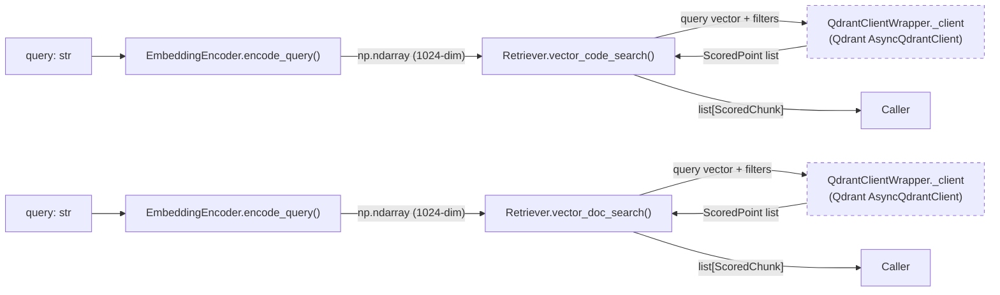
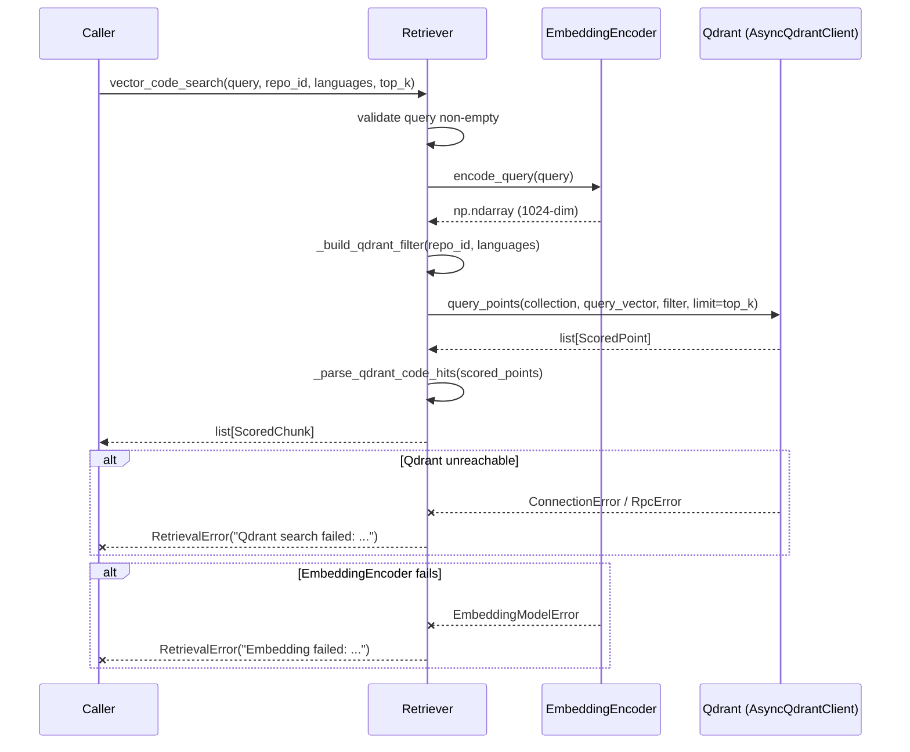
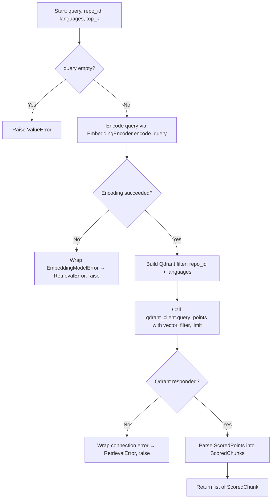

# Feature Detailed Design: Semantic Retrieval (Vector) (Feature #9)

**Date**: 2026-03-21
**Feature**: #9 — Semantic Retrieval (Vector)
**Priority**: high
**Dependencies**: #7 (Embedding Generation — passing)
**Design Reference**: docs/plans/2026-03-21-code-context-retrieval-design.md § 4.2
**SRS Reference**: FR-007

## Context

Feature #9 adds vector-based semantic search to the Retriever class, enabling the system to find code chunks by meaning rather than keyword matching. The query is encoded into a dense vector via `EmbeddingEncoder.encode_query()`, then searched against Qdrant's HNSW index, returning up to 200 cosine-similarity-ranked candidates.

## Design Alignment

**From §4.2 — Hybrid Retrieval Pipeline (FR-006 to FR-010):**

The Retriever class currently handles BM25 searches (Feature #8). This feature extends it with two new methods:
- `vector_code_search()` — vector search on `code_embeddings` Qdrant collection
- `vector_doc_search()` — vector search on `doc_embeddings` Qdrant collection

Both encode the query via `EmbeddingEncoder.encode_query()` (with instruction prefix "Represent this code search query: "), then execute approximate nearest neighbor search on Qdrant with cosine similarity.

- **Key classes**: `Retriever` (extended with vector search methods), using `EmbeddingEncoder` (from Feature #7) and `QdrantClientWrapper` (from Feature #2)
- **Interaction flow**: `Retriever.vector_code_search()` → `EmbeddingEncoder.encode_query()` → `QdrantClientWrapper._client.query_points()` → parse results → `list[ScoredChunk]`
- **Third-party deps**: `qdrant-client` (AsyncQdrantClient), `numpy` (for vectors)
- **Deviations**: None — implements design §4.2 as specified

## SRS Requirement

**FR-007: Semantic Retrieval**

**Priority**: Must
**EARS**: When a query is received by the retrieval engine, the system shall encode the query into a dense vector and execute an approximate nearest neighbor search against the Qdrant index, returning the top-200 candidate chunks.
**Acceptance Criteria**:
- AC-1: Given the query "how to configure spring http client timeout", when vector retrieval runs, then the system shall return up to 200 chunks ranked by cosine similarity, including semantically related chunks even if exact terms do not match.
- AC-2: Given a query with no semantically similar content in the index, when vector retrieval runs, then the system shall return an empty candidate list.
- AC-3: Given that Qdrant is unreachable, then the retrieval engine shall proceed with BM25-only results and log a degradation warning.

**Verification Steps (from feature-list.json)**:
- VS-1: Given indexed embeddings for code about HTTP timeouts, when vector_search('how to configure spring http client timeout') runs, then results include semantically related chunks even without exact term matches
- VS-2: Given a query vector, when vector_search() runs, then it returns up to 200 candidates with cosine similarity scores from the Qdrant collection
- VS-3: Given Qdrant is unreachable, when vector_search() runs, then it raises a retrieval error (caller handles degradation)

## Component Data-Flow Diagram



## Interface Contract

| Method | Signature | Preconditions | Postconditions | Raises |
|--------|-----------|---------------|----------------|--------|
| `vector_code_search` | `async vector_code_search(query: str, repo_id: str, languages: list[str] \| None = None, top_k: int = 200) -> list[ScoredChunk]` | query is non-empty; repo_id is non-empty; embedding_encoder and qdrant_client are injected and connected | Returns 0..top_k ScoredChunks with content_type="code", score=cosine similarity (0..1), sorted descending by score; results filtered by repo_id and optionally by languages | `ValueError` if query is empty; `RetrievalError` if Qdrant is unreachable or query fails |
| `vector_doc_search` | `async vector_doc_search(query: str, repo_id: str, top_k: int = 200) -> list[ScoredChunk]` | query is non-empty; repo_id is non-empty; embedding_encoder and qdrant_client are injected and connected | Returns 0..top_k ScoredChunks with content_type="doc", score=cosine similarity (0..1), sorted descending by score; results filtered by repo_id | `ValueError` if query is empty; `RetrievalError` if Qdrant is unreachable or query fails |

**Design rationale**:
- top_k defaults to 200 per design §4.2.3 (vector search returns top-200 candidates)
- `EmbeddingEncoder.encode_query()` handles the instruction prefix automatically
- Qdrant errors are wrapped into `RetrievalError` so callers get a uniform exception hierarchy (same as BM25 errors)
- Language filtering is applied as a Qdrant payload filter, not post-filtering, for efficiency
- The `__init__` signature is extended to accept optional `embedding_encoder` and `qdrant_client` parameters (both default to None for backward compatibility with BM25-only usage)

## Internal Sequence Diagram



## Algorithm / Core Logic

### vector_code_search / vector_doc_search

#### Flow Diagram



#### Pseudocode

```
FUNCTION vector_code_search(query: str, repo_id: str, languages: list[str]|None, top_k: int) -> list[ScoredChunk]
  // Step 1: Validate input
  IF query is empty or whitespace THEN raise ValueError("query must not be empty")

  // Step 2: Encode query to dense vector
  TRY
    query_vector = embedding_encoder.encode_query(query)
  CATCH EmbeddingModelError as e
    RAISE RetrievalError("Embedding failed: {e}")

  // Step 3: Build Qdrant filter
  filter = FieldCondition(key="repo_id", match=MatchValue(value=repo_id))
  IF languages is not None AND len(languages) > 0 THEN
    filter += FieldCondition(key="language", match=MatchAny(any=languages))

  // Step 4: Execute vector search
  TRY
    results = await qdrant_client.query_points(
      collection_name="code_embeddings",
      query=query_vector.tolist(),
      query_filter=Filter(must=[...filter conditions...]),
      limit=top_k,
      with_payload=True,
    )
  CATCH (UnexpectedResponse, RpcError, ConnectionError) as e
    RAISE RetrievalError("Qdrant search failed: {e}")

  // Step 5: Parse results into ScoredChunks
  RETURN _parse_qdrant_code_hits(results.points)
END

FUNCTION vector_doc_search(query: str, repo_id: str, top_k: int) -> list[ScoredChunk]
  // Same as vector_code_search but:
  //   - collection_name = "doc_embeddings"
  //   - No language filter
  //   - Parse with _parse_qdrant_doc_hits
END

FUNCTION _parse_qdrant_code_hits(points: list[ScoredPoint]) -> list[ScoredChunk]
  FOR each point in points:
    payload = point.payload
    chunk = ScoredChunk(
      chunk_id=str(point.id),
      content_type="code",
      repo_id=payload["repo_id"],
      file_path=payload["file_path"],
      content=payload["content"],
      score=point.score,
      language=payload.get("language"),
      chunk_type=payload.get("chunk_type"),
      symbol=payload.get("symbol"),
      signature=payload.get("signature"),
      doc_comment=payload.get("doc_comment"),
      line_start=payload.get("line_start"),
      line_end=payload.get("line_end"),
      parent_class=payload.get("parent_class"),
    )
    APPEND chunk to results
  RETURN results
END

FUNCTION _parse_qdrant_doc_hits(points: list[ScoredPoint]) -> list[ScoredChunk]
  FOR each point in points:
    payload = point.payload
    chunk = ScoredChunk(
      chunk_id=str(point.id),
      content_type="doc",
      repo_id=payload["repo_id"],
      file_path=payload["file_path"],
      content=payload["content"],
      score=point.score,
      breadcrumb=payload.get("breadcrumb"),
      heading_level=payload.get("heading_level"),
    )
    APPEND chunk to results
  RETURN results
END

FUNCTION _build_qdrant_filter(repo_id: str, languages: list[str]|None) -> Filter
  conditions = [FieldCondition(key="repo_id", match=MatchValue(value=repo_id))]
  IF languages is not None AND len(languages) > 0 THEN
    conditions.append(FieldCondition(key="language", match=MatchAny(any=languages)))
  RETURN Filter(must=conditions)
END
```

#### Boundary Decisions

| Parameter | Min | Max | Empty/Null | At boundary |
|-----------|-----|-----|------------|-------------|
| `query` | 1 char | unlimited | ValueError raised | 1-char query: encoded normally |
| `repo_id` | 1 char | UUID string | ValueError raised (empty check) | Valid UUID always |
| `languages` | None | N items | None → no language filter | Empty list `[]` → no language filter (same as None) |
| `top_k` | 1 | unlimited | N/A (int) | top_k=1 → single result; top_k=0 → empty result from Qdrant |
| Qdrant results | 0 points | top_k points | 0 points → empty list returned | Exactly top_k → all returned |

#### Error Handling

| Condition | Detection | Response | Recovery |
|-----------|-----------|----------|----------|
| Empty query | `not query or not query.strip()` | `ValueError("query must not be empty")` | Caller validates input |
| EmbeddingEncoder fails | `except EmbeddingModelError` | `RetrievalError("Embedding failed: {e}")` | Caller falls back to BM25-only |
| Qdrant unreachable | `except (UnexpectedResponse, RpcError, ConnectionError)` | `RetrievalError("Qdrant search failed: {e}")` | Caller falls back to BM25-only (per FR-007 AC-3) |
| Qdrant returns unexpected payload | Missing required keys in payload | `KeyError` propagates (indicates data integrity issue) | Should not happen with properly indexed data |

## State Diagram

> N/A — stateless feature. Vector search is a pure query operation with no object lifecycle.

## Test Inventory

| ID | Category | Traces To | Input / Setup | Expected | Kills Which Bug? |
|----|----------|-----------|---------------|----------|-----------------|
| T01 | happy path | VS-1, AC-1 | Mock EmbeddingEncoder returning fixed vector; mock Qdrant returning 3 code points with payload | Returns 3 ScoredChunks with content_type="code", correct fields mapped from payload, scores from Qdrant | Wrong field mapping or missing content_type |
| T02 | happy path | VS-2 | Mock Qdrant returning exactly 200 code points | Returns exactly 200 ScoredChunks sorted by score descending | top_k not passed to Qdrant limit param |
| T03 | happy path | VS-2 | vector_doc_search with mock Qdrant returning 5 doc points | Returns 5 ScoredChunks with content_type="doc", breadcrumb and heading_level mapped | Doc hits parsed as code or missing doc fields |
| T04 | happy path | AC-1 | vector_code_search with languages=["python", "java"] | Qdrant query_filter contains MatchAny for languages | Language filter not applied to Qdrant query |
| T05 | happy path | VS-1 | vector_code_search with languages=None | Qdrant query_filter has only repo_id, no language condition | Language filter wrongly applied when None |
| T06 | error | VS-3, AC-3 | Mock Qdrant raising connection error | Raises RetrievalError("Qdrant search failed: ...") | Missing error wrapping, raw exception leaks |
| T07 | error | §Error Handling | Mock EmbeddingEncoder raising EmbeddingModelError | Raises RetrievalError("Embedding failed: ...") | Missing try/catch on encode_query |
| T08 | error | §Interface Contract | query="" (empty string) | Raises ValueError("query must not be empty") | Missing empty query validation |
| T09 | error | §Interface Contract | query="   " (whitespace only) | Raises ValueError("query must not be empty") | Missing strip check on query |
| T10 | boundary | §Boundary, AC-2 | Mock Qdrant returning 0 points (empty result) | Returns empty list [] | Crash on empty result set |
| T11 | boundary | §Boundary | top_k=1 | Qdrant called with limit=1, returns single ScoredChunk | top_k not forwarded correctly |
| T12 | boundary | §Boundary | languages=[] (empty list) | Same as languages=None — no language filter | Empty list treated differently from None |
| T13 | happy path | §Interface Contract | repo_id filter passed to Qdrant | Qdrant query_filter contains FieldCondition for repo_id | Missing repo_id filter, returns results from all repos |
| T14 | error | §Error Handling | Mock Qdrant raising RpcError | Raises RetrievalError | Only ConnectionError caught, RpcError leaks |

**Negative ratio**: 7 negative (T06-T09, T10-T12, T14) / 14 total = 50% ≥ 40% ✓

## Tasks

### Task 1: Write failing tests
**Files**: `tests/test_vector_retrieval.py`
**Steps**:
1. Create test file with imports: `pytest`, `unittest.mock` (AsyncMock, MagicMock, patch), `numpy`, `ScoredChunk`, `Retriever`, `RetrievalError`
2. Create mock fixtures for `EmbeddingEncoder` (returns fixed 1024-dim vector), `QdrantClientWrapper` (with mock `_client`), and `ElasticsearchClient`
3. Write test functions for each Test Inventory row T01-T14:
   - T01: `test_vector_code_search_returns_scored_chunks` — mock 3 results, verify field mapping
   - T02: `test_vector_code_search_returns_up_to_top_k` — mock 200 results, verify count
   - T03: `test_vector_doc_search_returns_doc_chunks` — mock 5 doc results, verify content_type="doc"
   - T04: `test_vector_code_search_with_language_filter` — verify MatchAny in filter
   - T05: `test_vector_code_search_without_language_filter` — verify no language condition
   - T06: `test_vector_code_search_qdrant_unreachable` — mock raises, expect RetrievalError
   - T07: `test_vector_code_search_embedding_fails` — mock raises, expect RetrievalError
   - T08: `test_vector_code_search_empty_query` — expect ValueError
   - T09: `test_vector_code_search_whitespace_query` — expect ValueError
   - T10: `test_vector_code_search_no_results` — mock 0 points, expect empty list
   - T11: `test_vector_code_search_top_k_one` — verify limit=1 in Qdrant call
   - T12: `test_vector_code_search_empty_languages_list` — verify no language filter
   - T13: `test_vector_code_search_repo_id_filter` — verify repo_id in filter
   - T14: `test_vector_code_search_rpc_error` — mock RpcError, expect RetrievalError
4. Run: `pytest tests/test_vector_retrieval.py -v`
5. **Expected**: All tests FAIL (Retriever has no vector_code_search / vector_doc_search yet)

### Task 2: Implement minimal code
**Files**: `src/query/retriever.py`
**Steps**:
1. Add imports: `from qdrant_client.models import ...` (Filter, FieldCondition, MatchValue, MatchAny), `from src.indexing.embedding_encoder import EmbeddingEncoder`, `from src.shared.clients.qdrant import QdrantClientWrapper`, `from src.indexing.exceptions import EmbeddingModelError`
2. Extend `__init__` to accept optional `embedding_encoder: EmbeddingEncoder | None = None` and `qdrant_client: QdrantClientWrapper | None = None`; store as `self._embedding_encoder` and `self._qdrant`; keep `code_embeddings` / `doc_embeddings` as collection name defaults
3. Implement `vector_code_search()` per Algorithm §5 pseudocode
4. Implement `vector_doc_search()` per Algorithm §5 pseudocode
5. Implement `_build_qdrant_filter()`, `_parse_qdrant_code_hits()`, `_parse_qdrant_doc_hits()` per Algorithm §5
6. Run: `pytest tests/test_vector_retrieval.py -v`
7. **Expected**: All tests PASS

### Task 3: Coverage Gate
1. Run: `pytest --cov=src --cov-branch --cov-report=term-missing tests/`
2. Check: line >= 90%, branch >= 80%
3. If below: add tests for uncovered lines/branches

### Task 4: Refactor
1. Extract shared validation logic if duplicated between BM25 and vector methods
2. Ensure consistent error message formatting
3. Run full test suite: `pytest tests/ -v`

### Task 5: Mutation Gate
1. Run: `mutmut run --paths-to-mutate=src/query/retriever.py`
2. Check: mutation score >= 80%
3. If below: strengthen assertions (exact scores, exact field values, call argument verification)

### Task 6: Create example
1. Create `examples/13-semantic-retrieval.py`
2. Demonstrate vector_code_search and vector_doc_search with mock data
3. Run example to verify

## Verification Checklist
- [x] All verification_steps traced to Interface Contract postconditions (VS-1→vector_code_search postconditions, VS-2→postconditions on count/score, VS-3→Raises RetrievalError)
- [x] All verification_steps traced to Test Inventory rows (VS-1→T01,T04,T05; VS-2→T02; VS-3→T06)
- [x] Algorithm pseudocode covers all non-trivial methods (vector_code_search, vector_doc_search, _parse_qdrant_code_hits, _parse_qdrant_doc_hits, _build_qdrant_filter)
- [x] Boundary table covers all algorithm parameters (query, repo_id, languages, top_k, results)
- [x] Error handling table covers all Raises entries (ValueError, RetrievalError×2)
- [x] Test Inventory negative ratio >= 40% (50%)
- [x] Every skipped section has explicit "N/A — [reason]" (State Diagram: stateless)
