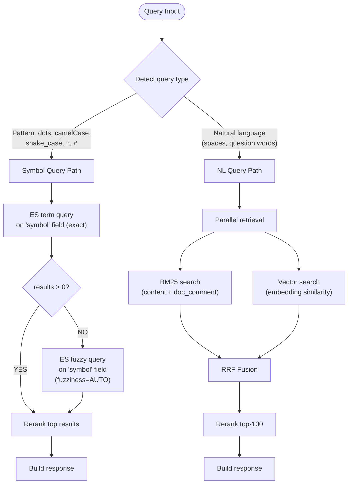
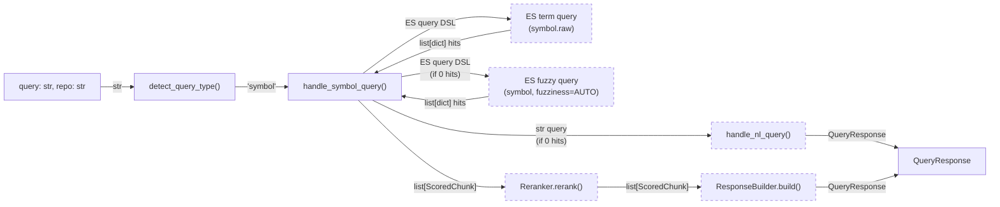
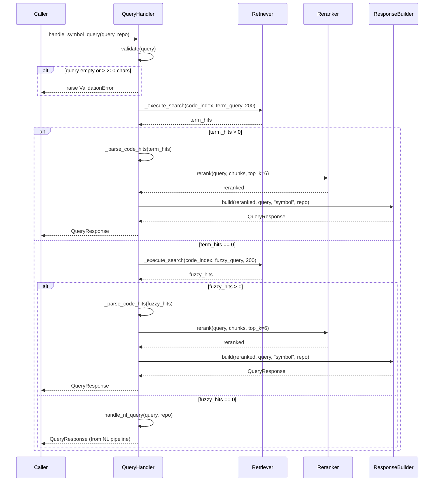
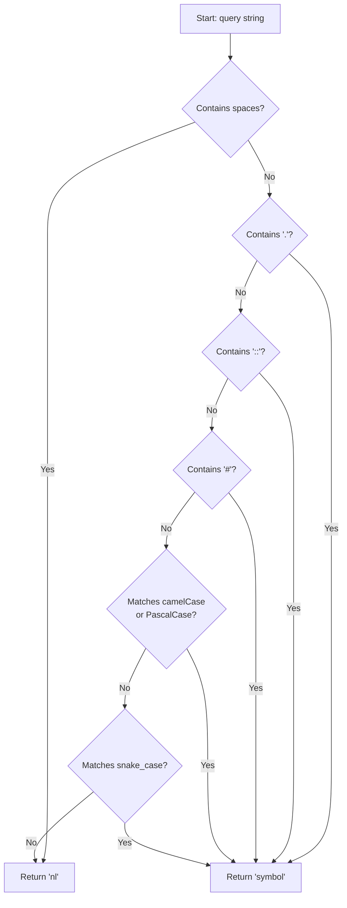
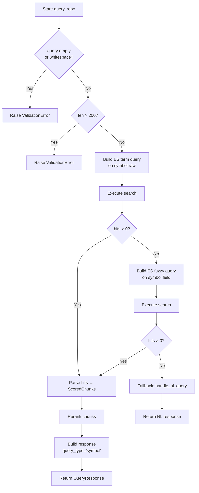

# Feature Detailed Design: Symbol Query Handler (Feature #14)

**Date**: 2026-03-21
**Feature**: #14 — Symbol Query Handler
**Priority**: high
**Dependencies**: #12 (Context Response Builder — passing)
**Design Reference**: docs/plans/2026-03-21-code-context-retrieval-design.md § 4.2.4
**SRS Reference**: FR-012

## Context

The Symbol Query Handler detects whether a query string is a code symbol (vs natural language) and routes symbol queries through an optimized ES term → fuzzy → NL fallback pipeline. This improves precision for developers searching by exact symbol names like `UserService.getById`, `std::vector`, or `Array#map`.

## Design Alignment

### From §4.2.4 — Query Routing: Symbol vs Natural Language

The `QueryHandler` auto-detects query type and routes to different retrieval paths:



**Symbol detection heuristic**:
- Contains `.` (e.g., `UserService.getById`) → symbol
- Contains `::` (e.g., `std::vector`) → symbol
- Contains `#` (e.g., `Array#map`) → symbol
- Matches `camelCase` or `PascalCase` pattern with no spaces → symbol
- Matches `snake_case` pattern with no spaces → symbol
- Otherwise → natural language

**Symbol query ES behavior**:
1. First: `term` query on `symbol` field (exact match, case-sensitive)
2. If 0 results: `fuzzy` query on `symbol` field with `fuzziness=AUTO` (handles typos)
3. If still 0 results: fall back to full NL pipeline with the query as-is

- **Key classes**: `QueryHandler` (existing class, add `detect_query_type()` heuristic and `handle_symbol_query()`)
- **Interaction flow**: `handle_symbol_query()` → `Retriever._execute_search()` (term) → if empty → `Retriever._execute_search()` (fuzzy) → if empty → `handle_nl_query()` → `Reranker.rerank()` → `ResponseBuilder.build()`
- **Third-party deps**: elasticsearch-py (existing), no new deps
- **Deviations**: None

## SRS Requirement

### FR-012: Symbol Query Handler

**Priority**: Must
**EARS**: When a user submits a symbol query (e.g., "org.springframework.web.client.RestTemplate"), the system shall prioritize BM25 keyword retrieval for exact symbol matching and return results containing the specified symbol.
**Acceptance Criteria**:
- Given the symbol query "std::vector", when the symbol handler processes it, then the top results shall contain the std::vector class definition, methods, and usage examples.
- Given a symbol that does not exist in any indexed repository, when queried, then the system shall return an empty result set with a 200 status.
- Given a symbol query exceeding 200 characters, when submitted, then the system shall return a 400 error.

## Component Data-Flow Diagram



## Interface Contract

| Method | Signature | Preconditions | Postconditions | Raises |
|--------|-----------|---------------|----------------|--------|
| `detect_query_type` | `detect_query_type(query: str) -> str` | Query is a non-empty stripped string | Returns `"symbol"` if query matches any symbol pattern (dot, `::`, `#`, camelCase, PascalCase, snake_case with no spaces); returns `"nl"` otherwise | None |
| `handle_symbol_query` | `async handle_symbol_query(query: str, repo: str) -> QueryResponse` | Query is non-empty, len ≤ 200 | Returns QueryResponse with `query_type="symbol"`, containing matching code chunks from ES term/fuzzy search, or falls back to NL pipeline result if no symbol matches found | `ValidationError` if query is empty or exceeds 200 chars; `RetrievalError` if all retrieval paths fail |

**Design rationale**:
- 200-char limit (not 500 like NL) because symbol queries are identifiers, not sentences — 200 chars is generous for any real symbol
- Term query first (exact match) for precision; fuzzy only as fallback for typos
- NL fallback as last resort ensures the user always gets a result attempt
- `detect_query_type` is a pure function (no I/O) — easy to test independently

## Internal Sequence Diagram



## Algorithm / Core Logic

### detect_query_type

#### Flow Diagram



#### Pseudocode

```
FUNCTION detect_query_type(query: str) -> str
  // Step 1: If query contains spaces, it's natural language
  IF ' ' in query THEN RETURN "nl"

  // Step 2: Check for explicit symbol separators
  IF '.' in query THEN RETURN "symbol"
  IF '::' in query THEN RETURN "symbol"
  IF '#' in query THEN RETURN "symbol"

  // Step 3: Check for naming convention patterns (no spaces already confirmed)
  IF query matches camelCase pattern (lowercase start, at least one uppercase) THEN RETURN "symbol"
  IF query matches PascalCase pattern (uppercase start, mixed case) THEN RETURN "symbol"
  IF query matches snake_case pattern (lowercase with underscores) THEN RETURN "symbol"

  // Step 4: Default to natural language
  RETURN "nl"
END
```

#### Boundary Decisions

| Parameter | Min | Max | Empty/Null | At boundary |
|-----------|-----|-----|------------|-------------|
| query | Single char `"a"` | 200 chars (enforced by handle_symbol_query, not here) | Not called with empty (caller validates) | Single word no pattern → `"nl"` |
| query with `.` | `"a.b"` (min dot-separated) | N/A | N/A | `"."` alone → `"symbol"` (contains dot) |
| query with `::` | `"a::b"` | N/A | N/A | `"::"` alone → `"symbol"` |
| query with `#` | `"A#b"` | N/A | N/A | `"#"` alone → `"symbol"` |
| camelCase | `"aB"` (min 2 chars) | N/A | N/A | `"ab"` → no match → `"nl"` |
| snake_case | `"a_b"` (min with underscore) | N/A | N/A | `"a_"` → no match (needs letter after `_`) |

#### Error Handling

| Condition | Detection | Response | Recovery |
|-----------|-----------|----------|----------|
| N/A — pure function with no failure modes | — | — | — |

### handle_symbol_query

#### Flow Diagram



#### Pseudocode

```
FUNCTION handle_symbol_query(query: str, repo: str) -> QueryResponse
  // Step 1: Validate
  IF query is empty or whitespace THEN RAISE ValidationError("query must not be empty")
  IF len(query) > 200 THEN RAISE ValidationError("query exceeds 200 character limit")

  // Step 2: ES term query (exact match on symbol.raw)
  term_body = {query: {bool: {must: [{term: {symbol.raw: query}}], filter: [{term: {repo_id: repo}}]}}}
  term_hits = AWAIT retriever._execute_search(code_index, term_body, 200)

  // Step 3: If term hits found, rerank and return
  IF len(term_hits) > 0 THEN
    chunks = retriever._parse_code_hits(term_hits)
    reranked = reranker.rerank(query, chunks, top_k=6)
    RETURN response_builder.build(reranked, query, "symbol", repo)

  // Step 4: ES fuzzy query (fuzziness=AUTO)
  fuzzy_body = {query: {bool: {must: [{match: {symbol: {query: query, fuzziness: "AUTO"}}}], filter: [{term: {repo_id: repo}}]}}}
  fuzzy_hits = AWAIT retriever._execute_search(code_index, fuzzy_body, 200)

  // Step 5: If fuzzy hits found, rerank and return
  IF len(fuzzy_hits) > 0 THEN
    chunks = retriever._parse_code_hits(fuzzy_hits)
    reranked = reranker.rerank(query, chunks, top_k=6)
    RETURN response_builder.build(reranked, query, "symbol", repo)

  // Step 6: NL fallback
  RETURN AWAIT handle_nl_query(query, repo)
END
```

#### Boundary Decisions

| Parameter | Min | Max | Empty/Null | At boundary |
|-----------|-----|-----|------------|-------------|
| query length | 1 char | 200 chars | Raises ValidationError | 200 chars → accepted; 201 chars → ValidationError |
| query content | `" "` (whitespace-only) → ValidationError | N/A | `""` → ValidationError | Single non-space char → valid |
| term_hits count | 0 → try fuzzy | Any > 0 → rerank + return | N/A | 1 hit → reranked with 1 candidate |
| fuzzy_hits count | 0 → NL fallback | Any > 0 → rerank + return | N/A | 1 hit → reranked with 1 candidate |
| repo | Any non-empty string | N/A | N/A | Non-existent repo → 0 hits → NL fallback |

#### Error Handling

| Condition | Detection | Response | Recovery |
|-----------|-----------|----------|----------|
| Empty/whitespace query | `not query or not query.strip()` | `ValidationError("query must not be empty")` | Caller catches and returns 400 |
| Query exceeds 200 chars | `len(query) > 200` | `ValidationError("query exceeds 200 character limit")` | Caller catches and returns 400 |
| ES connection failure | `RetrievalError` from `_execute_search` | Propagates `RetrievalError` | Caller returns 503 or degraded response |
| NL fallback also fails | `RetrievalError` from `handle_nl_query` | Propagates `RetrievalError` | Caller returns 503 |

## State Diagram

> N/A — stateless feature. Each query is independent with no lifecycle state.

## Test Inventory

| ID | Category | Traces To | Input / Setup | Expected | Kills Which Bug? |
|----|----------|-----------|---------------|----------|-----------------|
| A1 | happy path | VS-1, FR-012 | query=`"UserService.getById"` | `detect_query_type` returns `"symbol"` (dot notation) | Missing dot check |
| A2 | happy path | VS-2, FR-012 | query=`"std::vector"`, mock ES returns 2 term hits | `handle_symbol_query` returns QueryResponse with `query_type="symbol"`, 2 code results | Missing term query construction |
| A3 | happy path | VS-2 | query=`"std::vector"` | `detect_query_type` returns `"symbol"` (:: notation) | Missing :: check |
| A4 | happy path | VS-1 | query=`"getUserName"` (camelCase, no spaces) | `detect_query_type` returns `"symbol"` | Missing camelCase regex |
| A5 | happy path | VS-1 | query=`"UserService"` (PascalCase, no spaces) | `detect_query_type` returns `"symbol"` | Missing PascalCase regex |
| A6 | happy path | VS-1 | query=`"get_user_name"` (snake_case, no spaces) | `detect_query_type` returns `"symbol"` | Missing snake_case regex |
| A7 | happy path | VS-1 | query=`"Array#map"` | `detect_query_type` returns `"symbol"` (# notation) | Missing # check |
| A8 | happy path | FR-012 | query=`"how to handle errors"` (spaces, no pattern) | `detect_query_type` returns `"nl"` | Overly broad symbol detection |
| B1 | happy path | VS-3, FR-012 | query=`"nonExistentSymbol"`, mock ES returns 0 term + 0 fuzzy hits | `handle_symbol_query` falls back to NL pipeline, returns QueryResponse | Missing NL fallback path |
| B2 | happy path | FR-012 | query=`"vectr"` (typo), mock ES returns 0 term hits, 2 fuzzy hits | `handle_symbol_query` returns QueryResponse with fuzzy results | Missing fuzzy fallback |
| C1 | error | VS-4, §IC Raises | query=`"a" * 201` | `handle_symbol_query` raises `ValidationError("query exceeds 200 character limit")` | Missing length validation |
| C2 | error | §IC Raises | query=`""` | `handle_symbol_query` raises `ValidationError("query must not be empty")` | Missing empty check |
| C3 | error | §IC Raises | query=`"   "` (whitespace only) | `handle_symbol_query` raises `ValidationError("query must not be empty")` | Missing whitespace check |
| C4 | boundary | §Boundary | query=`"a" * 200` (exactly 200), mock ES returns 0 hits | No ValidationError raised, falls back to NL pipeline | Off-by-one in length check |
| C5 | boundary | §Boundary | query=`"a.b"` (minimal dot-separated) | `detect_query_type` returns `"symbol"` | Requiring multi-segment dots |
| C6 | boundary | §Boundary | query=`"aB"` (minimal camelCase) | `detect_query_type` returns `"symbol"` | CamelCase regex too strict |
| C7 | boundary | §Boundary | query=`"a_b"` (minimal snake_case) | `detect_query_type` returns `"symbol"` | Snake_case regex too strict |
| C8 | boundary | §Boundary | query=`"hello"` (single lowercase word, no pattern) | `detect_query_type` returns `"nl"` | Matching all single words as symbols |
| C9 | boundary | §Boundary | query=`"CONSTANT"` (all uppercase, no underscores) | `detect_query_type` returns `"nl"` | Matching all-caps as symbol |
| D1 | error | §EH ES failure | Mock ES raises RetrievalError on term query | `handle_symbol_query` propagates RetrievalError | Swallowing ES errors |
| D2 | integration | §Sequence Diagram | query=`"MyClass.method"`, term hits exist | Reranker called with parsed chunks, ResponseBuilder builds with query_type="symbol" | Wrong query_type in response |

**Negative ratio**: 9 negative (C1-C9, D1) / 20 total = 45% ≥ 40% ✓

## Tasks

### Task 1: Write failing tests
**Files**: `tests/test_symbol_query_handler.py`
**Steps**:
1. Create test file with imports for `QueryHandler`, `ValidationError`, `ScoredChunk`, `QueryResponse`
2. Write tests for each row in Test Inventory:
   - Tests A1, A3-A9: `detect_query_type` classification tests (parametrized)
   - Tests A2, B1, B2, D2: `handle_symbol_query` with mock retriever/reranker/builder
   - Tests C1-C3: validation error tests
   - Tests C4-C9: boundary detection tests (parametrized)
   - Test D1: ES error propagation
3. Run: `pytest tests/test_symbol_query_handler.py -v`
4. **Expected**: All tests FAIL (detect_query_type returns "nl" stub, handle_symbol_query not implemented)

### Task 2: Implement minimal code
**Files**: `src/query/query_handler.py`
**Steps**:
1. Replace `detect_query_type` stub with symbol detection heuristic per Algorithm §5 pseudocode:
   - Check for spaces → `"nl"`
   - Check for `.`, `::`, `#` → `"symbol"`
   - Check camelCase/PascalCase/snake_case regex → `"symbol"`
   - Default → `"nl"`
2. Add `handle_symbol_query` method per Algorithm §5 pseudocode:
   - Validate query (empty, whitespace, >200 chars)
   - ES term query on `symbol.raw` field
   - If 0 hits → ES fuzzy query on `symbol` field with `fuzziness=AUTO`
   - If 0 hits → fall back to `handle_nl_query(query, repo)`
   - Rerank results, build response with `query_type="symbol"`
3. Run: `pytest tests/test_symbol_query_handler.py -v`
4. **Expected**: All tests PASS

### Task 3: Coverage Gate
1. Run: `pytest --cov=src --cov-branch --cov-report=term-missing tests/`
2. Check thresholds: line ≥ 90%, branch ≥ 80%
3. Record coverage output as evidence.

### Task 4: Refactor
1. Consolidate shared ES query building (term/fuzzy) if duplication exists
2. Ensure consistent error messages with `handle_nl_query` validation
3. Run full test suite: `pytest tests/ -v`

### Task 5: Mutation Gate
1. Run: `mutmut run --paths-to-mutate=src/query/query_handler.py`
2. Check threshold: mutation score ≥ 80%
3. Record mutation output as evidence.

### Task 6: Create example
1. Create `examples/14-symbol-query.py`
2. Demonstrate detect_query_type for various inputs and handle_symbol_query call
3. Run example to verify.

## Verification Checklist
- [x] All verification_steps traced to Interface Contract postconditions
  - VS-1 → detect_query_type postcondition (dot notation → symbol)
  - VS-2 → handle_symbol_query postcondition (ES term query returns matching results)
  - VS-3 → handle_symbol_query postcondition (NL fallback when 0 results)
  - VS-4 → handle_symbol_query Raises (ValidationError for >200 chars)
- [x] All verification_steps traced to Test Inventory rows
  - VS-1 → A1, A3-A7
  - VS-2 → A2
  - VS-3 → B1
  - VS-4 → C1
- [x] Algorithm pseudocode covers all non-trivial methods (detect_query_type, handle_symbol_query)
- [x] Boundary table covers all algorithm parameters
- [x] Error handling table covers all Raises entries (ValidationError × 2, RetrievalError)
- [x] Test Inventory negative ratio = 45% ≥ 40%
- [x] Every skipped section has explicit "N/A — [reason]" (State Diagram: stateless feature)
