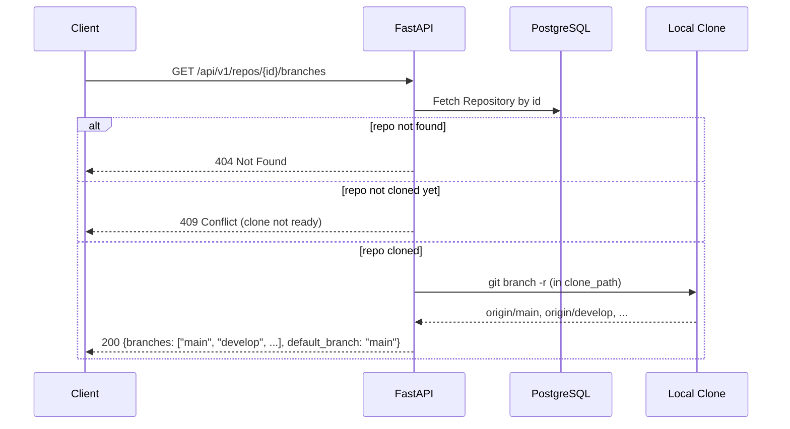
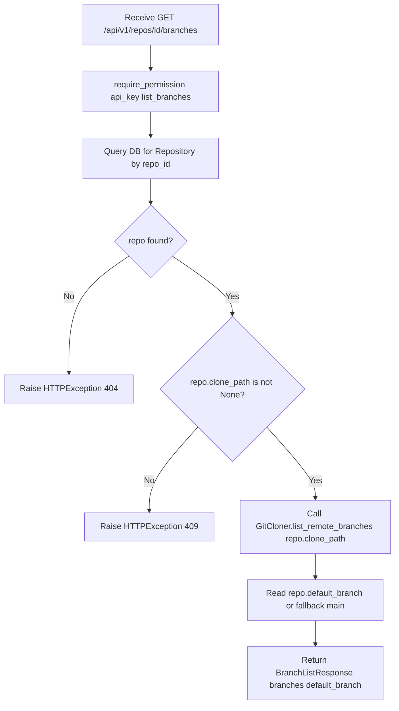

# Feature Detailed Design: Branch Listing API (Feature #33)

**Date**: 2026-03-22
**Feature**: #33 — Branch Listing API
**Priority**: high
**Dependencies**: #4 (Git Clone & Update), #17 (REST API Endpoints)
**Design Reference**: docs/plans/2026-03-21-code-context-retrieval-design.md § 4.5b
**SRS Reference**: FR-023

## Context

This feature adds a `GET /api/v1/repos/{id}/branches` endpoint that returns the list of remote branches for a registered repository. It delegates to the existing `GitCloner.list_remote_branches()` method and leverages the Repository model's `clone_path` field to determine if a clone exists.

## Design Alignment

### System Design § 4.5b (verbatim)

**Overview**: REST endpoint to list remote branches for a registered (and cloned) repository. Used by the Web UI branch selector during repository registration, and available to API consumers.

**Sequence Diagram**:


**Design Notes**:
- Uses `GitCloner.list_remote_branches(repo_path)` which runs `git branch -r` in the clone directory and strips the `origin/` prefix.
- Returns branches sorted alphabetically, with `default_branch` indicated separately.
- Requires the repository to have been cloned at least once (status != "pending" with no clone_path).
- Auth: `read` or `admin` role (read-role keys must have access to the repo via ACL).

- **Key classes**: `repos_router` (new endpoint), `BranchListResponse` (new schema), `GitCloner` (existing), `Repository` (existing model)
- **Interaction flow**: Endpoint → DB lookup → clone_path check → GitCloner.list_remote_branches() → response
- **Third-party deps**: FastAPI, SQLAlchemy (existing)
- **Deviations**: None — implementation follows system design exactly

## SRS Requirement

### FR-023: Branch Listing API [Wave 1]

**Priority**: Must
**EARS**: When an API consumer requests the list of branches for a registered repository, the system shall return all remote branch names available in the repository's local clone.
**Acceptance Criteria**:
- Given a registered repository that has been cloned, when `GET /api/v1/repos/{id}/branches` is called, then the system shall return a JSON object with `branches` (sorted list of branch names) and `default_branch` (the repository's detected default branch).
- Given a repository ID that does not exist, when the endpoint is called, then the system shall return 404.
- Given a repository that has not been cloned yet (no clone_path), when the endpoint is called, then the system shall return 409 Conflict indicating the clone is not ready.

## Component Data-Flow Diagram

N/A — single-endpoint feature with linear data flow: HTTP request → DB lookup → GitCloner delegation → HTTP response. See Interface Contract below.

## Interface Contract

| Method | Signature | Preconditions | Postconditions | Raises |
|--------|-----------|---------------|----------------|--------|
| `list_branches` | `list_branches(repo_id: uuid.UUID, request: Request, api_key: ApiKey, auth_middleware: AuthMiddleware) -> BranchListResponse` | Authenticated request with valid API key; `repo_id` is a UUID path param | Returns `BranchListResponse(branches=[...], default_branch="...")` with branches sorted alphabetically | `HTTPException(404)` if repo not found; `HTTPException(409)` if repo has no `clone_path`; `HTTPException(403)` via `require_permission` if unauthorized |

**Design rationale**:
- `clone_path is None` is the check for "not yet cloned" — aligns with how Git Clone & Update (Feature #4) populates this field after first clone
- `default_branch` falls back to `"main"` if the Repository model's `default_branch` is null, matching the system's default convention
- Permission action `list_branches` is added to both `read` and `admin` roles in `ROLE_PERMISSIONS`

## Internal Sequence Diagram

N/A — single-endpoint implementation with no internal cross-method delegation. Error paths documented in Algorithm error handling table below.

## Algorithm / Core Logic

### `list_branches` endpoint

#### Flow Diagram



#### Pseudocode

```
FUNCTION list_branches(repo_id: UUID, request: Request, api_key: ApiKey, auth_middleware: AuthMiddleware) -> BranchListResponse
  // Step 1: Authorization
  require_permission(api_key, "list_branches", auth_middleware)

  // Step 2: Fetch repository from DB
  session_factory = request.app.state.session_factory
  OPEN session from session_factory
    result = SELECT Repository WHERE id = repo_id
    repo = result.scalar_one_or_none()

    // Step 3: Validate repo exists
    IF repo IS None THEN
      RAISE HTTPException(status_code=404, detail="Repository not found")

    // Step 4: Validate clone exists
    IF repo.clone_path IS None THEN
      RAISE HTTPException(status_code=409, detail="Repository has not been cloned yet")

    // Step 5: List branches via GitCloner
    cloner = GitCloner(storage_path="")  // storage_path unused for list_remote_branches
    branches = cloner.list_remote_branches(repo.clone_path)

    // Step 6: Determine default branch
    default_branch = repo.default_branch OR "main"

  RETURN BranchListResponse(branches=branches, default_branch=default_branch)
END
```

#### Boundary Decisions

| Parameter | Min | Max | Empty/Null | At boundary |
|-----------|-----|-----|------------|-------------|
| `repo_id` | Valid UUID | Valid UUID | N/A (FastAPI validates path param) | Non-existent UUID → 404 |
| `repo.clone_path` | Non-empty string | N/A | `None` → 409 Conflict | Empty string — treat as no clone (checked as `None`) |
| `branches` result | Empty list `[]` | Unbounded | Empty list returned as `{branches: [], ...}` | Single branch → `{branches: ["main"]}` |
| `repo.default_branch` | Non-empty string | N/A | `None` → fallback to `"main"` | Present → use as-is |

#### Error Handling

| Condition | Detection | Response | Recovery |
|-----------|-----------|----------|----------|
| Repository not found | `scalar_one_or_none()` returns `None` | `HTTPException(404, "Repository not found")` | Client retries with correct ID |
| Repository not cloned | `repo.clone_path is None` | `HTTPException(409, "Repository has not been cloned yet")` | Client waits for clone/index to complete |
| Unauthorized | `require_permission` check fails | `HTTPException(403, "Insufficient permissions")` | Client uses key with `read` or `admin` role |
| GitCloner failure | `CloneError` raised by `list_remote_branches` | `HTTPException(500, "Failed to list branches")` | Client retries; admin checks clone health |
| Invalid UUID format | FastAPI path validation | `422 Unprocessable Entity` (automatic) | Client corrects UUID format |

## State Diagram

N/A — stateless feature. The endpoint is a pure query with no state transitions.

## Test Inventory

| ID | Category | Traces To | Input / Setup | Expected | Kills Which Bug? |
|----|----------|-----------|---------------|----------|-----------------|
| T1 | happy path | VS-1, FR-023 AC-1 | Repo with `clone_path="/tmp/repo"`, `default_branch="main"`; GitCloner returns `["develop", "feature-x", "main"]` | 200, `{branches: ["develop", "feature-x", "main"], default_branch: "main"}` | Missing GitCloner delegation or wrong response shape |
| T2 | error | VS-2, FR-023 AC-2 | `repo_id` = random UUID not in DB | 404, `{"detail": "Repository not found"}` | Missing null check on DB lookup |
| T3 | error | VS-3, FR-023 AC-3 | Repo exists but `clone_path=None` | 409, `{"detail": "Repository has not been cloned yet"}` | Missing clone_path validation |
| T4 | error | §Interface Contract, Raises (403) | API key with `role="read"` but `list_branches` not in permissions | 403, `{"detail": "Insufficient permissions"}` | Permission not checked or wrong action name |
| T5 | boundary | §Algorithm boundary, branches empty | Repo cloned but zero remote branches | 200, `{branches: [], default_branch: "main"}` | Crash on empty list or missing default |
| T6 | boundary | §Algorithm boundary, default_branch null | Repo with `clone_path` set but `default_branch=None` | 200, `{default_branch: "main"}` (fallback) | Missing fallback logic, returns None |
| T7 | error | §Error handling, GitCloner failure | GitCloner.list_remote_branches raises `CloneError` | 500, error message | Missing exception handler for CloneError |
| T8 | happy path | VS-1 | Repo with `default_branch="develop"` | 200, `{default_branch: "develop"}` | Hardcoded default_branch instead of using DB value |
| T9 | boundary | §Algorithm boundary, single branch | Repo with only one branch `["main"]` | 200, `{branches: ["main"], default_branch: "main"}` | Off-by-one or filter error |
| T10 | happy path | ROLE_PERMISSIONS update | API key with `role="read"` (after permission update) | 200 (authorized) | Forgot to add list_branches to read role |

**Negative test ratio**: 5/10 = 50% >= 40% ✓

## Tasks

### Task 1: Write failing tests
**Files**: `tests/test_feature_33_branch_listing.py`
**Steps**:
1. Create test file with imports (FastAPI TestClient, pytest, unittest.mock)
2. Write test code for each row in Test Inventory (§7):
   - T1: Mock DB to return repo with clone_path, mock GitCloner → assert 200 with correct shape
   - T2: Mock DB to return None → assert 404
   - T3: Mock DB to return repo with clone_path=None → assert 409
   - T4: Test with unauthorized key → assert 403
   - T5: Mock GitCloner returning [] → assert 200 with empty branches
   - T6: Mock DB repo with default_branch=None → assert fallback "main"
   - T7: Mock GitCloner raising CloneError → assert 500
   - T8: Mock DB repo with default_branch="develop" → assert "develop" in response
   - T9: Mock GitCloner returning ["main"] → assert single-element list
   - T10: Test read role can access list_branches → assert 200
3. Run: `pytest tests/test_feature_33_branch_listing.py -v`
4. **Expected**: All tests FAIL (endpoint not implemented yet)

### Task 2: Implement minimal code
**Files**: `src/query/api/v1/endpoints/repos.py`, `src/query/api/v1/schemas.py`, `src/shared/services/auth_middleware.py`
**Steps**:
1. Add `BranchListResponse` schema to `schemas.py` with `branches: list[str]` and `default_branch: str`
2. Add `"list_branches"` to `read` and `admin` role in `ROLE_PERMISSIONS` dict
3. Add `list_branches` endpoint to `repos_router` in `repos.py`:
   - Path: `GET /repos/{repo_id}/branches`
   - Auth: `require_permission(api_key, "list_branches", ...)`
   - DB lookup → 404 check → clone_path check → 409 → GitCloner call → response
   - Catch `CloneError` → 500
4. Run: `pytest tests/test_feature_33_branch_listing.py -v`
5. **Expected**: All tests PASS

### Task 3: Coverage Gate
1. Run: `pytest --cov=src --cov-branch --cov-report=term-missing tests/`
2. Check line >= 90%, branch >= 80%. If below: add tests for uncovered lines.
3. Record coverage output as evidence.

### Task 4: Refactor
1. Review endpoint code for clarity — no expected refactoring needed (simple endpoint)
2. Run: `pytest tests/ -v --tb=short`
3. All tests PASS.

### Task 5: Mutation Gate
1. Run: `mutmut run --paths-to-mutate=src/query/api/v1/endpoints/repos.py,src/query/api/v1/schemas.py,src/shared/services/auth_middleware.py`
2. Check mutation score >= 80%. If below: strengthen assertions.
3. Record mutation output as evidence.

### Task 6: Create example
1. Create `examples/23-branch-listing-api.py` demonstrating the endpoint
2. Update `examples/README.md`
3. Run example to verify.

## Verification Checklist
- [x] All verification_steps traced to Interface Contract postconditions
- [x] All verification_steps traced to Test Inventory rows (VS-1→T1/T8/T9, VS-2→T2, VS-3→T3)
- [x] Algorithm pseudocode covers all non-trivial methods (list_branches endpoint)
- [x] Boundary table covers all algorithm parameters (repo_id, clone_path, branches, default_branch)
- [x] Error handling table covers all Raises entries (404, 409, 403, 500, 422)
- [x] Test Inventory negative ratio >= 40% (50%)
- [x] Every skipped section has explicit "N/A — [reason]" (Data-Flow, Sequence, State)
