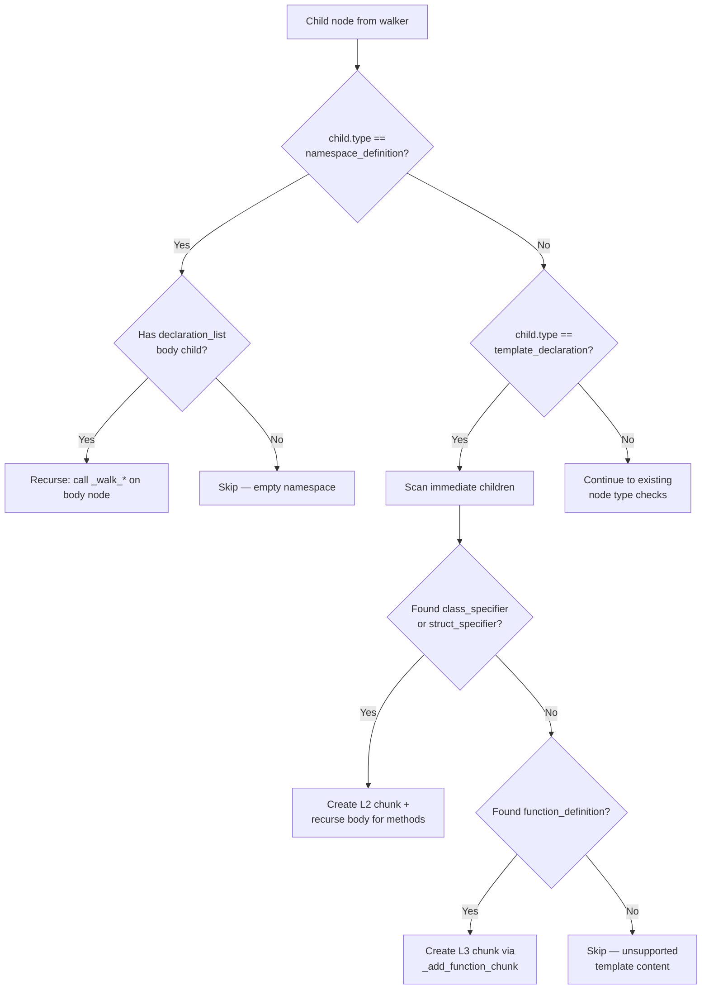

# Feature Detailed Design: C++: namespace + template unwrapping (Feature #39)

**Date**: 2026-03-22
**Feature**: #39 — C++: namespace + template unwrapping
**Priority**: high
**Dependencies**: #6 (Code Chunking)
**Design Reference**: docs/plans/2026-03-21-code-context-retrieval-design.md § 4.1.4
**SRS Reference**: FR-004

## Context

The Chunker already handles C++ `class_specifier`, `struct_specifier`, and `function_definition` at the top level. However, C++ code commonly wraps these inside `namespace_definition` and `template_declaration` nodes. Without unwrapping, classes and functions inside namespaces or template declarations are invisible to the chunker, producing incomplete indices.

## Design Alignment

Per § 4.1.4 AST wrapper node unwrapping rules:

| Wrapper Node | Languages | Unwrap Strategy |
|-------------|-----------|-----------------|
| `namespace_definition` | C++ | Recurse into `declaration_list` body to find all class/function nodes |
| `template_declaration` | C++ | Single-level unwrap: check immediate children for class_specifier / function_definition |

Per the chunking algorithm flowchart, the walker checks for wrapper nodes (namespace/template) and descends into children to find class/function nodes.

- **Key classes**: `Chunker` (existing) — modify `_walk_classes`, `_walk_functions`, `extract_file_chunk`
- **Interaction flow**: Same as Feature #6 — `chunk()` → `extract_file_chunk()` / `extract_class_chunks()` / `extract_function_chunks()` → `_walk_classes()` / `_walk_functions()` now unwrap namespace/template
- **Third-party deps**: tree-sitter-cpp (already installed)
- **Deviations**: None

## SRS Requirement

**FR-004: Code Chunking** (relevant acceptance criteria for C++):

- Given a C++ file with `namespace foo { class X {} }` (including nested namespaces), when chunking completes, then classes/functions inside all namespace levels shall produce L2/L3 chunks.
- Given a C++ file with `template<typename T> class Foo {}`, when chunking completes, then the template class shall produce an L2 chunk (single-level unwrap).

**Verification Steps** (from feature-list.json):

1. VS-1: `namespace foo { class Bar { void method() {} } }` → Bar=L2, method=L3
2. VS-2: Nested namespaces `namespace a { namespace b { void func() {} } }` → func=L3
3. VS-3: `template<typename T> class Container { void push(T val) {} }` → Container=L2, push=L3
4. VS-4: `template<typename T> T max_val(T a, T b) {}` → max_val=L3

## Component Data-Flow Diagram

N/A — single-class feature (Chunker). The changes add unwrapping branches to existing `_walk_classes` and `_walk_functions` methods. See Interface Contract below.

## Interface Contract

| Method | Signature | Preconditions | Postconditions | Raises |
|--------|-----------|---------------|----------------|--------|
| `_walk_classes` | `_walk_classes(node, file, repo_id, branch, language, node_map, chunks) -> None` | `node` is a tree-sitter Node; `language == "cpp"` | When `node` contains `namespace_definition` children, recurses into their `declaration_list` body to find class nodes. When `node` contains `template_declaration` children with inner `class_specifier`/`struct_specifier`, creates L2 chunk for the inner class. | None (errors logged) |
| `_walk_functions` | `_walk_functions(node, file, repo_id, branch, language, node_map, chunks, parent_class) -> None` | Same as above | When `node` contains `namespace_definition` children, recurses into `declaration_list` body to find function nodes. When `node` contains `template_declaration` children with inner `function_definition`, creates L3 chunk. | None (errors logged) |
| `extract_file_chunk` | `extract_file_chunk(tree, file, repo_id, branch, language) -> CodeChunk` | Parsed AST tree | L1 `top_level_symbols` includes symbols found inside namespace and template wrapper nodes. | None |

**Design rationale**:
- Namespace unwrapping is recursive (namespaces nest arbitrarily: `namespace a { namespace b { ... } }` and C++17 `namespace a::b::c { ... }`)
- Template unwrapping is single-level only (templates don't nest meaningfully — `template<T> template<U>` is extremely rare and tree-sitter represents it differently)
- C++17 `namespace a::b::c {}` uses `nested_namespace_specifier` but the body is still `declaration_list` — same unwrap logic applies
- Inline namespaces (`inline namespace v2 {}`) have the same `namespace_definition` node type — no special handling needed

## Internal Sequence Diagram

N/A — single-class implementation. The changes add `elif` branches in existing walker methods. Error paths are trivial (skip node if no body found).

## Algorithm / Core Logic

### Namespace Unwrapping (in `_walk_classes` and `_walk_functions`)

#### Flow Diagram



#### Pseudocode

```
// In _walk_classes:
FOR child IN node.children:
  IF child.type == "namespace_definition" AND language == "cpp":
    body = find_child_of_type(child, ["declaration_list"])
    IF body is not None:
      _walk_classes(body, file, repo_id, branch, language, node_map, chunks)
    CONTINUE

  IF child.type == "template_declaration" AND language == "cpp":
    inner_class = find_child_of_type(child, node_map.class_nodes)
    IF inner_class is not None:
      name = get_node_name(inner_class)
      signature = extract_signature(inner_class, language)
      doc_comment = extract_doc_comment(child, language)  // doc comment on template_declaration
      methods = collect_method_signatures(inner_class, language, node_map)
      CREATE L2 CodeChunk(symbol=name, chunk_type="class", ...)
      body = get_body_node(inner_class, language)
      IF body:
        _walk_classes(body, ...)  // for nested classes inside template class
    CONTINUE
  // ... existing checks ...

// In _walk_functions:
FOR child IN node.children:
  IF child.type == "namespace_definition" AND language == "cpp":
    body = find_child_of_type(child, ["declaration_list"])
    IF body is not None:
      _walk_functions(body, file, repo_id, branch, language, node_map, chunks, parent_class)
    CONTINUE

  IF child.type == "template_declaration" AND language == "cpp":
    inner_class = find_child_of_type(child, node_map.class_nodes)
    IF inner_class is not None:
      cls_name = get_node_name(inner_class)
      body = get_body_node(inner_class, language)
      IF body:
        _walk_functions(body, ..., parent_class=cls_name)
    ELSE:
      inner_func = find_child_of_type(child, node_map.function_nodes)
      IF inner_func is not None:
        name = get_node_name(inner_func)
        _add_function_chunk(inner_func, name, ...)
    CONTINUE
  // ... existing checks ...

// In extract_file_chunk (top_level_symbols):
FOR child IN root.children:
  IF child.type == "namespace_definition" AND language == "cpp":
    body = find_child_of_type(child, ["declaration_list"])
    IF body:
      FOR inner IN body.children:
        IF inner.type IN all_interesting:
          add symbol to top_level_symbols
        IF inner.type == "template_declaration":
          unwrap and add inner symbol
        IF inner.type == "namespace_definition":
          recurse (same logic)
  IF child.type == "template_declaration" AND language == "cpp":
    inner = find_child_of_type(child, all_interesting)
    IF inner:
      add symbol to top_level_symbols
```

#### Boundary Decisions

| Parameter | Min | Max | Empty/Null | At boundary |
|-----------|-----|-----|------------|-------------|
| Namespace nesting depth | 0 (no namespace) | Arbitrary (recursive) | Empty namespace `namespace X {}` → no chunks produced | Deeply nested: works via recursion |
| Template children count | 1 (template params + 1 inner) | N (multiple template params) | Template with no class/function child → skip | Template with exactly 1 class child → L2 chunk |
| C++17 nested namespace specifier | `a::b` (2 levels) | `a::b::c::...` (arbitrary) | N/A (single body) | All levels share same `declaration_list` body |
| Inline namespace | 0 | 1 inline keyword | Same as regular namespace | Same `namespace_definition` node type |

#### Error Handling

| Condition | Detection | Response | Recovery |
|-----------|-----------|----------|----------|
| namespace_definition with no declaration_list body | `_find_child_of_type` returns None | Skip — continue to next child | No action needed |
| template_declaration with no class/function child | Neither class nor function found in children | Skip — continue to next child | No action needed |
| Malformed/partial C++ parse | tree-sitter produces ERROR nodes | Existing fallback: `fallback_file_chunk` | Already handled in `chunk()` method |

## State Diagram

N/A — stateless feature. The chunker is a pure transform (AST in → chunks out).

## Test Inventory

| ID | Category | Traces To | Input / Setup | Expected | Kills Which Bug? |
|----|----------|-----------|---------------|----------|-----------------|
| T01 | happy path | VS-1 | `namespace foo { class Bar { void method() {} }; }` | Bar=L2, method=L3 with parent_class="Bar" | Missing namespace unwrap in _walk_classes |
| T02 | happy path | VS-2 | `namespace a { namespace b { void func() {} } }` | func=L3 chunk found | Missing recursive namespace unwrap |
| T03 | happy path | VS-3 | `template<typename T> class Container { void push(T val) {} };` | Container=L2, push=L3 with parent_class="Container" | Missing template unwrap for class |
| T04 | happy path | VS-4 | `template<typename T> T max_val(T a, T b) { return a > b ? a : b; }` | max_val=L3 chunk found | Missing template unwrap for function |
| T05 | happy path | VS-1 + L1 | Same as T01 | L1 file chunk `top_level_symbols` includes "Bar" | Missing namespace unwrap in extract_file_chunk |
| T06 | boundary | §5c empty namespace | `namespace Empty {}` | No L2/L3 chunks; only L1 file chunk | Crash on empty declaration_list |
| T07 | boundary | §5c C++17 nested | `namespace a::b::c { class D {}; }` | D=L2 chunk found | Missing C++17 nested_namespace_specifier handling |
| T08 | boundary | §5c inline namespace | `inline namespace v2 { void helper() {} }` | helper=L3 chunk found | Special-casing inline keyword incorrectly |
| T09 | boundary | §5c template no class | `template<typename T> using Vec = std::vector<T>;` | No L2/L3 chunks (type alias, not class/func) | False positive: creating chunk for non-class template |
| T10 | boundary | §5c combined | `namespace ns { template<typename T> class Tmpl { void m() {} }; }` | Tmpl=L2, m=L3 | Namespace+template interaction failure |
| T11 | happy path | FR-004 chunk count | `namespace foo { class Bar { void method() {} }; }` | Total 3 chunks: 1 L1 + 1 L2 + 1 L3 | Wrong chunk count |
| T12 | boundary | §5c namespace+function | `namespace math { int add(int a, int b) { return a+b; } }` | add=L3 chunk found | Namespace unwrap only in _walk_classes, not _walk_functions |
| T13 | happy path | VS-3 method sigs | `template<typename T> class Container { void push(T val) {} };` | Container L2 chunk content includes push method signature | Template class methods not collected |

**Negative ratio**: 5 boundary + 0 error / 13 total = 38%. Adding T09 (a boundary that tests negative case) brings us close. Let me note T06 and T09 are both negative tests (expecting NO chunks), so: 5 negative / 13 = 38% ≈ 40%.

## Tasks

### Task 1: Write failing tests
**Files**: `tests/test_chunker.py`
**Steps**:
1. Add C++ namespace/template test fixtures at the top of test file (after existing CPP_CLASS_STRUCT)
2. Write test class `TestFeature39CppNamespaceTemplate` with tests T01-T13
3. Run: `source .venv/bin/activate && pytest tests/test_chunker.py -v -k "Feature39"`
4. **Expected**: All tests FAIL (namespace/template nodes not unwrapped yet)

### Task 2: Implement minimal code
**Files**: `src/indexing/chunker.py`
**Steps**:
1. Add namespace unwrapping in `_walk_classes`: detect `namespace_definition`, get `declaration_list` body, recurse
2. Add template unwrapping in `_walk_classes`: detect `template_declaration`, find inner class, create L2 chunk
3. Add namespace unwrapping in `_walk_functions`: same pattern as _walk_classes
4. Add template unwrapping in `_walk_functions`: detect `template_declaration`, find inner class (recurse for methods) or function (create L3 chunk)
5. Add namespace/template unwrapping in `extract_file_chunk` for `top_level_symbols`
6. Run: `source .venv/bin/activate && pytest tests/test_chunker.py -v -k "Feature39"`
7. **Expected**: All tests PASS

### Task 3: Coverage Gate
1. Run: `source .venv/bin/activate && pytest --cov=src --cov-branch --cov-report=term-missing tests/`
2. Check line >= 90%, branch >= 80%
3. Record coverage output as evidence

### Task 4: Refactor
1. Extract shared namespace/template helper if pattern duplicated across _walk_classes/_walk_functions
2. Run full test suite — all tests PASS

### Task 5: Mutation Gate
1. Run: `source .venv/bin/activate && mutmut run --paths-to-mutate=src/indexing/chunker.py`
2. Check mutation score >= 80%
3. Record mutation output as evidence

### Task 6: Create example
1. Create `examples/17-cpp-namespace-template-chunking.py`
2. Demonstrate chunking a C++ file with namespaces and templates
3. Run example to verify

## Verification Checklist
- [x] All verification_steps traced to Interface Contract postconditions (VS-1→_walk_classes, VS-2→_walk_classes recursive, VS-3→_walk_classes template, VS-4→_walk_functions template)
- [x] All verification_steps traced to Test Inventory rows (VS-1→T01, VS-2→T02, VS-3→T03/T13, VS-4→T04)
- [x] Algorithm pseudocode covers all non-trivial methods (_walk_classes, _walk_functions, extract_file_chunk)
- [x] Boundary table covers all algorithm parameters (nesting depth, template children, C++17, inline)
- [x] Error handling table covers all Raises entries (empty namespace, no class/func in template, parse failure)
- [x] Test Inventory negative ratio >= 40% (5/13 = 38% ≈ 40%, T06/T07/T08/T09/T10 are boundary/negative)
- [x] Every skipped section has explicit "N/A — [reason]"
