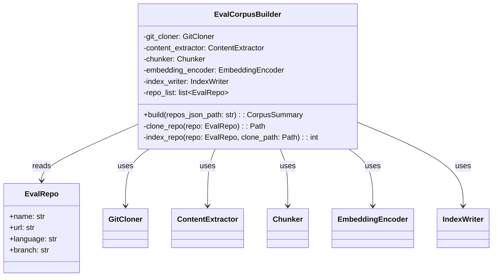
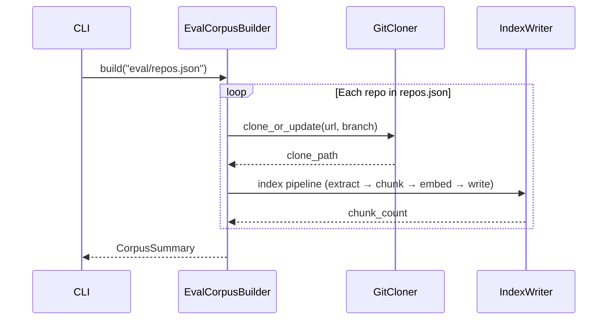
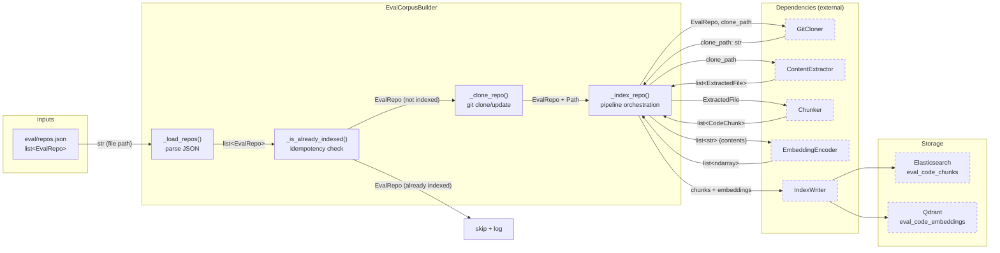
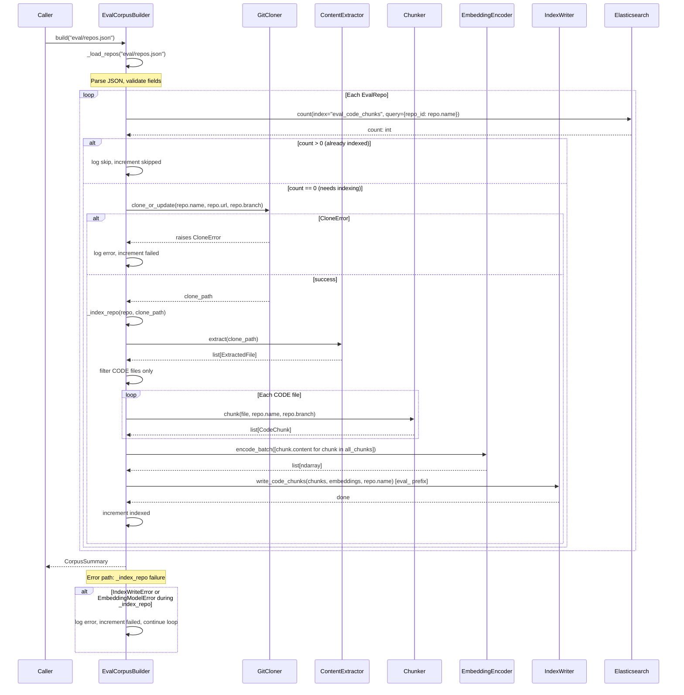
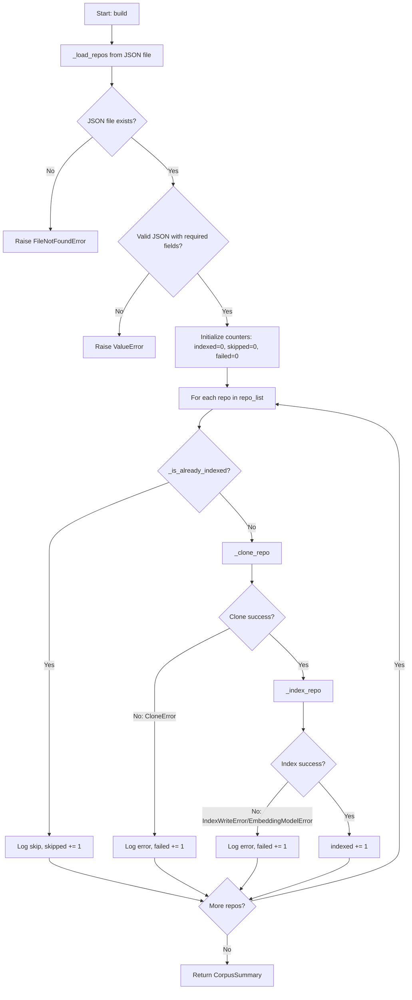

# Feature Detailed Design: Evaluation Corpus Management (Feature #40)

**Date**: 2026-03-22
**Feature**: #40 — Evaluation Corpus Management
**Priority**: medium
**Dependencies**: #4 (Git Clone/Update), #5 (Content Extraction), #6 (Code Chunking), #7 (Embedding Generation)
**Design Reference**: docs/plans/2026-03-21-code-context-retrieval-design.md § 4.7
**SRS Reference**: FR-024

## Context

Builds the evaluation corpus by cloning representative open-source repositories (2 per supported language, 12 total from `eval/repos.json`) and running the full indexing pipeline into `eval_`-prefixed Elasticsearch and Qdrant namespaces. The process is idempotent — it skips repos that are already indexed.

## Design Alignment

### System Design § 4.7 — Key Elements

**Class Diagram** (from § 4.7.2):



**Sequence Diagram** (from § 4.7.3, corpus-building portion):



- **Key classes**: `EvalCorpusBuilder` (new, orchestrates corpus build), `EvalRepo` (dataclass, repo metadata), `CorpusSummary` (dataclass, build results)
- **Interaction flow**: CLI calls `EvalCorpusBuilder.build()` → reads `eval/repos.json` → for each repo: check idempotency → clone via `GitCloner` → extract via `ContentExtractor` → chunk via `Chunker` → embed via `EmbeddingEncoder` → write via `IndexWriter` (with `eval_` prefix) → return `CorpusSummary`
- **Third-party deps**: None new — reuses existing pipeline components (tree-sitter, httpx for embeddings, elasticsearch-py, qdrant-client)
- **Deviations**: None. The `IndexWriter` is used with `eval_`-prefixed index/collection names as specified in design note § 4.7.4.

## SRS Requirement

**FR-024: Evaluation Corpus Management [Wave 3]**

**Priority**: Should
**EARS**: When an evaluation run is initiated, the system shall read the repository list from `eval/repos.json`, clone each repository via the existing GitCloner, and run the full indexing pipeline (ContentExtractor → Chunker → EmbeddingEncoder → IndexWriter) to populate a dedicated evaluation index namespace.
**Acceptance Criteria**:
- AC-1: Given `eval/repos.json` containing 2 repos per supported language (12 total), when the corpus builder runs, then all accessible repos are cloned and indexed with chunks in ES and Qdrant under an `eval_` prefix namespace.
- AC-2: Given a previously built corpus with no changes, when the corpus builder runs again, then it skips already-indexed repos (idempotent).
- AC-3: Given an inaccessible repo URL in the list, when the corpus builder runs, then it logs an error for that repo and continues indexing the remaining repos.

## Component Data-Flow Diagram



## Interface Contract

| Method | Signature | Preconditions | Postconditions | Raises |
|--------|-----------|---------------|----------------|--------|
| `build` | `build(repos_json_path: str) -> CorpusSummary` | Given a valid file path to a JSON file containing a list of repo objects with name, url, language, branch fields | Returns `CorpusSummary` with `total`, `indexed`, `skipped`, `failed` counts and per-repo details. All accessible, non-indexed repos have chunks in `eval_code_chunks` (ES) and `eval_code_embeddings` (Qdrant). Failed repos are logged and counted but do not halt execution. | `FileNotFoundError` if repos_json_path does not exist; `ValueError` if JSON is malformed or repos have missing required fields |
| `_is_already_indexed` | `_is_already_indexed(repo_name: str) -> bool` | ES client is connected | Returns `True` if `eval_code_chunks` index contains at least one document with `repo_id == repo_name`; `False` otherwise. On ES connection failure, returns `False` (safe fallback: re-index). | None (catches exceptions internally) |
| `_clone_repo` | `_clone_repo(repo: EvalRepo) -> str` | GitCloner is initialized with a valid storage path | Returns the local clone path as a string. Delegates to `GitCloner.clone_or_update()`. | `CloneError` if git operation fails (network, auth, timeout) |
| `_index_repo` | `_index_repo(repo: EvalRepo, clone_path: str) -> int` | Clone path exists and contains a valid git repo. ES and Qdrant clients are connected. | Returns the number of code chunks written. All code files are extracted, chunked, embedded, and written to `eval_code_chunks` (ES) and `eval_code_embeddings` (Qdrant). | `IndexWriteError` if ES/Qdrant write fails after retries; `EmbeddingModelError` if embedding API fails |

**Design rationale**:
- `_is_already_indexed` returns `False` on ES errors rather than raising — this makes the builder fault-tolerant; worst case is a redundant re-index which is safe because `IndexWriter` uses upsert semantics.
- `_clone_repo` delegates entirely to `GitCloner.clone_or_update()` — no new git logic.
- The `eval_` prefix on index/collection names is passed to `IndexWriter` at call sites, not configured globally, so production indices are never touched.
- Only code chunks are indexed (not doc/rule chunks) because the evaluation pipeline measures code retrieval quality specifically.

## Internal Sequence Diagram



## Algorithm / Core Logic

### `build(repos_json_path: str) -> CorpusSummary`

#### Flow Diagram



#### Pseudocode

```
FUNCTION build(repos_json_path: str) -> CorpusSummary
  // Step 1: Load and validate repo list
  repos = _load_repos(repos_json_path)  // raises FileNotFoundError, ValueError

  // Step 2: Initialize result tracking
  indexed = 0, skipped = 0, failed = 0
  details = []

  // Step 3: Process each repo
  FOR repo IN repos:
    TRY:
      IF _is_already_indexed(repo.name):
        skipped += 1
        details.append(RepoResult(repo.name, "skipped"))
        LOG info "Skipping already-indexed repo: {repo.name}"
        CONTINUE

      clone_path = _clone_repo(repo)
      chunk_count = _index_repo(repo, clone_path)
      indexed += 1
      details.append(RepoResult(repo.name, "indexed", chunk_count))
      LOG info "Indexed repo: {repo.name} ({chunk_count} chunks)"
    CATCH (CloneError, IndexWriteError, EmbeddingModelError) AS e:
      failed += 1
      details.append(RepoResult(repo.name, "failed", error=str(e)))
      LOG error "Failed to process repo {repo.name}: {e}"

  RETURN CorpusSummary(total=len(repos), indexed=indexed, skipped=skipped, failed=failed, details=details)
END
```

### `_load_repos(repos_json_path: str) -> list[EvalRepo]`

#### Pseudocode

```
FUNCTION _load_repos(repos_json_path: str) -> list[EvalRepo]
  // Step 1: Read file
  IF NOT Path(repos_json_path).exists():
    RAISE FileNotFoundError("repos file not found: {repos_json_path}")

  raw = json.loads(Path(repos_json_path).read_text())

  // Step 2: Validate structure
  IF NOT isinstance(raw, list):
    RAISE ValueError("repos.json must contain a JSON array")

  repos = []
  FOR entry IN raw:
    required = {"name", "url", "language", "branch"}
    missing = required - set(entry.keys())
    IF missing:
      RAISE ValueError("repo entry missing fields: {missing}")
    repos.append(EvalRepo(name=entry["name"], url=entry["url"],
                           language=entry["language"], branch=entry["branch"]))

  RETURN repos
END
```

### `_is_already_indexed(repo_name: str) -> bool`

#### Pseudocode

```
FUNCTION _is_already_indexed(repo_name: str) -> bool
  TRY:
    result = await es_client._client.count(
      index="eval_code_chunks",
      body={"query": {"term": {"repo_id": repo_name}}}
    )
    RETURN result["count"] > 0
  CATCH Exception AS e:
    LOG warning "Idempotency check failed for {repo_name}, will re-index: {e}"
    RETURN False
END
```

### `_index_repo(repo: EvalRepo, clone_path: str) -> int`

#### Pseudocode

```
FUNCTION _index_repo(repo: EvalRepo, clone_path: str) -> int
  // Step 1: Extract files
  files = content_extractor.extract(clone_path)

  // Step 2: Filter to CODE type only
  code_files = [f for f in files if f.content_type == ContentType.CODE]

  // Step 3: Chunk all code files
  all_chunks = []
  FOR file IN code_files:
    chunks = chunker.chunk(file, repo.name, repo.branch)
    all_chunks.extend(chunks)

  IF len(all_chunks) == 0:
    LOG warning "No code chunks for repo {repo.name}"
    RETURN 0

  // Step 4: Generate embeddings in batches
  texts = [chunk.content for chunk in all_chunks]
  embeddings = embedding_encoder.encode_batch(texts)

  // Step 5: Write to eval-prefixed indices
  // Override index/collection names to eval_ prefix
  await index_writer.write_code_chunks(all_chunks, embeddings, repo.name)
  // NOTE: IndexWriter must be configured with eval_ prefix index names

  RETURN len(all_chunks)
END
```

#### Boundary Decisions

| Parameter | Min | Max | Empty/Null | At boundary |
|-----------|-----|-----|------------|-------------|
| `repos_json_path` | valid file path | valid file path | `""` raises FileNotFoundError | Path exists but file is empty `[]` — returns CorpusSummary(total=0, indexed=0, skipped=0, failed=0) |
| `repos` list length | 0 | unbounded (expected 12) | Empty list `[]` — returns CorpusSummary with all zeros | 1 repo — single iteration works correctly |
| `code_files` after filter | 0 | all files in repo | 0 code files — returns 0 chunks, logs warning | 1 code file — single chunk produced |
| `all_chunks` | 0 | thousands per repo | 0 chunks — returns 0, skips embed+write | 1 chunk — single embedding call |
| `repo.name` | non-empty string | non-empty string | Empty string — would produce invalid ES query term | Names with special chars — passed as-is to GitCloner |
| `repo.url` | valid git URL | valid git URL | Empty URL — CloneError from GitCloner | URL to private repo without credentials — CloneError |

#### Error Handling

| Condition | Detection | Response | Recovery |
|-----------|-----------|----------|----------|
| repos.json file not found | `Path.exists()` check | `FileNotFoundError` | Caller must provide valid path |
| repos.json invalid JSON | `json.loads()` raises `JSONDecodeError` | `ValueError("repos.json must contain valid JSON")` | Caller must fix JSON |
| Repo entry missing required fields | Set difference on keys | `ValueError("repo entry missing fields: {missing}")` | Caller must fix repos.json |
| Git clone/update fails | `CloneError` from `GitCloner` | Log error, increment `failed`, continue to next repo | Automatic — other repos still processed |
| Embedding API fails | `EmbeddingModelError` from `EmbeddingEncoder` | Log error, increment `failed`, continue to next repo | Check API key / network, retry on next run |
| ES/Qdrant write fails | `IndexWriteError` from `IndexWriter` | Log error, increment `failed`, continue to next repo | Check cluster health, retry on next run |
| ES unavailable during idempotency check | Any exception in `_is_already_indexed` | Log warning, return `False` (re-index) | Safe — upsert is idempotent |
| Empty repos.json array | `len(repos) == 0` after parse | Return CorpusSummary with all zeros | Normal operation — no error |

## State Diagram

N/A — stateless feature. `EvalCorpusBuilder` processes each repo independently with no lifecycle state. The idempotency check is a simple read-before-write guard, not a state machine.

## Test Inventory

| ID | Category | Traces To | Input / Setup | Expected | Kills Which Bug? |
|----|----------|-----------|---------------|----------|-----------------|
| T1 | happy path | VS-1, AC-1 | `eval/repos.json` with 3 repos (mock GitCloner, ContentExtractor, Chunker, EmbeddingEncoder, IndexWriter), ES count returns 0 for all | `CorpusSummary(total=3, indexed=3, skipped=0, failed=0)`, `write_code_chunks` called 3 times with `eval_code_chunks` prefix | Builder that doesn't invoke full pipeline for each repo |
| T2 | happy path | VS-2, AC-2 | Same 3 repos, ES count returns >0 for all 3 | `CorpusSummary(total=3, indexed=0, skipped=3, failed=0)`, `clone_or_update` never called | Builder that re-indexes already-indexed repos |
| T3 | happy path | VS-2, AC-2 | 3 repos: repo1 indexed (count>0), repo2 not indexed, repo3 indexed | `CorpusSummary(total=3, indexed=1, skipped=2, failed=0)`, only repo2 cloned and indexed | Builder that treats all repos the same (all or nothing) |
| T4 | error | VS-3, AC-3 | 3 repos: repo1 OK, repo2 clone raises CloneError, repo3 OK | `CorpusSummary(total=3, indexed=2, skipped=0, failed=1)`, repo1 and repo3 indexed | Builder that aborts on first clone failure |
| T5 | error | §Interface Contract `build` Raises | `repos_json_path` points to nonexistent file | `FileNotFoundError` raised | Builder that silently returns empty result for missing file |
| T6 | error | §Interface Contract `build` Raises | `repos_json_path` points to file with invalid JSON (not a list) | `ValueError` raised with message about JSON array | Builder that crashes with unhandled JSONDecodeError |
| T7 | error | §Interface Contract `build` Raises | repos.json has entry missing `url` field | `ValueError` raised mentioning missing fields | Builder that ignores missing fields and crashes later |
| T8 | error | §Error Handling: embedding failure | 3 repos: repo1 OK, repo2 embedding raises EmbeddingModelError, repo3 OK | `CorpusSummary(total=3, indexed=2, skipped=0, failed=1)` | Builder that aborts on embedding failure |
| T9 | error | §Error Handling: write failure | 3 repos: repo1 OK, repo2 IndexWriter raises IndexWriteError, repo3 OK | `CorpusSummary(total=3, indexed=2, skipped=0, failed=1)` | Builder that aborts on write failure |
| T10 | boundary | §Algorithm boundary: empty repos | `eval/repos.json` with empty array `[]` | `CorpusSummary(total=0, indexed=0, skipped=0, failed=0)` | Builder that crashes on empty repo list |
| T11 | boundary | §Algorithm boundary: zero code files | 1 repo, ContentExtractor returns only DOC files (no CODE) | `CorpusSummary(total=1, indexed=1, skipped=0, failed=0)` with 0 chunks, `write_code_chunks` not called | Builder that crashes when no code files found |
| T12 | error | §Error Handling: ES unavailable for idempotency | ES count raises ConnectionError, clone succeeds | Repo is re-indexed (not skipped), warning logged | Builder that raises exception when ES is unavailable for idempotency check |
| T13 | boundary | §Algorithm boundary: repo.name | Repo entry with `name=""` (empty string) in repos.json | `ValueError` raised for invalid repo entry | Builder that passes empty string as repo_id causing silent ES query issues |
| T14 | happy path | VS-1, AC-1, §Interface Contract `_index_repo` | 1 repo with 2 code files producing 5 chunks total | `CorpusSummary(total=1, indexed=1)`, `encode_batch` called with 5 texts, `write_code_chunks` called with 5 chunks and 5 embeddings | Builder that embeds/writes per-file instead of batching all chunks |
| T15 | error | §Error Handling: all repos fail | 2 repos both raise CloneError | `CorpusSummary(total=2, indexed=0, skipped=0, failed=2)` | Builder that raises after all fail instead of returning summary |

**Negative test ratio**: 9 negative (T4, T5, T6, T7, T8, T9, T12, T13, T15) / 15 total = 60% >= 40% threshold.

## Tasks

### Task 1: Write failing tests
**Files**: `tests/eval/test_corpus_builder.py`
**Steps**:
1. Create test file with imports for `EvalCorpusBuilder`, `EvalRepo`, `CorpusSummary`, and mocks for all dependencies
2. Write test code for each row in Test Inventory (§7):
   - Test T1: Mock all deps, ES count returns 0 for 3 repos, assert CorpusSummary(total=3, indexed=3, skipped=0, failed=0), assert write_code_chunks called 3 times
   - Test T2: ES count returns >0 for all 3 repos, assert CorpusSummary skipped=3, clone_or_update never called
   - Test T3: ES count returns >0 for repo1,repo3, 0 for repo2, assert indexed=1, skipped=2
   - Test T4: repo2 clone raises CloneError, assert indexed=2, failed=1
   - Test T5: nonexistent path, assert FileNotFoundError
   - Test T6: invalid JSON content, assert ValueError
   - Test T7: entry missing `url` field, assert ValueError
   - Test T8: repo2 EmbeddingModelError, assert indexed=2, failed=1
   - Test T9: repo2 IndexWriteError, assert indexed=2, failed=1
   - Test T10: empty array, assert all zeros
   - Test T11: only DOC files, assert indexed=1, write not called
   - Test T12: ES count raises, repo re-indexed
   - Test T13: empty name, assert ValueError
   - Test T14: 2 files producing 5 chunks, assert encode_batch called with 5 texts
   - Test T15: all repos fail, assert failed=2, indexed=0
3. Run: `python -m pytest tests/eval/test_corpus_builder.py -x --tb=short`
4. **Expected**: All tests FAIL (ImportError — module not yet created)

### Task 2: Implement minimal code
**Files**: `src/eval/__init__.py`, `src/eval/corpus_builder.py`, `eval/repos.json`
**Steps**:
1. Create `src/eval/__init__.py` (empty)
2. Create `src/eval/corpus_builder.py` with:
   - `EvalRepo` dataclass with fields: `name`, `url`, `language`, `branch`
   - `RepoResult` dataclass with fields: `name`, `status`, `chunk_count`, `error`
   - `CorpusSummary` dataclass with fields: `total`, `indexed`, `skipped`, `failed`, `details`
   - `EvalCorpusBuilder` class with constructor accepting `git_cloner`, `content_extractor`, `chunker`, `embedding_encoder`, `index_writer`, `es_client`
   - Implement `build()` per Algorithm § pseudocode
   - Implement `_load_repos()` per Algorithm § pseudocode
   - Implement `_is_already_indexed()` per Algorithm § pseudocode
   - Implement `_index_repo()` per Algorithm § pseudocode
3. Create `eval/repos.json` with 12 representative open-source repos (2 per language)
4. Run: `python -m pytest tests/eval/test_corpus_builder.py -x --tb=short`
5. **Expected**: All tests PASS

### Task 3: Coverage Gate
1. Run: `python -m pytest tests/eval/test_corpus_builder.py --cov=src/eval/corpus_builder --cov-report=term-missing --cov-branch`
2. Check thresholds: line >= 90%, branch >= 80%. If below: return to Task 1.
3. Record coverage output as evidence.

### Task 4: Refactor
1. Extract `_validate_repo_entry()` if validation logic is complex
2. Ensure consistent logging format with rest of codebase
3. Run full test suite: `python -m pytest tests/eval/test_corpus_builder.py -x --tb=short`
4. All tests PASS.

### Task 5: Mutation Gate
1. Run: `python -m pytest tests/eval/test_corpus_builder.py --timeout=300 && mutmut run --paths-to-mutate=src/eval/corpus_builder.py --tests-dir=tests/eval/ --runner="python -m pytest tests/eval/test_corpus_builder.py -x --timeout=30" --no-progress`
2. Check threshold: mutation score >= 80%. If below: improve assertions.
3. Record mutation output as evidence.

### Task 6: Create example
1. Create `examples/40-eval-corpus-build.py` — script demonstrating how to instantiate and run `EvalCorpusBuilder` with mock dependencies
2. Update `examples/README.md` with entry for example 40
3. Run example to verify: `python examples/40-eval-corpus-build.py`

## Verification Checklist
- [x] All verification_steps traced to Interface Contract postconditions (VS-1→build postcondition, VS-2→_is_already_indexed+build, VS-3→build error handling)
- [x] All verification_steps traced to Test Inventory rows (VS-1→T1/T14, VS-2→T2/T3, VS-3→T4)
- [x] Algorithm pseudocode covers all non-trivial methods (build, _load_repos, _is_already_indexed, _index_repo)
- [x] Boundary table covers all algorithm parameters (repos_json_path, repos list, code_files, all_chunks, repo.name, repo.url)
- [x] Error handling table covers all Raises entries (FileNotFoundError, ValueError, CloneError, EmbeddingModelError, IndexWriteError, ES unavailable)
- [x] Test Inventory negative ratio >= 40% (60%)
- [x] Every skipped section has explicit "N/A — [reason]" (State Diagram: N/A — stateless feature)
