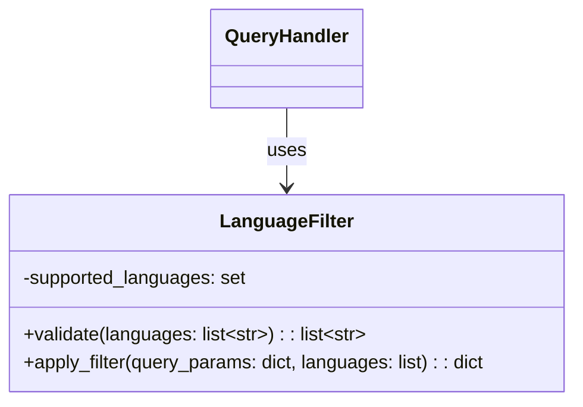
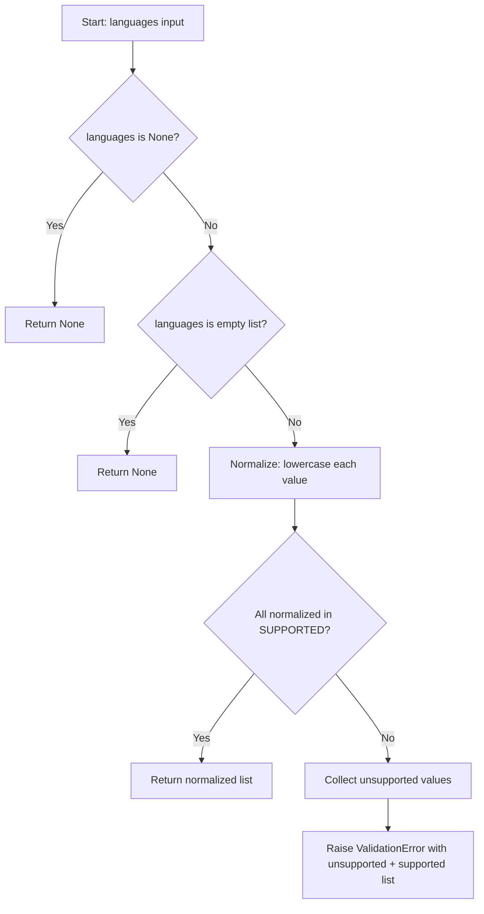

# Feature Detailed Design: Language Filter (Feature #20)

**Date**: 2026-03-22
**Feature**: #20 — Language Filter
**Priority**: medium
**Dependencies**: #8 (BM25 Keyword Retrieval), #9 (Semantic Retrieval)
**Design Reference**: docs/plans/2026-03-21-code-context-retrieval-design.md § 4.2
**SRS Reference**: FR-018

## Context

The Language Filter validates and enforces programming language restrictions on code retrieval queries. It ensures only chunks in the requested language(s) are returned, rejecting unsupported language values before they reach Elasticsearch or Qdrant.

## Design Alignment

From § 4.2.2 Class Diagram, the `LanguageFilter` class:



- **Key classes**: `LanguageFilter` (new, `src/query/language_filter.py`) — validate language values, integrate with `QueryHandler`
- **Interaction flow**: `QueryHandler.handle_nl_query()` → `LanguageFilter.validate()` → pass validated languages to `Retriever.bm25_code_search()` / `vector_code_search()`
- **Third-party deps**: None (uses only stdlib + project exceptions)
- **Deviations**:
  - `apply_filter` signature simplified from design's `(query_params: dict, languages: list) -> dict` to `(languages: list[str] | None) -> list[str] | None` — the Retriever already constructs ES/Qdrant filter clauses, so LanguageFilter only needs to validate and pass through the list. No dict wrapping needed.
  - `supported_languages` implemented as module-level `frozenset` constant (`SUPPORTED_LANGUAGES`) instead of private instance attribute — behavioral equivalence preserved, immutable constant is more Pythonic.

## SRS Requirement

### FR-018: Language Filter

**Priority**: Should
**EARS**: Where a language filter is specified in the query, the system shall restrict retrieval to chunks matching the specified programming language(s).
**Acceptance Criteria**:
- Given query "timeout" with language filter ["java"], when retrieval runs, then all returned chunks shall have `language` = "java".
- Given multiple language filters ["java", "python"], when retrieval runs, then returned chunks shall be in either Java or Python.
- Given an unrecognized language value (e.g., "rust"), when submitted, then the system shall return a 400 error listing the supported languages.
- Given an empty language filter list, when submitted, then the system shall search across all languages (no filter applied).

## Component Data-Flow Diagram

N/A — single-class feature, see Interface Contract below. `LanguageFilter` is a stateless utility with two methods; data flows linearly from input validation to filter application.

## Interface Contract

| Method | Signature | Preconditions | Postconditions | Raises |
|--------|-----------|---------------|----------------|--------|
| `validate` | `validate(languages: list[str] \| None) -> list[str] \| None` | Given a list of language strings (or None) from the query request | Returns normalized (lowercased) list if all languages are supported; returns None if input is None or empty list | `ValidationError` with message listing supported languages, if any language is not in the supported set |
| `apply_filter` | `apply_filter(languages: list[str] \| None) -> list[str] \| None` | Given a validated (or None) language list | Returns the language list unchanged (pass-through for validated input); returns None if input is None or empty | None — input already validated |

**Design rationale**:
- `validate` normalizes to lowercase because ES index stores language as lowercase (e.g., "java" not "Java"); callers may pass mixed case
- `apply_filter` is kept as a separate method per the design class diagram, but for this feature it's a trivial pass-through since the Retriever already handles ES/Qdrant filter construction. It exists for interface compliance and future extensibility
- Supported languages from CON-001: java, python, typescript, javascript, c, c++
- `validate` is called by `QueryHandler` before passing languages to Retriever, so invalid values never reach storage backends

## Internal Sequence Diagram

N/A — single-class implementation, error paths documented in Algorithm error handling table below.

## Algorithm / Core Logic

### validate

#### Flow Diagram



#### Pseudocode

```
CONSTANT SUPPORTED_LANGUAGES = {"java", "python", "typescript", "javascript", "c", "c++"}

FUNCTION validate(languages: list[str] | None) -> list[str] | None
  // Step 1: Handle None / empty
  IF languages is None THEN RETURN None
  IF languages is empty list THEN RETURN None

  // Step 2: Normalize to lowercase
  normalized = [lang.lower().strip() for lang in languages]

  // Step 3: Check all against supported set
  unsupported = [lang for lang in normalized if lang not in SUPPORTED_LANGUAGES]
  IF unsupported is not empty THEN
    RAISE ValidationError(
      "Unsupported language(s): {unsupported}. Supported: {sorted(SUPPORTED_LANGUAGES)}"
    )

  // Step 4: Return normalized list
  RETURN normalized
END
```

#### Boundary Decisions

| Parameter | Min | Max | Empty/Null | At boundary |
|-----------|-----|-----|------------|-------------|
| languages | 1 element list | 6 element list (all supported) | None → return None; [] → return None | Single language → filter to that; all 6 → effectively no filter (all supported) |
| language string | "c" (1 char) | "typescript" (10 chars) | "" after strip → unsupported → ValidationError | "c++" with special chars → must be in supported set |

#### Error Handling

| Condition | Detection | Response | Recovery |
|-----------|-----------|----------|----------|
| Unsupported language value | `lang not in SUPPORTED_LANGUAGES` after normalization | `ValidationError` with message listing unsupported value(s) and full supported set | Caller (QueryHandler/endpoint) catches and returns HTTP 400 |
| Mixed valid + invalid | Same check — collect ALL unsupported in one pass | Single `ValidationError` listing all unsupported values | Caller returns 400; user fixes and retries |

### apply_filter

Delegates to caller — trivial pass-through of validated input. The Retriever already constructs ES `terms` filter and Qdrant `MatchAny` filter from the languages list. See Feature #8 (`Retriever._build_code_query`) and Feature #9 (`Retriever._build_qdrant_filter`).

## State Diagram

N/A — stateless feature. `LanguageFilter` holds no mutable state; `SUPPORTED_LANGUAGES` is a class-level constant.

## Test Inventory

| ID | Category | Traces To | Input / Setup | Expected | Kills Which Bug? |
|----|----------|-----------|---------------|----------|-----------------|
| A1 | happy path | VS-1, FR-018 AC-1 | `validate(["java"])` | `["java"]` | Missing normalize or wrong supported set |
| A2 | happy path | VS-2, FR-018 AC-2 | `validate(["java", "python"])` | `["java", "python"]` | Single-language-only bug |
| A3 | happy path | VS-1 | `validate(["Java"])` | `["java"]` (normalized) | Missing case normalization |
| A4 | happy path | VS-1 | `validate(["TYPESCRIPT"])` | `["typescript"]` | Uppercase not handled |
| A5 | happy path | FR-018 | `validate(["c++"])` | `["c++"]` | Special char "+" rejected incorrectly |
| A6 | happy path | FR-018 | `validate(["java", "python", "typescript", "javascript", "c", "c++"])` | All 6 returned | Missing one from supported set |
| B1 | error | VS-3, FR-018 AC-3 | `validate(["rust"])` | `ValidationError` msg contains "rust" and lists supported | Missing validation entirely |
| B2 | error | VS-3 | `validate(["java", "rust"])` | `ValidationError` msg contains "rust" | Stops at first valid, skips invalid |
| B3 | error | §5 error handling | `validate(["go", "rust"])` | `ValidationError` msg contains both "go" and "rust" | Reports only first unsupported |
| C1 | boundary | VS-4, FR-018 AC-4 | `validate([])` | `None` | Empty list passes to retriever unfiltered |
| C2 | boundary | VS-4 | `validate(None)` | `None` | None not handled, raises TypeError |
| C3 | boundary | §5c | `validate(["  java  "])` | `["java"]` (stripped + lowered) | Whitespace-padded input not stripped |
| C4 | boundary | §5c | `validate(["c"])` | `["c"]` | Single-char language rejected |
| D1 | integration | VS-1 + QueryHandler | QueryHandler with `languages=["java"]` → mock retriever called with `languages=["java"]` | Retriever receives validated list | LanguageFilter not wired into QueryHandler |
| D2 | integration | VS-4 + QueryHandler | QueryHandler with `languages=[]` → retriever called with `languages=None` | Empty filter means no language restriction | Empty list passed as-is to retriever |
| D3 | integration | VS-3 + endpoint | POST /query with `languages=["rust"]` | HTTP 400 with supported languages in detail | Endpoint doesn't catch ValidationError from LanguageFilter |

Negative tests (B1-B3, C1-C4): 7/17 = 41% >= 40% ✓

## Tasks

### Task 1: Write failing tests
**Files**: `tests/test_language_filter.py`
**Steps**:
1. Create test file with imports for `LanguageFilter`, `ValidationError`
2. Write tests for each Test Inventory row:
   - Test A1-A6: happy path validation of single, multiple, normalized, all-6 languages
   - Test B1-B3: unsupported language raises `ValidationError` with proper message
   - Test C1-C4: boundary — empty list, None, whitespace, single-char language
   - Test D1-D2: integration with `QueryHandler` — mock retriever verifies languages passed through
   - Test D3: integration with endpoint — POST /query with unsupported language returns 400
3. Run: `source .venv/bin/activate && pytest tests/test_language_filter.py -v`
4. **Expected**: All tests FAIL (LanguageFilter class does not exist yet)

### Task 2: Implement minimal code
**Files**: `src/query/language_filter.py`
**Steps**:
1. Create `LanguageFilter` class with `SUPPORTED_LANGUAGES` constant set
2. Implement `validate()` per Algorithm §5 pseudocode: None/empty → None, normalize, check supported, raise `ValidationError`
3. Implement `apply_filter()` as pass-through (delegates to validate, returns result)
4. Wire into `QueryHandler.__init__` — accept `language_filter` param, call `validate()` at start of `handle_nl_query()` and pass result to retriever
5. Wire into query endpoint — instantiate `LanguageFilter`, pass to `QueryHandler`
6. Run: `source .venv/bin/activate && pytest tests/test_language_filter.py -v`
7. **Expected**: All tests PASS

### Task 3: Coverage Gate
1. Run: `source .venv/bin/activate && pytest --cov=src --cov-branch --cov-report=term-missing tests/`
2. Check line >= 90%, branch >= 80%. If below: add tests.
3. Record coverage output.

### Task 4: Refactor
1. Review `LanguageFilter` for clarity — ensure constant is frozen set, method docstrings present
2. Run full test suite: `pytest tests/ -v --tb=short`
3. All tests PASS.

### Task 5: Mutation Gate
1. Run: `source .venv/bin/activate && mutmut run --paths-to-mutate=src/query/language_filter.py`
2. Check mutation score >= 80%. If below: strengthen assertions.
3. Record mutation output.

### Task 6: Create example
1. Create `examples/23-language-filter.py`
2. Demonstrate constructing a `LanguageFilter`, validating good/bad inputs, showing error message format
3. Run example to verify.

## Verification Checklist
- [x] All verification_steps traced to Interface Contract postconditions
- [x] All verification_steps traced to Test Inventory rows (VS-1→A1,A3,D1; VS-2→A2; VS-3→B1,B2,D3; VS-4→C1,C2,D2)
- [x] Algorithm pseudocode covers all non-trivial methods (validate)
- [x] Boundary table covers all algorithm parameters (languages list, language string)
- [x] Error handling table covers all Raises entries (ValidationError)
- [x] Test Inventory negative ratio >= 40% (41%)
- [x] Every skipped section has explicit "N/A — [reason]"
