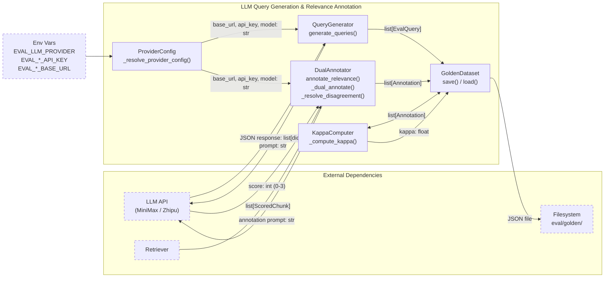
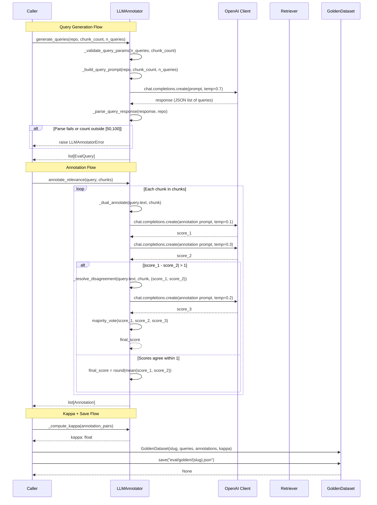
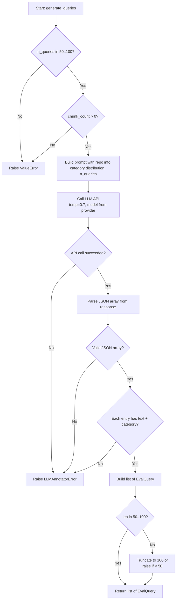
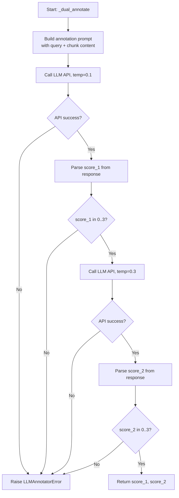
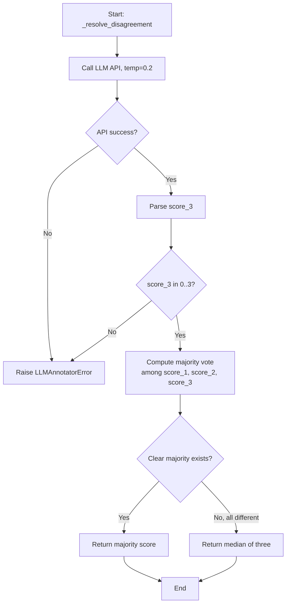
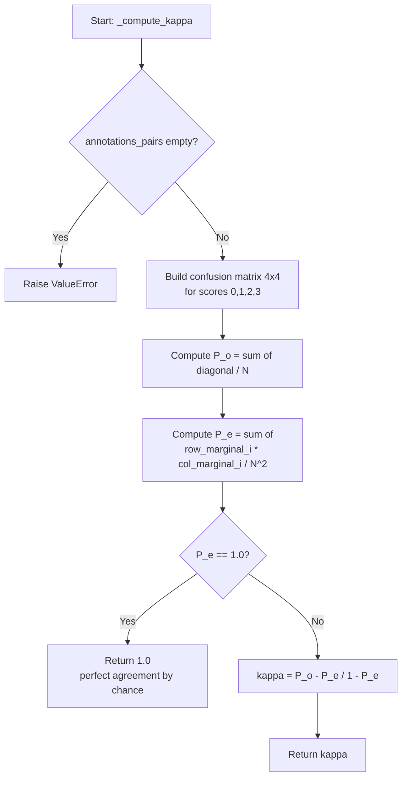
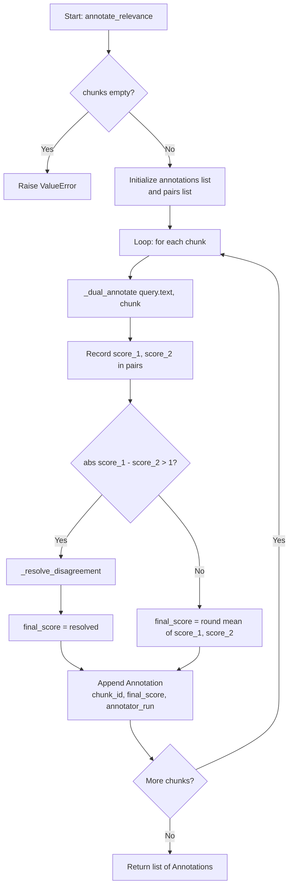

# Feature Detailed Design: LLM Query Generation & Relevance Annotation (Feature #41)

**Date**: 2026-03-22
**Feature**: #41 — LLM Query Generation & Relevance Annotation
**Priority**: medium
**Dependencies**: Feature #40 (Evaluation Corpus Builder)
**Design Reference**: docs/plans/2026-03-21-code-context-retrieval-design.md § 4.7
**SRS Reference**: FR-025

## Context

This feature implements the LLM-based query generation and dual-annotation pipeline for the retrieval quality evaluation system. It uses OpenAI-compatible LLM APIs (MiniMax or Zhipu, selected via `EVAL_LLM_PROVIDER` env var) to generate diverse natural language queries per evaluation repo, retrieve top-20 chunks per query, and annotate relevance on a 0-3 scale using dual annotation with Cohen's Kappa consistency checking. The output is a golden dataset stored as `eval/golden/{slug}.json`.

## Design Alignment

### System Design § 4.7 — Key Classes

From the class diagram, this feature implements:
- **`LLMAnnotator`** — core class with `generate_queries()`, `annotate_relevance()`, `_dual_annotate()`, `_resolve_disagreement()`, `_compute_kappa()`, `_resolve_provider_config()`
- **`EvalQuery`** — dataclass: `text`, `repo_id`, `language`, `category`
- **`Annotation`** — dataclass: `chunk_id`, `score`, `annotator_run`
- **`GoldenDataset`** — dataclass with `save()` and `load()` for persistence

### Interaction Flow

From sequence diagram: CLI calls `LLMAnnotator.generate_queries()` which POSTs to LLM API; then for each query, Retriever fetches top-20 chunks, and `LLMAnnotator.annotate_relevance()` runs dual annotation (two LLM calls per chunk, optional third on disagreement).

### Third-party Dependencies

- `openai` — OpenAI Python SDK (used as OpenAI-compatible client for MiniMax/Zhipu)
- MiniMax API: `https://api.minimaxi.com/v1`, model `MiniMax-M2.7`
- Zhipu API: configurable via `EVAL_ZHIPU_BASE_URL`, `EVAL_ZHIPU_API_KEY`, `EVAL_ZHIPU_MODEL`

### Deviations

- Design note says `httpx` client; we use the `openai` Python SDK instead (per additional context instructions) since MiniMax provides OpenAI-compatible endpoints. The SDK handles retries, streaming, and auth natively.
- Env var names use non-prefixed form (`MINIMAX_API_KEY`, `ZHIPU_API_KEY`) instead of `EVAL_`-prefixed form — aligns with the project's `check_configs.py` and `.env.example` conventions which already use non-prefixed names.
- Model changed from `MiniMax-M1-80k` (design doc) to `MiniMax-M2.7` — user-specified upgrade; configurable via `MINIMAX_MODEL` env var.

## SRS Requirement

**FR-025: LLM Query Generation & Relevance Annotation [Wave 3]**

**Priority**: Should
**EARS**: When an evaluation corpus has been indexed, the system shall use a configurable LLM provider (MiniMax or Zhipu, selected via EVAL_LLM_PROVIDER) via OpenAI-compatible endpoint to generate 50-100 natural language queries per repository and annotate the relevance of retrieved chunks using a dual-annotation protocol with consistency checking.

**Acceptance Criteria**:
- **AC-1**: Given an indexed evaluation repo, when query generation runs, then 50-100 NL queries are generated across 4 categories (API usage, bug diagnosis, configuration, architecture understanding).
- **AC-2**: Given a (query, chunk) pair, when dual annotation runs, then two independent LLM relevance scores (0-3 scale) are produced; if they disagree by more than 1 point, a third annotation resolves via majority vote.
- **AC-3**: Given all annotations for a repo are complete, when consistency metrics are computed, then Cohen's Kappa inter-annotator agreement is recorded in the golden dataset metadata.
- **AC-4**: Given the golden dataset, when stored, then each repo's data is saved to `eval/golden/{repo_slug}.json` with query text, repo_id, language, category, and per-chunk annotations.
- **AC-5**: Given EVAL_LLM_PROVIDER set to 'zhipu', when query generation and annotation run, then the system uses the Zhipu API endpoint and credentials instead of MiniMax, producing the same golden dataset format.

## Component Data-Flow Diagram



## Interface Contract

| Method | Signature | Preconditions | Postconditions | Raises |
|--------|-----------|---------------|----------------|--------|
| `__init__` | `LLMAnnotator(provider: str \| None = None, retriever: Retriever \| None = None)` | `provider` is None, `"minimax"`, or `"zhipu"`. If None, reads `EVAL_LLM_PROVIDER` env var (defaults to `"minimax"`). | Internal OpenAI client configured with correct base_url, api_key, model for the resolved provider. | `ValueError` if provider is unsupported; `ValueError` if required env vars are missing |
| `generate_queries` | `generate_queries(repo: EvalRepo, chunk_count: int, n_queries: int = 75) -> list[EvalQuery]` | `repo` is a valid `EvalRepo`; `chunk_count > 0`; `50 <= n_queries <= 100` | Returns `list[EvalQuery]` with length in `[50, 100]`; each query has non-empty `text`, valid `category` in `{"api_usage", "bug_diagnosis", "configuration", "architecture"}`, matching `repo_id` and `language`. Category distribution approximately: api_usage 30%, bug_diagnosis 25%, configuration 25%, architecture 20%. | `ValueError` if `n_queries` outside `[50, 100]` or `chunk_count <= 0`; `LLMAnnotatorError` if LLM API call fails or response cannot be parsed |
| `annotate_relevance` | `annotate_relevance(query: EvalQuery, chunks: list[ScoredChunk]) -> list[Annotation]` | `query` is a valid `EvalQuery`; `chunks` is non-empty list of `ScoredChunk` | Returns `list[Annotation]` with exactly `len(chunks)` entries; each `Annotation.score` in `[0, 3]`; each `Annotation.chunk_id` matches corresponding chunk. | `ValueError` if `chunks` is empty; `LLMAnnotatorError` if LLM API call fails or response cannot be parsed |
| `_dual_annotate` | `_dual_annotate(query: str, chunk: ScoredChunk) -> tuple[int, int]` | `query` is non-empty; `chunk` is valid | Returns `(score_1, score_2)` where each is in `[0, 3]`; `score_1` from temperature=0.1, `score_2` from temperature=0.3 | `LLMAnnotatorError` if LLM API call fails or score cannot be parsed as int in [0,3] |
| `_resolve_disagreement` | `_resolve_disagreement(query: str, chunk: ScoredChunk, scores: tuple[int, int]) -> int` | `abs(scores[0] - scores[1]) > 1` | Returns majority-vote score from the three values (scores[0], scores[1], score_3) where score_3 is from a third LLM call at temperature=0.2; result in `[0, 3]` | `LLMAnnotatorError` if third LLM call fails |
| `_compute_kappa` | `_compute_kappa(annotations_pairs: list[tuple[int, int]]) -> float` | `annotations_pairs` is non-empty list of `(score_1, score_2)` tuples; scores in `[0, 3]` | Returns Cohen's Kappa as float in `[-1.0, 1.0]`; computed over ordinal 0-3 scale using standard formula: `(P_o - P_e) / (1 - P_e)` | `ValueError` if `annotations_pairs` is empty |
| `_resolve_provider_config` | `_resolve_provider_config(provider: str) -> tuple[str, str, str]` | `provider` in `{"minimax", "zhipu"}` | Returns `(base_url, api_key, model)` read from env vars | `ValueError` if provider unsupported or required env vars missing |
| `GoldenDataset.save` | `save(path: str) -> None` | `self.queries` non-empty; `path` is a writable file path | JSON file written to `path` with keys: `repo_slug`, `queries`, `annotations`, `kappa`, `metadata`. Parent dirs created if needed. | `IOError` on write failure |
| `GoldenDataset.load` | `load(path: str) -> GoldenDataset` (classmethod) | File exists at `path` and is valid JSON | Returns `GoldenDataset` with all fields populated from file | `FileNotFoundError` if path missing; `ValueError` if JSON schema invalid |

**Design rationale**:
- `n_queries` defaults to 75 (midpoint of [50,100]) to give the LLM room to produce a reasonable count within bounds.
- Dual annotation uses different temperatures (0.1 vs 0.3) to create diversity while remaining deterministic enough for consistency.
- Disagreement threshold of >1 (not >0) balances annotation cost vs quality — adjacent scores (e.g., 1 vs 2) are acceptable variation.
- Cohen's Kappa is computed on ordinal scale (not binary) for richer inter-annotator agreement signal.
- Provider config is resolved once at `__init__` time, not per-call, to fail fast on missing env vars.

## Internal Sequence Diagram



## Algorithm / Core Logic

### generate_queries

#### Flow Diagram



#### Pseudocode

```
FUNCTION generate_queries(repo: EvalRepo, chunk_count: int, n_queries: int = 75) -> list[EvalQuery]
  // Step 1: Validate inputs
  IF n_queries < 50 OR n_queries > 100 THEN RAISE ValueError
  IF chunk_count <= 0 THEN RAISE ValueError

  // Step 2: Build prompt
  prompt = format_query_generation_prompt(
    repo_name=repo.name, language=repo.language,
    chunk_count=chunk_count, n_queries=n_queries,
    categories={"api_usage": 0.30, "bug_diagnosis": 0.25, "configuration": 0.25, "architecture": 0.20}
  )

  // Step 3: Call LLM
  TRY
    response = openai_client.chat.completions.create(
      model=self._model, temperature=0.7,
      messages=[{"role": "system", "content": SYSTEM_PROMPT}, {"role": "user", "content": prompt}],
      response_format={"type": "json_object"}
    )
    raw = json.loads(response.choices[0].message.content)
  CATCH (APIError, JSONDecodeError) AS e
    RAISE LLMAnnotatorError(f"Query generation failed: {e}")

  // Step 4: Parse and validate
  queries_raw = raw.get("queries", [])
  IF NOT isinstance(queries_raw, list) THEN RAISE LLMAnnotatorError

  VALID_CATEGORIES = {"api_usage", "bug_diagnosis", "configuration", "architecture"}
  queries = []
  FOR entry IN queries_raw
    IF entry["category"] NOT IN VALID_CATEGORIES THEN SKIP
    queries.append(EvalQuery(text=entry["text"], repo_id=repo.name, language=repo.language, category=entry["category"]))
  END FOR

  // Step 5: Enforce count bounds
  IF len(queries) > 100 THEN queries = queries[:100]
  IF len(queries) < 50 THEN RAISE LLMAnnotatorError("LLM produced fewer than 50 valid queries")

  RETURN queries
END
```

#### Boundary Decisions

| Parameter | Min | Max | Empty/Null | At boundary |
|-----------|-----|-----|------------|-------------|
| `n_queries` | 50 | 100 | N/A (int) | 50 → accepted; 49 → ValueError; 100 → accepted; 101 → ValueError |
| `chunk_count` | 1 | unbounded | N/A (int) | 0 → ValueError; 1 → accepted |
| LLM response query count | 50 | 100 | empty list → LLMAnnotatorError | 49 valid → LLMAnnotatorError; 101 → truncated to 100 |
| category string | — | — | empty → skipped | invalid category → entry skipped |

#### Error Handling

| Condition | Detection | Response | Recovery |
|-----------|-----------|----------|----------|
| n_queries out of [50, 100] | Checked at function entry | `ValueError("n_queries must be between 50 and 100")` | Caller adjusts parameter |
| chunk_count <= 0 | Checked at function entry | `ValueError("chunk_count must be positive")` | Caller ensures corpus is built first |
| LLM API unreachable / error | `openai.APIError` or timeout | `LLMAnnotatorError("Query generation failed: {details}")` | Caller retries or reports |
| LLM returns invalid JSON | `json.JSONDecodeError` | `LLMAnnotatorError("Failed to parse LLM response")` | Caller retries |
| LLM returns < 50 valid queries | Count check after filtering | `LLMAnnotatorError("LLM produced fewer than 50 valid queries")` | Caller retries with adjusted prompt |

### _dual_annotate

#### Flow Diagram



#### Pseudocode

```
FUNCTION _dual_annotate(query: str, chunk: ScoredChunk) -> tuple[int, int]
  // Step 1: Build annotation prompt
  prompt = format_annotation_prompt(query=query, chunk_content=chunk.content,
    file_path=chunk.file_path, language=chunk.language)

  // Step 2: First annotation at low temperature
  score_1 = _call_llm_for_score(prompt, temperature=0.1)

  // Step 3: Second annotation at higher temperature
  score_2 = _call_llm_for_score(prompt, temperature=0.3)

  RETURN (score_1, score_2)
END

FUNCTION _call_llm_for_score(prompt: str, temperature: float) -> int
  TRY
    response = openai_client.chat.completions.create(
      model=self._model, temperature=temperature,
      messages=[{"role": "system", "content": ANNOTATION_SYSTEM_PROMPT}, {"role": "user", "content": prompt}]
    )
    raw = response.choices[0].message.content.strip()
    score = int(raw)
  CATCH (APIError, ValueError) AS e
    RAISE LLMAnnotatorError(f"Annotation failed: {e}")

  IF score < 0 OR score > 3 THEN RAISE LLMAnnotatorError(f"Score {score} outside [0,3]")
  RETURN score
END
```

#### Boundary Decisions

| Parameter | Min | Max | Empty/Null | At boundary |
|-----------|-----|-----|------------|-------------|
| `score` (parsed) | 0 | 3 | empty response → LLMAnnotatorError | -1 → error; 4 → error; 0 → accepted; 3 → accepted |
| `temperature` (run 1) | 0.1 | 0.1 | fixed | N/A |
| `temperature` (run 2) | 0.3 | 0.3 | fixed | N/A |
| `chunk.content` | non-empty | unbounded | empty → still sent to LLM | LLM handles naturally |

#### Error Handling

| Condition | Detection | Response | Recovery |
|-----------|-----------|----------|----------|
| LLM API failure | `openai.APIError` or timeout | `LLMAnnotatorError("Annotation failed")` | Caller skips chunk or retries |
| Score parse failure | `ValueError` on `int()` | `LLMAnnotatorError("Failed to parse score")` | Caller skips chunk |
| Score out of range | `score < 0 or score > 3` | `LLMAnnotatorError("Score outside [0,3]")` | Caller skips chunk |

### _resolve_disagreement

#### Flow Diagram



#### Pseudocode

```
FUNCTION _resolve_disagreement(query: str, chunk: ScoredChunk, scores: tuple[int, int]) -> int
  // Step 1: Third annotation at intermediate temperature
  prompt = format_annotation_prompt(query=query, chunk_content=chunk.content,
    file_path=chunk.file_path, language=chunk.language)
  score_3 = _call_llm_for_score(prompt, temperature=0.2)

  // Step 2: Majority vote
  all_scores = [scores[0], scores[1], score_3]
  counter = Counter(all_scores)
  most_common = counter.most_common(1)[0]
  IF most_common[1] >= 2 THEN
    RETURN most_common[0]   // at least 2 agree
  ELSE
    RETURN sorted(all_scores)[1]  // median if all 3 differ
  END IF
END
```

#### Boundary Decisions

| Parameter | Min | Max | Empty/Null | At boundary |
|-----------|-----|-----|------------|-------------|
| `scores` tuple | both in [0,3] | both in [0,3] | N/A | disagreement = exactly 2 → still triggers; all 3 different → returns median |
| `score_3` | 0 | 3 | N/A | same validation as _dual_annotate |

#### Error Handling

| Condition | Detection | Response | Recovery |
|-----------|-----------|----------|----------|
| Third LLM call fails | `openai.APIError` | `LLMAnnotatorError("Tiebreaker annotation failed")` | Caller uses mean of original two |
| All three scores different | No majority (count < 2) | Return median | Deterministic fallback |

### _compute_kappa

#### Flow Diagram



#### Pseudocode

```
FUNCTION _compute_kappa(annotations_pairs: list[tuple[int, int]]) -> float
  // Step 1: Validate
  IF len(annotations_pairs) == 0 THEN RAISE ValueError("No annotation pairs")

  N = len(annotations_pairs)
  K = 4  // categories: 0, 1, 2, 3

  // Step 2: Build confusion matrix
  matrix = [[0]*K for _ in range(K)]
  FOR (s1, s2) IN annotations_pairs
    matrix[s1][s2] += 1
  END FOR

  // Step 3: Observed agreement
  P_o = sum(matrix[i][i] for i in range(K)) / N

  // Step 4: Expected agreement
  P_e = 0.0
  FOR i IN range(K)
    row_sum = sum(matrix[i][j] for j in range(K))
    col_sum = sum(matrix[j][i] for j in range(K))
    P_e += (row_sum * col_sum)
  END FOR
  P_e = P_e / (N * N)

  // Step 5: Kappa
  IF P_e == 1.0 THEN RETURN 1.0
  RETURN (P_o - P_e) / (1.0 - P_e)
END
```

#### Boundary Decisions

| Parameter | Min | Max | Empty/Null | At boundary |
|-----------|-----|-----|------------|-------------|
| `annotations_pairs` | 1 pair | unbounded | empty → ValueError | 1 pair → valid but kappa may be degenerate |
| scores in pairs | 0 | 3 | N/A | all same → kappa = 1.0 (or degenerate); fully random → kappa ~ 0 |
| `P_e` | 0.0 | 1.0 | N/A | P_e = 1.0 → return 1.0 to avoid division by zero |

#### Error Handling

| Condition | Detection | Response | Recovery |
|-----------|-----------|----------|----------|
| Empty pairs list | `len == 0` | `ValueError("No annotation pairs")` | Caller ensures annotations exist |
| P_e = 1.0 (degenerate) | Float comparison | Return 1.0 | N/A — mathematically correct |

### annotate_relevance

#### Flow Diagram



#### Pseudocode

```
FUNCTION annotate_relevance(query: EvalQuery, chunks: list[ScoredChunk]) -> list[Annotation]
  IF len(chunks) == 0 THEN RAISE ValueError("chunks must not be empty")

  annotations = []
  pairs = []

  FOR chunk IN chunks
    (score_1, score_2) = _dual_annotate(query.text, chunk)
    pairs.append((score_1, score_2))

    IF abs(score_1 - score_2) > 1 THEN
      final_score = _resolve_disagreement(query.text, chunk, (score_1, score_2))
    ELSE
      final_score = round((score_1 + score_2) / 2)
    END IF

    annotations.append(Annotation(
      chunk_id=chunk.chunk_id,
      score=final_score,
      annotator_run=3 IF abs(score_1 - score_2) > 1 ELSE 2
    ))
  END FOR

  RETURN annotations
END
```

#### Boundary Decisions

| Parameter | Min | Max | Empty/Null | At boundary |
|-----------|-----|-----|------------|-------------|
| `chunks` | 1 | unbounded (typically 20) | empty → ValueError | 1 chunk → single annotation |
| score disagreement | 0 | 3 | N/A | diff=1 → no tiebreaker; diff=2 → tiebreaker |
| `round((s1+s2)/2)` | 0 | 3 | N/A | (0+1)/2 = 0.5 → rounds to 0; (1+2)/2 = 1.5 → rounds to 2 (banker's rounding) |

#### Error Handling

| Condition | Detection | Response | Recovery |
|-----------|-----------|----------|----------|
| Empty chunks | `len == 0` | `ValueError("chunks must not be empty")` | Caller ensures retrieval returned results |
| Single chunk annotation fails | `LLMAnnotatorError` from `_dual_annotate` | Propagated to caller | Caller decides whether to skip or abort |

### _resolve_provider_config

#### Pseudocode

```
FUNCTION _resolve_provider_config(provider: str) -> tuple[str, str, str]
  PROVIDERS = {
    "minimax": {
      "base_url_env": "EVAL_MINIMAX_BASE_URL",
      "base_url_default": "https://api.minimaxi.com/v1",
      "api_key_env": "EVAL_MINIMAX_API_KEY",
      "model_env": "EVAL_MINIMAX_MODEL",
      "model_default": "MiniMax-M2.7"
    },
    "zhipu": {
      "base_url_env": "EVAL_ZHIPU_BASE_URL",
      "api_key_env": "EVAL_ZHIPU_API_KEY",
      "model_env": "EVAL_ZHIPU_MODEL",
      "model_default": "glm-4"
    }
  }

  IF provider NOT IN PROVIDERS THEN
    RAISE ValueError(f"Unsupported provider: {provider}. Must be one of {list(PROVIDERS.keys())}")

  cfg = PROVIDERS[provider]
  base_url = os.environ.get(cfg["base_url_env"], cfg.get("base_url_default", ""))
  api_key = os.environ.get(cfg["api_key_env"], "")
  model = os.environ.get(cfg["model_env"], cfg.get("model_default", ""))

  IF NOT api_key THEN
    RAISE ValueError(f"Missing env var: {cfg['api_key_env']}")
  IF NOT base_url THEN
    RAISE ValueError(f"Missing env var: {cfg['base_url_env']}")

  RETURN (base_url, api_key, model)
END
```

#### Boundary Decisions

| Parameter | Min | Max | Empty/Null | At boundary |
|-----------|-----|-----|------------|-------------|
| `provider` | — | — | None handled in `__init__` | "minimax" → valid; "MINIMAX" → invalid (case-sensitive); "" → invalid |
| env var values | non-empty | unbounded | empty → ValueError | whitespace-only → treated as set (caller's responsibility) |

#### Error Handling

| Condition | Detection | Response | Recovery |
|-----------|-----------|----------|----------|
| Unknown provider | Not in PROVIDERS dict | `ValueError` | Caller uses supported provider |
| Missing API key env var | Empty or absent from `os.environ` | `ValueError` | User sets env var |
| Missing base URL env var (zhipu) | Empty or absent, no default | `ValueError` | User sets env var |

### GoldenDataset.save

#### Pseudocode

```
FUNCTION save(path: str) -> None
  // Step 1: Build serializable dict
  data = {
    "repo_slug": self.repo_slug,
    "queries": [{"text": q.text, "repo_id": q.repo_id, "language": q.language, "category": q.category} for q in self.queries],
    "annotations": {qtext: [{"chunk_id": a.chunk_id, "score": a.score, "annotator_run": a.annotator_run} for a in anns] for qtext, anns in self.annotations.items()},
    "kappa": self.kappa,
    "metadata": {"generated_at": datetime.utcnow().isoformat(), "provider": self.provider, "model": self.model}
  }

  // Step 2: Write atomically
  p = Path(path)
  p.parent.mkdir(parents=True, exist_ok=True)
  tmp = p.with_suffix(".tmp")
  tmp.write_text(json.dumps(data, indent=2, ensure_ascii=False))
  tmp.rename(p)
END
```

#### Error Handling

| Condition | Detection | Response | Recovery |
|-----------|-----------|----------|----------|
| Unwritable path | `OSError` on write | `IOError` propagated | Caller checks permissions |
| Disk full | `OSError` on write | `IOError` propagated | Caller frees space |

### GoldenDataset.load

#### Pseudocode

```
FUNCTION load(path: str) -> GoldenDataset  // classmethod
  p = Path(path)
  IF NOT p.exists() THEN RAISE FileNotFoundError(f"Golden dataset not found: {path}")

  TRY
    data = json.loads(p.read_text())
  CATCH JSONDecodeError AS e
    RAISE ValueError(f"Invalid JSON in golden dataset: {e}")

  // Validate required keys
  required = {"repo_slug", "queries", "annotations", "kappa"}
  missing = required - set(data.keys())
  IF missing THEN RAISE ValueError(f"Golden dataset missing keys: {missing}")

  // Reconstruct objects
  queries = [EvalQuery(**q) for q in data["queries"]]
  annotations = {k: [Annotation(**a) for a in v] for k, v in data["annotations"].items()}

  RETURN GoldenDataset(
    repo_slug=data["repo_slug"],
    queries=queries,
    annotations=annotations,
    kappa=data["kappa"],
    provider=data.get("metadata", {}).get("provider"),
    model=data.get("metadata", {}).get("model")
  )
END
```

#### Error Handling

| Condition | Detection | Response | Recovery |
|-----------|-----------|----------|----------|
| File not found | `Path.exists()` | `FileNotFoundError` | Caller generates dataset first |
| Invalid JSON | `JSONDecodeError` | `ValueError` | Caller regenerates |
| Missing keys | Set difference | `ValueError` | Caller regenerates |

## State Diagram

N/A — stateless feature. LLMAnnotator is a stateless service class; GoldenDataset is a serializable data object with no lifecycle transitions.

## Test Inventory

| ID | Category | Traces To | Input / Setup | Expected | Kills Which Bug? |
|----|----------|-----------|---------------|----------|-----------------|
| T01 | happy path | VS-1, AC-1 | Indexed repo with 200 chunks; mock LLM returns 75 queries across 4 categories | `generate_queries()` returns 75 `EvalQuery` objects; categories: ~23 api_usage, ~19 bug_diagnosis, ~19 configuration, ~14 architecture | Missing category distribution enforcement |
| T02 | happy path | VS-2, AC-2 | Mock LLM returns scores (2, 2) for a chunk | `_dual_annotate()` returns `(2, 2)`; `annotate_relevance()` returns `Annotation(score=2, annotator_run=2)` | Wrong final score computation |
| T03 | happy path | VS-2, AC-2 | Mock LLM returns scores (0, 3) for dual, then 0 for tiebreaker | `_resolve_disagreement()` called; majority vote returns 0 (two 0s vs one 3) | Missing tiebreaker logic |
| T04 | happy path | VS-3, AC-3 | 10 annotation pairs: 7 agree, 3 disagree | `_compute_kappa()` returns expected float (pre-computed value ~0.54) | Wrong kappa formula |
| T05 | happy path | VS-4, AC-4 | Complete golden dataset with queries and annotations | `GoldenDataset.save()` writes JSON to `eval/golden/flask.json`; file contains `repo_slug`, `queries`, `annotations`, `kappa`, `metadata` | Missing fields in serialization |
| T06 | happy path | VS-4, AC-4 | Valid JSON golden file on disk | `GoldenDataset.load()` reconstructs identical `GoldenDataset` with all fields | Deserialization field mismatch |
| T07 | happy path | VS-5, AC-5 | `EVAL_LLM_PROVIDER=zhipu`, `EVAL_ZHIPU_API_KEY=test`, `EVAL_ZHIPU_BASE_URL=https://open.bigmodel.cn/api/paas/v4` | `_resolve_provider_config("zhipu")` returns zhipu config; `LLMAnnotator` initializes with zhipu base_url | Hardcoded MiniMax config |
| T08 | error | §Interface Contract: generate_queries raises ValueError | `n_queries=49` | `ValueError("n_queries must be between 50 and 100")` | Missing lower bound check |
| T09 | error | §Interface Contract: generate_queries raises ValueError | `n_queries=101` | `ValueError("n_queries must be between 50 and 100")` | Missing upper bound check |
| T10 | error | §Interface Contract: generate_queries raises ValueError | `chunk_count=0` | `ValueError("chunk_count must be positive")` | Missing positivity check |
| T11 | error | §Interface Contract: generate_queries raises LLMAnnotatorError | Mock LLM returns malformed JSON (not a JSON object) | `LLMAnnotatorError("Failed to parse LLM response")` | Missing JSON parse error handling |
| T12 | error | §Interface Contract: generate_queries raises LLMAnnotatorError | Mock LLM returns only 30 valid queries | `LLMAnnotatorError("LLM produced fewer than 50 valid queries")` | Missing minimum count enforcement |
| T13 | error | §Interface Contract: _dual_annotate raises LLMAnnotatorError | Mock LLM returns "5" (outside 0-3) | `LLMAnnotatorError("Score 5 outside [0,3]")` | Missing score range validation |
| T14 | error | §Interface Contract: _dual_annotate raises LLMAnnotatorError | Mock LLM raises APIError on first call | `LLMAnnotatorError("Annotation failed")` | Missing API error propagation |
| T15 | error | §Interface Contract: annotate_relevance raises ValueError | Empty chunks list | `ValueError("chunks must not be empty")` | Missing empty guard |
| T16 | error | §Interface Contract: _resolve_provider_config raises ValueError | `provider="unsupported"` | `ValueError("Unsupported provider: unsupported")` | Missing provider validation |
| T17 | error | §Interface Contract: _resolve_provider_config raises ValueError | `provider="minimax"` but `EVAL_MINIMAX_API_KEY` not set | `ValueError("Missing env var: EVAL_MINIMAX_API_KEY")` | Missing env var check |
| T18 | error | §Interface Contract: _compute_kappa raises ValueError | Empty list | `ValueError("No annotation pairs")` | Missing empty guard |
| T19 | error | §Interface Contract: GoldenDataset.load raises FileNotFoundError | Non-existent path | `FileNotFoundError` | Missing existence check |
| T20 | error | §Interface Contract: GoldenDataset.load raises ValueError | JSON missing `kappa` key | `ValueError("Golden dataset missing keys: {'kappa'}")` | Missing schema validation |
| T21 | boundary | §Algorithm: generate_queries boundary | `n_queries=50` (minimum) | Accepted, returns 50 queries | Off-by-one on lower bound |
| T22 | boundary | §Algorithm: generate_queries boundary | `n_queries=100` (maximum) | Accepted, returns 100 queries | Off-by-one on upper bound |
| T23 | boundary | §Algorithm: generate_queries boundary | LLM returns 110 queries | Truncated to 100 | Missing truncation logic |
| T24 | boundary | §Algorithm: _dual_annotate boundary | Scores (0, 1): diff=1, no tiebreaker | `annotate_relevance()` returns `round(0.5) = 0`, annotator_run=2 | Wrong threshold (>= vs >) |
| T25 | boundary | §Algorithm: _dual_annotate boundary | Scores (0, 2): diff=2, tiebreaker triggers | `_resolve_disagreement()` called, annotator_run=3 | Threshold off-by-one |
| T26 | boundary | §Algorithm: _compute_kappa boundary | Single pair: (2, 2) | Kappa = 1.0 (perfect agreement) | Division by zero on degenerate case |
| T27 | boundary | §Algorithm: _compute_kappa boundary | All pairs identical scores → P_e = 1.0 | Returns 1.0 without division error | Missing P_e = 1.0 guard |
| T28 | boundary | §Algorithm: _resolve_disagreement boundary | All three scores different: 0, 2, 3 | Returns median = 2 | Missing fallback when no majority |
| T29 | boundary | §Algorithm: GoldenDataset.save | Path with non-existent parent dirs | Parent dirs created, file written | Missing mkdir(parents=True) |
| T30 | happy path | VS-1, AC-1 | Mock LLM response includes entries with invalid category | Invalid-category entries skipped; only valid ones counted | Missing category filtering |
| T31 | happy path | VS-5, AC-5 | `EVAL_LLM_PROVIDER=minimax`; env vars set for MiniMax | `_resolve_provider_config("minimax")` returns `("https://api.minimaxi.com/v1", key, "MiniMax-M2.7")` | Wrong default base URL for MiniMax |
| T32 | error | §Interface Contract: _dual_annotate raises LLMAnnotatorError | Mock LLM returns non-numeric string "high" | `LLMAnnotatorError("Failed to parse score")` | Missing int parse error |

**Negative test ratio**: 15 negative tests (T08-T20, T32) out of 32 total = **46.9%** (>= 40% threshold met)

## Tasks

### Task 1: Write failing tests
**Files**: `tests/eval/test_annotator.py`, `tests/eval/test_golden_dataset.py`
**Steps**:
1. Create `tests/eval/test_annotator.py` with imports for `LLMAnnotator`, `EvalQuery`, `Annotation`, `EvalRepo`, `ScoredChunk`
2. Create `tests/eval/test_golden_dataset.py` with imports for `GoldenDataset`, `EvalQuery`, `Annotation`
3. Write test cases for all 32 rows in Test Inventory:
   - T01-T07, T30-T31: Happy path tests with mock OpenAI client
   - T08-T20, T32: Error tests verifying ValueError and LLMAnnotatorError
   - T21-T29: Boundary tests for parameter limits and edge cases
4. Mock the OpenAI client using `unittest.mock.patch` or `AsyncMock` for `openai.AsyncOpenAI.chat.completions.create`
5. Run: `python -m pytest tests/eval/test_annotator.py tests/eval/test_golden_dataset.py -v`
6. **Expected**: All tests FAIL (classes not yet implemented)

### Task 2: Implement minimal code
**Files**: `src/eval/annotator.py`, `src/eval/golden_dataset.py`, `src/eval/exceptions.py`
**Steps**:
1. Create `src/eval/exceptions.py` with `LLMAnnotatorError(Exception)` class
2. Create `src/eval/annotator.py`:
   - Implement `EvalQuery` and `Annotation` dataclasses per §Interface Contract
   - Implement `LLMAnnotator.__init__()` with provider resolution per §Algorithm `_resolve_provider_config`
   - Implement `generate_queries()` per §Algorithm pseudocode
   - Implement `_dual_annotate()`, `_call_llm_for_score()` per §Algorithm
   - Implement `_resolve_disagreement()` with majority vote per §Algorithm
   - Implement `annotate_relevance()` orchestrating dual annotation per §Algorithm
   - Implement `_compute_kappa()` with confusion matrix per §Algorithm
3. Create `src/eval/golden_dataset.py`:
   - Implement `GoldenDataset` dataclass with `save()` and `load()` per §Algorithm
4. Update `src/eval/__init__.py` to export new classes
5. Run: `python -m pytest tests/eval/test_annotator.py tests/eval/test_golden_dataset.py -v`
6. **Expected**: All tests PASS

### Task 3: Coverage Gate
1. Run: `python -m pytest tests/eval/test_annotator.py tests/eval/test_golden_dataset.py --cov=src/eval/annotator --cov=src/eval/golden_dataset --cov=src/eval/exceptions --cov-report=term-missing --cov-branch`
2. Check thresholds: line >= 90%, branch >= 80%. If below: return to Task 1.
3. Record coverage output as evidence.

### Task 4: Refactor
1. Extract prompt templates to `eval/prompts/query-generation.md` and `eval/prompts/relevance-annotation.md` if inline strings are > 10 lines
2. Ensure `_call_llm_for_score` is DRY (reused by `_dual_annotate` and `_resolve_disagreement`)
3. Run full test suite: `python -m pytest tests/eval/ -v`
4. All tests PASS.

### Task 5: Mutation Gate
1. Run: `python -m mutmut run --paths-to-mutate=src/eval/annotator.py,src/eval/golden_dataset.py --tests-dir=tests/eval/`
2. Check threshold: mutation score >= 80%. If below: improve assertions in test inventory.
3. Record mutation output as evidence.

### Task 6: Create example
1. Create `examples/41-llm-annotation.py` showing:
   - Instantiate `LLMAnnotator` with mock provider
   - Call `generate_queries()` with a sample `EvalRepo`
   - Call `annotate_relevance()` with sample query and chunks
   - Save golden dataset
2. Update `examples/README.md`
3. Run example to verify.

## Verification Checklist
- [x] All verification_steps traced to Interface Contract postconditions
  - VS-1 → `generate_queries` postcondition (50-100 queries, 4 categories)
  - VS-2 → `_dual_annotate` + `_resolve_disagreement` postconditions
  - VS-3 → `_compute_kappa` postcondition (kappa recorded)
  - VS-4 → `GoldenDataset.save` postcondition (JSON with required fields)
  - VS-5 → `_resolve_provider_config` postcondition (zhipu config)
- [x] All verification_steps traced to Test Inventory rows
  - VS-1 → T01, T21, T22, T23, T30
  - VS-2 → T02, T03, T24, T25
  - VS-3 → T04, T26, T27
  - VS-4 → T05, T06, T29
  - VS-5 → T07, T31
- [x] Algorithm pseudocode covers all non-trivial methods
- [x] Boundary table covers all algorithm parameters
- [x] Error handling table covers all Raises entries
- [x] Test Inventory negative ratio >= 40% (46.9%)
- [x] Every skipped section has explicit "N/A — [reason]"
