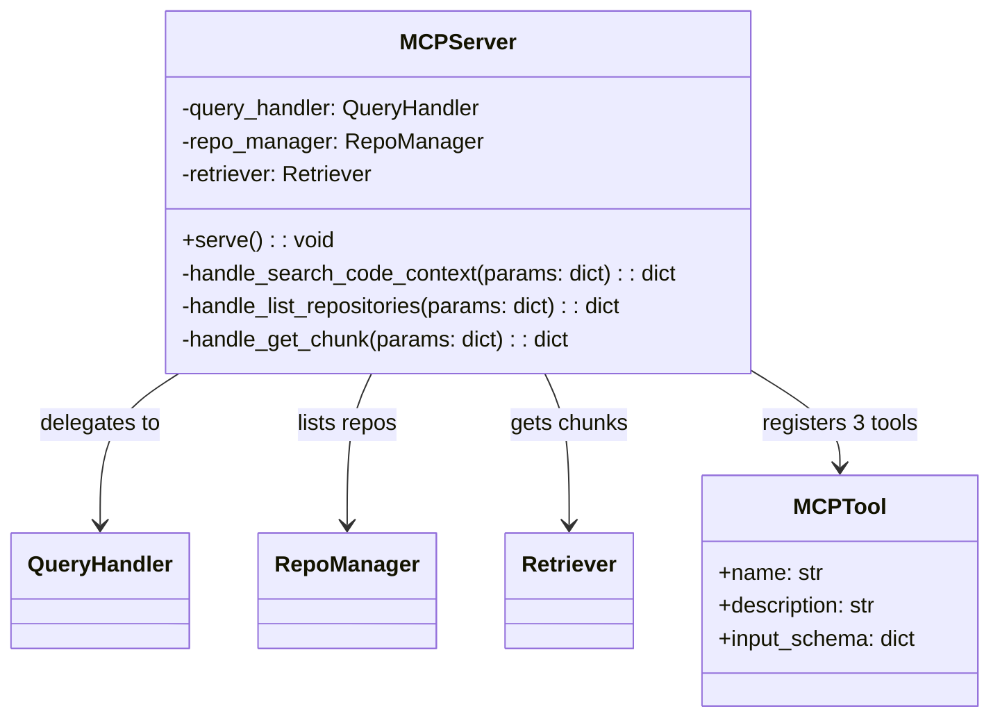
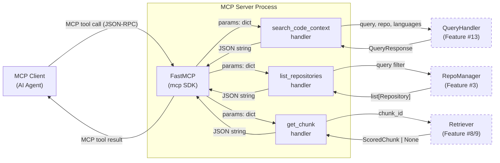
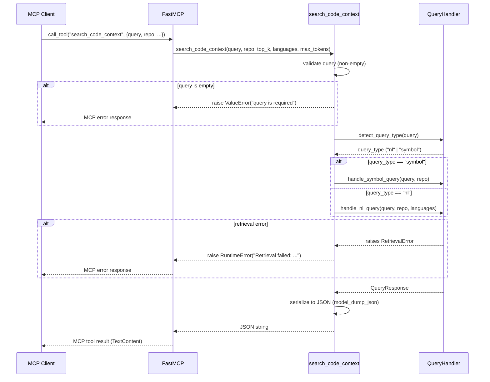
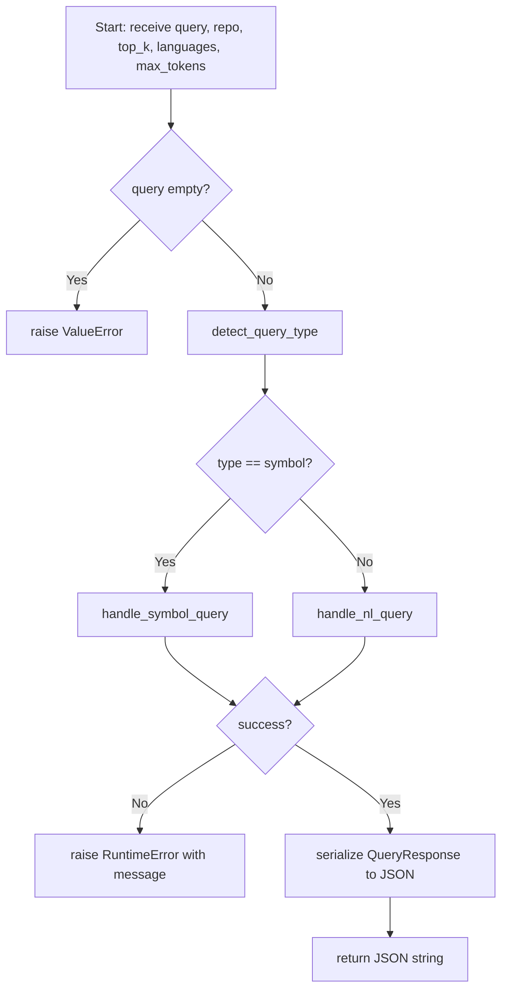

# Feature Detailed Design: MCP Server (Feature #18)

**Date**: 2026-03-22
**Feature**: #18 — MCP Server
**Priority**: high
**Dependencies**: #13 (Query Handler)
**Design Reference**: docs/plans/2026-03-21-code-context-retrieval-design.md § 4.3
**SRS Reference**: FR-016

## Context

The MCP Server is a standalone process that exposes the code context retrieval system to AI agents via the Model Context Protocol. It registers three tools (`search_code_context`, `list_repositories`, `get_chunk`) and delegates to the same `QueryHandler` used by the REST API, ensuring consistent behavior across both interfaces.

## Design Alignment

### From §4.3 — Class Diagram



### From §4.3.4 — Tool Definitions

| Tool | Parameters | Description |
|------|-----------|-------------|
| `search_code_context` | `query` (required), `repo` (optional), `top_k` (optional, default 3), `languages` (optional), `max_tokens` (optional, default 5000) | Search code + documentation context. Returns dual-list response. |
| `list_repositories` | `query` (optional) | List indexed repositories with optional fuzzy match filter. |
| `get_chunk` | `chunk_id` (required) | Get full content of a specific chunk by ID. Bypasses truncation. |

### From §4.3.5 — Design Notes

- Uses `mcp` Python SDK (FastMCP) to register tools
- Runs as separate process (stdio transport)
- Shares same `QueryHandler` and `RepoManager` code
- MCP response wraps same JSON structure as REST API
- `list_repositories` respects API key repo access control (deferred — no auth in MCP v1)

- **Key classes**: `MCPServer` (new) — wraps FastMCP, registers tools, delegates to existing services
- **Interaction flow**: MCP client → FastMCP → MCPServer handler → QueryHandler/RepoManager/Retriever → response
- **Third-party deps**: `mcp` SDK 1.9.0 (already installed)
- **Deviations**: None. Using FastMCP high-level API (decorator-based tool registration) per SDK docs, which is the recommended approach. The design's class diagram shows an `MCPServer` wrapper class, but the implementation will use `FastMCP` directly with module-level functions since FastMCP's decorator pattern doesn't require a wrapper class — the tool functions themselves are the handlers.

## SRS Requirement

### FR-016: MCP Server

**Priority**: Must
**EARS**: The system shall implement an MCP server that exposes a `search_code_context` tool, allowing AI agents to submit queries and receive structured context results via the Model Context Protocol.
**Acceptance Criteria**:
- Given an MCP client calling the `search_code_context` tool with parameters `{query: "spring webclient timeout", repo: "spring-framework", top_k: 3}`, when the tool executes, then the system shall return structured context results identical in content to the REST API response.
- Given an MCP client calling the tool without the optional `repo` parameter, when executed, then the system shall search across all indexed repositories.
- Given an MCP tool call with invalid parameters (missing required `query` field), then the system shall return an MCP error response with a descriptive message.
- Given an internal retrieval failure during MCP tool execution, then the system shall return an MCP error response rather than crashing the MCP connection.

## Component Data-Flow Diagram



## Interface Contract

| Method | Signature | Preconditions | Postconditions | Raises |
|--------|-----------|---------------|----------------|--------|
| `create_mcp_server` | `create_mcp_server(query_handler: QueryHandler, session_factory, es_client) -> FastMCP` | QueryHandler is initialized; session_factory and es_client are valid | Returns configured FastMCP with 3 tools registered | None |
| `search_code_context` | `search_code_context(query: str, repo: str \| None, top_k: int, languages: list[str] \| None, max_tokens: int) -> str` | `query` is non-empty string | Returns JSON string with `query`, `query_type`, `code_results`, `doc_results` keys matching REST format | Returns MCP error on empty query; returns MCP error on internal retrieval failure |
| `list_repositories` | `list_repositories(query: str \| None) -> str` | None (query is optional filter) | Returns JSON array of repo objects with `id`, `name`, `url`, `default_branch`, `indexed_branch`, `last_indexed_at`, `status` | Returns MCP error on DB failure |
| `get_chunk` | `get_chunk(chunk_id: str) -> str` | `chunk_id` is non-empty string | Returns JSON with full chunk content (no truncation) | Returns MCP error if chunk_id not found; returns MCP error on empty chunk_id |

**Design rationale**:
- `create_mcp_server` is a factory function (not a class) since FastMCP's decorator pattern makes a wrapper class unnecessary
- Tool handlers return JSON strings rather than dicts because MCP TextContent is the standard return format
- `max_tokens` defaults to 5000 to cap response size for agent context window budget
- `top_k` defaults to 3 per CON-012

## Internal Sequence Diagram



## Algorithm / Core Logic

### search_code_context

#### Flow Diagram



#### Pseudocode

```
FUNCTION search_code_context(query: str, repo: str|None, top_k: int, languages: list[str]|None, max_tokens: int) -> str
  // Step 1: Validate input
  IF query is empty or whitespace THEN raise ValueError("query is required")

  // Step 2: Detect query type using existing QueryHandler
  query_type = query_handler.detect_query_type(query)

  // Step 3: Dispatch to appropriate handler
  TRY
    IF query_type == "symbol" THEN
      response = AWAIT query_handler.handle_symbol_query(query, repo)
    ELSE
      response = AWAIT query_handler.handle_nl_query(query, repo, languages)
    END IF
  CATCH RetrievalError AS e
    raise RuntimeError(f"Retrieval failed: {e}")
  CATCH ValidationError AS e
    raise ValueError(str(e))
  END TRY

  // Step 4: Serialize response to JSON
  RETURN response.model_dump_json(by_alias=True)
END
```

#### Boundary Decisions

| Parameter | Min | Max | Empty/Null | At boundary |
|-----------|-----|-----|------------|-------------|
| `query` | 1 char | unbounded | raise ValueError | single char accepted |
| `repo` | 1 char | unbounded | None → search all repos | single char accepted |
| `top_k` | 1 | unbounded | use default (3) | top_k=1 returns 1 result |
| `languages` | empty list | 6 languages | None → no filter | empty list → no filter |
| `max_tokens` | 1 | unbounded | use default (5000) | max_tokens=1 → truncated results |

#### Error Handling

| Condition | Detection | Response | Recovery |
|-----------|-----------|----------|----------|
| Empty query | `not query or not query.strip()` | ValueError("query is required") | MCP SDK converts to error response |
| Invalid language | ValidationError from QueryHandler | ValueError with message | MCP SDK converts to error response |
| Retrieval failure | RetrievalError from QueryHandler | RuntimeError("Retrieval failed: ...") | MCP SDK converts to error response, connection stays alive |
| DB connection failure | Exception from session | RuntimeError with message | MCP SDK converts to error response |

### list_repositories

#### Pseudocode

```
FUNCTION list_repositories(query: str|None) -> str
  // Step 1: Create DB session and RepoManager
  session = session_factory()
  TRY
    repo_manager = RepoManager(session)
    repos = AWAIT repo_manager.list_repos()

    // Step 2: Optional fuzzy filter by name/URL
    IF query is not None AND query.strip() != "" THEN
      query_lower = query.lower()
      repos = [r for r in repos IF query_lower IN r.name.lower() OR query_lower IN r.url.lower()]
    END IF

    // Step 3: Serialize to JSON array
    result = [{
      "id": str(r.id),
      "name": r.name,
      "url": r.url,
      "default_branch": r.default_branch,
      "indexed_branch": r.indexed_branch,
      "last_indexed_at": r.last_indexed_at.isoformat() if r.last_indexed_at else None,
      "status": r.status
    } for r in repos]

    RETURN json.dumps(result)
  FINALLY
    AWAIT session.close()
  END TRY
END
```

#### Error Handling

| Condition | Detection | Response | Recovery |
|-----------|-----------|----------|----------|
| DB failure | Exception from session_factory or query | RuntimeError("Failed to list repositories: ...") | MCP error response |

### get_chunk

#### Pseudocode

```
FUNCTION get_chunk(chunk_id: str) -> str
  // Step 1: Validate input
  IF chunk_id is empty or whitespace THEN raise ValueError("chunk_id is required")

  // Step 2: Search ES for chunk by ID
  TRY
    result = AWAIT es_client.get(index="code_chunks", id=chunk_id)
    IF result is None THEN
      result = AWAIT es_client.get(index="doc_chunks", id=chunk_id)
    END IF
  CATCH Exception AS e
    raise RuntimeError(f"Failed to retrieve chunk: {e}")
  END TRY

  // Step 3: Check found
  IF result is None THEN raise ValueError(f"Chunk not found: {chunk_id}")

  // Step 4: Return full content (no truncation)
  RETURN json.dumps(result["_source"])
END
```

#### Boundary Decisions

| Parameter | Min | Max | Empty/Null | At boundary |
|-----------|-----|-----|------------|-------------|
| `chunk_id` | 1 char | unbounded | raise ValueError | single char → likely not found |

#### Error Handling

| Condition | Detection | Response | Recovery |
|-----------|-----------|----------|----------|
| Empty chunk_id | `not chunk_id or not chunk_id.strip()` | ValueError("chunk_id is required") | MCP error response |
| Chunk not found | ES returns None for both indexes | ValueError("Chunk not found: {chunk_id}") | MCP error response |
| ES failure | Exception from es_client | RuntimeError("Failed to retrieve chunk: ...") | MCP error response |

## State Diagram

> N/A — stateless feature. The MCP server is a request-response process with no managed object lifecycle.

## Test Inventory

| ID | Category | Traces To | Input / Setup | Expected | Kills Which Bug? |
|----|----------|-----------|---------------|----------|-----------------|
| A1 | happy path | VS-1, FR-016 AC-1 | `search_code_context(query="spring webclient timeout", repo="spring-framework")` with mocked QueryHandler returning sample QueryResponse | JSON string with `query`, `query_type`, `code_results`, `doc_results` keys | Missing serialization or wrong response format |
| A2 | happy path | VS-2, FR-016 AC-2 | `list_repositories()` with mocked session returning 2 repos | JSON array with 2 repo objects containing all 7 fields | Missing repo serialization fields |
| A3 | happy path | VS-3, FR-016 AC-2 | `search_code_context(query="timeout")` (no repo param) with mocked QueryHandler | JSON response — QueryHandler called with repo=None | Passing empty string instead of None |
| A4 | happy path | VS-1 | `search_code_context(query="MyClass.method")` — symbol query detected | QueryHandler.handle_symbol_query called (not handle_nl_query) | Wrong query type dispatch |
| A5 | happy path | — | `get_chunk(chunk_id="abc123")` with mocked ES returning chunk doc | JSON with full chunk content | Missing get_chunk implementation |
| A6 | happy path | — | `list_repositories(query="spring")` with 3 repos, 1 matching | JSON array with 1 repo | Missing fuzzy filter |
| B1 | error | VS-4, FR-016 AC-3 | `search_code_context(query="")` | ValueError raised with "query is required" | Missing input validation |
| B2 | error | FR-016 AC-4 | `search_code_context(query="test")` with QueryHandler raising RetrievalError | RuntimeError raised with "Retrieval failed" | Unhandled exception crashes connection |
| B3 | error | §Interface Contract | `get_chunk(chunk_id="")` | ValueError raised with "chunk_id is required" | Missing chunk_id validation |
| B4 | error | §Interface Contract | `get_chunk(chunk_id="nonexistent")` with ES returning None | ValueError raised with "Chunk not found" | Missing not-found check |
| B5 | error | FR-016 AC-4 | `list_repositories()` with session raising Exception | RuntimeError raised with "Failed to list" | Unhandled DB error |
| B6 | error | §Interface Contract | `search_code_context(query="test")` with QueryHandler raising ValidationError | ValueError raised with validation message | Missing ValidationError handling |
| C1 | boundary | §Algorithm boundary | `search_code_context(query=" ")` (whitespace only) | ValueError raised | Whitespace not treated as empty |
| C2 | boundary | §Algorithm boundary | `get_chunk(chunk_id=" ")` (whitespace only) | ValueError raised | Whitespace not treated as empty |
| C3 | boundary | §Algorithm boundary | `list_repositories(query="")` (empty string filter) | Returns all repos (no filter applied) | Empty string treated as filter |
| C4 | boundary | §Algorithm boundary | `search_code_context(query="x")` (single char) | Accepted, handler called | Off-by-one in length check |
| C5 | boundary | §Algorithm boundary | `list_repositories(query="SPRING")` (case-insensitive) | Returns repos matching "spring" | Case-sensitive filter |

**Negative ratio**: 11/16 = 69% (≥ 40% ✓)

## Tasks

### Task 1: Write failing tests
**Files**: `tests/test_mcp_server.py`
**Steps**:
1. Create test file with imports for `pytest`, `asyncio`, `unittest.mock`, `json`
2. Write test functions for each row in Test Inventory (§7):
   - Test A1: Mock QueryHandler, call search_code_context, assert JSON response format
   - Test A2: Mock session with repos, call list_repositories, assert JSON array structure
   - Test A3: Call search_code_context without repo, assert QueryHandler called with repo=None
   - Test A4: Mock detect_query_type returning "symbol", assert handle_symbol_query called
   - Test A5: Mock ES client, call get_chunk, assert full content returned
   - Test A6: Mock session with 3 repos, call list_repositories with query="spring", assert 1 result
   - Test B1: Call search_code_context with empty query, assert ValueError
   - Test B2: Mock QueryHandler raising RetrievalError, assert RuntimeError
   - Test B3: Call get_chunk with empty string, assert ValueError
   - Test B4: Mock ES returning None, assert ValueError with "not found"
   - Test B5: Mock session raising Exception, assert RuntimeError
   - Test B6: Mock QueryHandler raising ValidationError, assert ValueError
   - Test C1: Call search_code_context with whitespace, assert ValueError
   - Test C2: Call get_chunk with whitespace, assert ValueError
   - Test C3: Call list_repositories with empty string query, assert all repos returned
   - Test C4: Call search_code_context with "x", assert handler called
   - Test C5: Call list_repositories with "SPRING", assert case-insensitive match
3. Run: `pytest tests/test_mcp_server.py -v`
4. **Expected**: All tests FAIL (ImportError — module doesn't exist yet)

### Task 2: Implement minimal code
**Files**: `src/query/mcp_server.py`
**Steps**:
1. Create `create_mcp_server(query_handler, session_factory, es_client) -> FastMCP` factory
2. Register `search_code_context` tool with FastMCP decorator:
   - Validate query non-empty
   - Call detect_query_type → dispatch to handle_nl_query or handle_symbol_query
   - Catch RetrievalError → RuntimeError, ValidationError → ValueError
   - Return response.model_dump_json()
3. Register `list_repositories` tool:
   - Create session, query repos via RepoManager
   - Apply optional fuzzy filter (case-insensitive)
   - Serialize repo list to JSON
4. Register `get_chunk` tool:
   - Validate chunk_id non-empty
   - Query ES code_chunks then doc_chunks indexes
   - Return full source JSON or raise ValueError if not found
5. Run: `pytest tests/test_mcp_server.py -v`
6. **Expected**: All tests PASS

### Task 3: Coverage Gate
1. Run: `pytest --cov=src --cov-branch --cov-report=term-missing tests/`
2. Check: line ≥ 90%, branch ≥ 80%
3. Record output

### Task 4: Refactor
1. Extract common validation logic if repeated across handlers
2. Ensure consistent error message formatting
3. Run full test suite — all tests pass

### Task 5: Mutation Gate
1. Run: `mutmut run --paths-to-mutate=src/query/mcp_server.py`
2. Check: mutation score ≥ 80%
3. If below: add/strengthen assertions

### Task 6: Create example
1. Create `examples/18-mcp-server.py`
2. Update `examples/README.md`
3. Run example to verify

## Verification Checklist
- [x] All verification_steps traced to Interface Contract postconditions
- [x] All verification_steps traced to Test Inventory rows (VS-1→A1, VS-2→A2, VS-3→A3, VS-4→B1)
- [x] Algorithm pseudocode covers all non-trivial methods (search_code_context, list_repositories, get_chunk)
- [x] Boundary table covers all algorithm parameters
- [x] Error handling table covers all Raises entries
- [x] Test Inventory negative ratio >= 40% (69%)
- [x] Every skipped section has explicit "N/A — [reason]" (State Diagram)
