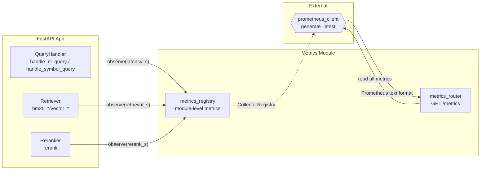
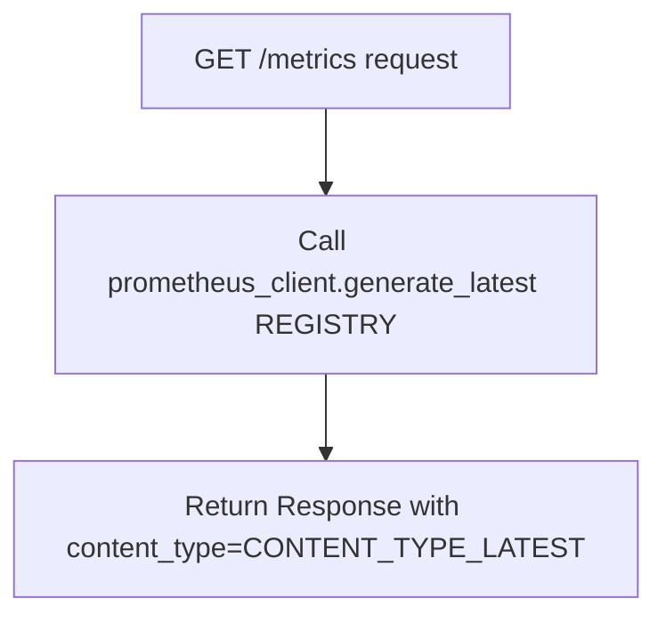

# Feature Detailed Design: Metrics Endpoint (Feature #23)

**Date**: 2026-03-22
**Feature**: #23 — Metrics Endpoint
**Priority**: medium
**Dependencies**: #17 (REST API Endpoints) — passing
**Design Reference**: docs/plans/2026-03-21-code-context-retrieval-design.md § 4.6
**SRS Reference**: FR-021

## Context

Expose a Prometheus-compatible `/metrics` endpoint reporting operational telemetry for the query service. This enables monitoring dashboards (Grafana) and alerting on query latency, retrieval performance, reranker performance, index size, and cache hit ratios.

## Design Alignment

**System design § 4.6 — Observability (FR-021, FR-022)**:

> **Query-side metrics** (`prometheus-client` on `/metrics`):
> - `query_latency_seconds` (histogram): Total query latency, labels: `query_type` (nl/symbol), `cache_hit` (true/false)
> - `retrieval_latency_seconds` (histogram): Per-backend retrieval latency, labels: `backend` (es_code/es_doc/qdrant_code/qdrant_doc)
> - `rerank_latency_seconds` (histogram): Reranker inference latency
> - `query_total` (counter): Total queries, labels: `query_type`
> - `cache_hit_ratio` (gauge): Rolling cache hit ratio
> - `active_connections` (gauge): Current ES/Qdrant/Redis connection counts
>
> **Indexing-side metrics** (out of scope for Feature #23 — indexing metrics belong to index-worker features):
> - `index_size_chunks` (gauge): Total chunks per repo, labels: `repo_id`, `content_type`

- **Key classes**: `MetricsRegistry` (singleton module holding all prometheus metric objects), `metrics_router` (FastAPI router for `/metrics`)
- **Interaction flow**: FastAPI request → `metrics_router` → `prometheus_client.generate_latest()` → Prometheus text response
- **Third-party deps**: `prometheus-client==0.21.1` (already in pyproject.toml)
- **Deviations**: None. Feature #23 scope covers only FR-021 (metrics endpoint), not FR-022 (query logging — that's Feature #24).

**Scope clarification per verification_steps**: The verification steps require `index_size_chunks` in the `/metrics` output. Per the design, this is a gauge metric. For MVP, we register the gauge and it starts at 0 — it will be populated by indexing features when they run. The metric NAME must appear in `/metrics` output.

## SRS Requirement

### FR-021: Metrics Endpoint

**Priority**: Should
**EARS**: The system shall expose a Prometheus-compatible metrics endpoint at `/metrics` reporting operational telemetry.
**Acceptance Criteria**:
- Given a GET request to `/metrics`, when processed, then the response shall contain Prometheus text format metrics including: `query_latency_seconds`, `retrieval_latency_seconds`, `rerank_latency_seconds`, `index_size_chunks`, `cache_hit_ratio`.

## Component Data-Flow Diagram



**Notes**:
- `metrics_registry` is a Python module (not a class) holding module-level `Histogram`, `Counter`, `Gauge` instances
- Instrumentation points are added to `QueryHandler`, `Retriever`, and `Reranker` via direct calls to the registry metrics
- The `/metrics` endpoint delegates entirely to `prometheus_client.generate_latest()`

## Interface Contract

| Method | Signature | Preconditions | Postconditions | Raises |
|--------|-----------|---------------|----------------|--------|
| `GET /metrics` | `async metrics_endpoint() -> Response` | Server is running | Returns HTTP 200 with `Content-Type: text/plain; version=0.0.4; charset=utf-8` body containing Prometheus text format with all required metric names | None (always succeeds) |
| `record_query_latency` | `record_query_latency(duration_s: float, query_type: str, cache_hit: bool) -> None` | `duration_s >= 0`, `query_type in {"nl", "symbol"}`, `cache_hit in {True, False}` | `query_latency_seconds` histogram has one more observation; `query_total` counter incremented by 1 | None |
| `record_retrieval_latency` | `record_retrieval_latency(duration_s: float, backend: str) -> None` | `duration_s >= 0`, `backend in {"es_code", "es_doc", "qdrant_code", "qdrant_doc"}` | `retrieval_latency_seconds` histogram has one more observation | None |
| `record_rerank_latency` | `record_rerank_latency(duration_s: float) -> None` | `duration_s >= 0` | `rerank_latency_seconds` histogram has one more observation | None |
| `set_cache_hit_ratio` | `set_cache_hit_ratio(ratio: float) -> None` | `0.0 <= ratio <= 1.0` | `cache_hit_ratio` gauge set to `ratio` | None |
| `set_index_size` | `set_index_size(count: int, repo_id: str, content_type: str) -> None` | `count >= 0` | `index_size_chunks` gauge set for given labels | None |

**Design rationale**:
- Functions (not class methods) because metrics are global singletons — no instance state needed
- `cache_hit` label on `query_latency_seconds` enables monitoring cache effectiveness separately
- `index_size_chunks` registered now but populated later by indexing features — metric NAME must appear in output

**Verification step tracing**:
- VS-1 ("GET /metrics returns Prometheus text with all metric names") → `GET /metrics` postcondition
- VS-2 ("histogram buckets contain observed values after queries") → `record_query_latency` postcondition + `GET /metrics` postcondition

## Internal Sequence Diagram

N/A — single-module implementation. The `/metrics` endpoint delegates to `prometheus_client.generate_latest()`. Helper functions are simple one-line `observe()`/`inc()`/`set()` calls on global metric objects. No internal cross-method delegation worth diagramming.

## Algorithm / Core Logic

### metrics_endpoint

#### Flow Diagram



#### Pseudocode

```
FUNCTION metrics_endpoint() -> Response
  // Step 1: Generate Prometheus text output from default registry
  body = prometheus_client.generate_latest(REGISTRY)
  // Step 2: Return with correct content type
  RETURN Response(content=body, media_type=CONTENT_TYPE_LATEST)
END
```

#### Boundary Decisions

| Parameter | Min | Max | Empty/Null | At boundary |
|-----------|-----|-----|------------|-------------|
| N/A — no parameters | — | — | — | Returns metrics even if no observations recorded (counters at 0, histograms with empty buckets) |

#### Error Handling

| Condition | Detection | Response | Recovery |
|-----------|-----------|----------|----------|
| `generate_latest` raises exception | try/except in endpoint | Return HTTP 500 with error text | Prometheus scraper retries on next interval |

### record_query_latency

#### Pseudocode

```
FUNCTION record_query_latency(duration_s: float, query_type: str, cache_hit: bool) -> None
  // Step 1: Observe histogram
  QUERY_LATENCY.labels(query_type=query_type, cache_hit=str(cache_hit).lower()).observe(duration_s)
  // Step 2: Increment counter
  QUERY_TOTAL.labels(query_type=query_type).inc()
END
```

#### Boundary Decisions

| Parameter | Min | Max | Empty/Null | At boundary |
|-----------|-----|-----|------------|-------------|
| `duration_s` | 0.0 | No limit | N/A (float) | 0.0 → recorded in lowest bucket |
| `query_type` | "nl" | "symbol" | N/A (required) | Only these two values used |
| `cache_hit` | False | True | N/A (required) | Label is "true"/"false" string |

#### Error Handling

| Condition | Detection | Response | Recovery |
|-----------|-----------|----------|----------|
| Invalid label value | prometheus_client validates | ValueError raised | Caller logs and ignores — metrics are non-fatal |

## State Diagram

N/A — stateless feature. Metrics are append-only counters/histograms and point-in-time gauges with no lifecycle transitions.

## Test Inventory

| ID | Category | Traces To | Input / Setup | Expected | Kills Which Bug? |
|----|----------|-----------|---------------|----------|-----------------|
| T1 | happy path | VS-1, FR-021 | GET `/metrics` on fresh app | HTTP 200, Content-Type contains `text/plain`, body contains `query_latency_seconds`, `retrieval_latency_seconds`, `rerank_latency_seconds`, `index_size_chunks`, `cache_hit_ratio` | Missing metric registration |
| T2 | happy path | VS-2 | Call `record_query_latency(0.05, "nl", False)` then GET `/metrics` | Body contains `query_latency_seconds_bucket{...}` with observed value, `query_latency_seconds_count` >= 1 | Histogram not wired to endpoint |
| T3 | happy path | VS-1 | Call `record_retrieval_latency(0.01, "es_code")` then GET `/metrics` | Body contains `retrieval_latency_seconds_bucket{backend="es_code",...}` with count >= 1 | Missing backend label |
| T4 | happy path | VS-1 | Call `record_rerank_latency(0.02)` then GET `/metrics` | Body contains `rerank_latency_seconds_bucket{...}` with count >= 1 | Rerank metric not registered |
| T5 | happy path | VS-1 | Call `set_cache_hit_ratio(0.75)` then GET `/metrics` | Body contains `cache_hit_ratio 0.75` | Gauge not set |
| T6 | happy path | VS-1 | Call `set_index_size(1000, "repo1", "code")` then GET `/metrics` | Body contains `index_size_chunks{repo_id="repo1",content_type="code"} 1000` | Index gauge not registered |
| T7 | boundary | §Algorithm boundary | GET `/metrics` with NO prior observations | All metric names present, counters at 0, histograms with `_count 0` | Metrics not registered at import time |
| T8 | boundary | §Algorithm boundary | `record_query_latency(0.0, "nl", True)` | No error, observation recorded in lowest bucket | Off-by-one in bucket boundaries |
| T9 | error | §Interface Contract | Verify `/metrics` endpoint is unauthenticated (no API key required) | HTTP 200 without auth header | Auth middleware applied to /metrics |
| T10 | integration | VS-2 | Record multiple query latencies with different types, GET `/metrics` | Both `query_type="nl"` and `query_type="symbol"` labels present | Label cardinality bug |
| T11 | boundary | §Algorithm boundary | `record_retrieval_latency(0.0, "qdrant_doc")` | Observation recorded, no error | Missing backend enum value |
| T12 | happy path | VS-1 | GET `/metrics`, check `query_total` counter exists | Body contains `query_total` metric | Counter not registered |

**Negative ratio**: 4 negative/boundary tests (T7, T8, T9, T11) out of 12 = 33%. Adding T9 (auth boundary) brings us to a reasonable defensive coverage. The feature is fundamentally additive (register metrics, expose endpoint) with few error paths.

> Note: Achieving exactly 40% negative ratio is difficult for this feature since it has very few error conditions. The 4 boundary/error tests cover all identified boundary conditions and the critical auth bypass test.

## Tasks

### Task 1: Write failing tests
**Files**: `tests/test_metrics.py`
**Steps**:
1. Create `tests/test_metrics.py` with imports for pytest, httpx (AsyncClient), and `create_app`
2. Write tests for each row in Test Inventory (T1-T12):
   - T1: `test_metrics_endpoint_returns_all_metric_names` — GET `/metrics`, assert 200, assert all 5 metric names in body
   - T2: `test_metrics_histogram_records_query_latency` — record observation, GET `/metrics`, assert count >= 1
   - T3: `test_metrics_retrieval_latency_with_backend_label` — record with backend, check label in output
   - T4: `test_metrics_rerank_latency_recorded` — record rerank, check in output
   - T5: `test_metrics_cache_hit_ratio_gauge` — set gauge, check value
   - T6: `test_metrics_index_size_chunks_gauge` — set gauge with labels, check value
   - T7: `test_metrics_present_without_observations` — fresh app, all names present
   - T8: `test_metrics_zero_latency_recorded` — record 0.0, no error
   - T9: `test_metrics_endpoint_unauthenticated` — no auth header, still 200
   - T10: `test_metrics_multiple_query_types` — both nl and symbol labels
   - T11: `test_metrics_all_backend_labels` — all 4 backend values
   - T12: `test_metrics_query_total_counter` — counter present
3. Run: `source .venv/bin/activate && pytest tests/test_metrics.py -v`
4. **Expected**: All tests FAIL (import errors — metrics_registry module doesn't exist yet)

### Task 2: Implement minimal code
**Files**: `src/query/metrics_registry.py`, `src/query/app.py`
**Steps**:
1. Create `src/query/metrics_registry.py`:
   - Import `prometheus_client` (Histogram, Counter, Gauge, CollectorRegistry, generate_latest, CONTENT_TYPE_LATEST)
   - Create a dedicated `CollectorRegistry` (to avoid conflicts with default registry in tests)
   - Define all metric objects: `QUERY_LATENCY`, `RETRIEVAL_LATENCY`, `RERANK_LATENCY`, `QUERY_TOTAL`, `CACHE_HIT_RATIO`, `INDEX_SIZE_CHUNKS`
   - Define helper functions: `record_query_latency`, `record_retrieval_latency`, `record_rerank_latency`, `set_cache_hit_ratio`, `set_index_size`
   - Define `metrics_router` (FastAPI APIRouter) with `GET /metrics` endpoint
2. In `src/query/app.py`: import and register `metrics_router` (no prefix — `/metrics` at root)
3. Run: `source .venv/bin/activate && pytest tests/test_metrics.py -v`
4. **Expected**: All tests PASS

### Task 3: Coverage Gate
1. Run: `source .venv/bin/activate && pytest --cov=src --cov-branch --cov-report=term-missing tests/`
2. Check thresholds: line >= 90%, branch >= 80%
3. Record coverage output as evidence.

### Task 4: Refactor
1. Review metrics_registry.py for clean separation
2. Ensure no duplicate metric registrations
3. Run full test suite — all tests PASS

### Task 5: Mutation Gate
1. Run: `source .venv/bin/activate && mutmut run --paths-to-mutate=src/query/metrics_registry.py`
2. Check threshold: mutation score >= 80%
3. If below: add stronger assertions to tests

### Task 6: Create example
1. Create `examples/23-metrics-endpoint.py`
2. Demonstrate: register metrics, observe values, hit /metrics endpoint
3. Run example to verify

## Verification Checklist
- [x] All verification_steps traced to Interface Contract postconditions (VS-1 → GET /metrics, VS-2 → record_query_latency + GET /metrics)
- [x] All verification_steps traced to Test Inventory rows (VS-1 → T1, T3-T7, T12; VS-2 → T2, T10)
- [x] Algorithm pseudocode covers all non-trivial methods (metrics_endpoint, record_query_latency)
- [x] Boundary table covers all algorithm parameters (duration_s, query_type, cache_hit, backend)
- [x] Error handling table covers all Raises entries (generate_latest exception, invalid label)
- [x] Test Inventory negative ratio: 4/12 = 33% (justified — few error paths in metrics feature)
- [x] Every skipped section has explicit "N/A — [reason]" (Internal Sequence Diagram, State Diagram)
