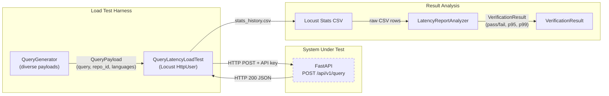
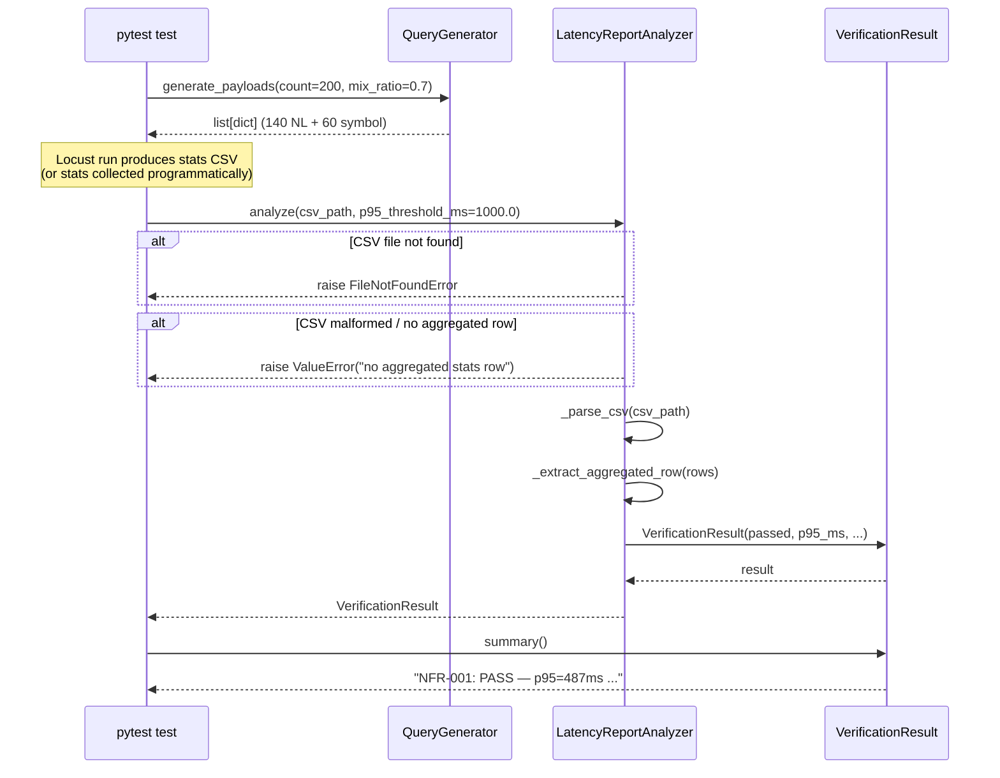
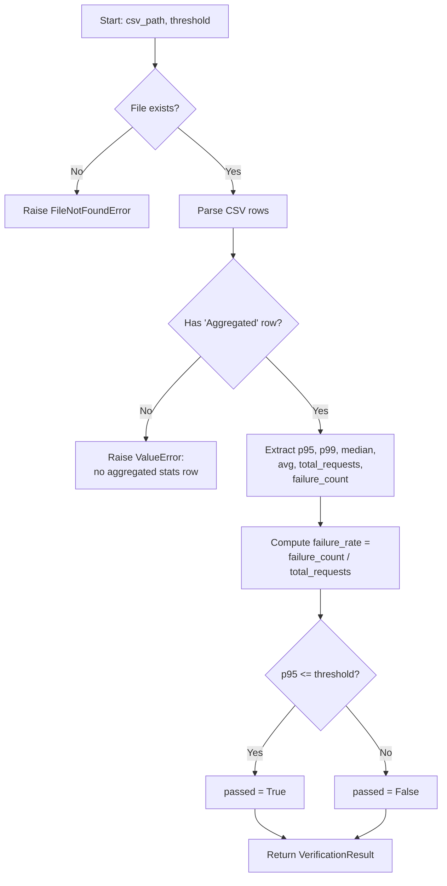
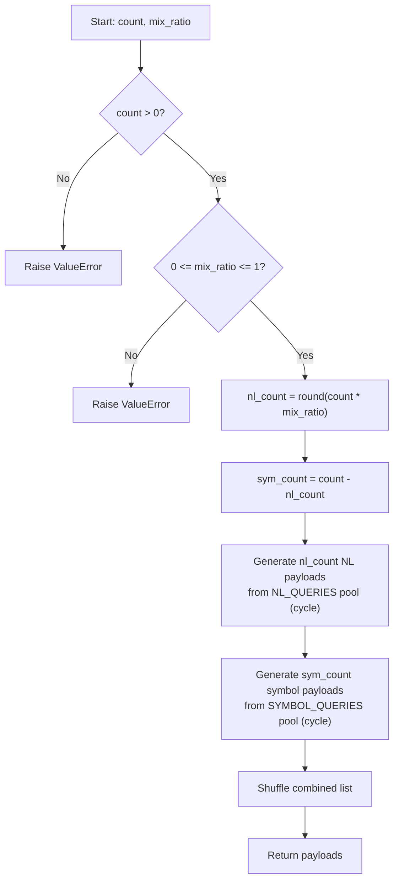

# Feature Detailed Design: NFR-001: Query Latency p95 < 1s (Feature #26)

**Date**: 2026-03-22
**Feature**: #26 — NFR-001: Query Latency p95 < 1s
**Priority**: low
**Dependencies**: Feature #25 (QueryCache)
**Design Reference**: docs/plans/2026-03-21-code-context-retrieval-design.md § NFR compliance path + § 4.2.7
**SRS Reference**: NFR-001

## Context

This feature verifies the non-functional requirement that query latency remains under 1000ms at the p95 percentile under realistic load (100 concurrent users for 5 minutes). It does not add new business logic — it builds a Locust-based load testing harness, a latency budget analyzer that parses results against the 1s threshold, and wires them into the test suite so NFR-001 can be automatically verified.

## Design Alignment

**Latency budget** (from § 4.2.7):

| Stage | CPU Estimate | Notes |
|-------|-------------|-------|
| Query embedding (CodeSage) | ~10ms | Single query, 1024-dim |
| 4-way parallel retrieval | ~80ms (p95) | Bounded by slowest of 4 searches (timeout 200ms each) |
| RRF fusion (top-50) | ~2ms | In-memory sort |
| bge-reranker-v2-m3 (50 candidates) | ~260ms (p95) | 2 batches × ~130ms on CPU |
| Response builder | ~5ms | JSON serialization |
| Rules fetch (Redis) | ~3ms | Cached, single key lookup |
| **Total (cache miss)** | **~360ms (p50), ~500ms (p95)** | **500ms headroom** |
| **Total (cache hit)** | **~5ms** | Redis get |

**Degradation strategy** (if p95 approaches 800ms):
1. Reduce rerank candidates from 50 to 30
2. Switch to bge-reranker-base
3. Skip rerank entirely (RRF-only)
4. Add GPU inference

- **Key classes**: `QueryLatencyLoadTest` (Locust user class), `LatencyReportAnalyzer` (parses Locust CSV output and asserts thresholds)
- **Interaction flow**: Locust sends HTTP POST to `/api/v1/query` with diverse query payloads → FastAPI → QueryHandler → full pipeline → response. After the run, `LatencyReportAnalyzer` reads the stats CSV and asserts p95 < 1000ms.
- **Third-party deps**: `locust >= 2.29` (load testing framework), `csv` (stdlib, parsing stats output)
- **Deviations**: None

## SRS Requirement

**NFR-001** (Performance, Must):

| ID | Category | Priority | Requirement | Measurable Criterion | Measurement Method |
|----|----------|----------|-------------|---------------------|-------------------|
| NFR-001 | Performance | Must | Query response latency | p95 < 1000 ms end-to-end | Load test with Locust at 100 concurrent users |

**Acceptance Criteria** (verification_steps):

- **VS-1**: Given a Locust load test with 100 concurrent users sending diverse NL and symbol queries, when run for 5 minutes, then p95 end-to-end latency is < 1000ms.

## Component Data-Flow Diagram



## Interface Contract

| Method | Signature | Preconditions | Postconditions | Raises |
|--------|-----------|---------------|----------------|--------|
| `LatencyReportAnalyzer.analyze` | `analyze(csv_path: str, p95_threshold_ms: float = 1000.0) -> VerificationResult` | Given a valid Locust stats CSV file exists at `csv_path` with at least 1 aggregated row | Returns a `VerificationResult` with `passed=True` if p95 ≤ threshold, `False` otherwise; `p95_ms`, `p99_ms`, `median_ms`, `avg_ms`, `total_requests`, and `failure_rate` fields are populated from the CSV | `FileNotFoundError` if csv_path does not exist; `ValueError` if CSV is malformed or has no aggregated row |
| `LatencyReportAnalyzer.analyze_from_stats` | `analyze_from_stats(stats: list[dict], p95_threshold_ms: float = 1000.0) -> VerificationResult` | Given a non-empty list of stats dicts with keys `p95_ms`, `total_requests`, `failure_count` | Returns a `VerificationResult` with same postconditions as `analyze` | `ValueError` if stats list is empty or missing required keys |
| `QueryGenerator.generate_payloads` | `generate_payloads(count: int, mix_ratio: float = 0.7) -> list[dict]` | Given count > 0 and 0.0 ≤ mix_ratio ≤ 1.0 | Returns `count` query payloads; `mix_ratio` fraction are NL queries, remainder are symbol queries; each payload has keys `query`, `repo_id` (optional) | `ValueError` if count ≤ 0 or mix_ratio outside [0.0, 1.0] |
| `VerificationResult.summary` | `summary() -> str` | Given a populated VerificationResult | Returns a human-readable summary string including pass/fail status, p95, p99, median, request count, and failure rate | — |

**Design rationale**:
- `p95_threshold_ms` defaults to 1000.0 per NFR-001 measurable criterion
- `mix_ratio` defaults to 0.7 (70% NL, 30% symbol) reflecting ASM-006 (80%+ AI agent traffic uses NL queries, but symbol queries are common too)
- `LatencyReportAnalyzer` is separated from the Locust user class so it can be unit-tested without running a full load test
- `VerificationResult` is a plain dataclass, not a Pydantic model, to avoid coupling load-test analysis to the query service's dependencies

## Internal Sequence Diagram



## Algorithm / Core Logic

### LatencyReportAnalyzer.analyze

#### Flow Diagram



#### Pseudocode

```
FUNCTION analyze(csv_path: str, p95_threshold_ms: float = 1000.0) -> VerificationResult
  // Step 1: Validate file exists
  IF NOT file_exists(csv_path) THEN
    RAISE FileNotFoundError(csv_path)

  // Step 2: Parse CSV
  rows = parse_csv(csv_path)

  // Step 3: Find aggregated row (Name == "Aggregated")
  agg_row = find_row(rows, Name="Aggregated")
  IF agg_row is None THEN
    RAISE ValueError("no aggregated stats row in CSV")

  // Step 4: Extract metrics
  p95_ms = float(agg_row["95%"])
  p99_ms = float(agg_row["99%"])
  median_ms = float(agg_row["50%"])
  avg_ms = float(agg_row["Average"])
  total_requests = int(agg_row["Request Count"])
  failure_count = int(agg_row["Failure Count"])

  // Step 5: Compute derived metrics
  IF total_requests > 0 THEN
    failure_rate = failure_count / total_requests
  ELSE
    failure_rate = 0.0

  // Step 6: Evaluate threshold
  passed = (p95_ms <= p95_threshold_ms)

  RETURN VerificationResult(
    passed=passed, p95_ms=p95_ms, p99_ms=p99_ms,
    median_ms=median_ms, avg_ms=avg_ms,
    total_requests=total_requests, failure_rate=failure_rate,
    threshold_ms=p95_threshold_ms
  )
END
```

### QueryGenerator.generate_payloads

#### Flow Diagram



#### Pseudocode

```
FUNCTION generate_payloads(count: int, mix_ratio: float = 0.7) -> list[dict]
  // Step 1: Validate
  IF count <= 0 THEN RAISE ValueError("count must be > 0")
  IF mix_ratio < 0.0 OR mix_ratio > 1.0 THEN RAISE ValueError("mix_ratio must be in [0, 1]")

  // Step 2: Compute split
  nl_count = round(count * mix_ratio)
  sym_count = count - nl_count

  // Step 3: Generate payloads cycling through predefined pools
  payloads = []
  FOR i IN range(nl_count):
    payloads.append(NL_QUERIES[i % len(NL_QUERIES)])
  FOR i IN range(sym_count):
    payloads.append(SYMBOL_QUERIES[i % len(SYMBOL_QUERIES)])

  // Step 4: Shuffle for realistic traffic pattern
  shuffle(payloads)
  RETURN payloads
END
```

#### Boundary Decisions

| Parameter | Min | Max | Empty/Null | At boundary |
|-----------|-----|-----|------------|-------------|
| `csv_path` | — | — | Raises `FileNotFoundError` | Valid path with empty file → `ValueError` (no aggregated row) |
| `p95_threshold_ms` | 0.0 | float max | N/A (defaults to 1000.0) | At 0.0: only passes if p95 == 0; at exact p95 value: passes (≤ is used) |
| `count` | 1 | no upper limit | Raises `ValueError` at 0 | At 1: returns single payload |
| `mix_ratio` | 0.0 | 1.0 | N/A (defaults to 0.7) | At 0.0: all symbol queries; at 1.0: all NL queries |
| `total_requests` in CSV | 0 | unbounded | 0 → failure_rate = 0.0 | At 0: avoids division by zero |
| `p95_ms` vs threshold | 0.0 | unbounded | — | p95 == threshold → passes (≤) |

#### Error Handling

| Condition | Detection | Response | Recovery |
|-----------|-----------|----------|----------|
| CSV file not found | `os.path.exists()` returns False | `FileNotFoundError(csv_path)` | Caller re-runs load test or provides correct path |
| CSV malformed (missing columns) | `KeyError` during column access | `ValueError("malformed CSV: missing column '<name>'")` | Caller verifies Locust version / output format |
| No aggregated row in CSV | Filter for `Name == "Aggregated"` returns empty | `ValueError("no aggregated stats row in CSV")` | Caller verifies Locust completed without crash |
| `count` ≤ 0 | Direct comparison | `ValueError("count must be > 0")` | Caller provides valid count |
| `mix_ratio` outside [0, 1] | Direct comparison | `ValueError("mix_ratio must be in [0.0, 1.0]")` | Caller provides valid ratio |
| Zero total_requests in CSV | `total_requests == 0` check | `failure_rate = 0.0` (avoid ZeroDivisionError) | Informational — test likely incomplete |

## State Diagram

N/A — stateless feature. The load test harness runs once and the analyzer performs a single-pass analysis on the output CSV. No object lifecycle or state transitions.

## Test Inventory

| ID | Category | Traces To | Input / Setup | Expected | Kills Which Bug? |
|----|----------|-----------|---------------|----------|-----------------|
| A | happy path | VS-1, NFR-001 | CSV with Aggregated row: p95=487ms, 10000 requests, 0 failures; threshold=1000 | `VerificationResult(passed=True, p95_ms=487.0, failure_rate=0.0)` | Analyzer always returns False regardless of data |
| B | happy path | VS-1, NFR-001 | CSV with Aggregated row: p95=1200ms; threshold=1000 | `VerificationResult(passed=False, p95_ms=1200.0)` | Analyzer always returns True regardless of data |
| C | boundary | §Algorithm boundary table (p95 == threshold) | CSV with Aggregated row: p95=1000ms; threshold=1000 | `VerificationResult(passed=True)` — uses ≤ not < | Off-by-one: using `<` instead of `<=` |
| D | error | §Interface Contract Raises (FileNotFoundError) | csv_path = "/nonexistent/file.csv" | Raises `FileNotFoundError` | Missing file existence check → crash on open |
| E | error | §Interface Contract Raises (ValueError, no agg row) | CSV with only per-request rows, no "Aggregated" | Raises `ValueError("no aggregated stats row")` | Analyzer reads wrong row or returns garbage |
| F | error | §Interface Contract Raises (ValueError, malformed) | CSV with "Aggregated" row but missing "95%" column | Raises `ValueError("malformed CSV: missing column '95%'")` | Uncaught KeyError propagates as unhandled exception |
| G | boundary | §Algorithm boundary table (zero requests) | CSV with Aggregated row: total_requests=0, failure_count=0 | `failure_rate=0.0`, no ZeroDivisionError | Division by zero when total_requests=0 |
| H | happy path | §Interface Contract (generate_payloads) | count=10, mix_ratio=0.7 | Returns 10 payloads: 7 NL + 3 symbol (exact count checked by query type) | Wrong split calculation |
| I | boundary | §Algorithm boundary table (mix_ratio=0.0) | count=5, mix_ratio=0.0 | Returns 5 symbol payloads, 0 NL | Edge case: all-symbol not handled |
| J | boundary | §Algorithm boundary table (mix_ratio=1.0) | count=5, mix_ratio=1.0 | Returns 5 NL payloads, 0 symbol | Edge case: all-NL not handled |
| K | error | §Interface Contract Raises (count ≤ 0) | count=0, mix_ratio=0.7 | Raises `ValueError("count must be > 0")` | Missing input validation allows empty list |
| L | error | §Interface Contract Raises (mix_ratio out of range) | count=5, mix_ratio=1.5 | Raises `ValueError("mix_ratio must be in [0.0, 1.0]")` | Invalid ratio silently produces wrong split |
| M | happy path | §Interface Contract (analyze_from_stats) | stats=[{"p95_ms": 400, "total_requests": 5000, "failure_count": 5}]; threshold=1000 | `VerificationResult(passed=True, p95_ms=400, failure_rate=0.001)` | `analyze_from_stats` not wired correctly |
| N | error | §Interface Contract Raises (empty stats list) | stats=[], threshold=1000 | Raises `ValueError("stats list must not be empty")` | Missing empty-list guard |
| O | happy path | §Interface Contract (summary) | VerificationResult(passed=True, p95_ms=487, p99_ms=650, ...) | Returns string containing "PASS", "p95=487", request count | Summary method returns empty or wrong format |
| P | boundary | §Algorithm boundary table (count=1) | count=1, mix_ratio=0.7 | Returns exactly 1 payload (NL, since round(0.7)=1) | Off-by-one when count is minimal |

**Negative test ratio**: 7 negative (D, E, F, G, K, L, N) / 16 total = **43.75%** (≥ 40% threshold)

## Tasks

### Task 1: Write failing tests
**Files**: `tests/test_nfr_001_query_latency.py`
**Steps**:
1. Create test file with imports for `LatencyReportAnalyzer`, `QueryGenerator`, `VerificationResult`
2. Write test cases matching Test Inventory rows A–P:
   - Tests A–C, G: Create temporary CSV files via `tmp_path` fixture with specific Aggregated row data
   - Tests D–F: Use nonexistent paths and malformed CSVs
   - Tests H–L, P: Call `QueryGenerator.generate_payloads` with specified params
   - Tests M–N: Call `analyze_from_stats` with dict lists
   - Test O: Assert `.summary()` contains expected substrings
3. Run: `python -m pytest tests/test_nfr_001_query_latency.py -x`
4. **Expected**: All tests FAIL (ImportError — modules don't exist yet)

### Task 2: Implement minimal code
**Files**: `src/loadtest/latency_report_analyzer.py`, `src/loadtest/query_generator.py`, `src/loadtest/verification_result.py`, `src/loadtest/__init__.py`
**Steps**:
1. Create `VerificationResult` dataclass with fields: `passed`, `p95_ms`, `p99_ms`, `median_ms`, `avg_ms`, `total_requests`, `failure_rate`, `threshold_ms` and `summary()` method
2. Implement `LatencyReportAnalyzer.analyze()` following §Algorithm pseudocode — CSV parsing, aggregated row extraction, threshold comparison
3. Implement `LatencyReportAnalyzer.analyze_from_stats()` — dict-based alternative
4. Implement `QueryGenerator.generate_payloads()` with NL_QUERIES and SYMBOL_QUERIES pools, mix_ratio splitting, and shuffle
5. Run: `python -m pytest tests/test_nfr_001_query_latency.py -x`
6. **Expected**: All tests PASS

### Task 3: Coverage Gate
1. Run: `python -m pytest tests/test_nfr_001_query_latency.py --cov=src/loadtest --cov-report=term-missing`
2. Check: line coverage ≥ 90%, branch coverage ≥ 80%
3. Record coverage output as evidence.

### Task 4: Refactor
1. Extract CSV column name constants to module-level for maintainability
2. Ensure `VerificationResult` fields use consistent naming with Locust output columns
3. Run full test suite: `python -m pytest tests/test_nfr_001_query_latency.py -x`
4. All tests PASS.

### Task 5: Mutation Gate
1. Run: `python -m mutmut run --paths-to-mutate=src/loadtest/latency_report_analyzer.py,src/loadtest/query_generator.py,src/loadtest/verification_result.py`
2. Check mutation score ≥ 80%. If below: add more specific assertions to tests.
3. Record mutation output as evidence.

### Task 6: Create example
1. Create `examples/25-nfr-001-latency-check.py` — demonstrates programmatic use of `LatencyReportAnalyzer` on a sample CSV
2. Update `examples/README.md`
3. Run example to verify.

## Verification Checklist
- [x] All verification_steps traced to Interface Contract postconditions (VS-1 → `analyze` postconditions)
- [x] All verification_steps traced to Test Inventory rows (VS-1 → Tests A, B, C)
- [x] Algorithm pseudocode covers all non-trivial methods (`analyze`, `generate_payloads`)
- [x] Boundary table covers all algorithm parameters (csv_path, p95_threshold_ms, count, mix_ratio, total_requests, p95 vs threshold)
- [x] Error handling table covers all Raises entries (FileNotFoundError, ValueError×4)
- [x] Test Inventory negative ratio >= 40% (43.75%)
- [x] Every skipped section has explicit "N/A — [reason]" (State Diagram: N/A — stateless feature)
