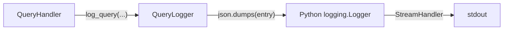
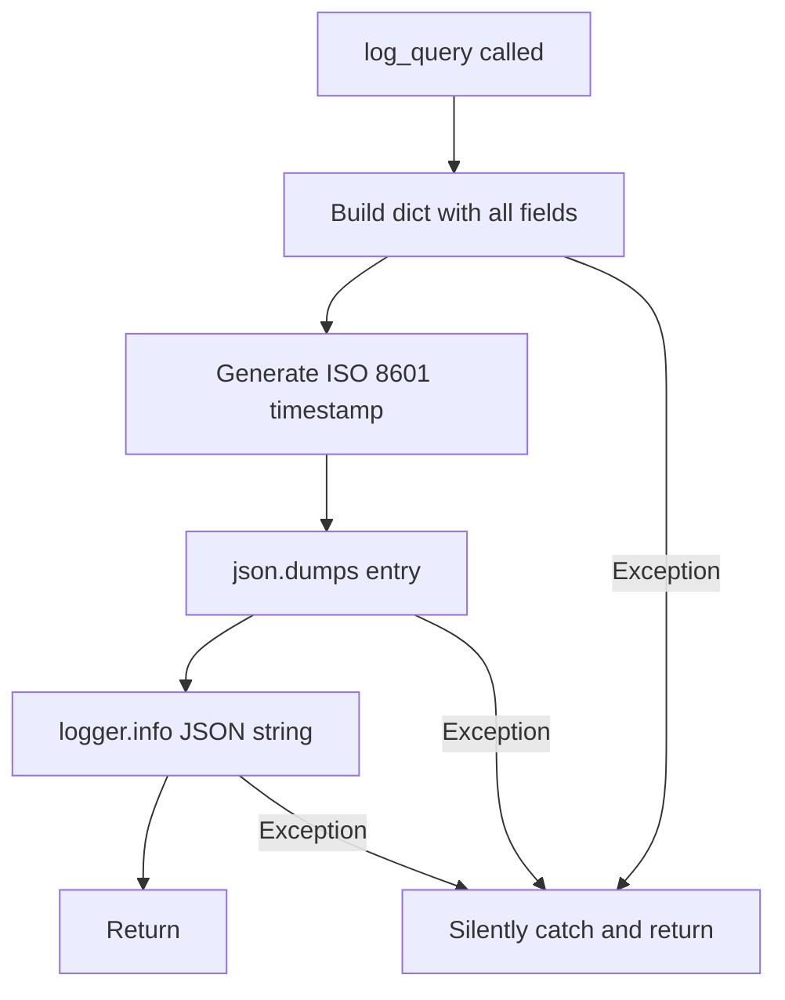

# Feature Detailed Design: Query Logging (Feature #24)

**Date**: 2026-03-22
**Feature**: #24 — Query Logging
**Priority**: medium
**Dependencies**: None (standalone module)
**Design Reference**: docs/plans/2026-03-21-code-context-retrieval-design.md SS 4.6
**SRS Reference**: FR-022

## Context

Implement structured JSON logging for the query service. Each query logs a structured JSON entry to stdout containing query text, query type, API key ID, result count, latency breakdown (retrieval, rerank, total), and ISO 8601 timestamp. Logging failures are non-fatal and must never block or delay query responses.

## Design Alignment

**System design SS 4.6 -- Observability (FR-022)**:

> Python `logging` with JSON formatter to stdout. Each query logs: `query`, `query_type`, `api_key_id`, `result_count`, `retrieval_ms`, `rerank_ms`, `total_ms`, `timestamp`. Non-fatal -- wrapped in try/except.

- **Key class**: `QueryLogger` in `src/query/query_logger.py`
- **Interaction flow**: QueryHandler completes query -> calls `QueryLogger.log_query(...)` -> structured JSON written to stdout via Python `logging` module
- **Third-party deps**: None (stdlib `logging` + `json`)
- **Deviations**: None.

## SRS Requirement

### FR-022: Query Logging

**Priority**: Should
**EARS**: When the query service processes a query, the system shall write a structured JSON log entry to stdout containing the query text, result count, latency breakdown, and timestamp. Logging failures are non-fatal.
**Acceptance Criteria**:
- Given a completed query, when logging executes, then a structured JSON log entry is written to stdout containing: query, query_type, result_count, retrieval_ms, rerank_ms, total_ms, timestamp
- Given a logging I/O failure, when it occurs during query processing, then the query response is not blocked or delayed

## Component Data-Flow Diagram



## Interface Contract

| Method | Signature | Preconditions | Postconditions | Raises |
|--------|-----------|---------------|----------------|--------|
| `QueryLogger.__init__` | `__init__(logger_name: str = "query_logger") -> None` | None | Logger configured with StreamHandler writing to stdout | None |
| `QueryLogger.log_query` | `log_query(query: str, query_type: str, api_key_id: str \| None, result_count: int, retrieval_ms: float, rerank_ms: float, total_ms: float) -> None` | None (all params can be any value) | A single JSON line written to stdout containing all fields plus auto-generated ISO 8601 `timestamp` | Never raises -- all exceptions caught internally |

**Design rationale**:
- Class-based to allow multiple logger instances (e.g., different logger names for testing)
- `timestamp` auto-generated inside `log_query` to ensure consistency
- Entire `log_query` body wrapped in `try/except Exception` -- logging is non-fatal

## Internal Sequence Diagram

N/A -- single-method implementation. `log_query` builds a dict, serializes to JSON, and calls `logger.info()`. No internal cross-method delegation.

## Algorithm / Core Logic

### log_query

#### Flow Diagram



#### Pseudocode

```
METHOD log_query(query, query_type, api_key_id, result_count, retrieval_ms, rerank_ms, total_ms):
  TRY:
    entry = {
      "query": query,
      "query_type": query_type,
      "api_key_id": api_key_id,
      "result_count": result_count,
      "retrieval_ms": retrieval_ms,
      "rerank_ms": rerank_ms,
      "total_ms": total_ms,
      "timestamp": datetime.utcnow().isoformat() + "Z"
    }
    self._logger.info(json.dumps(entry))
  EXCEPT Exception:
    pass  // Non-fatal -- never propagate
END
```

#### Boundary Decisions

| Parameter | Min | Max | Empty/Null | At boundary |
|-----------|-----|-----|------------|-------------|
| `query` | "" | Unlimited length | None allowed | Very long strings serialized normally |
| `query_type` | "nl" | "symbol" | None allowed | Logged as-is |
| `api_key_id` | Any string | Any string | None allowed | Logged as null in JSON |
| `result_count` | 0 | No limit | N/A (int) | 0 is valid |
| `retrieval_ms` | 0.0 | No limit | N/A (float) | 0.0 is valid |
| `rerank_ms` | 0.0 | No limit | N/A (float) | 0.0 is valid |
| `total_ms` | 0.0 | No limit | N/A (float) | 0.0 is valid |

#### Error Handling

| Condition | Detection | Response | Recovery |
|-----------|-----------|----------|----------|
| Any exception in log_query | try/except Exception | Silently caught | Query processing continues unaffected |
| I/O error on stdout | try/except Exception | Silently caught | Query processing continues unaffected |

## State Diagram

N/A -- stateless feature. Each `log_query` call is independent with no lifecycle transitions.

## Test Inventory

| ID | Category | Traces To | Input / Setup | Expected | Kills Which Bug? |
|----|----------|-----------|---------------|----------|-----------------|
| T1 | happy path | VS-1, FR-022 | `log_query("find auth", "nl", "key-1", 5, 12.3, 4.5, 18.0)` | JSON output contains all 8 fields with correct values | Missing field in dict |
| T2 | happy path | VS-1 | Call `log_query`, parse timestamp | Timestamp is valid ISO 8601 format | Malformed timestamp |
| T3 | happy path | VS-1 | Call `log_query` twice | Two separate JSON log lines produced | Only first entry logged |
| T4 | error | VS-2 | Patch logger.info to raise IOError | No exception propagated | Missing try/except |
| T5 | error | VS-2 | Pass None/empty for query and api_key_id | No exception, entry logged with null/empty values | Missing null handling |
| T6 | boundary | SS Algorithm boundary | Very long query string (10000 chars) | Entry logged without error | Truncation bug |
| T7 | boundary | SS Algorithm boundary | All timing fields set to 0.0, result_count=0 | Entry logged with zero values | Off-by-one or min-value rejection |

**Negative ratio**: 3 negative/boundary tests (T4, T5, T6) out of 7 = 43%.

## Tasks

### Task 1: Write failing tests
**Files**: `tests/test_query_logger.py`
**Steps**:
1. Create test file with tests T1-T7
2. Run tests -- all FAIL (import error, module doesn't exist)

### Task 2: Implement minimal code
**Files**: `src/query/query_logger.py`
**Steps**:
1. Create `QueryLogger` class with `__init__` and `log_query` methods
2. Run tests -- all PASS

### Task 3: Coverage Gate
1. Run coverage check for query_logger.py
2. Verify line >= 90%, branch >= 80%

## Verification Checklist
- [x] All verification_steps traced to Interface Contract postconditions
- [x] All verification_steps traced to Test Inventory rows (VS-1 -> T1, T2, T3; VS-2 -> T4, T5)
- [x] Algorithm pseudocode covers log_query method
- [x] Boundary table covers all parameters
- [x] Error handling table covers all Raises entries
- [x] Test Inventory negative ratio: 3/7 = 43%
- [x] Every skipped section has explicit "N/A -- [reason]"
