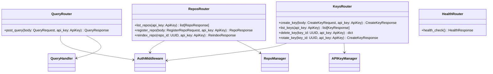
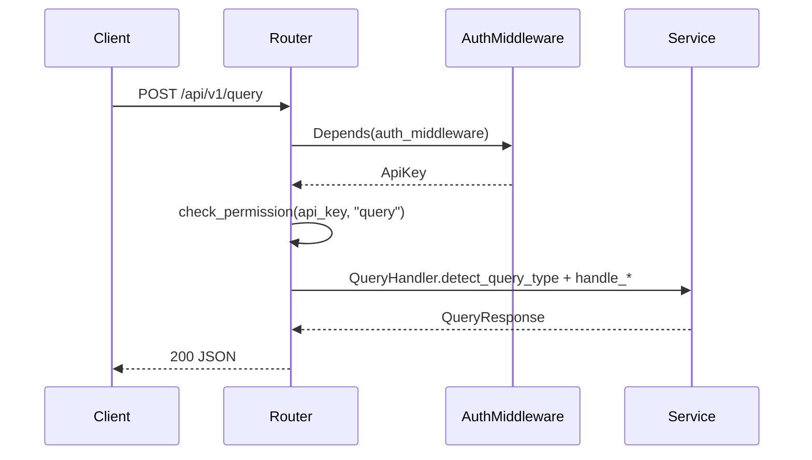
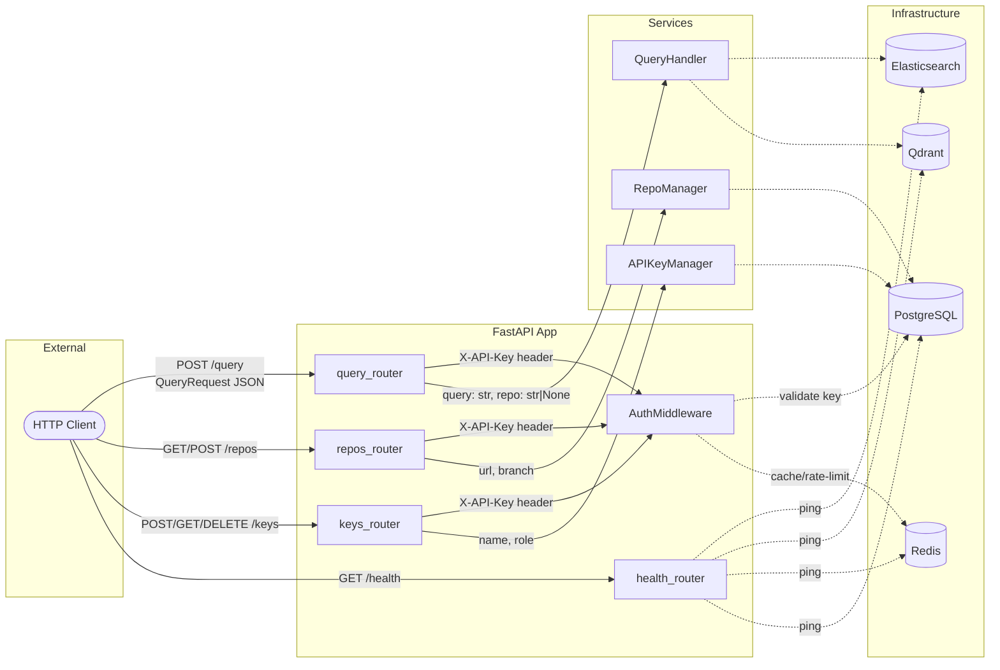
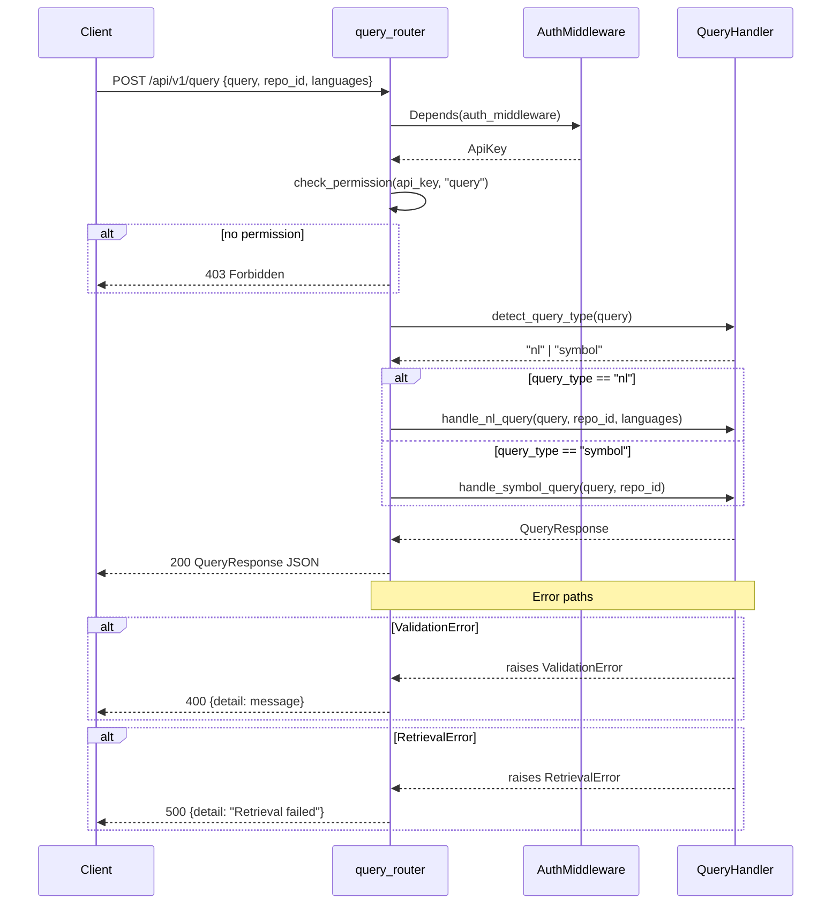
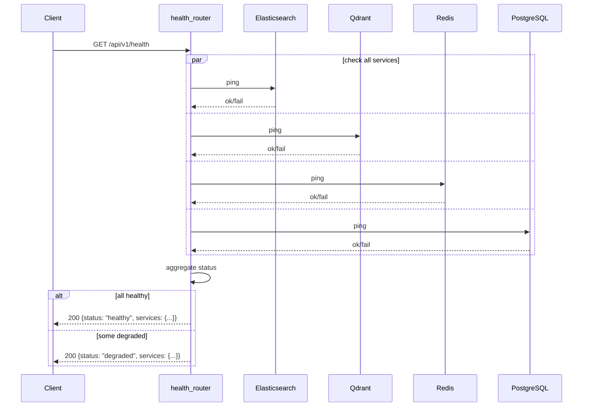
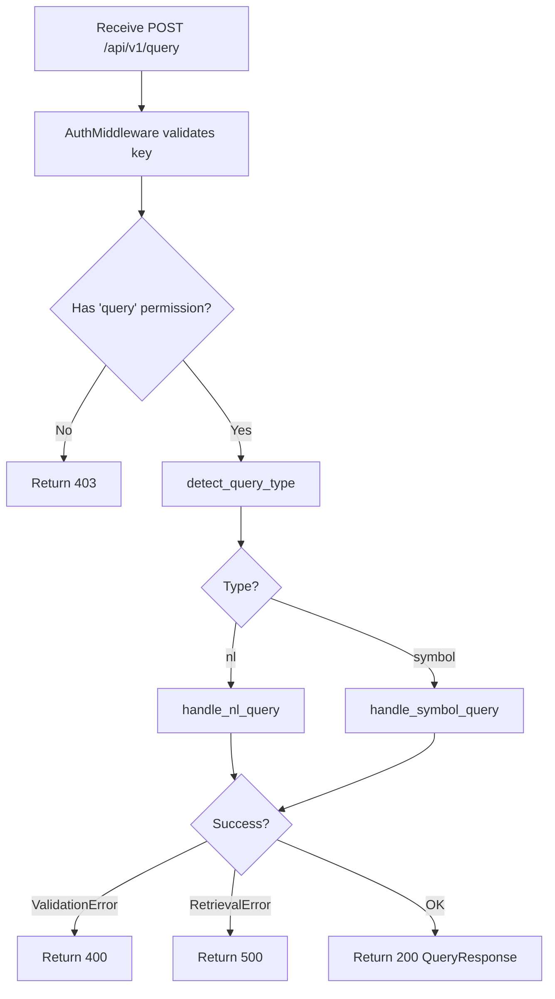
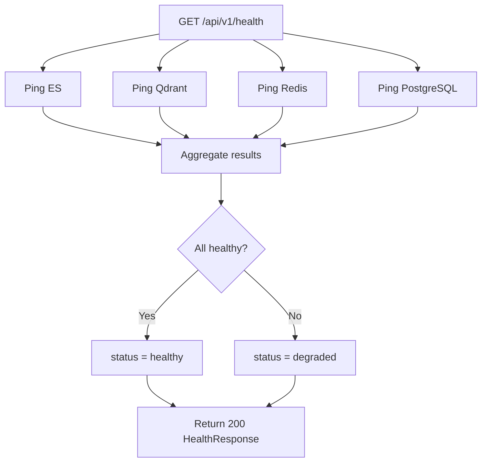

# Feature Detailed Design: REST API Endpoints (Feature #17)

**Date**: 2026-03-22
**Feature**: #17 — REST API Endpoints
**Priority**: high
**Dependencies**: #13 (NL Query Handler), #14 (Symbol Query Handler), #15 (Repository-Scoped Query), #16 (API Key Authentication)
**Design Reference**: docs/plans/2026-03-14-code-context-retrieval-design.md § 4.5
**SRS Reference**: FR-015

## Context

This feature implements the HTTP layer — FastAPI routers that wire up existing services (QueryHandler, RepoManager, APIKeyManager, AuthMiddleware) into RESTful endpoints. It is the primary integration surface for external clients and MCP consumers, translating HTTP requests into service calls and mapping results into structured JSON responses.

## Design Alignment

The design specifies a set of FastAPI routers integrated with AuthMiddleware (as a FastAPI dependency), QueryHandler, RepoManager, and APIKeyManager:

- **query_router**: `POST /api/v1/query` — accepts query body, calls `QueryHandler.detect_query_type` then `handle_nl_query` or `handle_symbol_query`
- **repos_router**: `GET /api/v1/repos` — lists registered repositories; `POST /api/v1/repos` — registers a new repository; `POST /api/v1/repos/{repo_id}/reindex` — triggers manual reindex
- **keys_router**: `POST /api/v1/keys` — create API key (admin); `GET /api/v1/keys` — list API keys (admin); `DELETE /api/v1/keys/{id}` — revoke API key (admin); `POST /api/v1/keys/{id}/rotate` — rotate API key (admin)
- **health_router**: `GET /api/v1/health` — enhanced health check (ES, Qdrant, Redis, PostgreSQL connectivity), unauthenticated





- **Key classes**: QueryRouter, ReposRouter, KeysRouter, HealthRouter (FastAPI APIRouter instances with endpoint functions); Pydantic request/response models (QueryRequest, RegisterRepoRequest, CreateKeyRequest, etc.)
- **Interaction flow**: Client → Router → AuthMiddleware (Depends) → permission check → service call → JSON response
- **Third-party deps**: fastapi >=0.115, pydantic >=2.0 (already in project), httpx (test dependency for TestClient)
- **Deviations**: None. Health endpoint unauthenticated per design. Permission model matches ROLE_PERMISSIONS in auth_middleware.py.

## SRS Requirement

**FR-015** (Priority: Must)

**EARS**: The system shall expose RESTful HTTP endpoints for query submission (POST /api/v1/query), repository listing (GET /api/v1/repos), repository registration (POST /api/v1/repos), manual reindex (POST /api/v1/repos/{repo_id}/reindex), and health check (GET /api/v1/health).

**Acceptance Criteria**:
- Given a POST request to /api/v1/query with a valid query body and API key, when processed, then the system shall return structured context results with a 200 status.
- Given a GET request to /api/v1/repos, when processed, then the system shall return the list of registered repositories with their indexing status.
- Given a GET request to /api/v1/health, when processed, then the system shall return the service health status without authentication.
- Given a malformed JSON request body, when submitted to any endpoint, then the system shall return 400 with a validation error message.

## Component Data-Flow Diagram



## Interface Contract

### query_router

| Method | Signature | Preconditions | Postconditions | Raises |
|--------|-----------|---------------|----------------|--------|
| `post_query` | `post_query(body: QueryRequest, api_key: ApiKey = Depends(auth_middleware)) -> QueryResponse` | Valid API key with "query" permission; body.query non-empty | Returns QueryResponse with code_results, doc_results, rules | HTTPException 403 if no "query" permission; HTTPException 400 if validation fails; HTTPException 500 if RetrievalError |

### repos_router

| Method | Signature | Preconditions | Postconditions | Raises |
|--------|-----------|---------------|----------------|--------|
| `list_repos` | `list_repos(api_key: ApiKey = Depends(auth_middleware)) -> list[RepoResponse]` | Valid API key with "list_repos" permission | Returns list of RepoResponse | HTTPException 403 if no "list_repos" permission |
| `register_repo` | `register_repo(body: RegisterRepoRequest, api_key: ApiKey = Depends(auth_middleware)) -> RepoResponse` | Valid API key with "register_repo" permission; body.url valid | Returns RepoResponse with status "pending" | HTTPException 403 if no permission; HTTPException 400 if ValidationError; HTTPException 409 if ConflictError |
| `reindex_repo` | `reindex_repo(repo_id: UUID, api_key: ApiKey = Depends(auth_middleware)) -> ReindexResponse` | Valid API key with "reindex" permission; repo_id exists | Returns ReindexResponse with new IndexJob id | HTTPException 403 if no permission; HTTPException 404 if repo not found |

### keys_router

| Method | Signature | Preconditions | Postconditions | Raises |
|--------|-----------|---------------|----------------|--------|
| `create_key` | `create_key(body: CreateKeyRequest, api_key: ApiKey = Depends(auth_middleware)) -> CreateKeyResponse` | Valid admin API key with "manage_keys" permission | Returns CreateKeyResponse with plaintext key (shown once) | HTTPException 403 if no permission; HTTPException 400 if invalid name/role |
| `list_keys` | `list_keys(api_key: ApiKey = Depends(auth_middleware)) -> list[KeyResponse]` | Valid admin API key with "manage_keys" permission | Returns list of KeyResponse (no plaintext) | HTTPException 403 if no permission |
| `delete_key` | `delete_key(key_id: UUID, api_key: ApiKey = Depends(auth_middleware)) -> dict` | Valid admin API key with "manage_keys" permission | Returns {"status": "revoked"} | HTTPException 403 if no permission; HTTPException 404 if key not found |
| `rotate_key` | `rotate_key(key_id: UUID, api_key: ApiKey = Depends(auth_middleware)) -> CreateKeyResponse` | Valid admin API key with "manage_keys" permission; key is active | Returns CreateKeyResponse with new plaintext | HTTPException 403 if no permission; HTTPException 404 if key not found; HTTPException 400 if key inactive |

### health_router (enhanced)

| Method | Signature | Preconditions | Postconditions | Raises |
|--------|-----------|---------------|----------------|--------|
| `health_check` | `health_check() -> HealthResponse` | None (unauthenticated) | Returns HealthResponse with per-service status | Never raises HTTP errors; returns degraded status if services down |

**Design rationale**:
- Health endpoint is unauthenticated so monitoring systems (load balancers, k8s probes) can check without API keys
- `POST /api/v1/query` uses POST (not GET) because query bodies can be complex (languages filter, repo_id) and may exceed URL length limits
- Key creation returns plaintext once; subsequent list calls only show metadata (key_hash is never exposed)
- Reindex creates a new IndexJob rather than mutating existing ones, preserving job history

## Internal Sequence Diagram





## Algorithm / Core Logic

### post_query

#### Flow Diagram



#### Pseudocode

```
FUNCTION post_query(body: QueryRequest, api_key: ApiKey) -> QueryResponse
  // Step 1: Check permission
  IF NOT auth_middleware.check_permission(api_key, "query") THEN
    RAISE HTTPException(403, "Insufficient permissions")

  // Step 2: Detect query type
  query_type = query_handler.detect_query_type(body.query)

  // Step 3: Dispatch to appropriate handler
  TRY
    IF query_type == "nl" THEN
      response = AWAIT query_handler.handle_nl_query(body.query, body.repo_id, body.languages)
    ELSE
      response = AWAIT query_handler.handle_symbol_query(body.query, body.repo_id)
    END IF
  CATCH ValidationError AS e
    RAISE HTTPException(400, str(e))
  CATCH RetrievalError AS e
    RAISE HTTPException(500, "Retrieval failed")

  // Step 4: Return response
  RETURN response
END
```

### health_check (enhanced)

#### Flow Diagram



#### Pseudocode

```
FUNCTION health_check() -> HealthResponse
  services = {}

  // Step 1: Check each service in parallel
  FOR service IN [elasticsearch, qdrant, redis, postgresql]
    TRY
      AWAIT service.ping()
      services[service.name] = "up"
    CATCH Exception
      services[service.name] = "down"
    END TRY
  END FOR

  // Step 2: Compute aggregate status
  IF all services are "up" THEN
    overall = "healthy"
  ELSE
    overall = "degraded"
  END IF

  RETURN HealthResponse(status=overall, service="code-context-retrieval", services=services)
END
```

#### Boundary Decisions

| Parameter | Min | Max | Empty/Null | At boundary |
|-----------|-----|-----|------------|-------------|
| `body.query` (QueryRequest) | 1 char | 500 chars (NL) / 200 chars (symbol) | 400 ValidationError | Delegated to QueryHandler validation |
| `body.repo_id` | valid UUID | valid UUID | None (queries all repos) | 400 if malformed UUID |
| `body.languages` | empty list | unbounded | None (no filter) | Empty list treated same as None |
| `repo_id` (path param) | valid UUID | valid UUID | N/A (required) | 422 if not valid UUID |
| `CreateKeyRequest.name` | 1 char | unbounded | 400 ValueError | Whitespace-only → 400 |
| `CreateKeyRequest.role` | "read" | "admin" | 400 ValueError | Must be exactly "read" or "admin" |

#### Error Handling

| Condition | Detection | Response | Recovery |
|-----------|-----------|----------|----------|
| Missing API key header | AuthMiddleware checks `x-api-key` | 401 "Missing API key" | Client provides key |
| Invalid API key | Hash not found in DB | 401 "Invalid API key" | Client uses valid key |
| Expired API key | `expires_at <= now()` | 401 "API key has expired" | Admin rotates key |
| Insufficient permissions | `check_permission` returns False | 403 "Insufficient permissions" | Use key with correct role |
| Rate limited | Redis counter > 10 | 429 "Too many failed attempts" | Wait 60s window |
| Malformed JSON body | Pydantic validation | 422 Unprocessable Entity (FastAPI default) | Fix request body |
| Invalid query (empty/too long) | QueryHandler ValidationError | 400 detail message | Fix query string |
| All retrievals fail | QueryHandler RetrievalError | 500 "Retrieval failed" | Retry; check infra |
| Repo URL conflict | RepoManager ConflictError | 409 "Repository already registered" | Use existing repo |
| Repo not found (reindex) | DB lookup returns None | 404 "Repository not found" | Use valid repo_id |
| Key not found (delete/rotate) | APIKeyManager KeyError | 404 "API key not found" | Use valid key_id |
| Rotate inactive key | APIKeyManager ValueError | 400 "Cannot rotate an inactive key" | Rotate active key only |
| Service unreachable (health) | Ping exception | 200 with service status "down" | No client action needed |

## State Diagram

> N/A — This feature is a stateless HTTP routing layer. Request processing is purely request-scoped with no persistent state transitions managed by the routers themselves. State is managed by downstream services (RepoManager, APIKeyManager).

## Pydantic Request/Response Models

### Request Models

```python
class QueryRequest(BaseModel):
    query: str
    repo_id: str | None = None
    languages: list[str] | None = None

class RegisterRepoRequest(BaseModel):
    url: str
    branch: str | None = None

class CreateKeyRequest(BaseModel):
    name: str
    role: str  # "read" or "admin"
    repo_ids: list[UUID] | None = None
```

### Response Models

```python
class RepoResponse(BaseModel):
    id: UUID
    name: str
    url: str
    status: str
    indexed_branch: str | None
    last_indexed_at: datetime | None
    created_at: datetime | None

class ReindexResponse(BaseModel):
    job_id: UUID
    repo_id: UUID
    status: str

class CreateKeyResponse(BaseModel):
    id: UUID
    key: str  # plaintext, shown once
    name: str
    role: str

class KeyResponse(BaseModel):
    id: UUID
    name: str
    role: str
    is_active: bool
    created_at: datetime | None
    expires_at: datetime | None

class ServiceHealth(BaseModel):
    elasticsearch: str  # "up" | "down"
    qdrant: str
    redis: str
    postgresql: str

class HealthResponse(BaseModel):
    status: str  # "healthy" | "degraded"
    service: str
    services: ServiceHealth
```

## Test Inventory

| ID | Category | Traces To | Input / Setup | Expected | Kills Which Bug? |
|----|----------|-----------|---------------|----------|-----------------|
| T01 | happy path | FR-015 AC1, VS-1 | POST /api/v1/query with valid key + `{"query": "how to parse"}` | 200, QueryResponse with query_type, code_results | Missing query handler dispatch |
| T02 | happy path | FR-015 AC1 | POST /api/v1/query with symbol query `{"query": "parseJSON"}` | 200, query_type="symbol" | Wrong query_type detection in router |
| T03 | happy path | FR-015 AC2 | GET /api/v1/repos with valid key | 200, list of RepoResponse | Missing repos listing |
| T04 | happy path | FR-015 AC3 | GET /api/v1/health (no auth) | 200, HealthResponse with all services | Health endpoint requires auth |
| T05 | happy path | §Interface keys | POST /api/v1/keys with admin key + `{"name": "test", "role": "read"}` | 200, CreateKeyResponse with plaintext key | Key creation not wired |
| T06 | happy path | §Interface keys | GET /api/v1/keys with admin key | 200, list of KeyResponse | Key listing not wired |
| T07 | happy path | §Interface repos | POST /api/v1/repos with admin key + `{"url": "https://github.com/o/r"}` | 200, RepoResponse with status="pending" | Repo registration not wired |
| T08 | happy path | §Interface repos | POST /api/v1/repos/{id}/reindex with admin key | 200, ReindexResponse | Reindex not wired |
| T09 | happy path | §Interface keys | DELETE /api/v1/keys/{id} with admin key | 200, `{"status": "revoked"}` | Delete not wired |
| T10 | happy path | §Interface keys | POST /api/v1/keys/{id}/rotate with admin key | 200, CreateKeyResponse with new key | Rotate not wired |
| T11 | happy path | FR-015 AC1 | POST /api/v1/query with repo_id filter | 200, response has repo field set | repo_id not passed through |
| T12 | happy path | FR-015 AC1 | POST /api/v1/query with languages filter | 200, response reflects language filter | languages not passed through |
| T13 | error | §Error Handling: missing key | POST /api/v1/query without X-API-Key header | 401 "Missing API key" | Missing auth check |
| T14 | error | §Error Handling: invalid key | POST /api/v1/query with invalid key | 401 "Invalid API key" | Auth bypass |
| T15 | error | §Error Handling: permission | POST /api/v1/keys with read-only key | 403 "Insufficient permissions" | Permission check missing |
| T16 | error | §Error Handling: permission | POST /api/v1/repos with read-only key | 403 "Insufficient permissions" | Permission check missing for register |
| T17 | error | FR-015 AC4 | POST /api/v1/query with `{"query": ""}` | 400 validation error | Empty query not rejected |
| T18 | error | §Error Handling: malformed | POST /api/v1/query with missing "query" field | 422 Unprocessable Entity | Missing field validation |
| T19 | error | §Error Handling: retrieval | POST /api/v1/query when all retrievers fail | 500 "Retrieval failed" | RetrievalError not caught |
| T20 | error | §Error Handling: conflict | POST /api/v1/repos with duplicate URL | 409 "Repository already registered" | ConflictError not mapped |
| T21 | error | §Error Handling: not found | POST /api/v1/repos/{bad-uuid}/reindex | 404 "Repository not found" | Missing repo check |
| T22 | error | §Error Handling: not found | DELETE /api/v1/keys/{bad-uuid} | 404 "API key not found" | Missing key check |
| T23 | error | §Error Handling: rotate inactive | POST /api/v1/keys/{id}/rotate on inactive key | 400 "Cannot rotate an inactive key" | Inactive guard missing |
| T24 | error | §Error Handling: permission | POST /api/v1/repos/{id}/reindex with read-only key | 403 "Insufficient permissions" | Reindex permission check missing |
| T25 | error | §Error Handling: invalid role | POST /api/v1/keys with `{"name":"t","role":"superadmin"}` | 400 "role must be 'read' or 'admin'" | Role validation missing |
| T26 | error | §Error Handling: not found | POST /api/v1/keys/{bad-uuid}/rotate | 404 "API key not found" | Missing key check on rotate |
| T27 | boundary | §Boundary: query length | POST /api/v1/query with 501-char query | 400 "query exceeds 500 character limit" | Off-by-one on length check |
| T28 | boundary | §Boundary: query length | POST /api/v1/query with exactly 500-char query | 200 success | Off-by-one rejects valid query |
| T29 | boundary | §Boundary: empty name | POST /api/v1/keys with `{"name": " ", "role": "read"}` | 400 "name must not be empty" | Whitespace-only name accepted |
| T30 | boundary | §Boundary: empty languages | POST /api/v1/query with `{"query": "test", "languages": []}` | 200 success (treated as no filter) | Empty list causes error |
| T31 | error | §Error Handling: health degraded | GET /api/v1/health when ES is down | 200, status="degraded", elasticsearch="down" | Degraded not reported |
| T32 | happy path | §Interface health | GET /api/v1/health when all up | 200, status="healthy", all services="up" | Health misses a service |
| T33 | error | §Error Handling: rate limit | Repeated invalid key attempts | 429 after threshold | Rate limiting not enforced |

**Negative test ratio**: 21 negative+boundary tests (T13-T31, T33) out of 33 total = 63.6% (exceeds 40% requirement).

## Tasks

### Task 1: Write failing tests

**Files**: `tests/test_rest_api.py`

**Steps**:
1. Create test file with imports: `pytest`, `httpx`, `unittest.mock`, `fastapi.testclient.TestClient`
2. Create test fixtures:
   - Mock `QueryHandler`, `RepoManager`, `APIKeyManager`, `AuthMiddleware`
   - Create `TestClient` from `create_app()` with injected mocks
   - Helper functions to set up auth headers
3. Write test functions for each row in Test Inventory:
   - T01: `test_post_query_nl_success` — mock detect returns "nl", handle_nl_query returns QueryResponse; assert 200
   - T02: `test_post_query_symbol_success` — mock detect returns "symbol"; assert query_type in response
   - T03: `test_get_repos_success` — mock DB returns repo list; assert 200 + list
   - T04: `test_get_health_no_auth` — no X-API-Key; assert 200 + HealthResponse
   - T05: `test_create_key_success` — mock create_key returns (plaintext, ApiKey); assert 200
   - T06: `test_list_keys_success` — mock list_keys; assert 200 + list
   - T07: `test_register_repo_success` — mock register; assert 200 + RepoResponse
   - T08: `test_reindex_repo_success` — mock DB lookup; assert 200 + ReindexResponse
   - T09: `test_delete_key_success` — mock revoke_key; assert 200
   - T10: `test_rotate_key_success` — mock rotate_key; assert 200
   - T11: `test_post_query_with_repo_id` — verify repo_id passed to handler
   - T12: `test_post_query_with_languages` — verify languages passed to handler
   - T13: `test_query_missing_api_key` — no header; assert 401
   - T14: `test_query_invalid_api_key` — bad key; assert 401
   - T15: `test_create_key_read_only_forbidden` — read key; assert 403
   - T16: `test_register_repo_read_only_forbidden` — read key; assert 403
   - T17: `test_query_empty_body` — `{"query": ""}`; assert 400
   - T18: `test_query_missing_field` — `{}`; assert 422
   - T19: `test_query_retrieval_error` — handler raises RetrievalError; assert 500
   - T20: `test_register_repo_conflict` — RepoManager raises ConflictError; assert 409
   - T21: `test_reindex_repo_not_found` — no repo; assert 404
   - T22: `test_delete_key_not_found` — no key; assert 404
   - T23: `test_rotate_inactive_key` — inactive; assert 400
   - T24: `test_reindex_read_only_forbidden` — read key; assert 403
   - T25: `test_create_key_invalid_role` — bad role; assert 400
   - T26: `test_rotate_key_not_found` — no key; assert 404
   - T27: `test_query_exceeds_500_chars` — 501 chars; assert 400
   - T28: `test_query_exactly_500_chars` — 500 chars; assert 200
   - T29: `test_create_key_whitespace_name` — `" "`; assert 400
   - T30: `test_query_empty_languages_list` — `[]`; assert 200
   - T31: `test_health_degraded` — ES ping fails; assert 200 + degraded
   - T32: `test_health_all_up` — all pings ok; assert 200 + healthy
   - T33: `test_rate_limit_enforced` — many bad attempts; assert 429
4. Run: `pytest tests/test_rest_api.py -v`
5. **Expected**: All tests FAIL (ImportError or assertion) because routers don't exist yet

### Task 2: Implement minimal code

**Files**:
- `src/query/api/__init__.py`
- `src/query/api/v1/__init__.py`
- `src/query/api/v1/schemas.py` — Pydantic request/response models
- `src/query/api/v1/endpoints/__init__.py`
- `src/query/api/v1/endpoints/query.py` — query_router
- `src/query/api/v1/endpoints/repos.py` — repos_router
- `src/query/api/v1/endpoints/keys.py` — keys_router
- `src/query/health.py` — enhanced health_router (update existing)
- `src/query/app.py` — updated app factory (register all routers)

**Steps**:

1. Create `src/query/api/v1/schemas.py` with all Pydantic request/response models:
   - `QueryRequest`, `RegisterRepoRequest`, `CreateKeyRequest`
   - `RepoResponse`, `ReindexResponse`, `CreateKeyResponse`, `KeyResponse`
   - `ServiceHealth`, `HealthResponse`

2. Create `src/query/api/v1/endpoints/query.py`:
   - Define `query_router = APIRouter(tags=["query"])`
   - `POST /query` endpoint:
     - Auth via `Depends(auth_middleware)`
     - Check `check_permission(api_key, "query")` → 403
     - Call `detect_query_type(body.query)`
     - Dispatch to `handle_nl_query` or `handle_symbol_query`
     - Catch `ValidationError` → 400, `RetrievalError` → 500

3. Create `src/query/api/v1/endpoints/repos.py`:
   - Define `repos_router = APIRouter(tags=["repos"])`
   - `GET /repos` — check "list_repos" permission, query DB for repos
   - `POST /repos` — check "register_repo" permission, call `RepoManager.register()`
   - `POST /repos/{repo_id}/reindex` — check "reindex" permission, create new IndexJob

4. Create `src/query/api/v1/endpoints/keys.py`:
   - Define `keys_router = APIRouter(tags=["keys"])`
   - `POST /keys` — check "manage_keys" permission, call `APIKeyManager.create_key()`
   - `GET /keys` — check "manage_keys" permission, call `APIKeyManager.list_keys()`
   - `DELETE /keys/{key_id}` — check "manage_keys" permission, call `APIKeyManager.revoke_key()`
   - `POST /keys/{key_id}/rotate` — check "manage_keys" permission, call `APIKeyManager.rotate_key()`

5. Update `src/query/health.py`:
   - Add ES, Qdrant, Redis, PostgreSQL ping checks
   - Return `HealthResponse` with per-service status
   - Keep endpoint unauthenticated

6. Update `src/query/app.py`:
   - Import and include all routers under `/api/v1` prefix
   - Accept service dependencies in `create_app()` for dependency injection

7. Run: `pytest tests/test_rest_api.py -v`
8. **Expected**: All tests PASS

### Task 3: Coverage Gate

1. Run: `pytest tests/test_rest_api.py --cov=src/query/api --cov=src/query/health --cov=src/query/app --cov-branch --cov-report=term-missing`
2. Check thresholds: line >= 90%, branch >= 80%. If below: return to Task 1 to add tests for uncovered branches.
3. Record coverage output as evidence.

### Task 4: Refactor

1. Extract common permission-check logic into a helper `require_permission(api_key, action, auth_middleware)` to reduce duplication across routers
2. Ensure all error response bodies follow consistent `{"detail": "message"}` format
3. Run full test suite: `pytest tests/test_rest_api.py -v`. All tests PASS.

### Task 5: Mutation Gate

1. Run: `mutmut run --paths-to-mutate=src/query/api/v1/endpoints/query.py,src/query/api/v1/endpoints/repos.py,src/query/api/v1/endpoints/keys.py,src/query/health.py --tests-dir=tests/test_rest_api.py`
2. Check threshold: mutation score >= 80%. If below: improve assertions in tests to kill surviving mutants.
3. Record mutation output as evidence.

### Task 6: Create example

1. Create `examples/17-rest-api-endpoints.py`
   - Demonstrate hitting each endpoint with `httpx` (POST /query, GET /repos, POST /repos, GET /health, key management)
   - Show request/response JSON
2. Update `examples/README.md` with entry for feature #17
3. Run example to verify: `python examples/17-rest-api-endpoints.py`

## Verification Checklist

- [x] All verification_steps traced to Interface Contract postconditions
  - VS-1 (POST /query 200) → post_query postcondition
  - VS-2 (GET /repos 200) → list_repos postcondition
  - VS-3 (GET /health 200) → health_check postcondition
  - VS-4 (malformed JSON 400) → Error Handling table "Malformed JSON body"
- [x] All verification_steps traced to Test Inventory rows
  - VS-1 → T01, T02, T11, T12
  - VS-2 → T03
  - VS-3 → T04, T32
  - VS-4 → T17, T18
- [x] Algorithm pseudocode covers all non-trivial methods (post_query, health_check)
- [x] Boundary table covers all algorithm parameters (query length, repo_id, languages, name, role)
- [x] Error handling table covers all Raises entries (401, 403, 400, 404, 409, 422, 429, 500)
- [x] Test Inventory negative ratio >= 40% (63.6%)
- [x] Every skipped section has explicit "N/A — [reason]" (State Diagram)
