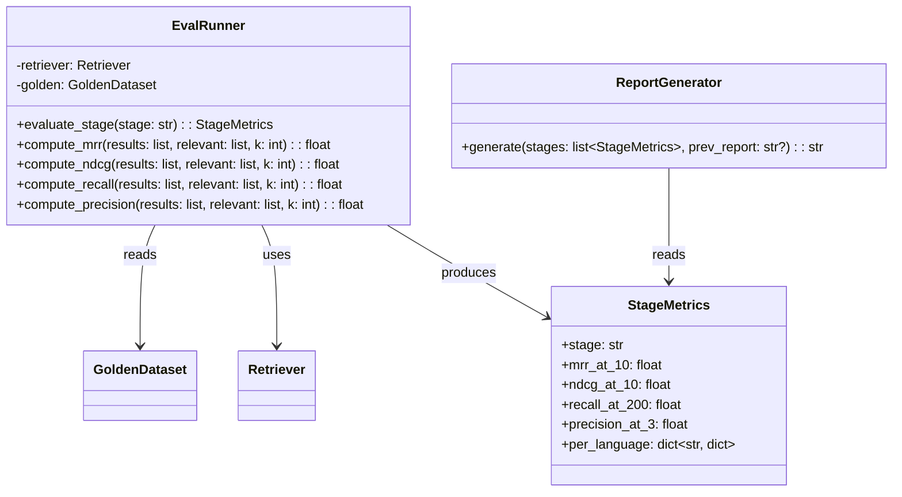
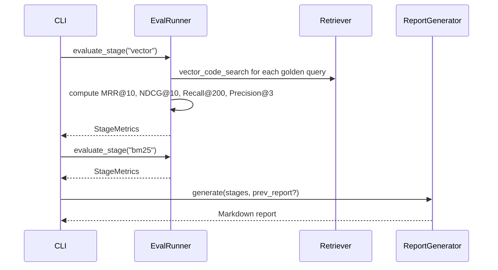
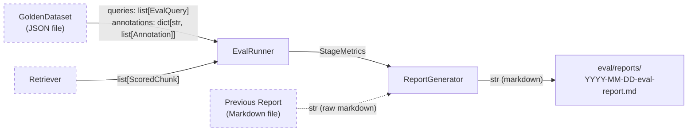
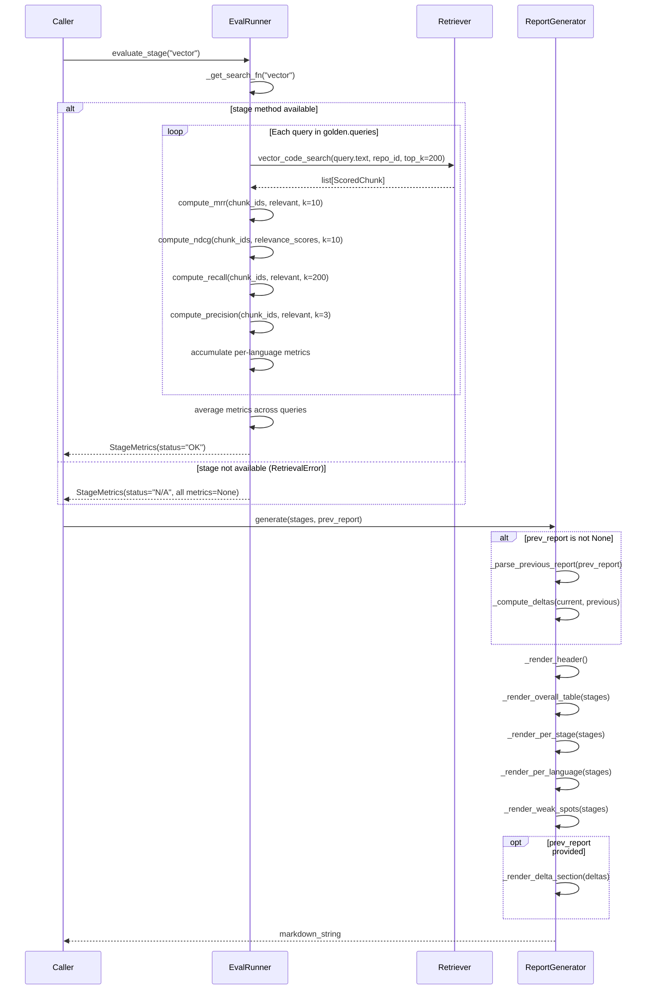
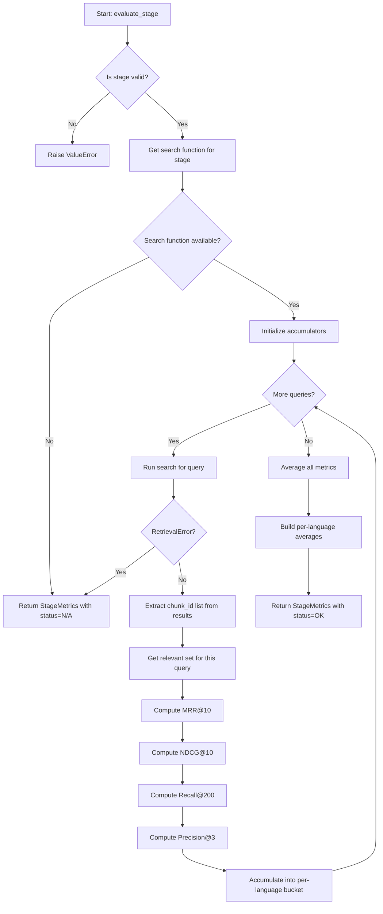
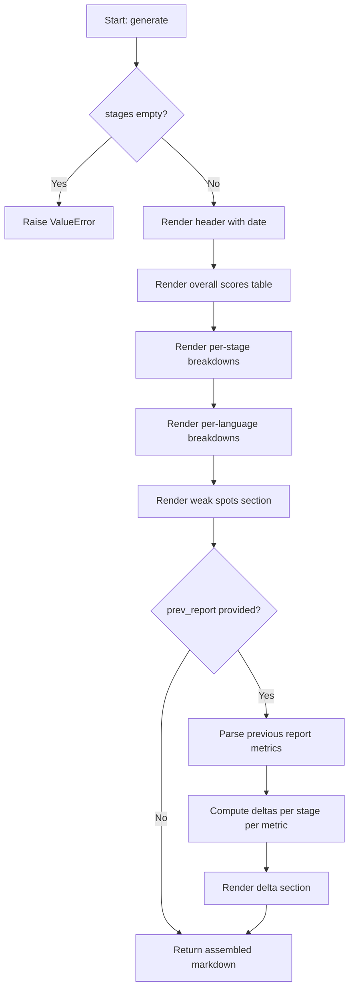

# Feature Detailed Design: Retrieval Quality Evaluation & Reporting (Feature #42)

**Date**: 2026-03-22
**Feature**: #42 — Retrieval Quality Evaluation & Reporting
**Priority**: medium
**Dependencies**: #41 (LLM Query Generation & Relevance Annotation), #8 (BM25 Keyword Retrieval), #9 (Semantic Vector Retrieval)
**Design Reference**: docs/plans/2026-03-21-code-context-retrieval-design.md § 4.7
**SRS Reference**: FR-026

## Context

Evaluate retrieval pipeline stages (vector-only, BM25-only, RRF, reranked) against LLM-annotated golden datasets using standard IR metrics (MRR@10, NDCG@10, Recall@200, Precision@3). Generates a Markdown report with per-language and per-stage breakdowns, including delta comparison with a previous report when available. This enables data-driven tuning of the retrieval pipeline.

## Design Alignment

### Class Diagram (from §4.7.2)



### Sequence Diagram (from §4.7.3 — evaluation phase)



- **Key classes**: `EvalRunner` (metric computation), `StageMetrics` (result dataclass), `ReportGenerator` (Markdown output)
- **Interaction flow**: CLI calls `evaluate_stage()` per stage, collects `StageMetrics`, passes them to `ReportGenerator.generate()`
- **Third-party deps**: None new — reuses `Retriever` (Feature #8/#9), `GoldenDataset` (Feature #41)
- **Deviations**: None

## SRS Requirement

### FR-026: Retrieval Quality Evaluation & Reporting [Wave 3]

**Priority**: Should
**EARS**: When a golden dataset exists and retrieval stages are available, the system shall evaluate each stage using standard IR metrics (MRR@10, NDCG@10, Recall@200, Precision@3) and produce a Markdown quality report with per-language and per-stage breakdowns.
**Acceptance Criteria**:
- Given a golden dataset and the vector retrieval stage, when evaluation runs, then MRR@10, NDCG@10, Recall@200, and Precision@3 are computed for vector-only retrieval.
- Given a retrieval stage that is not yet implemented (e.g., RRF fusion), when evaluation runs, then that stage is skipped and marked N/A in the report without errors.
- Given all evaluable stages complete, when the report is generated, then it is saved to `eval/reports/YYYY-MM-DD-eval-report.md` with per-language breakdown, per-stage breakdown, overall scores, and identified weak spots.
- Given a previous evaluation report exists, when a new evaluation runs, then the report includes a delta section showing metric changes per stage.

## Component Data-Flow Diagram



## Interface Contract

| Method | Signature | Preconditions | Postconditions | Raises |
|--------|-----------|---------------|----------------|--------|
| `EvalRunner.__init__` | `__init__(self, retriever: Retriever, golden: GoldenDataset) -> None` | `retriever` is a valid Retriever; `golden` has at least one query with annotations | `self._retriever` and `self._golden` stored; `self._relevant_map` built (mapping query text -> set of chunk_ids with score >= 2) | `ValueError` if golden has no queries |
| `EvalRunner.evaluate_stage` | `evaluate_stage(self, stage: str) -> StageMetrics` | `stage` is one of `"vector"`, `"bm25"`, `"rrf"`, `"reranked"` | Returns `StageMetrics` with computed MRR@10, NDCG@10, Recall@200, Precision@3 aggregated across all golden queries; `per_language` dict populated per language in golden dataset. If stage retriever method is unavailable, returns `StageMetrics` with all metric values `None` and `status="N/A"` | `ValueError` if stage name is not recognized |
| `EvalRunner.compute_mrr` | `compute_mrr(self, results: list[str], relevant: set[str], k: int) -> float` | `results` is an ordered list of chunk_ids; `relevant` is a set of relevant chunk_ids; `k >= 1` | Returns MRR = 1/rank of first relevant item in results[:k]; returns 0.0 if no relevant item found in top-k | `ValueError` if k < 1 |
| `EvalRunner.compute_ndcg` | `compute_ndcg(self, results: list[str], relevance_scores: dict[str, int], k: int) -> float` | `results` is an ordered list of chunk_ids; `relevance_scores` maps chunk_id -> graded score (0-3); `k >= 1` | Returns NDCG@k using log2 discounting; IDCG computed from sorted relevance scores; returns 0.0 if no relevant items exist | `ValueError` if k < 1 |
| `EvalRunner.compute_recall` | `compute_recall(self, results: list[str], relevant: set[str], k: int) -> float` | `results` ordered list; `relevant` set; `k >= 1` | Returns `|relevant ∩ results[:k]| / |relevant|`; returns 1.0 if `relevant` is empty (vacuously true) | `ValueError` if k < 1 |
| `EvalRunner.compute_precision` | `compute_precision(self, results: list[str], relevant: set[str], k: int) -> float` | `results` ordered list; `relevant` set; `k >= 1` | Returns `|relevant ∩ results[:k]| / k` | `ValueError` if k < 1 |
| `ReportGenerator.generate` | `generate(self, stages: list[StageMetrics], prev_report: str | None = None) -> str` | `stages` has at least one StageMetrics; `prev_report` is raw Markdown string of previous report or None | Returns Markdown string with: header, date, overall scores table, per-stage breakdown, per-language breakdown, weak spots section. If `prev_report` provided, includes delta section. | `ValueError` if stages is empty |
| `StageMetrics.__init__` | `StageMetrics(stage: str, mrr_at_10: float | None, ndcg_at_10: float | None, recall_at_200: float | None, precision_at_3: float | None, per_language: dict[str, dict[str, float | None]], query_count: int, status: str = "OK")` | N/A (dataclass) | All fields stored | N/A |

**Design rationale**:
- Relevance threshold is score >= 2 (standard TREC convention for graded relevance to binary)
- `compute_recall` returns 1.0 for empty relevant set to avoid division by zero; this is the standard convention
- `compute_ndcg` takes graded `relevance_scores` dict instead of binary set to support TREC-style graded NDCG
- `evaluate_stage` catches `RetrievalError` for unavailable stages and returns N/A metrics rather than propagating

## Internal Sequence Diagram



## Algorithm / Core Logic

### EvalRunner.evaluate_stage

#### Flow Diagram



#### Pseudocode

```
FUNCTION evaluate_stage(stage: str) -> StageMetrics
  // Step 1: Validate stage
  IF stage NOT IN {"vector", "bm25", "rrf", "reranked"} THEN
    RAISE ValueError("Unknown stage: {stage}")

  // Step 2: Resolve search function
  search_fn = _get_search_fn(stage)
  IF search_fn IS None THEN
    RETURN StageMetrics(stage=stage, all_metrics=None, status="N/A")

  // Step 3: Evaluate each golden query
  overall_mrr, overall_ndcg, overall_recall, overall_prec = [], [], [], []
  lang_accum = defaultdict(lambda: {"mrr": [], "ndcg": [], "recall": [], "prec": []})

  FOR query IN self._golden.queries:
    TRY
      results = AWAIT search_fn(query.text, repo_id=query.repo_id, top_k=200)
    CATCH RetrievalError:
      RETURN StageMetrics(stage=stage, all_metrics=None, status="N/A")

    result_ids = [r.chunk_id for r in results]
    relevant = self._relevant_map[query.text]
    relevance_scores = self._relevance_scores_map[query.text]

    mrr = compute_mrr(result_ids, relevant, k=10)
    ndcg = compute_ndcg(result_ids, relevance_scores, k=10)
    recall = compute_recall(result_ids, relevant, k=200)
    prec = compute_precision(result_ids, relevant, k=3)

    overall_mrr.append(mrr)
    overall_ndcg.append(ndcg)
    overall_recall.append(recall)
    overall_prec.append(prec)

    lang_accum[query.language]["mrr"].append(mrr)
    lang_accum[query.language]["ndcg"].append(ndcg)
    lang_accum[query.language]["recall"].append(recall)
    lang_accum[query.language]["prec"].append(prec)

  // Step 4: Average
  per_language = {}
  FOR lang, metrics IN lang_accum:
    per_language[lang] = {
      "mrr_at_10": mean(metrics["mrr"]),
      "ndcg_at_10": mean(metrics["ndcg"]),
      "recall_at_200": mean(metrics["recall"]),
      "precision_at_3": mean(metrics["prec"])
    }

  RETURN StageMetrics(
    stage=stage,
    mrr_at_10=mean(overall_mrr),
    ndcg_at_10=mean(overall_ndcg),
    recall_at_200=mean(overall_recall),
    precision_at_3=mean(overall_prec),
    per_language=per_language,
    query_count=len(self._golden.queries),
    status="OK"
  )
END
```

### EvalRunner.compute_mrr

#### Pseudocode

```
FUNCTION compute_mrr(results: list[str], relevant: set[str], k: int) -> float
  IF k < 1 THEN RAISE ValueError("k must be >= 1")
  FOR i IN range(min(k, len(results))):
    IF results[i] IN relevant THEN
      RETURN 1.0 / (i + 1)
  RETURN 0.0
END
```

### EvalRunner.compute_ndcg

#### Pseudocode

```
FUNCTION compute_ndcg(results: list[str], relevance_scores: dict[str, int], k: int) -> float
  IF k < 1 THEN RAISE ValueError("k must be >= 1")

  // DCG
  dcg = 0.0
  FOR i IN range(min(k, len(results))):
    rel = relevance_scores.get(results[i], 0)
    dcg += (2^rel - 1) / log2(i + 2)    // i+2 because position is 1-indexed

  // IDCG: sort all relevance scores descending, take top-k
  ideal_rels = sorted(relevance_scores.values(), reverse=True)[:k]
  idcg = 0.0
  FOR i, rel IN enumerate(ideal_rels):
    idcg += (2^rel - 1) / log2(i + 2)

  IF idcg == 0.0 THEN RETURN 0.0
  RETURN dcg / idcg
END
```

### EvalRunner.compute_recall

#### Pseudocode

```
FUNCTION compute_recall(results: list[str], relevant: set[str], k: int) -> float
  IF k < 1 THEN RAISE ValueError("k must be >= 1")
  IF len(relevant) == 0 THEN RETURN 1.0
  retrieved_at_k = set(results[:k])
  RETURN len(relevant & retrieved_at_k) / len(relevant)
END
```

### EvalRunner.compute_precision

#### Pseudocode

```
FUNCTION compute_precision(results: list[str], relevant: set[str], k: int) -> float
  IF k < 1 THEN RAISE ValueError("k must be >= 1")
  retrieved_at_k = set(results[:k])
  RETURN len(relevant & retrieved_at_k) / k
END
```

### EvalRunner._get_search_fn

#### Pseudocode

```
FUNCTION _get_search_fn(stage: str) -> Callable | None
  // Map stage name to Retriever method
  IF stage == "vector" THEN
    IF self._retriever._qdrant IS None THEN RETURN None
    RETURN self._retriever.vector_code_search
  ELSE IF stage == "bm25" THEN
    RETURN self._retriever.bm25_code_search
  ELSE IF stage == "rrf" THEN
    RETURN None   // Not yet implemented
  ELSE IF stage == "reranked" THEN
    RETURN None   // Not yet implemented
  RETURN None
END
```

### ReportGenerator.generate

#### Flow Diagram



#### Pseudocode

```
FUNCTION generate(stages: list[StageMetrics], prev_report: str | None = None) -> str
  IF len(stages) == 0 THEN RAISE ValueError("At least one stage required")

  sections = []
  sections.append(_render_header())
  sections.append(_render_overall_table(stages))

  FOR stage IN stages:
    sections.append(_render_stage_detail(stage))

  sections.append(_render_per_language(stages))
  sections.append(_render_weak_spots(stages))

  IF prev_report IS NOT None THEN
    prev_metrics = _parse_previous_report(prev_report)
    deltas = _compute_deltas(stages, prev_metrics)
    sections.append(_render_delta_section(deltas))

  RETURN "\n\n".join(sections)
END
```

### ReportGenerator._parse_previous_report

#### Pseudocode

```
FUNCTION _parse_previous_report(report: str) -> dict[str, dict[str, float | None]]
  // Parse the overall scores table from previous Markdown report
  // Look for lines matching: | stage_name | value | value | value | value |
  // Return dict mapping stage -> {metric_name: value}
  result = {}
  lines = report.split("\n")
  in_table = False
  FOR line IN lines:
    IF "| Stage |" IN line THEN
      in_table = True; CONTINUE
    IF in_table AND line starts with "|---" THEN CONTINUE
    IF in_table AND line starts with "|" THEN
      cols = [c.strip() for c in line.split("|")[1:-1]]
      IF len(cols) >= 5 THEN
        stage = cols[0].lower()
        result[stage] = {
          "mrr_at_10": _parse_float(cols[1]),
          "ndcg_at_10": _parse_float(cols[2]),
          "recall_at_200": _parse_float(cols[3]),
          "precision_at_3": _parse_float(cols[4])
        }
    ELSE
      in_table = False
  RETURN result
END
```

### Boundary Decisions

| Parameter | Min | Max | Empty/Null | At boundary |
|-----------|-----|-----|------------|-------------|
| `k` (all metric functions) | 1 | unbounded | N/A (int) | k=1: only first result considered |
| `results` (all metric functions) | empty list | unbounded | Returns 0.0 (MRR, NDCG, Precision) or 1.0 (Recall with empty relevant) | len=0: all metrics degenerate correctly |
| `relevant` (MRR, Recall, Precision) | empty set | unbounded | MRR/Precision return 0.0; Recall returns 1.0 | single element: MRR either 1.0 or 0.0 |
| `relevance_scores` (NDCG) | empty dict | unbounded | Returns 0.0 (IDCG = 0) | single entry: NDCG = DCG/IDCG if found |
| `stage` (evaluate_stage) | N/A | N/A | Raises ValueError | Valid: "vector", "bm25", "rrf", "reranked" |
| `stages` (generate) | 1 element | unbounded | Raises ValueError | 1 element: single-stage report |
| `prev_report` (generate) | None | unbounded | No delta section | Empty string: no metrics parsed, empty delta |
| `golden.queries` (EvalRunner init) | 1 query | unbounded | Raises ValueError | 1 query: metrics not averaged |

### Error Handling

| Condition | Detection | Response | Recovery |
|-----------|-----------|----------|----------|
| Unknown stage name | `stage not in VALID_STAGES` | `ValueError("Unknown stage: {stage}")` | Caller passes valid stage |
| k < 1 for any metric | `k < 1` check | `ValueError("k must be >= 1")` | Caller passes k >= 1 |
| Retriever unavailable for stage | `_get_search_fn()` returns None | Return `StageMetrics(status="N/A")` | Report marks stage as N/A |
| RetrievalError during search | Caught `RetrievalError` in evaluate_stage loop | Return `StageMetrics(status="N/A")` | Report marks stage as N/A |
| Empty golden dataset | `len(golden.queries) == 0` in `__init__` | `ValueError("Golden dataset has no queries")` | Caller provides valid golden dataset |
| Empty stages list for report | `len(stages) == 0` | `ValueError("At least one stage required")` | Caller passes at least one stage |
| Malformed previous report | `_parse_previous_report` returns empty dict | Delta section shows "No comparable metrics found" | Report still generated without deltas |
| Division by zero in NDCG (IDCG=0) | `idcg == 0.0` check | Return 0.0 | N/A |

## State Diagram

N/A — stateless feature. `EvalRunner` and `ReportGenerator` are stateless processors that compute metrics and render output without managing object lifecycle.

## Test Inventory

| ID | Category | Traces To | Input / Setup | Expected | Kills Which Bug? |
|----|----------|-----------|---------------|----------|-----------------|
| T01 | happy path | VS-1, FR-026 AC-1 | Golden with 2 queries, mock Retriever returning known chunks; vector stage | MRR@10, NDCG@10, Recall@200, Precision@3 all computed with correct values matching hand-calculated expected | Wrong metric formula |
| T02 | happy path | VS-1, FR-026 AC-1 | Golden with query where first result is relevant (rank=1) | MRR@10 = 1.0 | Off-by-one in rank calculation |
| T03 | happy path | VS-1 | Golden with query where relevant item at rank 5 (within k=10) | MRR@10 = 0.2 | Incorrect reciprocal rank |
| T04 | happy path | VS-1 | Results with known graded relevance scores [3,0,2,0] | NDCG@10 matches hand-calculated DCG/IDCG | Wrong NDCG log2 discounting |
| T05 | happy path | VS-1 | 5 relevant items, 3 in top-200 results | Recall@200 = 0.6 | Wrong set intersection |
| T06 | happy path | VS-1 | 3 results, 2 relevant in top-3 | Precision@3 = 2/3 | Wrong denominator in precision |
| T07 | happy path | FR-026 AC-1 | Golden with queries in 2 languages (Python, Java); vector stage | per_language dict has both languages with separate metric averages | Missing language grouping |
| T08 | happy path | VS-2, FR-026 AC-2 | Stage "rrf" with _get_search_fn returning None | StageMetrics with status="N/A", all metrics None | Missing N/A guard for unimplemented stage |
| T09 | happy path | VS-3, FR-026 AC-3 | Two StageMetrics (vector OK, rrf N/A) passed to ReportGenerator.generate() | Markdown contains overall table, per-stage breakdown, per-language breakdown, N/A row for rrf | Missing N/A rendering in report |
| T10 | happy path | VS-4, FR-026 AC-4 | StageMetrics + previous report Markdown string | Report includes delta section with signed differences | Missing delta computation |
| T11 | error | §Interface Contract Raises: ValueError | evaluate_stage("unknown_stage") | ValueError("Unknown stage: unknown_stage") | Missing stage validation |
| T12 | error | §Interface Contract Raises: ValueError | compute_mrr(results, relevant, k=0) | ValueError("k must be >= 1") | Missing k validation |
| T13 | error | §Interface Contract Raises: ValueError | compute_ndcg(results, scores, k=-1) | ValueError("k must be >= 1") | Missing k validation |
| T14 | error | §Interface Contract Raises: ValueError | compute_recall(results, relevant, k=0) | ValueError("k must be >= 1") | Missing k validation |
| T15 | error | §Interface Contract Raises: ValueError | compute_precision(results, relevant, k=0) | ValueError("k must be >= 1") | Missing k validation |
| T16 | error | §Interface Contract Raises: ValueError | EvalRunner(retriever, golden_with_no_queries) | ValueError("Golden dataset has no queries") | Missing empty dataset guard |
| T17 | error | §Interface Contract Raises: ValueError | ReportGenerator.generate(stages=[]) | ValueError("At least one stage required") | Missing empty stages guard |
| T18 | error | §Error Handling: RetrievalError | Mock retriever raises RetrievalError on search | StageMetrics with status="N/A" | Missing RetrievalError catch |
| T19 | boundary | §Boundary: results empty | compute_mrr([], relevant={"c1"}, k=10) | 0.0 | Missing empty results guard |
| T20 | boundary | §Boundary: relevant empty | compute_mrr(["c1"], relevant=set(), k=10) | 0.0 | Missing empty relevant guard |
| T21 | boundary | §Boundary: relevant empty for recall | compute_recall(["c1"], relevant=set(), k=10) | 1.0 | Division by zero for recall |
| T22 | boundary | §Boundary: k=1 | compute_mrr(["c1","c2"], relevant={"c2"}, k=1) | 0.0 (relevant at rank 2, beyond k=1) | Off-by-one in k truncation |
| T23 | boundary | §Boundary: IDCG=0 | compute_ndcg(["c1"], relevance_scores={}, k=10) | 0.0 | Division by zero in NDCG |
| T24 | boundary | §Boundary: single query golden | evaluate_stage("bm25") with 1 query | Metrics equal to that single query's metrics (no averaging distortion) | Averaging bug with single element |
| T25 | boundary | §Boundary: prev_report empty string | generate(stages, prev_report="") | Report generated, delta section shows "No comparable metrics found" | Crash on malformed prev report |
| T26 | boundary | §Boundary: results shorter than k | compute_precision(["c1"], relevant={"c1"}, k=3) | 1/3 (denominator is k, not len(results)) | Using len(results) as denominator |
| T27 | boundary | §Boundary: stages with all N/A | generate([StageMetrics(status="N/A")]) | Valid report with all N/A rows, no crash | Missing all-N/A handling |

**Negative test ratio**: 17 negative tests (T11-T27) / 27 total = 63% (>= 40% threshold)

## Tasks

### Task 1: Write failing tests
**Files**: `tests/eval/test_runner.py`, `tests/eval/test_report.py`
**Steps**:
1. Create `tests/eval/test_runner.py` with imports for `EvalRunner`, `StageMetrics`, `GoldenDataset`, `EvalQuery`, `Annotation`
2. Create `tests/eval/test_report.py` with imports for `ReportGenerator`, `StageMetrics`
3. Write test code for each row in Test Inventory (§7):
   - Tests T01-T07, T08, T11-T16, T18-T24, T26: in `test_runner.py`
   - Tests T09-T10, T17, T25, T27: in `test_report.py`
4. Mock `Retriever` using `unittest.mock.AsyncMock` for all retriever calls
5. Build golden datasets using `GoldenDataset`, `EvalQuery`, `Annotation` dataclasses directly
6. Run: `python -m pytest tests/eval/test_runner.py tests/eval/test_report.py -v`
7. **Expected**: All tests FAIL (ImportError for `EvalRunner`, `ReportGenerator`, `StageMetrics`)

### Task 2: Implement minimal code
**Files**: `src/eval/runner.py`, `src/eval/report.py`
**Steps**:
1. Create `src/eval/runner.py` with `StageMetrics` dataclass and `EvalRunner` class per Interface Contract (§3) and Algorithm pseudocode (§5):
   - `__init__`: validate golden, build `_relevant_map` and `_relevance_scores_map`
   - `_get_search_fn`: map stage to retriever method
   - `evaluate_stage`: iterate queries, call search, compute 4 metrics, aggregate
   - `compute_mrr`, `compute_ndcg`, `compute_recall`, `compute_precision`: per Algorithm §5
2. Create `src/eval/report.py` with `ReportGenerator` class:
   - `generate`: assemble sections per Algorithm §5
   - `_render_header`, `_render_overall_table`, `_render_stage_detail`, `_render_per_language`, `_render_weak_spots`, `_render_delta_section`
   - `_parse_previous_report`: parse Markdown table
   - `_compute_deltas`: compute signed diffs
3. Update `src/eval/__init__.py` to export `EvalRunner`, `StageMetrics`, `ReportGenerator`
4. Run: `python -m pytest tests/eval/test_runner.py tests/eval/test_report.py -v`
5. **Expected**: All tests PASS

### Task 3: Coverage Gate
1. Run: `python -m pytest tests/eval/test_runner.py tests/eval/test_report.py --cov=src/eval/runner --cov=src/eval/report --cov-report=term-missing --cov-branch`
2. Check thresholds: line >= 90%, branch >= 80%. If below: return to Task 1.
3. Record coverage output as evidence.

### Task 4: Refactor
1. Extract metric constants (k values: 10, 200, 3) into module-level constants
2. Extract `VALID_STAGES` set into module-level constant
3. Ensure consistent docstrings on all public methods
4. Run full test suite: `python -m pytest tests/eval/ -v`. All tests PASS.

### Task 5: Mutation Gate
1. Run: `python -m mutmut run --paths-to-mutate=src/eval/runner.py,src/eval/report.py --tests-dir=tests/eval/`
2. Check threshold: mutation score >= 80%. If below: improve assertions in test inventory.
3. Record mutation output as evidence.

### Task 6: Create example
1. Create `examples/17-retrieval-quality-evaluation.py` demonstrating:
   - Loading a golden dataset
   - Running evaluation for vector and bm25 stages
   - Generating a report
   - Showing delta comparison with a mock previous report
2. Update `examples/README.md` with entry for example 17
3. Run: `python examples/17-retrieval-quality-evaluation.py` to verify.

## Verification Checklist
- [x] All verification_steps traced to Interface Contract postconditions (VS-1 -> evaluate_stage + compute_*, VS-2 -> evaluate_stage N/A path, VS-3 -> ReportGenerator.generate, VS-4 -> generate with prev_report)
- [x] All verification_steps traced to Test Inventory rows (VS-1 -> T01-T07, VS-2 -> T08, VS-3 -> T09, VS-4 -> T10)
- [x] Algorithm pseudocode covers all non-trivial methods (evaluate_stage, compute_mrr, compute_ndcg, compute_recall, compute_precision, generate, _parse_previous_report)
- [x] Boundary table covers all algorithm parameters (k, results, relevant, relevance_scores, stage, stages, prev_report, golden.queries)
- [x] Error handling table covers all Raises entries (ValueError for stage/k/empty golden/empty stages, RetrievalError catch, malformed report, IDCG=0)
- [x] Test Inventory negative ratio >= 40% (63%)
- [x] Every skipped section has explicit "N/A — [reason]" (State Diagram: stateless feature)
