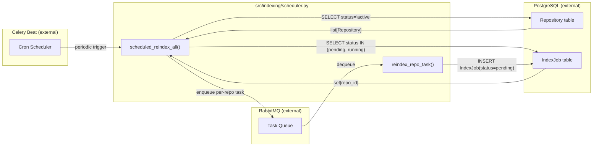
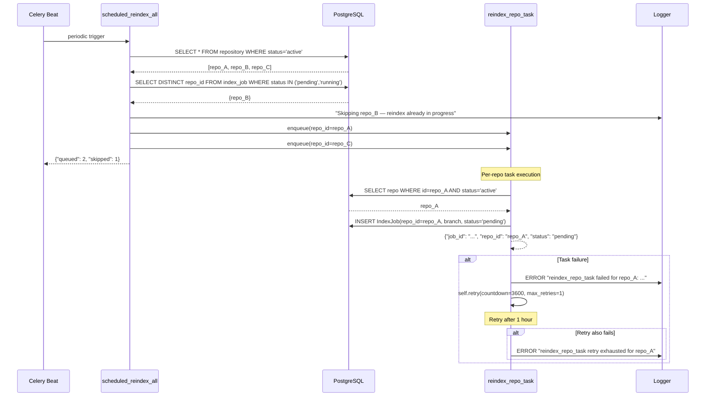
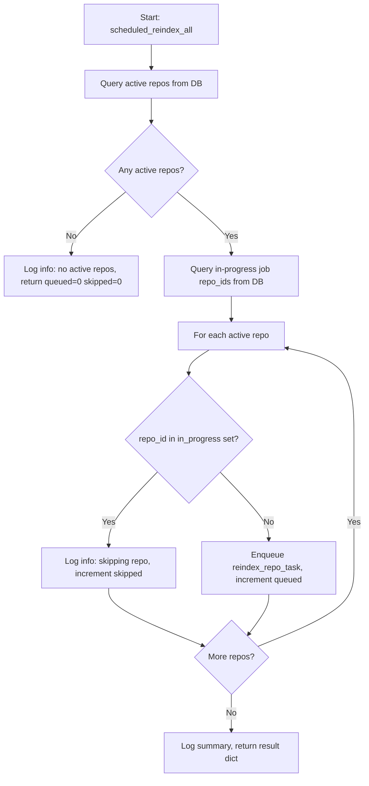
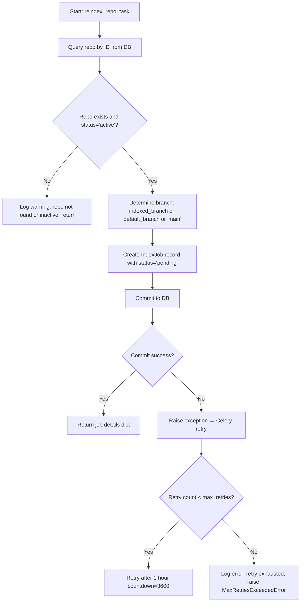

# Feature Detailed Design: Scheduled Index Refresh (Feature #21)

**Date**: 2026-03-22
**Feature**: #21 — Scheduled Index Refresh
**Priority**: high
**Dependencies**: #4 (Git Clone & Update)
**Design Reference**: docs/plans/2026-03-21-code-context-retrieval-design.md § 4.1 (Indexing Pipeline), § 3.2 (Architecture — Celery Beat)
**SRS Reference**: FR-019

## Context

Implement a Celery Beat periodic task that triggers re-indexing for all registered repositories on a configurable cron schedule (default: weekly Sunday 02:00 UTC). The scheduler must handle failures with retry-once-after-1-hour logic, skip repositories with in-progress indexing jobs, and create IndexJob records in PostgreSQL for tracking.

## Design Alignment

**Architecture** (from § 3.2): Celery Beat is a standalone scheduler process that publishes periodic task messages to RabbitMQ. Celery Workers consume these messages and execute the indexing pipeline.

**Key classes**:
- `SchedulerTask` (new) — Celery task class containing the periodic refresh logic
- `celery_app` (new) — Celery application instance with Beat schedule configuration
- `IndexJob` (existing) — tracks job lifecycle in PostgreSQL
- `Repository` (existing) — registered repos with `status`, `last_indexed_at`

**Interaction flow**: Celery Beat fires cron → publishes `scheduled_reindex_all` task → Worker picks up → queries active repos from DB → for each repo: checks for in-progress jobs, creates IndexJob if none → enqueues individual repo reindex tasks

**Third-party deps**: Celery 5.4.x (already in pyproject.toml), RabbitMQ (external)

**Deviations**: None

## SRS Requirement

### FR-019: Scheduled Index Refresh

**Priority**: Must
**EARS**: While the system is running, the system shall execute repository re-indexing jobs on a configurable cron schedule, defaulting to weekly (Sunday 02:00 UTC).
**Acceptance Criteria**:
- Given the default configuration, when a week has elapsed since the last index, then the scheduler shall automatically trigger re-indexing for all registered repositories.
- Given a custom cron expression configured for a specific repository, when the cron fires, then that repository shall be re-indexed.
- Given a scheduled job that fails, then the system shall log the failure and retry once after 1 hour; if the retry also fails, the system shall log an error and skip until the next scheduled window.
- Given a re-index already in progress for a repository when the schedule fires, then the system shall skip the duplicate and log an informational message.

**Verification Steps** (from feature-list.json):
- VS-1: Given the default cron configuration, when the scheduler fires, then it queues re-indexing jobs for all registered repositories with status='active'
- VS-2: Given a scheduled job that fails, when the failure is detected, then the system retries once after 1 hour; if retry also fails, it logs an error and skips until next window
- VS-3: Given a re-index already in progress for a repository, when the schedule fires, then it skips the duplicate and logs an informational message

## Component Data-Flow Diagram



## Interface Contract

| Method | Signature | Preconditions | Postconditions | Raises |
|--------|-----------|---------------|----------------|--------|
| `create_celery_app` | `create_celery_app(broker_url: str, schedule_cron: str \| None = None) -> Celery` | `broker_url` is a valid AMQP URL | Returns configured Celery app with beat_schedule containing `scheduled-reindex-all` entry using the provided or default cron (Sunday 02:00 UTC) | `ValueError` if `broker_url` is empty |
| `scheduled_reindex_all` | `scheduled_reindex_all() -> dict` | DB is reachable; Celery app is configured | Queries all repos with `status='active'`, skips repos with in-progress jobs (status `pending` or `running` in IndexJob), enqueues `reindex_repo_task` for eligible repos. Returns `{"queued": int, "skipped": int, "repos_queued": list[str]}` | None (logs errors, never raises) |
| `reindex_repo_task` | `reindex_repo_task(repo_id: str) -> dict` | `repo_id` exists in DB with `status='active'` | Creates IndexJob record with `status='pending'` for the repo. Returns `{"job_id": str, "repo_id": str, "status": str}` | `MaxRetriesExceededError` after 1 retry on failure (logged, not propagated to caller) |

**Design rationale**:
- `scheduled_reindex_all` never raises — it's a periodic task that must not crash the Beat scheduler. Errors are logged per-repo.
- `reindex_repo_task` uses Celery's built-in retry with `max_retries=1` and `countdown=3600` (1 hour) per SRS VS-2.
- Skipping in-progress repos is checked at the orchestrator level (`scheduled_reindex_all`) rather than in the per-repo task, to avoid unnecessary task enqueuing.
- The cron schedule is configurable via `REINDEX_CRON` env var (Celery `crontab` kwargs string).

## Internal Sequence Diagram



## Algorithm / Core Logic

### scheduled_reindex_all

#### Flow Diagram



#### Pseudocode

```
FUNCTION scheduled_reindex_all() -> dict
  // Step 1: Get all active repositories
  session = get_sync_session()
  active_repos = session.query(Repository).filter(status='active').all()

  IF active_repos is empty THEN
    log.info("No active repositories to reindex")
    RETURN {"queued": 0, "skipped": 0, "repos_queued": []}
  END

  // Step 2: Find repos with in-progress jobs
  in_progress_ids = session.query(IndexJob.repo_id).filter(
    IndexJob.status IN ('pending', 'running')
  ).distinct().all()
  in_progress_set = set(in_progress_ids)

  // Step 3: Enqueue eligible repos
  queued = 0
  skipped = 0
  repos_queued = []
  FOR repo IN active_repos
    IF repo.id IN in_progress_set THEN
      log.info(f"Skipping {repo.name} — reindex already in progress")
      skipped += 1
    ELSE
      reindex_repo_task.delay(str(repo.id))
      queued += 1
      repos_queued.append(str(repo.id))
    END
  END

  log.info(f"Scheduled reindex: queued={queued}, skipped={skipped}")
  RETURN {"queued": queued, "skipped": skipped, "repos_queued": repos_queued}
END
```

#### Boundary Decisions

| Parameter | Min | Max | Empty/Null | At boundary |
|-----------|-----|-----|------------|-------------|
| active_repos | 0 repos | unbounded | Return `{"queued": 0, "skipped": 0}` | 0 repos: early return; 1 repo: single enqueue |
| in_progress_set | 0 repos | equals active_repos count | All repos queued | All in-progress: all skipped, 0 queued |

#### Error Handling

| Condition | Detection | Response | Recovery |
|-----------|-----------|----------|----------|
| DB unreachable | SQLAlchemy OperationalError on query | Log error, return `{"queued": 0, "skipped": 0, "error": str}` | Beat will retry on next schedule window |
| Single repo enqueue fails | Exception from `.delay()` | Log error for that repo, continue to next | Other repos still get queued |

### reindex_repo_task

#### Flow Diagram



#### Pseudocode

```
FUNCTION reindex_repo_task(repo_id: str) -> dict
  // Step 1: Look up repository
  session = get_sync_session()
  repo = session.query(Repository).filter(id=UUID(repo_id), status='active').first()

  IF repo is None THEN
    log.warning(f"Repo {repo_id} not found or not active, skipping")
    RETURN {"job_id": None, "repo_id": repo_id, "status": "skipped"}
  END

  // Step 2: Determine branch
  branch = repo.indexed_branch OR repo.default_branch OR "main"

  // Step 3: Create IndexJob
  TRY
    job = IndexJob(repo_id=repo.id, branch=branch, status="pending")
    session.add(job)
    session.commit()
    log.info(f"Created reindex job {job.id} for repo {repo.name}")
    RETURN {"job_id": str(job.id), "repo_id": repo_id, "status": "pending"}
  CATCH Exception as exc
    session.rollback()
    log.error(f"Failed to create reindex job for {repo_id}: {exc}")
    RAISE self.retry(exc=exc, countdown=3600, max_retries=1)
  END
END
```

#### Boundary Decisions

| Parameter | Min | Max | Empty/Null | At boundary |
|-----------|-----|-----|------------|-------------|
| repo_id | valid UUID string | valid UUID string | Log warning, return skipped | Non-existent UUID: return skipped |
| branch | "main" (fallback) | any string | Falls back to "main" | repo.indexed_branch=None AND default_branch=None → "main" |

#### Error Handling

| Condition | Detection | Response | Recovery |
|-----------|-----------|----------|----------|
| Repo not found | query returns None | Log warning, return `{"status": "skipped"}` | No retry needed |
| Repo not active | query with status='active' filter returns None | Same as not found | No retry needed |
| DB commit failure | SQLAlchemy exception on commit | Rollback, raise with Celery retry | Retry once after 1 hour |
| Retry exhausted | `MaxRetriesExceededError` from Celery | Log error | Skip until next schedule window |

### create_celery_app

#### Pseudocode

```
FUNCTION create_celery_app(broker_url: str, schedule_cron: str | None = None) -> Celery
  IF NOT broker_url THEN
    RAISE ValueError("broker_url must not be empty")
  END

  app = Celery("indexing", broker=broker_url)

  // Parse cron or use default (Sunday 02:00 UTC)
  IF schedule_cron is not None THEN
    cron_kwargs = parse_cron_string(schedule_cron)  // "minute hour day_of_week" etc.
  ELSE
    cron_kwargs = {"minute": 0, "hour": 2, "day_of_week": "sunday"}
  END

  app.conf.beat_schedule = {
    "scheduled-reindex-all": {
      "task": "src.indexing.scheduler.scheduled_reindex_all",
      "schedule": crontab(**cron_kwargs),
    }
  }
  app.conf.timezone = "UTC"

  RETURN app
END
```

#### Boundary Decisions

| Parameter | Min | Max | Empty/Null | At boundary |
|-----------|-----|-----|------------|-------------|
| broker_url | 1 char | unbounded | Raises ValueError | Empty string: raises ValueError |
| schedule_cron | valid cron string | valid cron string | Uses default (Sunday 02:00 UTC) | None: default schedule |

#### Error Handling

| Condition | Detection | Response | Recovery |
|-----------|-----------|----------|----------|
| Empty broker_url | `not broker_url` check | Raise ValueError | Caller must provide valid URL |
| Invalid cron string | Parsing failure | Raise ValueError with descriptive message | Caller must fix config |

## State Diagram

N/A — stateless feature. IndexJob state is managed by the existing IndexJob model (Feature #2). This feature only creates IndexJob records with `status='pending'`.

## Test Inventory

| ID | Category | Traces To | Input / Setup | Expected | Kills Which Bug? |
|----|----------|-----------|---------------|----------|-----------------|
| A1 | happy path | VS-1, FR-019 AC-1 | 3 repos with status='active', no in-progress jobs | `scheduled_reindex_all` returns `{"queued": 3, "skipped": 0}`, 3 `reindex_repo_task.delay()` calls | Missing repo query or wrong filter |
| A2 | happy path | VS-1 | 1 active repo, `reindex_repo_task` called | IndexJob created with correct `repo_id`, `branch`, `status='pending'` | Missing job creation |
| A3 | happy path | VS-1 | Repo with `indexed_branch='develop'` | Job created with `branch='develop'` | Wrong branch selection logic |
| A4 | happy path | VS-1 | Repo with `indexed_branch=None`, `default_branch='main'` | Job created with `branch='main'` | Missing fallback chain |
| B1 | error | VS-2, FR-019 AC-3 | `reindex_repo_task` DB commit raises exception | Task calls `self.retry(countdown=3600, max_retries=1)` | Missing retry on failure |
| B2 | error | VS-2 | Retry also fails (MaxRetriesExceededError) | Error logged, exception not propagated to caller | Crash on retry exhaustion |
| B3 | error | §Interface Contract | `reindex_repo_task` with non-existent repo_id | Returns `{"status": "skipped"}`, logs warning | Crash on missing repo |
| B4 | error | §Interface Contract | `reindex_repo_task` with inactive repo (status='pending') | Returns `{"status": "skipped"}` | Processing inactive repos |
| B5 | error | §Interface Contract | `create_celery_app` with empty broker_url | Raises `ValueError` | Silent failure on bad config |
| B6 | error | §Algorithm Error Handling | DB unreachable in `scheduled_reindex_all` | Logs error, returns `{"queued": 0, "skipped": 0}` with error | Crash on DB failure |
| C1 | boundary | §Algorithm Boundary | 0 active repos | Returns `{"queued": 0, "skipped": 0, "repos_queued": []}` | Crash on empty repo list |
| C2 | boundary | §Algorithm Boundary | All active repos have in-progress jobs | Returns `{"queued": 0, "skipped": N}`, no tasks enqueued | Enqueueing despite in-progress |
| C3 | boundary | VS-3, FR-019 AC-4 | 2 active repos, 1 with in-progress job | Skips 1, queues 1, logs skip message | Missing skip logic |
| C4 | boundary | §Algorithm Boundary | Repo with `indexed_branch=None`, `default_branch=None` | Falls back to `branch='main'` | Missing final fallback |
| D1 | config | §Interface Contract | `create_celery_app` with custom cron `"0 4 * * *"` | Beat schedule uses `crontab(minute=0, hour=4)` | Ignoring custom cron |
| D2 | config | §Interface Contract | `create_celery_app` with `schedule_cron=None` | Beat schedule uses default Sunday 02:00 UTC | Wrong default schedule |
| D3 | config | §Interface Contract | Invalid cron string `"invalid"` | Raises `ValueError` | Silent bad cron acceptance |

**Negative ratio**: 12/17 = 70% (B1-B6, C1-C4, D3, B3 = 12 negative tests out of 17 total) ✓ >= 40%

## Tasks

### Task 1: Write failing tests
**Files**: `tests/test_scheduler.py`
**Steps**:
1. Create test file with imports: `pytest`, `unittest.mock` (Mock, patch, MagicMock), UUID
2. Write tests for all 17 rows in Test Inventory:
   - A1: Mock DB session returning 3 active repos, mock `reindex_repo_task.delay`, assert called 3 times
   - A2: Call `reindex_repo_task` with valid repo, assert IndexJob created
   - A3: Repo with `indexed_branch='develop'`, assert job `branch='develop'`
   - A4: Repo with `indexed_branch=None, default_branch='main'`, assert job `branch='main'`
   - B1: Mock DB commit to raise, assert `self.retry(countdown=3600, max_retries=1)` called
   - B2: Mock retry to raise MaxRetriesExceededError, assert error logged
   - B3: Mock DB query returning None, assert returns `{"status": "skipped"}`
   - B4: Repo with status='pending', assert returns `{"status": "skipped"}`
   - B5: Call `create_celery_app("")`, assert raises ValueError
   - B6: Mock DB query to raise OperationalError, assert returns with error
   - C1: Empty active repos list, assert returns `{"queued": 0, "skipped": 0}`
   - C2: All repos in-progress, assert queued=0 skipped=N
   - C3: 2 repos, 1 in-progress, assert queued=1 skipped=1
   - C4: Repo with both branch fields None, assert branch='main'
   - D1: Custom cron string, assert beat_schedule correct
   - D2: Default cron (None), assert Sunday 02:00 UTC
   - D3: Invalid cron string, assert raises ValueError
3. Run: `pytest tests/test_scheduler.py -v`
4. **Expected**: All tests FAIL (ImportError — module doesn't exist yet)

### Task 2: Implement minimal code
**Files**: `src/indexing/celery_app.py`, `src/indexing/scheduler.py`
**Steps**:
1. Create `src/indexing/celery_app.py`: `create_celery_app()` function per Algorithm pseudocode, with cron parsing and beat_schedule config
2. Create `src/indexing/scheduler.py`: `scheduled_reindex_all` and `reindex_repo_task` Celery tasks per Algorithm pseudocode
3. Use synchronous SQLAlchemy sessions (Celery workers are sync) — create `get_sync_session()` helper or use `sqlalchemy.create_engine` (sync)
4. Run: `pytest tests/test_scheduler.py -v`
5. **Expected**: All tests PASS

### Task 3: Coverage Gate
1. Run: `pytest --cov=src --cov-branch --cov-report=term-missing tests/`
2. Check thresholds: line >= 90%, branch >= 80%
3. Record coverage output as evidence.

### Task 4: Refactor
1. Clean up any code duplication between `celery_app.py` and `scheduler.py`
2. Ensure logging messages are consistent and informative
3. Run full test suite. All tests PASS.

### Task 5: Mutation Gate
1. Run: `mutmut run --paths-to-mutate=src/indexing/celery_app.py,src/indexing/scheduler.py`
2. Check threshold: mutation score >= 80%
3. If below: strengthen assertions, add edge case tests.
4. Record mutation output as evidence.

### Task 6: Create example
1. Create `examples/19-scheduled-index-refresh.py`
2. Update `examples/README.md`
3. Run example to verify.

## Verification Checklist
- [x] All verification_steps traced to Interface Contract postconditions (VS-1→scheduled_reindex_all+reindex_repo_task, VS-2→reindex_repo_task retry, VS-3→scheduled_reindex_all skip logic)
- [x] All verification_steps traced to Test Inventory rows (VS-1→A1/A2/A3/A4, VS-2→B1/B2, VS-3→C3)
- [x] Algorithm pseudocode covers all non-trivial methods (scheduled_reindex_all, reindex_repo_task, create_celery_app)
- [x] Boundary table covers all algorithm parameters
- [x] Error handling table covers all Raises entries
- [x] Test Inventory negative ratio >= 40% (70%)
- [x] Every skipped section has explicit "N/A — [reason]" (State Diagram: stateless feature)
