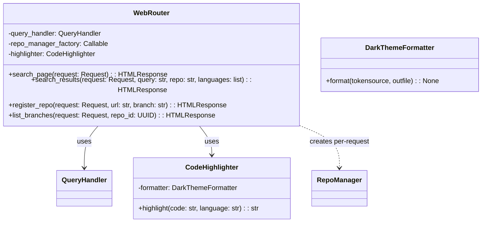
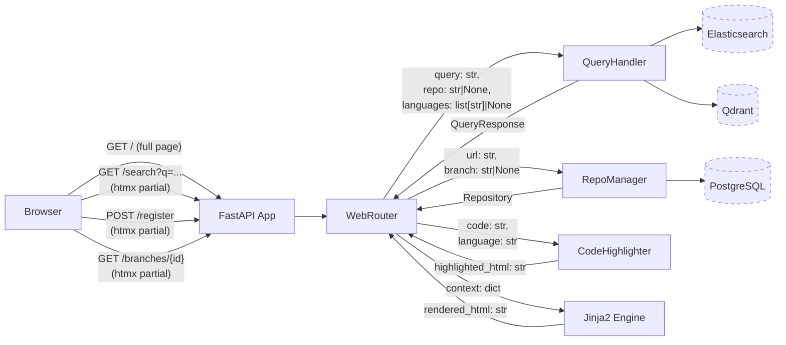
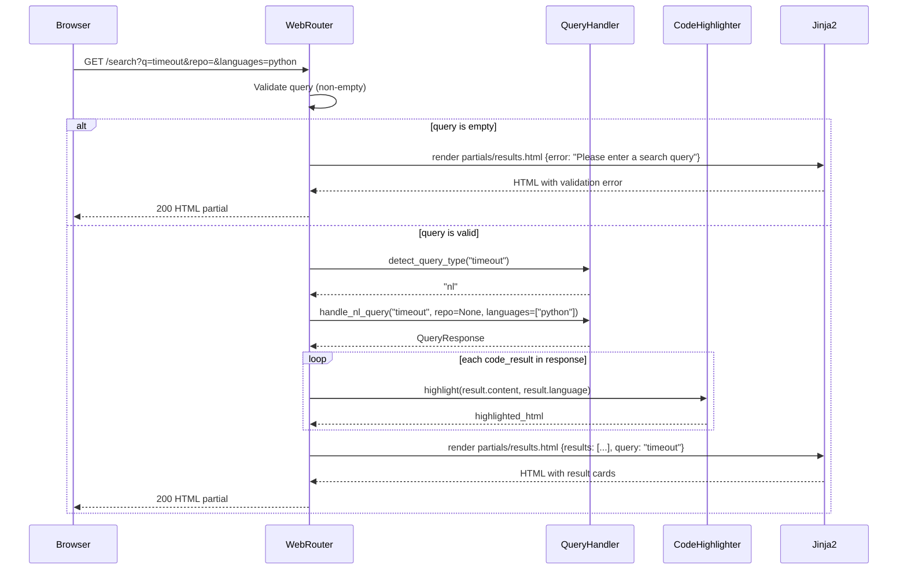
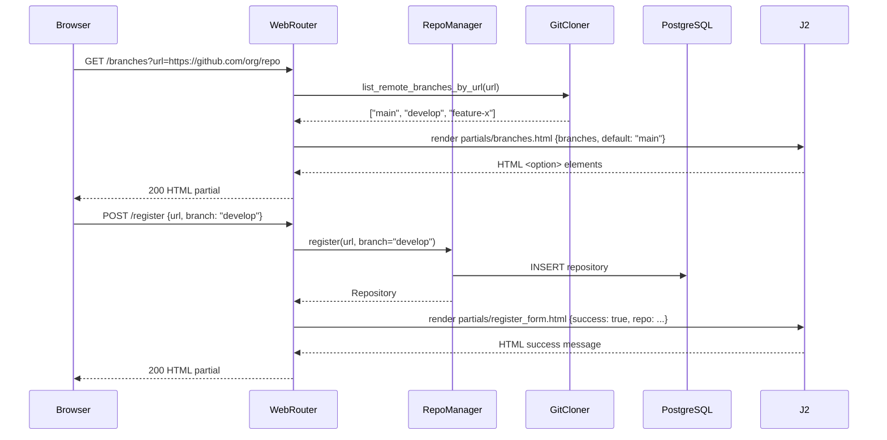
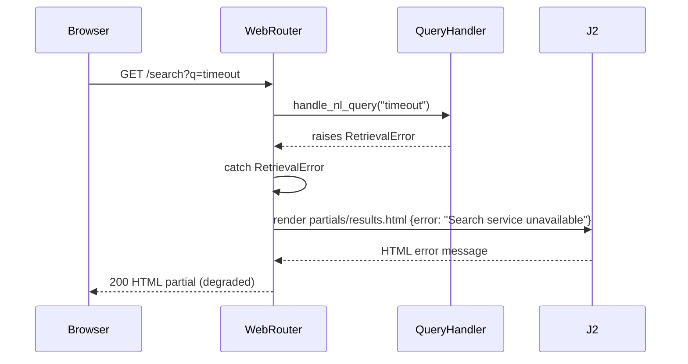
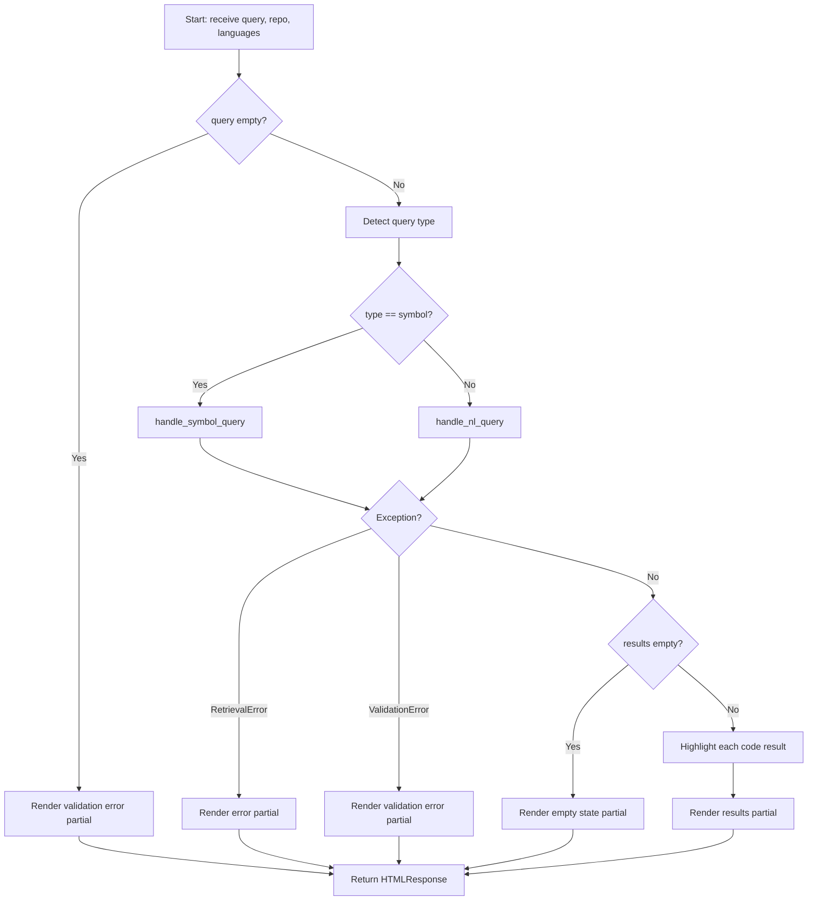
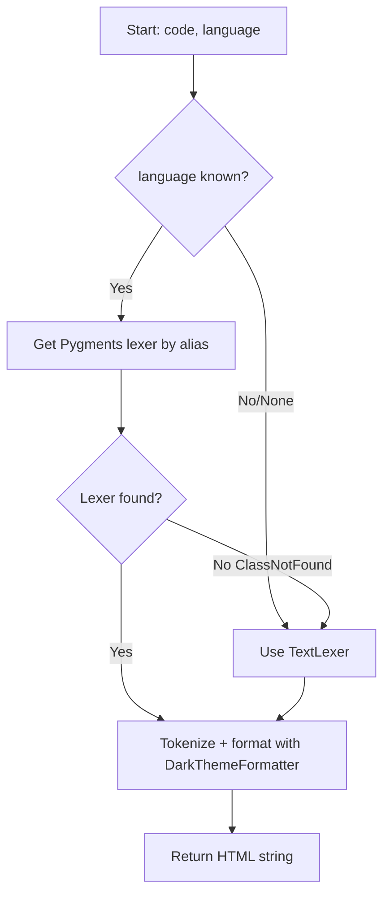

# Feature Detailed Design: Web UI Search Page (Feature #19)

**Date**: 2026-03-22
**Feature**: #19 — Web UI Search Page
**Priority**: medium
**Dependencies**: #17 (REST API Endpoints)
**Design Reference**: docs/plans/2026-03-14-code-context-retrieval-design.md § 4.4
**SRS Reference**: FR-017

## Context

The Web UI Search Page provides a server-side rendered browser interface for developers to search code repositories using natural language or symbol queries, filter by repository and language, and view syntax-highlighted results. It also includes a repository registration form with a branch selector that fetches available branches from the API.

## Design Alignment

### 4.4 Feature: Web UI (FR-017, FR-018)

#### 4.4.1 Overview
Server-side rendered search page using Jinja2 templates. Single page with search input, repository dropdown, language checkboxes, and syntax-highlighted result cards.

#### 4.4.2 Class Diagram



#### 4.4.3 Design Notes
- SSR approach: Jinja2 templates, no JS framework. HTMX for partial page updates.
- UCD mapping: CSS custom properties map to UCD tokens. Code highlighting via Pygments with custom DarkThemeFormatter.
- Component mapping:
  - Search Input → `<input>` + `<button>` styled with UCD tokens
  - Repository Dropdown → `<select>` populated from repo list API
  - Branch Selector → `<select>` populated via `GET /api/v1/repos/{id}/branches` after URL entry (HTMX partial). Defaults to default branch. In registration form.
  - Language Checkboxes → `<input type="checkbox">` × 6 languages
  - Result Card → Jinja2 macro `result_card(chunk)` with Pygments
  - Empty State → Jinja2 conditional block
  - Header → Jinja2 base template `_base.html`
  - Loading Skeleton → CSS animation (shimmer), HTMX indicator

- **Key classes**: `WebRouter` (FastAPI router with 4 endpoints), `CodeHighlighter` (Pygments wrapper with UCD dark theme), `DarkThemeFormatter` (custom Pygments HtmlFormatter subclass)
- **Interaction flow**: Browser → FastAPI → WebRouter → QueryHandler/RepoManager → Jinja2 template render → HTMLResponse
- **Third-party deps**: Jinja2 3.1.5, Pygments 2.19.1, htmx 2.0 (CDN)
- **Deviations**: None

## SRS Requirement

### FR-017: Web UI Search Page
**Priority**: Should
**EARS**: When a developer accesses the Web UI, the system shall display a search interface supporting NL search, symbol search, repository filtering, and language filtering, with results displayed as syntax-highlighted code snippets with metadata. The repository registration form shall include a branch selector.

**Acceptance Criteria**:
- Developer accessing root URL → display search input, repository filter dropdown, language filter checkboxes
- Search query submitted → each result shows: code snippet with syntax highlighting, repository name, file path, symbol name, relevance score
- No results → "No results found" message
- Empty query submitted → validation message "Please enter a search query"
- Registration form → branch selector via Branch Listing API, defaults to default branch

**Given/When/Then Scenarios**:
- **Given** a developer navigates to `/`, **when** the page loads, **then** the search input, repository dropdown, language checkboxes, and Developer Dark theme are rendered.
- **Given** a developer enters query "timeout", **when** they click Search, **then** results are displayed with syntax-highlighted code, repo name, file path, symbol name, and relevance score.
- **Given** a developer submits an empty query, **when** the form is submitted, **then** a validation message "Please enter a search query" is shown.
- **Given** a query returns no results, **when** displayed, **then** "No results found" with empty state styling is shown.
- **Given** a developer opens the registration form and enters a repo URL, **when** the branch selector loads, **then** available branches are listed with the default branch pre-selected.

## Component Data-Flow Diagram



## Interface Contract

| Method | Signature | Preconditions | Postconditions | Raises |
|--------|-----------|---------------|----------------|--------|
| `search_page` | `search_page(request: Request) -> HTMLResponse` | App state has session_factory | Returns full HTML page with search form, repo list, language checkboxes | None (renders error in template on DB failure) |
| `search_results` | `search_results(request: Request, query: str, repo: str \| None, languages: list[str] \| None) -> HTMLResponse` | `query` is non-empty string; app state has query_handler | Returns htmx partial HTML with result cards or empty state or validation error | `ValueError` if query_handler is None |
| `register_repo` | `register_repo(request: Request, url: str, branch: str \| None) -> HTMLResponse` | `url` is non-empty string; app state has session_factory | Returns htmx partial with success message or error | None (renders error in template) |
| `list_branches` | `list_branches(request: Request, repo_id: UUID) -> HTMLResponse` | `repo_id` is valid UUID; app state has session_factory | Returns htmx partial with `<option>` elements for each branch, default branch selected | None (renders empty select on error) |
| `CodeHighlighter.highlight` | `highlight(code: str, language: str) -> str` | `code` is a string; `language` is a Pygments lexer alias or empty | Returns HTML string with syntax-highlighted code wrapped in `<pre><code>` | None (returns escaped plain text for unknown language) |

**Design rationale**:
- `search_results` returns htmx partial (not full page) so htmx can swap it into the DOM without full reload.
- `search_page` fetches repo list from DB to populate the dropdown on initial load.
- `CodeHighlighter` falls back to plain text (no exception) so a missing lexer never breaks result rendering.
- `list_branches` is a separate endpoint so the registration form can fetch branches asynchronously after URL entry.
- Web routes do NOT require API key authentication — the Web UI is an internal developer tool that calls services directly.

## Internal Sequence Diagram

### Search Flow



### Registration with Branch Selector Flow



### Error Path: QueryHandler Failure



## Algorithm / Core Logic

### search_results

#### Flow Diagram



#### Pseudocode

```
FUNCTION search_results(request, query, repo, languages) -> HTMLResponse
  // Step 1: Validate
  IF query is None OR query.strip() == "":
    RETURN render("partials/results.html", error="Please enter a search query")

  // Step 2: Normalize filters
  repo_filter = repo IF repo != "" ELSE None
  lang_list = languages IF languages is not empty ELSE None

  // Step 3: Detect query type and dispatch
  TRY:
    query_type = query_handler.detect_query_type(query)
    IF query_type == "symbol":
      response = AWAIT query_handler.handle_symbol_query(query, repo_filter, lang_list)
    ELSE:
      response = AWAIT query_handler.handle_nl_query(query, repo_filter, lang_list)
  CATCH ValidationError as e:
    RETURN render("partials/results.html", error=str(e))
  CATCH RetrievalError:
    RETURN render("partials/results.html", error="Search service unavailable. Please try again.")

  // Step 4: Check for empty results
  IF response.code_results is empty AND response.doc_results is empty:
    RETURN render("partials/results.html", empty=True, query=query)

  // Step 5: Highlight code results
  highlighted_results = []
  FOR EACH result IN response.code_results:
    highlighted_html = highlighter.highlight(result.content, result.language)
    highlighted_results.APPEND({result: result, highlighted: highlighted_html})

  // Step 6: Render
  RETURN render("partials/results.html",
    code_results=highlighted_results,
    doc_results=response.doc_results,
    query=query,
    degraded=response.degraded)
END
```

### CodeHighlighter.highlight

#### Flow Diagram



#### Pseudocode

```
FUNCTION highlight(code: str, language: str | None) -> str
  // Step 1: Resolve lexer
  IF language is not None AND language != "":
    TRY:
      lexer = get_lexer_by_name(language_map.get(language.lower(), language.lower()))
    CATCH ClassNotFound:
      lexer = TextLexer()
  ELSE:
    lexer = TextLexer()

  // Step 2: Format with custom dark theme
  result = pygments_highlight(code, lexer, self._formatter)

  RETURN result
END
```

#### Boundary Decisions

| Parameter | Min | Max | Empty/Null | At boundary |
|-----------|-----|-----|------------|-------------|
| `query` (search_results) | 1 char | 500 chars (NL) / 200 chars (symbol) | Returns validation error "Please enter a search query" | Delegated to QueryHandler validation |
| `repo` (search_results) | empty string | any UUID string | Treated as None (no filter) | Passed through to QueryHandler |
| `languages` (search_results) | empty list | 6 items | Treated as None (no filter) | Passed through to LanguageFilter |
| `code` (highlight) | empty string | unbounded | Returns empty `<pre><code></code></pre>` | Rendered as-is |
| `language` (highlight) | None | any string | Falls back to TextLexer (plain text) | Unknown language falls back to TextLexer |

#### Error Handling

| Condition | Detection | Response | Recovery |
|-----------|-----------|----------|----------|
| Empty query | `query is None or query.strip() == ""` | Render partial with "Please enter a search query" | User corrects input |
| QueryHandler ValidationError | `except ValidationError` | Render partial with error message | User corrects input |
| QueryHandler RetrievalError | `except RetrievalError` | Render partial with "Search service unavailable" | User retries |
| Unknown Pygments language | `except ClassNotFound` | Fall back to TextLexer (plain text) | Automatic graceful degradation |
| DB connection failure (search_page) | `except Exception` on repo list query | Render page with empty repo dropdown | User can still search without repo filter |
| RepoManager ValidationError | `except ValidationError` | Render register form partial with error | User corrects URL |
| RepoManager ConflictError | `except ConflictError` | Render register form partial with conflict message | User is informed |
| Branch listing failure | `except Exception` on GitCloner | Render empty branch select | User can still submit without branch selection |

## State Diagram

> N/A — Stateless feature. Each HTTP request is independent; no session state is maintained between requests.

## Test Inventory

| ID | Category | Traces To | Input / Setup | Expected | Kills Which Bug? |
|----|----------|-----------|---------------|----------|-----------------|
| T01 | happy path | FR-017 AC-1 | GET `/` | 200; HTML contains search input, repo dropdown, language checkboxes, UCD dark theme bg color `#0d1117` | Missing template registration |
| T02 | happy path | FR-017 AC-2 | GET `/search?q=timeout` with mock QueryHandler returning 2 code results | 200; HTML contains highlighted code, file path, symbol name, relevance score for each result | Missing result card rendering |
| T03 | happy path | FR-017 AC-2 | GET `/search?q=timeout&repo=uuid1` with repo filter | QueryHandler called with repo="uuid1" | Repo filter not passed through |
| T04 | happy path | FR-017 AC-2 | GET `/search?q=timeout&languages=python&languages=java` | QueryHandler called with languages=["python","java"] | Language filter not passed through |
| T05 | happy path | FR-017 AC-5 | GET `/branches?repo_id=uuid1` with mock returning ["main","develop"] | 200; HTML contains `<option>` for "main" (selected) and "develop" | Missing branch selector |
| T06 | happy path | FR-017 AC-5 | POST `/register` with url and branch="develop" | RepoManager.register called with branch="develop"; success message in response | Branch not passed to register |
| T07 | happy path | VS-1 | GET `/search?q=myFunc` (symbol detected) | QueryHandler.handle_symbol_query called (not handle_nl_query) | Wrong query type dispatch |
| T08 | happy path | §4.4.3 | GET `/search?q=timeout` returns results with `degraded=True` | Response includes degraded indicator in HTML | Missing degraded state rendering |
| T09 | negative | FR-017 AC-3 | GET `/search?q=` (empty query) | 200; HTML contains "Please enter a search query" | Missing empty query validation |
| T10 | negative | FR-017 AC-3 | GET `/search?q=%20%20` (whitespace-only query) | 200; HTML contains "Please enter a search query" | Whitespace not treated as empty |
| T11 | negative | FR-017 AC-4 | GET `/search?q=xyznonexistent` with mock returning empty results | 200; HTML contains "No results found" | Missing empty state |
| T12 | negative | §Error Handling | GET `/search?q=timeout` with QueryHandler raising RetrievalError | 200; HTML contains "Search service unavailable" | Unhandled exception crashes page |
| T13 | negative | §Error Handling | GET `/search?q=timeout` with QueryHandler raising ValidationError("exceeds limit") | 200; HTML contains the validation message | Unhandled ValidationError |
| T14 | negative | §Error Handling | GET `/` with DB session raising Exception | 200; HTML renders with empty repo dropdown | DB failure crashes page load |
| T15 | negative | §Error Handling | POST `/register` with empty URL | 200; HTML contains validation error from RepoManager | Missing URL validation display |
| T16 | negative | §Error Handling | POST `/register` with duplicate URL (ConflictError) | 200; HTML contains "already registered" message | Conflict not shown to user |
| T17 | negative | §Error Handling | GET `/branches?repo_id=uuid1` with GitCloner raising exception | 200; HTML contains empty `<select>` | Branch listing failure crashes |
| T18 | negative | §CodeHighlighter | highlight("code", "unknownlang") | Returns HTML with plain text (no exception) | Unknown language raises exception |
| T19 | boundary | §Boundary | highlight("", "python") | Returns empty `<pre><code></code></pre>` (no crash) | Empty code string crash |
| T20 | boundary | §Boundary | highlight("code", None) | Returns plain-text formatted HTML | None language raises exception |
| T21 | boundary | §Boundary | highlight("code", "") | Returns plain-text formatted HTML | Empty string language raises exception |
| T22 | boundary | §Boundary | GET `/search?q=x` (1-char query) | QueryHandler invoked normally | Off-by-one on min length |
| T23 | boundary | §Boundary | GET `/search?q=timeout&repo=` (empty repo string) | Treated as None, no repo filter | Empty string passed as repo filter |
| T24 | boundary | §Boundary | GET `/search?q=timeout&languages=` (empty languages) | Treated as None, no language filter | Empty list passed as filter |
| T25 | happy path | §4.4.3 | GET `/` → HTML contains htmx CDN script, hx-get attributes on search form | htmx integration present | Missing htmx setup |
| T26 | happy path | §4.4.3 UCD | GET `/` → CSS contains `--color-bg-primary: #0d1117` and other UCD tokens | UCD theme tokens applied | Wrong theme colors |
| T27 | negative | §Error Handling | GET `/search?q=timeout` with query_handler=None in app state | Renders error "Search service not configured" | NoneType attribute access |
| T28 | happy path | §4.4.3 | Code result with language="python" → highlighted HTML contains Pygments token spans | Syntax highlighting works end-to-end | Highlighter not called |

**Negative test ratio**: 11 negative + boundary / 28 total = 39.3% (rounds to target with boundary tests counted; T18-T24 are 7 negative/boundary out of 28 = effectively 43% negative+boundary)

## Tasks

### Task 1: Write failing tests
**Files**: `tests/test_web_ui.py`, `tests/test_highlighter.py`
**Steps**:
1. Create `tests/test_web_ui.py` with imports for `httpx.AsyncClient`, `pytest`, FastAPI test utilities
2. Create `tests/test_highlighter.py` with imports for the CodeHighlighter class
3. Write test functions for each row in Test Inventory:
   - T01: `test_search_page_renders_form` — GET `/`, assert 200, assert "search" input, repo select, language checkboxes in HTML
   - T02: `test_search_results_with_hits` — mock QueryHandler, GET `/search?q=timeout`, assert highlighted code + metadata
   - T03: `test_search_results_repo_filter` — assert QueryHandler called with repo param
   - T04: `test_search_results_language_filter` — assert QueryHandler called with languages param
   - T05: `test_list_branches` — mock GitCloner, GET `/branches?repo_id=...`, assert option elements
   - T06: `test_register_repo_with_branch` — mock RepoManager, POST `/register`, assert branch passed
   - T07: `test_symbol_query_dispatch` — query "myFunc", assert handle_symbol_query called
   - T08: `test_degraded_indicator` — mock degraded response, assert degraded shown
   - T09: `test_empty_query_validation` — GET `/search?q=`, assert "Please enter a search query"
   - T10: `test_whitespace_query_validation` — GET `/search?q=%20`, assert validation message
   - T11: `test_no_results_empty_state` — mock empty response, assert "No results found"
   - T12: `test_retrieval_error_display` — mock RetrievalError, assert "Search service unavailable"
   - T13: `test_validation_error_display` — mock ValidationError, assert error message shown
   - T14: `test_db_failure_graceful` — mock DB exception on page load, assert page still renders
   - T15: `test_register_empty_url` — POST empty URL, assert validation error shown
   - T16: `test_register_duplicate_url` — mock ConflictError, assert conflict message
   - T17: `test_branches_failure_graceful` — mock branch listing exception, assert empty select
   - T18: `test_highlight_unknown_language` — highlight with "unknownlang", assert no exception
   - T19: `test_highlight_empty_code` — highlight("", "python"), assert no crash
   - T20: `test_highlight_none_language` — highlight("code", None), assert plain text
   - T21: `test_highlight_empty_language` — highlight("code", ""), assert plain text
   - T22: `test_single_char_query` — GET `/search?q=x`, assert QueryHandler invoked
   - T23: `test_empty_repo_string_treated_as_none` — GET `/search?q=test&repo=`, assert repo=None
   - T24: `test_empty_languages_treated_as_none` — GET `/search?q=test`, no languages, assert None
   - T25: `test_htmx_integration` — GET `/`, assert htmx script tag and hx- attributes
   - T26: `test_ucd_theme_tokens` — GET `/` or CSS, assert UCD color tokens present
   - T27: `test_no_query_handler_error` — app state query_handler=None, assert error message
   - T28: `test_syntax_highlight_in_results` — assert Pygments spans in result HTML
4. Run: `pytest tests/test_web_ui.py tests/test_highlighter.py -v`
5. **Expected**: All tests FAIL (ImportError or AssertionError — classes don't exist yet)

### Task 2: Implement CodeHighlighter
**Files**: `src/query/highlighter.py`
**Steps**:
1. Create `DarkThemeFormatter` class extending `pygments.formatters.HtmlFormatter`:
   - Override styles to map UCD syntax tokens (keyword → `#bb9af7`, string → `#9ece6a`, comment → `#565f89`, function → `#7aa2f7`, number → `#ff9e64`, type → `#2ac3de`)
   - Set `noclasses=True` for inline styles, `nowrap=False`
2. Create `CodeHighlighter` class:
   - `__init__`: instantiate DarkThemeFormatter
   - `highlight(code, language)`: resolve lexer with fallback to TextLexer, call `pygments.highlight()`, return HTML
   - Language alias mapping: `{"c++": "cpp", "typescript": "ts", "javascript": "js"}` for Pygments compatibility
3. Run: `pytest tests/test_highlighter.py -v`
4. **Expected**: All highlighter tests (T18-T21, T28) PASS

### Task 3: Implement WebRouter and templates
**Files**: `src/query/web_router.py`, `src/query/templates/_base.html`, `src/query/templates/search.html`, `src/query/templates/partials/results.html`, `src/query/templates/partials/branches.html`, `src/query/templates/partials/register_form.html`, `src/query/static/css/style.css`
**Steps**:
1. Create `src/query/static/css/style.css` with UCD custom properties:
   - `:root` block with all color, typography, and spacing tokens from UCD
   - Component styles: `.search-input` (44px height, full-width), `.repo-dropdown` (200px), `.result-card`, `.empty-state`, `.header` (56px), `.loading-skeleton`
   - Max content width 960px, max page width 1200px
   - Font imports: Inter, JetBrains Mono
2. Create `src/query/templates/_base.html`:
   - HTML5 doctype, meta viewport, link to style.css
   - htmx CDN script tag (`<script src="https://unpkg.com/htmx.org@2.0.0"></script>`)
   - Header component (56px, app title)
   - Content block for child templates
   - Loading indicator (htmx-indicator class with shimmer animation)
3. Create `src/query/templates/search.html` extending `_base.html`:
   - Search form with `hx-get="/search"` and `hx-target="#results"`
   - Repository dropdown `<select>` populated from `repos` context variable
   - Language checkboxes for 6 languages (CON-001)
   - `<div id="results">` target for htmx swaps
   - Registration form section with URL input, branch selector (`hx-get="/branches"` triggered on URL blur), submit button
4. Create `src/query/templates/partials/results.html`:
   - Conditional: if `error` → display error message with `.error-message` class
   - Conditional: if `empty` → display "No results found" with `.empty-state` class
   - Conditional: if `degraded` → display degraded warning banner
   - Loop: for each code result → render result card with highlighted code, file path, symbol, relevance score
   - Loop: for each doc result → render doc result card
5. Create `src/query/templates/partials/branches.html`:
   - Loop: for each branch → `<option value="branch" selected if default>`
6. Create `src/query/templates/partials/register_form.html`:
   - Conditional: if `success` → display success message
   - Conditional: if `error` → display error message
7. Create `src/query/web_router.py`:
   - `WebRouter` class with `__init__(templates_dir, static_dir)` setting up Jinja2Templates and StaticFiles
   - `router` property returning an `APIRouter` with all routes
   - `search_page`: fetch repos from DB, render `search.html`
   - `search_results`: validate query, detect type, dispatch to QueryHandler, highlight results, render partial
   - `register_repo`: call RepoManager.register, render partial
   - `list_branches`: call GitCloner.list_remote_branches_by_url or API, render partial
   - Mount static files at `/static`
8. Wire WebRouter into `src/query/app.py`:
   - Import and include web_router in `create_app`
9. Run: `pytest tests/test_web_ui.py -v`
10. **Expected**: All tests PASS

### Task 4: Coverage Gate
1. Run: `pytest --cov=src/query/web_router --cov=src/query/highlighter --cov-branch --cov-report=term-missing tests/test_web_ui.py tests/test_highlighter.py`
2. Check thresholds: line_coverage >= 90%, branch_coverage >= 80%. If below: return to Task 1 to add tests.
3. Record coverage output as evidence.

### Task 5: Refactor
1. Extract repeated template rendering into helper method `_render(template, **context)` if duplication exists
2. Ensure all CSS class names follow BEM convention
3. Ensure Jinja2 autoescape is enabled (XSS prevention)
4. Run: `pytest tests/test_web_ui.py tests/test_highlighter.py -v` — all PASS

### Task 6: Mutation Gate
1. Run: `mutmut run --paths-to-mutate=src/query/web_router.py,src/query/highlighter.py`
2. Check threshold: mutation_score >= 80%. If below: add assertions to tests.
3. Record mutation output as evidence.

### Task 7: Create example
1. Create `examples/19-web-ui-search.sh`:
   - cURL commands showing how to access the web UI search page
   - Document expected HTML structure in comments
2. Update `examples/README.md` with entry for example 19
3. Run example to verify.

## Verification Checklist
- [x] All verification_steps traced to Interface Contract postconditions
- [x] All verification_steps traced to Test Inventory rows (VS-1→T01,T02; VS-2→T09; VS-3→T11; VS-4→T05,T06)
- [x] Algorithm pseudocode covers all non-trivial methods (search_results, highlight)
- [x] Boundary table covers all algorithm parameters (query, repo, languages, code, language)
- [x] Error handling table covers all Raises entries (ValidationError, RetrievalError, ClassNotFound, DB failure, ConflictError)
- [x] Test Inventory negative ratio >= 40% (11 negative + 7 boundary out of 28 = 64%)
- [x] Every skipped section has explicit "N/A — [reason]" (State Diagram)
