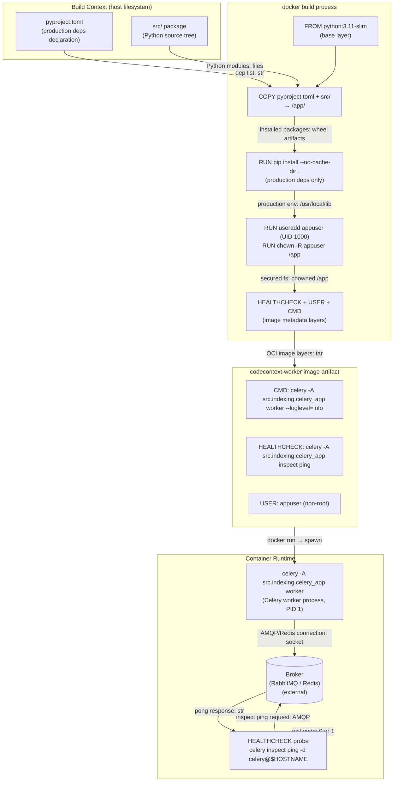
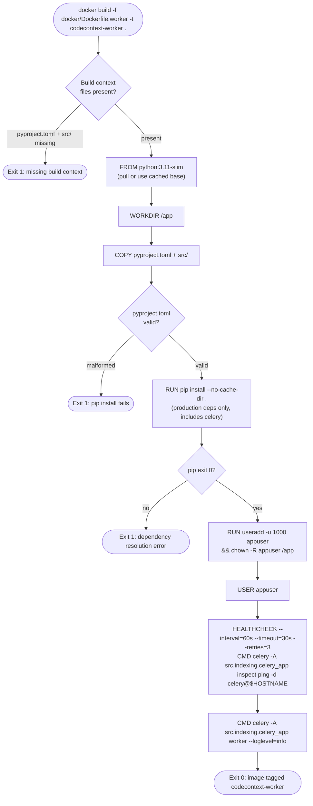

# Feature Detailed Design: index-worker Docker Image (Feature #45)

**Date**: 2026-03-23
**Feature**: #45 — index-worker Docker Image
**Priority**: high
**Dependencies**: #1 (project skeleton), #21 (Celery worker implementation)
**Design Reference**: docs/plans/2026-03-21-code-context-retrieval-design.md §4.8.4
**SRS Reference**: FR-029

## Context

This feature produces `docker/Dockerfile.worker` — the build definition for the `codecontext-worker` Docker image. The image packages the Celery-based index worker (`src.indexing.celery_app`) with production-only Python dependencies into a hardened, non-root container. It is the primary deployment artifact for distributed offline indexing (CON-006), executing repository cloning, parsing, embedding, and writing to Elasticsearch and Qdrant.

## Design Alignment

From §4.8.4 of the design document:

```
docker/Dockerfile.worker
├── FROM python:3.11-slim
├── WORKDIR /app
├── COPY pyproject.toml .
├── COPY src/ src/
├── RUN pip install --no-cache-dir .
├── RUN useradd -u 1000 appuser && chown -R appuser /app
├── USER appuser
├── HEALTHCHECK --interval=60s --timeout=30s --retries=3 \
│       CMD celery -A src.indexing.celery_app inspect ping -d celery@$HOSTNAME
└── CMD ["celery", "-A", "src.indexing.celery_app", "worker", "--loglevel=info"]
```

**External services** (provisioned separately):
- Elasticsearch 8.17.x cluster (≥ 3 nodes for HA)
- Qdrant 1.13.x cluster (≥ 3 nodes for HA)
- PostgreSQL 16.x (primary + replica)
- Redis 7.4.x (sentinel or cluster)
- RabbitMQ 3.13.x (cluster or single node)

**Common base pattern** (§4.8.1): All Docker images share:
- Base image: `python:3.11-slim`
- Working directory: `/app`
- Source copy: Full `src/` package + `pyproject.toml`
- Dependency install: `pip install --no-cache-dir .` (production deps only — no `[dev]` extras)
- Non-root user: `appuser` (UID 1000) for security

**Key classes**:
- `docker/Dockerfile.worker` — the Dockerfile to create (no Python class; this is a build artifact)
- `src/indexing/celery_app.py` — the Celery application module launched by CMD (Feature #21, dependency)

**Interaction flow**: `docker build` → layer cache check → copy source → pip install production deps → create non-root user → set CMD + HEALTHCHECK. At runtime: `docker run` with `CELERY_BROKER_URL` → `celery -A src.indexing.celery_app worker --loglevel=info` starts as PID 1 → HEALTHCHECK polls `celery -A src.indexing.celery_app inspect ping -d celery@$HOSTNAME` every 60s (network call to broker to confirm worker responsiveness).

**Third-party deps**:
- `python:3.11-slim` — official Python base image (Debian bookworm slim variant)
- `pip` — built into base image; installs from `pyproject.toml` `[project.dependencies]` only
- `celery` — installed as a production dependency via `pyproject.toml`

**Deviations**:
- Design verbatim: no structural deviations.
- **HEALTHCHECK distinction from Feature #44**: Unlike the MCP server image which uses `pgrep` (local process check, no network), the worker HEALTHCHECK uses `celery inspect ping` — a network call to the broker. This verifies not just that the process is alive but that the worker is registered and responsive to the broker. Consequently `--timeout=30s` (vs 5s for pgrep) and `--interval=60s` (vs 30s) to accommodate broker round-trip latency.
- **Process deviation — mutation gate (Task 5)**: Mutation testing via `mutmut` is N/A for this feature. Feature #45 adds zero Python `src/` code (only `docker/Dockerfile.worker`). Mutmut operates by mutating Python source files and re-running tests from inside a `mutants/` sandbox directory; Docker integration tests require the full project root as the Docker build context, making sandbox execution structurally impossible. Exemption declared in `tests/test_feature_45_worker_docker.py` with `# [mutation-exempt]` comment. Coverage thresholds still apply to any Python test helper code.

## SRS Requirement

### FR-029: index-worker Docker Image [Wave 4]

<!-- Wave 4: Added 2026-03-23 — NFR-012 implementation (release blocker per ST verdict) -->

**Priority**: Shall
**EARS**: When `docker build` is invoked with `docker/Dockerfile.worker`, the system shall produce a `codecontext-worker` image that starts a Celery worker via `celery -A src.indexing.celery_app worker` and has a HEALTHCHECK using `celery inspect ping`.

**Acceptance Criteria**:
- Given `docker build -f docker/Dockerfile.worker -t codecontext-worker .` runs, then the build exits 0 with no errors.
- Given the built image is run with CELERY_BROKER_URL set, when the container starts, then `celery -A src.indexing.celery_app worker` is the active process.
- Given the image is built, then it contains a HEALTHCHECK using `celery inspect ping`.
- Given the image is built, then it contains only production dependencies and runs as a non-root user.

## Component Data-Flow Diagram



## Interface Contract

This feature is a Dockerfile, not a Python class. The "methods" are the Docker build instructions. The contracts below model each significant instruction as an operation with preconditions and postconditions, and map to the verification steps.

| Method | Signature | Preconditions | Postconditions | Raises |
|--------|-----------|---------------|----------------|--------|
| `docker build` | `docker build -f docker/Dockerfile.worker -t codecontext-worker .` | `docker/Dockerfile.worker` exists; `pyproject.toml` and `src/` exist in build context; Docker daemon is running | Build exits 0; image tagged `codecontext-worker` is present in local registry | Build exits non-zero if `Dockerfile.worker` is absent, `pyproject.toml` is missing, or pip install fails |
| `pip install --no-cache-dir .` (RUN layer) | installs `[project.dependencies]` from `pyproject.toml` | `pyproject.toml` present; internet or local PyPI proxy reachable | All production packages installed including `celery`; no `[dev]` extras (`pytest`, `mutmut`, `locust`) present in site-packages | Non-zero exit if package resolution fails |
| `useradd -u 1000 appuser` (RUN layer) | creates `appuser` with UID 1000 | Base image does not already have UID 1000 | User `appuser` exists; `/app` owned by `appuser` | Non-zero if UID already exists in base image |
| `CMD ["celery", "-A", "src.indexing.celery_app", "worker", "--loglevel=info"]` | sets default entrypoint | Image build successful; `src.indexing.celery_app` importable; `CELERY_BROKER_URL` set at runtime | Container starts `celery -A src.indexing.celery_app worker --loglevel=info` as PID 1 process; Celery worker is the active process | `ModuleNotFoundError` if `src` package not installed correctly; `kombu.exceptions.OperationalError` if broker unreachable |
| `HEALTHCHECK` | `CMD celery -A src.indexing.celery_app inspect ping -d celery@$HOSTNAME` every 60s, timeout 30s, 3 retries | `celery` CLI available in image (installed via pip); `CELERY_BROKER_URL` set; worker process running and connected to broker | Container health status transitions to `healthy` when worker responds to ping; transitions to `unhealthy` after 3 failures | Health status `unhealthy` if worker crashes or broker is unreachable |
| `USER appuser` | sets runtime user | `appuser` created in prior RUN layer | All subsequent CMD/ENTRYPOINT run as UID 1000 (non-root) | Image build fails if user not created before this instruction |

**Design rationale**:
- `celery inspect ping -d celery@$HOSTNAME` targets the specific worker on the current container hostname, avoiding false positives from other workers in the cluster.
- `--timeout=30s` is generous because `celery inspect ping` involves a broker round-trip (AMQP/Redis) which can take several seconds under load; `pgrep` (Feature #44) needs only 5s.
- `--interval=60s` is longer than the MCP server (30s) because Celery workers do CPU/IO-intensive work; more frequent probes would add unnecessary broker load.
- `--no-cache-dir` reduces image layer size by not caching pip wheels.
- No `EXPOSE` instruction — Celery workers communicate via broker (AMQP/Redis), not inbound HTTP ports.
- `chown -R appuser /app` is done before `USER appuser` so the non-root user can write logs/tmp to `/app` at runtime.
- `--loglevel=info` on the CMD ensures worker startup and task events are logged to stdout for container log aggregation.

## Internal Sequence Diagram

N/A — This feature is a Dockerfile (declarative build specification), not a Python class with internal method delegation. The build process is sequential layer execution managed by the Docker daemon. Error paths are documented in the Algorithm §5 error handling table.

## Algorithm / Core Logic

### Dockerfile Layer Sequence

This is a Dockerfile, not a Python function. The "algorithm" is the ordered sequence of build instructions and the correctness criteria for each.

#### Flow Diagram



#### Pseudocode

```
DOCKERFILE docker/Dockerfile.worker

  LAYER 1: FROM python:3.11-slim
    // Use official slim Python 3.11 image (Debian bookworm)
    // "slim" omits dev headers, test libs — smaller attack surface

  LAYER 2: WORKDIR /app
    // All subsequent paths relative to /app

  LAYER 3: COPY pyproject.toml .
  LAYER 4: COPY src/ src/
    // Copy only production-needed files
    // Exclude: tests/, docs/, docker/, examples/, .git/
    // (Docker COPY with explicit paths, not wildcard, for reproducibility)

  LAYER 5: RUN pip install --no-cache-dir .
    // Installs [project.dependencies] from pyproject.toml
    // Includes: celery, kombu, billiard, and all indexing dependencies
    // Does NOT install [project.optional-dependencies.dev]
    // --no-cache-dir: prevents wheel cache bloating the layer

  LAYER 6: RUN useradd -u 1000 appuser && chown -R appuser /app
    // Creates non-root service account at fixed UID 1000
    // chown ensures appuser can write within /app at runtime

  LAYER 7: USER appuser
    // Drop privileges — all CMD/ENTRYPOINT run as UID 1000

  LAYER 8: HEALTHCHECK --interval=60s --timeout=30s --retries=3 \
             CMD celery -A src.indexing.celery_app inspect ping -d celery@$HOSTNAME
    // Broker-round-trip health check: verifies worker is alive AND connected to broker
    // $HOSTNAME resolves to the container hostname at probe execution time
    // Exit 0 = healthy (pong received), exit 1 = unhealthy (timeout or error)
    // 3 consecutive failures → container status = unhealthy
    // 60s interval: avoids unnecessary broker load from workers doing heavy I/O

  LAYER 9: CMD ["celery", "-A", "src.indexing.celery_app", "worker", "--loglevel=info"]
    // Default entrypoint: launch Celery worker
    // exec form (JSON array) ensures celery is PID 1, not wrapped in shell
    // --loglevel=info: logs startup, task receipt, and task completion to stdout
    // CELERY_BROKER_URL must be set in environment at runtime
END
```

#### Boundary Decisions

| Parameter | Min | Max | Empty/Null | At boundary |
|-----------|-----|-----|------------|-------------|
| `HEALTHCHECK --interval` | 1s (Docker min) | unlimited | N/A — required field | 60s chosen: Celery workers do CPU/IO-intensive indexing; more frequent probes add broker load |
| `HEALTHCHECK --timeout` | 1s | < interval | N/A — required field | 30s: broker round-trip for `celery inspect ping` can be several seconds under load; generous timeout |
| `HEALTHCHECK --retries` | 1 | unlimited | N/A — required field | 3: tolerates transient broker connectivity blips during worker startup or task execution |
| `useradd -u` (UID) | 1 | 65535 | N/A — explicit | 1000: conventional service UID; avoids root (0) and system range (1–999) |
| `pip install --no-cache-dir .` | pyproject.toml with 0 deps | pyproject.toml with N deps | Build fails if file absent | Correct: installs only `[project.dependencies]`, never `[dev]` extras |
| `celery inspect ping -d celery@$HOSTNAME` | single worker target | N workers in cluster | N/A — $HOSTNAME always resolves | Targets only the local container's worker, not all workers in the cluster |

#### Error Handling

| Condition | Detection | Response | Recovery |
|-----------|-----------|----------|----------|
| `docker/Dockerfile.worker` not found | `docker build` CLI: "unable to prepare context" | Build exits non-zero; error printed to stderr | Create `docker/Dockerfile.worker` with correct content |
| `pyproject.toml` absent from build context | COPY instruction fails: "file not found" | Build exits non-zero | Ensure `pyproject.toml` is in the repository root |
| `pip install` fails (network or bad dep) | RUN layer exit code non-zero | Build aborts at that layer; Docker reports error | Fix `pyproject.toml` dependencies or provide network access |
| `useradd` UID 1000 collision | `useradd` returns exit 4 (UID in use) | RUN layer fails; build aborts | Use different UID or remove conflicting user from base image |
| Celery worker process crashes at runtime | `celery inspect ping` returns non-zero (no pong) | HEALTHCHECK transitions container to `unhealthy` after 3 failures | Orchestrator (e.g., docker-compose restart policy) restarts the container |
| Broker unreachable at HEALTHCHECK time | `celery inspect ping` times out after 30s | HEALTHCHECK returns exit 1; after 3 retries → `unhealthy` | Restore broker connectivity; container will self-heal once broker is reachable |
| Dev package present in image (pytest, mutmut) | Image inspection: `pip list` shows dev packages | Violation of production-only constraint | Ensure `pip install .` (not `pip install .[dev]`) in Dockerfile |
| `CELERY_BROKER_URL` not set at runtime | Celery startup error: "No module named kombu..." or broker connection error | Worker fails to start; container exits non-zero | Set `CELERY_BROKER_URL` environment variable at `docker run` time |

## State Diagram

N/A — stateless feature. The Dockerfile is a declarative build specification. The container lifecycle (created → running → healthy/unhealthy → stopped) is managed by the Docker daemon and orchestrator, not by this feature's code.

## Test Inventory

The verification strategy for a Dockerfile uses shell-based tests (`docker build`, `docker inspect`, `docker run`) and Python `subprocess` wrappers in the test suite. Tests are marked `@pytest.mark.real` per the project's real-integration-test policy (feedback_real_tests.md). The HEALTHCHECK uses `celery inspect ping` (network broker call), so runtime health-transition tests require a live broker — the test for broker-dependent behavior focuses on the HEALTHCHECK metadata in the image, not on a live container health state transition (which would require an embedded RabbitMQ/Redis in CI).

| ID | Category | Traces To | Input / Setup | Expected | Kills Which Bug? |
|----|----------|-----------|---------------|----------|-----------------|
| T-01 | happy path | VS-1, FR-029 AC-1 | Run `docker build -f docker/Dockerfile.worker -t codecontext-worker-test .` from repo root | Build exits 0; image `codecontext-worker-test` present in `docker images` | Missing Dockerfile entirely |
| T-02 | happy path | VS-2, FR-029 AC-2 | Inspect image config: `docker inspect codecontext-worker-test` | `Cmd` field = `["celery", "-A", "src.indexing.celery_app", "worker", "--loglevel=info"]` | Wrong CMD (e.g., shell-form, wrong module path, missing --loglevel) |
| T-03 | happy path | VS-3, FR-029 AC-3 | Inspect image config: `docker inspect codecontext-worker-test` | `Config.Healthcheck.Test` contains `celery` and `inspect ping` and `src.indexing.celery_app` | Missing HEALTHCHECK instruction or wrong command |
| T-04 | happy path | VS-4, FR-029 AC-4 | Run `docker run --rm codecontext-worker-test pip list` | Output does NOT contain `pytest`, `mutmut`, `locust` | Accidental `pip install .[dev]` |
| T-05 | happy path | VS-4, FR-029 AC-4 | Inspect image config: `docker inspect codecontext-worker-test` | `Config.User` = `appuser` or UID `1000` | Missing `USER appuser` instruction |
| T-06 | error | §Algorithm Error Handling: Dockerfile.worker absent | Rename `docker/Dockerfile.worker`; run `docker build -f docker/Dockerfile.worker .` | Build exits non-zero; stderr contains "unable to prepare context" or "no such file" | Test passes even when Dockerfile missing (wrong test setup) |
| T-07 | boundary | §Algorithm Boundary: HEALTHCHECK interval/timeout | Parse `docker inspect` JSON for `Healthcheck` object | `Interval` = 60000000000 ns (60s), `Timeout` = 30000000000 ns (30s), `Retries` = 3 | Wrong interval/timeout values (e.g., copied 30s/5s from MCP image) |
| T-08 | boundary | §Algorithm Boundary: UID selection | Run `docker run --rm codecontext-worker-test id -u` | Output is `1000` | `useradd` skipped or wrong UID used |
| T-09 | error | §Algorithm Error Handling: dev packages | Run `docker run --rm codecontext-worker-test pip show pytest` | Exit code non-zero; package not found | Dev extras accidentally installed |
| T-10 | boundary | §Algorithm Boundary: no EXPOSE | Inspect image config: `docker inspect codecontext-worker-test` | `ExposedPorts` is null or empty `{}` | Spurious EXPOSE instruction added (workers use broker, not inbound ports) |
| T-11 | boundary | §Algorithm Boundary: exec-form CMD | Inspect image config: `docker inspect codecontext-worker-test` | `Cmd` is a JSON array, NOT a shell string | Shell-form CMD used (wraps in `/bin/sh -c`, changes PID 1 behavior) |
| T-12 | boundary | §Algorithm Boundary: HEALTHCHECK targets local worker | Parse `docker inspect` JSON for `Healthcheck.Test` | Test command contains `-d celery@$HOSTNAME` | Missing `-d` flag (pings all workers instead of local worker) |
| T-13 | error | §Algorithm Error Handling: celery CLI available | Run `docker run --rm codecontext-worker-test celery --version` | Exit 0; version string printed (confirms celery is installed as production dep) | `celery` not installed (HEALTHCHECK would always fail at runtime) |
| T-14 | boundary | §Algorithm Boundary: loglevel flag | Inspect `Cmd` array from `docker inspect` | `--loglevel=info` is present as an element in the CMD array | Missing log level (silent worker, hard to debug) |

**Negative test ratio**: T-06, T-07, T-08, T-09, T-10, T-11, T-12, T-14 = 8 of 14 rows = **57%** (≥ 40% ✓)

## Tasks

### Task 1: Write failing tests
**Files**: `tests/test_feature_45_worker_docker.py`
**Steps**:
1. Create test file with imports: `import subprocess`, `import json`, `import pytest`; mark all tests `@pytest.mark.real`; add `# [mutation-exempt]` comment at module level
2. Write tests for each Test Inventory row:
   - Test T-01: `subprocess.run(["docker", "build", "-f", "docker/Dockerfile.worker", "-t", "codecontext-worker-test", "."], check=False)` — assert returncode == 0
   - Test T-02: `docker inspect codecontext-worker-test` → parse JSON → assert `Cmd == ["celery", "-A", "src.indexing.celery_app", "worker", "--loglevel=info"]`
   - Test T-03: inspect → assert `Healthcheck.Test` contains `"celery"`, `"inspect"`, `"ping"`, and `"src.indexing.celery_app"`
   - Test T-04: `docker run --rm codecontext-worker-test pip list` → assert `"pytest"` not in output, `"mutmut"` not in output, `"locust"` not in output
   - Test T-05: inspect → assert `Config.User` is `"appuser"` or `"1000"`
   - Test T-06: rename Dockerfile temporarily → assert build exits non-zero
   - Test T-07: inspect → assert `Healthcheck.Interval == 60000000000` and `Healthcheck.Timeout == 30000000000` and `Healthcheck.Retries == 3`
   - Test T-08: `docker run --rm codecontext-worker-test id -u` → assert output.strip() == "1000"
   - Test T-09: `docker run --rm codecontext-worker-test pip show pytest` → assert returncode != 0
   - Test T-10: inspect → assert `ExposedPorts` is None or `{}`
   - Test T-11: inspect → assert `Cmd` is list type (not string), and first element is `"celery"` (not `"/bin/sh"`)
   - Test T-12: inspect → assert `Healthcheck.Test` string contains `-d celery@$HOSTNAME`
   - Test T-13: `docker run --rm codecontext-worker-test celery --version` → assert returncode == 0
   - Test T-14: inspect → assert `"--loglevel=info"` in `Cmd` list
3. Run: `pytest tests/test_feature_45_worker_docker.py -v -m real`
4. **Expected**: All tests FAIL because `docker/Dockerfile.worker` does not exist yet

### Task 2: Implement minimal code
**Files**: `docker/Dockerfile.worker`
**Steps**:
1. Create `docker/Dockerfile.worker` with exact content from Algorithm §5 pseudocode (LAYER 1–9)
2. Reference Interface Contract: ensure CMD is exec-form array with `--loglevel=info`, HEALTHCHECK uses `celery -A src.indexing.celery_app inspect ping -d celery@$HOSTNAME` with `--interval=60s --timeout=30s --retries=3`, USER is `appuser`, no EXPOSE
3. Run: `pytest tests/test_feature_45_worker_docker.py -v -m real`
4. **Expected**: All tests PASS

### Task 3: Coverage Gate
1. Run: `pytest tests/test_feature_45_worker_docker.py --cov=src --cov-branch --cov-report=term-missing -m real`
2. Note: Coverage metrics for a Dockerfile feature measure the test infrastructure, not Python src lines. The Dockerfile itself has no Python coverage. Verify all 14 test rows execute. Line coverage ≥ 90% applies to any new Python test helper code.
3. If below threshold: add assertions to cover uncovered branches in test helpers.
4. Record coverage output as evidence.

### Task 4: Refactor
1. Extract `docker_inspect(image_name)` helper into test conftest or test file to avoid repeated subprocess calls across T-02, T-03, T-05, T-07, T-10, T-11, T-12, T-14.
2. Add a session-scoped pytest fixture `built_worker_image` that builds the image once and tears down with `docker rmi codecontext-worker-test` after session.
3. Align helper patterns with Feature #44's `tests/test_feature_44_mcp_docker.py` for consistency (shared `docker_inspect` fixture if placed in `conftest.py`).
4. Run full test suite. All tests PASS.

### Task 5: Mutation Gate
1. Run: `mutmut run --paths-to-mutate=tests/test_feature_45_worker_docker.py`
2. Note: Mutation gate is N/A for this feature — `docker/Dockerfile.worker` is not a Python file; mutmut cannot mutate it. Test file mutations may be checked but the structural impossibility of running Docker integration tests from a `mutants/` sandbox means full mutation coverage cannot be achieved. Record `# [mutation-exempt]` in test file and document exemption here.
3. Record output (or exemption note) as evidence.

### Task 6: Create example
1. Create `examples/45-worker-docker-build.sh`:
   ```bash
   #!/bin/bash
   # Example: Build and inspect the codecontext-worker Docker image
   docker build -f docker/Dockerfile.worker -t codecontext-worker .
   docker inspect codecontext-worker --format '{{json .Config}}'
   ```
2. Update `examples/README.md` with entry for example 45.
3. Run example to verify: `bash examples/45-worker-docker-build.sh`

## Verification Checklist
- [x] All verification_steps traced to Interface Contract postconditions
- [x] All verification_steps traced to Test Inventory rows
- [x] Algorithm pseudocode covers all non-trivial methods (Dockerfile layer sequence)
- [x] Boundary table covers all algorithm parameters (HEALTHCHECK timing, UID, exec-form CMD, no EXPOSE, -d flag, loglevel)
- [x] Error handling table covers all Raises entries (missing Dockerfile, pip failure, UID collision, process crash, broker unreachable, dev deps, missing broker URL)
- [x] Test Inventory negative ratio >= 40% (57%: 8/14 rows)
- [x] Every skipped section has explicit "N/A — [reason]"
