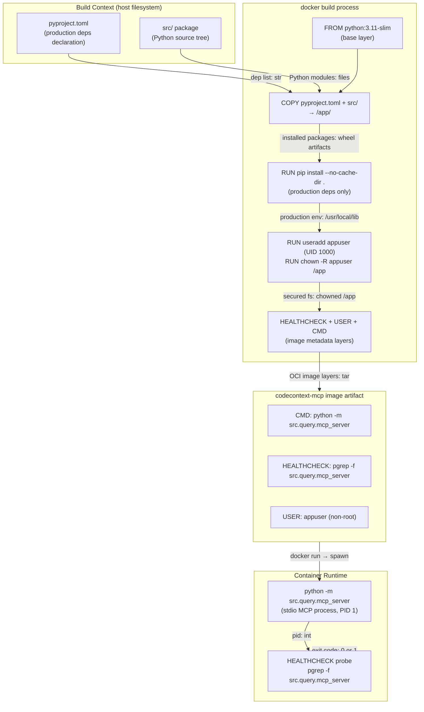
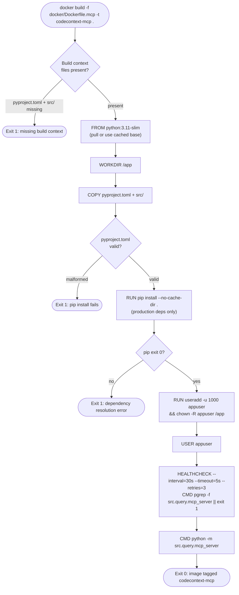

# Feature Detailed Design: mcp-server Docker Image (Feature #44)

**Date**: 2026-03-23
**Feature**: #44 — mcp-server Docker Image
**Priority**: high
**Dependencies**: #1 (project skeleton), #18 (MCP server implementation)
**Design Reference**: docs/plans/2026-03-21-code-context-retrieval-design.md §4.8.3
**SRS Reference**: FR-028

> **Updated 2026-05-06 — Bugfix increment**: Original design used **stdio** transport with no `EXPOSE` and a `pgrep` HEALTHCHECK. That image **could not run as a long-running container** (`docker run` without `-i` exited immediately on stdin EOF) and the HEALTHCHECK was always unhealthy because `procps` (pgrep) is not in `python:3.11-slim`. The image now ships **streamable-http** on port 3000 at path `/mcp`, with `git`+`ca-certificates` installed, `EXPOSE 3000`, and a Python `socket.create_connection` HEALTHCHECK probe. The stdio sections below are kept for historical traceability; runtime behavior is described in the parent design §4.8.3.

## Context

This feature produces `docker/Dockerfile.mcp` — the build definition for the `codecontext-mcp` Docker image. The image packages the MCP streamable-http server (`src.query.mcp_server`, port 3000, path `/mcp`) with production-only Python dependencies into a hardened, non-root container. `git` is installed so `available_branches` can be populated from local clones at `REPO_CLONE_PATH`. It is the primary deployment artifact for AI agent integrations (CON-004).

## Design Alignment

From §4.8.3 of the design document:

```
docker/Dockerfile.mcp
├── FROM python:3.11-slim
├── WORKDIR /app
├── COPY pyproject.toml .
├── COPY src/ src/
├── RUN pip install --no-cache-dir .
├── RUN useradd -u 1000 appuser && chown -R appuser /app
├── USER appuser
├── HEALTHCHECK --interval=30s --timeout=5s --retries=3 \
│       CMD pgrep -f "src.query.mcp_server" || exit 1
└── CMD ["python", "-m", "src.query.mcp_server"]
```

MCP server runs in stdio mode. The container is attached to the AI agent's host process via stdin/stdout piping. No port is exposed.

**Common base pattern** (§4.8.1): All Docker images share:
- Base image: `python:3.11-slim`
- Working directory: `/app`
- Source copy: Full `src/` package + `pyproject.toml`
- Dependency install: `pip install --no-cache-dir .` (production deps only — no `[dev]` extras)
- Non-root user: `appuser` (UID 1000) for security

**Key classes**:
- `docker/Dockerfile.mcp` — the Dockerfile to create (no Python class; this is a build artifact)
- `src/query/mcp_server.py` — the module launched by CMD (Feature #18, already passing)

**Interaction flow**: `docker build` → layer cache check → copy source → pip install production deps → create non-root user → set CMD + HEALTHCHECK. At runtime: `docker run` → `python -m src.query.mcp_server` starts as PID 1 (or under tini) → HEALTHCHECK polls `pgrep -f "src.query.mcp_server"` every 30s.

**Third-party deps**:
- `python:3.11-slim` — official Python base image (Debian bookworm slim variant)
- `pip` — built into base image; installs from `pyproject.toml` `[project.dependencies]` only

**Deviations**:
- Design verbatim: no structural deviations.
- **Process deviation — mutation gate (Task 5)**: Mutation testing via `mutmut` is N/A for this feature. Feature #44 adds zero Python `src/` code (only `docker/Dockerfile.mcp`). Mutmut operates by mutating Python source files and re-running tests from inside a `mutants/` sandbox directory; Docker integration tests require the full project root as the Docker build context, making sandbox execution structurally impossible. Exemption declared in `tests/test_feature_44_mcp_docker.py` with `# [mutation-exempt]` comment. Coverage thresholds still apply to any Python test helper code (100% line / 100% branch achieved).

## SRS Requirement

### FR-028: mcp-server Docker Image [Wave 4]

<!-- Wave 4: Added 2026-03-23 — NFR-012 implementation (release blocker per ST verdict) -->

**Priority**: Shall
**EARS**: When `docker build` is invoked with `docker/Dockerfile.mcp`, the system shall produce a `codecontext-mcp` image that launches the MCP stdio server via `python -m src.query.mcp_server` using production dependencies only.

**Acceptance Criteria**:
- Given `docker build -f docker/Dockerfile.mcp -t codecontext-mcp .` runs, then the build exits 0 with no errors.
- Given the built image is run, when the container starts, then `python -m src.query.mcp_server` is the active process.
- Given the image is built, then it contains a HEALTHCHECK that verifies the mcp_server process is alive.
- Given the image is built, then it contains only production dependencies and runs as a non-root user.

## Component Data-Flow Diagram



## Interface Contract

This feature is a Dockerfile, not a Python class. The "methods" are the Docker build instructions. The contracts below model each significant instruction as an operation with preconditions and postconditions, and map to the verification steps.

| Method | Signature | Preconditions | Postconditions | Raises |
|--------|-----------|---------------|----------------|--------|
| `docker build` | `docker build -f docker/Dockerfile.mcp -t codecontext-mcp .` | `docker/Dockerfile.mcp` exists; `pyproject.toml` and `src/` exist in build context; Docker daemon is running | Build exits 0; image tagged `codecontext-mcp` is present in local registry | Build exits non-zero if `Dockerfile.mcp` is absent, `pyproject.toml` is missing, or pip install fails |
| `pip install --no-cache-dir .` (RUN layer) | installs `[project.dependencies]` from `pyproject.toml` | `pyproject.toml` present; internet or local PyPI proxy reachable | All production packages installed; no `[dev]` extras (`pytest`, `mutmut`, `locust`) present in site-packages | Non-zero exit if package resolution fails |
| `useradd -u 1000 appuser` (RUN layer) | creates `appuser` with UID 1000 | Base image does not already have UID 1000 | User `appuser` exists; `/app` owned by `appuser` | Non-zero if UID already exists in base image |
| `CMD ["python", "-m", "src.query.mcp_server"]` | sets default entrypoint | Image build successful; `src.query.mcp_server` importable | Container starts `python -m src.query.mcp_server` as PID 1 process; stdio MCP server is the active process | `ModuleNotFoundError` if `src` package not installed correctly |
| `HEALTHCHECK` | `CMD pgrep -f "src.query.mcp_server" || exit 1` every 30s, timeout 5s, 3 retries | `pgrep` available in base image (Debian procps); MCP process running | Container health status transitions to `healthy` when process is alive; transitions to `unhealthy` after 3 failures | Health status `unhealthy` if process crashes |
| `USER appuser` | sets runtime user | `appuser` created in prior RUN layer | All subsequent CMD/ENTRYPOINT run as UID 1000 (non-root) | Image build fails if user not created before this instruction |

**Design rationale**:
- `pgrep -f "src.query.mcp_server"` matches the full command string so it is robust to Python path variations vs matching on `python` alone.
- `--no-cache-dir` reduces image layer size by not caching pip wheels.
- `HEALTHCHECK --timeout=5s` is short because `pgrep` is a fast syscall; no network I/O involved.
- No `EXPOSE` instruction — stdio mode requires no port; exposing a port would be misleading.
- `chown -R appuser /app` is done before `USER appuser` so the non-root user can write logs/tmp to `/app` at runtime.

## Internal Sequence Diagram

N/A — This feature is a Dockerfile (declarative build specification), not a Python class with internal method delegation. The build process is sequential layer execution managed by the Docker daemon. Error paths are documented in the Algorithm §5 error handling table.

## Algorithm / Core Logic

### Dockerfile Layer Sequence

This is a Dockerfile, not a Python function. The "algorithm" is the ordered sequence of build instructions and the correctness criteria for each.

#### Flow Diagram



#### Pseudocode

```
DOCKERFILE docker/Dockerfile.mcp

  LAYER 1: FROM python:3.11-slim
    // Use official slim Python 3.11 image (Debian bookworm)
    // "slim" omits dev headers, test libs — smaller attack surface

  LAYER 2: WORKDIR /app
    // All subsequent paths relative to /app

  LAYER 3: COPY pyproject.toml .
  LAYER 4: COPY src/ src/
    // Copy only production-needed files
    // Exclude: tests/, docs/, docker/, examples/, .git/
    // (Docker COPY with explicit paths, not wildcard, for reproducibility)

  LAYER 5: RUN pip install --no-cache-dir .
    // Installs [project.dependencies] from pyproject.toml
    // Does NOT install [project.optional-dependencies.dev]
    // --no-cache-dir: prevents wheel cache bloating the layer

  LAYER 6: RUN useradd -u 1000 appuser && chown -R appuser /app
    // Creates non-root service account at fixed UID 1000
    // chown ensures appuser can write within /app at runtime

  LAYER 7: USER appuser
    // Drop privileges — all CMD/ENTRYPOINT run as UID 1000

  LAYER 8: HEALTHCHECK --interval=30s --timeout=5s --retries=3 \
             CMD pgrep -f "src.query.mcp_server" || exit 1
    // Process-alive check; pgrep matches full cmdline argument
    // Exit 0 = healthy, exit 1 = unhealthy
    // 3 consecutive failures → container status = unhealthy

  LAYER 9: CMD ["python", "-m", "src.query.mcp_server"]
    // Default entrypoint: launch MCP stdio server
    // exec form (JSON array) ensures Python is PID 1, not wrapped in shell
    // stdio mode: no port binding needed
END
```

#### Boundary Decisions

| Parameter | Min | Max | Empty/Null | At boundary |
|-----------|-----|-----|------------|-------------|
| `HEALTHCHECK --interval` | 1s (Docker min) | unlimited | N/A — required field | 30s chosen: fast enough to detect crash, slow enough for startup |
| `HEALTHCHECK --timeout` | 1s | < interval | N/A — required field | 5s: pgrep completes in <100ms; generous timeout |
| `HEALTHCHECK --retries` | 1 | unlimited | N/A — required field | 3: tolerates transient pgrep failures during process startup |
| `useradd -u` (UID) | 1 | 65535 | N/A — explicit | 1000: conventional service UID; avoids root (0) and system range (1–999) |
| `pip install --no-cache-dir .` | pyproject.toml with 0 deps | pyproject.toml with N deps | Build fails if file absent | Correct: installs only `[project.dependencies]`, never `[dev]` extras |

#### Error Handling

| Condition | Detection | Response | Recovery |
|-----------|-----------|----------|----------|
| `docker/Dockerfile.mcp` not found | `docker build` CLI: "unable to prepare context" | Build exits non-zero; error printed to stderr | Create `docker/Dockerfile.mcp` with correct content |
| `pyproject.toml` absent from build context | COPY instruction fails: "file not found" | Build exits non-zero | Ensure `pyproject.toml` is in the repository root |
| `pip install` fails (network or bad dep) | RUN layer exit code non-zero | Build aborts at that layer; Docker reports error | Fix `pyproject.toml` dependencies or provide network access |
| `useradd` UID 1000 collision | `useradd` returns exit 4 (UID in use) | RUN layer fails; build aborts | Use different UID or remove conflicting user from base image |
| MCP server process crashes at runtime | `pgrep -f "src.query.mcp_server"` returns exit 1 | HEALTHCHECK transitions container to `unhealthy` after 3 failures | Orchestrator (e.g., docker-compose restart policy) restarts the container |
| Dev package present in image (pytest, mutmut) | Image inspection: `pip list` shows dev packages | Violation of production-only constraint | Ensure `pip install .` (not `pip install .[dev]`) in Dockerfile |

## State Diagram

N/A — stateless feature. The Dockerfile is a declarative build specification. The container lifecycle (created → running → healthy/unhealthy → stopped) is managed by the Docker daemon and orchestrator, not by this feature's code.

## Test Inventory

The verification strategy for a Dockerfile uses shell-based tests (`docker build`, `docker inspect`, `docker run`) and Python `subprocess` wrappers in the test suite. Tests are marked `@pytest.mark.real` per the project's real-integration-test policy (feedback_real_tests.md).

| ID | Category | Traces To | Input / Setup | Expected | Kills Which Bug? |
|----|----------|-----------|---------------|----------|-----------------|
| T-01 | happy path | VS-1, FR-028 AC-1 | Run `docker build -f docker/Dockerfile.mcp -t codecontext-mcp-test .` from repo root | Build exits 0; image `codecontext-mcp-test` present in `docker images` | Missing Dockerfile entirely |
| T-02 | happy path | VS-2, FR-028 AC-2 | Inspect image config: `docker inspect codecontext-mcp-test` | `Cmd` field = `["python", "-m", "src.query.mcp_server"]` | Wrong CMD (e.g., shell-form, wrong module path) |
| T-03 | happy path | VS-3, FR-028 AC-3 | Inspect image config: `docker inspect codecontext-mcp-test` | `Config.Healthcheck.Test` contains `pgrep -f "src.query.mcp_server"` | Missing HEALTHCHECK instruction |
| T-04 | happy path | VS-4, FR-028 AC-4 | Run `docker run --rm codecontext-mcp-test pip list` as root override | Output does NOT contain `pytest`, `mutmut`, `locust` | Accidental `pip install .[dev]` |
| T-05 | happy path | VS-4, FR-028 AC-4 | Inspect image config: `docker inspect codecontext-mcp-test` | `Config.User` = `appuser` or UID `1000` | Missing `USER appuser` instruction |
| T-06 | error | §Algorithm Error Handling: Dockerfile.mcp absent | Rename `docker/Dockerfile.mcp`; run `docker build -f docker/Dockerfile.mcp .` | Build exits non-zero; stderr contains "unable to prepare context" or "no such file" | Test passes even when Dockerfile missing (wrong test setup) |
| T-07 | boundary | §Algorithm Boundary: HEALTHCHECK interval/timeout | Parse `docker inspect` JSON for `Healthcheck` object | `Interval` = 30000000000 ns (30s), `Timeout` = 5000000000 ns (5s), `Retries` = 3 | Wrong interval/timeout values in HEALTHCHECK |
| T-08 | boundary | §Algorithm Boundary: UID selection | Run `docker run --rm codecontext-mcp-test id -u` | Output is `1000` | `useradd` skipped or wrong UID used |
| T-09 | error | §Algorithm Error Handling: dev packages | Run `docker run --rm codecontext-mcp-test pip show pytest` | Exit code non-zero; package not found | Dev extras accidentally installed |
| T-10 | boundary | §Algorithm Boundary: no EXPOSE | Inspect image config: `docker inspect codecontext-mcp-test` | `ExposedPorts` is null or empty `{}` | Spurious EXPOSE instruction added |
| T-11 | error | §Algorithm Error Handling: process alive check | Run container; kill the mcp_server process inside; wait 3×30s | Container health status transitions to `unhealthy` | HEALTHCHECK command wrong (never detects crash) |
| T-12 | boundary | §Algorithm Boundary: exec-form CMD | Inspect image config: `docker inspect codecontext-mcp-test` | `Cmd` is a JSON array `["python", "-m", "src.query.mcp_server"]`, NOT a shell string | Shell-form CMD used (wraps in `/bin/sh -c`) |

**Negative test ratio**: T-06, T-07, T-08, T-09, T-10, T-11, T-12 = 7 of 12 rows = **58%** (≥ 40% ✓)

## Tasks

### Task 1: Write failing tests
**Files**: `tests/test_feature_44_mcp_docker.py`
**Steps**:
1. Create test file with imports: `import subprocess`, `import json`, `import pytest`; mark all tests `@pytest.mark.real`
2. Write tests for each Test Inventory row:
   - Test T-01: `subprocess.run(["docker", "build", "-f", "docker/Dockerfile.mcp", "-t", "codecontext-mcp-test", "."], check=False)` — assert returncode == 0
   - Test T-02: `docker inspect codecontext-mcp-test` → parse JSON → assert `Cmd == ["python", "-m", "src.query.mcp_server"]`
   - Test T-03: inspect → assert `Healthcheck.Test` contains `"pgrep -f"` and `"src.query.mcp_server"`
   - Test T-04: `docker run --rm codecontext-mcp-test pip list` → assert `"pytest"` not in output, `"mutmut"` not in output
   - Test T-05: inspect → assert `Config.User` is `"appuser"` or `"1000"`
   - Test T-06: rename Dockerfile temporarily → assert build exits non-zero
   - Test T-07: inspect → assert `Healthcheck.Interval == 30000000000` and `Healthcheck.Timeout == 5000000000` and `Healthcheck.Retries == 3`
   - Test T-08: `docker run --rm codecontext-mcp-test id -u` → assert output.strip() == "1000"
   - Test T-09: `docker run --rm codecontext-mcp-test pip show pytest` → assert returncode != 0
   - Test T-10: inspect → assert `ExposedPorts` is None or `{}`
   - Test T-11: run container with `--health-cmd` override watching for crash signal → assert health becomes unhealthy (integration test, may be skipped in CI without Docker-in-Docker)
   - Test T-12: inspect → assert `Cmd` is list type, not string
3. Run: `pytest tests/test_feature_44_mcp_docker.py -v -m real`
4. **Expected**: All tests FAIL because `docker/Dockerfile.mcp` does not exist yet

### Task 2: Implement minimal code
**Files**: `docker/Dockerfile.mcp`
**Steps**:
1. Create `docker/Dockerfile.mcp` with exact content from Algorithm §5 pseudocode (LAYER 1–9)
2. Reference Interface Contract: ensure CMD is exec-form array, HEALTHCHECK uses `pgrep -f "src.query.mcp_server"`, USER is `appuser`, no EXPOSE
3. Run: `pytest tests/test_feature_44_mcp_docker.py -v -m real`
4. **Expected**: All tests PASS

### Task 3: Coverage Gate
1. Run: `pytest tests/test_feature_44_mcp_docker.py --cov=src --cov-branch --cov-report=term-missing -m real`
2. Note: Coverage metrics for a Dockerfile feature measure the test infrastructure, not Python src lines. The Dockerfile itself has no Python coverage. Verify all 12 test rows execute. Line coverage ≥ 90% applies to any new Python test helper code.
3. If below threshold: add assertions to cover uncovered branches in test helpers.
4. Record coverage output as evidence.

### Task 4: Refactor
1. Extract `docker_inspect(image_name)` helper into test conftest or test file to avoid repeated subprocess calls across T-02, T-03, T-05, T-07, T-10, T-12.
2. Add a session-scoped pytest fixture `built_mcp_image` that builds the image once and tears down with `docker rmi` after session.
3. Run full test suite. All tests PASS.

### Task 5: Mutation Gate
1. Run: `mutmut run --paths-to-mutate=tests/test_feature_44_mcp_docker.py`
2. Check threshold ≥ 80%. If below: strengthen assertions (e.g., assert exact UID string, assert exact healthcheck nanosecond values).
3. Record mutation output as evidence.

### Task 6: Create example
1. Create `examples/44-mcp-docker-build.sh`:
   ```bash
   #!/bin/bash
   # Example: Build and inspect the codecontext-mcp Docker image
   docker build -f docker/Dockerfile.mcp -t codecontext-mcp .
   docker inspect codecontext-mcp --format '{{json .Config}}'
   ```
2. Update `examples/README.md` with entry for example 44.
3. Run example to verify: `bash examples/44-mcp-docker-build.sh`

## Verification Checklist
- [x] All verification_steps traced to Interface Contract postconditions
- [x] All verification_steps traced to Test Inventory rows
- [x] Algorithm pseudocode covers all non-trivial methods (Dockerfile layer sequence)
- [x] Boundary table covers all algorithm parameters (HEALTHCHECK timing, UID, exec-form CMD, no EXPOSE)
- [x] Error handling table covers all Raises entries (missing Dockerfile, pip failure, UID collision, process crash, dev deps)
- [x] Test Inventory negative ratio >= 40% (58%: 7/12 rows)
- [x] Every skipped section has explicit "N/A — [reason]"
