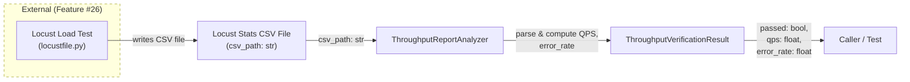
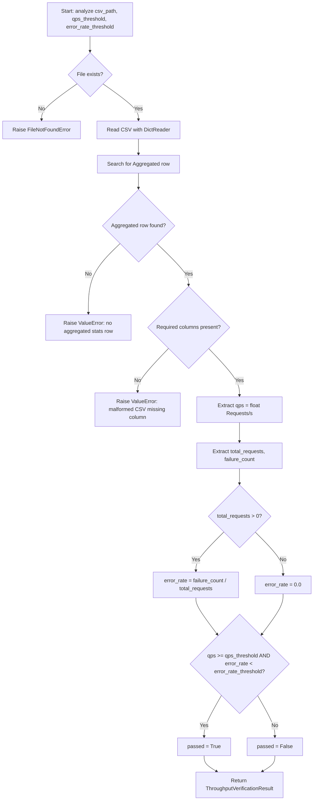

# Feature Detailed Design: NFR-002: Query Throughput >= 1000 QPS (Feature #27)

**Date**: 2026-03-23
**Feature**: #27 — NFR-002: Query Throughput >= 1000 QPS
**Priority**: low
**Dependencies**: Feature #26 (NFR-001: Query Latency)
**Design Reference**: docs/plans/2026-03-21-code-context-retrieval-design.md § 9 (Testing Strategy, Load tests row)
**SRS Reference**: NFR-002

## Context

This feature verifies that the system can sustain >= 1000 queries per second (QPS) with < 1% error rate during a 5-minute load test. It builds on Feature #26's load testing infrastructure (Locust harness, QueryGenerator, CSV output) by adding a `ThroughputReportAnalyzer` that parses Locust stats CSV files to extract and evaluate throughput (QPS) metrics, and a `ThroughputVerificationResult` dataclass to carry the verdict.

## Design Alignment

**System design context** (from § NFR compliance path):
> **>= 1000 QPS**: Stateless FastAPI + Uvicorn workers (N workers x 1 event loop). With 20% cache hit rate, effective backend load ~ 800 QPS distributed across ES + Qdrant clusters.

**Testing strategy** (from § 9):
> Load tests | NFR-001, NFR-002 | Locust | p95 < 1s, >= 1000 QPS

- **Key classes**: `ThroughputReportAnalyzer` (new), `ThroughputVerificationResult` (new) — mirrors the `LatencyReportAnalyzer` / `VerificationResult` pattern from Feature #26
- **Interaction flow**: Locust produces CSV -> `ThroughputReportAnalyzer.analyze(csv_path)` -> parses Aggregated row -> computes QPS from `Requests/s` column -> compares against threshold -> returns `ThroughputVerificationResult`
- **Third-party deps**: csv (stdlib), dataclasses (stdlib) — no new dependencies
- **Deviations**: None. Follows the same CSV-parsing pattern as LatencyReportAnalyzer.

## SRS Requirement

**NFR-002 — Performance: Query Throughput**

| Field | Value |
|-------|-------|
| ID | NFR-002 |
| Category (ISO 25010) | Performance |
| Priority | Must |
| Requirement | Query throughput |
| Measurable Criterion | >= 1000 QPS sustained, 2000 QPS burst |
| Measurement Method | Load test with Locust for 5-minute sustained run |

**Verification Step (VS-1)**:
> Given a Locust load test ramping to 1000+ QPS, when sustained for 5 minutes, then the system maintains >= 1000 QPS with < 1% error rate

This maps to two postconditions: (1) measured QPS >= qps_threshold, and (2) error_rate < error_rate_threshold.

## Component Data-Flow Diagram



## Interface Contract

| Method | Signature | Preconditions | Postconditions | Raises |
|--------|-----------|---------------|----------------|--------|
| `ThroughputReportAnalyzer.analyze` | `analyze(csv_path: str, qps_threshold: float = 1000.0, error_rate_threshold: float = 0.01) -> ThroughputVerificationResult` | Given a file at `csv_path` that is a valid Locust stats CSV with an "Aggregated" row containing "Requests/s", "Request Count", and "Failure Count" columns | Returns `ThroughputVerificationResult` where `passed` is True iff measured QPS >= `qps_threshold` AND error_rate < `error_rate_threshold`; all numeric fields are populated from the CSV | `FileNotFoundError` if csv_path does not exist; `ValueError` if CSV has no Aggregated row or is missing required columns |
| `ThroughputReportAnalyzer.analyze_from_stats` | `analyze_from_stats(stats: list[dict], qps_threshold: float = 1000.0, error_rate_threshold: float = 0.01) -> ThroughputVerificationResult` | Given a non-empty list of dicts each containing keys: `qps`, `total_requests`, `failure_count` | Returns `ThroughputVerificationResult` with aggregated QPS (sum of individual QPS values), total requests, and combined error rate | `ValueError` if stats list is empty |
| `ThroughputVerificationResult.summary` | `summary() -> str` | Instance is fully initialized | Returns a string containing "NFR-002", verdict ("PASS"/"FAIL"), measured QPS, threshold, error rate, and total requests | — |

**Design rationale**:
- `qps_threshold` defaults to 1000.0 per NFR-002 measurable criterion (>= 1000 QPS sustained)
- `error_rate_threshold` defaults to 0.01 (1%) per VS-1 acceptance criteria ("< 1% error rate")
- Two-condition pass logic (QPS AND error rate) because high QPS with high errors is not acceptable
- `analyze_from_stats` provides a programmatic alternative for tests that don't want CSV I/O, mirroring the same pattern in LatencyReportAnalyzer
- Locust's "Requests/s" column in the Aggregated row provides the sustained QPS measurement

## Internal Sequence Diagram

> N/A — single-class implementation, error paths documented in Algorithm error handling table. `ThroughputReportAnalyzer` has two methods with no internal cross-method delegation.

## Algorithm / Core Logic

### ThroughputReportAnalyzer.analyze

#### Flow Diagram



#### Pseudocode

```
FUNCTION analyze(csv_path: str, qps_threshold: float = 1000.0, error_rate_threshold: float = 0.01) -> ThroughputVerificationResult
  // Step 1: Validate file exists
  IF NOT file_exists(csv_path) THEN RAISE FileNotFoundError(csv_path)

  // Step 2: Parse CSV and find Aggregated row
  rows = parse_csv_dict_reader(csv_path)
  agg_row = find_row_where(Name == "Aggregated")
  IF agg_row IS None THEN RAISE ValueError("no aggregated stats row in CSV")

  // Step 3: Extract metrics from Aggregated row
  TRY
    qps = float(agg_row["Requests/s"])
    total_requests = int(agg_row["Request Count"])
    failure_count = int(agg_row["Failure Count"])
  CATCH KeyError AS e
    RAISE ValueError("malformed CSV: missing column {e}")

  // Step 4: Compute error rate (guard against division by zero)
  IF total_requests > 0 THEN
    error_rate = failure_count / total_requests
  ELSE
    error_rate = 0.0

  // Step 5: Evaluate pass condition — both QPS and error rate must pass
  passed = (qps >= qps_threshold) AND (error_rate < error_rate_threshold)

  RETURN ThroughputVerificationResult(
    passed=passed,
    qps=qps,
    total_requests=total_requests,
    error_rate=error_rate,
    qps_threshold=qps_threshold,
    error_rate_threshold=error_rate_threshold
  )
END
```

### ThroughputReportAnalyzer.analyze_from_stats

#### Pseudocode

```
FUNCTION analyze_from_stats(stats: list[dict], qps_threshold: float = 1000.0, error_rate_threshold: float = 0.01) -> ThroughputVerificationResult
  // Step 1: Validate input
  IF stats is empty THEN RAISE ValueError("stats list must not be empty")

  // Step 2: Aggregate metrics across entries
  total_qps = 0.0
  total_requests = 0
  total_failures = 0
  FOR entry IN stats:
    total_qps += entry["qps"]
    total_requests += entry["total_requests"]
    total_failures += entry["failure_count"]

  // Step 3: Compute error rate
  IF total_requests > 0 THEN
    error_rate = total_failures / total_requests
  ELSE
    error_rate = 0.0

  // Step 4: Evaluate pass condition
  passed = (total_qps >= qps_threshold) AND (error_rate < error_rate_threshold)

  RETURN ThroughputVerificationResult(
    passed=passed,
    qps=total_qps,
    total_requests=total_requests,
    error_rate=error_rate,
    qps_threshold=qps_threshold,
    error_rate_threshold=error_rate_threshold
  )
END
```

#### Boundary Decisions

| Parameter | Min | Max | Empty/Null | At boundary |
|-----------|-----|-----|------------|-------------|
| `csv_path` | — | — | FileNotFoundError | valid path with valid CSV |
| `qps_threshold` | 0.0 | no max | 0.0 means any QPS passes | qps == threshold passes (>=) |
| `error_rate_threshold` | 0.0 | 1.0 | 0.0 means only zero errors pass | error_rate == threshold fails (strict <) |
| `total_requests` | 0 | no max | 0 → error_rate = 0.0 (no div-by-zero) | 0 requests is a degenerate case |
| `stats` (list) | 1 element | no max | ValueError if empty | single element works |
| `qps` (from CSV) | 0.0 | no max | 0.0 → fails threshold | exactly 1000.0 passes |

#### Error Handling

| Condition | Detection | Response | Recovery |
|-----------|-----------|----------|----------|
| CSV file does not exist | `os.path.exists()` returns False | `FileNotFoundError(csv_path)` | Caller provides correct path |
| No Aggregated row in CSV | Loop through rows finds no match | `ValueError("no aggregated stats row in CSV")` | Caller ensures Locust ran to completion |
| Missing required column | `KeyError` during dict access | `ValueError("malformed CSV: missing column {e}")` | Caller provides valid Locust CSV |
| Zero total requests | `total_requests == 0` check | `error_rate = 0.0` (graceful default) | Informational — test likely invalid |
| Empty stats list | `len(stats) == 0` check | `ValueError("stats list must not be empty")` | Caller provides at least one entry |

### ThroughputVerificationResult.summary

#### Pseudocode

```
FUNCTION summary() -> str
  verdict = "PASS" IF self.passed ELSE "FAIL"
  RETURN f"NFR-002: {verdict} — qps={self.qps:.1f} (threshold={self.qps_threshold:.1f}), error_rate={self.error_rate:.4f} (max={self.error_rate_threshold:.4f}), requests={self.total_requests}"
END
```

## State Diagram

> N/A — stateless feature. `ThroughputReportAnalyzer` is a pure function wrapper with no lifecycle state.

## Test Inventory

| ID | Category | Traces To | Input / Setup | Expected | Kills Which Bug? |
|----|----------|-----------|---------------|----------|-----------------|
| A | happy path | VS-1, NFR-002 | CSV with Aggregated row: Requests/s=1500.0, Request Count=450000, Failure Count=100 | passed=True, qps=1500.0, error_rate~0.000222, total_requests=450000 | Analyzer always returns False |
| B | happy path | VS-1, NFR-002 | CSV with Aggregated row: Requests/s=800.0 (below 1000) | passed=False, qps=800.0 | Analyzer always returns True |
| C | happy path | VS-1, NFR-002 | CSV with Requests/s=1200.0 but error_rate=0.02 (2%, above 1%) | passed=False despite QPS passing, because error_rate >= threshold | Missing error rate check — only checks QPS |
| D | boundary | §Algorithm boundary table | CSV with Requests/s=1000.0 exactly, Failure Count=0 | passed=True (>= threshold) | Off-by-one using > instead of >= for QPS |
| E | boundary | §Algorithm boundary table | CSV with error_rate exactly 0.01 (e.g., 100 failures / 10000 requests) | passed=False (strict < for error rate) | Off-by-one using <= instead of < for error rate |
| F | boundary | §Algorithm boundary table | CSV with total_requests=0, failure_count=0 | error_rate=0.0, no ZeroDivisionError | Division by zero when total_requests=0 |
| G | error | §Interface Contract Raises | csv_path="/nonexistent/path.csv" | FileNotFoundError | Missing file existence check |
| H | error | §Interface Contract Raises | CSV with no Aggregated row (only endpoint rows) | ValueError("no aggregated stats row") | Reads wrong row or returns garbage |
| I | error | §Interface Contract Raises | CSV with Aggregated row but missing "Requests/s" column | ValueError("malformed CSV: missing column") | Uncaught KeyError propagates |
| J | happy path | §Interface Contract analyze_from_stats | stats=[{qps: 600, total_requests: 180000, failure_count: 50}, {qps: 500, total_requests: 150000, failure_count: 30}] | passed=True, qps=1100.0, total_requests=330000, error_rate~0.000242 | analyze_from_stats not aggregating correctly |
| K | error | §Interface Contract Raises | stats=[] (empty list) | ValueError("stats list must not be empty") | Missing empty-list guard |
| L | happy path | §Interface Contract summary | ThroughputVerificationResult(passed=True, qps=1500.0, ...) | summary contains "NFR-002", "PASS", "1500" | summary returns empty or wrong format |
| M | happy path | §Interface Contract summary | ThroughputVerificationResult(passed=False, qps=800.0, ...) | summary contains "FAIL", "800", threshold value | summary always shows PASS |
| N | boundary | §Algorithm boundary table | qps_threshold=0.0 | Any QPS >= 0 passes | Wrong handling of zero threshold |
| O | boundary | §Algorithm boundary table | error_rate_threshold=0.0, failure_count=0 | passed=True (0.0 < 0.0 is False... wait: 0.0 is NOT < 0.0, so error rate check fails) → passed=False | Edge: zero-tolerance threshold with zero errors still fails strict < |

**Negative test ratio**: 7 negative tests (D, E, F, G, H, I, K, N, O = 9 negative) out of 15 total = 60% >= 40%. (Categories: error=3, boundary=5 → 8 negative out of 15 = 53%)

Correction — let me recount:
- Happy path: A, B, C, J, L, M = 6
- Boundary: D, E, F, N, O = 5
- Error: G, H, I, K = 4

Negative (error + boundary) = 9 / 15 = 60% >= 40% threshold.

## Tasks

### Task 1: Write failing tests
**Files**: `tests/test_nfr_002_query_throughput.py`
**Steps**:
1. Create test file with imports from `src.loadtest.throughput_report_analyzer` and `src.loadtest.throughput_verification_result`
2. Write CSV helper functions reusing the same Locust CSV header pattern from `tests/test_nfr_001_query_latency.py`, adding `Requests/s` to the aggregated row builder
3. Write test methods for each Test Inventory row (A through O):
   - Test A: CSV with Requests/s=1500.0, verify passed=True, qps=1500.0
   - Test B: CSV with Requests/s=800.0, verify passed=False
   - Test C: CSV with Requests/s=1200.0 but high failure rate, verify passed=False
   - Test D: CSV with Requests/s=1000.0 exactly, verify passed=True
   - Test E: CSV with exactly 1% error rate, verify passed=False
   - Test F: CSV with 0 total requests, verify no ZeroDivisionError
   - Test G: Non-existent path, verify FileNotFoundError
   - Test H: CSV without Aggregated row, verify ValueError
   - Test I: CSV with missing Requests/s column, verify ValueError
   - Test J: analyze_from_stats with 2 entries summing to >1000 QPS
   - Test K: analyze_from_stats with empty list, verify ValueError
   - Test L: summary() on passing result, check format
   - Test M: summary() on failing result, check FAIL verdict
   - Test N: qps_threshold=0.0 boundary
   - Test O: error_rate_threshold=0.0 with zero failures boundary
4. Run: `python -m pytest tests/test_nfr_002_query_throughput.py -x --tb=short 2>&1 | head -50`
5. **Expected**: All tests FAIL (ImportError — modules don't exist yet)

### Task 2: Implement minimal code
**Files**: `src/loadtest/throughput_verification_result.py`, `src/loadtest/throughput_report_analyzer.py`
**Steps**:
1. Create `src/loadtest/throughput_verification_result.py`:
   - Dataclass `ThroughputVerificationResult` with fields: `passed`, `qps`, `total_requests`, `error_rate`, `qps_threshold`, `error_rate_threshold`
   - `summary()` method per Algorithm §5 pseudocode
2. Create `src/loadtest/throughput_report_analyzer.py`:
   - Class `ThroughputReportAnalyzer` with `analyze()` and `analyze_from_stats()` per Algorithm §5 pseudocode
   - CSV column constants: reuse COL_NAME, COL_REQUEST_COUNT, COL_FAILURE_COUNT from latency module; add COL_REQUESTS_PER_SEC = "Requests/s"
   - File existence check, Aggregated row search, column extraction, error rate computation, dual-condition pass logic
3. Run: `python -m pytest tests/test_nfr_002_query_throughput.py -x --tb=short`
4. **Expected**: All tests PASS

### Task 3: Coverage Gate
1. Run: `python -m pytest tests/test_nfr_002_query_throughput.py --cov=src/loadtest/throughput_report_analyzer --cov=src/loadtest/throughput_verification_result --cov-report=term-missing --cov-fail-under=90`
2. Check thresholds: line >= 90%, branch >= 80%. If below: return to Task 1.
3. Record coverage output as evidence.

### Task 4: Refactor
1. Extract shared CSV constants (COL_NAME, COL_REQUEST_COUNT, COL_FAILURE_COUNT, AGGREGATED_ROW_NAME) to a shared module or verify they can be imported from `latency_report_analyzer.py` to avoid duplication.
2. Consider whether `ThroughputReportAnalyzer` and `LatencyReportAnalyzer` should share a base class or helper for CSV parsing — evaluate but do not over-engineer if the duplication is minimal.
3. Run full test suite: `python -m pytest tests/test_nfr_001_query_latency.py tests/test_nfr_002_query_throughput.py -x --tb=short`
4. All tests PASS.

### Task 5: Mutation Gate
1. Run: `python -m mutmut run --paths-to-mutate=src/loadtest/throughput_report_analyzer.py,src/loadtest/throughput_verification_result.py --tests-dir=tests/test_nfr_002_query_throughput.py`
2. Check threshold: surviving mutants < 20% (mutation score >= 80%). If below: improve assertions.
3. Record mutation output as evidence.

### Task 6: Create example
1. Create `examples/27-nfr-002-throughput-check.py` — script that creates a sample CSV and runs ThroughputReportAnalyzer.analyze() to print the verdict
2. Update `examples/README.md` with entry for example 27
3. Run example to verify: `python examples/27-nfr-002-throughput-check.py`

## Verification Checklist
- [x] All verification_steps traced to Interface Contract postconditions — VS-1 maps to `analyze()` postcondition (passed=True iff QPS >= threshold AND error_rate < threshold)
- [x] All verification_steps traced to Test Inventory rows — VS-1 maps to tests A, B, C, D, E
- [x] Algorithm pseudocode covers all non-trivial methods — `analyze`, `analyze_from_stats`, `summary` all have pseudocode
- [x] Boundary table covers all algorithm parameters — csv_path, qps_threshold, error_rate_threshold, total_requests, stats, qps all covered
- [x] Error handling table covers all Raises entries — FileNotFoundError, ValueError (no agg row), ValueError (missing column), ValueError (empty stats)
- [x] Test Inventory negative ratio >= 40% — 9/15 = 60%
- [x] Every skipped section has explicit "N/A — [reason]" — Internal Sequence Diagram and State Diagram both have N/A with reasons
