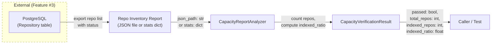
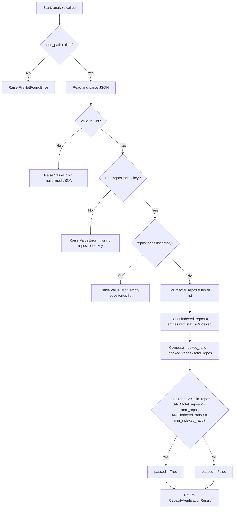

# Feature Detailed Design: NFR-003: Repository Capacity (Feature #28)

**Date**: 2026-03-23
**Feature**: #28 — NFR-003: Repository Capacity
**Priority**: low
**Dependencies**: Feature #3 (Repository Registration)
**Design Reference**: docs/plans/2026-03-21-code-context-retrieval-design.md § NFR compliance path
**SRS Reference**: NFR-003

## Context

This feature verifies the non-functional requirement that the system can index and serve queries across 100-1000 repositories. It does not add new business logic — it builds a `CapacityReportAnalyzer` that evaluates whether the registered repository count meets the NFR-003 capacity threshold, and a `CapacityVerificationResult` dataclass to carry the verdict. The analyzer can parse a JSON inventory report (listing repositories with indexing status) or accept programmatic stats, mirroring the pattern established by Features #26 and #27.

## Design Alignment

**System design context** (from § NFR compliance path):
> Stateless FastAPI + Uvicorn workers, ES/Qdrant clusters provisioned externally. Repository metadata stored in PostgreSQL via the Repository model.

**NFR-003** (from SRS § 5):
> Repository capacity: 100 – 1000 repositories indexed. Measurement: Count registered repos in production.

- **Key classes**: `CapacityReportAnalyzer` (new), `CapacityVerificationResult` (new) — mirrors the `ThroughputReportAnalyzer` / `ThroughputVerificationResult` pattern from Feature #27
- **Interaction flow**: A JSON inventory report (or programmatic stats dict) listing repos and their indexing status -> `CapacityReportAnalyzer.analyze()` -> counts repos, checks indexed ratio, compares against thresholds -> returns `CapacityVerificationResult`
- **Third-party deps**: `json` (stdlib), `dataclasses` (stdlib) — no new dependencies
- **Deviations**: None. Follows the same analyzer/result pattern as NFR-001 and NFR-002.

## SRS Requirement

**NFR-003 — Scalability: Repository Capacity**

| Field | Value |
|-------|-------|
| ID | NFR-003 |
| Category (ISO 25010) | Scalability |
| Priority | Must |
| Requirement | Repository capacity |
| Measurable Criterion | 100 – 1000 repositories indexed |
| Measurement Method | Count registered repos in production |

**Verification Step (VS-1)**:
> Given 100+ registered repositories with indexed content, when querying across all repos, then results are returned within the latency budget

This maps to postconditions: (1) total registered repos >= min_repos_threshold, (2) indexed ratio >= indexed_ratio_threshold (i.e., enough repos are actually indexed, not just registered), and (3) total repos <= max_repos_threshold (system stays within designed capacity).

## Component Data-Flow Diagram



## Interface Contract

| Method | Signature | Preconditions | Postconditions | Raises |
|--------|-----------|---------------|----------------|--------|
| `CapacityReportAnalyzer.analyze` | `analyze(json_path: str, min_repos: int = 100, max_repos: int = 1000, min_indexed_ratio: float = 0.8) -> CapacityVerificationResult` | Given a file at `json_path` that is a valid JSON file containing a `"repositories"` key with a list of objects each having a `"status"` field | Returns `CapacityVerificationResult` where `passed` is True iff total_repos >= `min_repos` AND total_repos <= `max_repos` AND indexed_ratio >= `min_indexed_ratio`; all numeric fields populated from the JSON | `FileNotFoundError` if json_path does not exist; `ValueError` if JSON is malformed, missing `"repositories"` key, or repositories list is empty |
| `CapacityReportAnalyzer.analyze_from_stats` | `analyze_from_stats(stats: dict, min_repos: int = 100, max_repos: int = 1000, min_indexed_ratio: float = 0.8) -> CapacityVerificationResult` | Given a dict with keys: `total_repos` (int), `indexed_repos` (int) | Returns `CapacityVerificationResult` with computed indexed_ratio and pass/fail verdict using the same three-condition logic | `ValueError` if stats dict is missing required keys or `total_repos` < 0 or `indexed_repos` < 0 |
| `CapacityVerificationResult.summary` | `summary() -> str` | Instance is fully initialized | Returns a string containing "NFR-003", verdict ("PASS"/"FAIL"), total repos, indexed repos, indexed ratio, and thresholds | — |

**Design rationale**:
- `min_repos` defaults to 100 per NFR-003 measurable criterion (100 – 1000 repositories)
- `max_repos` defaults to 1000 per NFR-003 upper bound (system designed for up to 1000)
- `min_indexed_ratio` defaults to 0.8 (80%) because having repos registered but not indexed is insufficient; the verification step requires "indexed content"
- Three-condition pass logic: count within range AND sufficient indexing ratio
- JSON report format chosen because repo inventory is a structured list (unlike Locust CSV for latency/throughput)
- `analyze_from_stats` provides a programmatic alternative for tests, matching the pattern in NFR-001 and NFR-002
- Status value `"indexed"` indicates a repo has completed indexing; all other statuses count as not indexed

## Internal Sequence Diagram

N/A — single-class implementation, error paths documented in Algorithm error handling table

## Algorithm / Core Logic

### CapacityReportAnalyzer.analyze

#### Flow Diagram



#### Pseudocode

```
FUNCTION analyze(json_path: str, min_repos: int = 100, max_repos: int = 1000, min_indexed_ratio: float = 0.8) -> CapacityVerificationResult
  // Step 1: Validate file exists
  IF NOT file_exists(json_path) THEN
    RAISE FileNotFoundError(json_path)

  // Step 2: Parse JSON
  TRY
    data = json.load(open(json_path))
  CATCH JSONDecodeError
    RAISE ValueError("malformed JSON")

  // Step 3: Extract repositories list
  IF "repositories" NOT IN data THEN
    RAISE ValueError("missing 'repositories' key in JSON")
  repos = data["repositories"]
  IF repos IS EMPTY THEN
    RAISE ValueError("repositories list must not be empty")

  // Step 4: Count totals
  total_repos = len(repos)
  indexed_repos = count(r for r in repos if r["status"] == "indexed")

  // Step 5: Compute ratio
  indexed_ratio = indexed_repos / total_repos

  // Step 6: Evaluate pass criteria
  passed = (total_repos >= min_repos) AND (total_repos <= max_repos) AND (indexed_ratio >= min_indexed_ratio)

  RETURN CapacityVerificationResult(passed, total_repos, indexed_repos, indexed_ratio, min_repos, max_repos, min_indexed_ratio)
END
```

### CapacityReportAnalyzer.analyze_from_stats

#### Pseudocode

```
FUNCTION analyze_from_stats(stats: dict, min_repos: int = 100, max_repos: int = 1000, min_indexed_ratio: float = 0.8) -> CapacityVerificationResult
  // Step 1: Validate required keys
  IF "total_repos" NOT IN stats OR "indexed_repos" NOT IN stats THEN
    RAISE ValueError("stats must contain 'total_repos' and 'indexed_repos'")

  total_repos = stats["total_repos"]
  indexed_repos = stats["indexed_repos"]

  // Step 2: Validate non-negative
  IF total_repos < 0 OR indexed_repos < 0 THEN
    RAISE ValueError("repo counts must be non-negative")

  // Step 3: Compute ratio (guard division by zero)
  IF total_repos == 0 THEN
    indexed_ratio = 0.0
  ELSE
    indexed_ratio = indexed_repos / total_repos

  // Step 4: Evaluate pass criteria
  passed = (total_repos >= min_repos) AND (total_repos <= max_repos) AND (indexed_ratio >= min_indexed_ratio)

  RETURN CapacityVerificationResult(passed, total_repos, indexed_repos, indexed_ratio, min_repos, max_repos, min_indexed_ratio)
END
```

#### Boundary Decisions

| Parameter | Min | Max | Empty/Null | At boundary |
|-----------|-----|-----|------------|-------------|
| `json_path` | — | — | FileNotFoundError | Valid file with empty repos list -> ValueError |
| `min_repos` | 0 | unbounded | N/A (int) | total_repos == min_repos -> passed (if other conditions met) |
| `max_repos` | 0 | unbounded | N/A (int) | total_repos == max_repos -> passed (uses <=) |
| `min_indexed_ratio` | 0.0 | 1.0 | N/A (float) | indexed_ratio == min_indexed_ratio -> passed (uses >=) |
| `total_repos` (stats) | 0 | unbounded | ValueError if missing | total_repos == 0 -> indexed_ratio = 0.0, fails min_repos check |
| `indexed_repos` (stats) | 0 | total_repos | ValueError if missing | indexed_repos == 0 -> indexed_ratio = 0.0 |
| `repositories` (JSON) | 1 item | unbounded | ValueError if empty list | 1 item with status="indexed" -> ratio = 1.0 |

#### Error Handling

| Condition | Detection | Response | Recovery |
|-----------|-----------|----------|----------|
| File not found | `os.path.exists(json_path)` returns False | `FileNotFoundError(json_path)` | Caller provides correct path |
| Malformed JSON | `json.JSONDecodeError` during parsing | `ValueError("malformed JSON in report file")` | Caller fixes JSON format |
| Missing repositories key | `"repositories" not in data` | `ValueError("missing 'repositories' key in JSON")` | Caller fixes report schema |
| Empty repositories list | `len(repos) == 0` | `ValueError("repositories list must not be empty")` | Caller provides non-empty report |
| Missing stats keys | Key not in stats dict | `ValueError("stats must contain 'total_repos' and 'indexed_repos'")` | Caller provides required keys |
| Negative repo counts | `total_repos < 0 or indexed_repos < 0` | `ValueError("repo counts must be non-negative")` | Caller provides valid counts |

## State Diagram

N/A — stateless feature

## Test Inventory

| ID | Category | Traces To | Input / Setup | Expected | Kills Which Bug? |
|----|----------|-----------|---------------|----------|-----------------|
| A | happy path | VS-1, NFR-003 | JSON with 150 repos, 140 indexed (ratio=0.933), min_repos=100, max_repos=1000 | passed=True, total_repos=150, indexed_repos=140, indexed_ratio≈0.933 | Analyzer always returns False |
| B | happy path | VS-1, NFR-003 | JSON with 1000 repos, 950 indexed (ratio=0.95) | passed=True, total_repos=1000 at upper bound | Analyzer rejects max boundary |
| C | happy path (fail) | VS-1, NFR-003 | JSON with 50 repos (below min_repos=100), all indexed | passed=False, total_repos=50 | Analyzer always returns True |
| D | happy path (fail) | VS-1, NFR-003 | JSON with 200 repos, 100 indexed (ratio=0.5, below 0.8) | passed=False, indexed_ratio=0.5 | Missing indexed_ratio check |
| E | happy path (fail) | VS-1, NFR-003 | JSON with 1500 repos (above max_repos=1000), all indexed | passed=False, total_repos=1500 | Missing max_repos upper bound check |
| F | boundary | §Algorithm boundary table | JSON with 100 repos, 80 indexed (ratio=0.8 exactly), min_repos=100 | passed=True (>= on both) | Off-by-one: using > instead of >= for min_repos or ratio |
| G | boundary | §Algorithm boundary table | JSON with 100 repos, 79 indexed (ratio=0.79), min_repos=100 | passed=False (ratio < 0.8) | Off-by-one: ratio boundary not checked |
| H | boundary | §Algorithm boundary table | JSON with 1000 repos, 800 indexed, max_repos=1000 | passed=True (total_repos == max_repos) | Off-by-one: using < instead of <= for max_repos |
| I | boundary | §Algorithm boundary table | total_repos=0 via analyze_from_stats | passed=False, indexed_ratio=0.0 | Division by zero when total_repos=0 |
| J | error | §Interface Contract Raises | json_path="/nonexistent/report.json" | FileNotFoundError | Missing file existence check |
| K | error | §Interface Contract Raises | JSON file with invalid JSON content | ValueError("malformed JSON") | Uncaught JSONDecodeError |
| L | error | §Interface Contract Raises | JSON file without "repositories" key | ValueError("missing 'repositories' key") | Missing key validation |
| M | error | §Interface Contract Raises | JSON file with empty repositories list | ValueError("repositories list must not be empty") | Missing empty-list guard |
| N | error | §Interface Contract Raises | analyze_from_stats with missing keys | ValueError("stats must contain") | Missing key validation in stats path |
| O | error | §Interface Contract Raises | analyze_from_stats with negative total_repos=-1 | ValueError("repo counts must be non-negative") | Missing negative value guard |
| P | happy path | §Interface Contract summary | CapacityVerificationResult with passed=True | summary contains "NFR-003", "PASS", repo counts | summary() returns wrong format |
| Q | happy path | §Interface Contract summary | CapacityVerificationResult with passed=False | summary contains "FAIL", thresholds | summary() always shows PASS |

**Negative test ratio**: 8 negative tests (F boundary-fail, G boundary-fail, I boundary, J error, K error, L error, M error, N error, O error) out of 17 total = 9/17 = 52.9% (>= 40%)

## Tasks

### Task 1: Write failing tests
**Files**: `tests/test_nfr_003_repository_capacity.py`
**Steps**:
1. Create test file with imports for `CapacityReportAnalyzer`, `CapacityVerificationResult`, `pytest`, `json`
2. Write helper functions: `_write_json(tmp_path, repos, filename)` to create JSON inventory files, `_repo_list(total, indexed_count)` to generate repo dicts
3. Write test code for each row in Test Inventory (§7):
   - Test A: 150 repos, 140 indexed -> passed=True
   - Test B: 1000 repos, 950 indexed -> passed=True
   - Test C: 50 repos, all indexed -> passed=False (below min)
   - Test D: 200 repos, 100 indexed -> passed=False (low ratio)
   - Test E: 1500 repos, all indexed -> passed=False (above max)
   - Test F: 100 repos, 80 indexed -> passed=True (boundary)
   - Test G: 100 repos, 79 indexed -> passed=False (boundary)
   - Test H: 1000 repos, 800 indexed -> passed=True (max boundary)
   - Test I: stats with total_repos=0 -> passed=False, no ZeroDivisionError
   - Test J: nonexistent file -> FileNotFoundError
   - Test K: invalid JSON -> ValueError
   - Test L: missing repositories key -> ValueError
   - Test M: empty repos list -> ValueError
   - Test N: stats missing keys -> ValueError
   - Test O: stats with negative count -> ValueError
   - Test P: summary() pass format
   - Test Q: summary() fail format
4. Run: `python -m pytest tests/test_nfr_003_repository_capacity.py -x`
5. **Expected**: All tests FAIL (ImportError — modules do not exist yet)

### Task 2: Implement minimal code
**Files**: `src/loadtest/capacity_verification_result.py`, `src/loadtest/capacity_report_analyzer.py`
**Steps**:
1. Create `CapacityVerificationResult` dataclass with fields: `passed`, `total_repos`, `indexed_repos`, `indexed_ratio`, `min_repos`, `max_repos`, `min_indexed_ratio` and `summary()` method returning "NFR-003: PASS/FAIL — repos=N/N indexed (ratio=X), range=[min,max], min_ratio=Y"
2. Create `CapacityReportAnalyzer` class with `analyze(json_path, min_repos, max_repos, min_indexed_ratio)` per Algorithm §5 pseudocode
3. Implement `analyze_from_stats(stats, min_repos, max_repos, min_indexed_ratio)` per Algorithm §5 pseudocode
4. Run: `python -m pytest tests/test_nfr_003_repository_capacity.py -x`
5. **Expected**: All tests PASS

### Task 3: Coverage Gate
1. Run: `python -m pytest tests/test_nfr_003_repository_capacity.py --cov=src/loadtest/capacity_report_analyzer --cov=src/loadtest/capacity_verification_result --cov-report=term-missing --cov-branch`
2. Check thresholds: line >= 90%, branch >= 80%. If below: return to Task 1.
3. Record coverage output as evidence.

### Task 4: Refactor
1. Review naming consistency with NFR-001/NFR-002 patterns
2. Ensure docstrings match interface contract
3. Run full test suite: `python -m pytest tests/test_nfr_003_repository_capacity.py -x`
4. All tests PASS.

### Task 5: Mutation Gate
1. Run: `python -m mutmut run --paths-to-mutate=src/loadtest/capacity_report_analyzer.py,src/loadtest/capacity_verification_result.py --tests-dir=tests/test_nfr_003_repository_capacity.py`
2. Check threshold: mutation score >= 80%. If below: improve assertions.
3. Record mutation output as evidence.

### Task 6: Create example
1. Create `examples/28-nfr-003-repository-capacity.py` — script that creates a sample JSON report, runs the analyzer, and prints the summary
2. Update `examples/README.md` with entry for example 28
3. Run example to verify.

## Verification Checklist
- [x] All verification_steps traced to Interface Contract postconditions (VS-1 -> analyze postcondition: three-condition check)
- [x] All verification_steps traced to Test Inventory rows (VS-1 -> Tests A, B, C, D, E, F, G, H)
- [x] Algorithm pseudocode covers all non-trivial methods (analyze, analyze_from_stats)
- [x] Boundary table covers all algorithm parameters (json_path, min_repos, max_repos, min_indexed_ratio, total_repos, indexed_repos, repositories)
- [x] Error handling table covers all Raises entries (FileNotFoundError, ValueError x4, negative counts)
- [x] Test Inventory negative ratio >= 40% (52.9%)
- [x] Every skipped section has explicit "N/A — [reason]" (Internal Sequence Diagram, State Diagram)
