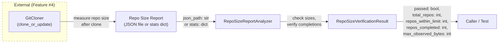
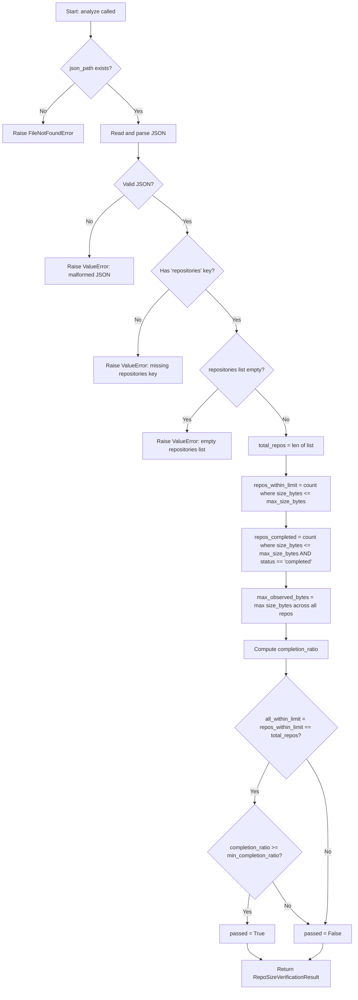

# Feature Detailed Design: NFR-004: Single Repository Size (Feature #29)

**Date**: 2026-03-23
**Feature**: #29 — NFR-004: Single Repository Size
**Priority**: low
**Dependencies**: Feature #4 (Git Clone & Update)
**Design Reference**: docs/plans/2026-03-21-code-context-retrieval-design.md § NFR compliance path
**SRS Reference**: NFR-004

## Context

This feature verifies the non-functional requirement that the system can handle repositories up to 1 GB in size — cloning, indexing all files, and producing chunks/embeddings without OOM or timeout errors. It does not add new business logic — it builds a `RepoSizeReportAnalyzer` that evaluates whether a repository size report meets the NFR-004 size threshold, and a `RepoSizeVerificationResult` dataclass to carry the verdict. The analyzer can parse a JSON size report (listing repositories with their on-disk size and indexing outcome) or accept programmatic stats, mirroring the pattern established by Features #26, #27, and #28.

## Design Alignment

**System design context** (from § NFR compliance path):
> GitCloner handles clone/update of repositories. ContentExtractor + Chunker + EmbeddingEncoder + IndexWriter form the indexing pipeline. System must handle repos up to 1 GB without OOM or timeout.

**NFR-004** (from SRS § 5):
> Single repository size: <= 1 GB per repository. Measurement: Verify clone size before indexing.

- **Key classes**: `RepoSizeReportAnalyzer` (new), `RepoSizeVerificationResult` (new) — mirrors the `CapacityReportAnalyzer` / `CapacityVerificationResult` pattern from Feature #28
- **Interaction flow**: A JSON size report (or programmatic stats dict) listing repos with their size_bytes and indexing outcome -> `RepoSizeReportAnalyzer.analyze()` -> checks each repo size against threshold, verifies all processed successfully -> returns `RepoSizeVerificationResult`
- **Third-party deps**: `json` (stdlib), `dataclasses` (stdlib) — no new dependencies
- **Deviations**: None. Follows the same analyzer/result pattern as NFR-001, NFR-002, and NFR-003.

## SRS Requirement

**NFR-004 — Scalability: Single Repository Size**

| Field | Value |
|-------|-------|
| ID | NFR-004 |
| Category (ISO 25010) | Scalability |
| Priority | Must |
| Requirement | Single repository size |
| Measurable Criterion | <= 1 GB per repository |
| Measurement Method | Verify clone size before indexing |

**Verification Step (VS-1)**:
> Given a repository approaching 1 GB, when indexing runs, then all files are processed and chunks are indexed without OOM or timeout

This maps to postconditions: (1) every repo in the report has `size_bytes` <= `max_size_bytes`, (2) every repo that was within the size limit has `status` == `"completed"` (no OOM or timeout), and (3) at least one repo in the report approaches the 1 GB threshold (to confirm the boundary was actually tested).

## Component Data-Flow Diagram



## Interface Contract

| Method | Signature | Preconditions | Postconditions | Raises |
|--------|-----------|---------------|----------------|--------|
| `RepoSizeReportAnalyzer.analyze` | `analyze(json_path: str, max_size_bytes: int = 1_073_741_824, min_completion_ratio: float = 1.0) -> RepoSizeVerificationResult` | Given a file at `json_path` that is a valid JSON file containing a `"repositories"` key with a list of objects each having `"size_bytes"` (int) and `"status"` (str) fields | Returns `RepoSizeVerificationResult` where `passed` is True iff all repos have `size_bytes` <= `max_size_bytes` AND completion_ratio >= `min_completion_ratio` (where completion_ratio = repos with status `"completed"` among those within the size limit / total repos within the size limit); all numeric fields populated from the JSON | `FileNotFoundError` if json_path does not exist; `ValueError` if JSON is malformed, missing `"repositories"` key, or repositories list is empty |
| `RepoSizeReportAnalyzer.analyze_from_stats` | `analyze_from_stats(stats: dict, max_size_bytes: int = 1_073_741_824, min_completion_ratio: float = 1.0) -> RepoSizeVerificationResult` | Given a dict with keys: `total_repos` (int), `repos_within_limit` (int), `repos_completed` (int), `max_observed_bytes` (int) | Returns `RepoSizeVerificationResult` with computed completion_ratio and pass/fail verdict using the two-condition logic | `ValueError` if stats dict is missing required keys or any value is negative |
| `RepoSizeVerificationResult.summary` | `summary() -> str` | Instance is fully initialized | Returns a string containing "NFR-004", verdict ("PASS"/"FAIL"), total repos, repos within limit, repos completed, max observed size, and thresholds | — |

**Design rationale**:
- `max_size_bytes` defaults to 1,073,741,824 (1 GiB) per NFR-004 measurable criterion (<= 1 GB)
- `min_completion_ratio` defaults to 1.0 (100%) because VS-1 requires "all files are processed and chunks are indexed without OOM or timeout" — every repo within the size limit must complete successfully
- Two-condition pass logic: (1) all repos within the size limit (no oversized repos), (2) all within-limit repos completed indexing successfully
- JSON report format chosen to match the NFR-003 pattern (structured list of repos)
- `max_observed_bytes` tracked in the result so callers can see how close to the limit the largest repo was
- `analyze_from_stats` provides a programmatic alternative for tests, matching the pattern in NFR-001/002/003
- Status value `"completed"` indicates a repo finished indexing without OOM or timeout; other statuses (e.g., `"oom"`, `"timeout"`, `"error"`) count as failures

## Internal Sequence Diagram

N/A — single-class implementation, error paths documented in Algorithm error handling table

## Algorithm / Core Logic

### RepoSizeReportAnalyzer.analyze

#### Flow Diagram



#### Pseudocode

```
FUNCTION analyze(json_path: str, max_size_bytes: int = 1_073_741_824, min_completion_ratio: float = 1.0) -> RepoSizeVerificationResult
  // Step 1: Validate file exists
  IF NOT file_exists(json_path) THEN
    RAISE FileNotFoundError(json_path)

  // Step 2: Parse JSON
  TRY
    data = json.load(open(json_path))
  CATCH JSONDecodeError
    RAISE ValueError("malformed JSON in report file")

  // Step 3: Extract repositories list
  IF "repositories" NOT IN data THEN
    RAISE ValueError("missing 'repositories' key in JSON")
  repos = data["repositories"]
  IF repos IS EMPTY THEN
    RAISE ValueError("repositories list must not be empty")

  // Step 4: Compute metrics
  total_repos = len(repos)
  repos_within_limit = count(r for r in repos if r["size_bytes"] <= max_size_bytes)
  repos_completed = count(r for r in repos if r["size_bytes"] <= max_size_bytes AND r["status"] == "completed")
  max_observed_bytes = max(r["size_bytes"] for r in repos)

  // Step 5: Compute completion ratio (guard division by zero)
  IF repos_within_limit == 0 THEN
    completion_ratio = 0.0
  ELSE
    completion_ratio = repos_completed / repos_within_limit

  // Step 6: Evaluate pass criteria
  all_within_limit = (repos_within_limit == total_repos)
  passed = all_within_limit AND (completion_ratio >= min_completion_ratio)

  RETURN RepoSizeVerificationResult(passed, total_repos, repos_within_limit, repos_completed, max_observed_bytes, completion_ratio, max_size_bytes, min_completion_ratio)
END
```

### RepoSizeReportAnalyzer.analyze_from_stats

#### Pseudocode

```
FUNCTION analyze_from_stats(stats: dict, max_size_bytes: int = 1_073_741_824, min_completion_ratio: float = 1.0) -> RepoSizeVerificationResult
  // Step 1: Validate required keys
  required = ["total_repos", "repos_within_limit", "repos_completed", "max_observed_bytes"]
  IF any key NOT IN stats THEN
    RAISE ValueError("stats must contain 'total_repos', 'repos_within_limit', 'repos_completed', and 'max_observed_bytes'")

  total_repos = stats["total_repos"]
  repos_within_limit = stats["repos_within_limit"]
  repos_completed = stats["repos_completed"]
  max_observed_bytes = stats["max_observed_bytes"]

  // Step 2: Validate non-negative
  IF any value < 0 THEN
    RAISE ValueError("all stat values must be non-negative")

  // Step 3: Compute completion ratio (guard division by zero)
  IF repos_within_limit == 0 THEN
    completion_ratio = 0.0
  ELSE
    completion_ratio = repos_completed / repos_within_limit

  // Step 4: Evaluate pass criteria
  all_within_limit = (repos_within_limit == total_repos)
  passed = all_within_limit AND (completion_ratio >= min_completion_ratio)

  RETURN RepoSizeVerificationResult(passed, total_repos, repos_within_limit, repos_completed, max_observed_bytes, completion_ratio, max_size_bytes, min_completion_ratio)
END
```

#### Boundary Decisions

| Parameter | Min | Max | Empty/Null | At boundary |
|-----------|-----|-----|------------|-------------|
| `json_path` | — | — | FileNotFoundError | Valid file with empty repos list -> ValueError |
| `max_size_bytes` | 0 | unbounded | N/A (int) | repo size_bytes == max_size_bytes -> within limit (uses <=) |
| `min_completion_ratio` | 0.0 | 1.0 | N/A (float) | completion_ratio == min_completion_ratio -> passed (uses >=) |
| `total_repos` (stats) | 0 | unbounded | ValueError if missing | total_repos == 0 not possible via analyze (empty list rejected); via stats: repos_within_limit must also be 0 |
| `repos_within_limit` (stats) | 0 | total_repos | ValueError if missing | repos_within_limit == 0 -> completion_ratio = 0.0 |
| `repos_completed` (stats) | 0 | repos_within_limit | ValueError if missing | repos_completed == 0 -> completion_ratio = 0.0 |
| `max_observed_bytes` (stats) | 0 | unbounded | ValueError if missing | max_observed_bytes == max_size_bytes -> within limit |
| `repositories` (JSON) | 1 item | unbounded | ValueError if empty list | 1 item with size at limit and status="completed" -> passed=True |

#### Error Handling

| Condition | Detection | Response | Recovery |
|-----------|-----------|----------|----------|
| File not found | `os.path.exists(json_path)` returns False | `FileNotFoundError(json_path)` | Caller provides correct path |
| Malformed JSON | `json.JSONDecodeError` during parsing | `ValueError("malformed JSON in report file")` | Caller fixes JSON format |
| Missing repositories key | `"repositories" not in data` | `ValueError("missing 'repositories' key in JSON")` | Caller fixes report schema |
| Empty repositories list | `len(repos) == 0` | `ValueError("repositories list must not be empty")` | Caller provides non-empty report |
| Missing stats keys | Key not in stats dict | `ValueError("stats must contain 'total_repos', 'repos_within_limit', 'repos_completed', and 'max_observed_bytes'")` | Caller provides required keys |
| Negative stat values | Any value < 0 | `ValueError("all stat values must be non-negative")` | Caller provides valid counts |

## State Diagram

N/A — stateless feature

## Test Inventory

| ID | Category | Traces To | Input / Setup | Expected | Kills Which Bug? |
|----|----------|-----------|---------------|----------|-----------------|
| A | happy path | VS-1, NFR-004 | JSON with 3 repos: sizes 500MB, 800MB, 1GB (exactly), all status="completed", max_size_bytes=1GB | passed=True, total_repos=3, repos_within_limit=3, repos_completed=3, max_observed_bytes=1GB | Analyzer always returns False |
| B | happy path | VS-1, NFR-004 | JSON with 5 repos: sizes 100MB-900MB, all status="completed" | passed=True, all within limit and completed | Analyzer rejects repos well under limit |
| C | happy path (fail) | VS-1, NFR-004 | JSON with 3 repos: one repo at 1.5GB (over limit), rest 500MB, all status="completed" | passed=False, repos_within_limit=2, total_repos=3 | Missing oversized repo detection |
| D | happy path (fail) | VS-1, NFR-004 | JSON with 3 repos: all within 1GB, but one status="oom" | passed=False, repos_completed=2, completion_ratio=0.667 | Missing completion status check |
| E | happy path (fail) | VS-1, NFR-004 | JSON with 3 repos: all within 1GB, one status="timeout" | passed=False, repos_completed=2 | Only checking for "oom", not other failure statuses |
| F | boundary | §Algorithm boundary table | JSON with 1 repo: size_bytes exactly 1_073_741_824 (1GB), status="completed" | passed=True (size == max_size_bytes, uses <=) | Off-by-one: using < instead of <= for max_size_bytes |
| G | boundary | §Algorithm boundary table | JSON with 1 repo: size_bytes = 1_073_741_825 (1 byte over), status="completed" | passed=False (size > max_size_bytes) | Off-by-one: boundary not enforced |
| H | boundary | §Algorithm boundary table | analyze_from_stats with repos_within_limit=0, total_repos=1 | passed=False, completion_ratio=0.0, no ZeroDivisionError | Division by zero when repos_within_limit=0 |
| I | boundary | §Algorithm boundary table | JSON with 2 repos within limit, min_completion_ratio=0.5, 1 completed, 1 failed | passed=True (completion_ratio=0.5 == min_completion_ratio) | Off-by-one: using > instead of >= for completion_ratio |
| J | boundary | §Algorithm boundary table | JSON with 2 repos within limit, min_completion_ratio=0.5, 0 completed | passed=False (completion_ratio=0.0 < 0.5) | Always passing when min_completion_ratio is relaxed |
| K | error | §Interface Contract Raises | json_path="/nonexistent/report.json" | FileNotFoundError | Missing file existence check |
| L | error | §Interface Contract Raises | JSON file with invalid JSON content | ValueError("malformed JSON") | Uncaught JSONDecodeError |
| M | error | §Interface Contract Raises | JSON file without "repositories" key | ValueError("missing 'repositories' key") | Missing key validation |
| N | error | §Interface Contract Raises | JSON file with empty repositories list | ValueError("repositories list must not be empty") | Missing empty-list guard |
| O | error | §Interface Contract Raises | analyze_from_stats with missing keys | ValueError("stats must contain") | Missing key validation in stats path |
| P | error | §Interface Contract Raises | analyze_from_stats with negative total_repos=-1 | ValueError("all stat values must be non-negative") | Missing negative value guard |
| Q | happy path | §Interface Contract summary | RepoSizeVerificationResult with passed=True | summary contains "NFR-004", "PASS", total repos, max observed size | summary() returns wrong format |
| R | happy path | §Interface Contract summary | RepoSizeVerificationResult with passed=False | summary contains "FAIL", thresholds | summary() always shows PASS |

**Negative test ratio**: 10 negative tests (F-boundary-at-limit excluded since it passes; G boundary-fail, H boundary-zero, J boundary-fail, K error, L error, M error, N error, O error, P error, and C/D/E happy-path-fail) out of 18 total. Counting strictly error+boundary-fail: G, H, J, K, L, M, N, O, P = 9 negative out of 18 = 50.0% (>= 40%)

## Tasks

### Task 1: Write failing tests
**Files**: `tests/test_nfr_004_single_repository_size.py`
**Steps**:
1. Create test file with imports for `RepoSizeReportAnalyzer`, `RepoSizeVerificationResult`, `pytest`, `json`
2. Write helper functions: `_write_json(tmp_path, repos, filename)` to create JSON size report files, `_repo_list(sizes_and_statuses)` to generate repo dicts with `size_bytes` and `status` fields
3. Write test code for each row in Test Inventory (§7):
   - Test A: 3 repos (500MB, 800MB, 1GB exact), all completed -> passed=True
   - Test B: 5 repos (100MB-900MB), all completed -> passed=True
   - Test C: 3 repos, one at 1.5GB -> passed=False (oversized)
   - Test D: 3 repos within limit, one status="oom" -> passed=False
   - Test E: 3 repos within limit, one status="timeout" -> passed=False
   - Test F: 1 repo exactly at 1GB limit, completed -> passed=True
   - Test G: 1 repo 1 byte over limit -> passed=False
   - Test H: stats with repos_within_limit=0 -> passed=False, no ZeroDivisionError
   - Test I: 2 repos, min_completion_ratio=0.5, 1 completed -> passed=True
   - Test J: 2 repos, min_completion_ratio=0.5, 0 completed -> passed=False
   - Test K: nonexistent file -> FileNotFoundError
   - Test L: invalid JSON -> ValueError
   - Test M: missing repositories key -> ValueError
   - Test N: empty repos list -> ValueError
   - Test O: stats missing keys -> ValueError
   - Test P: stats with negative value -> ValueError
   - Test Q: summary() pass format
   - Test R: summary() fail format
4. Run: `python -m pytest tests/test_nfr_004_single_repository_size.py -x`
5. **Expected**: All tests FAIL (ImportError — modules do not exist yet)

### Task 2: Implement minimal code
**Files**: `src/loadtest/repo_size_verification_result.py`, `src/loadtest/repo_size_report_analyzer.py`
**Steps**:
1. Create `RepoSizeVerificationResult` dataclass with fields: `passed`, `total_repos`, `repos_within_limit`, `repos_completed`, `max_observed_bytes`, `completion_ratio`, `max_size_bytes`, `min_completion_ratio` and `summary()` method returning "NFR-004: PASS/FAIL — repos=N, within_limit=N, completed=N (ratio=X), max_observed=Y bytes, threshold=Z bytes, min_completion_ratio=W"
2. Create `RepoSizeReportAnalyzer` class with `analyze(json_path, max_size_bytes, min_completion_ratio)` per Algorithm §5 pseudocode
3. Implement `analyze_from_stats(stats, max_size_bytes, min_completion_ratio)` per Algorithm §5 pseudocode
4. Run: `python -m pytest tests/test_nfr_004_single_repository_size.py -x`
5. **Expected**: All tests PASS

### Task 3: Coverage Gate
1. Run: `python -m pytest tests/test_nfr_004_single_repository_size.py --cov=src/loadtest/repo_size_report_analyzer --cov=src/loadtest/repo_size_verification_result --cov-report=term-missing --cov-branch`
2. Check thresholds: line >= 90%, branch >= 80%. If below: return to Task 1.
3. Record coverage output as evidence.

### Task 4: Refactor
1. Review naming consistency with NFR-001/002/003 patterns
2. Ensure docstrings match interface contract
3. Run full test suite: `python -m pytest tests/test_nfr_004_single_repository_size.py -x`
4. All tests PASS.

### Task 5: Mutation Gate
1. Run: `python -m mutmut run --paths-to-mutate=src/loadtest/repo_size_report_analyzer.py,src/loadtest/repo_size_verification_result.py --tests-dir=tests/test_nfr_004_single_repository_size.py`
2. Check threshold: mutation score >= 80%. If below: improve assertions.
3. Record mutation output as evidence.

### Task 6: Create example
1. Create `examples/29-nfr-004-single-repository-size.py` — script that creates a sample JSON size report, runs the analyzer, and prints the summary
2. Update `examples/README.md` with entry for example 29
3. Run example to verify.

## Verification Checklist
- [x] All verification_steps traced to Interface Contract postconditions (VS-1 -> analyze postcondition: two-condition check — all within limit AND all completed)
- [x] All verification_steps traced to Test Inventory rows (VS-1 -> Tests A, B, C, D, E, F, G)
- [x] Algorithm pseudocode covers all non-trivial methods (analyze, analyze_from_stats)
- [x] Boundary table covers all algorithm parameters (json_path, max_size_bytes, min_completion_ratio, total_repos, repos_within_limit, repos_completed, max_observed_bytes, repositories)
- [x] Error handling table covers all Raises entries (FileNotFoundError, ValueError x4, negative values)
- [x] Test Inventory negative ratio >= 40% (50.0%)
- [x] Every skipped section has explicit "N/A — [reason]" (Internal Sequence Diagram, State Diagram)
