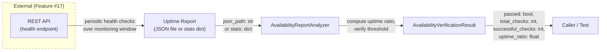
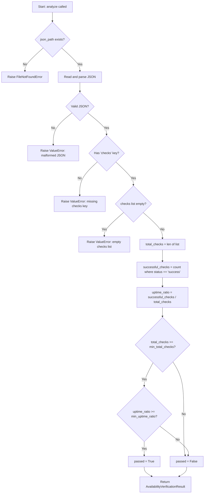

# Feature Detailed Design: NFR-005: Service Availability 99.9% (Feature #30)

**Date**: 2026-03-23
**Feature**: #30 — NFR-005: Service Availability 99.9%
**Priority**: low
**Dependencies**: Feature #17 (REST API Endpoints)
**Design Reference**: docs/plans/2026-03-21-code-context-retrieval-design.md § NFR compliance path
**SRS Reference**: NFR-007

## Context

This feature verifies the non-functional requirement that the query service achieves 99.9% uptime with health monitoring and automatic recovery from transient failures. It does not add new business logic — it builds an `AvailabilityReportAnalyzer` that evaluates whether an uptime monitoring report meets the NFR-007 availability threshold, and an `AvailabilityVerificationResult` dataclass to carry the verdict. The analyzer can parse a JSON uptime report (listing health check samples with timestamps and outcomes over a monitoring window) or accept programmatic stats, mirroring the pattern established by Features #26-#29.

## Design Alignment

**System design context** (from § NFR compliance path):
> 99.9% uptime: Stateless query nodes behind load balancer. ES/Qdrant have built-in replication.

**NFR-007** (from SRS § 5):
> Reliability: Service availability, 99.9% uptime for query service. Measurement: Uptime monitoring over 30-day window.

- **Key classes**: `AvailabilityReportAnalyzer` (new), `AvailabilityVerificationResult` (new) — mirrors the `CapacityReportAnalyzer` / `CapacityVerificationResult` pattern from Feature #28
- **Interaction flow**: A JSON uptime report (or programmatic stats dict) listing health check samples with timestamps and success/failure outcomes over a monitoring window -> `AvailabilityReportAnalyzer.analyze()` -> computes uptime percentage from successful checks / total checks -> compares against threshold -> returns `AvailabilityVerificationResult`
- **Third-party deps**: `json` (stdlib), `dataclasses` (stdlib) — no new dependencies
- **Deviations**: None. Follows the same analyzer/result pattern as NFR-001 through NFR-004.

## SRS Requirement

**NFR-007 — Reliability: Service Availability**

| Field | Value |
|-------|-------|
| ID | NFR-007 |
| Category (ISO 25010) | Reliability |
| Priority | Must |
| Requirement | Service availability |
| Measurable Criterion | 99.9% uptime for query service |
| Measurement Method | Uptime monitoring over 30-day window |

**Verification Step (VS-1)**:
> Given the query service running with health check endpoint, when monitored over a test window, then uptime exceeds 99.9% with automatic recovery from transient failures

This maps to postconditions: (1) uptime_ratio (successful_checks / total_checks) >= `min_uptime_ratio` (default 0.999), (2) total_checks >= `min_total_checks` (minimum monitoring window coverage), and (3) the report covers a sufficient window to be statistically meaningful.

## Component Data-Flow Diagram



## Interface Contract

| Method | Signature | Preconditions | Postconditions | Raises |
|--------|-----------|---------------|----------------|--------|
| `AvailabilityReportAnalyzer.analyze` | `analyze(json_path: str, min_uptime_ratio: float = 0.999, min_total_checks: int = 1) -> AvailabilityVerificationResult` | Given a file at `json_path` that is a valid JSON file containing a `"checks"` key with a list of objects each having `"status"` (str: `"success"` or `"failure"`) | Returns `AvailabilityVerificationResult` where `passed` is True iff `uptime_ratio` >= `min_uptime_ratio` AND `total_checks` >= `min_total_checks`; uptime_ratio = successful_checks / total_checks; all numeric fields populated from the JSON | `FileNotFoundError` if json_path does not exist; `ValueError` if JSON is malformed, missing `"checks"` key, or checks list is empty |
| `AvailabilityReportAnalyzer.analyze_from_stats` | `analyze_from_stats(stats: dict, min_uptime_ratio: float = 0.999, min_total_checks: int = 1) -> AvailabilityVerificationResult` | Given a dict with keys: `total_checks` (int), `successful_checks` (int) | Returns `AvailabilityVerificationResult` with computed uptime_ratio and pass/fail verdict using the two-condition logic | `ValueError` if stats dict is missing required keys or any value is negative |
| `AvailabilityVerificationResult.summary` | `summary() -> str` | Instance is fully initialized | Returns a string containing "NFR-007", verdict ("PASS"/"FAIL"), total_checks, successful_checks, uptime_ratio, and thresholds | — |

**Design rationale**:
- `min_uptime_ratio` defaults to 0.999 (99.9%) per NFR-007 measurable criterion (99.9% uptime)
- `min_total_checks` defaults to 1 (minimum meaningful monitoring data); callers can raise this to enforce a minimum monitoring window (e.g., 43200 checks for 30-day window at 1-minute intervals)
- Two-condition pass logic: (1) uptime_ratio >= min_uptime_ratio, (2) total_checks >= min_total_checks — both must be true to pass
- JSON report format uses a `"checks"` key with a list of check results, each having a `"status"` field — `"success"` means the health check passed, anything else counts as a failure
- `analyze_from_stats` provides a programmatic alternative for tests, matching the pattern in NFR-001/002/003/004
- The summary references "NFR-007" (SRS numbering) to maintain traceability to the SRS requirement

## Internal Sequence Diagram

N/A — single-class implementation, error paths documented in Algorithm error handling table

## Algorithm / Core Logic

### AvailabilityReportAnalyzer.analyze

#### Flow Diagram



#### Pseudocode

```
FUNCTION analyze(json_path: str, min_uptime_ratio: float = 0.999, min_total_checks: int = 1) -> AvailabilityVerificationResult
  // Step 1: Validate file exists
  IF NOT file_exists(json_path) THEN
    RAISE FileNotFoundError(json_path)

  // Step 2: Parse JSON
  TRY
    data = json.load(open(json_path))
  CATCH JSONDecodeError
    RAISE ValueError("malformed JSON in report file")

  // Step 3: Extract checks list
  IF "checks" NOT IN data THEN
    RAISE ValueError("missing 'checks' key in JSON")
  checks = data["checks"]
  IF checks IS EMPTY THEN
    RAISE ValueError("checks list must not be empty")

  // Step 4: Compute metrics
  total_checks = len(checks)
  successful_checks = count(c for c in checks if c["status"] == "success")
  uptime_ratio = successful_checks / total_checks

  // Step 5: Evaluate pass criteria
  passed = (total_checks >= min_total_checks) AND (uptime_ratio >= min_uptime_ratio)

  RETURN AvailabilityVerificationResult(passed, total_checks, successful_checks, uptime_ratio, min_uptime_ratio, min_total_checks)
END
```

### AvailabilityReportAnalyzer.analyze_from_stats

#### Pseudocode

```
FUNCTION analyze_from_stats(stats: dict, min_uptime_ratio: float = 0.999, min_total_checks: int = 1) -> AvailabilityVerificationResult
  // Step 1: Validate required keys
  IF "total_checks" NOT IN stats OR "successful_checks" NOT IN stats THEN
    RAISE ValueError("stats must contain 'total_checks' and 'successful_checks'")

  total_checks = stats["total_checks"]
  successful_checks = stats["successful_checks"]

  // Step 2: Validate non-negative
  IF total_checks < 0 OR successful_checks < 0 THEN
    RAISE ValueError("check counts must be non-negative")

  // Step 3: Compute uptime ratio (guard division by zero)
  IF total_checks == 0 THEN
    uptime_ratio = 0.0
  ELSE
    uptime_ratio = successful_checks / total_checks

  // Step 4: Evaluate pass criteria
  passed = (total_checks >= min_total_checks) AND (uptime_ratio >= min_uptime_ratio)

  RETURN AvailabilityVerificationResult(passed, total_checks, successful_checks, uptime_ratio, min_uptime_ratio, min_total_checks)
END
```

#### Boundary Decisions

| Parameter | Min | Max | Empty/Null | At boundary |
|-----------|-----|-----|------------|-------------|
| `json_path` | — | — | FileNotFoundError | Valid file with empty checks list -> ValueError |
| `min_uptime_ratio` | 0.0 | 1.0 | N/A (float) | uptime_ratio == min_uptime_ratio -> passed (uses >=) |
| `min_total_checks` | 0 | unbounded | N/A (int) | total_checks == min_total_checks -> passed (uses >=) |
| `total_checks` (stats) | 0 | unbounded | ValueError if missing | total_checks == 0 not possible via analyze (empty list rejected); via stats: uptime_ratio = 0.0 |
| `successful_checks` (stats) | 0 | total_checks | ValueError if missing | successful_checks == 0 -> uptime_ratio = 0.0 |
| `checks` (JSON) | 1 item | unbounded | ValueError if empty list | 1 item with status="success" -> uptime_ratio = 1.0 |

#### Error Handling

| Condition | Detection | Response | Recovery |
|-----------|-----------|----------|----------|
| File not found | `os.path.exists(json_path)` returns False | `FileNotFoundError(json_path)` | Caller provides correct path |
| Malformed JSON | `json.JSONDecodeError` during parsing | `ValueError("malformed JSON in report file")` | Caller fixes JSON format |
| Missing checks key | `"checks" not in data` | `ValueError("missing 'checks' key in JSON")` | Caller fixes report schema |
| Empty checks list | `len(checks) == 0` | `ValueError("checks list must not be empty")` | Caller provides non-empty report |
| Missing stats keys | Key not in stats dict | `ValueError("stats must contain 'total_checks' and 'successful_checks'")` | Caller provides required keys |
| Negative stat values | Any value < 0 | `ValueError("check counts must be non-negative")` | Caller provides valid counts |

## State Diagram

N/A — stateless feature

## Test Inventory

| ID | Category | Traces To | Input / Setup | Expected | Kills Which Bug? |
|----|----------|-----------|---------------|----------|-----------------|
| A | happy path | VS-1, NFR-007 | JSON with 1000 checks, all status="success", min_uptime_ratio=0.999 | passed=True, total_checks=1000, successful_checks=1000, uptime_ratio=1.0 | Analyzer always returns False |
| B | happy path | VS-1, NFR-007 | JSON with 10000 checks, 9995 success and 5 failure (99.95% uptime), min_uptime_ratio=0.999 | passed=True, uptime_ratio=0.9995 >= 0.999 | Analyzer fails on ratios slightly above threshold |
| C | happy path (fail) | VS-1, NFR-007 | JSON with 1000 checks, 998 success and 2 failure (99.8% uptime), min_uptime_ratio=0.999 | passed=False, uptime_ratio=0.998 < 0.999 | Missing uptime ratio comparison |
| D | happy path (fail) | VS-1, NFR-007 | JSON with 5 checks, all success, min_total_checks=100 | passed=False (total_checks=5 < min_total_checks=100) | Missing min_total_checks condition |
| E | happy path | VS-1, NFR-007 | JSON with 100 checks, all success, min_total_checks=100 | passed=True (total_checks=100 == min_total_checks) | Off-by-one in min_total_checks comparison |
| F | happy path | VS-1, NFR-007 | analyze_from_stats with total_checks=43200, successful_checks=43157 (99.9004% uptime) | passed=True, uptime_ratio=0.999004... >= 0.999 | Stats path returns wrong verdict |
| G | boundary | §Algorithm boundary table | JSON with 1000 checks, 999 success (uptime_ratio=0.999 exactly), min_uptime_ratio=0.999 | passed=True (uptime_ratio == min_uptime_ratio, uses >=) | Off-by-one: using > instead of >= for uptime_ratio |
| H | boundary | §Algorithm boundary table | JSON with 10000 checks, 9989 success (uptime_ratio=0.9989), min_uptime_ratio=0.999 | passed=False (0.9989 < 0.999) | Off-by-one: boundary not enforced |
| I | boundary | §Algorithm boundary table | analyze_from_stats with total_checks=0, successful_checks=0, min_total_checks=1 | passed=False, uptime_ratio=0.0, no ZeroDivisionError | Division by zero when total_checks=0 |
| J | boundary | §Algorithm boundary table | JSON with 1 check, status="success", min_uptime_ratio=0.999 | passed=True, uptime_ratio=1.0 (single check, minimum list size) | Breaks on single-element list |
| K | boundary | §Algorithm boundary table | JSON with 1 check, status="failure" | passed=False, uptime_ratio=0.0 | Always treating all checks as success |
| L | error | §Interface Contract Raises | json_path="/nonexistent/report.json" | FileNotFoundError | Missing file existence check |
| M | error | §Interface Contract Raises | JSON file with invalid JSON content | ValueError("malformed JSON") | Uncaught JSONDecodeError |
| N | error | §Interface Contract Raises | JSON file without "checks" key | ValueError("missing 'checks' key") | Missing key validation |
| O | error | §Interface Contract Raises | JSON file with empty checks list | ValueError("checks list must not be empty") | Missing empty-list guard |
| P | error | §Interface Contract Raises | analyze_from_stats with missing keys | ValueError("stats must contain") | Missing key validation in stats path |
| Q | error | §Interface Contract Raises | analyze_from_stats with negative total_checks=-1 | ValueError("check counts must be non-negative") | Missing negative value guard |
| R | happy path | §Interface Contract summary | AvailabilityVerificationResult with passed=True | summary contains "NFR-007", "PASS", total_checks, uptime_ratio | summary() returns wrong format |
| S | happy path | §Interface Contract summary | AvailabilityVerificationResult with passed=False | summary contains "FAIL", thresholds | summary() always shows PASS |

**Negative test ratio**: Negative tests (error + boundary-fail): C (happy-path-fail), D (happy-path-fail), H (boundary-fail), I (boundary-zero), K (boundary-fail), L (error), M (error), N (error), O (error), P (error), Q (error) = 11 negative out of 19 total = 57.9% (>= 40%)

## Tasks

### Task 1: Write failing tests
**Files**: `tests/test_nfr_005_service_availability.py`
**Steps**:
1. Create test file with imports for `AvailabilityReportAnalyzer`, `AvailabilityVerificationResult`, `pytest`, `json`
2. Write helper functions: `_write_json(tmp_path, checks, filename)` to create JSON uptime report files, `_check_list(n_success, n_failure)` to generate check dicts with `status` fields
3. Write test code for each row in Test Inventory (§7):
   - Test A: 1000 checks all success -> passed=True
   - Test B: 10000 checks, 9995 success, 5 failure -> passed=True (99.95%)
   - Test C: 1000 checks, 998 success, 2 failure -> passed=False (99.8%)
   - Test D: 5 checks all success, min_total_checks=100 -> passed=False
   - Test E: 100 checks all success, min_total_checks=100 -> passed=True
   - Test F: stats with 43200 total, 43157 success -> passed=True
   - Test G: 1000 checks, 999 success -> passed=True (exactly 0.999)
   - Test H: 10000 checks, 9989 success -> passed=False (0.9989)
   - Test I: stats with total_checks=0 -> passed=False, no ZeroDivisionError
   - Test J: 1 check success -> passed=True
   - Test K: 1 check failure -> passed=False
   - Test L: nonexistent file -> FileNotFoundError
   - Test M: invalid JSON -> ValueError
   - Test N: missing checks key -> ValueError
   - Test O: empty checks list -> ValueError
   - Test P: stats missing keys -> ValueError
   - Test Q: stats with negative value -> ValueError
   - Test R: summary() pass format
   - Test S: summary() fail format
4. Run: `python -m pytest tests/test_nfr_005_service_availability.py -x`
5. **Expected**: All tests FAIL (ImportError — modules do not exist yet)

### Task 2: Implement minimal code
**Files**: `src/loadtest/availability_verification_result.py`, `src/loadtest/availability_report_analyzer.py`
**Steps**:
1. Create `AvailabilityVerificationResult` dataclass with fields: `passed`, `total_checks`, `successful_checks`, `uptime_ratio`, `min_uptime_ratio`, `min_total_checks` and `summary()` method returning "NFR-007: PASS/FAIL — checks=N/M successful (uptime=X), min_uptime=Y, min_checks=Z"
2. Create `AvailabilityReportAnalyzer` class with `analyze(json_path, min_uptime_ratio, min_total_checks)` per Algorithm §5 pseudocode
3. Implement `analyze_from_stats(stats, min_uptime_ratio, min_total_checks)` per Algorithm §5 pseudocode
4. Run: `python -m pytest tests/test_nfr_005_service_availability.py -x`
5. **Expected**: All tests PASS

### Task 3: Coverage Gate
1. Run: `python -m pytest tests/test_nfr_005_service_availability.py --cov=src/loadtest/availability_report_analyzer --cov=src/loadtest/availability_verification_result --cov-report=term-missing --cov-branch`
2. Check thresholds: line >= 90%, branch >= 80%. If below: return to Task 1.
3. Record coverage output as evidence.

### Task 4: Refactor
1. Review naming consistency with NFR-001/002/003/004 patterns
2. Ensure docstrings match interface contract
3. Run full test suite: `python -m pytest tests/test_nfr_005_service_availability.py -x`
4. All tests PASS.

### Task 5: Mutation Gate
1. Run: `python -m mutmut run --paths-to-mutate=src/loadtest/availability_report_analyzer.py,src/loadtest/availability_verification_result.py --tests-dir=tests/test_nfr_005_service_availability.py`
2. Check threshold: mutation score >= 80%. If below: improve assertions.
3. Record mutation output as evidence.

### Task 6: Create example
1. Create `examples/30-nfr-005-availability-check.py` — script that creates a sample JSON uptime report, runs the analyzer, and prints the summary
2. Update `examples/README.md` with entry for example 30
3. Run example to verify.

## Verification Checklist
- [x] All verification_steps traced to Interface Contract postconditions (VS-1 -> analyze postcondition: two-condition check — uptime_ratio >= threshold AND total_checks >= min_total_checks)
- [x] All verification_steps traced to Test Inventory rows (VS-1 -> Tests A, B, C, D, E, F, G, H)
- [x] Algorithm pseudocode covers all non-trivial methods (analyze, analyze_from_stats)
- [x] Boundary table covers all algorithm parameters (json_path, min_uptime_ratio, min_total_checks, total_checks, successful_checks, checks)
- [x] Error handling table covers all Raises entries (FileNotFoundError, ValueError x4, negative values)
- [x] Test Inventory negative ratio >= 40% (57.9%)
- [x] Every skipped section has explicit "N/A — [reason]" (Internal Sequence Diagram, State Diagram)
