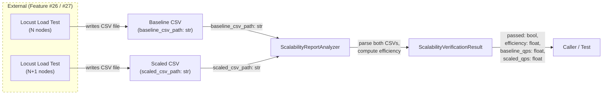
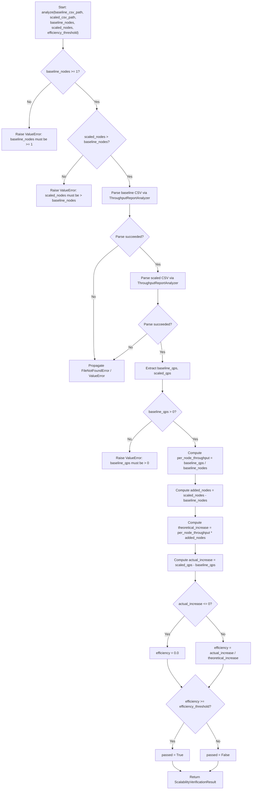

# Feature Detailed Design: NFR-006: Linear Scalability >= 70% (Feature #31)

**Date**: 2026-03-23
**Feature**: #31 — NFR-006: Linear Scalability >= 70%
**Priority**: low
**Dependencies**: Feature #27 (NFR-002: Query Throughput)
**Design Reference**: docs/plans/2026-03-21-code-context-retrieval-design.md § 1 (Design Drivers, NFR-006 row) and § 9 (Testing Strategy, Load tests row)
**SRS Reference**: NFR-006

## Context

This feature verifies that the system achieves at least 70% linear scalability when adding query nodes — that is, given N nodes achieving X QPS, deploying N+1 nodes yields a throughput increase of at least 0.7 * (X/N). It builds on Feature #27's `ThroughputReportAnalyzer` by adding a `ScalabilityReportAnalyzer` that accepts multi-node Locust stats (baseline N-node QPS and scaled (N+1)-node QPS), computes the scalability efficiency, and compares it against the 70% threshold. A `ScalabilityVerificationResult` dataclass carries the verdict and metrics.

## Design Alignment

**System design context** (from § 1 Design Drivers):
> **>= 70% linear scaling** (NFR-006): Stateless design, no shared mutable state in query path

**Testing strategy** (from § 9):
> Load tests | NFR-001, NFR-002 | Locust | p95 < 1s, >= 1000 QPS
> NFR tests run as dedicated performance/scale test suites.

- **Key classes**: `ScalabilityReportAnalyzer` (new), `ScalabilityVerificationResult` (new) — mirrors the `ThroughputReportAnalyzer` / `ThroughputVerificationResult` pattern from Feature #27
- **Interaction flow**: Two Locust load test runs produce CSV stats (N-node baseline, (N+1)-node scaled) -> `ScalabilityReportAnalyzer.analyze(baseline_csv, scaled_csv, baseline_nodes, scaled_nodes)` -> parses Aggregated rows from both CSVs -> extracts QPS -> computes per-node throughput and scalability efficiency -> compares against threshold -> returns `ScalabilityVerificationResult`
- **Third-party deps**: csv (stdlib), dataclasses (stdlib), `ThroughputReportAnalyzer` from Feature #27 (for CSV parsing reuse) — no new external dependencies
- **Deviations**: None. Follows the same CSV-parsing pattern as ThroughputReportAnalyzer, adding a cross-run comparison layer.

## SRS Requirement

**NFR-006 — Scalability: Horizontal Scaling**

| Field | Value |
|-------|-------|
| ID | NFR-006 |
| Category (ISO 25010) | Scalability |
| Priority | Must |
| Requirement | Horizontal scaling |
| Measurable Criterion | Adding 1 node yields >= 70% of theoretical throughput increase for index workers, query nodes, and rerank nodes |
| Measurement Method | Deploy N+1 nodes; measure throughput delta vs. N nodes |

**Verification Step (VS-1)**:
> Given N query nodes achieving X QPS, when deploying N+1 nodes, then throughput increases by >= 0.7 * (X/N)

This maps to: (1) compute per-node baseline = X / N, (2) compute actual increase = scaled_qps - baseline_qps, (3) compute theoretical increase = per_node_baseline, (4) compute efficiency = actual_increase / theoretical_increase, (5) pass iff efficiency >= 0.70.

## Component Data-Flow Diagram



## Interface Contract

| Method | Signature | Preconditions | Postconditions | Raises |
|--------|-----------|---------------|----------------|--------|
| `ScalabilityReportAnalyzer.analyze` | `analyze(baseline_csv_path: str, scaled_csv_path: str, baseline_nodes: int, scaled_nodes: int, efficiency_threshold: float = 0.70) -> ScalabilityVerificationResult` | Given valid Locust stats CSV files at both paths, each containing an "Aggregated" row with "Requests/s", "Request Count", and "Failure Count" columns; `baseline_nodes >= 1`; `scaled_nodes > baseline_nodes` | Returns `ScalabilityVerificationResult` where `passed` is True iff computed efficiency >= `efficiency_threshold`; all numeric fields populated from the two CSV files | `FileNotFoundError` if either csv_path does not exist; `ValueError` if either CSV has no Aggregated row or is missing required columns; `ValueError` if `baseline_nodes < 1` or `scaled_nodes <= baseline_nodes` |
| `ScalabilityReportAnalyzer.analyze_from_stats` | `analyze_from_stats(baseline_qps: float, scaled_qps: float, baseline_nodes: int, scaled_nodes: int, efficiency_threshold: float = 0.70) -> ScalabilityVerificationResult` | Given `baseline_qps > 0`, `baseline_nodes >= 1`, `scaled_nodes > baseline_nodes` | Returns `ScalabilityVerificationResult` with computed efficiency and pass/fail verdict | `ValueError` if `baseline_qps <= 0` or `baseline_nodes < 1` or `scaled_nodes <= baseline_nodes` |
| `ScalabilityVerificationResult.summary` | `summary() -> str` | Instance is fully initialized | Returns a string containing "NFR-006", verdict ("PASS"/"FAIL"), efficiency percentage, baseline QPS, scaled QPS, node counts, and threshold | — |

**Design rationale**:
- `efficiency_threshold` defaults to 0.70 per NFR-006 measurable criterion (>= 70% of theoretical throughput increase)
- `baseline_nodes` and `scaled_nodes` are required because the efficiency formula requires knowing node counts: `efficiency = (scaled_qps - baseline_qps) / (baseline_qps / baseline_nodes * (scaled_nodes - baseline_nodes))`
- `scaled_nodes > baseline_nodes` enforced because scalability measurement requires adding nodes
- `baseline_qps > 0` enforced to avoid division by zero in per-node throughput calculation
- `analyze_from_stats` provides a programmatic alternative for tests that already have QPS values without CSV I/O
- Reuses `ThroughputReportAnalyzer` internally for CSV parsing to avoid duplicating Locust CSV parsing logic

## Internal Sequence Diagram

> N/A — single-class implementation, error paths documented in Algorithm error handling table. `ScalabilityReportAnalyzer` delegates CSV parsing to `ThroughputReportAnalyzer` and performs a single computation step.

## Algorithm / Core Logic

### ScalabilityReportAnalyzer.analyze

#### Flow Diagram



#### Pseudocode

```
FUNCTION analyze(baseline_csv_path: str, scaled_csv_path: str, baseline_nodes: int, scaled_nodes: int, efficiency_threshold: float = 0.70) -> ScalabilityVerificationResult
  // Step 1: Validate node counts
  IF baseline_nodes < 1 THEN RAISE ValueError("baseline_nodes must be >= 1")
  IF scaled_nodes <= baseline_nodes THEN RAISE ValueError("scaled_nodes must be > baseline_nodes")

  // Step 2: Parse both CSVs using ThroughputReportAnalyzer (reuse CSV parsing)
  throughput_analyzer = ThroughputReportAnalyzer()
  baseline_result = throughput_analyzer.analyze(baseline_csv_path, qps_threshold=0.0)
  scaled_result = throughput_analyzer.analyze(scaled_csv_path, qps_threshold=0.0)
  // Note: qps_threshold=0.0 so CSV parsing does not fail on throughput check

  baseline_qps = baseline_result.qps
  scaled_qps = scaled_result.qps

  // Step 3: Validate baseline QPS
  IF baseline_qps <= 0 THEN RAISE ValueError("baseline QPS must be > 0 for scalability calculation")

  // Step 4: Compute scalability efficiency
  per_node_throughput = baseline_qps / baseline_nodes
  added_nodes = scaled_nodes - baseline_nodes
  theoretical_increase = per_node_throughput * added_nodes
  actual_increase = scaled_qps - baseline_qps

  IF actual_increase <= 0 THEN
    efficiency = 0.0
  ELSE
    efficiency = actual_increase / theoretical_increase

  // Step 5: Evaluate pass condition
  passed = efficiency >= efficiency_threshold

  RETURN ScalabilityVerificationResult(
    passed=passed,
    efficiency=efficiency,
    baseline_qps=baseline_qps,
    scaled_qps=scaled_qps,
    baseline_nodes=baseline_nodes,
    scaled_nodes=scaled_nodes,
    efficiency_threshold=efficiency_threshold
  )
END
```

### ScalabilityReportAnalyzer.analyze_from_stats

#### Pseudocode

```
FUNCTION analyze_from_stats(baseline_qps: float, scaled_qps: float, baseline_nodes: int, scaled_nodes: int, efficiency_threshold: float = 0.70) -> ScalabilityVerificationResult
  // Step 1: Validate inputs
  IF baseline_qps <= 0 THEN RAISE ValueError("baseline_qps must be > 0")
  IF baseline_nodes < 1 THEN RAISE ValueError("baseline_nodes must be >= 1")
  IF scaled_nodes <= baseline_nodes THEN RAISE ValueError("scaled_nodes must be > baseline_nodes")

  // Step 2: Compute scalability efficiency
  per_node_throughput = baseline_qps / baseline_nodes
  added_nodes = scaled_nodes - baseline_nodes
  theoretical_increase = per_node_throughput * added_nodes
  actual_increase = scaled_qps - baseline_qps

  IF actual_increase <= 0 THEN
    efficiency = 0.0
  ELSE
    efficiency = actual_increase / theoretical_increase

  // Step 3: Evaluate pass condition
  passed = efficiency >= efficiency_threshold

  RETURN ScalabilityVerificationResult(
    passed=passed,
    efficiency=efficiency,
    baseline_qps=baseline_qps,
    scaled_qps=scaled_qps,
    baseline_nodes=baseline_nodes,
    scaled_nodes=scaled_nodes,
    efficiency_threshold=efficiency_threshold
  )
END
```

#### Boundary Decisions

| Parameter | Min | Max | Empty/Null | At boundary |
|-----------|-----|-----|------------|-------------|
| `baseline_csv_path` | — | — | FileNotFoundError | valid path with valid CSV |
| `scaled_csv_path` | — | — | FileNotFoundError | valid path with valid CSV |
| `baseline_nodes` | 1 | no max | ValueError if < 1 | 1 is valid minimum |
| `scaled_nodes` | baseline_nodes + 1 | no max | ValueError if <= baseline_nodes | baseline_nodes + 1 is valid minimum |
| `efficiency_threshold` | 0.0 | 1.0 | 0.0 means any non-negative efficiency passes | efficiency == threshold passes (>=) |
| `baseline_qps` | > 0.0 | no max | ValueError if <= 0 | very small positive value is valid |
| `scaled_qps` | 0.0 | no max | 0.0 → actual_increase <= 0 → efficiency = 0.0 | scaled_qps == baseline_qps → efficiency = 0.0 |

#### Error Handling

| Condition | Detection | Response | Recovery |
|-----------|-----------|----------|----------|
| Baseline CSV file does not exist | Propagated from `ThroughputReportAnalyzer.analyze()` | `FileNotFoundError(baseline_csv_path)` | Caller provides correct path |
| Scaled CSV file does not exist | Propagated from `ThroughputReportAnalyzer.analyze()` | `FileNotFoundError(scaled_csv_path)` | Caller provides correct path |
| No Aggregated row in baseline CSV | Propagated from `ThroughputReportAnalyzer.analyze()` | `ValueError("no aggregated stats row in CSV")` | Caller ensures Locust ran to completion |
| No Aggregated row in scaled CSV | Propagated from `ThroughputReportAnalyzer.analyze()` | `ValueError("no aggregated stats row in CSV")` | Caller ensures Locust ran to completion |
| Missing required column in CSV | Propagated from `ThroughputReportAnalyzer.analyze()` | `ValueError("malformed CSV: missing column {e}")` | Caller provides valid Locust CSV |
| baseline_nodes < 1 | `baseline_nodes < 1` check | `ValueError("baseline_nodes must be >= 1")` | Caller provides valid node count |
| scaled_nodes <= baseline_nodes | `scaled_nodes <= baseline_nodes` check | `ValueError("scaled_nodes must be > baseline_nodes")` | Caller provides valid scaled node count |
| baseline_qps <= 0 | `baseline_qps <= 0` check after CSV parse | `ValueError("baseline QPS must be > 0 for scalability calculation")` | Baseline load test must produce requests |
| baseline_qps <= 0 (from_stats) | `baseline_qps <= 0` check | `ValueError("baseline_qps must be > 0")` | Caller provides valid QPS |
| Scaled QPS <= baseline QPS | `actual_increase <= 0` check | `efficiency = 0.0` (graceful — not an error) | Informational — scaling did not help |

### ScalabilityVerificationResult.summary

#### Pseudocode

```
FUNCTION summary() -> str
  verdict = "PASS" IF self.passed ELSE "FAIL"
  RETURN f"NFR-006: {verdict} — efficiency={self.efficiency:.2%} (threshold={self.efficiency_threshold:.2%}), baseline_qps={self.baseline_qps:.1f} ({self.baseline_nodes} nodes), scaled_qps={self.scaled_qps:.1f} ({self.scaled_nodes} nodes)"
END
```

## State Diagram

> N/A — stateless feature. `ScalabilityReportAnalyzer` is a pure function wrapper with no lifecycle state.

## Test Inventory

| ID | Category | Traces To | Input / Setup | Expected | Kills Which Bug? |
|----|----------|-----------|---------------|----------|-----------------|
| A | happy path | VS-1, NFR-006 | Baseline CSV: 1000 QPS, 2 nodes; Scaled CSV: 1400 QPS, 3 nodes. Efficiency = (1400-1000)/(1000/2) = 400/500 = 0.80 | passed=True, efficiency=0.80 | Analyzer always returns False |
| B | happy path | VS-1, NFR-006 | Baseline CSV: 1000 QPS, 2 nodes; Scaled CSV: 1200 QPS, 3 nodes. Efficiency = 200/500 = 0.40 | passed=False, efficiency=0.40 | Analyzer always returns True |
| C | happy path | VS-1, NFR-006 | analyze_from_stats: baseline_qps=900, scaled_qps=1530, baseline_nodes=3, scaled_nodes=5. Efficiency = (1530-900)/(900/3*2) = 630/600 = 1.05 | passed=True, efficiency=1.05 (super-linear) | analyze_from_stats not computing correctly |
| D | happy path | VS-1, NFR-006 | analyze_from_stats: baseline_qps=1000, scaled_qps=1350, baseline_nodes=2, scaled_nodes=3. Efficiency = 350/500 = 0.70 | passed=True, efficiency=0.70 (exactly at threshold) | Off-by-one using > instead of >= for efficiency |
| E | boundary | §Algorithm boundary table | analyze_from_stats: baseline_qps=1000, scaled_qps=1349, baseline_nodes=2, scaled_nodes=3. Efficiency = 349/500 = 0.698 | passed=False, efficiency=0.698 (just below threshold) | Off-by-one: rounding makes it pass when it should fail |
| F | boundary | §Algorithm boundary table | analyze_from_stats: baseline_qps=1000, scaled_qps=900, baseline_nodes=2, scaled_nodes=3. actual_increase = -100 | passed=False, efficiency=0.0 (negative increase clamped to 0) | Negative actual_increase causes negative efficiency or crash |
| G | boundary | §Algorithm boundary table | analyze_from_stats: baseline_qps=1000, scaled_qps=1000, baseline_nodes=2, scaled_nodes=3. actual_increase = 0 | passed=False, efficiency=0.0 | Zero increase not handled |
| H | boundary | §Algorithm boundary table | efficiency_threshold=0.0, analyze_from_stats: baseline_qps=1000, scaled_qps=1000, baseline_nodes=2, scaled_nodes=3 | passed=True (0.0 >= 0.0) | Zero threshold not handled correctly |
| I | boundary | §Algorithm boundary table | baseline_nodes=1, scaled_nodes=2. analyze_from_stats: baseline_qps=500, scaled_qps=850. Efficiency = 350/500 = 0.70 | passed=True, efficiency=0.70 | Minimum node count boundary fails |
| J | error | §Interface Contract Raises | analyze: baseline_csv_path="/nonexistent/path.csv" | FileNotFoundError | Missing file existence check (delegated) |
| K | error | §Interface Contract Raises | analyze: scaled_csv_path="/nonexistent/path.csv" (baseline valid) | FileNotFoundError | Only checks baseline path |
| L | error | §Interface Contract Raises | analyze: baseline_nodes=0 | ValueError("baseline_nodes must be >= 1") | Missing node count validation |
| M | error | §Interface Contract Raises | analyze: scaled_nodes=baseline_nodes (e.g., both 2) | ValueError("scaled_nodes must be > baseline_nodes") | Missing scaled > baseline check |
| N | error | §Interface Contract Raises | analyze: scaled_nodes < baseline_nodes (e.g., 1, 2 reversed) | ValueError("scaled_nodes must be > baseline_nodes") | Accepts reversed node counts |
| O | error | §Interface Contract Raises | analyze_from_stats: baseline_qps=0.0 | ValueError("baseline_qps must be > 0") | Division by zero in per-node computation |
| P | error | §Interface Contract Raises | analyze_from_stats: baseline_qps=-10.0 | ValueError("baseline_qps must be > 0") | Negative QPS accepted |
| Q | error | §Interface Contract Raises | analyze: baseline CSV has 0.0 QPS in Aggregated row | ValueError("baseline QPS must be > 0 for scalability calculation") | Zero QPS from CSV not caught |
| R | happy path | §Interface Contract summary | ScalabilityVerificationResult(passed=True, efficiency=0.80, ...) | summary contains "NFR-006", "PASS", "80.00%", baseline/scaled QPS and node counts | summary returns empty or wrong format |
| S | happy path | §Interface Contract summary | ScalabilityVerificationResult(passed=False, efficiency=0.40, ...) | summary contains "FAIL", "40.00%" | summary always shows PASS |

**Negative test ratio**:
- Happy path: A, B, C, D, R, S = 6
- Boundary: E, F, G, H, I = 5
- Error: J, K, L, M, N, O, P, Q = 8

Negative (error + boundary) = 13 / 19 = 68% >= 40% threshold.

## Tasks

### Task 1: Write failing tests
**Files**: `tests/test_nfr_006_linear_scalability.py`
**Steps**:
1. Create test file with imports from `src.loadtest.scalability_report_analyzer` and `src.loadtest.scalability_verification_result`
2. Write CSV helper functions reusing the same Locust CSV header pattern from `tests/test_nfr_002_query_throughput.py` — a helper that creates a temp CSV with an Aggregated row containing a given Requests/s value
3. Write test methods for each Test Inventory row (A through S):
   - Test A: Two CSVs (1000 QPS baseline / 2 nodes, 1400 QPS scaled / 3 nodes), verify passed=True, efficiency=0.80
   - Test B: Two CSVs (1000 QPS / 2 nodes, 1200 QPS / 3 nodes), verify passed=False, efficiency=0.40
   - Test C: analyze_from_stats(900, 1530, 3, 5), verify passed=True, efficiency=1.05
   - Test D: analyze_from_stats(1000, 1350, 2, 3), verify passed=True, efficiency=0.70
   - Test E: analyze_from_stats(1000, 1349, 2, 3), verify passed=False, efficiency=0.698
   - Test F: analyze_from_stats(1000, 900, 2, 3), verify passed=False, efficiency=0.0
   - Test G: analyze_from_stats(1000, 1000, 2, 3), verify passed=False, efficiency=0.0
   - Test H: analyze_from_stats(1000, 1000, 2, 3, threshold=0.0), verify passed=True
   - Test I: analyze_from_stats(500, 850, 1, 2), verify passed=True, efficiency=0.70
   - Test J: analyze with nonexistent baseline_csv_path, verify FileNotFoundError
   - Test K: analyze with nonexistent scaled_csv_path, verify FileNotFoundError
   - Test L: analyze with baseline_nodes=0, verify ValueError
   - Test M: analyze with scaled_nodes == baseline_nodes, verify ValueError
   - Test N: analyze with scaled_nodes < baseline_nodes, verify ValueError
   - Test O: analyze_from_stats with baseline_qps=0.0, verify ValueError
   - Test P: analyze_from_stats with baseline_qps=-10.0, verify ValueError
   - Test Q: analyze with baseline CSV having 0.0 QPS, verify ValueError
   - Test R: summary() on passing result, check format contains "NFR-006", "PASS"
   - Test S: summary() on failing result, check format contains "FAIL"
4. Run: `python -m pytest tests/test_nfr_006_linear_scalability.py -x --tb=short 2>&1 | head -50`
5. **Expected**: All tests FAIL (ImportError — modules don't exist yet)

### Task 2: Implement minimal code
**Files**: `src/loadtest/scalability_verification_result.py`, `src/loadtest/scalability_report_analyzer.py`
**Steps**:
1. Create `src/loadtest/scalability_verification_result.py`:
   - Dataclass `ScalabilityVerificationResult` with fields: `passed`, `efficiency`, `baseline_qps`, `scaled_qps`, `baseline_nodes`, `scaled_nodes`, `efficiency_threshold`
   - `summary()` method per Algorithm pseudocode
2. Create `src/loadtest/scalability_report_analyzer.py`:
   - Class `ScalabilityReportAnalyzer` with `analyze()` and `analyze_from_stats()` per Algorithm pseudocode
   - Import `ThroughputReportAnalyzer` for CSV parsing delegation
   - Node count validation, QPS extraction, efficiency computation, threshold comparison
3. Run: `python -m pytest tests/test_nfr_006_linear_scalability.py -x --tb=short`
4. **Expected**: All tests PASS

### Task 3: Coverage Gate
1. Run: `python -m pytest tests/test_nfr_006_linear_scalability.py --cov=src/loadtest/scalability_report_analyzer --cov=src/loadtest/scalability_verification_result --cov-report=term-missing --cov-fail-under=90`
2. Check thresholds: line >= 90%, branch >= 80%. If below: return to Task 1.
3. Record coverage output as evidence.

### Task 4: Refactor
1. Review whether `ScalabilityReportAnalyzer.analyze` and `analyze_from_stats` share enough efficiency-computation logic to extract a `_compute_efficiency` private helper. Extract if the duplication spans > 5 lines.
2. Verify naming consistency with peer NFR analyzers (ThroughputReportAnalyzer, LatencyReportAnalyzer).
3. Run full test suite: `python -m pytest tests/test_nfr_006_linear_scalability.py tests/test_nfr_002_query_throughput.py -x --tb=short`
4. All tests PASS.

### Task 5: Mutation Gate
1. Run: `python -m mutmut run --paths-to-mutate=src/loadtest/scalability_report_analyzer.py,src/loadtest/scalability_verification_result.py --tests-dir=tests/test_nfr_006_linear_scalability.py`
2. Check threshold: surviving mutants < 20% (mutation score >= 80%). If below: improve assertions.
3. Record mutation output as evidence.

### Task 6: Create example
1. Create `examples/31-nfr-006-scalability-check.py` — script that creates two sample CSVs (N-node and N+1-node runs) and runs ScalabilityReportAnalyzer.analyze() to print the verdict
2. Update `examples/README.md` with entry for example 31
3. Run example to verify: `python examples/31-nfr-006-scalability-check.py`

## Verification Checklist
- [x] All verification_steps traced to Interface Contract postconditions — VS-1 maps to `analyze()` and `analyze_from_stats()` postcondition (passed=True iff efficiency >= threshold)
- [x] All verification_steps traced to Test Inventory rows — VS-1 maps to tests A, B, C, D, E
- [x] Algorithm pseudocode covers all non-trivial methods — `analyze`, `analyze_from_stats`, `summary` all have pseudocode
- [x] Boundary table covers all algorithm parameters — baseline_csv_path, scaled_csv_path, baseline_nodes, scaled_nodes, efficiency_threshold, baseline_qps, scaled_qps all covered
- [x] Error handling table covers all Raises entries — FileNotFoundError (both paths), ValueError (no agg row), ValueError (missing column), ValueError (node counts), ValueError (zero QPS)
- [x] Test Inventory negative ratio >= 40% — 13/19 = 68%
- [x] Every skipped section has explicit "N/A — [reason]" — Internal Sequence Diagram and State Diagram both have N/A with reasons
