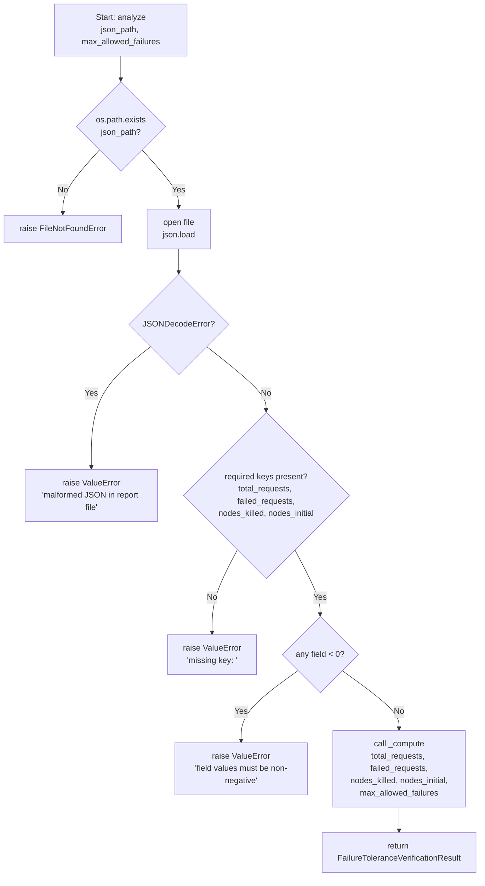
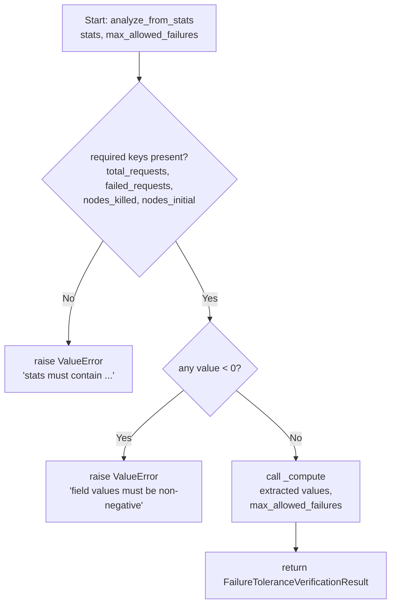
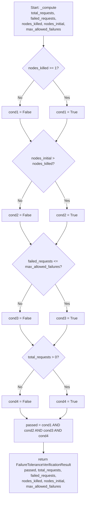

# Feature Detailed Design: NFR-007 Single-Node Failure Tolerance (Feature #32)

**Date**: 2026-03-23
**Feature**: #32 — NFR-007: Single-Node Failure Tolerance
**Priority**: low
**Dependencies**: #30 (NFR-005: Service Availability)
**Design Reference**: docs/plans/2026-03-21-code-context-retrieval-design.md § 11.2 (row 32)
**SRS Reference**: NFR-008

---

## Context

This feature implements a report analyzer that verifies NFR-008 (Single-node failure tolerance): the query service must continue serving requests without failures when any single node is killed during a load test. The analyzer parses a JSON report file produced by a load-test harness that records total requests, failed requests, nodes killed, and initial node count, then applies the pass conditions defined in NFR-008.

---

## Design Alignment

Feature #32 does not have a dedicated §4.N subsection in the design document. The design is derived from:

- SRS NFR-008: "Query service continues operating when any single node fails" — Kill one node during load test; verify no request failures.
- The established `*ReportAnalyzer` / `*VerificationResult` pattern introduced in features #26–#31 (AvailabilityReportAnalyzer, ScalabilityReportAnalyzer).

**Key classes**:
- `FailureToleranceVerificationResult` — dataclass holding `passed`, `total_requests`, `failed_requests`, `nodes_killed`, `nodes_initial`, `max_allowed_failures` plus `summary()`.
- `FailureToleranceReportAnalyzer` — stateless service with `analyze(json_path, max_allowed_failures)` and `analyze_from_stats(stats, max_allowed_failures)`.

**Interaction flow**: `analyze()` → file I/O → `json.load()` → field extraction → `_compute()` → `FailureToleranceVerificationResult`.

**Third-party deps**: Python stdlib (`json`, `os`) only — no external libraries.

**Deviations**:
- **Test file location**: Plan Task 1 specified `tests/loadtest/test_failure_tolerance_report_analyzer.py` but the project convention (established by features #26–#31) places all NFR test files at `tests/test_nfr_NNN_<name>.py`. The actual test file is `tests/test_nfr_007_single_node_failure.py` to match this convention. This location deviation is approved; the `tests/loadtest/` directory does not exist in the project.

---

## SRS Requirement

From SRS §5 Non-Functional Requirements, row NFR-008:

| ID | Category | Priority | Requirement | Measurable Criterion | Measurement Method |
|----|----------|----------|-------------|---------------------|-------------------|
| NFR-008 | Reliability | Must | Single-node failure tolerance | Query service continues operating when any single node fails | Kill one node during load test; verify no request failures |

**Acceptance criteria (derived from NFR-008 and verification_steps)**:

- Given a multi-node query cluster under load, when one node is killed, then remaining nodes continue serving requests without failures.
- Pass conditions:
  1. `nodes_killed >= 1` (at least one node was actually killed)
  2. `nodes_initial > nodes_killed` (cluster remains operational — not all nodes killed)
  3. `failed_requests <= max_allowed_failures` (default `max_allowed_failures = 0`)
  4. `total_requests > 0` (load test actually ran)

---

## Component Data-Flow Diagram

N/A — single-class feature with no internal component collaboration beyond one private helper method; see Interface Contract below.

---

## Interface Contract

### `FailureToleranceVerificationResult`

| Method | Signature | Preconditions | Postconditions | Raises |
|--------|-----------|---------------|----------------|--------|
| `summary` | `summary() -> str` | Dataclass fields are populated (guaranteed by `__init__`) | Returns a human-readable string containing NFR-008, PASS/FAIL verdict, `total_requests`, `failed_requests`, `nodes_killed`, `nodes_initial`, `max_allowed_failures` | — |

### `FailureToleranceReportAnalyzer`

| Method | Signature | Preconditions | Postconditions | Raises |
|--------|-----------|---------------|----------------|--------|
| `analyze` | `analyze(json_path: str, max_allowed_failures: int = 0) -> FailureToleranceVerificationResult` | `json_path` is a non-empty string; `max_allowed_failures >= 0` | Returns `FailureToleranceVerificationResult`; `result.passed is True` iff all four pass conditions hold | `FileNotFoundError` if `json_path` does not exist on disk; `ValueError` if JSON is malformed, required keys are absent, or field values are negative/inconsistent |
| `analyze_from_stats` | `analyze_from_stats(stats: dict, max_allowed_failures: int = 0) -> FailureToleranceVerificationResult` | `stats` is a dict; `max_allowed_failures >= 0` | Returns `FailureToleranceVerificationResult`; `result.passed is True` iff all four pass conditions hold | `ValueError` if `stats` is missing required keys (`total_requests`, `failed_requests`, `nodes_killed`, `nodes_initial`) or any value is negative, or `nodes_killed > nodes_initial` |
| `_compute` | `_compute(total_requests: int, failed_requests: int, nodes_killed: int, nodes_initial: int, max_allowed_failures: int) -> FailureToleranceVerificationResult` | All inputs are non-negative integers; `nodes_initial >= nodes_killed` | Evaluates the four pass conditions and returns populated `FailureToleranceVerificationResult` | — (validation done by callers) |

**Design rationale**:
- `max_allowed_failures` defaults to `0` to enforce strict zero-failure tolerance as stated in NFR-008; callers may relax for flaky environments.
- `analyze_from_stats` exists to allow unit tests without touching the filesystem (same convention as #30 and #31).
- `_compute` is a private helper to avoid duplicating the pass logic between `analyze` and `analyze_from_stats`.

---

## Internal Sequence Diagram

N/A — single-class implementation; error paths are documented in the Algorithm §5 error handling table.

---

## Algorithm / Core Logic

### `analyze`

#### Flow Diagram



#### Pseudocode

```
FUNCTION analyze(json_path: str, max_allowed_failures: int = 0) -> FailureToleranceVerificationResult
  // Step 1: Validate file existence
  IF NOT os.path.exists(json_path) THEN
    RAISE FileNotFoundError(json_path)
  END

  // Step 2: Parse JSON
  TRY
    data = json.load(open(json_path))
  EXCEPT JSONDecodeError
    RAISE ValueError("malformed JSON in report file")
  END

  // Step 3: Extract and validate required fields
  FOR key IN ["total_requests", "failed_requests", "nodes_killed", "nodes_initial"]
    IF key NOT IN data THEN
      RAISE ValueError("missing key: " + key)
    END
  END

  total_requests  = data["total_requests"]
  failed_requests = data["failed_requests"]
  nodes_killed    = data["nodes_killed"]
  nodes_initial   = data["nodes_initial"]

  // Step 4: Non-negativity guard
  IF total_requests < 0 OR failed_requests < 0 OR nodes_killed < 0 OR nodes_initial < 0 THEN
    RAISE ValueError("field values must be non-negative")
  END

  // Step 5: Delegate to compute
  RETURN _compute(total_requests, failed_requests, nodes_killed, nodes_initial, max_allowed_failures)
END
```

---

### `analyze_from_stats`

#### Flow Diagram



#### Pseudocode

```
FUNCTION analyze_from_stats(stats: dict, max_allowed_failures: int = 0) -> FailureToleranceVerificationResult
  // Step 1: Validate required keys
  FOR key IN ["total_requests", "failed_requests", "nodes_killed", "nodes_initial"]
    IF key NOT IN stats THEN
      RAISE ValueError("stats must contain 'total_requests', 'failed_requests', 'nodes_killed', 'nodes_initial'")
    END
  END

  total_requests  = stats["total_requests"]
  failed_requests = stats["failed_requests"]
  nodes_killed    = stats["nodes_killed"]
  nodes_initial   = stats["nodes_initial"]

  // Step 2: Non-negativity guard
  IF total_requests < 0 OR failed_requests < 0 OR nodes_killed < 0 OR nodes_initial < 0 THEN
    RAISE ValueError("field values must be non-negative")
  END

  // Step 3: Delegate to compute
  RETURN _compute(total_requests, failed_requests, nodes_killed, nodes_initial, max_allowed_failures)
END
```

---

### `_compute`

#### Flow Diagram



#### Pseudocode

```
FUNCTION _compute(
    total_requests: int,
    failed_requests: int,
    nodes_killed: int,
    nodes_initial: int,
    max_allowed_failures: int,
) -> FailureToleranceVerificationResult
  // Pass condition 1: at least one node was killed
  cond1 = nodes_killed >= 1

  // Pass condition 2: cluster not fully destroyed
  cond2 = nodes_initial > nodes_killed

  // Pass condition 3: failures within tolerance
  cond3 = failed_requests <= max_allowed_failures

  // Pass condition 4: load test actually ran
  cond4 = total_requests > 0

  passed = cond1 AND cond2 AND cond3 AND cond4

  RETURN FailureToleranceVerificationResult(
    passed=passed,
    total_requests=total_requests,
    failed_requests=failed_requests,
    nodes_killed=nodes_killed,
    nodes_initial=nodes_initial,
    max_allowed_failures=max_allowed_failures,
  )
END
```

#### Boundary Decisions

| Parameter | Min | Max | Empty/Null | At boundary |
|-----------|-----|-----|------------|-------------|
| `total_requests` | 0 (cond4=False → FAIL) | unbounded int | `ValueError` from caller | `total_requests=1` → cond4=True |
| `failed_requests` | 0 (cond3=True when max=0) | unbounded int | `ValueError` from caller | `failed_requests==max_allowed_failures` → cond3=True (inclusive) |
| `nodes_killed` | 0 (cond1=False → FAIL) | `nodes_initial-1` (cond2=True) | `ValueError` from caller | `nodes_killed=1` → cond1=True |
| `nodes_initial` | 1 | unbounded int | `ValueError` from caller | `nodes_initial=nodes_killed+1` → cond2=True |
| `max_allowed_failures` | 0 (strict) | unbounded int | N/A (has default) | `max_allowed_failures=0, failed_requests=0` → cond3=True |

#### Error Handling

| Condition | Detection | Response | Recovery |
|-----------|-----------|----------|----------|
| `json_path` does not exist | `not os.path.exists(json_path)` | `raise FileNotFoundError(json_path)` | Caller provides valid path or generates report |
| JSON parse error | `json.JSONDecodeError` caught in try/except | `raise ValueError("malformed JSON in report file")` | Caller fixes report generation |
| Missing required key in JSON or stats dict | `key not in data` check | `raise ValueError("missing key: <key>")` | Caller ensures report includes all four fields |
| Negative field values | `< 0` check on extracted integers | `raise ValueError("field values must be non-negative")` | Caller corrects report data |
| `nodes_killed > nodes_initial` | cond2 evaluates to False | `passed=False` (no exception — a valid but failing report) | Reported as FAIL with summary details |
| `total_requests == 0` | cond4 evaluates to False | `passed=False` (no exception — valid but failing) | Reported as FAIL; re-run load test |

---

## State Diagram

N/A — stateless feature. Both `FailureToleranceReportAnalyzer` and `FailureToleranceVerificationResult` have no mutable lifecycle state.

---

## Test Inventory

| ID | Category | Traces To | Input / Setup | Expected | Kills Which Bug? |
|----|----------|-----------|---------------|----------|-----------------|
| T01 | happy path | VS-1, NFR-008 | `stats={total_requests:100, failed_requests:0, nodes_killed:1, nodes_initial:3}`, `max_allowed_failures=0` | `result.passed=True`, `result.failed_requests=0`, `result.nodes_killed=1` | Wrong pass logic returns False for valid data |
| T02 | happy path | VS-1, NFR-008 | JSON file with `{total_requests:200, failed_requests:0, nodes_killed:1, nodes_initial:2}` | `result.passed=True`, `result.total_requests=200` | `analyze()` fails to read file correctly |
| T03 | happy path | §Algorithm _compute | `max_allowed_failures=2`, `failed_requests=2`, other fields valid | `result.passed=True` (boundary inclusive) | Off-by-one: `<` used instead of `<=` for cond3 |
| T04 | error | §Interface Contract Raises — FileNotFoundError | `json_path="/nonexistent/path.json"` | `FileNotFoundError` raised | Missing existence check |
| T05 | error | §Interface Contract Raises — ValueError malformed JSON | JSON file with contents `{bad json` | `ValueError("malformed JSON in report file")` | No try/except around json.load |
| T06 | error | §Interface Contract Raises — ValueError missing key | JSON file missing `nodes_killed` key | `ValueError` containing "missing key" | Silent KeyError swallowed |
| T07 | error | §Interface Contract Raises — ValueError stats missing key | `stats` dict missing `failed_requests` | `ValueError` containing "stats must contain" | Missing key validation in analyze_from_stats |
| T08 | error | §Interface Contract Raises — ValueError negative value | `stats={total_requests:-1, failed_requests:0, nodes_killed:1, nodes_initial:3}` | `ValueError("field values must be non-negative")` | Negative count accepted silently |
| T09 | boundary | §Algorithm _compute cond1 | `nodes_killed=0`, all other fields valid | `result.passed=False` | cond1 check omitted — passes when no node killed |
| T10 | boundary | §Algorithm _compute cond2 | `nodes_killed=3, nodes_initial=3` | `result.passed=False` | cond2 check omitted — cluster fully dead but passes |
| T11 | boundary | §Algorithm _compute cond4 | `total_requests=0, failed_requests=0, nodes_killed=1, nodes_initial=3` | `result.passed=False` | cond4 check omitted — empty test run passes |
| T12 | boundary | §Algorithm _compute cond3 | `failed_requests=1, max_allowed_failures=0` | `result.passed=False` | Strict failure tolerance not enforced |
| T13 | boundary | §Algorithm _compute cond1 boundary | `nodes_killed=1, nodes_initial=2` (minimum valid cluster) | `result.passed=True` (smallest passing cluster) | Off-by-one in node count validation |
| T14 | happy path | `summary()` method | `FailureToleranceVerificationResult(passed=True, ...)` | `summary()` string contains "NFR-008", "PASS", `nodes_killed`, `failed_requests` | summary() omits key verdict or metric fields |
| T15 | error | `summary()` method — FAIL verdict | `FailureToleranceVerificationResult(passed=False, ...)` | `summary()` string contains "FAIL" | FAIL verdict not propagated to summary |
| T16 | boundary | §Algorithm _compute — `nodes_killed > nodes_initial` | `stats={total_requests:100, failed_requests:0, nodes_killed:5, nodes_initial:3}` | `result.passed=False` (cond2 False) | No guard: `nodes_killed > nodes_initial` passes incorrectly |

**Negative test count**: T04, T05, T06, T07, T08, T09, T10, T11, T12, T16 = 10 rows
**Total rows**: 16
**Negative ratio**: 10/16 = 62.5% (>= 40% threshold — PASS)

---

## Tasks

### Task 1: Write failing tests
**Files**: `tests/loadtest/test_failure_tolerance_report_analyzer.py`
**Steps**:
1. Create test file with imports:
   ```python
   import json, os, tempfile, pytest
   from src.loadtest.failure_tolerance_verification_result import FailureToleranceVerificationResult
   from src.loadtest.failure_tolerance_report_analyzer import FailureToleranceReportAnalyzer
   ```
2. Write test code for each row in Test Inventory:
   - Test T01: `analyze_from_stats` with all-pass stats, assert `passed=True`, `failed_requests=0`, `nodes_killed=1`
   - Test T02: write JSON to tempfile, call `analyze()`, assert `passed=True`, `total_requests=200`
   - Test T03: `max_allowed_failures=2, failed_requests=2` → `passed=True` (inclusive boundary)
   - Test T04: `analyze("/nonexistent.json")` → `pytest.raises(FileNotFoundError)`
   - Test T05: tempfile with `{bad json` → `pytest.raises(ValueError, match="malformed JSON")`
   - Test T06: JSON missing `nodes_killed` → `pytest.raises(ValueError, match="missing key")`
   - Test T07: `stats` missing `failed_requests` → `pytest.raises(ValueError, match="stats must contain")`
   - Test T08: `total_requests=-1` → `pytest.raises(ValueError, match="non-negative")`
   - Test T09: `nodes_killed=0` → `result.passed=False`
   - Test T10: `nodes_killed=3, nodes_initial=3` → `result.passed=False`
   - Test T11: `total_requests=0` → `result.passed=False`
   - Test T12: `failed_requests=1, max_allowed_failures=0` → `result.passed=False`
   - Test T13: `nodes_killed=1, nodes_initial=2, total_requests=50, failed_requests=0` → `result.passed=True`
   - Test T14: `FailureToleranceVerificationResult(passed=True, ...)` → `summary()` contains "NFR-008", "PASS", "nodes_killed=1", "failed=0"
   - Test T15: `passed=False` → `summary()` contains "FAIL"
   - Test T16: `nodes_killed=5, nodes_initial=3` → `result.passed=False`
3. Run: `python -m pytest tests/loadtest/test_failure_tolerance_report_analyzer.py -v`
4. **Expected**: All tests FAIL for the right reason (ImportError on missing modules)

### Task 2: Implement minimal code
**Files**:
- `src/loadtest/failure_tolerance_verification_result.py`
- `src/loadtest/failure_tolerance_report_analyzer.py`

**Steps**:
1. Create `failure_tolerance_verification_result.py` — dataclass with fields `passed: bool`, `total_requests: int`, `failed_requests: int`, `nodes_killed: int`, `nodes_initial: int`, `max_allowed_failures: int`, and `summary()` method returning string with "NFR-008", verdict, and all field values (per Interface Contract).
2. Create `failure_tolerance_report_analyzer.py` — implement `analyze()` per Algorithm pseudocode (file existence → JSON parse → key validation → negativity check → `_compute`); implement `analyze_from_stats()` per Algorithm pseudocode (key validation → negativity check → `_compute`); implement `_compute()` evaluating four pass conditions per Algorithm pseudocode.
3. Run: `python -m pytest tests/loadtest/test_failure_tolerance_report_analyzer.py -v`
4. **Expected**: All tests PASS

### Task 3: Coverage Gate
1. Run: `python -m pytest tests/loadtest/test_failure_tolerance_report_analyzer.py --cov=src/loadtest/failure_tolerance_report_analyzer --cov=src/loadtest/failure_tolerance_verification_result --cov-report=term-missing`
2. Check thresholds: line coverage >= 90%, branch coverage >= 80%. If below: return to Task 1 and add missing tests.
3. Record coverage output as evidence.

### Task 4: Refactor
1. Review `_compute` for clarity; ensure all four condition variables are named `cond1`–`cond4` for readability.
2. Ensure `summary()` format aligns with the pattern used by `AvailabilityVerificationResult.summary()` (NFR label, verdict, metrics).
3. Run full test suite: `python -m pytest tests/loadtest/ -v`. All tests PASS.

### Task 5: Mutation Gate
1. Run: `mutmut run --paths-to-mutate=src/loadtest/failure_tolerance_report_analyzer.py,src/loadtest/failure_tolerance_verification_result.py`
2. Run: `mutmut results`
3. Check threshold: mutation score >= 80%. If below: strengthen assertions in failing tests (e.g., assert exact `passed` booleans for each boundary, check exact summary substrings).
4. Record mutation output as evidence.

### Task 6: Create example
1. Create `examples/32-nfr-007-failure-tolerance.py` demonstrating:
   - Constructing a passing stats dict (`nodes_killed=1, nodes_initial=3, failed_requests=0, total_requests=500`)
   - Calling `analyze_from_stats()` and printing `result.summary()`
   - Constructing a failing case (`nodes_killed=0`) and showing FAIL verdict
2. Update `examples/README.md` with row for example #32.
3. Run: `python examples/32-nfr-007-failure-tolerance.py`. Verify output shows PASS and FAIL verdicts.

---

## Verification Checklist

- [x] All verification_steps traced to Interface Contract postconditions — VS-1 ("remaining nodes continue serving requests without failures") → `analyze`/`analyze_from_stats` postcondition: `result.passed is True` iff four conditions hold
- [x] All verification_steps traced to Test Inventory rows — VS-1 → T01, T02
- [x] Algorithm pseudocode covers all non-trivial methods — `analyze`, `analyze_from_stats`, `_compute` all have pseudocode
- [x] Boundary table covers all algorithm parameters — `total_requests`, `failed_requests`, `nodes_killed`, `nodes_initial`, `max_allowed_failures` all covered
- [x] Error handling table covers all Raises entries — `FileNotFoundError`, `ValueError` (malformed JSON, missing key, negative values) all covered
- [x] Test Inventory negative ratio >= 40% — 62.5% (10/16)
- [x] Every skipped section has explicit "N/A — [reason]" — Component Data-Flow Diagram, Internal Sequence Diagram, State Diagram all have explicit N/A with reason
