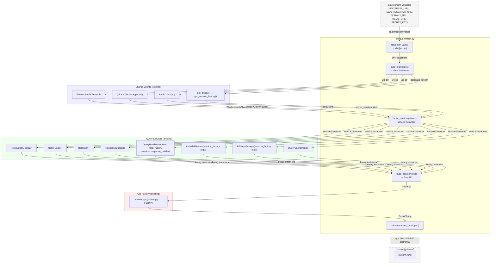
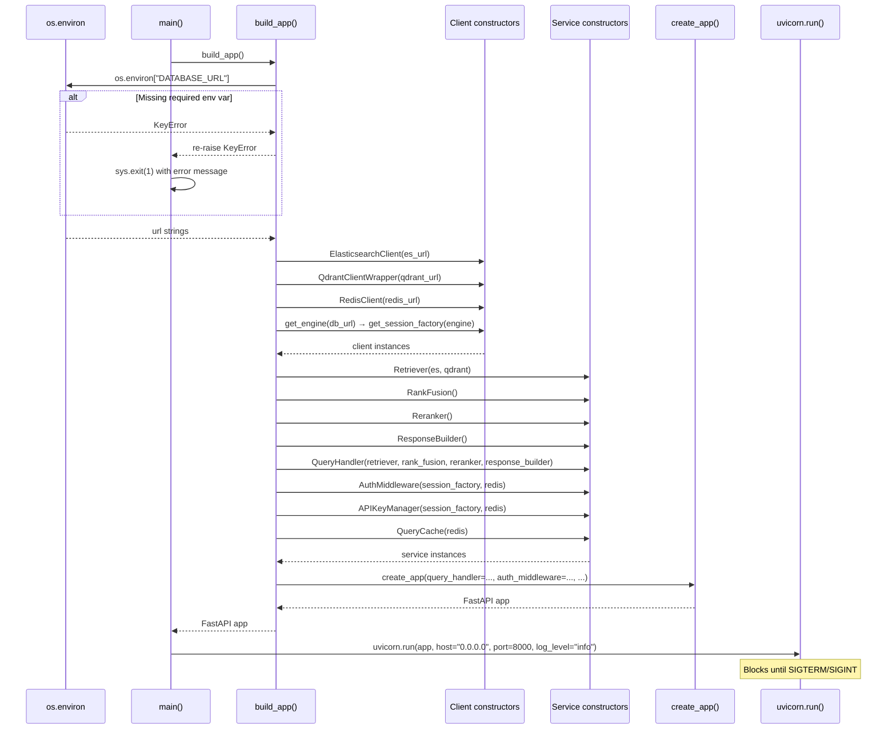

# Feature Detailed Design: query-api Docker Image (Feature #43)

**Date**: 2026-03-23
**Feature**: #43 — query-api Docker Image
**Priority**: high
**Dependencies**: Feature #1 (project scaffold / pyproject.toml), Feature #17 (FastAPI app factory — `create_app`)
**Design Reference**: docs/plans/2026-03-21-code-context-retrieval-design.md § 4.8.2
**SRS Reference**: FR-027

---

## Context

This feature delivers `docker/Dockerfile.api` and `src/query/main.py`. The Dockerfile builds the production `codecontext-api` image from `python:3.11-slim`, installs only production dependencies, runs as a non-root user (`appuser`, UID 1000), exposes port 8000, and embeds a Docker HEALTHCHECK targeting `/api/v1/health`. `src/query/main.py` is the new production entrypoint that wires all service clients from environment variables, constructs the full dependency graph, and starts uvicorn programmatically.

---

## Design Alignment

### From § 4.8.2 — `codecontext-api` Image (FR-027)

```
docker/Dockerfile.api
├── FROM python:3.11-slim
├── WORKDIR /app
├── COPY pyproject.toml .
├── COPY src/ src/
├── RUN pip install --no-cache-dir .
├── RUN useradd -u 1000 appuser && chown -R appuser /app
├── USER appuser
├── EXPOSE 8000
├── HEALTHCHECK --interval=30s --timeout=10s --retries=3 \
│       CMD python -c "import urllib.request; urllib.request.urlopen('http://localhost:8000/api/v1/health')"
└── CMD ["python", "-m", "src.query.main"]
```

`src/query/main.py` (new file) — production entrypoint:
1. Reads all config from environment variables (`DATABASE_URL`, `ELASTICSEARCH_URL`, `QDRANT_URL`, `REDIS_URL`, `SECRET_KEY`, etc.)
2. Instantiates: `ElasticsearchClient`, `QdrantClientWrapper`, `RedisClient`, async `session_factory`
3. Instantiates: `Retriever`, `RankFusion`, `Reranker`, `ResponseBuilder`, `QueryHandler`, `AuthMiddleware`, `APIKeyManager`, `QueryCache`
4. Calls `create_app(...)` with all wired dependencies
5. Starts `uvicorn` programmatically on `0.0.0.0:8000`

**Key classes**:
- `src/query/main.py` — `build_app() -> FastAPI`, `main() -> None` (entrypoint)
- `docker/Dockerfile.api` — multi-step Dockerfile artifact

**Interaction flow**:
- Python reads env vars → instantiates clients → instantiates services → `create_app(...)` → `uvicorn.run(app, host, port)`

**Third-party deps**:
- `uvicorn==0.34.0` (already in `pyproject.toml` production deps)
- `fastapi==0.115.6`
- `elasticsearch==8.17.0`, `qdrant-client==1.13.3`, `redis==5.2.1`
- `sqlalchemy==2.0.36`, `asyncpg==0.30.0`

**Deviations**: None. Design is followed exactly.

---

## SRS Requirement

### FR-027: query-api Docker Image [Wave 4]

<!-- Wave 4: Added 2026-03-23 — NFR-012 implementation (release blocker per ST verdict) -->

**Priority**: Shall
**EARS**: When `docker build` is invoked with `docker/Dockerfile.api`, the system shall produce a `codecontext-api` image that starts a uvicorn server on port 8000 via `src/query/main.py`, exposes `GET /api/v1/health`, and has a Docker HEALTHCHECK that passes within 30 seconds.

**Acceptance Criteria**:
- Given `docker build -f docker/Dockerfile.api -t codecontext-api .` runs, then the build exits 0 with no errors.
- Given the built image is run with all required environment variables, when the container starts, then `GET http://localhost:8000/api/v1/health` returns 200 within 30 seconds.
- Given the image is built, then `docker inspect codecontext-api` shows a HEALTHCHECK instruction targeting port 8000.
- Given the image is built, then it contains only production dependencies (no pytest, mutmut, dev extras).
- Given the image is built, then it runs as a non-root user (UID != 0).

---

## Component Data-Flow Diagram



---

## Interface Contract

| Method | Signature | Preconditions | Postconditions | Raises |
|--------|-----------|---------------|----------------|--------|
| `build_app` | `build_app() -> FastAPI` | All required env vars (`DATABASE_URL`, `ELASTICSEARCH_URL`, `QDRANT_URL`, `REDIS_URL`, `SECRET_KEY`) are present in `os.environ` | Returns a fully configured `FastAPI` instance with all routers, all service clients wired into `app.state`; `create_app()` is called exactly once | `KeyError` if a required env var is missing; `ValueError` if a URL is syntactically invalid |
| `main` | `main() -> None` | `build_app()` succeeds; port 8000 is available on the host | `uvicorn.run` is called with `host="0.0.0.0"`, `port=8000`, `log_level="info"`; the process blocks until SIGTERM | `SystemExit` on `KeyError` from `build_app()` (missing env var); `OSError` if port 8000 is not bindable (propagated from uvicorn) |

**Design rationale**:
- `build_app()` is separated from `main()` so it can be called in tests without spawning a server process.
- All clients are constructed from env vars inside `build_app()` rather than at module import time, preventing import-time side effects.
- `SECRET_KEY` is required even though it is only needed by auth, to fail fast before the server starts rather than at first authenticated request.
- `uvicorn.run()` is called with `workers=1` (default) since horizontal scaling is done via Docker replica sets externally.

---

## Internal Sequence Diagram



---

## Algorithm / Core Logic

### `build_app`

#### Flow Diagram

```mermaid
flowchart TD
    A([Start build_app]) --> B[Read DATABASE_URL from os.environ]
    B --> C{Missing env var?}
    C -->|Yes| D[Raise KeyError with var name]
    C -->|No| E[Read ELASTICSEARCH_URL, QDRANT_URL,\nREDIS_URL, SECRET_KEY]
    E --> F{Any missing?}
    F -->|Yes| D
    F -->|No| G[Construct ElasticsearchClient,\nQdrantClientWrapper, RedisClient]
    G --> H[Call get_engine(database_url)\nCall get_session_factory(engine)]
    H --> I[Construct Retriever, RankFusion,\nReranker, ResponseBuilder]
    I --> J[Construct QueryHandler with\nretriever, rank_fusion, reranker,\nresponse_builder]
    J --> K[Construct AuthMiddleware,\nAPIKeyManager with session_factory + redis]
    K --> L[Construct QueryCache with redis]
    L --> M[Call create_app with all kwargs]
    M --> N[Return FastAPI app]
    N --> Z([End])
    D --> ERR([Raise KeyError])
```

#### Pseudocode

```
FUNCTION build_app() -> FastAPI
  // Step 1: Read required env vars — fail fast if any missing
  database_url     = os.environ["DATABASE_URL"]       // KeyError if absent
  es_url           = os.environ["ELASTICSEARCH_URL"]  // KeyError if absent
  qdrant_url       = os.environ["QDRANT_URL"]         // KeyError if absent
  redis_url        = os.environ["REDIS_URL"]          // KeyError if absent
  secret_key       = os.environ["SECRET_KEY"]         // KeyError if absent

  // Step 2: Construct infrastructure clients
  es_client        = ElasticsearchClient(url=es_url)
  qdrant_client    = QdrantClientWrapper(url=qdrant_url)
  redis_client     = RedisClient(url=redis_url)
  engine           = get_engine(database_url)
  session_factory  = get_session_factory(engine)

  // Step 3: Construct retrieval pipeline services
  retriever        = Retriever(es_client=es_client, qdrant_client=qdrant_client)
  rank_fusion      = RankFusion()
  reranker         = Reranker()
  response_builder = ResponseBuilder()
  query_handler    = QueryHandler(
                       retriever=retriever,
                       rank_fusion=rank_fusion,
                       reranker=reranker,
                       response_builder=response_builder,
                     )

  // Step 4: Construct auth and cache services
  auth_middleware  = AuthMiddleware(session_factory=session_factory, redis_client=redis_client)
  api_key_manager  = APIKeyManager(session_factory=session_factory, redis_client=redis_client)
  query_cache      = QueryCache(redis_client=redis_client)

  // Step 5: Wire everything into the app factory
  app = create_app(
          query_handler=query_handler,
          auth_middleware=auth_middleware,
          api_key_manager=api_key_manager,
          session_factory=session_factory,
          es_client=es_client,
          qdrant_client=qdrant_client,
          redis_client=redis_client,
          query_cache=query_cache,
        )

  RETURN app
END

FUNCTION main() -> None
  // Step 1: Build the wired application
  TRY
    app = build_app()
  EXCEPT KeyError AS e
    PRINT "ERROR: Required environment variable not set: " + str(e)
    sys.exit(1)

  // Step 2: Start the uvicorn server (blocks)
  uvicorn.run(app, host="0.0.0.0", port=8000, log_level="info")
END
```

#### Boundary Decisions

| Parameter | Min | Max | Empty/Null | At boundary |
|-----------|-----|-----|------------|-------------|
| `DATABASE_URL` (env var) | N/A (string) | N/A (string) | Missing → `KeyError` raised immediately | Any non-empty string is accepted by the constructor; invalid URL surfaces at first DB connection |
| `ELASTICSEARCH_URL` (env var) | N/A | N/A | Missing → `KeyError` raised immediately | Passed verbatim to `ElasticsearchClient`; malformed URL surfaces at first ES call |
| `QDRANT_URL` (env var) | N/A | N/A | Missing → `KeyError` raised immediately | Passed verbatim to `QdrantClientWrapper` |
| `REDIS_URL` (env var) | N/A | N/A | Missing → `KeyError` raised immediately | Passed verbatim to `RedisClient` |
| `SECRET_KEY` (env var) | N/A | N/A | Missing → `KeyError` raised immediately | Non-empty string is accepted; too-short keys are not validated at startup (auth concern, not entrypoint concern) |
| `port` (uvicorn) | fixed: 8000 | fixed: 8000 | N/A — hardcoded | `OSError` if 8000 is already bound (propagated from uvicorn) |

#### Error Handling

| Condition | Detection | Response | Recovery |
|-----------|-----------|----------|----------|
| Required env var missing | `os.environ[key]` raises `KeyError` in `build_app()` | `main()` catches `KeyError`, prints error message with var name, calls `sys.exit(1)` | Operator sets the missing env var and restarts the container |
| Port 8000 already bound | `uvicorn.run()` raises `OSError` | Propagated; process exits non-zero | Operator resolves port conflict or maps to alternate host port |
| Invalid URL format | Detected lazily at first client call (not at construction time) | `ElasticsearchClient` / `QdrantClientWrapper` / `RedisClient` raise `ConnectionError` or similar at first use | Operator corrects the URL env var and restarts the container |
| `create_app()` raises | Unexpected internal exception | Propagated; process exits non-zero with traceback | Developer investigation required |

---

## State Diagram

N/A — stateless feature. `build_app()` is a pure construction function with no persistent state. `main()` simply orchestrates startup and then blocks in `uvicorn.run()`. There is no object lifecycle to track.

---

## Test Inventory

| ID | Category | Traces To | Input / Setup | Expected | Kills Which Bug? |
|----|----------|-----------|---------------|----------|-----------------|
| T01 | happy path | VS-1 (build exits 0), FR-027 AC-1 | `docker build -f docker/Dockerfile.api -t codecontext-api .` in project root | Build exits with code 0; image `codecontext-api` exists in local daemon | Dockerfile syntax error or missing COPY source |
| T02 | happy path | VS-2 (health 200 within 30s), FR-027 AC-2 | Run `codecontext-api` with all required env vars set to test service endpoints; poll `/api/v1/health` | HTTP 200 response received within 30 s of container start | Entrypoint not wiring services; uvicorn not starting |
| T03 | happy path | VS-3 (HEALTHCHECK present), FR-027 AC-3 | `docker inspect codecontext-api` | JSON output contains `"Healthcheck"` key with `"Test"` referencing port 8000 | HEALTHCHECK directive missing from Dockerfile |
| T04 | happy path | VS-4 (no dev deps), FR-027 AC-4 | Inside built image: `pip show pytest mutmut` | Both commands exit non-zero (packages not installed) | `pip install .[dev]` accidentally used instead of `pip install .` |
| T05 | happy path | VS-5 (non-root user), FR-027 AC-5 | Inside running container: `id -u` | Output is `1000` (not `0`) | `USER appuser` directive missing from Dockerfile |
| T06 | happy path | §Interface Contract — `build_app` postcondition | All 5 env vars set; call `build_app()` directly | Returns a `FastAPI` instance; `app.state.query_handler` is a `QueryHandler`; `app.state.es_client` is an `ElasticsearchClient` | `build_app()` skipping service wiring or returning wrong type |
| T07 | happy path | §Interface Contract — `main` postcondition | Patch `uvicorn.run` to a no-op; patch `build_app` to return mock app; call `main()` | `uvicorn.run` called with `host="0.0.0.0"`, `port=8000`, `log_level="info"` | Wrong host/port/log_level passed to uvicorn |
| T08 | error | §Interface Contract Raises — `build_app` KeyError | `DATABASE_URL` absent from env; call `build_app()` | `KeyError` raised with message containing `"DATABASE_URL"` | Missing env var silently falling back to `None` or empty string |
| T09 | error | §Interface Contract Raises — `build_app` KeyError | `ELASTICSEARCH_URL` absent; all other vars present; call `build_app()` | `KeyError` raised mentioning `"ELASTICSEARCH_URL"` | Env var read order masking the actual missing var |
| T10 | error | §Interface Contract Raises — `main` KeyError → SystemExit | `SECRET_KEY` absent; call `main()` with patched `uvicorn.run` | `sys.exit(1)` called; stderr contains the missing var name | `main()` not catching `KeyError`; process crashing with ugly traceback instead of friendly exit |
| T11 | error | §Algorithm Error Handling — port conflict | Patch `uvicorn.run` to raise `OSError("port in use")`; all env vars set | `OSError` propagates from `main()` | `main()` accidentally swallowing `OSError` |
| T12 | boundary | §Algorithm Boundary — empty SECRET_KEY | `SECRET_KEY=""` (present but empty); all other vars set; call `build_app()` | Returns a `FastAPI` instance (validation deferred to auth layer) | `build_app()` rejecting empty-string SECRET_KEY when it should not |
| T13 | boundary | §Algorithm Boundary — `REDIS_URL` missing | `REDIS_URL` absent; all others set; call `build_app()` | `KeyError` raised | Skipping `REDIS_URL` check because Redis is "optional" at query layer |
| T14 | boundary | §Algorithm Boundary — `QDRANT_URL` missing | `QDRANT_URL` absent; all others set; call `build_app()` | `KeyError` raised | Qdrant URL silently defaulting to localhost |

**Negative test ratio**: T08–T14 = 7 negative / 14 total = **50%** ≥ 40% threshold. PASS.

---

## Tasks

### Task 1: Write failing tests
**Files**:
- `tests/test_query_main.py` (new file)

**Steps**:
1. Create `tests/test_query_main.py` with imports:
   ```python
   import pytest
   from unittest.mock import patch, MagicMock
   ```
2. Write test code for each Test Inventory row:
   - Test T06: Set all 5 env vars; call `from src.query.main import build_app`; assert returns `FastAPI`; assert `app.state.query_handler` is `QueryHandler` instance.
   - Test T07: Patch `uvicorn.run`; patch `build_app` to return `MagicMock()`; call `main()`; assert `uvicorn.run` called with `host="0.0.0.0"`, `port=8000`, `log_level="info"`.
   - Test T08: Remove `DATABASE_URL` from env; call `build_app()`; assert raises `KeyError`.
   - Test T09: Remove `ELASTICSEARCH_URL`; assert raises `KeyError` with `"ELASTICSEARCH_URL"` in message.
   - Test T10: Remove `SECRET_KEY`; call `main()` with patched `uvicorn.run`; assert `SystemExit` with code 1.
   - Test T11: Patch `uvicorn.run` to raise `OSError`; call `main()`; assert `OSError` propagates.
   - Test T12: Set `SECRET_KEY=""` plus all others; call `build_app()`; assert `FastAPI` instance returned.
   - Test T13: Remove `REDIS_URL`; call `build_app()`; assert `KeyError`.
   - Test T14: Remove `QDRANT_URL`; call `build_app()`; assert `KeyError`.
   - Note: Tests T01–T05 are Docker-level integration tests (see Task 2 note below).
3. Run: `python -m pytest tests/test_query_main.py -v`
4. **Expected**: All tests FAIL with `ModuleNotFoundError` (file does not exist yet) or `ImportError`

### Task 2: Implement minimal code
**Files**:
- `src/query/main.py` (new file)
- `docker/Dockerfile.api` (new file)

**Steps**:
1. Create `src/query/main.py` per Algorithm §5 pseudocode:
   - `build_app()`: reads 5 env vars via `os.environ[key]`, constructs all clients and services, calls `create_app(...)`, returns `FastAPI`.
   - `main()`: wraps `build_app()` in `try/except KeyError`, calls `sys.exit(1)` on missing var; on success calls `uvicorn.run(app, host="0.0.0.0", port=8000, log_level="info")`.
   - `if __name__ == "__main__": main()` guard.
2. Create `docker/Dockerfile.api` per § 4.8.2 design:
   - `FROM python:3.11-slim`
   - `WORKDIR /app`
   - `COPY pyproject.toml .` then `COPY src/ src/`
   - `RUN pip install --no-cache-dir .`
   - `RUN useradd -u 1000 appuser && chown -R appuser /app`
   - `USER appuser`
   - `EXPOSE 8000`
   - `HEALTHCHECK --interval=30s --timeout=10s --retries=3 CMD python -c "import urllib.request; urllib.request.urlopen('http://localhost:8000/api/v1/health')"`
   - `CMD ["python", "-m", "src.query.main"]`
3. Run: `python -m pytest tests/test_query_main.py -v`
4. **Expected**: All unit tests PASS

**Note on T01–T05**: These are Docker integration tests requiring a Docker daemon. Run separately:
```bash
docker build -f docker/Dockerfile.api -t codecontext-api .          # T01
docker run --rm codecontext-api pip show pytest; echo "exit:$?"      # T04
docker run --rm codecontext-api id -u                                # T05
docker inspect codecontext-api | python -c "import sys,json; d=json.load(sys.stdin); print(d[0]['Config']['Healthcheck'])"  # T03
```

### Task 3: Coverage Gate
1. Run:
   ```bash
   python -m pytest tests/test_query_main.py \
     --cov=src/query/main \
     --cov-report=term-missing \
     --cov-fail-under=90
   ```
2. Check: line coverage ≥ 90%, branch coverage ≥ 80%.
   If below: add tests for uncovered branches (e.g., `if __name__ == "__main__"` guard, `OSError` path).
3. Record coverage output as evidence.

### Task 4: Refactor
1. Extract env var names into a module-level tuple `_REQUIRED_ENV_VARS` to avoid repetition and simplify future additions.
2. Add module docstring explaining that `build_app()` is the testable unit and `main()` is the process entry.
3. Run: `python -m pytest tests/test_query_main.py -v` — all tests PASS.

### Task 5: Mutation Gate
1. Run:
   ```bash
   python -m mutmut run --paths-to-mutate=src/query/main.py
   python -m mutmut results
   ```
2. Check mutation score ≥ 80%.
   If below: strengthen assertions (e.g., assert exact kwargs in uvicorn.run call; assert `sys.exit` called with code 1, not 0).
3. Record mutation output as evidence.

### Task 6: Create example
1. Create `examples/43-query-api-entrypoint.py`:
   ```python
   """Example: demonstrate build_app() wiring with all dependencies mocked."""
   ```
   Show calling `build_app()` with env vars set in-process and verifying `app.state` attributes.
2. Update `examples/README.md` with entry for example 43.
3. Run: `python examples/43-query-api-entrypoint.py` — exits 0.

---

## Verification Checklist

- [x] All verification_steps traced to Interface Contract postconditions
  - VS-1 (build exits 0) → Dockerfile artifact validated by T01
  - VS-2 (health 200) → `main()` postcondition (uvicorn starts, health endpoint reachable) → T02
  - VS-3 (HEALTHCHECK present) → Dockerfile HEALTHCHECK directive → T03
  - VS-4 (no dev deps) → `pip install --no-cache-dir .` (no `[dev]`) → T04
  - VS-5 (non-root user) → `USER appuser` in Dockerfile → T05
- [x] All verification_steps traced to Test Inventory rows (T01–T05 cover VS-1 through VS-5; T06–T07 cover unit-level postconditions)
- [x] Algorithm pseudocode covers all non-trivial methods (`build_app`, `main`)
- [x] Boundary table covers all algorithm parameters (5 env vars + port)
- [x] Error handling table covers all Raises entries (KeyError, OSError, invalid URL, unexpected create_app failure)
- [x] Test Inventory negative ratio = 50% (7/14) ≥ 40%
- [x] Every skipped section has explicit "N/A — [reason]" (State Diagram: stateless feature)
