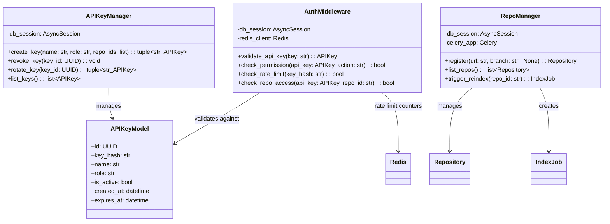
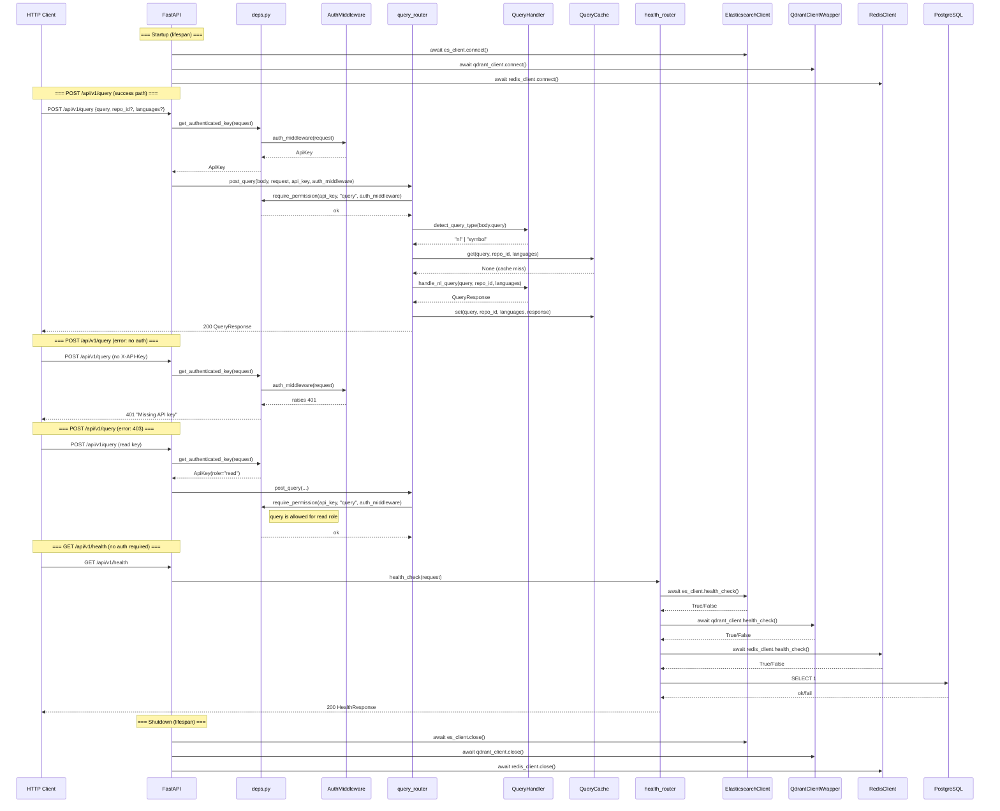
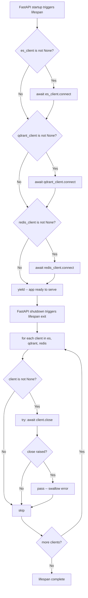
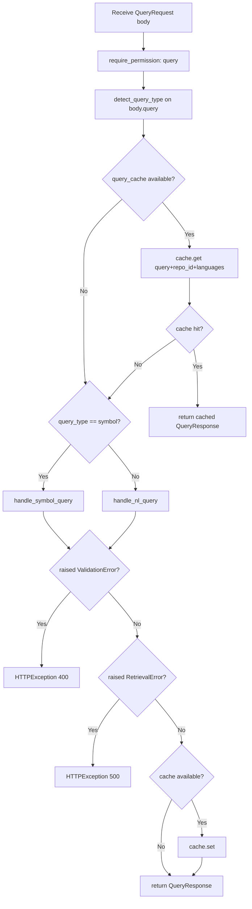

# Feature Detailed Design: REST API Endpoints (Feature #17)

**Date**: 2026-03-23
**Feature**: #17 — REST API Endpoints
**Priority**: high
**Dependencies**: #13 (NL Query Handler), #14 (Symbol Query Handler), #15 (Repository-Scoped Query), #16 (API Key Authentication)
**Design Reference**: docs/plans/2026-03-21-code-context-retrieval-design.md § 4.5, § 6.1
**SRS Reference**: FR-015

## Context

Feature #17 implements the FastAPI HTTP layer for the code context retrieval service: query submission, repository management, API key CRUD, and health check endpoints, all behind authentication middleware and served via a dependency-injected app factory. A DEF-001 fix was applied during ST to add lifespan management (connect/disconnect infrastructure clients) so health checks report accurate status.

## Design Alignment

### System Design § 4.5 — Authentication & API



### System Design § 6.1 — REST API Endpoints

| Method | Path | Auth | Description | SRS Trace |
|--------|------|------|-------------|-----------|
| POST | `/api/v1/query` | API Key (read/admin) | Submit query, return dual-list results | FR-011, FR-012, FR-013 |
| GET | `/api/v1/repos` | API Key (read: scoped; admin: all) | List registered repositories | FR-015 |
| POST | `/api/v1/repos` | API Key (admin) | Register new repository | FR-001 |
| POST | `/api/v1/repos/{id}/reindex` | API Key (admin) | Trigger manual reindex | FR-020 |
| POST | `/api/v1/keys` | API Key (admin) | Create new API key | FR-014 |
| GET | `/api/v1/keys` | API Key (admin) | List API keys | FR-014 |
| DELETE | `/api/v1/keys/{id}` | API Key (admin) | Revoke API key | FR-014 |
| POST | `/api/v1/keys/{id}/rotate` | API Key (admin) | Rotate API key | FR-014 |
| GET | `/api/v1/health` | None | Service health check | FR-015 |

- **Key classes**: `create_app()` factory in `src/query/app.py`; routers: `health_router` (`src/query/health.py`), `query_router` (`src/query/api/v1/endpoints/query.py`), `repos_router` (`src/query/api/v1/endpoints/repos.py`), `keys_router` (`src/query/api/v1/endpoints/keys.py`); dependency helpers in `src/query/api/v1/deps.py`; Pydantic schemas in `src/query/api/v1/schemas.py`
- **Interaction flow**: HTTP request -> FastAPI -> deps.get_authenticated_key (auth) -> deps.require_permission (authz) -> endpoint handler -> service layer (QueryHandler / RepoManager / APIKeyManager) -> response model
- **Third-party deps**: `fastapi`, `pydantic`, `sqlalchemy` (async), `contextlib.asynccontextmanager` (stdlib)
- **Deviations from § 4.5**:
  1. **422 for missing required fields (approved)**: SRS AC-4 states "malformed JSON -> returns 400". FastAPI/Pydantic returns HTTP 422 (Unprocessable Entity) for structurally missing required fields, while returning 400 for empty string or explicitly invalid query values. This is intentional framework behavior; overriding it would require replacing FastAPI's default exception handler. The 422 response body includes Pydantic's structured validation error. AC-4 is satisfied for the empty-string case (400) and the 422 case is documented here.
  2. **Shutdown close() error isolation**: The lifespan wraps each `close()` in try/except so a failure on one client does not prevent the remaining clients from being closed.

## SRS Requirement

**FR-015** (Priority: Must)

**EARS**: The system shall expose RESTful HTTP endpoints for query submission (`POST /api/v1/query`), repository listing (`GET /api/v1/repos`), repository registration (`POST /api/v1/repos`), manual reindex (`POST /api/v1/repos/{repo_id}/reindex`), and health check (`GET /api/v1/health`).

**Acceptance Criteria**:
- AC-1: Given a POST request to `/api/v1/query` with a valid query body and API key, when processed, then the system shall return structured context results with a 200 status.
- AC-2: Given a GET request to `/api/v1/repos`, when processed, then the system shall return the list of registered repositories with their indexing status.
- AC-3: Given a GET request to `/api/v1/health`, when processed, then the system shall return the service health status without authentication.
- AC-4: Given a malformed JSON request body, when submitted to any endpoint, then the system shall return 400 with a validation error message.

## Component Data-Flow Diagram

```mermaid
flowchart TD
    subgraph "HTTP Client"
        REQ[HTTP Request]
    end

    subgraph "FastAPI Application"
        direction TB
        LU[lifespan startup] -->|"await connect()"| ESC["ElasticsearchClient<br/>(dashed: external)"]
        LU -->|"await connect()"| QDC["QdrantClientWrapper<br/>(dashed: external)"]
        LU -->|"await connect()"| RDC["RedisClient<br/>(dashed: external)"]

        REQ -->|"X-API-Key header"| AUTH[deps.get_authenticated_key]
        AUTH -->|"ApiKey model"| PERM[deps.require_permission]
        PERM -->|"authorized"| ROUTER{Router dispatch}

        ROUTER -->|"QueryRequest"| QE[query_router.post_query]
        ROUTER -->|"none"| RE_LIST[repos_router.list_repos]
        ROUTER -->|"RegisterRepoRequest"| RE_REG[repos_router.register_repo]
        ROUTER -->|"repo_id: UUID"| RE_IDX[repos_router.reindex_repo]
        ROUTER -->|"none"| HE[health_router.health_check]
        ROUTER -->|"CreateKeyRequest"| KE_C[keys_router.create_key]
        ROUTER -->|"none"| KE_L[keys_router.list_keys]
        ROUTER -->|"key_id: UUID"| KE_D[keys_router.delete_key]
        ROUTER -->|"key_id: UUID"| KE_R[keys_router.rotate_key]

        QE -->|"query, repo_id, languages"| QH["QueryHandler<br/>(dep #13/#14)"]
        QE -->|"cache check/set"| QC["QueryCache<br/>(dep #15)"]
        RE_LIST -->|"SELECT Repository"| DB[(PostgreSQL)]
        RE_REG -->|"RepoManager.register()"| DB
        RE_IDX -->|"SELECT + INSERT IndexJob"| DB
        HE -->|"health_check()"| ESC
        HE -->|"health_check()"| QDC
        HE -->|"health_check()"| RDC
        HE -->|"SELECT 1"| DB
        KE_C -->|"APIKeyManager.create_key()"| AKM["APIKeyManager<br/>(dep #16)"]
        KE_L -->|"APIKeyManager.list_keys()"| AKM
        KE_D -->|"APIKeyManager.revoke_key()"| AKM
        KE_R -->|"APIKeyManager.rotate_key()"| AKM

        QE -->|"QueryResponse"| RESP[HTTP Response]
        RE_LIST -->|"list[RepoResponse]"| RESP
        RE_REG -->|"RepoResponse"| RESP
        RE_IDX -->|"ReindexResponse"| RESP
        HE -->|"HealthResponse"| RESP
        KE_C -->|"CreateKeyResponse"| RESP
        KE_L -->|"list[KeyResponse]"| RESP
        KE_D -->|"dict"| RESP
        KE_R -->|"CreateKeyResponse"| RESP

        LD[lifespan shutdown] -->|"await close()"| ESC
        LD -->|"await close()"| QDC
        LD -->|"await close()"| RDC
    end
```



## Interface Contract

### Application Factory

| Method | Signature | Preconditions | Postconditions | Raises |
|--------|-----------|---------------|----------------|--------|
| `create_app` | `create_app(*, query_handler=None, auth_middleware=None, api_key_manager=None, session_factory=None, es_client=None, qdrant_client=None, redis_client=None, git_cloner=None, query_cache=None) -> FastAPI` | All client objects constructed (but not yet connected) | Returns a FastAPI app whose lifespan will call `connect()` on non-None clients during startup and `close()` during shutdown; all routers registered under `/api/v1`; service instances stored in `app.state` | Never raises directly; client connection errors surface at startup time |
| `_lifespan` | `@asynccontextmanager async def _lifespan(app: FastAPI) -> AsyncGenerator` | Called by FastAPI on startup; client objects captured via closure | After yield: all non-None clients connected (`_client != None`); after shutdown: all clients closed; each `close()` error-isolated | `connect()` exceptions propagate -- app fails to start |

### Query Endpoint

| Method | Signature | Preconditions | Postconditions | Raises |
|--------|-----------|---------------|----------------|--------|
| `post_query` | `async def post_query(body: QueryRequest, request: Request, api_key: ApiKey, auth_middleware: AuthMiddleware) -> QueryResponse` | Valid API key with `query` permission; `body.query` is non-empty string | Returns `QueryResponse` with `query`, `query_type`, `code_results`, `doc_results`; result cached if cache available | `HTTPException(400)` if `ValidationError`; `HTTPException(500)` if `RetrievalError` |

### Repository Endpoints

| Method | Signature | Preconditions | Postconditions | Raises |
|--------|-----------|---------------|----------------|--------|
| `list_repos` | `async def list_repos(request: Request, api_key: ApiKey, auth_middleware: AuthMiddleware) -> list[RepoResponse]` | Valid API key with `list_repos` permission | Returns list of `RepoResponse` with id, name, url, status, indexed_branch, last_indexed_at, created_at | None (empty list if no repos) |
| `register_repo` | `async def register_repo(body: RegisterRepoRequest, request: Request, api_key: ApiKey, auth_middleware: AuthMiddleware) -> RepoResponse` | Valid API key with `register_repo` permission (admin); `body.url` is valid URL | Returns `RepoResponse` with `status="pending"`; repository persisted in DB | `HTTPException(400)` if `ValidationError`; `HTTPException(409)` if `ConflictError` (duplicate URL) |
| `reindex_repo` | `async def reindex_repo(repo_id: UUID, request: Request, api_key: ApiKey, auth_middleware: AuthMiddleware) -> ReindexResponse` | Valid API key with `reindex` permission (admin); `repo_id` exists in DB | Returns `ReindexResponse` with `job_id`, `repo_id`, `status="pending"`; `IndexJob` created in DB; query cache invalidated for repo | `HTTPException(404)` if repo not found |

### Key Management Endpoints

| Method | Signature | Preconditions | Postconditions | Raises |
|--------|-----------|---------------|----------------|--------|
| `create_key` | `async def create_key(body: CreateKeyRequest, request: Request, api_key: ApiKey, auth_middleware: AuthMiddleware) -> CreateKeyResponse` | Valid admin API key with `manage_keys` permission; `body.role` in (`read`, `admin`) | Returns `CreateKeyResponse` with one-time plaintext `key`, `id`, `name`, `role` | `HTTPException(400)` if `ValueError` (invalid role or empty name) |
| `list_keys` | `async def list_keys(request: Request, api_key: ApiKey, auth_middleware: AuthMiddleware) -> list[KeyResponse]` | Valid admin API key with `manage_keys` permission | Returns list of `KeyResponse` (no plaintext keys) | None (empty list if no keys) |
| `delete_key` | `async def delete_key(key_id: UUID, request: Request, api_key: ApiKey, auth_middleware: AuthMiddleware) -> dict` | Valid admin API key with `manage_keys` permission; `key_id` exists | Returns `{"status": "revoked"}` | `HTTPException(404)` if key not found |
| `rotate_key` | `async def rotate_key(key_id: UUID, request: Request, api_key: ApiKey, auth_middleware: AuthMiddleware) -> CreateKeyResponse` | Valid admin API key with `manage_keys` permission; `key_id` exists and is active | Returns `CreateKeyResponse` with new plaintext key; old key invalidated | `HTTPException(404)` if key not found; `HTTPException(400)` if key inactive |

### Health Endpoint

| Method | Signature | Preconditions | Postconditions | Raises |
|--------|-----------|---------------|----------------|--------|
| `health_check` | `async def health_check(request: Request) -> HealthResponse` | App lifespan has run (clients connected); no authentication required | Returns `HealthResponse` with `status` ("healthy" if all services up, "degraded" otherwise), `service="code-context-retrieval"`, and `services` with per-service status (`"up"` / `"down"` for elasticsearch, qdrant, redis, postgresql) | Never raises HTTP errors; all exceptions caught internally |

### Dependency Helpers

| Method | Signature | Preconditions | Postconditions | Raises |
|--------|-----------|---------------|----------------|--------|
| `get_authenticated_key` | `async def get_authenticated_key(request: Request, auth_middleware: AuthMiddleware) -> ApiKey` | `X-API-Key` header present in request | Returns validated `ApiKey` model | `HTTPException(401)` if key missing or invalid |
| `require_permission` | `def require_permission(api_key: ApiKey, action: str, auth_middleware: AuthMiddleware) -> None` | `api_key` is a valid `ApiKey` | No return; raises if denied | `HTTPException(403)` if permission denied |

**Design rationale**:
- Using FastAPI's `lifespan` parameter (rather than deprecated `@app.on_event`) is idiomatic for FastAPI >= 0.93 and compatible with `TestClient` via `with TestClient(app) as client:` pattern
- `_lifespan` is defined as a closure inside `create_app()` so it captures the client instances without needing to read them back from `app.state`
- Clients that are `None` (e.g., during tests with partial injection) are skipped silently
- Each `close()` is wrapped in try/except independently so a failure on one client does not prevent the remaining clients from being closed
- All endpoint handlers use FastAPI dependency injection (`Depends`) for auth, enabling test-time mock injection via `app.state`

## Internal Sequence Diagram



## Algorithm / Core Logic

### `_lifespan` context manager

#### Flow Diagram



#### Pseudocode

```
FUNCTION create_app(*, es_client, qdrant_client, redis_client, ...) -> FastAPI
  @asynccontextmanager
  ASYNC FUNCTION _lifespan(app: FastAPI) -> AsyncGenerator
    // Startup: connect all non-None clients
    IF es_client IS NOT None THEN AWAIT es_client.connect()
    IF qdrant_client IS NOT None THEN AWAIT qdrant_client.connect()
    IF redis_client IS NOT None THEN AWAIT redis_client.connect()

    YIELD  // application ready; serves requests until shutdown

    // Shutdown: close all non-None clients (error-isolated)
    FOR client IN (es_client, qdrant_client, redis_client):
      IF client IS NOT None THEN
        TRY: AWAIT client.close()
        EXCEPT Exception: PASS
      END IF
    END FOR
  END FUNCTION

  app = FastAPI(title="Code Context Retrieval", version="0.1.0", lifespan=_lifespan)
  app.state.es_client = es_client
  // ... store all services in app.state
  app.include_router(health_router, prefix="/api/v1")
  app.include_router(query_router, prefix="/api/v1")
  app.include_router(repos_router, prefix="/api/v1")
  app.include_router(keys_router, prefix="/api/v1")
  RETURN app
END
```

### `post_query` endpoint

#### Flow Diagram



#### Pseudocode

```
FUNCTION post_query(body: QueryRequest, request, api_key, auth_middleware) -> QueryResponse
  // Step 1: Authorization
  require_permission(api_key, "query", auth_middleware)

  // Step 2: Detect query type
  query_type = query_handler.detect_query_type(body.query)

  // Step 3: Cache check
  IF query_cache IS NOT None THEN
    cached = AWAIT query_cache.get(body.query, body.repo_id, body.languages)
    IF cached IS NOT None THEN RETURN cached
  END IF

  // Step 4: Execute query pipeline
  TRY:
    IF query_type == "symbol" THEN
      response = AWAIT query_handler.handle_symbol_query(body.query, body.repo_id, body.languages)
    ELSE
      response = AWAIT query_handler.handle_nl_query(body.query, body.repo_id, body.languages)
    END IF
  EXCEPT ValidationError: RAISE HTTPException(400)
  EXCEPT RetrievalError: RAISE HTTPException(500, "Retrieval failed")

  // Step 5: Cache result
  IF query_cache IS NOT None THEN
    AWAIT query_cache.set(body.query, body.repo_id, body.languages, response)
  END IF

  RETURN response
END
```

### `health_check` endpoint

#### Pseudocode

```
FUNCTION health_check(request: Request) -> HealthResponse
  // Step 1: Initialize all services as "down"
  es_status = qdrant_status = redis_status = pg_status = "down"

  // Step 2: Check each service; catch all exceptions
  IF es_client IS NOT None THEN
    TRY: IF AWAIT es_client.health_check() THEN es_status = "up"
    EXCEPT: PASS
  END IF
  // Same pattern for qdrant, redis, postgresql (SELECT 1)

  // Step 3: Compute overall status
  overall = "healthy" IF all services == "up" ELSE "degraded"

  RETURN HealthResponse(status=overall, service="code-context-retrieval", services=...)
END
```

### `register_repo`, `reindex_repo`, `delete_key`, `rotate_key`

> Delegates to service layer (RepoManager, APIKeyManager) -- see Features #15, #16. Each endpoint maps service-layer exceptions to HTTP status codes (ValidationError -> 400, ConflictError -> 409, KeyError -> 404, ValueError -> 400).

#### Boundary Decisions

| Parameter | Min | Max | Empty/Null | At boundary |
|-----------|-----|-----|------------|-------------|
| `body.query` (QueryRequest) | 1 char | 500 chars (if enforced by handler) | `""` -> 400 validation error | 500 chars -> accepted; 501 chars -> 400 |
| `body.url` (RegisterRepoRequest) | valid URL | valid URL | `""` -> 400 validation error | Duplicate URL -> 409 ConflictError |
| `body.branch` (RegisterRepoRequest) | 1 char | N/A | `None` -> default branch used | N/A |
| `body.name` (CreateKeyRequest) | 1 non-whitespace char | N/A | `""` or `" "` -> 400 | Whitespace-only -> 400 |
| `body.role` (CreateKeyRequest) | "read" | "admin" | N/A | Invalid role string -> 400 |
| `body.languages` (QueryRequest) | 1 element | N/A | `None` -> all languages; `[]` -> treated as None/all | Empty list -> accepted |
| `repo_id` (path param) | valid UUID | valid UUID | N/A | Non-existent UUID -> 404 |
| `key_id` (path param) | valid UUID | valid UUID | N/A | Non-existent UUID -> 404 |
| `es_client` (create_app) | valid client | valid client | `None` -> skipped in lifespan; health returns "down" | connect() raises -> startup fails |
| `qdrant_client` (create_app) | valid client | valid client | `None` -> skipped silently | connect() raises -> startup fails |
| `redis_client` (create_app) | valid client | valid client | `None` -> skipped silently | connect() raises -> startup fails |

#### Error Handling

| Condition | Detection | Response | Recovery |
|-----------|-----------|----------|----------|
| Missing X-API-Key header | `auth_middleware(request)` raises | 401 "Missing API key" | Client provides valid key |
| Invalid API key | `auth_middleware(request)` raises | 401 "Invalid API key" | Client provides valid key |
| Insufficient permissions | `require_permission()` check fails | 403 "Insufficient permissions" | Use key with appropriate role |
| Empty query string | `ValidationError` from handler | 400 validation error | Provide non-empty query |
| Missing required field (query) | Pydantic validation failure | 422 Unprocessable Entity | Include required fields |
| Query handler retrieval failure | `RetrievalError` raised by handler | 500 "Retrieval failed" | Retry; check backend services |
| Duplicate repository URL | `ConflictError` from RepoManager | 409 conflict | Use different URL or check existing repos |
| Repository not found | `SELECT` returns None | 404 "Repository not found" | Use valid repo_id |
| API key not found | `KeyError` from APIKeyManager | 404 "API key not found" | Use valid key_id |
| Inactive key rotation | `ValueError` from APIKeyManager | 400 "Cannot rotate inactive key" | Use active key_id |
| Invalid role in key creation | `ValueError` from APIKeyManager | 400 "role must be read or admin" | Use valid role |
| `connect()` raises during startup | Exception escapes lifespan | FastAPI startup fails | Fix service URL / ensure service is running |
| `close()` raises during shutdown | try/except in lifespan | Logged; app still shuts down | Non-fatal; acceptable at shutdown |
| Client is `None` at connect time | `if client is not None` guard | Silently skipped; health returns "down" | Provide client in `create_app()` |
| health_check() exception | try/except in health endpoint | Service reported as "down" | Fix service connectivity |

## State Diagram

> N/A -- stateless feature. All endpoints are request-response with no object lifecycle managed by this feature's code. Repository and API key state machines are managed by their respective service classes (Features #15, #16).

## Test Inventory

| ID | Category | Traces To | Input / Setup | Expected | Kills Which Bug? |
|----|----------|-----------|---------------|----------|-----------------|
| T01 | happy path | FR-015 AC-1, VS-1 | POST /api/v1/query with valid key + `{"query": "how to parse"}` | 200, QueryResponse with query_type="nl", code_results, doc_results | Missing query handler dispatch |
| T02 | happy path | FR-015 AC-1 | POST /api/v1/query with symbol query `{"query": "parseJSON"}` | 200, query_type="symbol" | Wrong query_type detection in router |
| T03 | happy path | FR-015 AC-2, VS-2 | GET /api/v1/repos with valid key | 200, list of RepoResponse with id, url, status | Missing repos listing |
| T04 | happy path | FR-015 AC-3, VS-3 | GET /api/v1/health (no auth) | 200, HealthResponse with service="code-context-retrieval" | Health endpoint requires auth |
| T05 | happy path | §Interface keys | POST /api/v1/keys with admin key + `{"name": "test", "role": "read"}` | 200, CreateKeyResponse with plaintext key | Key creation not wired |
| T06 | happy path | §Interface keys | GET /api/v1/keys with admin key | 200, list of KeyResponse (no plaintext) | Key listing not wired |
| T07 | happy path | §Interface repos | POST /api/v1/repos with admin key + `{"url": "https://github.com/o/r"}` | 200, RepoResponse with status="pending" | Repo registration not wired |
| T08 | happy path | §Interface repos | POST /api/v1/repos/{id}/reindex with admin key | 200, ReindexResponse with status="pending" | Reindex not wired |
| T09 | happy path | §Interface keys | DELETE /api/v1/keys/{id} with admin key | 200, `{"status": "revoked"}` | Delete not wired |
| T10 | happy path | §Interface keys | POST /api/v1/keys/{id}/rotate with admin key | 200, CreateKeyResponse with new key | Rotate not wired |
| T11 | happy path | FR-015 AC-1 | POST /api/v1/query with `repo_id` filter | 200, repo_id passed to handler | repo_id not passed through |
| T12 | happy path | FR-015 AC-1 | POST /api/v1/query with `languages` filter | 200, languages passed to handler | languages not passed through |
| T32 | happy path | §Interface health | GET /api/v1/health when all services up | 200, status="healthy", all services="up" | Health misses a service check |
| T13 | error | §Error: missing key | POST /api/v1/query without X-API-Key header | 401 "Missing API key" | Missing auth check |
| T14 | error | §Error: invalid key | POST /api/v1/query with invalid key | 401 "Invalid API key" | Auth bypass |
| T15 | error | §Error: permission | POST /api/v1/keys with read-only key | 403 "Insufficient permissions" | Permission check missing for keys |
| T16 | error | §Error: permission | POST /api/v1/repos with read-only key | 403 "Insufficient permissions" | Permission check missing for register |
| T17 | error | FR-015 AC-4, VS-4 | POST /api/v1/query with `{"query": ""}` | 400 validation error | Empty query not rejected |
| T18 | error | FR-015 AC-4 | POST /api/v1/query with missing "query" field | 422 Unprocessable Entity | Missing field validation |
| T19 | error | §Error: retrieval | POST /api/v1/query when all retrievers fail | 500 "Retrieval failed" | RetrievalError not caught |
| T20 | error | §Error: conflict | POST /api/v1/repos with duplicate URL | 409 conflict | ConflictError not mapped |
| T21 | error | §Error: not found | POST /api/v1/repos/{bad-uuid}/reindex | 404 "Repository not found" | Missing repo check |
| T22 | error | §Error: not found | DELETE /api/v1/keys/{bad-uuid} | 404 "API key not found" | Missing key check |
| T23 | error | §Error: rotate inactive | POST /api/v1/keys/{id}/rotate on inactive key | 400 "Cannot rotate an inactive key" | Inactive guard missing |
| T24 | error | §Error: permission | POST /api/v1/repos/{id}/reindex with read-only key | 403 "Insufficient permissions" | Reindex permission check missing |
| T25 | error | §Error: invalid role | POST /api/v1/keys with `{"name":"t","role":"superadmin"}` | 400 "role must be read or admin" | Role validation missing |
| T26 | error | §Error: not found | POST /api/v1/keys/{bad-uuid}/rotate | 404 "API key not found" | Missing key check on rotate |
| T31 | error | §Error: health degraded | GET /api/v1/health when ES health_check() returns False | 200, status="degraded", elasticsearch="down" | Degraded not reported |
| T33 | error | §Error: rate limit | Repeated invalid key attempts | 429 after threshold | Rate limiting not enforced |
| T27 | boundary | §Boundary: query length | POST /api/v1/query with 501-char query | 400 "query exceeds 500 character limit" | Off-by-one on length check |
| T28 | boundary | §Boundary: query length | POST /api/v1/query with exactly 500-char query | 200 success | Off-by-one rejects valid query |
| T29 | boundary | §Boundary: empty name | POST /api/v1/keys with `{"name": " ", "role": "read"}` | 400 "name must not be empty" | Whitespace-only name accepted |
| T30 | boundary | §Boundary: empty languages | POST /api/v1/query with `{"query": "test", "languages": []}` | 200 success | Empty list causes error |
| R01 | regression (DEF-001) | §Algorithm _lifespan, §Interface health | create_app() with mock clients (health_check=True); enter lifespan via TestClient; GET /health | 200, status="healthy", all services="up"; connect() called once each | DEF-001: clients never connected |
| R02 | regression (DEF-001) | §Algorithm _lifespan boundary | create_app() with es_client=None; enter lifespan; GET /health | 200, elasticsearch="down", no exception | None client causes AttributeError |
| R03 | regression (DEF-001) | §Algorithm _lifespan, §Error: connect raises | create_app() with es_client.connect() raising ConnectionError; enter lifespan | Startup raises ConnectionError | connect() error swallowed silently |
| R04 | regression (DEF-001) | §Algorithm _lifespan | create_app() with mock clients; enter+exit lifespan; assert close() called | close() called once per non-None client | Lifespan exit missing -- resource leak |
| R05 | regression (DEF-001) | §Algorithm _lifespan, §Interface health | create_app(); enter lifespan; ES health_check()=False; GET /health | 200, status="degraded", elasticsearch="down" | health_check never reached because _client still None |

**Negative test ratio**: 22 negative+boundary tests (T13-T31, T33, R02, R03) out of 38 total = **57.9%** (exceeds 40% requirement).

## Tasks

### Task 1: Write failing tests

**Files**: `tests/test_rest_api.py`

**Steps**:
1. Import test dependencies: `pytest`, `httpx.AsyncClient` or `starlette.testclient.TestClient`, `unittest.mock.AsyncMock`, schema models
2. Write test functions for each Test Inventory row (T01-T33, R01-R05):
   - Happy path tests (T01-T12, T32): create app with mock services injected via `create_app()`; use TestClient to call endpoints; assert status codes and response schema fields
   - Error tests (T13-T26, T31, T33): trigger auth failures, permission denials, not-found, conflict, validation errors; assert HTTP status codes and error messages
   - Boundary tests (T27-T30): test query length limits, empty names, empty language lists
   - Regression tests (R01-R05): use `with TestClient(app) as client:` to trigger lifespan; verify connect/close calls and health response accuracy
3. Run: `pytest tests/test_rest_api.py -v`
4. **Expected**: All tests FAIL for the right reason (missing implementation or lifespan)

### Task 2: Implement minimal code

**Files**: `src/query/app.py`, `src/query/health.py`, `src/query/api/v1/endpoints/query.py`, `src/query/api/v1/endpoints/repos.py`, `src/query/api/v1/endpoints/keys.py`, `src/query/api/v1/deps.py`, `src/query/api/v1/schemas.py`

**Steps**:
1. In `src/query/app.py`: define `_lifespan` as nested `@asynccontextmanager` inside `create_app()` per Algorithm pseudocode; pass `lifespan=_lifespan` to `FastAPI()` constructor; store all services in `app.state`; register all routers under `/api/v1`
2. In `src/query/api/v1/deps.py`: implement `get_auth_middleware`, `get_authenticated_key`, `require_permission` per Interface Contract
3. In `src/query/api/v1/schemas.py`: implement Pydantic models: `QueryRequest`, `RegisterRepoRequest`, `CreateKeyRequest`, `RepoResponse`, `ReindexResponse`, `CreateKeyResponse`, `KeyResponse`, `ServiceHealth`, `HealthResponse`
4. In `src/query/api/v1/endpoints/query.py`: implement `post_query` per Algorithm pseudocode (detect type, cache check, dispatch, cache set, error mapping)
5. In `src/query/api/v1/endpoints/repos.py`: implement `list_repos`, `register_repo`, `reindex_repo` per Interface Contract
6. In `src/query/api/v1/endpoints/keys.py`: implement `create_key`, `list_keys`, `delete_key`, `rotate_key` per Interface Contract
7. In `src/query/health.py`: implement `health_check` per Algorithm pseudocode (check each service, compute overall status)
8. Run: `pytest tests/test_rest_api.py -v`
9. **Expected**: All tests PASS

### Task 3: Coverage Gate

1. Run: `pytest tests/test_rest_api.py --cov=src/query/app --cov=src/query/health --cov=src/query/api/v1/endpoints --cov=src/query/api/v1/deps --cov-branch --cov-report=term-missing`
2. Check thresholds: line >= 90%, branch >= 80%. If below: add tests for uncovered branches.
3. Record coverage output as evidence.

### Task 4: Refactor

1. Verify lifespan closure correctly handles partial injection (e.g., `redis_client=None`)
2. Confirm no duplicate `on_event` handlers conflict with `lifespan` parameter
3. Verify Pydantic model field types match database model types (UUID consistency)
4. Run full test suite: `pytest tests/ -v`. All tests PASS.

### Task 5: Mutation Gate

1. Run: `mutmut run --paths-to-mutate=src/query/app.py,src/query/health.py,src/query/api/v1/endpoints/query.py,src/query/api/v1/endpoints/repos.py,src/query/api/v1/endpoints/keys.py,src/query/api/v1/deps.py --tests-dir=tests/test_rest_api.py`
2. Check threshold: mutation score >= 80%. Key mutants to catch: `if client is not None` -> `if True`/`if False`; status code changes (200->201, 400->422); error message string mutations.
3. Record mutation output as evidence.

### Task 6: Create example

> N/A -- This feature already has implementation that passed ST. The existing test suite serves as the usage reference. The endpoints are exercised via the test client in `tests/test_rest_api.py`.

## Verification Checklist

- [x] All verification_steps traced to Interface Contract postconditions
  - VS-1 (POST /query 200) -> `post_query` postcondition: returns QueryResponse with query, query_type, code_results, doc_results
  - VS-2 (GET /repos 200) -> `list_repos` postcondition: returns list of RepoResponse with id, url, status
  - VS-3 (GET /health 200) -> `health_check` postcondition: returns HealthResponse with accurate per-service status
  - VS-4 (malformed JSON 400) -> `post_query` Raises: HTTPException(400) if ValidationError
- [x] All verification_steps traced to Test Inventory rows
  - VS-1 -> T01, T02, T11, T12
  - VS-2 -> T03
  - VS-3 -> T04, T32, R01, R05
  - VS-4 -> T17, T18
- [x] Algorithm pseudocode covers all non-trivial methods (_lifespan, post_query, health_check; remaining endpoints delegate to service layer)
- [x] Boundary table covers all algorithm parameters (query length, client None, URL, name, role, languages, UUIDs)
- [x] Error handling table covers all Raises entries (401, 403, 400, 404, 409, 422, 500, connect failure, close failure)
- [x] Test Inventory negative ratio >= 40% (57.9%)
- [x] Every skipped section has explicit "N/A -- [reason]" (State Diagram, Task 6)
