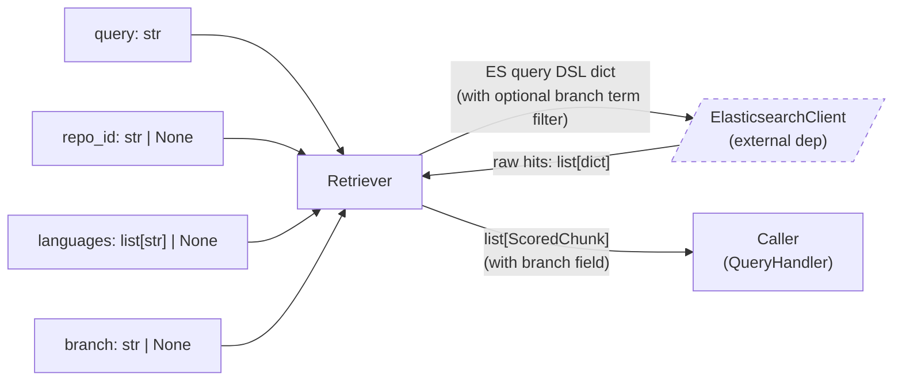
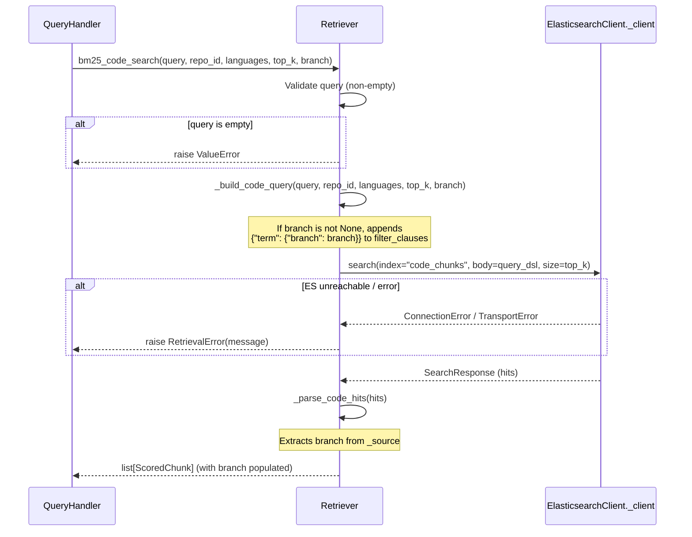
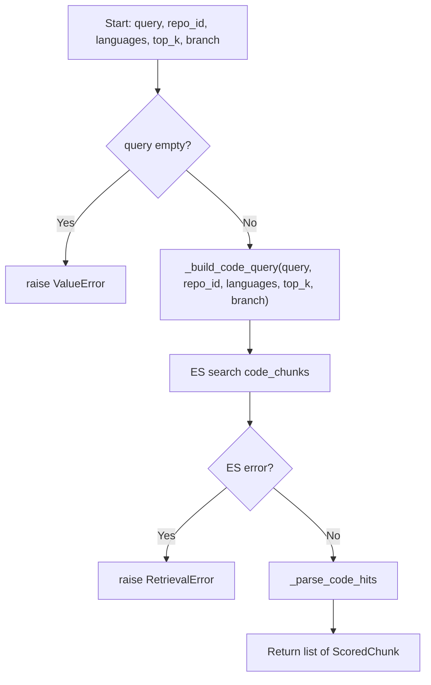

# Feature Detailed Design: Keyword Retrieval — BM25 (Feature #8)

**Date**: 2026-03-24
**Feature**: #8 — Keyword Retrieval (BM25)
**Priority**: high
**Dependencies**: #7 (Embedding Generation) — passing
**Design Reference**: docs/plans/2026-03-21-code-context-retrieval-design.md § 4.2
**SRS Reference**: FR-006
**Wave**: 5 — branch filter addition (delta from 2026-03-21 baseline)

## Context

Implement BM25 keyword search against Elasticsearch indices (`code_chunks` and `doc_chunks`), returning top-200 scored candidates. This is one of the two retrieval arms (BM25 + vector) in the hybrid retrieval pipeline. The Retriever class is the entry point; this feature implements its `bm25_code_search` and `bm25_doc_search` methods. **Wave 5 delta**: add an optional `branch` parameter so queries can be scoped to a specific Git branch (e.g., `"main"`), adding a term filter on the `branch` field in the ES query DSL.

## Design Alignment

**From §4.2 — Hybrid Retrieval Pipeline:**

The `Retriever` class exposes:
- `bm25_code_search(query, repo, languages, top_k) -> list[ScoredChunk]`
- `bm25_doc_search(query, repo, top_k) -> list[ScoredChunk]`

These are called by `QueryHandler` in parallel with vector search. Each returns up to `top_k` (default 200) candidates scored by BM25.

**Wave 5 modification**: The SRS FR-006 (modified 2026-03-24) adds: "Given a branch parameter (e.g., 'main'), when BM25 retrieval runs, then the system shall add a term filter on the `branch` field so only chunks from that branch are returned." The MCP `search_code_context` tool parses `owner/repo@branch` format and forwards branch to the retriever.

- **Key classes**: `Retriever` (existing, `src/query/retriever.py`) — add `branch` parameter to `bm25_code_search`, `bm25_doc_search`, `_build_code_query`, `_build_doc_query`; `ScoredChunk` (existing, `src/query/scored_chunk.py`) — add `branch` field
- **Interaction flow**: QueryHandler → Retriever.bm25_code_search(query, repo_id, languages, top_k, branch) → ES search(code_chunks, with branch term filter) → parse hits → ScoredChunk list
- **Third-party deps**: `elasticsearch[async]` (already installed via ElasticsearchClient)
- **Deviations**: None — class diagram in §4.2.2 does not yet show `branch` in method signatures, but the SRS FR-006 and MCP §4.5 design explicitly specify it

**ES Index Structure (from IndexWriter):**
- `code_chunks`: fields `repo_id`, `file_path`, `language`, `chunk_type`, `symbol`, `signature`, `doc_comment`, `content`, `line_start`, `line_end`, `parent_class`, `branch`
- `doc_chunks`: fields `repo_id`, `file_path`, `breadcrumb`, `content`, `heading_level`, `branch`

**Analyzer design (from SRS FR-006 + design §4.2):**
- `code_analyzer`: BM25 on `content`, `symbol`, `signature`, `doc_comment` fields. Synonym filter maps `auth` → `authentication`, `authorization`.
- `doc_analyzer`: BM25 on `content` field.

## SRS Requirement

**FR-006: Keyword Retrieval**

<!-- Wave 5: Modified 2026-03-24 — add branch filter parameter -->

**Priority**: Must
**EARS**: When a query is received by the retrieval engine, the system shall execute a BM25 keyword search against the Elasticsearch index and return the top-200 candidate chunks, optionally filtered by branch.

**Acceptance Criteria**:
- AC1: Given the query "WebClient timeout", when BM25 retrieval runs, then the system shall return up to 200 chunks ranked by BM25 score, with chunks containing exact token matches ranked highest.
- AC2: Given a query with no matching terms in the index, when BM25 retrieval runs, then the system shall return an empty candidate list.
- AC3: Given that Elasticsearch is unreachable, then the retrieval engine shall proceed with vector-only results and log a degradation warning.
- AC4: Given a branch parameter (e.g., "main"), when BM25 retrieval runs, then the system shall add a term filter on the `branch` field so only chunks from that branch are returned.

**Verification Steps (feature-list.json)**:
- VS-1: Given indexed code chunks containing 'getUserName', when bm25_search('getUserName') runs against code_chunks, then results include chunks containing that symbol, ranked by BM25 score
- VS-2: Given the code_analyzer with synonym filter, when searching 'auth', then results also include chunks containing 'authentication' and 'authorization'
- VS-3: Given a query with no matching terms, when bm25_search() runs, then it returns an empty list without error
- VS-4: Given Elasticsearch is unreachable, when bm25_search() runs, then it raises a retrieval error (caller handles degradation)
- VS-5: Given a branch parameter, BM25 search adds term filter on branch field

## Component Data-Flow Diagram



## Interface Contract

| Method | Signature | Preconditions | Postconditions | Raises |
|--------|-----------|---------------|----------------|--------|
| `__init__` | `Retriever(es_client: ElasticsearchClient, code_index: str = "code_chunks", doc_index: str = "doc_chunks", embedding_encoder: EmbeddingEncoder \| None = None, qdrant_client: QdrantClientWrapper \| None = None, code_collection: str = "code_embeddings", doc_collection: str = "doc_embeddings")` | `es_client` is a valid ElasticsearchClient instance | Retriever is ready to search | — |
| `bm25_code_search` | `async bm25_code_search(query: str, repo_id: str \| None = None, languages: list[str] \| None = None, top_k: int = 200, branch: str \| None = None) -> list[ScoredChunk]` | `query` is non-empty string; `top_k >= 1` | Returns `list[ScoredChunk]` with len <= `top_k`, sorted by BM25 score descending; each chunk has `content_type="code"`; when `branch` is provided, all returned chunks have `branch` matching the filter value | `RetrievalError` if ES unreachable or query fails; `ValueError` if query is empty |
| `bm25_doc_search` | `async bm25_doc_search(query: str, repo_id: str \| None = None, top_k: int = 200, branch: str \| None = None) -> list[ScoredChunk]` | `query` is non-empty string; `top_k >= 1` | Returns `list[ScoredChunk]` with len <= `top_k`, sorted by BM25 score descending; each chunk has `content_type="doc"`; when `branch` is provided, all returned chunks have `branch` matching the filter value | `RetrievalError` if ES unreachable; `ValueError` if query is empty |
| `_build_code_query` | `_build_code_query(query: str, repo_id: str \| None, languages: list[str] \| None, top_k: int, branch: str \| None = None) -> dict` | Valid inputs | Returns ES query DSL dict with multi_match across content/symbol/signature/doc_comment, filtered by repo_id, optionally languages, and optionally branch | — |
| `_build_doc_query` | `_build_doc_query(query: str, repo_id: str \| None, top_k: int, branch: str \| None = None) -> dict` | Valid inputs | Returns ES query DSL dict with match on content, filtered by repo_id and optionally branch | — |
| `_parse_code_hits` | `_parse_code_hits(hits: list[dict]) -> list[ScoredChunk]` | ES search response hits array | Returns list[ScoredChunk] preserving ES score order; `branch` field populated from source | — |
| `_parse_doc_hits` | `_parse_doc_hits(hits: list[dict]) -> list[ScoredChunk]` | ES search response hits array | Returns list[ScoredChunk] preserving ES score order; `branch` field populated from source | — |

**Design rationale:**
- `top_k` defaults to 200 per design §4.2 (parallel retrieval feeds RRF fusion)
- `languages` filter is optional — when provided, only code chunks in those languages are returned
- Both methods return `ScoredChunk` (unified type) with `content_type` discriminator, simplifying downstream RRF fusion
- `RetrievalError` is a new exception — caller (QueryHandler) catches it and proceeds with vector-only results per FR-006
- `branch` is optional (`None` by default) — when `None`, no branch filter is applied (backward compatible). When provided, a `{"term": {"branch": branch}}` clause is added to the ES bool filter array
- `branch` is appended as the last parameter to preserve backward compatibility with existing callers

**ScoredChunk data model (Wave 5 update — add `branch` field):**

```python
@dataclass
class ScoredChunk:
    chunk_id: str
    content_type: str           # "code" | "doc"
    repo_id: str
    file_path: str
    content: str
    score: float                # BM25 score from ES
    # Code-specific (None for doc chunks)
    language: str | None = None
    chunk_type: str | None = None
    symbol: str | None = None
    signature: str | None = None
    doc_comment: str | None = None
    line_start: int | None = None
    line_end: int | None = None
    parent_class: str | None = None
    # Doc-specific (None for code chunks)
    breadcrumb: str | None = None
    heading_level: int | None = None
    # Shared (Wave 5)
    branch: str | None = None   # Git branch this chunk was indexed from
```

## Internal Sequence Diagram



## Algorithm / Core Logic

### bm25_code_search (Wave 5 update)

#### Flow Diagram



#### Pseudocode

```
FUNCTION bm25_code_search(query: str, repo_id: str | None, languages: list[str] | None, top_k: int = 200, branch: str | None = None) -> list[ScoredChunk]
  // Step 1: Validate
  IF query is empty OR whitespace-only THEN raise ValueError("query must not be empty")

  // Step 2: Build ES query DSL (branch filter added if branch is not None)
  query_dsl = _build_code_query(query, repo_id, languages, top_k, branch)

  // Step 3: Execute ES search
  TRY
    response = await es_client._client.search(index="code_chunks", body=query_dsl, size=top_k)
  CATCH ConnectionError, TransportError, NotFoundError as e
    raise RetrievalError(f"Elasticsearch search failed: {e}")

  // Step 4: Parse hits into ScoredChunks (branch extracted from _source)
  hits = response["hits"]["hits"]
  RETURN _parse_code_hits(hits)
END
```

### _build_code_query (Wave 5 update)

#### Pseudocode

```
FUNCTION _build_code_query(query: str, repo_id: str | None, languages: list[str] | None, top_k: int, branch: str | None = None) -> dict
  // Multi-match across content, symbol, signature, doc_comment
  // Boost symbol field (2x) for identifier-heavy queries
  must_clause = {
    "multi_match": {
      "query": query,
      "fields": ["content", "symbol^2", "signature", "doc_comment"],
      "type": "best_fields"
    }
  }

  filter_clauses = []
  IF repo_id is not None THEN
    filter_clauses.append({"term": {"repo_id": repo_id}})
  IF languages is not None AND len(languages) > 0 THEN
    filter_clauses.append({"terms": {"language": languages}})
  // Wave 5: branch filter
  IF branch is not None THEN
    filter_clauses.append({"term": {"branch": branch}})

  bool_clause = {"must": [must_clause]}
  IF filter_clauses THEN
    bool_clause["filter"] = filter_clauses

  RETURN {"query": {"bool": bool_clause}}
END
```

### _build_doc_query (Wave 5 update)

#### Pseudocode

```
FUNCTION _build_doc_query(query: str, repo_id: str | None, top_k: int, branch: str | None = None) -> dict
  bool_clause = {"must": [{"match": {"content": query}}]}
  filter_clauses = []
  IF repo_id is not None THEN
    filter_clauses.append({"term": {"repo_id": repo_id}})
  // Wave 5: branch filter
  IF branch is not None THEN
    filter_clauses.append({"term": {"branch": branch}})
  IF filter_clauses THEN
    bool_clause["filter"] = filter_clauses

  RETURN {"query": {"bool": bool_clause}}
END
```

### _parse_code_hits (Wave 5 update)

#### Pseudocode

```
FUNCTION _parse_code_hits(hits: list[dict]) -> list[ScoredChunk]
  result = []
  FOR hit IN hits:
    src = hit["_source"]
    result.append(ScoredChunk(
      chunk_id = hit["_id"],
      content_type = "code",
      repo_id = src["repo_id"],
      file_path = src["file_path"],
      content = src["content"],
      score = hit["_score"],
      language = src.get("language"),
      chunk_type = src.get("chunk_type"),
      symbol = src.get("symbol"),
      signature = src.get("signature"),
      doc_comment = src.get("doc_comment"),
      line_start = src.get("line_start"),
      line_end = src.get("line_end"),
      parent_class = src.get("parent_class"),
      branch = src.get("branch"),       // Wave 5: extract branch
    ))
  RETURN result
END
```

### _parse_doc_hits (Wave 5 update)

#### Pseudocode

```
FUNCTION _parse_doc_hits(hits: list[dict]) -> list[ScoredChunk]
  result = []
  FOR hit IN hits:
    src = hit["_source"]
    result.append(ScoredChunk(
      chunk_id = hit["_id"],
      content_type = "doc",
      repo_id = src["repo_id"],
      file_path = src["file_path"],
      content = src["content"],
      score = hit["_score"],
      breadcrumb = src.get("breadcrumb"),
      heading_level = src.get("heading_level"),
      branch = src.get("branch"),       // Wave 5: extract branch
    ))
  RETURN result
END
```

#### Boundary Decisions

| Parameter | Min | Max | Empty/Null | At boundary |
|-----------|-----|-----|------------|-------------|
| `query` | 1 char | unlimited | raise ValueError | 1-char query executes normally |
| `repo_id` | 1 char | unlimited | None → no repo filter | 1-char repo_id filters normally |
| `languages` | None | 6 items (all supported) | None → no language filter | empty list → no language filter (same as None) |
| `top_k` | 1 | unlimited (ES default ~10000) | N/A (int) | top_k=1 returns at most 1 result |
| `branch` | 1 char | unlimited | None → no branch filter (all branches) | 1-char branch filters normally; non-existent branch → empty results |
| ES hits | 0 hits | top_k hits | return [] | 0 hits → empty list returned |

#### Error Handling

| Condition | Detection | Response | Recovery |
|-----------|-----------|----------|----------|
| Empty query | `if not query or not query.strip()` | `ValueError("query must not be empty")` | Caller validates before calling |
| ES connection refused | `elasticsearch.ConnectionError` | `RetrievalError("Elasticsearch search failed: ...")` | Caller proceeds with vector-only |
| ES transport error (timeout, 5xx) | `elasticsearch.TransportError` | `RetrievalError("Elasticsearch search failed: ...")` | Caller proceeds with vector-only |
| ES index not found | `elasticsearch.NotFoundError` | `RetrievalError("Elasticsearch search failed: ...")` | Caller must create index first |
| Non-existent branch value | No special detection — ES returns 0 hits | Returns empty list [] | Caller may inform user that branch has no indexed data |

## State Diagram

> N/A — stateless feature. Retriever holds no mutable state; each search is independent.

## Test Inventory

| ID | Category | Traces To | Input / Setup | Expected | Kills Which Bug? |
|----|----------|-----------|---------------|----------|-----------------|
| T1 | happy path | VS-1, FR-006 AC1 | Index 3 code chunks with 'getUserName' symbol in repo "r1", query="getUserName" | Returns ScoredChunks containing 'getUserName', ranked by BM25 score desc, content_type="code" | Missing multi_match on symbol field |
| T2 | happy path | VS-2, FR-006 AC1 | Index code chunks with 'authentication' and 'authorization' content, query="auth" with synonym mapping | Results include chunks with 'authentication' and 'authorization' | Missing synonym filter in analyzer config |
| T3 | happy path | FR-006 AC1 | Index 5 code chunks, query with top_k=3 | Returns at most 3 results | Ignoring top_k parameter |
| T4 | happy path | FR-006 | Index doc chunks with matching content, query="timeout config" | Returns ScoredChunks with content_type="doc", correct fields populated | Wrong content_type or missing doc fields |
| T5 | happy path | §Interface Contract | Index code chunks in Python and Java, query with languages=["python"] | Returns only Python chunks | Missing language filter |
| T6 | happy path | VS-5, FR-006 AC4 | Index code chunks on branch="main" and branch="develop", query with branch="main" | Returns only chunks from branch "main"; each ScoredChunk has branch="main" | Missing branch term filter in _build_code_query |
| T7 | happy path | VS-5, FR-006 AC4 | Index doc chunks on branch="main" and branch="feature-x", query with branch="main" | Returns only doc chunks from branch "main" | Missing branch term filter in _build_doc_query |
| T8 | happy path | §Interface Contract | Query with branch=None (default), chunks exist on multiple branches | Returns chunks from all branches (no branch filter applied) | Branch filter applied when branch is None |
| T9 | error | VS-4, FR-006 AC3 | ES client raises ConnectionError on search | Raises RetrievalError with descriptive message | Missing exception handling — raw ES exception leaks |
| T10 | error | §Error Handling | ES client raises TransportError (timeout) | Raises RetrievalError | Only catching ConnectionError, missing TransportError |
| T11 | error | §Interface Contract | query="" (empty string) | Raises ValueError("query must not be empty") | Missing input validation |
| T12 | error | §Error Handling | query="   " (whitespace only) | Raises ValueError | Whitespace-only not caught by empty check |
| T13 | boundary | VS-3, FR-006 AC2 | No chunks indexed, query="nonexistent" | Returns empty list [] | Incorrect handling of 0-hit response |
| T14 | boundary | §Boundary table | query="a" (1-char), 1 chunk exists matching | Returns 1 ScoredChunk | Off-by-one on minimum query length |
| T15 | boundary | §Boundary table | languages=[] (empty list) | Behaves same as languages=None (no filter) | Empty list treated as "match no languages" |
| T16 | boundary | §Boundary table | top_k=1, 5 chunks match | Returns exactly 1 result | top_k not passed to ES size param |
| T17 | boundary | §Boundary table (branch) | branch="nonexistent-branch", chunks exist but none on that branch | Returns empty list [] | Branch filter silently ignored or raises error |
| T18 | happy path | §Interface Contract | Verify ScoredChunk fields populated correctly from ES hit, including branch | All fields (chunk_id, score, file_path, language, symbol, branch, etc.) match indexed data | Field mapping error in _parse_code_hits — branch not extracted |
| T19 | boundary | §Boundary table (branch) | Code search with both branch="main" and languages=["python"] filter combined | Returns only Python chunks from branch "main" | Branch and language filters not combined correctly |

**Negative ratio**: 8 error/boundary tests (T9-T17, T19) out of 19 total = 47.4% >= 40% (PASS)

## Tasks

### Task 1: Write failing tests
**Files**: `tests/test_retriever.py`
**Steps**:
1. Add branch-related tests to existing test file:
   - T6: test_bm25_code_search_filters_by_branch — mock ES, pass branch="main", verify query DSL contains `{"term": {"branch": "main"}}` in filter
   - T7: test_bm25_doc_search_filters_by_branch — mock ES, pass branch="main", verify doc query DSL contains branch filter
   - T8: test_bm25_code_search_no_branch_filter_when_none — mock ES, pass branch=None, verify no branch filter in query DSL
   - T17: test_bm25_code_search_nonexistent_branch_returns_empty — mock ES returning 0 hits when branch filter matches nothing
   - T18: test_bm25_code_search_branch_field_in_scored_chunk — mock ES hit with branch in _source, verify ScoredChunk.branch populated
   - T19: test_bm25_code_search_branch_and_language_combined — mock ES, pass branch="main" and languages=["python"], verify both filters present
2. Update existing ScoredChunk field test to include branch field
3. Run: `pytest tests/test_retriever.py -v -k "branch"`
4. **Expected**: All new tests FAIL (branch parameter not yet accepted, ScoredChunk missing branch field)

### Task 2: Implement minimal code
**Files**: `src/query/scored_chunk.py`, `src/query/retriever.py`
**Steps**:
1. Add `branch: str | None = None` field to `ScoredChunk` dataclass after `heading_level`
2. Add `branch: str | None = None` parameter to `bm25_code_search` method signature (after `top_k`)
3. Pass `branch` to `_build_code_query` call in `bm25_code_search`
4. Add `branch: str | None = None` parameter to `_build_code_query` method signature
5. In `_build_code_query`: after language filter, add `if branch is not None: filter_clauses.append({"term": {"branch": branch}})`
6. Add `branch: str | None = None` parameter to `bm25_doc_search` method signature (after `top_k`)
7. Pass `branch` to `_build_doc_query` call in `bm25_doc_search`
8. Add `branch: str | None = None` parameter to `_build_doc_query` method signature
9. In `_build_doc_query`: after repo_id filter, add `if branch is not None:` clause appending branch term filter
10. In `_parse_code_hits`: add `branch=src.get("branch")` to ScoredChunk constructor
11. In `_parse_doc_hits`: add `branch=src.get("branch")` to ScoredChunk constructor
12. Run: `pytest tests/test_retriever.py -v`
13. **Expected**: All tests PASS

### Task 3: Coverage Gate
1. Run: `pytest --cov=src/query/retriever --cov=src/query/scored_chunk --cov-branch --cov-report=term-missing tests/test_retriever.py`
2. Check thresholds: line >= 90%, branch >= 80%.
3. Record coverage output as evidence.

### Task 4: Refactor
1. Review that branch filter logic is consistent between _build_code_query and _build_doc_query (same pattern)
2. Run full test suite: `pytest tests/ -v`
3. All tests PASS.

### Task 5: Mutation Gate
1. Run: `mutmut run --paths-to-mutate=src/query/retriever.py,src/query/scored_chunk.py`
2. Check threshold >= 80%. If below: strengthen assertions.
3. Record mutation output as evidence.

### Task 6: Create example
1. Update `examples/08-keyword-retrieval.py` to demonstrate branch-filtered search
2. Update `examples/README.md` if needed
3. Run example to verify.

## Verification Checklist
- [x] All verification_steps traced to Interface Contract postconditions
  - VS-1 → bm25_code_search postcondition (returns ScoredChunks with matching symbol)
  - VS-2 → bm25_code_search postcondition (synonym expansion via analyzer)
  - VS-3 → bm25_code_search/bm25_doc_search postcondition (empty list on no match)
  - VS-4 → bm25_code_search/bm25_doc_search Raises (RetrievalError)
  - VS-5 → bm25_code_search/bm25_doc_search postcondition (branch filter applied when branch is provided)
- [x] All verification_steps traced to Test Inventory rows
  - VS-1 → T1, VS-2 → T2, VS-3 → T13, VS-4 → T9, VS-5 → T6/T7
- [x] Algorithm pseudocode covers all non-trivial methods
- [x] Boundary table covers all algorithm parameters
- [x] Error handling table covers all Raises entries
- [x] Test Inventory negative ratio >= 40% (47.4%)
- [x] Every skipped section has explicit "N/A — [reason]"
