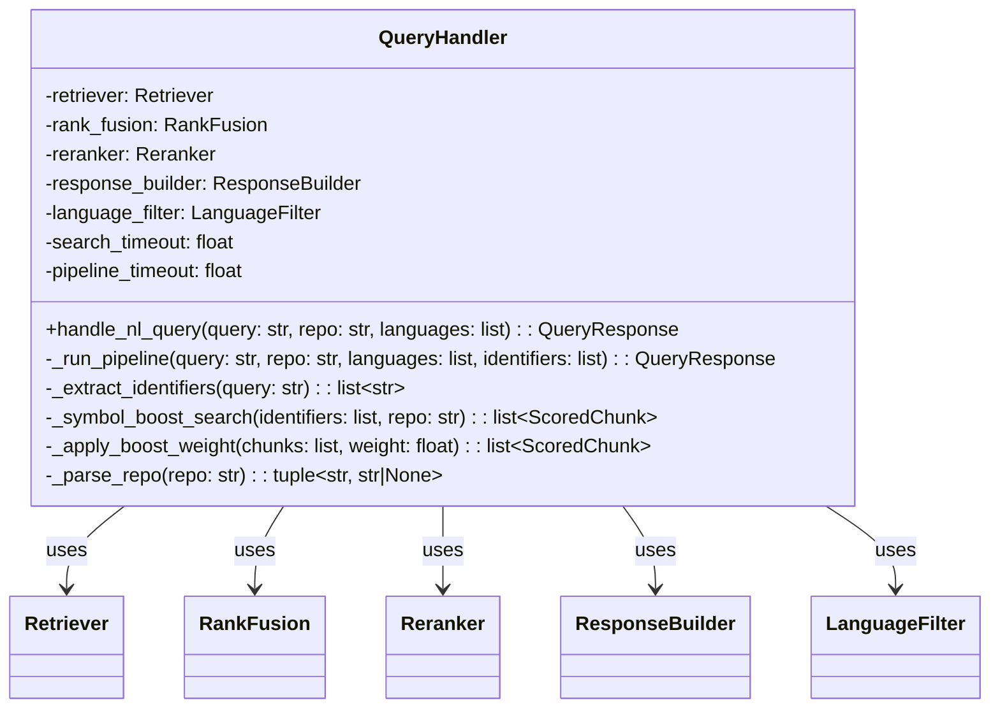
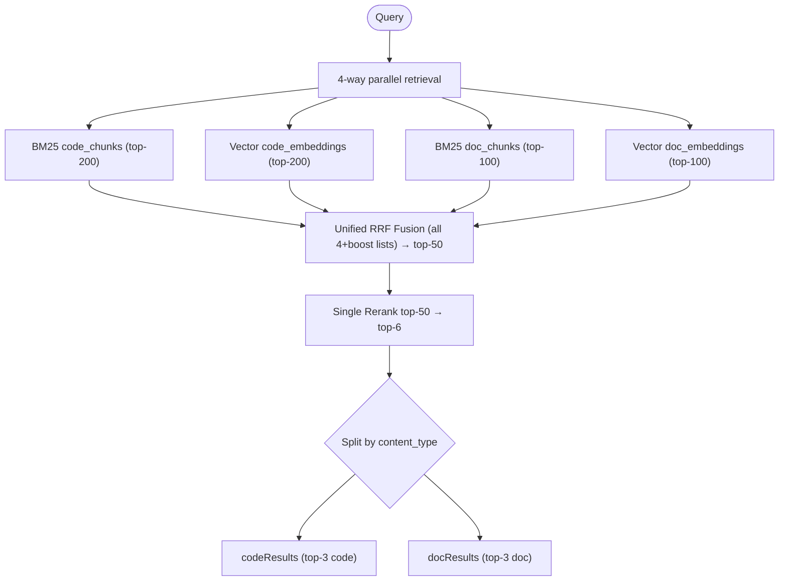
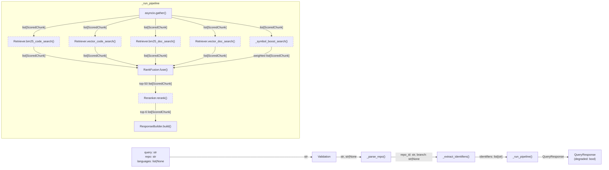
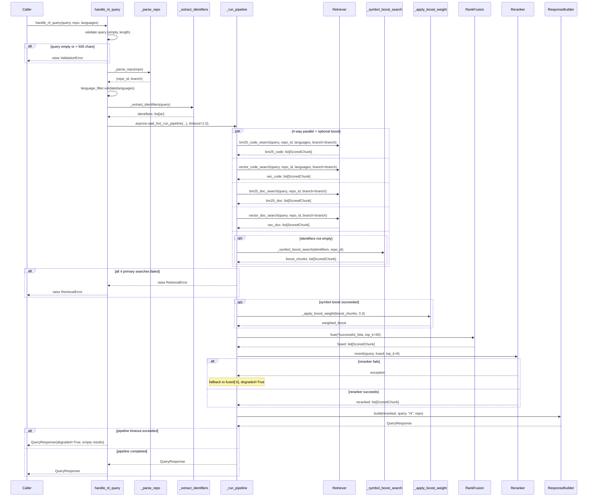
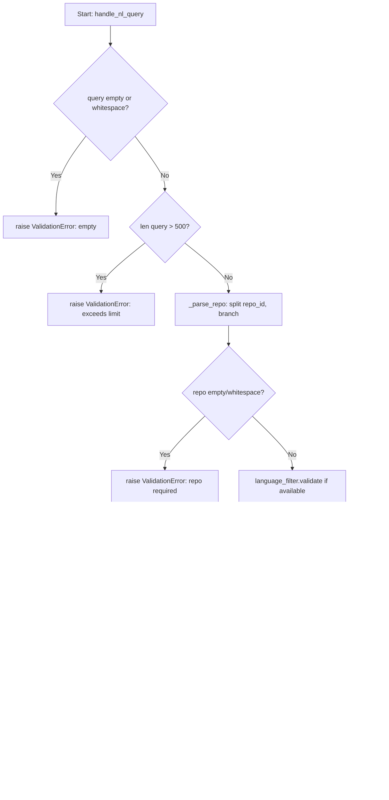
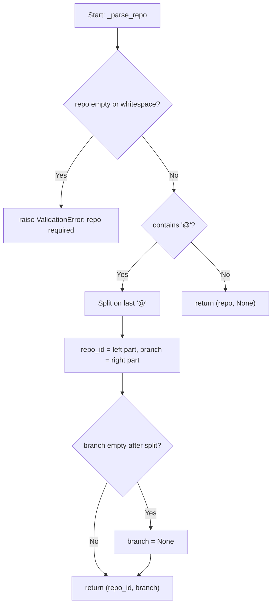
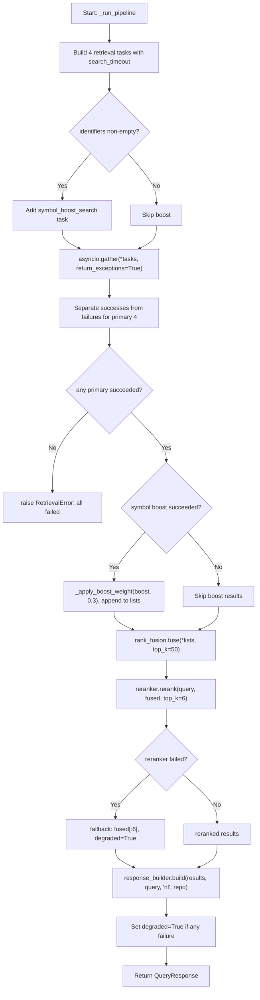

# Feature Detailed Design: Natural Language Query Handler (Feature #13)

**Date**: 2026-03-24
**Feature**: #13 — Natural Language Query Handler
**Priority**: high
**Dependencies**: Feature #12 (Context Response Builder)
**Design Reference**: docs/plans/2026-03-21-code-context-retrieval-design.md § 4.2
**SRS Reference**: FR-011

## Context

The `QueryHandler.handle_nl_query()` method orchestrates the full hybrid retrieval pipeline for natural language queries: 4-way parallel retrieval (BM25 code + vector code + BM25 doc + vector doc), unified RRF fusion, single neural rerank pass, and structured response assembly. It also performs query expansion by extracting embedded code identifiers (camelCase, PascalCase, snake_case, dot-separated) and firing parallel symbol.raw term queries merged into RRF with weight 0.3. Wave 5 adds mandatory repo parameter with optional `owner/repo@branch` parsing, forwarding the branch to all retriever calls.

## Design Alignment

From § 4.2.2 — Class Diagram:



From § 4.2.5 — Cross-Content-Type Retrieval (Unified Pipeline):



- **Key classes**: `QueryHandler` (orchestrator), `Retriever` (4-way search), `RankFusion` (RRF fusion), `Reranker` (neural reranking), `ResponseBuilder` (dual-list output), `LanguageFilter` (CON-001 validation)
- **Interaction flow**: validate → parse repo → extract identifiers → 4-way parallel retrieval + optional symbol boost → RRF fuse → rerank → build response
- **Third-party deps**: `asyncio` (stdlib), `re` (stdlib) — no new external dependencies
- **Deviations**: None. This design follows § 4.2 exactly, with Wave 5 branch-parsing addition per SRS FR-011.

## SRS Requirement

**FR-011: Natural Language Query Handler**

**Priority**: Must
**EARS**: When a user submits a natural language query with a mandatory repository identifier (e.g., `repo="google/gson"` or `repo="google/gson@main"`), the system shall execute the full hybrid retrieval pipeline (BM25 + vector + fusion + rerank) scoped to that repository and optional branch, and return structured context results.

**Acceptance Criteria**:
- Given the natural language query "how to use grpc java interceptor" with repo="google/gson", when the query handler processes it, then the system shall return top-3 results from the gson repository.
- Given an empty query string, when submitted, then the system shall return a 400 error with a descriptive message.
- Given a query exceeding 500 characters, when submitted, then the system shall return a 400 error indicating the maximum query length.
- Given a retrieval pipeline that exceeds the timeout, then the system shall return partial results with a `degraded: true` flag.
- Given a repo parameter in `owner/repo@branch` format, when the query handler processes it, then it shall parse the branch and forward it to the retriever for branch-scoped filtering.

**Related NFRs**:
- NFR-001: p95 query latency < 1000 ms (pipeline_timeout=1.0s enforces this)
- NFR-002: >= 1000 QPS throughput (async pipeline enables concurrent handling)

## Component Data-Flow Diagram



External dependencies shown with dashed borders: `Retriever` (ES + Qdrant I/O), `Reranker` (external API). Internal components: validation, `_parse_repo()`, `_extract_identifiers()`, `_run_pipeline()`, `_apply_boost_weight()`.

## Interface Contract

| Method | Signature | Preconditions | Postconditions | Raises |
|--------|-----------|---------------|----------------|--------|
| `handle_nl_query` | `async handle_nl_query(query: str, repo: str, languages: list[str] \| None = None) -> QueryResponse` | Given a non-empty query string of <= 500 chars and a repo identifier | Returns a QueryResponse with query_type="nl", code_results and doc_results populated from the hybrid pipeline; if pipeline exceeds pipeline_timeout, returns response with degraded=True | `ValidationError("query must not be empty")` if query is empty/whitespace; `ValidationError("query exceeds 500 character limit")` if len(query)>500; `RetrievalError("all retrieval paths failed")` if all 4 primary searches fail |
| `_parse_repo` | `_parse_repo(repo: str) -> tuple[str, str \| None]` | Given a repo string in "owner/repo" or "owner/repo@branch" format | Returns (repo_id, branch) tuple; branch is None if no @ present | `ValidationError` if repo is empty or whitespace-only |
| `_extract_identifiers` | `_extract_identifiers(query: str) -> list[str]` | Given a non-empty query string | Returns deduplicated list of code identifiers (camelCase, PascalCase, snake_case, dot-separated) found in the query; returns empty list if none found | (no exceptions) |
| `_run_pipeline` | `async _run_pipeline(query: str, repo_id: str \| None, branch: str \| None, languages: list[str] \| None, identifiers: list[str]) -> QueryResponse` | Given validated query parameters and extracted identifiers | Returns QueryResponse with degraded=True if any primary search failed or reranker failed; fuses all successful lists with RRF (top_k=50), reranks (top_k=6), builds dual-list response | `RetrievalError("all retrieval paths failed")` if all 4 primary searches fail |
| `_symbol_boost_search` | `async _symbol_boost_search(identifiers: list[str], repo_id: str \| None) -> list[ScoredChunk]` | Given non-empty identifiers list | Returns combined ScoredChunks from ES term queries on symbol.raw for each identifier; silently returns empty list if all sub-searches fail | (no exceptions — failures logged and suppressed) |
| `_apply_boost_weight` | `_apply_boost_weight(chunks: list[ScoredChunk], weight: float) -> list[ScoredChunk]` | Given a list of chunks and a positive weight float | Returns new list with each chunk's score multiplied by weight | (no exceptions) |

**Design rationale**:
- `_parse_repo` is a new Wave 5 addition: splits `owner/repo@branch` into `(repo_id, branch)` and forwards branch to all retriever calls for branch-scoped filtering
- Symbol boost weight 0.3 vs 1.0 for primary lists: ensures exact symbol matches surface without dominating NL relevance
- pipeline_timeout=1.0s wraps the entire pipeline in `asyncio.wait_for` to enforce NFR-001; search_timeout=0.2s is per individual retrieval call
- top_k=50 for RRF and top_k=6 for rerank (3 code + 3 doc) follows § 4.2.5

## Internal Sequence Diagram



## Algorithm / Core Logic

### handle_nl_query

#### Flow Diagram



#### Pseudocode

```
FUNCTION handle_nl_query(query: str, repo: str, languages: list[str]|None) -> QueryResponse
  // Step 1: Validate input
  IF query is empty or whitespace-only THEN raise ValidationError("query must not be empty")
  IF len(query) > 500 THEN raise ValidationError("query exceeds 500 character limit")

  // Step 2: Parse repo → (repo_id, branch)
  repo_id, branch = _parse_repo(repo)

  // Step 3: Validate language filter
  IF language_filter is not None THEN languages = language_filter.validate(languages)

  // Step 4: Extract identifiers for symbol boost
  identifiers = _extract_identifiers(query)

  // Step 5: Run pipeline with overall timeout
  TRY
    response = await asyncio.wait_for(_run_pipeline(query, repo_id, branch, languages, identifiers), timeout=pipeline_timeout)
  CATCH TimeoutError
    response = response_builder.build([], query, "nl", repo)
    response.degraded = True

  RETURN response
END
```

### _parse_repo

#### Flow Diagram



#### Pseudocode

```
FUNCTION _parse_repo(repo: str) -> tuple[str, str|None]
  // Step 1: Validate
  IF repo is empty or whitespace-only THEN raise ValidationError("repo must not be empty")

  // Step 2: Split on last '@' to handle branch
  IF '@' in repo THEN
    idx = repo.rfind('@')
    repo_id = repo[:idx]
    branch = repo[idx+1:]
    IF branch is empty THEN branch = None
    RETURN (repo_id, branch)
  ELSE
    RETURN (repo, None)
END
```

### _run_pipeline

#### Flow Diagram



#### Pseudocode

```
FUNCTION _run_pipeline(query: str, repo_id: str|None, branch: str|None, languages: list[str]|None, identifiers: list[str]) -> QueryResponse
  // Step 1: Build 4 primary retrieval tasks with individual timeouts
  tasks = [
    wait_for(retriever.bm25_code_search(query, repo_id, languages, top_k=200, branch=branch), timeout=search_timeout),
    wait_for(retriever.vector_code_search(query, repo_id, languages, top_k=200, branch=branch), timeout=search_timeout),
    wait_for(retriever.bm25_doc_search(query, repo_id, top_k=100, branch=branch), timeout=search_timeout),
    wait_for(retriever.vector_doc_search(query, repo_id, top_k=100, branch=branch), timeout=search_timeout),
  ]

  // Step 2: Add symbol boost if identifiers found
  IF identifiers is not empty THEN
    tasks.append(wait_for(_symbol_boost_search(identifiers, repo_id), timeout=search_timeout))

  // Step 3: Execute all in parallel
  results = await asyncio.gather(*tasks, return_exceptions=True)

  // Step 4: Collect successful primary results
  successful_lists = []
  degraded = False
  FOR i in 0..3:
    IF results[i] is exception THEN degraded = True
    ELSE successful_lists.append(results[i])

  // Step 5: At least one must succeed
  IF successful_lists is empty THEN raise RetrievalError("all retrieval paths failed")

  // Step 6: Handle symbol boost
  IF identifiers and len(results) > 4 and results[4] is not exception THEN
    boosted = _apply_boost_weight(results[4], weight=0.3)
    successful_lists.append(boosted)

  // Step 7: Fuse
  fused = rank_fusion.fuse(*successful_lists, top_k=50)

  // Step 8: Rerank with fallback
  TRY
    reranked = reranker.rerank(query, fused, top_k=6)
  CATCH Exception
    reranked = fused[:6]
    degraded = True

  // Step 9: Build response
  response = response_builder.build(reranked, query, "nl", repo_id)
  IF degraded THEN response.degraded = True
  RETURN response
END
```

### _extract_identifiers

#### Pseudocode

```
FUNCTION _extract_identifiers(query: str) -> list[str]
  // Regex matches: dot-separated (a.b.c), PascalCase, camelCase, snake_case
  matches = _IDENTIFIER_RE.findall(query)
  seen = set()
  identifiers = []
  FOR group in matches:
    FOR m in group:
      IF m and m not in seen THEN
        seen.add(m)
        identifiers.append(m)
  RETURN identifiers
END
```

> Simple regex scan — no branching logic beyond deduplication.

### _apply_boost_weight

> Delegates to `dataclasses.replace(chunk, score=chunk.score * weight)` for each chunk. Pure map operation — see Interface Contract above.

#### Boundary Decisions

| Parameter | Min | Max | Empty/Null | At boundary |
|-----------|-----|-----|------------|-------------|
| `query` (handle_nl_query) | 1 char | 500 chars | raise ValidationError("query must not be empty") | 500 chars: accepted; 501 chars: rejected |
| `repo` (handle_nl_query) | "a/b" (min valid) | no limit | raise ValidationError("repo must not be empty") | "a/b@": branch=None (empty branch treated as None) |
| `languages` | None | all 6 supported | None: no filter applied | Empty list []: treated as None (no filter) |
| `pipeline_timeout` | default 1.0s | N/A | N/A | At timeout: returns degraded=True with empty/partial results |
| `search_timeout` | default 0.2s | N/A | N/A | Individual search timeout: that path counted as failure |
| `identifiers` | empty list | no limit | empty: no symbol boost task added | Single identifier: one ES term query |
| `weight` (_apply_boost_weight) | 0.0 | 1.0 | N/A | 0.0: scores zeroed out; 1.0: no change |
| `top_k` (fuse) | 50 (fixed) | N/A | N/A | Fewer than 50 candidates: all returned |
| `top_k` (rerank) | 6 (fixed) | N/A | N/A | Fewer than 6 candidates: all returned |

#### Error Handling

| Condition | Detection | Response | Recovery |
|-----------|-----------|----------|----------|
| Empty/whitespace query | `not query or not query.strip()` | `ValidationError("query must not be empty")` | Caller fixes input |
| Query > 500 chars | `len(query) > 500` | `ValidationError("query exceeds 500 character limit")` | Caller truncates |
| Empty/whitespace repo | `not repo or not repo.strip()` | `ValidationError("repo must not be empty")` | Caller provides repo |
| Invalid language | `LanguageFilter.validate()` raises | `ValidationError` with unsupported language list | Caller fixes language |
| Individual search timeout | `asyncio.TimeoutError` from `wait_for` | Mark that path as failed, continue with others | Pipeline continues with remaining results, degraded=True |
| All 4 primary searches fail | `len(successful_lists) == 0` | `RetrievalError("all retrieval paths failed")` | Caller returns 504 |
| Symbol boost fails | Exception in gather result[4] | Silently ignored, proceed without boost | Pipeline continues normally |
| Reranker fails | Exception from `reranker.rerank()` | Fall back to `fused[:6]`, degraded=True | Uses RRF-only ranking |
| Pipeline timeout | `asyncio.TimeoutError` from outer `wait_for` | Return empty response with `degraded=True` | Caller returns partial/empty results |

## State Diagram

N/A — stateless feature. `handle_nl_query` is a pure request-response pipeline with no object lifecycle or persisted state transitions.

## Test Inventory

| ID | Category | Traces To | Input / Setup | Expected | Kills Which Bug? |
|----|----------|-----------|---------------|----------|-----------------|
| T01 | happy path | VS-1, FR-011 AC-1 | query="how to use grpc java interceptor", repo="google/gson"; mock 4 retrievers returning ScoredChunks, mock fuse/rerank/build | QueryResponse with query_type="nl", code_results and doc_results populated, degraded=False | Missing any of the 4 retrieval calls or wrong query_type |
| T02 | happy path | VS-5, FR-011 AC-5 | repo="google/gson@main" | _parse_repo returns ("google/gson", "main"); branch="main" forwarded to all 4 retriever calls | Branch not parsed or not forwarded to retriever |
| T03 | happy path | VS-3, FR-011 AC-1 | query="how does AuthService validate tokens"; mock symbol boost search | _extract_identifiers returns ["AuthService"]; symbol boost search called with "AuthService"; boost results merged into RRF with weight 0.3 | Identifier extraction regex fails PascalCase; boost not added to fusion |
| T04 | happy path | VS-1 | query with identifiers; mock all paths returning results | RankFusion.fuse called with 5 lists (4 primary + 1 boosted), top_k=50 | Symbol boost list not passed to fuse |
| T05 | error | §Interface Contract: ValidationError (empty) | query="", repo="google/gson" | raises ValidationError("query must not be empty") | Missing empty-check allows empty query to reach retriever |
| T06 | error | §Interface Contract: ValidationError (whitespace) | query="   ", repo="google/gson" | raises ValidationError("query must not be empty") | Whitespace-only passes validation |
| T07 | error | §Interface Contract: ValidationError (length) | query="a"*501, repo="google/gson" | raises ValidationError("query exceeds 500 character limit") | Missing length check allows arbitrarily long queries |
| T08 | error | §Interface Contract: ValidationError (empty repo) | query="test query", repo="" | raises ValidationError("repo must not be empty") | Empty repo passed through to retriever |
| T09 | error | §Interface Contract: RetrievalError | All 4 primary retrievers raise exceptions | raises RetrievalError("all retrieval paths failed") | Partial failure incorrectly raises instead of degrading |
| T10 | error | VS-4, §Error Handling: pipeline timeout | Mock _run_pipeline to sleep > 1.0s | QueryResponse with degraded=True, empty code_results and doc_results | Timeout not caught; exception propagates to caller |
| T11 | error | §Error Handling: reranker failure | Mock reranker.rerank to raise Exception | QueryResponse returned using fused[:6] as fallback, degraded=True | Reranker exception crashes pipeline instead of fallback |
| T12 | boundary | §Boundary: query=500 chars | query="a"*500, repo="google/gson"; mock successful pipeline | Returns QueryResponse normally, no ValidationError | Off-by-one: 500 chars rejected |
| T13 | boundary | §Boundary: all empty results | All 4 retrievers return empty lists [] | Returns QueryResponse with empty code_results and doc_results, degraded=False | Empty list treated as failure instead of success |
| T14 | boundary | §Boundary: symbol boost failure | query with identifiers; mock symbol boost to raise exception | Pipeline continues with 4 primary results only, no error | Symbol boost exception crashes pipeline |
| T15 | boundary | §Boundary: 3 searches fail, 1 succeeds | 3 retrievers raise exceptions, 1 returns results | QueryResponse with degraded=True, results from the 1 successful path | Partial failure counted as total failure |
| T16 | boundary | §Boundary: repo with @ but empty branch | repo="google/gson@" | _parse_repo returns ("google/gson", None) | Trailing @ creates empty branch string instead of None |
| T17 | boundary | §Boundary: no identifiers in query | query="how to configure timeout settings", repo="r" | _extract_identifiers returns []; no symbol boost task added; only 4 tasks in gather | Symbol boost task added with empty identifiers causing error |
| T18 | boundary | §Boundary: repo with multiple @ | repo="org/repo@feature@fix" | _parse_repo splits on last @: ("org/repo@feature", "fix") | Splitting on first @ corrupts repo_id |

**Negative test count**: T05, T06, T07, T08, T09, T10, T11, T12, T13, T14, T15, T16, T17, T18 = 14 error/boundary out of 18 total = **78%** (threshold: >= 40%).

## Tasks

### Task 1: Write failing tests
**Files**: `tests/test_query_handler_nl.py`
**Steps**:
1. Create test file with imports for `QueryHandler`, `ScoredChunk`, `QueryResponse`, `ValidationError`, `RetrievalError`, `RankFusion`, `Reranker`, `ResponseBuilder`, `LanguageFilter`
2. Write test functions for each Test Inventory row (T01-T18):
   - T01: `test_handle_nl_query_full_pipeline` — mock 4 retriever methods, assert all called, assert QueryResponse returned with query_type="nl"
   - T02: `test_repo_branch_parsing_forwarded` — repo="google/gson@main", verify branch="main" passed to all retriever calls
   - T03: `test_query_expansion_extracts_identifiers_and_boosts` — query contains "AuthService", verify symbol boost fires
   - T04: `test_symbol_boost_merged_into_rrf_with_5_lists` — verify fuse called with 5 lists
   - T05: `test_empty_query_raises_validation_error`
   - T06: `test_whitespace_query_raises_validation_error`
   - T07: `test_query_exceeds_500_chars_raises`
   - T08: `test_empty_repo_raises_validation_error`
   - T09: `test_all_retrieval_paths_fail_raises_retrieval_error`
   - T10: `test_pipeline_timeout_returns_degraded`
   - T11: `test_reranker_failure_falls_back_to_fused`
   - T12: `test_query_exactly_500_chars_accepted`
   - T13: `test_all_retrieval_return_empty_lists`
   - T14: `test_symbol_boost_failure_ignored`
   - T15: `test_three_fail_one_succeeds_degraded`
   - T16: `test_repo_trailing_at_branch_is_none`
   - T17: `test_no_identifiers_skips_boost`
   - T18: `test_repo_multiple_at_splits_on_last`
3. Run: `python -m pytest tests/test_query_handler_nl.py -v`
4. **Expected**: All tests FAIL (class/method not yet updated with _parse_repo)

### Task 2: Implement minimal code
**Files**: `src/query/query_handler.py`
**Steps**:
1. Add `_parse_repo(self, repo: str) -> tuple[str, str | None]` method per Algorithm §5 pseudocode:
   - Validate repo not empty/whitespace
   - Split on last `@` if present
   - Return `(repo_id, branch)` tuple
2. Update `handle_nl_query` signature and body:
   - Call `_parse_repo(repo)` to get `(repo_id, branch)`
   - Pass `branch` to `_run_pipeline`
3. Update `_run_pipeline` signature to accept `branch: str | None`:
   - Pass `branch=branch` to all 4 retriever calls (`bm25_code_search`, `vector_code_search`, `bm25_doc_search`, `vector_doc_search`)
4. Run: `python -m pytest tests/test_query_handler_nl.py -v`
5. **Expected**: All tests PASS

### Task 3: Coverage Gate
1. Run: `python -m pytest tests/test_query_handler_nl.py --cov=src/query/query_handler --cov-report=term-missing`
2. Check thresholds: line >= 90%, branch >= 80%. If below: return to Task 1.
3. Record coverage output as evidence.

### Task 4: Refactor
1. Review `handle_nl_query` and `_run_pipeline` for clarity; ensure `_parse_repo` is called before language validation (fail-fast on bad repo)
2. Ensure logging messages include repo_id and branch for observability
3. Run full test suite: `python -m pytest tests/ -v`
4. All tests PASS.

### Task 5: Mutation Gate
1. Run: `python -m pytest tests/test_query_handler_nl.py --timeout=300 && python -m mutmut run --paths-to-mutate=src/query/query_handler.py --tests-dir=tests/ --runner="python -m pytest tests/test_query_handler_nl.py -x -q"`
2. Check threshold: mutation score >= 80%. If below: improve assertions in Task 1.
3. Record mutation output as evidence.

### Task 6: Create example
1. Create `examples/13-nl-query-handler.py` demonstrating `handle_nl_query` with branch parsing
2. Update `examples/README.md` with entry for example 13
3. Run example to verify.

## Verification Checklist
- [x] All verification_steps traced to Interface Contract postconditions (VS-1→handle_nl_query postcondition, VS-2→handle_nl_query ValidationError, VS-3→_extract_identifiers+_symbol_boost_search, VS-4→pipeline timeout→degraded, VS-5→_parse_repo+branch forwarding)
- [x] All verification_steps traced to Test Inventory rows (VS-1→T01, VS-2→T05/T06/T07, VS-3→T03, VS-4→T10, VS-5→T02)
- [x] Algorithm pseudocode covers all non-trivial methods (handle_nl_query, _parse_repo, _run_pipeline, _extract_identifiers)
- [x] Boundary table covers all algorithm parameters (query, repo, languages, pipeline_timeout, search_timeout, identifiers, weight, top_k fuse, top_k rerank)
- [x] Error handling table covers all Raises entries (ValidationError empty/length/repo, RetrievalError all-fail, TimeoutError, reranker failure, symbol boost failure)
- [x] Test Inventory negative ratio >= 40% (78%)
- [x] Every skipped section has explicit "N/A — [reason]" (State Diagram: stateless feature)
