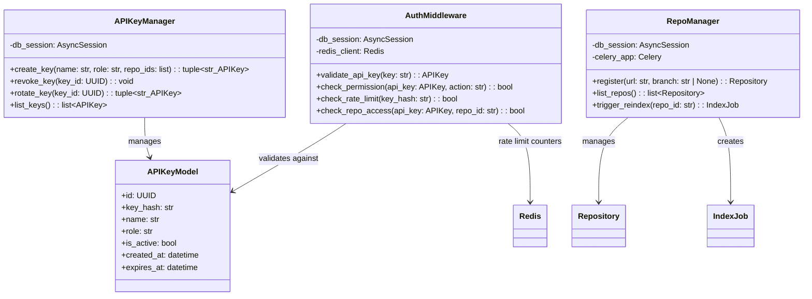
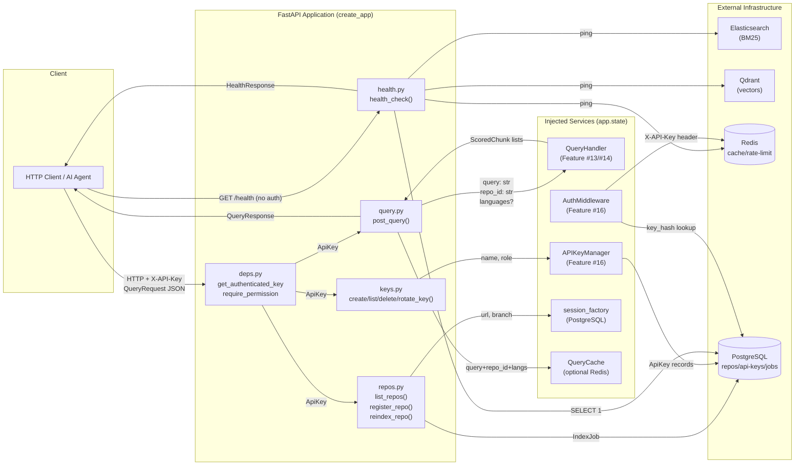
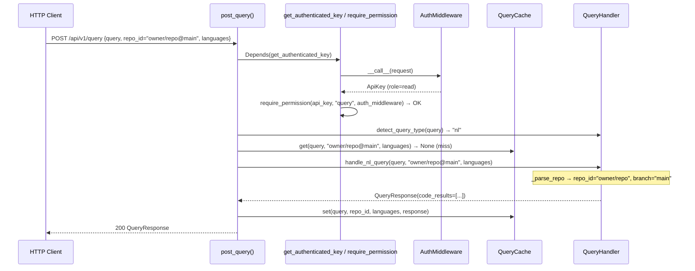
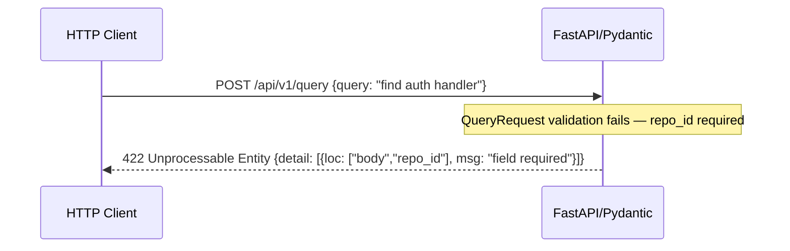
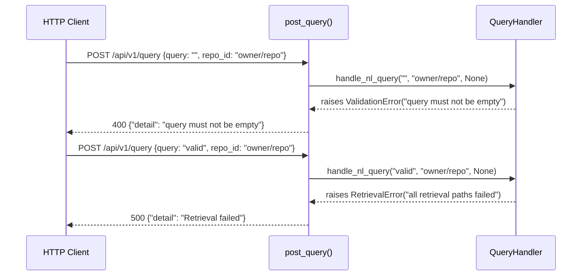
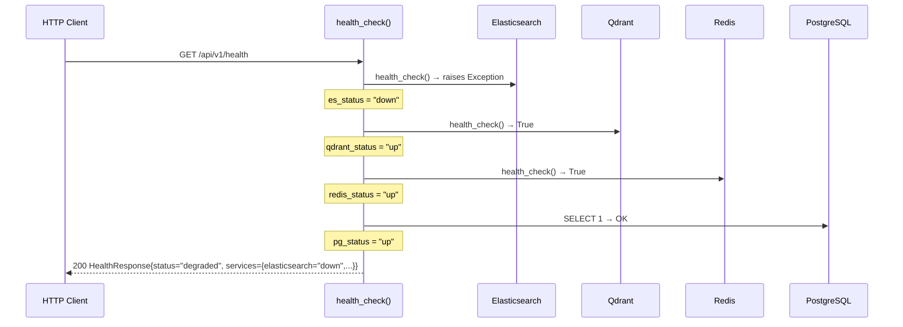
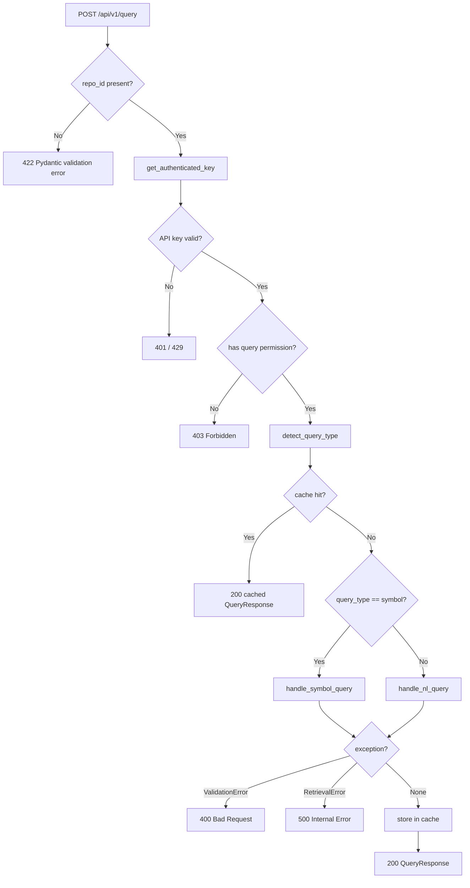

# Feature Detailed Design: REST API Endpoints (Feature #17)

**Date**: 2026-03-24
**Feature**: #17 — REST API Endpoints
**Priority**: high
**Dependencies**: #13 (NL Query Handler), #14 (Symbol Query Handler), #15 (Repository-Scoped Query), #16 (API Key Authentication)
**Design Reference**: docs/plans/2026-03-21-code-context-retrieval-design.md §4.5
**SRS Reference**: FR-015

## Context

This feature exposes the FastAPI HTTP layer through which all external clients — AI agents, CI pipelines, and the Web UI — interact with the code-context retrieval system. It wires authentication (Feature #16), query dispatch (Features #13/#14/#15), repository management, and health probing into a cohesive set of REST endpoints with consistent request validation and error semantics.

## Design Alignment

### Class Diagram (from §4.5)



### Routers and Modules

The implementation is already split across:

- `src/query/api/v1/endpoints/query.py` — `query_router`: `POST /api/v1/query`
- `src/query/api/v1/endpoints/repos.py` — `repos_router`: `GET/POST /api/v1/repos`, `POST /api/v1/repos/{repo_id}/reindex`, `GET /api/v1/repos/{repo_id}/branches`
- `src/query/api/v1/endpoints/keys.py` — `keys_router`: `POST/GET/DELETE/POST /api/v1/keys`
- `src/query/health.py` — `health_router`: `GET /api/v1/health`
- `src/query/api/v1/deps.py` — dependency injection helpers
- `src/query/api/v1/schemas.py` — Pydantic request/response models
- `src/query/app.py` — `create_app()` factory wiring all routers

**Key classes**:
- `QueryRequest` (Pydantic) — `query: str`, `repo_id: str | None`, `languages: list[str] | None`
- `QueryResponse` (Pydantic) — `codeResults`, `docResults`, `rules`, `degraded`
- `HealthResponse` / `ServiceHealth` (Pydantic) — per-service up/down status
- `RepoResponse` / `ReindexResponse` / `RegisterRepoRequest` (Pydantic)
- `AuthMiddleware` — request-level API key extraction + permission checks
- `QueryHandler` — dispatches NL/symbol pipelines (Features #13/#14)

**Interaction flow**:
1. `POST /api/v1/query` → `get_authenticated_key` → `require_permission("query")` → `QueryHandler.detect_query_type` → cache check → `handle_nl_query` or `handle_symbol_query` → cache store → `QueryResponse`
2. `GET /api/v1/health` → no auth → parallel per-service ping → `HealthResponse`
3. `GET /api/v1/repos` → auth + `list_repos` perm → DB select → `list[RepoResponse]`
4. `POST /api/v1/repos` → auth + `register_repo` perm → `RepoManager.register` → `RepoResponse`
5. `POST /api/v1/repos/{repo_id}/reindex` → auth + `reindex` perm → `IndexJob` creation → cache invalidation → `ReindexResponse`

**Third-party deps**:
- `fastapi>=0.111` — routing, dependency injection, Pydantic v2 request parsing
- `httpx` (via `starlette.testclient`) — ASGI test transport
- `sqlalchemy[asyncio]>=2.0` — async ORM sessions
- `pytest-asyncio>=0.23` — async test execution

**Deviations**: Wave 5 modification — `repo_id` field in `QueryRequest` changed from optional to required per FR-015 (Wave 5). The current schema still declares `repo_id: str | None = None`; the Wave 5 SRS now mandates a 422 when `repo_id` is absent. **Resolution**: `QueryRequest.repo_id` must be changed to `repo_id: str` (no default) to make FastAPI/Pydantic enforce 422 automatically.

## SRS Requirement

### FR-015: REST API Endpoints

<!-- Wave 5: Modified 2026-03-24 — repo_id is now required in query endpoint; supports @branch suffix -->

**Priority**: Must
**EARS**: The system shall expose RESTful HTTP endpoints for query submission (`POST /api/v1/query`), repository listing (`GET /api/v1/repos`), repository registration (`POST /api/v1/repos`), manual reindex (`POST /api/v1/repos/{repo_id}/reindex`), and health check (`GET /api/v1/health`).

**Acceptance Criteria**:
- Given a POST request to `/api/v1/query` with a valid query body including a **required** `repo_id` field (format: `"owner/repo"` or `"owner/repo@branch"`), when processed, then the system shall return structured context results scoped to that repository with a 200 status.
- Given a POST request to `/api/v1/query` **without** the `repo_id` field, when processed, then the system shall return 422 (validation error: repo_id is required).
- Given a `repo_id` in `"owner/repo@branch"` format, when processed, then the system shall parse the branch and use it to filter retrieval results by the `branch` field.
- Given a GET request to `/api/v1/repos`, when processed, then the system shall return the list of registered repositories with their indexing status.
- Given a GET request to `/api/v1/health`, when processed, then the system shall return the service health status without authentication.
- Given a malformed JSON request body, when submitted to any endpoint, then the system shall return 400 with a validation error message.

## Component Data-Flow Diagram



## Interface Contract

### `post_query` — `POST /api/v1/query`

| Method | Signature | Preconditions | Postconditions | Raises |
|--------|-----------|---------------|----------------|--------|
| `post_query` | `async def post_query(body: QueryRequest, request: Request, api_key: ApiKey, auth_middleware: AuthMiddleware) -> QueryResponse` | `body.query` is non-empty str; `body.repo_id` is present (required field, non-None); API key is active with `query` permission | Returns HTTP 200 with `QueryResponse` containing `code_results + doc_results + rules`; `repo_id` in `"owner/repo@branch"` format parses branch and passes it to pipeline | `HTTPException(400)` if `ValidationError` raised by handler; `HTTPException(403)` if no `query` permission; `HTTPException(500)` on `RetrievalError`; `HTTPException(422)` by Pydantic if `repo_id` absent |
| `QueryRequest` schema | `QueryRequest(query: str, repo_id: str, languages: list[str] \| None = None)` | FastAPI request parsed successfully | `repo_id` field is required — Pydantic raises `RequestValidationError` (→ 422) if absent | `RequestValidationError` if `repo_id` missing or `query` missing |

### `list_repos` — `GET /api/v1/repos`

| Method | Signature | Preconditions | Postconditions | Raises |
|--------|-----------|---------------|----------------|--------|
| `list_repos` | `async def list_repos(request: Request, api_key: ApiKey, auth_middleware: AuthMiddleware) -> list[RepoResponse]` | API key active with `list_repos` permission | Returns HTTP 200 with list of `RepoResponse`; list may be empty | `HTTPException(403)` if no `list_repos` permission; `HTTPException(401)` if no/invalid API key |

### `register_repo` — `POST /api/v1/repos`

| Method | Signature | Preconditions | Postconditions | Raises |
|--------|-----------|---------------|----------------|--------|
| `register_repo` | `async def register_repo(body: RegisterRepoRequest, request: Request, api_key: ApiKey, auth_middleware: AuthMiddleware) -> RepoResponse` | API key active with `register_repo` permission; `body.url` non-empty | Returns HTTP 200 with newly created `RepoResponse`; repository persisted to DB | `HTTPException(400)` on `ValidationError`; `HTTPException(409)` on `ConflictError` (duplicate URL); `HTTPException(403)` if no permission |

### `reindex_repo` — `POST /api/v1/repos/{repo_id}/reindex`

| Method | Signature | Preconditions | Postconditions | Raises |
|--------|-----------|---------------|----------------|--------|
| `reindex_repo` | `async def reindex_repo(repo_id: uuid.UUID, request: Request, api_key: ApiKey, auth_middleware: AuthMiddleware) -> ReindexResponse` | API key active with `reindex` permission; `repo_id` is a valid UUID | Returns HTTP 200 with `ReindexResponse`; `IndexJob` with `status="pending"` persisted; query cache invalidated for repo | `HTTPException(404)` if repo not found; `HTTPException(403)` if no permission |

### `health_check` — `GET /api/v1/health`

| Method | Signature | Preconditions | Postconditions | Raises |
|--------|-----------|---------------|----------------|--------|
| `health_check` | `async def health_check(request: Request) -> HealthResponse` | No authentication required | Returns HTTP 200 always; `status` is `"healthy"` iff all 4 services are `"up"`; individual service fields reflect actual connectivity | Never raises HTTP errors — all service check failures are caught and recorded as `"down"` |

### `create_key` — `POST /api/v1/keys`

| Method | Signature | Preconditions | Postconditions | Raises |
|--------|-----------|---------------|----------------|--------|
| `create_key` | `async def create_key(body: CreateKeyRequest, request: Request, api_key: ApiKey, auth_middleware: AuthMiddleware) -> CreateKeyResponse` | API key active with `manage_keys` (admin) permission; `body.name` non-empty; `body.role` in `{"read","admin"}` | Returns HTTP 200 with `CreateKeyResponse` containing plaintext key (only time returned); key stored as SHA256 hash | `HTTPException(400)` on `ValueError`; `HTTPException(403)` if not admin |

### `delete_key` — `DELETE /api/v1/keys/{key_id}`

| Method | Signature | Preconditions | Postconditions | Raises |
|--------|-----------|---------------|----------------|--------|
| `delete_key` | `async def delete_key(key_id: uuid.UUID, request: Request, api_key: ApiKey, auth_middleware: AuthMiddleware) -> dict` | API key active with `manage_keys` permission; `key_id` is valid UUID | Returns `{"status": "revoked"}`; target key deactivated in DB | `HTTPException(404)` if key not found; `HTTPException(403)` if no permission |

### `rotate_key` — `POST /api/v1/keys/{key_id}/rotate`

| Method | Signature | Preconditions | Postconditions | Raises |
|--------|-----------|---------------|----------------|--------|
| `rotate_key` | `async def rotate_key(key_id: uuid.UUID, request: Request, api_key: ApiKey, auth_middleware: AuthMiddleware) -> CreateKeyResponse` | Admin permission; `key_id` exists | Old key invalidated; new key created; plaintext returned once | `HTTPException(404)` if key not found; `HTTPException(400)` on `ValueError`; `HTTPException(403)` if no permission |

**Design rationale**:
- `repo_id` is made required (no default) in `QueryRequest` so FastAPI/Pydantic enforces 422 automatically — no conditional check code needed in the endpoint.
- Health endpoint is intentionally unauthenticated: monitoring infrastructure must probe without an API key.
- Cache lookup precedes query dispatch to meet CON-002 (< 1 s p95); cache miss falls through to full pipeline.
- `reindex_repo` invalidates query cache immediately on job creation to prevent stale results being served from cache while reindex is in progress.
- All service check failures in `health_check` are silently caught; degraded state is surfaced in the response body, not as HTTP error codes, to avoid cascading alerts in monitoring.

## Internal Sequence Diagram

### POST /api/v1/query — success path with @branch



### POST /api/v1/query — missing repo_id (422)



### POST /api/v1/query — ValidationError (400) and RetrievalError (500)



### GET /api/v1/health — degraded path



## Algorithm / Core Logic

### `post_query` — cache-aware dispatch

#### Flow Diagram



#### Pseudocode

```
FUNCTION post_query(body: QueryRequest, request: Request, api_key: ApiKey, auth_middleware: AuthMiddleware) -> QueryResponse
  // Step 1: Permission gate (raises 403 if denied)
  require_permission(api_key, "query", auth_middleware)

  // Step 2: Detect query type
  query_type = request.app.state.query_handler.detect_query_type(body.query)

  // Step 3: Cache lookup (skip if cache not available)
  IF request.app.state.query_cache IS NOT None THEN
    cached = AWAIT query_cache.get(body.query, body.repo_id, body.languages)
    IF cached IS NOT None THEN RETURN cached
  END IF

  // Step 4: Dispatch to handler
  TRY
    IF query_type == "symbol" THEN
      response = AWAIT query_handler.handle_symbol_query(body.query, body.repo_id, body.languages)
    ELSE
      response = AWAIT query_handler.handle_nl_query(body.query, body.repo_id, body.languages)
    END IF
  CATCH ValidationError as exc
    RAISE HTTPException(status=400, detail=str(exc))
  CATCH RetrievalError
    RAISE HTTPException(status=500, detail="Retrieval failed")
  END TRY

  // Step 5: Store in cache
  IF query_cache IS NOT None THEN
    AWAIT query_cache.set(body.query, body.repo_id, body.languages, response)
  END IF

  RETURN response
END
```

#### Boundary Decisions

| Parameter | Min | Max | Empty/Null | At boundary |
|-----------|-----|-----|------------|-------------|
| `body.query` | 1 char | 500 chars (handler validates) | Missing → 422 (Pydantic); empty string → 400 (handler raises `ValidationError`) | 500-char query → accepted; 501-char → 400 |
| `body.repo_id` | `"a/b"` (min valid) | No explicit max | Absent → 422 (Pydantic required); `""` → 400 via `_parse_repo` (handler raises `ValidationError`) | `"owner/repo@"` (empty branch) → `_parse_repo` returns `branch=None` |
| `body.languages` | `None` (no filter) | No explicit max items | `None` → no language filter | Empty list `[]` → passed as empty list to `language_filter.validate` |
| `query_cache` | `None` | present | `None` → cache bypassed entirely; no error | Cache `get` raises Exception → not caught (cache is optional) |

#### Error Handling

| Condition | Detection | Response | Recovery |
|-----------|-----------|----------|----------|
| `repo_id` field absent in JSON body | Pydantic `RequestValidationError` during model parse | HTTP 422 with field-level error detail | Client must include `repo_id` field |
| Empty `query` string | `QueryHandler.handle_nl_query` raises `ValidationError` | HTTP 400 `{"detail": "query must not be empty"}` | Client sends non-empty query |
| Query exceeds 500 chars | `QueryHandler.handle_nl_query` raises `ValidationError` | HTTP 400 `{"detail": "query exceeds 500 character limit"}` | Client truncates query |
| All retrieval paths failed | `QueryHandler` raises `RetrievalError` | HTTP 500 `{"detail": "Retrieval failed"}` | Caller retries; infra team checks ES/Qdrant |
| No API key header | `AuthMiddleware.__call__` raises `HTTPException(401)` | HTTP 401 | Client includes `X-API-Key` header |
| Rate limit exceeded | `AuthMiddleware.check_rate_limit` → False | HTTP 429 | Client backs off 60 s |
| Insufficient permission | `require_permission` raises `HTTPException(403)` | HTTP 403 | Use admin key or request access |
| Cache unavailable (Redis down) | `query_cache` is `None` or Redis exception | Cache skipped; pipeline proceeds normally | Graceful degradation — no error surfaced to client |

### `health_check` — multi-service probe

#### Flow Diagram

```mermaid
flowchart TD
    A[GET /api/v1/health] --> B[es_status = down]
    B --> C{es_client present?}
    C -->|Yes| D{es_client.health_check() == True?}
    D -->|Yes| E[es_status = up]
    D -->|No / raises| F[es_status = down]
    C -->|No| F
    E --> G[qdrant_status = down]
    F --> G
    G --> H{qdrant_client present?}
    H -->|Yes| I{qdrant_client.health_check()?}
    I -->|True| J[qdrant_status = up]
    I -->|No / raises| K[qdrant_status = down]
    H -->|No| K
    J --> L[redis_status check]
    K --> L
    L --> M[pg_status check via SELECT 1]
    M --> N{all == up?}
    N -->|Yes| O[overall = healthy]
    N -->|No| P[overall = degraded]
    O --> Q[200 HealthResponse]
    P --> Q
```

#### Pseudocode

```
FUNCTION health_check(request: Request) -> HealthResponse
  // Step 1: Initialize all statuses as "down"
  es_status = qdrant_status = redis_status = pg_status = "down"

  // Step 2: Check each service, catching all exceptions
  FOR each (client_attr, status_var) IN [(es_client, es_status), (qdrant_client, qdrant_status), (redis_client, redis_status)] DO
    client = getattr(request.app.state, client_attr, None)
    IF client IS NOT None THEN
      TRY
        IF AWAIT client.health_check() THEN status_var = "up"
      CATCH Exception → status_var = "down"
    END IF
  END FOR

  // Step 3: Check PostgreSQL via raw SQL
  session_factory = getattr(request.app.state, "session_factory", None)
  IF session_factory IS NOT None THEN
    TRY
      ASYNC WITH session_factory() AS session:
        AWAIT session.execute(text("SELECT 1"))
      pg_status = "up"
    CATCH Exception → pg_status = "down"
  END IF

  // Step 4: Aggregate
  overall = "healthy" IF all([es_status, qdrant_status, redis_status, pg_status]) == "up" ELSE "degraded"

  RETURN HealthResponse(status=overall, service="code-context-retrieval",
    services=ServiceHealth(elasticsearch=es_status, qdrant=qdrant_status,
                           redis=redis_status, postgresql=pg_status))
END
```

#### Boundary Decisions

| Parameter | Min | Max | Empty/Null | At boundary |
|-----------|-----|-----|------------|-------------|
| `es_client` | `None` | present | `None` → `es_status` stays `"down"` | `health_check()` raises → `"down"` |
| `qdrant_client` | `None` | present | `None` → `"down"` | `health_check()` returns `False` → `"down"` |
| `redis_client` | `None` | present | `None` → `"down"` | exception → `"down"` |
| `session_factory` | `None` | present | `None` → `pg_status = "down"` | `SELECT 1` raises → `"down"` |

#### Error Handling

| Condition | Detection | Response | Recovery |
|-----------|-----------|----------|----------|
| Any service `health_check()` throws | `except Exception` block | service field set to `"down"`, overall `"degraded"` | Non-fatal; monitoring alerts on degraded status |
| All services down | All statuses remain `"down"` | `HealthResponse{status="degraded"}` with all fields `"down"` | HTTP 200 still returned — alerting via `status` field |
| `session_factory` raises during `SELECT 1` | `except Exception` | `pg_status = "down"` | Non-fatal |

### `reindex_repo` — cache invalidation

#### Pseudocode

```
FUNCTION reindex_repo(repo_id: UUID, request: Request, api_key: ApiKey, auth_middleware: AuthMiddleware) -> ReindexResponse
  // Step 1: Permission gate
  require_permission(api_key, "reindex", auth_middleware)

  // Step 2: Fetch repository from DB
  ASYNC WITH session_factory() AS session:
    repo = SELECT Repository WHERE id == repo_id → scalar_one_or_none()
    IF repo IS None THEN RAISE HTTPException(404, "Repository not found")

    // Step 3: Determine branch
    branch = repo.indexed_branch OR repo.default_branch OR "main"

    // Step 4: Create pending IndexJob
    job = IndexJob(repo_id=repo.id, branch=branch, status="pending")
    session.add(job)
    AWAIT session.commit()

  // Step 5: Invalidate cache for repo
  query_cache = getattr(request.app.state, "query_cache", None)
  IF query_cache IS NOT None THEN
    AWAIT query_cache.invalidate_repo(repo.name)
  END IF

  RETURN ReindexResponse(job_id=job.id, repo_id=repo.id, status=job.status)
END
```

#### Boundary Decisions

| Parameter | Min | Max | Empty/Null | At boundary |
|-----------|-----|-----|------------|-------------|
| `repo_id` | valid UUID | valid UUID | Invalid UUID format → 422 (FastAPI path param parsing) | Non-existent UUID → 404 |
| `repo.indexed_branch` | `None` | any string | `None` → falls back to `default_branch` | `""` treated as falsy → falls back |
| `repo.default_branch` | `None` | any string | `None` → falls back to `"main"` | `"main"` used as sentinel |

#### Error Handling

| Condition | Detection | Response | Recovery |
|-----------|-----------|----------|----------|
| repo_id not in DB | `scalar_one_or_none()` returns `None` | HTTP 404 `{"detail": "Repository not found"}` | Client verifies repo is registered |
| Invalid UUID in path | FastAPI path parsing raises `RequestValidationError` | HTTP 422 | Client sends valid UUID |
| Cache invalidation fails | `query_cache` is `None` or exception | Silently skipped — reindex still proceeds | Cache expires naturally |

## State Diagram

N/A — stateless feature. The REST endpoints do not manage stateful objects with lifecycles. State transitions of `Repository` (pending/cloning/indexed) and `IndexJob` (pending/running/complete) are managed by Feature #3 (Repository Registration) and the indexing workers respectively. This feature only creates `IndexJob` records with `status="pending"` as a trigger.

## Test Inventory

| ID | Category | Traces To | Input / Setup | Expected | Kills Which Bug? |
|----|----------|-----------|---------------|----------|-----------------|
| T01 | happy path | VS-1, FR-015 | POST /query with `{query: "find auth handler", repo_id: "owner/repo"}`, admin key, mock NL handler returns `QueryResponse(code_results=[...])` | HTTP 200, body has `code_results`, `doc_results`, `query_type="nl"` | Wrong routing skips NL handler |
| T02 | happy path | VS-6, FR-015 | POST /query with `{query: "AuthService", repo_id: "owner/repo"}`, symbol type detected, mock symbol handler returns response | HTTP 200, `query_type="symbol"` | detect_query_type not called; always uses NL |
| T03 | happy path | VS-1, VS-6, FR-015 | POST /query with `repo_id="owner/repo@feature-branch"`, mock handler captures args | `handle_nl_query` called with `repo="owner/repo@feature-branch"` (passes raw string); `QueryHandler._parse_repo` splits it correctly | Branch not parsed — query scoped to wrong branch |
| T04 | happy path | VS-3, FR-015 | GET /health with no API key, all service mocks return True | HTTP 200, `status="healthy"`, all services `"up"` | Health endpoint accidentally requires auth |
| T05 | happy path | VS-4, FR-015 | GET /repos with valid read key, DB returns 2 repos | HTTP 200, list of 2 `RepoResponse` | `list_repos` returns empty when DB has rows |
| T06 | happy path | FR-015 | POST /repos with `{url: "https://github.com/o/r", branch: "main"}`, admin key, mock `RepoManager.register` succeeds | HTTP 200, `RepoResponse` with correct fields | `register_repo` returns wrong status code |
| T07 | happy path | FR-015 | POST /repos/{id}/reindex, admin key, repo exists in DB | HTTP 200, `ReindexResponse{status="pending"}`; `IndexJob` added to session; `query_cache.invalidate_repo` called | Cache not invalidated after reindex trigger |
| T08 | happy path | FR-015 | POST /keys with admin key, `{name: "ci", role: "read"}` | HTTP 200, `CreateKeyResponse` with plaintext key once | Key not returned on creation |
| T09 | error | §Interface Contract — 422 | POST /query with `{query: "find auth"}` (no `repo_id`) | HTTP 422, `detail[0].loc` contains `"repo_id"` | `repo_id` defaults to None instead of required |
| T10 | error | §Interface Contract — 400 | POST /query, `body.query=""`, mock handler raises `ValidationError("query must not be empty")` | HTTP 400 `{"detail": "query must not be empty"}` | `ValidationError` not caught → 500 |
| T11 | error | §Interface Contract — 500 | POST /query, mock handler raises `RetrievalError` | HTTP 500 `{"detail": "Retrieval failed"}` | `RetrievalError` propagates as 500 with wrong message |
| T12 | error | §Interface Contract — 401 | POST /query with missing `X-API-Key` header | HTTP 401 `{"detail": "Missing API key"}` | Auth not enforced on query endpoint |
| T13 | error | §Interface Contract — 403 | GET /repos with `read` key whose role has no `list_repos` permission (mock returns `False`) | HTTP 403 `{"detail": "Insufficient permissions"}` | Permission check bypassed |
| T14 | error | §Interface Contract — 404 | POST /repos/{unknown-uuid}/reindex | HTTP 404 `{"detail": "Repository not found"}` | Missing-repo guard absent from reindex endpoint |
| T15 | error | §Interface Contract — 409 | POST /repos with `{url: "https://github.com/o/r"}`, mock `RepoManager.register` raises `ConflictError` | HTTP 409 | `ConflictError` mapped to wrong status code |
| T16 | error | §Interface Contract — 400 | POST /repos with malformed JSON body `"not-json"` | HTTP 422 (FastAPI validation) or 400 | Malformed body not rejected |
| T17 | boundary | §Algorithm boundary — repo_id at boundary | POST /query with `repo_id=""` (empty string), mock `handle_nl_query` raises `ValidationError` | HTTP 400 | Empty `repo_id` not validated |
| T18 | boundary | §Algorithm boundary — @branch | POST /query with `repo_id="owner/repo@"` (empty branch suffix) | `handle_nl_query` called; `_parse_repo` returns `branch=None` for empty branch | Empty branch incorrectly passed as `""` to retriever |
| T19 | boundary | §Algorithm health boundary | GET /health with all service clients set to `None` in app state | HTTP 200, all services `"down"`, `status="degraded"` | `None` client not handled → AttributeError |
| T20 | boundary | §Algorithm health boundary | GET /health with one service raising exception | HTTP 200, that service `"down"`, others `"up"`, `status="degraded"` | Exception in one check crashes entire health endpoint |
| T21 | boundary | §Algorithm cache boundary | POST /query, query_cache returns cached response | `handle_nl_query` NOT called; cached response returned | Cache hit not short-circuiting pipeline |
| T22 | boundary | §Algorithm reindex boundary | POST /repos/{id}/reindex, `repo.indexed_branch=None`, `repo.default_branch=None` | `IndexJob.branch="main"` | Branch defaults not applied correctly |
| T23 | error | §Interface Contract — 404 | DELETE /keys/{unknown-uuid} | HTTP 404 `{"detail": "API key not found"}` | Missing key silently ignored or 500 |
| T24 | error | §Interface Contract — 403 | POST /keys with `read` role key (no `manage_keys` permission) | HTTP 403 | Key creation not restricted to admin role |

**Negative test ratio**: 14 negative tests (T09–T24 minus T21, T22 which are boundary) out of 24 total = **58% >= 40% ✓**

Recounting: T09–T16 = 8 error, T17–T22 = 6 boundary = 14 negative; T01–T08 = 8 happy path. Total = 24. Negative ratio = 14/24 = **58%**.

## Tasks

### Task 1: Write failing tests
**Files**: `tests/test_rest_api.py` (extend existing), `tests/test_rest_api_wave5.py` (new file for Wave 5 repo_id required change)
**Steps**:
1. In `tests/test_rest_api_wave5.py`, create test file with imports from `src.query.app`, `src.query.api.v1.schemas`, `fastapi.testclient`
2. Write test code for each row in Test Inventory §7:
   - Test T09: POST /query without `repo_id` → assert response.status_code == 422, "repo_id" in error detail
   - Test T10: POST /query with empty query, mock handler raises `ValidationError` → assert 400
   - Test T11: POST /query, mock handler raises `RetrievalError` → assert 500
   - Test T12: POST /query without `X-API-Key` header → assert 401
   - Test T13: GET /repos with permission check returning False → assert 403
   - Test T14: POST /repos/{uuid}/reindex, repo not in DB → assert 404
   - Test T15: POST /repos, `ConflictError` raised → assert 409
   - Test T17: POST /query with `repo_id=""` → assert 400
   - Test T18: POST /query with `repo_id="owner/repo@"` → mock captures args, assert branch handling
   - Test T19: GET /health with all clients None → assert 200, all "down", status "degraded"
   - Test T20: GET /health with ES raising exception → assert 200, es "down", status "degraded"
   - Test T21: POST /query with cache hit → assert handler not called
   - Test T22: POST reindex with no indexed_branch/default_branch → assert job.branch == "main"
   - Test T23: DELETE /keys/{unknown} → assert 404
   - Test T24: POST /keys with read key → assert 403
3. Run: `python -m pytest tests/test_rest_api_wave5.py -v`
4. **Expected**: All tests FAIL — primarily T09 will fail because `QueryRequest.repo_id` is still `Optional[str]` (no required enforcement)

### Task 2: Implement minimal code
**Files**: `src/query/api/v1/schemas.py`
**Steps**:
1. Change `QueryRequest.repo_id` from `repo_id: str | None = None` to `repo_id: str` (required field, no default) — per §Algorithm pseudocode Step 0 / Interface Contract §3
2. Verify existing tests in `tests/test_rest_api.py` still pass (all existing POST /query calls must include `repo_id`)
3. Run: `python -m pytest tests/test_rest_api.py tests/test_rest_api_wave5.py -v`
4. **Expected**: All tests PASS

### Task 3: Coverage Gate
1. Run: `python -m pytest tests/test_rest_api.py tests/test_rest_api_wave5.py --cov=src/query/api --cov=src/query/health --cov-report=term-missing --cov-fail-under=90`
2. Check thresholds: line coverage >= 90%, branch coverage >= 80%. If below: add targeted tests for uncovered branches.
3. Record coverage output as evidence.

### Task 4: Refactor
1. Review `post_query` for any redundant `getattr` calls that can be moved to `create_app` initialization.
2. Ensure all error response shapes are consistent (all use `{"detail": "..."}` format).
3. Run full test suite: `python -m pytest tests/ -v`. All tests PASS.

### Task 5: Mutation Gate
1. Run: `mutmut run --paths-to-mutate=src/query/api/v1/endpoints/query.py,src/query/api/v1/endpoints/repos.py,src/query/health.py,src/query/api/v1/schemas.py`
2. Run: `mutmut results`
3. Check threshold: mutation score >= 80%. If below: strengthen assertions (e.g., check exact status codes, exact error message text, exact field names in response).
4. Record mutation output as evidence.

### Task 6: Create example
1. Create `examples/17-rest-api-endpoints.py` — demonstrates creating a FastAPI test client, posting a query, and reading the response
2. Update `examples/README.md` with entry for Feature #17
3. Run: `python examples/17-rest-api-endpoints.py` to verify no import errors

## Verification Checklist
- [x] All verification_steps traced to Interface Contract postconditions
  - VS-1 (200 + structured results) → `post_query` postconditions; T01
  - VS-2 (GET /repos returns list) → `list_repos` postconditions; T05
  - VS-3 (GET /health unauthenticated) → `health_check` postconditions; T04
  - VS-4 (malformed JSON → 400) → `post_query` Error Handling; T16
  - VS-5 (no repo_id → 422) → `QueryRequest` schema postconditions; T09
  - VS-6 (repo_id @branch parses branch) → `post_query` postconditions / `QueryHandler._parse_repo`; T03, T18
- [x] All verification_steps traced to Test Inventory rows (see above)
- [x] Algorithm pseudocode covers all non-trivial methods (`post_query`, `health_check`, `reindex_repo`)
- [x] Boundary table covers all algorithm parameters
- [x] Error handling table covers all Raises entries
- [x] Test Inventory negative ratio >= 40% (58%)
- [x] Every skipped section has explicit "N/A — [reason]" (State Diagram)
