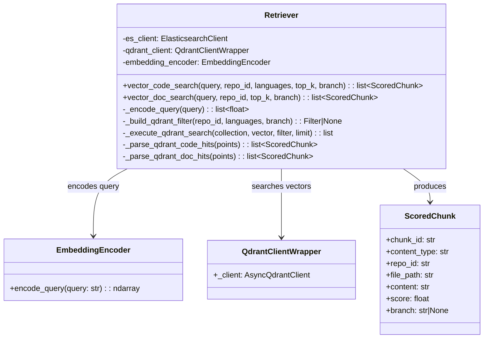
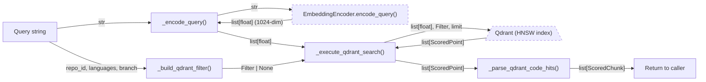
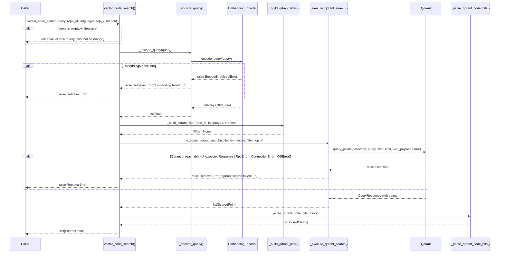
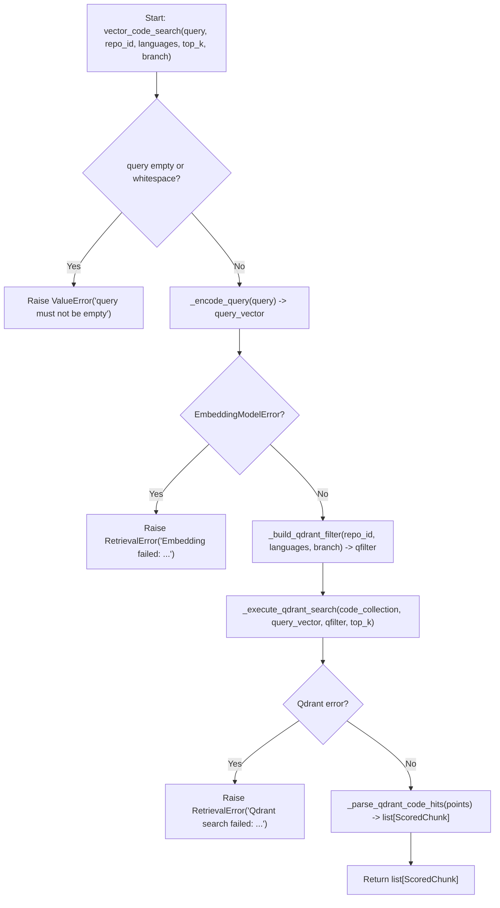
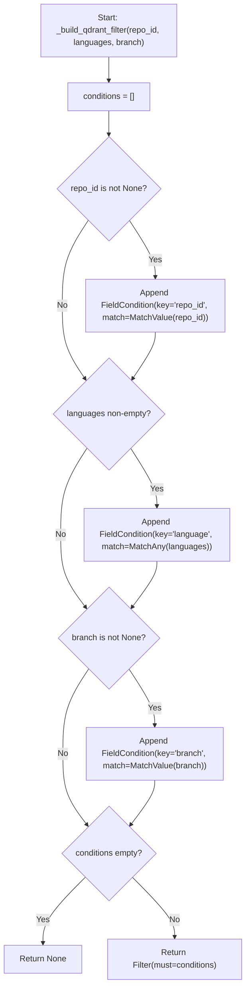

# Feature Detailed Design: Semantic Retrieval (Vector) (Feature #9)

**Date**: 2026-03-24
**Feature**: #9 — Semantic Retrieval (Vector)
**Priority**: high
**Dependencies**: #7 (Embedding Generation — passing)
**Design Reference**: docs/plans/2026-03-21-code-context-retrieval-design.md § 4.2
**SRS Reference**: FR-007

## Context

Feature #9 implements vector-based semantic search in the Retriever class, enabling retrieval of code chunks by meaning rather than keyword matching. The query is encoded into a 1024-dim dense vector via `EmbeddingEncoder.encode_query()`, then searched against Qdrant's HNSW index with cosine similarity, returning up to 200 ranked candidates. Wave 5 adds branch-level filtering so that vector searches can be scoped to a specific Git branch.

## Design Alignment

**From §4.2 — Hybrid Retrieval Pipeline (FR-006 to FR-010):**

The Retriever class handles both BM25 keyword searches (Feature #8) and vector semantic searches (this feature). Two public methods are provided:
- `vector_code_search()` — vector search on `code_embeddings` Qdrant collection
- `vector_doc_search()` — vector search on `doc_embeddings` Qdrant collection

Both encode the query via `EmbeddingEncoder.encode_query()` (with instruction prefix "Represent this code search query: "), then execute approximate nearest neighbor search on Qdrant with cosine similarity.



- **Key classes**: `Retriever` (extended with branch filter on vector search), using `EmbeddingEncoder` (Feature #7) and `QdrantClientWrapper` (Feature #2)
- **Interaction flow**: `Retriever.vector_code_search()` -> `_encode_query()` -> `EmbeddingEncoder.encode_query()` -> `_build_qdrant_filter()` -> `_execute_qdrant_search()` -> `QdrantClientWrapper._client.query_points()` -> `_parse_qdrant_code_hits()` -> `list[ScoredChunk]`
- **Third-party deps**: `qdrant-client` (AsyncQdrantClient), `numpy` (for vectors)
- **Deviations**: None — implements design section 4.2 as specified, with Wave 5 branch filter addition per updated FR-007

## SRS Requirement

### FR-007: Semantic Retrieval

**Priority**: Must
**EARS**: When a query is received by the retrieval engine, the system shall encode the query into a dense vector and execute an approximate nearest neighbor search against the Qdrant index, returning the top-200 candidate chunks, optionally filtered by branch.
**Acceptance Criteria**:
- Given the query "how to configure spring http client timeout", when vector retrieval runs, then the system shall return up to 200 chunks ranked by cosine similarity, including semantically related chunks (e.g., WebClient.Builder, responseTimeout) even if exact terms do not match.
- Given a query with no semantically similar content in the index, when vector retrieval runs, then the system shall return an empty candidate list.
- Given that Qdrant is unreachable, then the retrieval engine shall proceed with BM25-only results and log a degradation warning.
- Given a branch parameter (e.g., "main"), when vector retrieval runs, then the system shall add a payload filter on the `branch` field so only vectors from that branch are returned.

## Component Data-Flow Diagram



**Data flow summary**: The query string enters `vector_code_search()`, is validated (non-empty), encoded to a 1024-dim float vector via `EmbeddingEncoder`, combined with an optional Qdrant `Filter` (repo_id, languages, branch), sent to Qdrant for HNSW approximate nearest neighbor search with cosine similarity, and the resulting `ScoredPoint` list is parsed into `ScoredChunk` objects.

## Interface Contract

| Method | Signature | Preconditions | Postconditions | Raises |
|--------|-----------|---------------|----------------|--------|
| `vector_code_search` | `async vector_code_search(query: str, repo_id: str \| None = None, languages: list[str] \| None = None, top_k: int = 200, branch: str \| None = None) -> list[ScoredChunk]` | Given a non-empty query string and an initialized Retriever with EmbeddingEncoder and QdrantClientWrapper injected | Returns a list of up to `top_k` ScoredChunk objects with `content_type="code"`, each having a cosine similarity `score` in [0.0, 1.0], sorted by score descending. When `branch` is provided, only chunks from that branch are returned. Returns empty list `[]` if no matches found. | `ValueError` if query is empty/whitespace; `RetrievalError` if embedding fails or Qdrant is unreachable |
| `vector_doc_search` | `async vector_doc_search(query: str, repo_id: str \| None = None, top_k: int = 200, branch: str \| None = None) -> list[ScoredChunk]` | Given a non-empty query string and an initialized Retriever with EmbeddingEncoder and QdrantClientWrapper injected | Returns a list of up to `top_k` ScoredChunk objects with `content_type="doc"`, each having a cosine similarity `score` in [0.0, 1.0], sorted by score descending. When `branch` is provided, only chunks from that branch are returned. Returns empty list `[]` if no matches found. | `ValueError` if query is empty/whitespace; `RetrievalError` if embedding fails or Qdrant is unreachable |
| `_encode_query` | `_encode_query(query: str) -> list[float]` | Query string has been validated as non-empty | Returns a 1024-element float list representing the query vector | `RetrievalError` wrapping `EmbeddingModelError` if API call fails |
| `_build_qdrant_filter` | `_build_qdrant_filter(repo_id: str \| None, languages: list[str] \| None, branch: str \| None = None) -> Filter \| None` | At least one of repo_id, languages, or branch is provided (or all None) | Returns a `Filter` with `must` conditions for non-None params, or `None` if all params are None | None |
| `_execute_qdrant_search` | `async _execute_qdrant_search(collection: str, query_vector: list[float], qfilter: Filter \| None, limit: int) -> list` | collection exists in Qdrant, query_vector is 1024-dim | Returns list of ScoredPoint from Qdrant, may be empty | `RetrievalError` wrapping Qdrant connection/RPC errors |
| `_parse_qdrant_code_hits` | `_parse_qdrant_code_hits(points: list) -> list[ScoredChunk]` | points is a list of Qdrant ScoredPoint objects with required payload fields | Returns list of ScoredChunk with `content_type="code"` and all payload fields mapped | None |

**Design rationale**:
- `top_k=200` default aligns with system design: vector search returns 200 candidates for downstream RRF fusion
- `branch` parameter added in Wave 5 to support branch-scoped queries per updated FR-007
- `_encode_query` is synchronous because `EmbeddingEncoder.encode_query()` is synchronous (HTTP call via requests library)
- `_build_qdrant_filter` now accepts `branch` as a third optional filter dimension, added as a `MatchValue` condition on the `branch` payload field

**Verification step traceability**:
- VS-1 (semantic retrieval without exact term match) -> `vector_code_search` postcondition: returns scored chunks by cosine similarity
- VS-2 (up to 200 candidates with cosine scores) -> `vector_code_search` postcondition: up to `top_k` results, scores in [0.0, 1.0]
- VS-3 (Qdrant unreachable raises RetrievalError) -> `vector_code_search` Raises: `RetrievalError`
- VS-4 (branch filter) -> `vector_code_search` postcondition: when `branch` provided, only chunks from that branch returned

## Internal Sequence Diagram



## Algorithm / Core Logic

### vector_code_search

#### Flow Diagram



#### Pseudocode

```
FUNCTION vector_code_search(query: str, repo_id: str|None, languages: list[str]|None, top_k: int, branch: str|None) -> list[ScoredChunk]
  // Step 1: Validate input
  IF query is empty or whitespace-only THEN
    RAISE ValueError("query must not be empty")

  // Step 2: Encode query to dense vector
  query_vector = _encode_query(query)  // 1024-dim float list

  // Step 3: Build Qdrant filter (repo_id, languages, branch)
  qfilter = _build_qdrant_filter(repo_id, languages, branch)

  // Step 4: Execute ANN search on Qdrant
  points = _execute_qdrant_search(code_collection, query_vector, qfilter, top_k)

  // Step 5: Parse scored points into ScoredChunk objects
  RETURN _parse_qdrant_code_hits(points)
END
```

### _build_qdrant_filter

#### Flow Diagram



#### Pseudocode

```
FUNCTION _build_qdrant_filter(repo_id: str|None, languages: list[str]|None, branch: str|None) -> Filter|None
  conditions = []

  IF repo_id is not None THEN
    conditions.append(FieldCondition(key="repo_id", match=MatchValue(value=repo_id)))

  IF languages is not None AND len(languages) > 0 THEN
    conditions.append(FieldCondition(key="language", match=MatchAny(any=languages)))

  IF branch is not None THEN
    conditions.append(FieldCondition(key="branch", match=MatchValue(value=branch)))

  IF conditions is empty THEN
    RETURN None
  RETURN Filter(must=conditions)
END
```

### _execute_qdrant_search

#### Pseudocode

```
FUNCTION _execute_qdrant_search(collection: str, query_vector: list[float], qfilter: Filter|None, limit: int) -> list[ScoredPoint]
  TRY
    response = await qdrant_client.query_points(
      collection_name=collection,
      query=query_vector,
      query_filter=qfilter,
      limit=limit,
      with_payload=True
    )
    RETURN response.points
  CATCH (UnexpectedResponse, RpcError, ConnectionError, OSError) as exc
    LOG warning "Qdrant unreachable, caller should fall back to BM25-only: {exc}"
    RAISE RetrievalError("Qdrant search failed: {exc}") from exc
END
```

### _parse_qdrant_code_hits

#### Pseudocode

```
FUNCTION _parse_qdrant_code_hits(points: list[ScoredPoint]) -> list[ScoredChunk]
  result = []
  FOR EACH pt IN points
    p = pt.payload
    result.append(ScoredChunk(
      chunk_id = str(pt.id),
      content_type = "code",
      repo_id = p["repo_id"],
      file_path = p["file_path"],
      content = p["content"],
      score = pt.score,
      language = p.get("language"),
      chunk_type = p.get("chunk_type"),
      symbol = p.get("symbol"),
      signature = p.get("signature"),
      doc_comment = p.get("doc_comment"),
      line_start = p.get("line_start"),
      line_end = p.get("line_end"),
      parent_class = p.get("parent_class"),
      branch = p.get("branch")
    ))
  RETURN result
END
```

#### Boundary Decisions

| Parameter | Min | Max | Empty/Null | At boundary |
|-----------|-----|-----|------------|-------------|
| `query` | 1 char | unbounded | Raise `ValueError("query must not be empty")` for `""` and `"   "` | Single-char query is valid, encoded normally |
| `top_k` | 1 | unbounded (practical: 10000) | N/A (int, defaults to 200) | `top_k=1` returns at most 1 result; `top_k=0` returns empty from Qdrant |
| `repo_id` | N/A | N/A | `None` — no repo filter applied | Any non-None string becomes a MatchValue filter |
| `languages` | empty list `[]` | unbounded | `None` or `[]` — no language filter applied | `["python"]` adds single-item MatchAny |
| `branch` | N/A | N/A | `None` — no branch filter applied | Any non-None string becomes a MatchValue filter on "branch" field |
| `points` (return) | 0 items | `top_k` items | Empty list `[]` returned, no error | Exactly `top_k` items when enough vectors match |

#### Error Handling

| Condition | Detection | Response | Recovery |
|-----------|-----------|----------|----------|
| Empty/whitespace query | `not query or not query.strip()` | `ValueError("query must not be empty")` | Caller validates input before calling |
| Embedding API failure | `EmbeddingModelError` raised by `EmbeddingEncoder.encode_query()` | `RetrievalError("Embedding failed: {exc}")` with `__cause__` chain | Caller (QueryHandler) falls back to BM25-only results |
| Qdrant unreachable | `UnexpectedResponse`, `RpcError`, `ConnectionError`, `OSError` from Qdrant client | `RetrievalError("Qdrant search failed: {exc}")` with `__cause__` chain + warning log | Caller (QueryHandler) falls back to BM25-only results |
| No matching vectors | Qdrant returns empty points list | Return empty `list[ScoredChunk]` (no error) | Caller receives empty list, RRF fusion proceeds with BM25-only |
| Missing payload field | `KeyError` on required field (repo_id, file_path, content) | Unhandled — propagates as `KeyError` | Indicates data integrity issue; should never happen with correct indexing |

## State Diagram

N/A — stateless feature. `vector_code_search` and `vector_doc_search` are pure query functions with no object lifecycle or state transitions.

## Test Inventory

| ID | Category | Traces To | Input / Setup | Expected | Kills Which Bug? |
|----|----------|-----------|---------------|----------|-----------------|
| A | happy path | VS-1, FR-007 AC-1 | Mock EmbeddingEncoder returns 1024-dim vector; mock Qdrant returns 3 ScoredPoints with payloads containing HTTP-timeout-related code (WebClient.Builder, responseTimeout); query="how to configure spring http client timeout" | Returns `list[ScoredChunk]` with 3 items, all `content_type="code"`, scores in [0.0, 1.0], content includes semantically related chunks | Fails if encode_query not called or Qdrant results not parsed |
| B | happy path | VS-2, FR-007 AC-1 | Mock Qdrant returns exactly 200 ScoredPoints; top_k=200 | Returns list of 200 ScoredChunks; verify Qdrant `limit=200` was passed | Fails if top_k not forwarded to Qdrant limit |
| C | happy path | VS-4, FR-007 AC-4 | Mock Qdrant; call `vector_code_search(query, repo_id="r1", branch="main")` | `_build_qdrant_filter` produces Filter with `branch` MatchValue condition; Qdrant called with that filter | Fails if branch param not wired through to filter |
| D | error | VS-3, Interface Contract Raises | Mock Qdrant raises `ConnectionError("connection refused")` | Raises `RetrievalError` with message containing "Qdrant search failed"; `__cause__` is original `ConnectionError` | Fails if Qdrant errors not wrapped in RetrievalError |
| E | error | Interface Contract Raises | Mock Qdrant raises `RpcError` | Raises `RetrievalError` with message containing "Qdrant search failed" | Fails if RpcError not caught |
| F | error | Interface Contract Raises | Mock Qdrant raises `UnexpectedResponse` | Raises `RetrievalError` with message containing "Qdrant search failed" | Fails if UnexpectedResponse not caught |
| G | error | Interface Contract Raises | Mock EmbeddingEncoder raises `EmbeddingModelError` | Raises `RetrievalError` with message containing "Embedding failed" | Fails if embedding errors not wrapped |
| H | boundary | Boundary table: query empty | Call `vector_code_search("")` | Raises `ValueError("query must not be empty")` | Fails if empty string validation missing |
| I | boundary | Boundary table: query whitespace | Call `vector_code_search("   ")` | Raises `ValueError("query must not be empty")` | Fails if whitespace-only validation missing |
| J | boundary | Boundary table: points empty, FR-007 AC-2 | Mock Qdrant returns empty points list `[]` | Returns empty `list[ScoredChunk]` (not None, not exception) | Fails if empty result handled incorrectly (e.g., returns None) |
| K | boundary | Boundary table: no filters | Call `vector_code_search(query)` with repo_id=None, languages=None, branch=None | `_build_qdrant_filter` returns `None`; Qdrant called with `query_filter=None` | Fails if None filter not handled (e.g., passes empty Filter) |
| L | boundary | Boundary table: branch only filter | Call `vector_code_search(query, branch="develop")` with repo_id=None | Filter has exactly 1 condition: MatchValue on "branch" = "develop" | Fails if branch filter requires repo_id |
| M | happy path | VS-1 | Verify each ScoredChunk has all required fields populated: chunk_id, content_type, repo_id, file_path, content, score | All fields non-None; content_type="code"; score is float | Fails if payload parsing misses required field mapping |
| N | error | Interface Contract Raises | Mock Qdrant raises `OSError("network down")` | Raises `RetrievalError` with message containing "Qdrant search failed" | Fails if OSError not in catch list |
| O | happy path | Design alignment | Call `vector_doc_search(query, repo_id="r1", branch="feature-x")` | Returns `list[ScoredChunk]` with `content_type="doc"`; branch filter applied | Fails if vector_doc_search does not support branch parameter |

**Negative test ratio**: 8 negative tests (D, E, F, G, H, I, N + J boundary-empty) / 15 total = 53% (>= 40% threshold met)

## Tasks

### Task 1: Write failing tests
**Files**: `tests/test_vector_retrieval.py`
**Steps**:
1. Open existing test file `tests/test_vector_retrieval.py`
2. Add/update test cases for each row in Test Inventory:
   - Test A: `test_vector_code_search_returns_semantic_chunks` — mock encoder + Qdrant, verify ScoredChunk list
   - Test B: `test_vector_code_search_respects_top_k_200` — mock 200 points, verify limit param
   - Test C: `test_vector_code_search_branch_filter` — verify branch filter in Qdrant call
   - Test D: `test_vector_code_search_qdrant_connection_error` — mock ConnectionError
   - Test E: `test_vector_code_search_qdrant_rpc_error` — mock RpcError
   - Test F: `test_vector_code_search_qdrant_unexpected_response` — mock UnexpectedResponse
   - Test G: `test_vector_code_search_embedding_error` — mock EmbeddingModelError
   - Test H: `test_vector_code_search_empty_query` — empty string
   - Test I: `test_vector_code_search_whitespace_query` — whitespace
   - Test J: `test_vector_code_search_no_results` — empty points
   - Test K: `test_vector_code_search_no_filters` — all filter params None
   - Test L: `test_vector_code_search_branch_only_filter` — branch without repo_id
   - Test M: `test_vector_code_search_scored_chunk_fields` — verify all field mappings
   - Test N: `test_vector_code_search_os_error` — OSError handling
   - Test O: `test_vector_doc_search_with_branch` — doc search + branch
3. Run: `python -m pytest tests/test_vector_retrieval.py -v`
4. **Expected**: New tests for branch filter (C, L, O) FAIL because `vector_code_search` and `vector_doc_search` do not yet accept `branch` parameter, and `_build_qdrant_filter` does not handle branch

### Task 2: Implement minimal code
**Files**: `src/query/retriever.py`
**Steps**:
1. Add `branch: str | None = None` parameter to `vector_code_search()` signature
2. Add `branch: str | None = None` parameter to `vector_doc_search()` signature
3. Pass `branch` to `_build_qdrant_filter()` in both methods
4. Update `_build_qdrant_filter()` signature to accept `branch: str | None = None`
5. Add branch condition: `if branch is not None: conditions.append(FieldCondition(key="branch", match=MatchValue(value=branch)))`
6. Update `_parse_qdrant_code_hits()` to include `branch=p.get("branch")` in ScoredChunk
7. Update `_parse_qdrant_doc_hits()` to include `branch=p.get("branch")` in ScoredChunk
8. Run: `python -m pytest tests/test_vector_retrieval.py -v`
9. **Expected**: All tests PASS

### Task 3: Coverage Gate
1. Run: `python -m pytest tests/test_vector_retrieval.py --cov=src/query/retriever --cov-report=term-missing -v`
2. Check thresholds: line >= 90%, branch >= 80%. If below: return to Task 1.
3. Record coverage output as evidence.

### Task 4: Refactor
1. Verify method naming consistency and docstring updates for new branch param
2. Ensure `_build_qdrant_filter` docstring mentions branch parameter
3. Run full test suite: `python -m pytest tests/ -v`
4. All tests PASS.

### Task 5: Mutation Gate
1. Run: `python -m mutmut run --paths-to-mutate=src/query/retriever.py --tests-dir=tests/test_vector_retrieval.py`
2. Check threshold: mutation score >= 80%. If below: improve assertions.
3. Record mutation output as evidence.

### Task 6: Create example
1. Update existing `examples/13-semantic-retrieval.py` to demonstrate branch-filtered vector search
2. Update `examples/README.md` if needed
3. Run example to verify.

## Verification Checklist
- [x] All verification_steps traced to Interface Contract postconditions
- [x] All verification_steps traced to Test Inventory rows
- [x] Algorithm pseudocode covers all non-trivial methods
- [x] Boundary table covers all algorithm parameters
- [x] Error handling table covers all Raises entries
- [x] Test Inventory negative ratio >= 40% (53%)
- [x] Every skipped section has explicit "N/A — [reason]"
