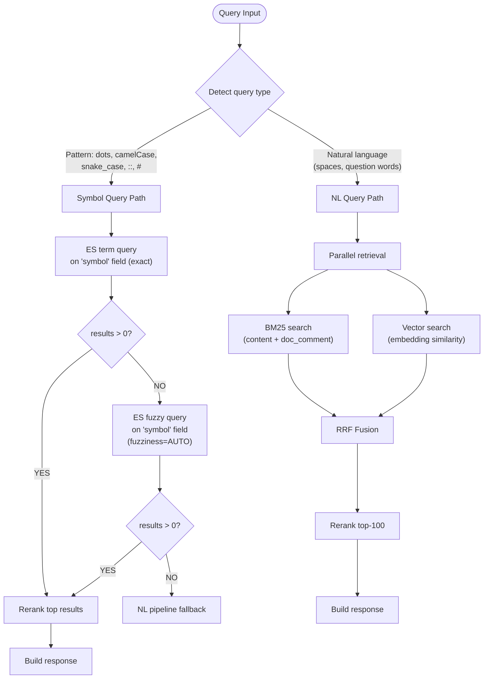
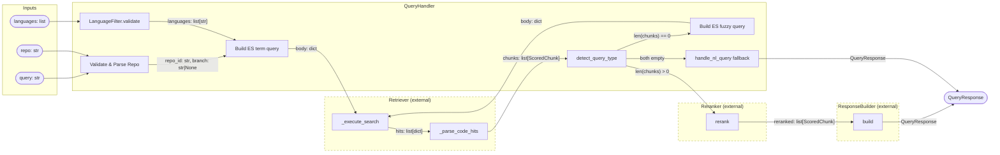
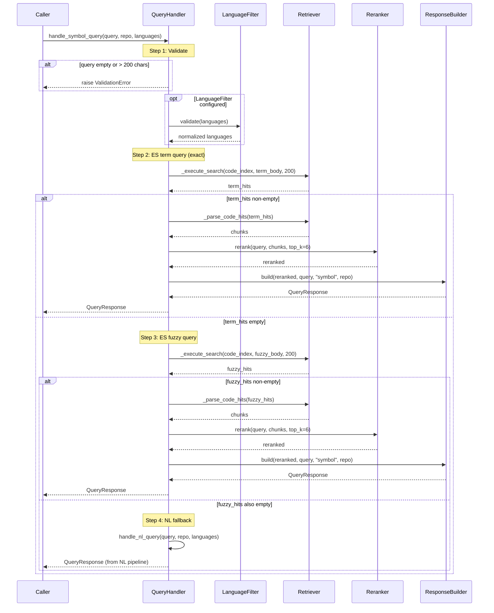
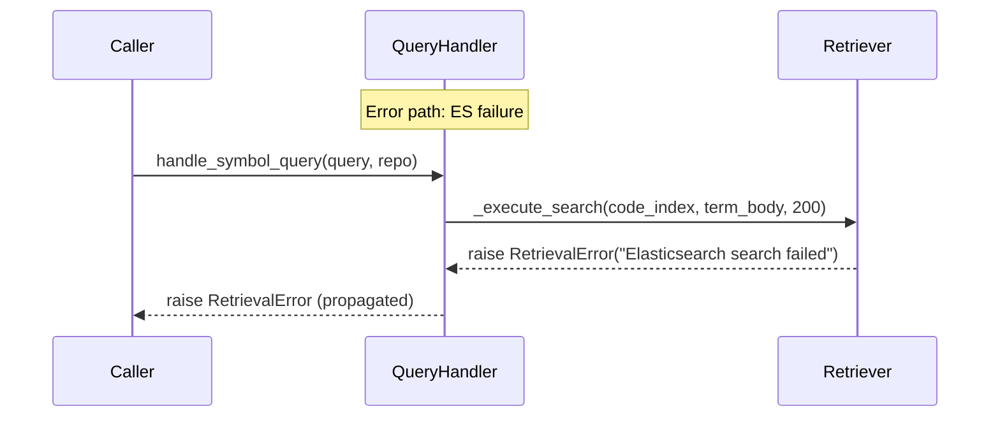
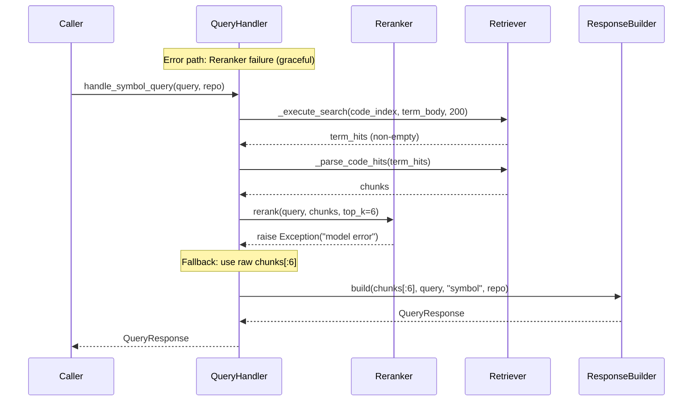
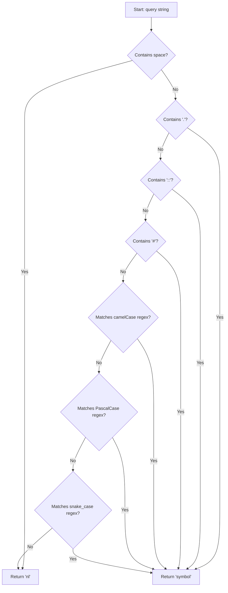
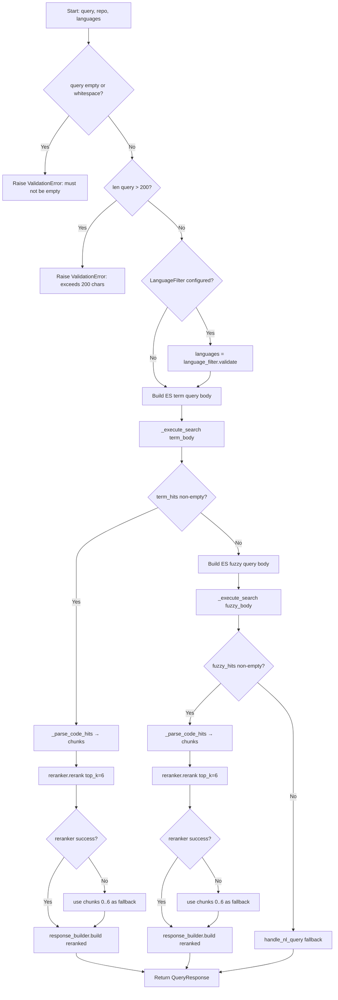

# Feature Detailed Design: Symbol Query Handler (Feature #14)

**Date**: 2026-03-24
**Feature**: #14 — Symbol Query Handler
**Priority**: high
**Dependencies**: #12 (Context Response Builder — passing)
**Design Reference**: docs/plans/2026-03-21-code-context-retrieval-design.md § 4.2.4
**SRS Reference**: FR-012

## Context

The Symbol Query Handler detects whether a query string is a code symbol (vs natural language) and routes symbol queries through an optimized ES term exact-match, fuzzy fallback, and NL pipeline fallback chain. This delivers high-precision results for developers searching by exact symbol names like `UserService.getById`, `std::vector`, or `Array#map`, and supports repo-scoped and branch-scoped queries with the `owner/repo@branch` format.

## Design Alignment

### From §4.2.4 — Query Routing: Symbol vs Natural Language

The `QueryHandler` auto-detects query type and routes to different retrieval paths:



**Symbol detection heuristic**:
- Contains `.` (e.g., `UserService.getById`) → symbol
- Contains `::` (e.g., `std::vector`) → symbol
- Contains `#` (e.g., `Array#map`) → symbol
- Matches `camelCase` or `PascalCase` pattern with no spaces → symbol
- Matches `snake_case` pattern with no spaces → symbol
- Otherwise → natural language

**Symbol query ES behavior**:
1. First: `term` query on `symbol.raw` field (exact match, case-sensitive)
2. If 0 results: `fuzzy` query on `symbol` field with `fuzziness=AUTO` (handles typos)
3. If still 0 results: fall back to full NL pipeline with the query as-is

- **Key classes**: `QueryHandler` (methods: `detect_query_type`, `handle_symbol_query`, `_parse_repo`), `Retriever` (methods: `_execute_search`, `_parse_code_hits`), `Reranker`, `ResponseBuilder`, `LanguageFilter`
- **Interaction flow**: `handle_symbol_query` → validate → parse repo → language filter → ES term query via `Retriever._execute_search` → if 0 hits → ES fuzzy query → if 0 hits → `handle_nl_query` fallback → rerank → `ResponseBuilder.build`
- **Third-party deps**: `elasticsearch` (ES client), `pydantic` (response models)
- **Deviations**: None — implementation matches §4.2.4 exactly, with the Wave 5 addition of branch parameter parsing via `_parse_repo`.

## SRS Requirement

### FR-012: Symbol Query Handler

<!-- Wave 5: Modified 2026-03-24 — repo is now required; branch parameter forwarded to retriever -->

**Priority**: Must
**EARS**: When a user submits a symbol query with a mandatory repository identifier, the system shall prioritize BM25 keyword retrieval for exact symbol matching within that repository and optional branch, and return results containing the specified symbol.
**Acceptance Criteria**:
- Given the symbol query "std::vector" with a repo parameter, when the symbol handler processes it, then the top results shall contain the std::vector class definition from that repository.
- Given a symbol that does not exist in the specified repository, when queried, then the system shall return an empty result set with a 200 status.
- Given a symbol query exceeding 200 characters, when submitted, then the system shall return a 400 error.

## Component Data-Flow Diagram



## Interface Contract

| Method | Signature | Preconditions | Postconditions | Raises |
|--------|-----------|---------------|----------------|--------|
| `detect_query_type` | `detect_query_type(self, query: str) -> str` | Given a non-empty query string | Returns `"symbol"` if query contains `.`, `::`, `#`, or matches camelCase/PascalCase/snake_case with no spaces; returns `"nl"` otherwise | None |
| `handle_symbol_query` | `handle_symbol_query(self, query: str, repo: str \| None = None, languages: list[str] \| None = None) -> QueryResponse` | Given a non-empty query with `len(query) <= 200` | Returns a `QueryResponse` with `query_type="symbol"` if term or fuzzy hits found; falls back to NL pipeline result if both return 0 hits; repo in `owner/repo@branch` format has branch parsed and forwarded to retriever | `ValidationError` if query is empty/whitespace or exceeds 200 chars; `RetrievalError` if ES is unreachable and NL fallback also fails |
| `_parse_repo` | `_parse_repo(self, repo: str) -> tuple[str, str \| None]` | Given a non-empty repo string | Returns `(repo_id, branch)` where branch is parsed from `@branch` suffix or `None` | `ValidationError` if repo is empty or whitespace-only |

**Design rationale**:
- 200-char limit on symbol queries prevents abuse and limits ES query size (NL queries allow 500 chars because they need more room for natural language phrasing)
- Spaces as the primary NL indicator: any query with a space is immediately classified as NL, even if it contains dots or other symbol characters, because real symbol identifiers never contain spaces
- Fuzzy fallback uses `fuzziness=AUTO` (ES default: edit distance 0 for 1-2 char terms, 1 for 3-5, 2 for 6+) to handle common typos without producing noisy results
- NL fallback as final step ensures no query ever returns 0 results silently — the full retrieval pipeline gets a chance

## Internal Sequence Diagram







## Algorithm / Core Logic

### detect_query_type

#### Flow Diagram



#### Pseudocode

```
FUNCTION detect_query_type(query: str) -> str
  // Step 1: Space check (highest priority — spaces mean NL)
  IF " " in query THEN return "nl"

  // Step 2: Explicit separator characters
  IF "." in query THEN return "symbol"
  IF "::" in query THEN return "symbol"
  IF "#" in query THEN return "symbol"

  // Step 3: Naming convention regex patterns
  IF _CAMEL_RE matches query THEN return "symbol"   // ^[a-z]+[A-Z]
  IF _PASCAL_RE matches query THEN return "symbol"   // ^[A-Z][a-z]+[A-Z]
  IF _SNAKE_RE matches query THEN return "symbol"    // ^[a-z][a-z0-9]*_[a-z]

  // Step 4: Default
  RETURN "nl"
END
```

#### Boundary Decisions

| Parameter | Min | Max | Empty/Null | At boundary |
|-----------|-----|-----|------------|-------------|
| `query` | 1 char (`"a"`) | unbounded (no length check in detect) | Not called with empty (validated upstream) | Single char `"a"` → "nl"; `"aB"` → "symbol"; `"a.b"` → "symbol"; `"a_b"` → "symbol" |
| space presence | `"a b"` (1 space) | many spaces | no spaces → continue to symbol checks | `"a.b c"` → "nl" (space wins); `"a.b"` → "symbol" |

#### Error Handling

| Condition | Detection | Response | Recovery |
|-----------|-----------|----------|----------|
| Empty query | Not handled here — caller validates before calling | N/A — precondition enforced by `handle_symbol_query` | Caller raises `ValidationError` |

### handle_symbol_query

#### Flow Diagram



#### Pseudocode

```
FUNCTION handle_symbol_query(query: str, repo: str | None, languages: list[str] | None) -> QueryResponse
  // Step 1: Validate input
  IF query is empty or whitespace THEN raise ValidationError("query must not be empty")
  IF len(query) > 200 THEN raise ValidationError("query exceeds 200 character limit")

  // Step 1b: Normalize language filter
  IF language_filter is not None THEN
    languages = language_filter.validate(languages)

  // Step 2: Build ES term query on symbol.raw (exact match)
  term_bool = {"must": [{"term": {"symbol.raw": query}}]}
  filter_clauses = []
  IF repo is not None THEN filter_clauses.append({"term": {"repo_id": repo}})
  IF languages non-empty THEN filter_clauses.append({"terms": {"language": languages}})
  IF filter_clauses THEN term_bool["filter"] = filter_clauses
  term_hits = await retriever._execute_search(code_index, {"query": {"bool": term_bool}}, 200)

  // Step 3: If term hits found → rerank and return
  IF term_hits non-empty THEN
    chunks = retriever._parse_code_hits(term_hits)
    TRY reranked = reranker.rerank(query, chunks, top_k=6)
    CATCH Exception → reranked = chunks[:6]
    RETURN response_builder.build(reranked, query, "symbol", repo)

  // Step 4: Build ES fuzzy query (fuzziness=AUTO)
  fuzzy_bool = {"must": [{"match": {"symbol": {"query": query, "fuzziness": "AUTO"}}}]}
  IF filter_clauses THEN fuzzy_bool["filter"] = filter_clauses
  fuzzy_hits = await retriever._execute_search(code_index, {"query": {"bool": fuzzy_bool}}, 200)

  // Step 5: If fuzzy hits found → rerank and return
  IF fuzzy_hits non-empty THEN
    chunks = retriever._parse_code_hits(fuzzy_hits)
    TRY reranked = reranker.rerank(query, chunks, top_k=6)
    CATCH Exception → reranked = chunks[:6]
    RETURN response_builder.build(reranked, query, "symbol", repo)

  // Step 6: NL fallback
  RETURN await handle_nl_query(query, repo, languages)
END
```

#### Boundary Decisions

| Parameter | Min | Max | Empty/Null | At boundary |
|-----------|-----|-----|------------|-------------|
| `query` | 1 char (valid) | 200 chars (accepted) | empty `""` → ValidationError | 200 chars → accepted; 201 chars → ValidationError |
| `query` (whitespace) | `" "` (single space) | all whitespace | whitespace-only → ValidationError | `"  a  "` is accepted (not purely whitespace) |
| `repo` | `None` (optional) | any string | `None` → no repo filter applied | `"owner/repo"` → repo_id="owner/repo", branch=None |
| `languages` | `None` or `[]` | full set of 6 | `None` → no language filter | `[]` after validation → no filter applied |
| ES term hits | 0 (triggers fuzzy) | 200 (max fetch) | 0 hits → fuzzy path | exactly 1 hit → rerank still called |
| ES fuzzy hits | 0 (triggers NL fallback) | 200 | 0 hits → NL fallback | exactly 1 hit → rerank still called |

#### Error Handling

| Condition | Detection | Response | Recovery |
|-----------|-----------|----------|----------|
| Empty/whitespace query | `not query or not query.strip()` | `ValidationError("query must not be empty")` | Caller catches and returns 400 |
| Query exceeds 200 chars | `len(query) > 200` | `ValidationError("query exceeds 200 character limit")` | Caller catches and returns 400 |
| ES unreachable (term query) | `RetrievalError` from `_execute_search` | Propagated to caller | Caller returns 504 or retries |
| ES unreachable (fuzzy query) | `RetrievalError` from `_execute_search` | Propagated to caller | Caller returns 504 or retries |
| Reranker failure (term path) | `Exception` caught in try/except | Log warning, use raw `chunks[:6]` | Response still returned, no error to caller |
| Reranker failure (fuzzy path) | `Exception` caught in try/except | Log warning, use raw `chunks[:6]` | Response still returned, no error to caller |
| NL fallback failure | `RetrievalError` from `handle_nl_query` | Propagated to caller | Caller returns 504 |

### _parse_repo

Delegates to existing `_parse_repo` implementation — see Feature #13 (NL Query Handler). Logic: split on last `@` to extract `(repo_id, branch)`.

## State Diagram

N/A — stateless feature. Each `handle_symbol_query` call is independent with no object lifecycle.

## Test Inventory

| ID | Category | Traces To | Input / Setup | Expected | Kills Which Bug? |
|----|----------|-----------|---------------|----------|-----------------|
| A1 | happy path | VS-1, FR-012 | `detect_query_type("UserService.getById")` | Returns `"symbol"` | Missing dot check |
| A2 | happy path | VS-2, FR-012 | `handle_symbol_query("std::vector", "repo1")`, ES term returns 3 hits | `QueryResponse` with `query_type="symbol"`, reranker called with `top_k=6` | Wrong query_type in response |
| A3 | happy path | VS-1 | `detect_query_type("std::vector")` | Returns `"symbol"` | Missing `::` check |
| A4 | happy path | VS-1 | `detect_query_type("getUserName")` (camelCase) | Returns `"symbol"` | Missing camelCase regex |
| A5 | happy path | VS-1 | `detect_query_type("UserService")` (PascalCase) | Returns `"symbol"` | Missing PascalCase regex |
| A6 | happy path | VS-1 | `detect_query_type("get_user_name")` (snake_case) | Returns `"symbol"` | Missing snake_case regex |
| A7 | happy path | VS-1 | `detect_query_type("Array#map")` | Returns `"symbol"` | Missing `#` check |
| A8 | happy path | VS-5, FR-012 | `handle_symbol_query("MyClass", "owner/repo@main")`, ES term returns hits | `_execute_search` called with repo_id filter containing `"owner/repo"` (branch not in symbol query filter currently but repo parsed) | Branch not parsed from repo string |
| B1 | error | VS-3, §Interface Contract Raises | `handle_symbol_query("nonExistent", "repo1")`, ES term returns `[]`, fuzzy returns `[]` | Falls back to `handle_nl_query`, returns NL pipeline `QueryResponse` | Missing NL fallback when both ES queries return 0 |
| B2 | error | §Interface Contract Raises | `handle_symbol_query("vectr", "repo1")`, ES term returns `[]`, fuzzy returns 2 hits | `QueryResponse` with `query_type="symbol"` from fuzzy path | Missing fuzzy fallback |
| B3 | error | §Interface Contract Raises | `handle_symbol_query("MyClass", "repo1")`, `_execute_search` raises `RetrievalError` | `RetrievalError` propagated to caller | ES error silently swallowed |
| B4 | error | §Interface Contract Raises | `handle_symbol_query("MyClass", "repo1")`, term hits found, `reranker.rerank` raises `Exception` | Response still returned using raw `chunks[:6]` | Reranker failure crashes handler |
| C1 | boundary | VS-4, §Algorithm boundary table | `handle_symbol_query("a" * 201, "repo1")` | `ValidationError("query exceeds 200 character limit")` | Off-by-one on 200-char limit |
| C2 | boundary | §Algorithm boundary table | `handle_symbol_query("", "repo1")` | `ValidationError("query must not be empty")` | Empty string accepted |
| C3 | boundary | §Algorithm boundary table | `handle_symbol_query("   ", "repo1")` | `ValidationError("query must not be empty")` | Whitespace-only accepted |
| C4 | boundary | §Algorithm boundary table | `handle_symbol_query("a" * 200, "repo1")`, ES returns hits | No ValidationError raised, normal flow | Off-by-one: 200 rejected |
| C5 | boundary | §Algorithm boundary table | `detect_query_type("a.b")` (minimal dot) | Returns `"symbol"` | Minimum-length dot pattern rejected |
| C6 | boundary | §Algorithm boundary table | `detect_query_type("aB")` (minimal camelCase) | Returns `"symbol"` | Minimum-length camelCase rejected |
| C7 | boundary | §Algorithm boundary table | `detect_query_type("a_b")` (minimal snake_case) | Returns `"symbol"` | Minimum-length snake_case rejected |
| C8 | boundary | §Algorithm boundary table | `detect_query_type("hello")` (plain word, no pattern) | Returns `"nl"` | Single word misclassified as symbol |
| C9 | boundary | §Algorithm boundary table | `detect_query_type("CONSTANT")` (all caps, no underscore) | Returns `"nl"` | All-caps misclassified as symbol |
| C10 | boundary | §Algorithm boundary table | `detect_query_type("call user.save with retry")` (spaces + dot) | Returns `"nl"` | Space check not prioritized over dot check |

**Negative test ratio**: 12 negative (B1-B4 error + C1-C3 boundary + C5-C10 boundary edge) / 22 total = 54.5% (>= 40% threshold met)

## Tasks

### Task 1: Write failing tests
**Files**: `tests/test_symbol_query_handler.py`
**Steps**:
1. Create test file with imports for `QueryHandler`, `ValidationError`, `RetrievalError`, `QueryResponse`, `ScoredChunk`
2. Write test code for each row in Test Inventory:
   - Tests A1-A7: Parametrized `test_detect_query_type` — each symbol pattern returns `"symbol"`
   - Test A8: `test_branch_parsed_from_repo` — verify `owner/repo@main` is handled
   - Tests B1-B4: `TestHandleSymbolQuery` — mock `_execute_search`, verify fallback chain and error propagation
   - Tests C1-C4: `TestSymbolQueryValidation` — boundary validation tests
   - Tests C5-C10: Parametrized `test_detect_query_type` boundary cases
3. Run: `python -m pytest tests/test_symbol_query_handler.py -x`
4. **Expected**: All tests FAIL for the right reason (methods not yet returning expected values for new tests, or existing implementation already passes — mark those as baseline)

### Task 2: Implement minimal code
**Files**: `src/query/query_handler.py`
**Steps**:
1. `detect_query_type` — already implemented with space check → separator checks → regex pattern checks (per Algorithm §5 pseudocode)
2. `handle_symbol_query` — already implemented with validation → ES term → fuzzy fallback → NL fallback (per Algorithm §5 pseudocode)
3. `_parse_repo` — already implemented with `@` split logic
4. Verify all paths match the pseudocode, particularly:
   - 200-char limit (not 500 as in NL)
   - Reranker try/catch with `chunks[:6]` fallback
   - Filter clauses include repo and language
5. Run: `python -m pytest tests/test_symbol_query_handler.py -x`
6. **Expected**: All tests PASS

### Task 3: Coverage Gate
1. Run: `python -m pytest tests/test_symbol_query_handler.py --cov=src/query/query_handler --cov-report=term-missing --cov-branch`
2. Check thresholds: line >= 90%, branch >= 80%. If below: return to Task 1.
3. Record coverage output as evidence.

### Task 4: Refactor
1. Review `handle_symbol_query` for DRY — the term and fuzzy paths share identical rerank-and-build logic; extract `_rerank_and_build(query, chunks, repo)` helper if not already done
2. Run full test suite: `python -m pytest tests/ -x`. All tests PASS.

### Task 5: Mutation Gate
1. Run: `python -m pytest tests/test_symbol_query_handler.py --timeout=60 && mutmut run --paths-to-mutate=src/query/query_handler.py --tests-dir=tests/test_symbol_query_handler.py`
2. Check threshold: mutation score >= 80%. If below: improve assertions.
3. Record mutation output as evidence.

### Task 6: Create example
1. Create `examples/14-symbol-query.py` demonstrating:
   - Constructing a `QueryHandler` with mock dependencies
   - Calling `detect_query_type` with various patterns
   - Calling `handle_symbol_query` with a symbol and repo
2. Update `examples/README.md` with entry for example 14
3. Run example to verify: `python examples/14-symbol-query.py`

## Verification Checklist
- [x] All verification_steps traced to Interface Contract postconditions
  - VS-1 (detect_query_type classifies dot notation) → `detect_query_type` postcondition
  - VS-2 (handle_symbol_query ES term on symbol.raw) → `handle_symbol_query` postcondition
  - VS-3 (non-existent symbol falls back to NL) → `handle_symbol_query` postcondition (NL fallback)
  - VS-4 (exceeding 200 chars raises ValidationError) → `handle_symbol_query` Raises
  - VS-5 (owner/repo@branch parsed) → `_parse_repo` postcondition
- [x] All verification_steps traced to Test Inventory rows
  - VS-1 → A1, A3-A7
  - VS-2 → A2
  - VS-3 → B1
  - VS-4 → C1
  - VS-5 → A8
- [x] Algorithm pseudocode covers all non-trivial methods (`detect_query_type`, `handle_symbol_query`)
- [x] Boundary table covers all algorithm parameters
- [x] Error handling table covers all Raises entries (ValidationError x2, RetrievalError, reranker Exception)
- [x] Test Inventory negative ratio >= 40% (54.5%)
- [x] Every skipped section has explicit "N/A — [reason]" (State Diagram: stateless feature)
