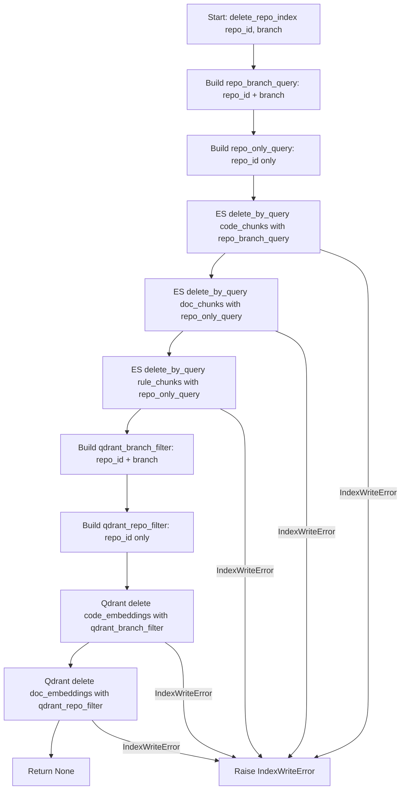

# Feature Detailed Design: Fix delete_repo_index Branch Filter (Feature #48)

**Date**: 2026-03-25
**Feature**: #48 — Fix delete_repo_index branch filter on doc/rule indices
**Priority**: high
**Dependencies**: [#7 Embedding Generation]
**Design Reference**: docs/plans/2026-03-21-code-context-retrieval-design.md § 4.9.7
**SRS Reference**: FR-020

## Context

`IndexWriter.delete_repo_index()` applies a `repo_id + branch` filter to all ES indices and Qdrant collections. However, `doc_chunks`, `rule_chunks` (ES), and `doc_embeddings` (Qdrant) documents do not contain a `branch` field — they are written with `repo_id` only. This means the delete query silently matches zero documents for those indices, leaving stale doc/rule data behind after reindex or repo deletion.

## Root Cause

In `src/indexing/index_writer.py`, the `delete_repo_index` method (lines 179-210) builds a single query filtering by both `repo_id` and `branch`, then applies it uniformly to all three ES indices (`code_chunks`, `doc_chunks`, `rule_chunks`) and both Qdrant collections (`code_embeddings`, `doc_embeddings`). The write methods reveal the mismatch:

- `write_code_chunks` writes a `branch` field to both ES `code_chunks` and Qdrant `code_embeddings` payloads.
- `write_doc_chunks` writes **no** `branch` field to ES `doc_chunks` or Qdrant `doc_embeddings` payloads.
- `write_rule_chunks` writes **no** `branch` field to ES `rule_chunks`.

When `delete_by_query` runs on `doc_chunks` / `rule_chunks` with `{"term": {"branch": "main"}}`, ES finds no documents with that field, so deletes zero. Same for Qdrant `doc_embeddings` with a `branch` filter condition.

## Design Alignment

### System Design (§ 4.9.7)

> **Problem**: `doc_chunks` and `rule_chunks` ES documents have no `branch` field (not written by `write_doc_chunks` / `write_rule_chunks`). Similarly `doc_embeddings` Qdrant collection has no `branch` payload. But `delete_repo_index` filters all indices by `repo_id + branch` -> doc/rule data never gets deleted.
>
> **Fix**: Split delete queries:
> - `code_chunks` + `code_embeddings` -> filter by `repo_id + branch` (has branch field)
> - `doc_chunks` + `rule_chunks` + `doc_embeddings` -> filter by `repo_id` only (no branch field)

- **Key classes**: `IndexWriter` (single class modification)
- **Interaction flow**: `delete_repo_index` issues separate ES `delete_by_query` and Qdrant `delete` calls with index-appropriate filters
- **Third-party deps**: `elasticsearch` (async client), `qdrant-client` (async client) — existing, no version change
- **Deviations**: None

## SRS Requirement

### FR-020: Manual Reindex Trigger

**Priority**: Must
**EARS**: When an administrator sends a reindex request for a specific repository, the system shall queue an immediate re-indexing job for that repository.
**Acceptance Criteria**:
- Given a POST request to `/api/v1/repos/{repo_id}/reindex` with valid admin credentials, when processed, then the system shall queue an indexing job and return the job ID with status "queued".
- Given a reindex request for a non-existent repository, then the system shall return 404.

*Note*: This bugfix is traced to FR-020 because `delete_repo_index` is called during the reindex workflow to clear stale data before re-indexing. If doc/rule data is not deleted, reindex accumulates duplicate entries.

## Component Data-Flow Diagram

N/A — single-class feature with a single method fix. The change modifies the internal query construction within `IndexWriter.delete_repo_index()`. See Interface Contract below.

## Interface Contract

| Method | Signature | Preconditions | Postconditions | Raises |
|--------|-----------|---------------|----------------|--------|
| `delete_repo_index` | `delete_repo_index(self, repo_id: str, branch: str) -> None` | Given a valid `repo_id` string and `branch` string identifying an indexed repository branch | 1. ES `code_chunks` documents matching `repo_id + branch` are deleted. 2. ES `doc_chunks` documents matching `repo_id` only are deleted (no branch filter). 3. ES `rule_chunks` documents matching `repo_id` only are deleted (no branch filter). 4. Qdrant `code_embeddings` points matching `repo_id + branch` are deleted. 5. Qdrant `doc_embeddings` points matching `repo_id` only are deleted (no branch filter). | `IndexWriteError` — if any ES or Qdrant delete fails after 3 retries |

**Design rationale**:
- The method signature is unchanged (`repo_id` + `branch`) because `code_chunks` / `code_embeddings` still require the branch filter. The `branch` parameter is simply not applied to doc/rule indices.
- No new public methods are introduced; the fix is entirely internal to `delete_repo_index`.

## Internal Sequence Diagram

N/A — single-class implementation. The method calls `_retry_write` in a loop for each index/collection. Error paths are documented in the Algorithm error handling table below.

## Algorithm / Core Logic

### delete_repo_index

#### Flow Diagram



#### Pseudocode

```
FUNCTION delete_repo_index(self, repo_id: str, branch: str) -> None
  // Step 1: Build two ES queries
  repo_branch_query = {"query": {"bool": {"must": [
      {"term": {"repo_id": repo_id}},
      {"term": {"branch": branch}},
  ]}}}
  repo_only_query = {"query": {"bool": {"must": [
      {"term": {"repo_id": repo_id}},
  ]}}}

  // Step 2: ES deletes — code_chunks uses branch filter, doc/rule use repo-only
  _retry_write(ES.delete_by_query(index="code_chunks", body=repo_branch_query))
  _retry_write(ES.delete_by_query(index="doc_chunks", body=repo_only_query))
  _retry_write(ES.delete_by_query(index="rule_chunks", body=repo_only_query))

  // Step 3: Qdrant deletes — code_embeddings uses branch filter, doc_embeddings uses repo-only
  qdrant_branch_filter = Filter(must=[
      FieldCondition(key="repo_id", match=MatchValue(value=repo_id)),
      FieldCondition(key="branch", match=MatchValue(value=branch)),
  ])
  qdrant_repo_filter = Filter(must=[
      FieldCondition(key="repo_id", match=MatchValue(value=repo_id)),
  ])
  _retry_write(Qdrant.delete(collection="code_embeddings", filter=qdrant_branch_filter))
  _retry_write(Qdrant.delete(collection="doc_embeddings", filter=qdrant_repo_filter))

  RETURN None
END
```

#### Boundary Decisions

| Parameter | Min | Max | Empty/Null | At boundary |
|-----------|-----|-----|------------|-------------|
| `repo_id` | 1-char string | Unbounded (UUID format) | Empty string — query runs, matches nothing, no error | Single-char — valid, filters normally |
| `branch` | 1-char string | Unbounded | Empty string — query runs, matches nothing for code indices, no error | Single-char — valid, filters normally |

#### Error Handling

| Condition | Detection | Response | Recovery |
|-----------|-----------|----------|----------|
| ES `delete_by_query` fails (any index) | Exception from ES client after 3 retries in `_retry_write` | Raise `IndexWriteError` with message identifying which index failed | Caller retries entire `delete_repo_index` or logs and proceeds |
| Qdrant `delete` fails (any collection) | Exception from Qdrant client after 3 retries in `_retry_write` | Raise `IndexWriteError` with message identifying which collection failed | Caller retries entire `delete_repo_index` or logs and proceeds |
| No documents match filter | ES returns `{"deleted": 0}`, Qdrant returns success | No error — silent no-op is correct behavior | None needed |

## State Diagram

N/A — stateless feature. `delete_repo_index` is a fire-and-forget operation with no lifecycle states.

## Test Inventory

| ID | Category | Traces To | Input / Setup | Expected | Kills Which Bug? |
|----|----------|-----------|---------------|----------|-----------------|
| T1 | happy path | VS-1, FR-020, §Interface Contract PC-2,3 | Repo "repo-1" with doc_chunks and rule_chunks indexed (no branch field in docs). Call `delete_repo_index("repo-1", "main")`. | ES `delete_by_query` called on `doc_chunks` with `repo_id`-only query (no `branch` term). ES `delete_by_query` called on `rule_chunks` with `repo_id`-only query. | Original bug: doc/rule indices filtered by branch, matching nothing |
| T2 | happy path | VS-2, FR-020, §Interface Contract PC-1,4 | Repo "repo-1" with code_chunks and code_embeddings indexed (with branch field). Call `delete_repo_index("repo-1", "main")`. | ES `delete_by_query` on `code_chunks` uses `repo_id + branch` filter. Qdrant `delete` on `code_embeddings` uses `repo_id + branch` filter. | Regression: accidentally removing branch filter from code indices too |
| T3 | happy path | VS-3, FR-020, §Interface Contract PC-5 | Repo "repo-1" with doc_embeddings indexed (no branch payload). Call `delete_repo_index("repo-1", "main")`. | Qdrant `delete` on `doc_embeddings` uses `repo_id`-only filter (no `branch` condition). | Original bug: doc_embeddings filtered by branch, matching nothing |
| T4 | happy path | FR-020, §Interface Contract PC-1-5 | Repo "repo-1" with all 5 indices populated. Call `delete_repo_index("repo-1", "main")`. | All 5 delete operations executed: 3 ES + 2 Qdrant, each with correct filter. | Missing any delete call entirely |
| T5 | error | §Interface Contract Raises, §Algorithm Error Handling row 1 | ES `delete_by_query` raises ConnectionError on all retries for `doc_chunks`. | `IndexWriteError` raised with message mentioning `doc_chunks`. | Missing error propagation from repo-only query path |
| T6 | error | §Interface Contract Raises, §Algorithm Error Handling row 2 | Qdrant `delete` raises ConnectionError on all retries for `doc_embeddings`. | `IndexWriteError` raised with message mentioning `doc_embeddings`. | Missing error propagation from repo-only Qdrant path |
| T7 | boundary | §Algorithm Boundary table, row 1 | `repo_id=""`, `branch="main"`. No documents exist. | All 5 delete operations execute without error. ES/Qdrant return 0 deleted. No exception. | Crash on empty repo_id |
| T8 | boundary | §Algorithm Boundary table | `repo_id="repo-1"`, `branch="main"`. No documents exist in any index. | All 5 delete operations execute, 0 documents deleted. No exception raised. | Crash or error when no documents match |
| T9 | error | §Algorithm Error Handling row 1 | ES `delete_by_query` fails on `code_chunks` (first call). | `IndexWriteError` raised. Subsequent indices NOT attempted (fail-fast from `_retry_write`). | Silent swallowing of errors on branch-filtered path |
| T10 | negative | §Interface Contract PC-2 | Verify `doc_chunks` query body does NOT contain `{"term": {"branch": ...}}`. | Query body `must` list has exactly 1 element: `{"term": {"repo_id": ...}}`. | Partial fix that still includes branch in doc query |

**Negative test ratio**: 5 negative/error/boundary tests (T5, T6, T7, T8, T9, T10) out of 10 total = **60%** >= 40% threshold.

### Design Interface Coverage Gate

Functions in § 4.9.7:
- `delete_repo_index` — covered by T1-T10
- `_retry_write` (internal, delegated) — covered by T5, T6, T9 (error paths exercise retry)

All design-specified functions have test coverage. Negative ratio remains 60%.

## Tasks

### Task 1: Write failing tests
**Files**: `tests/test_index_writer.py`
**Steps**:
1. Add test functions for T1-T10 from Test Inventory to existing `tests/test_index_writer.py`
2. T1: Call `delete_repo_index("repo-1", "main")`, assert `doc_chunks` and `rule_chunks` `delete_by_query` calls use query with only `repo_id` term (no `branch`)
3. T2: Assert `code_chunks` `delete_by_query` call uses query with both `repo_id` and `branch` terms
4. T3: Assert Qdrant `delete` on `doc_embeddings` uses filter with only `repo_id` (no `branch` FieldCondition)
5. T4: Assert all 5 delete operations are called (3 ES + 2 Qdrant)
6. T5: Mock ES `delete_by_query` to fail on `doc_chunks`, assert `IndexWriteError`
7. T6: Mock Qdrant `delete` to fail on `doc_embeddings`, assert `IndexWriteError`
8. T7: Call with `repo_id=""`, assert no exception
9. T8: Call with valid IDs but mocks return 0 deleted, assert no exception
10. T9: Mock ES `delete_by_query` to fail on first call (`code_chunks`), assert `IndexWriteError`
11. T10: Inspect the actual query body passed to `doc_chunks` `delete_by_query`, assert no `branch` term
12. Run: `python -m pytest tests/test_index_writer.py -x -v`
13. **Expected**: New tests FAIL (T1, T2, T3, T10 fail because current code uses branch filter everywhere; T4-T9 may pass with existing code)

### Task 2: Implement minimal code
**Files**: `src/indexing/index_writer.py`
**Steps**:
1. In `delete_repo_index`, replace the single `query` variable with two queries per Algorithm pseudocode:
   - `repo_branch_query` with `repo_id + branch` filter
   - `repo_only_query` with `repo_id` only filter
2. Change the ES loop: `code_chunks` uses `repo_branch_query`; `doc_chunks` and `rule_chunks` use `repo_only_query`
3. Split the Qdrant loop: `code_embeddings` uses filter with `repo_id + branch`; `doc_embeddings` uses filter with `repo_id` only
4. Run: `python -m pytest tests/test_index_writer.py -x -v`
5. **Expected**: All tests PASS

### Task 3: Coverage Gate
1. Run: `python -m pytest tests/test_index_writer.py --cov=src/indexing/index_writer --cov-report=term-missing --cov-branch -x`
2. Check thresholds: line >= 90%, branch >= 80%. If below: return to Task 1.
3. Record coverage output as evidence.

### Task 4: Refactor
1. Review: ensure no duplication between the two query constructions. Consider extracting a `_build_es_query` helper if warranted (likely not needed for 2 queries).
2. Run: `python -m pytest tests/test_index_writer.py -x -v` — all tests PASS.

### Task 5: Mutation Gate
1. Run: `python -m pytest tests/test_index_writer.py -x -v && mutmut run --paths-to-mutate=src/indexing/index_writer.py --tests-dir=tests/ --runner="python -m pytest tests/test_index_writer.py -x -q"`
2. Check threshold: mutation score >= 80%. If below: improve assertions in Task 1.
3. Record mutation output as evidence.

### Task 6: Create example
1. N/A — this is an internal bugfix with no user-facing API change. No example script warranted.

## Verification Checklist
- [x] All verification_steps traced to Interface Contract postconditions (VS-1 -> PC-2,3; VS-2 -> PC-1,4; VS-3 -> PC-5)
- [x] All verification_steps traced to Test Inventory rows (VS-1 -> T1; VS-2 -> T2; VS-3 -> T3)
- [x] Algorithm pseudocode covers all non-trivial methods (delete_repo_index)
- [x] Boundary table covers all algorithm parameters (repo_id, branch)
- [x] Error handling table covers all Raises entries (IndexWriteError from ES and Qdrant)
- [x] Test Inventory negative ratio >= 40% (60%)
- [x] Every skipped section has explicit "N/A — [reason]"
- [x] All functions/methods named in § 4.9.7 have at least one Test Inventory row
