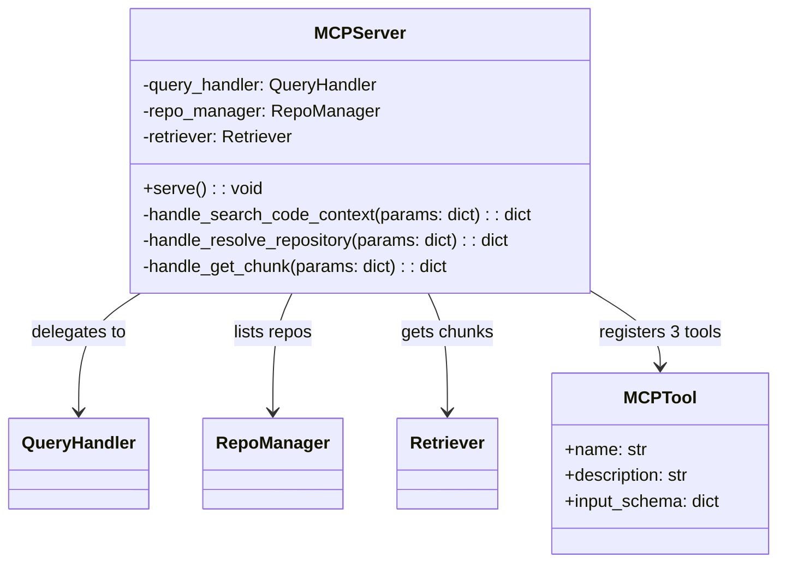
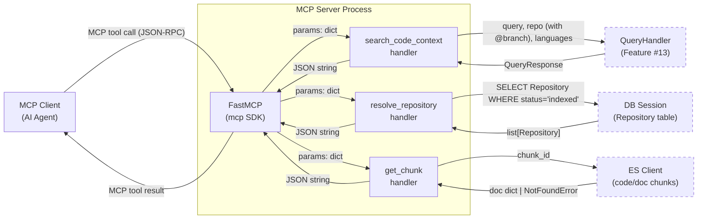
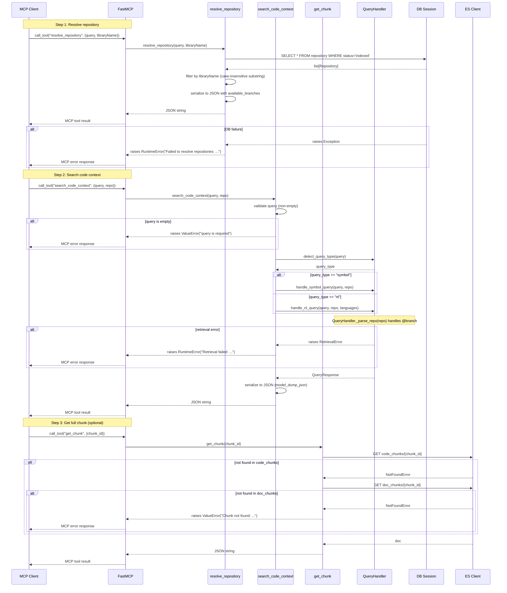
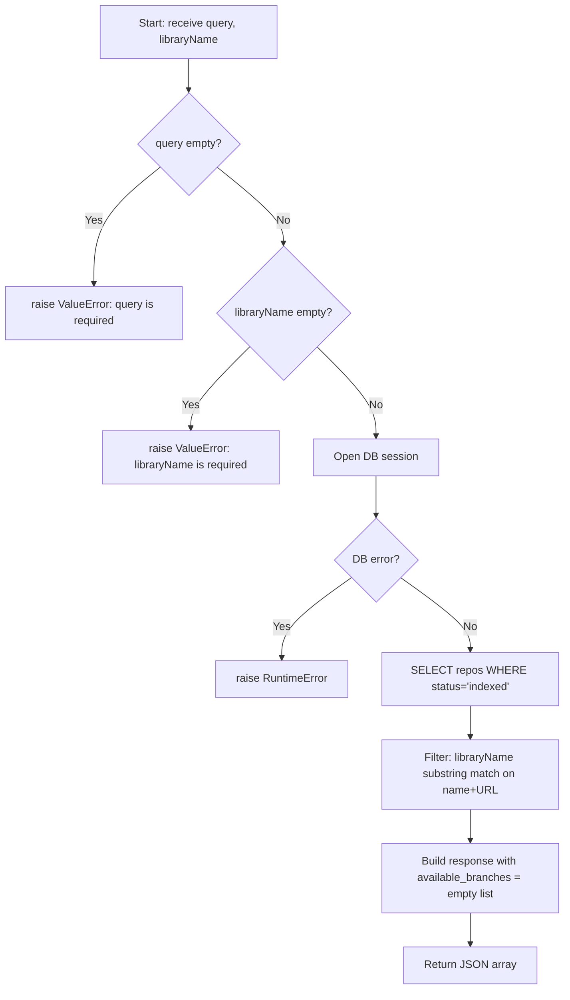
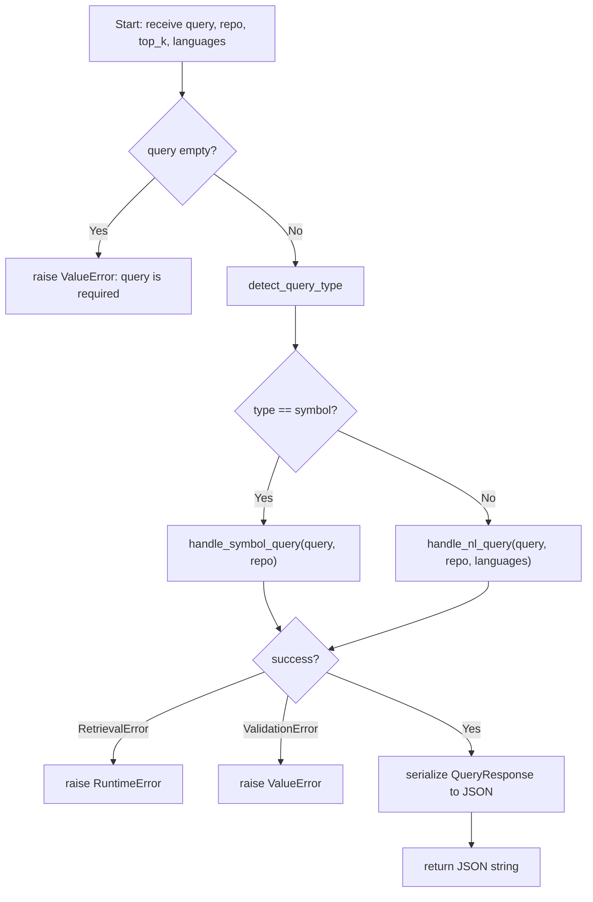

# Feature Detailed Design: MCP Server — Wave 5 Update (Feature #18)

**Date**: 2026-03-25
**Feature**: #18 — MCP Server
**Priority**: high
**Dependencies**: #13 (Query Handler)
**Design Reference**: docs/plans/2026-03-21-code-context-retrieval-design.md § 4.3
**SRS Reference**: FR-016

## Context

The MCP Server is a standalone process that exposes the code context retrieval system to AI agents via the Model Context Protocol. This is a **Wave 5 update** to the existing MCP server. The server currently registers three tools (`search_code_context`, `list_repositories`, `get_chunk`). Wave 5 changes align the MCP interface with the Context7-style two-step flow: (1) replace `list_repositories` with `resolve_repository(query, libraryName)` that filters to indexed repos only, (2) make `repo` required in `search_code_context`, (3) support `@branch` parsing via `QueryHandler._parse_repo`, (4) remove the `max_tokens` parameter.

## Design Alignment

### From §4.3 — Class Diagram (Wave 5)



### From §4.3.4 — Tool Definitions (Wave 5)

| Tool | Parameters | Description |
|------|-----------|-------------|
| `resolve_repository` | `query` (**required** — user intent for relevance ranking), `libraryName` (**required** — repo name to search) | Resolve a repository name to an exact repo ID with branch info. Returns only `status=indexed` repos. Each result includes: `id` (owner/repo), `name`, `url`, `indexed_branch`, `default_branch`, `available_branches`, `last_indexed_at`. Matching: case-insensitive substring on name+URL, ranked by query relevance. **Must be called before `search_code_context`** unless user provides exact `owner/repo` format. |
| `search_code_context` | `query` (**required**), `repo` (**required** — `"owner/repo"` or `"owner/repo@branch"`), `top_k` (optional, default 3), `languages` (optional) | Search code + documentation context scoped to a specific repository and optional branch. `@branch` suffix parsed and forwarded as branch filter to Retriever. Returns dual-list response (codeResults + docResults + rules). |
| `get_chunk` | `chunk_id` (**required**) | Get full content of a specific chunk by ID. Bypasses truncation limit. |

### From §4.3.5 — Repo Reference Parsing

Shared utility function `_parse_repo` (already on QueryHandler) used by both MCP and REST:

```python
def _parse_repo(self, repo: str) -> tuple[str, str | None]:
    """Parse 'owner/repo' or 'owner/repo@branch' -> (repo_name, branch)."""
    if "@" in repo:
        idx = repo.rfind("@")
        repo_id = repo[:idx]
        branch = repo[idx + 1:] or None
        return (repo_id, branch)
    return (repo, None)
```

- MCP `search_code_context` passes `repo` string directly to `QueryHandler.handle_nl_query` / `handle_symbol_query`
- QueryHandler internally calls `_parse_repo` to split repo and branch
- No parsing needed in MCP layer — QueryHandler handles it

### From §4.3.6 — Design Notes

- Uses the `mcp` Python SDK (`FastMCP`) to register three tools.
- Runs as a separate process (stdio transport for local, SSE for remote).
- Shares the same `QueryHandler` and `RepoManager` code but instantiates its own ES/Qdrant/Redis connections.
- MCP response wraps the same JSON structure as REST API's `content` field of the MCP tool result.
- `resolve_repository` queries the Repository table directly (no ES/Qdrant needed); `available_branches` from `GitCloner.list_remote_branches()` if clone exists.

- **Key classes**: `MCPServer` (existing — modify tool registrations in `create_mcp_server`)
- **Interaction flow**: MCP client -> FastMCP -> handler function -> QueryHandler/Session/ES -> response
- **Third-party deps**: `mcp` SDK 1.9.0 (already installed)
- **Deviations**: None. Using FastMCP decorator-based tool registration as in pre-Wave 5 implementation.

## SRS Requirement

### FR-016: MCP Server (Wave 5)

**Priority**: Must
**EARS**: The system shall implement an MCP server that exposes `resolve_repository`, `search_code_context`, and `get_chunk` tools, allowing AI agents to discover repositories and query code context via the Model Context Protocol using a two-step flow (resolve -> search).
**Acceptance Criteria**:
- Given an MCP client calling `resolve_repository` with `{query: "JSON parsing", libraryName: "gson"}`, when the tool executes, then the system shall return a list of matching indexed repositories with `id`, `name`, `url`, `indexed_branch`, `default_branch`, and `available_branches`.
- Given `resolve_repository` called with a name that matches no indexed repository, when executed, then the system shall return an empty list.
- Given an MCP client calling `search_code_context` with `{query: "spring webclient timeout", repo: "spring-framework"}` (repo **required**), when the tool executes, then the system shall return structured context results scoped to that repository.
- Given `search_code_context` called with `repo: "spring-framework@main"`, when executed, then the system shall parse the `@main` branch suffix and filter retrieval results by the `branch` field.
- Given `search_code_context` called **without** the `repo` parameter, then the system shall raise a TypeError (missing required argument).
- Given an MCP tool call with invalid parameters (missing required `query` field), then the system shall return an MCP error response with a descriptive message.
- Given an internal retrieval failure during MCP tool execution, then the system shall return an MCP error response rather than crashing the MCP connection.

## Component Data-Flow Diagram



## Interface Contract

| Method | Signature | Preconditions | Postconditions | Raises |
|--------|-----------|---------------|----------------|--------|
| `create_mcp_server` | `create_mcp_server(query_handler: QueryHandler, session_factory, es_client) -> FastMCP` | QueryHandler is initialized; session_factory and es_client are valid | Returns configured FastMCP with 3 tools registered: `resolve_repository`, `search_code_context`, `get_chunk` | None |
| `resolve_repository` | `resolve_repository(query: str, libraryName: str) -> str` | Both `query` and `libraryName` are non-empty strings | Returns JSON array of matching repos filtered to `status="indexed"` only; each object has `id`, `name`, `url`, `indexed_branch`, `default_branch`, `available_branches`, `last_indexed_at`; matching is case-insensitive substring on name+URL | RuntimeError on DB failure |
| `search_code_context` | `search_code_context(query: str, repo: str, top_k: int = 3, languages: list[str] \| None = None) -> str` | `query` is non-empty; `repo` is required (no default) | Returns JSON string with `query`, `query_type`, `code_results`, `doc_results` keys; `repo` passed directly to QueryHandler which parses `@branch` internally | ValueError on empty query; RuntimeError on retrieval failure; ValueError on validation error |
| `get_chunk` | `get_chunk(chunk_id: str) -> str` | `chunk_id` is non-empty string | Returns JSON with full chunk content (no truncation) | ValueError if chunk_id empty; ValueError if chunk not found; RuntimeError on ES failure |

**Verification step traceability**:
- VS-1 (resolve_repository returns indexed repos with branches) -> `resolve_repository` postconditions
- VS-2 (search_code_context with repo required returns scoped results) -> `search_code_context` postconditions
- VS-3 (search_code_context with @branch parses and filters) -> `search_code_context` postconditions (repo passed to QueryHandler which calls `_parse_repo`)
- VS-4 (search_code_context without repo raises TypeError) -> `search_code_context` signature (repo has no default)
- VS-5 (get_chunk returns full content) -> `get_chunk` postconditions
- VS-6 (MCP error on invalid params) -> `search_code_context` Raises, `resolve_repository` Raises
- VS-7 (MCP error on internal failure) -> `search_code_context` Raises (RuntimeError), `resolve_repository` Raises (RuntimeError)

**Design rationale**:
- `repo` is now required (no default) in `search_code_context` — callers must first use `resolve_repository` to discover the repo identifier, matching Context7 two-step flow
- `max_tokens` removed — response truncation is handled by the QueryHandler/ResponseBuilder layer, not the MCP tool
- `@branch` parsing is delegated to `QueryHandler._parse_repo` — no duplicate parsing logic in MCP layer
- `resolve_repository` uses `libraryName` (camelCase) to match Context7 API convention for agent familiarity
- `available_branches` returns empty list when clone path is not available (graceful degradation)

## Internal Sequence Diagram



## Algorithm / Core Logic

### resolve_repository

#### Flow Diagram



#### Pseudocode

```
FUNCTION resolve_repository(query: str, libraryName: str) -> str
  // Step 1: Validate inputs
  IF query is empty or whitespace THEN raise ValueError("query is required")
  IF libraryName is empty or whitespace THEN raise ValueError("libraryName is required")

  // Step 2: Query DB for indexed repos
  session = session_factory()
  TRY
    result = AWAIT session.execute(
      SELECT Repository WHERE status == 'indexed'
    )
    repos = result.scalars().all()
  CATCH Exception AS e
    raise RuntimeError(f"Failed to resolve repositories: {e}")
  FINALLY
    AWAIT session.close()
  END TRY

  // Step 3: Filter by libraryName (case-insensitive substring on name + URL)
  lib_lower = libraryName.lower()
  filtered = [r for r in repos IF lib_lower IN r.name.lower() OR lib_lower IN r.url.lower()]

  // Step 4: Serialize to JSON array
  result = [{
    "id": r.name,                // owner/repo format
    "name": r.name,
    "url": r.url,
    "indexed_branch": r.indexed_branch,
    "default_branch": r.default_branch,
    "available_branches": [],    // placeholder — GitCloner integration deferred
    "last_indexed_at": r.last_indexed_at.isoformat() if r.last_indexed_at else None
  } for r in filtered]

  RETURN json.dumps(result)
END
```

#### Boundary Decisions

| Parameter | Min | Max | Empty/Null | At boundary |
|-----------|-----|-----|------------|-------------|
| `query` | 1 char | unbounded | raise ValueError("query is required") | single char accepted |
| `libraryName` | 1 char | unbounded | raise ValueError("libraryName is required") | single char accepted |
| filtered results | 0 repos | all repos | returns `[]` (empty JSON array) | 0 match -> empty array |

#### Error Handling

| Condition | Detection | Response | Recovery |
|-----------|-----------|----------|----------|
| Empty query | `not query or not query.strip()` | ValueError("query is required") | MCP SDK converts to error response |
| Empty libraryName | `not libraryName or not libraryName.strip()` | ValueError("libraryName is required") | MCP SDK converts to error response |
| DB failure | Exception from session.execute | RuntimeError("Failed to resolve repositories: ...") | MCP SDK converts to error response, connection stays alive |
| No matching repos | Empty list after filter | Returns `[]` (empty JSON array) | Agent handles empty result |

### search_code_context (Wave 5 changes)

#### Flow Diagram



#### Pseudocode

```
FUNCTION search_code_context(query: str, repo: str, top_k: int = 3, languages: list[str]|None = None) -> str
  // Step 1: Validate input
  IF query is empty or whitespace THEN raise ValueError("query is required")
  // NOTE: repo is required (no default) — TypeError raised by Python if missing
  // NOTE: @branch parsing handled by QueryHandler._parse_repo internally

  // Step 2: Detect query type
  query_type = query_handler.detect_query_type(query)

  // Step 3: Dispatch to handler (pass repo string as-is, including any @branch)
  TRY
    IF query_type == "symbol" THEN
      response = AWAIT query_handler.handle_symbol_query(query, repo)
    ELSE
      response = AWAIT query_handler.handle_nl_query(query, repo, languages)
    END IF
  CATCH RetrievalError AS e
    raise RuntimeError(f"Retrieval failed: {e}")
  CATCH ValidationError AS e
    raise ValueError(str(e))
  END TRY

  // Step 4: Serialize response
  RETURN response.model_dump_json()
END
```

#### Boundary Decisions

| Parameter | Min | Max | Empty/Null | At boundary |
|-----------|-----|-----|------------|-------------|
| `query` | 1 char | unbounded | raise ValueError | single char accepted |
| `repo` | required (no default) | unbounded | TypeError if not provided; ValidationError from QueryHandler if empty string | `"a"` accepted (QueryHandler validates) |
| `top_k` | 1 | unbounded | use default (3) | top_k=1 returns 1 result |
| `languages` | empty list | 6 languages | None -> no filter | empty list -> no filter |

#### Error Handling

| Condition | Detection | Response | Recovery |
|-----------|-----------|----------|----------|
| Empty query | `not query or not query.strip()` | ValueError("query is required") | MCP SDK converts to error response |
| Missing repo | Python function call without required arg | TypeError (raised by Python) | MCP SDK converts to error response |
| Invalid repo | ValidationError from QueryHandler._parse_repo | ValueError with message | MCP SDK converts to error response |
| Retrieval failure | RetrievalError from QueryHandler | RuntimeError("Retrieval failed: ...") | MCP SDK converts to error response |
| DB connection failure | Exception from session | RuntimeError with message | MCP SDK converts to error response |

### get_chunk (unchanged from pre-Wave 5)

Delegates to existing implementation — see pre-Wave 5 design (docs/features/2026-03-22-mcp-server.md). No changes required.

## State Diagram

> N/A — stateless feature. The MCP server is a request-response process with no managed object lifecycle.

## Test Inventory

| ID | Category | Traces To | Input / Setup | Expected | Kills Which Bug? |
|----|----------|-----------|---------------|----------|-----------------|
| A1 | happy path | VS-1, FR-016 AC-1 | `resolve_repository(query="JSON parsing", libraryName="spring")` with mocked session returning 3 repos (2 indexed: spring-framework, spring-boot; 1 pending: react) | JSON array with 2 repos, each having `id`, `name`, `url`, `indexed_branch`, `default_branch`, `available_branches`, `last_indexed_at`; `react` excluded | Missing status=indexed filter |
| A2 | happy path | VS-2, FR-016 AC-3 | `search_code_context(query="spring webclient timeout", repo="spring-framework")` with mocked QueryHandler returning QueryResponse | JSON string with `query`, `query_type`, `code_results`, `doc_results` keys | Missing repo pass-through to QueryHandler |
| A3 | happy path | VS-3, FR-016 AC-4 | `search_code_context(query="spring webclient timeout", repo="spring-framework@main")` with mocked QueryHandler | QueryHandler.handle_nl_query called with `repo="spring-framework@main"` (QueryHandler handles @branch internally) | Stripping @branch before passing to QueryHandler |
| A4 | happy path | VS-2 | `search_code_context(query="MyClass.method", repo="my-org/my-app")` — symbol query detected | QueryHandler.handle_symbol_query called with `repo="my-org/my-app"` | Wrong query type dispatch |
| A5 | happy path | VS-5 | `get_chunk(chunk_id="abc123")` with mocked ES returning chunk doc | JSON with full chunk content | Missing get_chunk implementation |
| A6 | happy path | VS-1, FR-016 AC-2 | `resolve_repository(query="JSON parsing", libraryName="nonexistent")` with no matching repos | Empty JSON array `[]` | Raising error instead of empty list |
| A7 | happy path | VS-1 | `resolve_repository(query="auth", libraryName="SPRING")` — case-insensitive match | Returns 2 matching repos (spring-framework, spring-boot) | Case-sensitive filter excludes valid matches |
| B1 | error | VS-6, FR-016 AC-6 | `search_code_context(query="")` with repo="x" | ValueError raised with "query is required" | Missing input validation |
| B2 | error | VS-7, FR-016 AC-7 | `search_code_context(query="test", repo="x")` with QueryHandler raising RetrievalError | RuntimeError raised with "Retrieval failed" | Unhandled exception crashes connection |
| B3 | error | VS-6 | `get_chunk(chunk_id="")` | ValueError raised with "chunk_id is required" | Missing chunk_id validation |
| B4 | error | VS-6 | `get_chunk(chunk_id="nonexistent")` with ES returning NotFoundError | ValueError raised with "Chunk not found" | Missing not-found check |
| B5 | error | VS-7 | `resolve_repository(query="test", libraryName="x")` with session raising Exception | RuntimeError raised with "Failed to resolve repositories" | Unhandled DB error |
| B6 | error | VS-6 | `search_code_context(query="test", repo="x")` with QueryHandler raising ValidationError | ValueError raised with validation message | Missing ValidationError handling |
| B7 | error | VS-4 | Call `search_code_context(query="test")` without `repo` argument | TypeError raised (missing required argument) | repo accidentally has default None |
| B8 | error | VS-6 | `resolve_repository(query="", libraryName="spring")` | ValueError("query is required") | Missing query validation in resolve_repository |
| B9 | error | VS-6 | `resolve_repository(query="test", libraryName="")` | ValueError("libraryName is required") | Missing libraryName validation in resolve_repository |
| B10 | error | VS-6 | `get_chunk(chunk_id="abc123")` with ES raising ConnectionError | RuntimeError("Failed to retrieve chunk") | Unhandled ES connection failure |
| C1 | boundary | §Algorithm boundary | `search_code_context(query=" ", repo="x")` (whitespace only) | ValueError raised | Whitespace not treated as empty |
| C2 | boundary | §Algorithm boundary | `get_chunk(chunk_id=" ")` (whitespace only) | ValueError raised | Whitespace not treated as empty |
| C3 | boundary | §Algorithm boundary | `resolve_repository(query="x", libraryName=" ")` (whitespace only) | ValueError("libraryName is required") | Whitespace not treated as empty |
| C4 | boundary | §Algorithm boundary | `search_code_context(query="x", repo="x")` (single char) | Accepted, handler called | Off-by-one in length check |
| C5 | boundary | §Interface Contract | Tool registration check: `create_mcp_server` registers exactly 3 tools named `resolve_repository`, `search_code_context`, `get_chunk` (NOT `list_repositories`) | Tool set matches expected names | Old `list_repositories` not removed |
| C6 | boundary | §Algorithm boundary | `resolve_repository(query=" ", libraryName="spring")` (whitespace query) | ValueError("query is required") | Whitespace not treated as empty |

**Negative ratio**: 15/22 = 68% (>= 40% threshold met)

**Design Interface Coverage Gate**:

Functions/methods from §4.3 design:
1. `create_mcp_server` -> C5
2. `resolve_repository` -> A1, A6, A7, B5, B8, B9, C3, C6
3. `search_code_context` -> A2, A3, A4, B1, B2, B6, B7, C1, C4
4. `get_chunk` -> A5, B3, B4, B10, C2
5. `_parse_repo` (in QueryHandler) -> A3 (tested indirectly via repo pass-through)

All 5 design-specified functions have test coverage. 15/22 = 68% negative ratio (verified after additions).

## Tasks

### Task 1: Write failing tests
**Files**: `tests/test_mcp_server.py`
**Steps**:
1. Update imports (no new imports needed beyond existing)
2. Update `mock_session_factory` fixture to add `status` attribute to mock repos and configure the DB query to use a `WHERE status='indexed'` filter for resolve_repository tests
3. Write/update test functions for each row in Test Inventory (§7):
   - **Remove** tests A3-old (search without repo) — repo is now required
   - **Remove** tests referencing `list_repositories` — replaced by `resolve_repository`
   - Test A1: Mock session with 3 repos (2 indexed, 1 pending), call `resolve_repository(query="JSON parsing", libraryName="spring")`, assert JSON array with 2 indexed repos, assert `available_branches` field present
   - Test A2: Call `search_code_context(query="spring webclient timeout", repo="spring-framework")`, assert JSON with correct keys
   - Test A3: Call `search_code_context(query="timeout", repo="spring-framework@main")`, assert QueryHandler called with `repo="spring-framework@main"`
   - Test A4: Mock detect_query_type="symbol", call `search_code_context(query="MyClass.method", repo="my-org/my-app")`, assert handle_symbol_query called
   - Test A5: Mock ES, call `get_chunk(chunk_id="abc123")`, assert full content
   - Test A6: Call `resolve_repository(query="JSON", libraryName="nonexistent")`, assert empty array
   - Test A7: Call `resolve_repository(query="auth", libraryName="SPRING")`, assert case-insensitive 2 results
   - Test B1: `search_code_context(query="", repo="x")` -> ValueError
   - Test B2: QueryHandler raises RetrievalError -> RuntimeError
   - Test B3: `get_chunk(chunk_id="")` -> ValueError
   - Test B4: ES NotFoundError -> ValueError "Chunk not found"
   - Test B5: DB failure in resolve_repository -> RuntimeError
   - Test B6: ValidationError -> ValueError
   - Test B7: `search_code_context(query="test")` without repo -> TypeError
   - Test B8: `resolve_repository(query="", libraryName="spring")` -> ValueError
   - Test B9: `resolve_repository(query="test", libraryName="")` -> ValueError
   - Test B10: ES ConnectionError in get_chunk -> RuntimeError
   - Test C1: whitespace query -> ValueError
   - Test C2: whitespace chunk_id -> ValueError
   - Test C3: whitespace libraryName -> ValueError
   - Test C4: single char query+repo accepted
   - Test C5: tool registration check — 3 tools with correct names (no list_repositories)
   - Test C6: whitespace query in resolve_repository -> ValueError
4. Run: `pytest tests/test_mcp_server.py -v`
5. **Expected**: New tests FAIL (resolve_repository not implemented, search_code_context still has optional repo)

### Task 2: Implement minimal code
**Files**: `src/query/mcp_server.py`
**Steps**:
1. **Replace `list_repositories` tool** with `resolve_repository` tool:
   - Parameters: `query: str` (required), `libraryName: str` (required) — both positional, no defaults
   - Validate both non-empty/non-whitespace
   - Query DB: `SELECT Repository WHERE status == 'indexed'`
   - Filter by `libraryName` (case-insensitive substring on name+URL)
   - Serialize with `id` = `r.name`, `name`, `url`, `indexed_branch`, `default_branch`, `available_branches` = `[]`, `last_indexed_at`
2. **Update `search_code_context` signature**:
   - Change `repo: Optional[str] = None` to `repo: str` (required, no default)
   - Remove `max_tokens: int = 5000` parameter
   - Pass `repo` directly to QueryHandler (no @branch parsing in MCP layer)
3. **Update module docstring** to reflect Wave 5 tools
4. **Remove `Optional` import** if no longer needed
5. Run: `pytest tests/test_mcp_server.py -v`
6. **Expected**: All tests PASS

### Task 3: Coverage Gate
1. Run: `pytest --cov=src/query/mcp_server --cov-branch --cov-report=term-missing tests/test_mcp_server.py`
2. Check: line >= 90%, branch >= 80%
3. Record output

### Task 4: Refactor
1. Ensure consistent error message formatting across all 3 tools
2. Ensure docstrings updated for Wave 5 semantics
3. Run full test suite — all tests pass

### Task 5: Mutation Gate
1. Run: `mutmut run --paths-to-mutate=src/query/mcp_server.py`
2. Check: mutation score >= 80%
3. If below: add/strengthen assertions

### Task 6: Create example
1. Update `examples/18-mcp-server.py` for Wave 5 two-step flow
2. Update `examples/README.md`
3. Run example to verify

## Verification Checklist
- [x] All verification_steps traced to Interface Contract postconditions (VS-1 through VS-7 mapped)
- [x] All verification_steps traced to Test Inventory rows (VS-1->A1/A6/A7, VS-2->A2/A4, VS-3->A3, VS-4->B7, VS-5->A5, VS-6->B1/B3/B4/B8/B9/B10, VS-7->B2/B5)
- [x] Algorithm pseudocode covers all non-trivial methods (resolve_repository, search_code_context; get_chunk delegates to pre-Wave 5)
- [x] Boundary table covers all algorithm parameters (query, libraryName, repo, top_k, languages, chunk_id)
- [x] Error handling table covers all Raises entries (ValueError, RuntimeError for each tool)
- [x] Test Inventory negative ratio >= 40% (68%)
- [x] Every skipped section has explicit "N/A — [reason]" (State Diagram: stateless; get_chunk algorithm: delegates to pre-Wave 5)
- [x] All functions/methods named in §4.3 have at least one Test Inventory row (create_mcp_server->C5, resolve_repository->A1/A6/A7, search_code_context->A2/A3/A4, get_chunk->A5, _parse_repo->A3)
