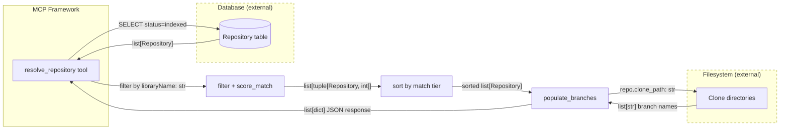
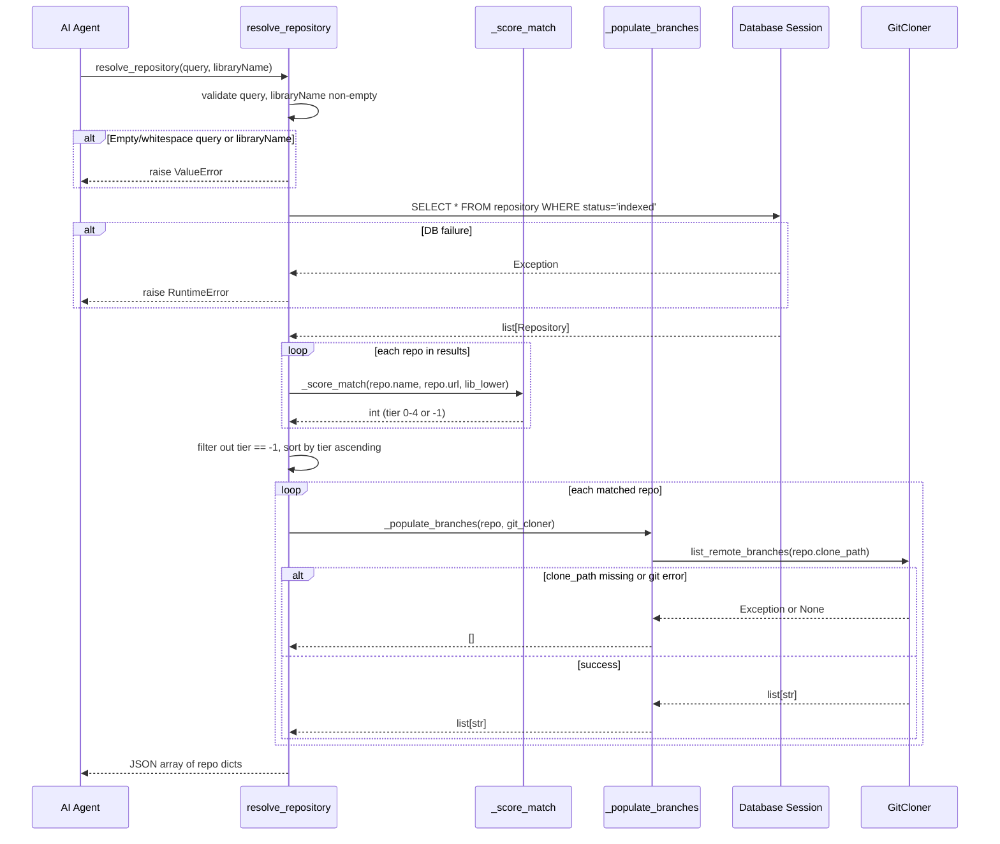
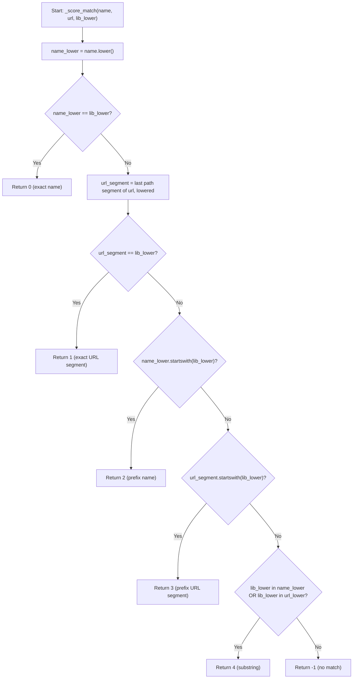

# Feature Detailed Design: Repository Resolution MCP Tool (Feature #46)

**Date**: 2026-03-25
**Feature**: #46 — Repository Resolution MCP Tool
**Priority**: high
**Dependencies**: Feature #17 (REST API Endpoints), Feature #18 (MCP Server)
**Design Reference**: docs/plans/2026-03-21-code-context-retrieval-design.md § 4.3
**SRS Reference**: FR-030

## Context

The `resolve_repository` MCP tool already exists as part of Feature #18, performing basic case-insensitive substring filtering of indexed repositories. Feature #46 enhances it with: (1) name match quality sorting (exact > prefix > substring), (2) `available_branches` populated from `GitCloner.list_remote_branches()` when a clone exists, and (3) confirmation that missing required params raise `TypeError` (handled by MCP framework for positional args).

## Design Alignment

### § 4.3 MCP Server (FR-016) — Relevant Excerpts

**§ 4.3.4 MCP Tool Definitions** (Wave 5):

| Tool | Parameters | Description |
|------|-----------|-------------|
| `resolve_repository` | `query` (**required**), `libraryName` (**required**) | Resolve a repository name to an exact repo ID with branch info. Returns only `status=indexed` repos. Each result includes: `id`, `name`, `url`, `indexed_branch`, `default_branch`, `available_branches`, `last_indexed_at`. Matching: case-insensitive substring on name+URL, ranked by query relevance. |

**§ 4.3.6 Design Notes**:
> `resolve_repository` queries the Repository table directly (no ES/Qdrant needed); `available_branches` from `GitCloner.list_remote_branches()` if clone exists.

- **Key classes**: `create_mcp_server` (factory function in `src/query/mcp_server.py`), `GitCloner` (in `src/indexing/git_cloner.py`), `Repository` model
- **Interaction flow**: MCP tool call → DB query for indexed repos → filter by libraryName → score and sort by match quality → populate `available_branches` via `GitCloner.list_remote_branches()` → return JSON
- **Third-party deps**: `mcp` (FastMCP SDK), `sqlalchemy` (async ORM)
- **Deviations**: None

## SRS Requirement

### FR-030: Repository Resolution MCP Tool [Wave 5]

**Priority**: Must
**EARS**: When an AI agent calls the `resolve_repository` MCP tool with a query and library name, the system shall return a ranked list of matching indexed repositories with branch information, enabling the agent to select the correct repository before searching.
**Acceptance Criteria**:
- Given `resolve_repository(query="JSON parsing", libraryName="gson")`, when the tool executes, then the system shall return a list of indexed repositories whose name or URL contains "gson", ranked by relevance to the query intent.
- Given each result in the list, it shall include: `id` (owner/repo format), `name`, `url`, `indexed_branch`, `default_branch`, `available_branches` (list of remote branch names if cloned), and `last_indexed_at`.
- Given a `libraryName` that matches no indexed repository, when executed, then the system shall return an empty list.
- Given `resolve_repository` called without the `query` or `libraryName` parameter, then the system shall raise a TypeError (missing required argument).
- Given multiple matching repositories, then the results shall be sorted by name match quality (exact match first, then prefix match, then substring match).

## Component Data-Flow Diagram



## Interface Contract

| Method | Signature | Preconditions | Postconditions | Raises |
|--------|-----------|---------------|----------------|--------|
| `resolve_repository` | `resolve_repository(query: str, libraryName: str) -> str` | Both `query` and `libraryName` are non-empty, non-whitespace strings | Returns JSON array of matching indexed repos sorted by match quality (exact > prefix > substring). Each dict contains `id`, `name`, `url`, `indexed_branch`, `default_branch`, `available_branches`, `last_indexed_at`. Non-matching libraryName returns `[]`. | `ValueError` if query or libraryName is empty/whitespace; `RuntimeError` if DB session fails |
| `_score_match` | `_score_match(name: str, url: str, library_name_lower: str) -> int` | `library_name_lower` is already lowercased; `name` and `url` are non-null strings from DB | Returns integer tier: 0 = exact name match, 1 = exact URL-segment match, 2 = prefix name match, 3 = prefix URL-segment match, 4 = substring match in name or URL. Returns -1 if no match. | None (pure function, always returns int) |
| `_populate_branches` | `_populate_branches(repo: Repository, git_cloner: GitCloner \| None) -> list[str]` | `repo` is a valid Repository instance | Returns `list[str]` of branch names if `repo.clone_path` is set and `git_cloner` is provided and the path exists; returns `[]` otherwise. Never raises — catches git errors gracefully. | None (catches exceptions internally, returns `[]` on failure) |

**Design rationale**:
- `_score_match` is extracted as a pure function for testability and mutation-killing — match tier logic is the core algorithm.
- `_populate_branches` is defensive: a missing clone or git error should not fail the entire resolve call — the tool degrades gracefully to `available_branches: []`.
- The MCP framework's `FastMCP` enforces required positional parameters at the protocol level, so missing `query` or `libraryName` raises `TypeError` before the function body executes.

**Verification step traceability**:
- VS-1 ("resolve_repository returns indexed repos with name match") → `resolve_repository` postconditions
- VS-2 ("Each result includes id, name, url, ...") → `resolve_repository` postconditions (field list)
- VS-3 ("libraryName matching no indexed repo returns empty list") → `resolve_repository` postcondition for non-matching
- VS-4 ("Missing query or libraryName parameter raises TypeError") → MCP framework enforcement (positional args)
- VS-5 ("Results sorted by name match quality") → `resolve_repository` postcondition + `_score_match` return value

## Internal Sequence Diagram



## Algorithm / Core Logic

### _score_match

#### Flow Diagram



#### Pseudocode

```
FUNCTION _score_match(name: str, url: str, library_name_lower: str) -> int
  // Step 1: Normalize inputs
  name_lower = name.lower()
  url_lower = url.lower()
  // Extract last path segment from URL (e.g., "https://github.com/google/gson" -> "gson")
  url_segment = url.rstrip("/").rsplit("/", 1)[-1].lower()

  // Step 2: Check match tiers in priority order
  IF name_lower == library_name_lower THEN RETURN 0   // exact name
  IF url_segment == library_name_lower THEN RETURN 1   // exact URL segment
  IF name_lower.startswith(library_name_lower) THEN RETURN 2  // prefix name
  IF url_segment.startswith(library_name_lower) THEN RETURN 3 // prefix URL segment
  IF library_name_lower IN name_lower OR library_name_lower IN url_lower THEN RETURN 4  // substring
  RETURN -1  // no match
END
```

#### Boundary Decisions

| Parameter | Min | Max | Empty/Null | At boundary |
|-----------|-----|-----|------------|-------------|
| `name` | 1 char | unbounded | N/A (DB enforces NOT NULL) | Single char: exact match if equal to lib_lower |
| `url` | valid URL | unbounded | N/A (DB enforces NOT NULL) | URL with no path segments: url_segment = full URL host |
| `library_name_lower` | 1 char (validated upstream) | unbounded | N/A (validated in resolve_repository) | Single char: substring match likely on most repos |

#### Error Handling

| Condition | Detection | Response | Recovery |
|-----------|-----------|----------|----------|
| URL with no `/` | `rsplit("/", 1)` returns single element | `url_segment` = full URL string | Still works — comparison against full URL |
| URL with trailing `/` | `rstrip("/")` before split | Trailing slash stripped | Clean segment extracted |

### _populate_branches

#### Pseudocode

```
FUNCTION _populate_branches(repo: Repository, git_cloner: GitCloner | None) -> list[str]
  // Step 1: Guard — no cloner or no clone path
  IF git_cloner IS None THEN RETURN []
  IF repo.clone_path IS None OR repo.clone_path == "" THEN RETURN []

  // Step 2: Attempt branch listing
  TRY
    RETURN git_cloner.list_remote_branches(repo.clone_path)
  CATCH any exception
    RETURN []
END
```

#### Boundary Decisions

| Parameter | Min | Max | Empty/Null | At boundary |
|-----------|-----|-----|------------|-------------|
| `repo.clone_path` | valid path | unbounded | None or "" → return [] | Path exists but git fails → return [] |
| `git_cloner` | valid instance | N/A | None → return [] | Instance with broken git binary → return [] |

#### Error Handling

| Condition | Detection | Response | Recovery |
|-----------|-----------|----------|----------|
| `git_cloner` is None | `is None` check | Return `[]` | Graceful degradation |
| `clone_path` is None/empty | `is None or == ""` check | Return `[]` | Graceful degradation |
| `list_remote_branches` raises `CloneError` | `try/except Exception` | Return `[]` | Log warning, graceful degradation |
| Clone directory deleted | Git command fails | Return `[]` | Graceful degradation |

### resolve_repository (enhanced sorting + branch population)

#### Pseudocode

```
FUNCTION resolve_repository(query: str, libraryName: str) -> str
  // Step 1: Validate inputs
  IF query is empty or whitespace THEN raise ValueError("query is required")
  IF libraryName is empty or whitespace THEN raise ValueError("libraryName is required")

  // Step 2: Query DB for indexed repos
  session = session_factory()
  TRY
    repos = SELECT * FROM repository WHERE status = 'indexed'
  CATCH Exception as exc
    RAISE RuntimeError("Failed to resolve repositories: {exc}")
  FINALLY
    session.close()

  // Step 3: Score each repo
  lib_lower = libraryName.strip().lower()
  scored = []
  FOR EACH repo IN repos
    tier = _score_match(repo.name, repo.url, lib_lower)
    IF tier >= 0 THEN scored.append((tier, repo))

  // Step 4: Sort by tier ascending (exact=0 first, substring=4 last)
  scored.sort(key=lambda x: x[0])

  // Step 5: Build response with branch population
  results = []
  FOR EACH (tier, repo) IN scored
    branches = _populate_branches(repo, git_cloner)
    results.append({
      "id": repo.name,
      "name": repo.name,
      "url": repo.url,
      "indexed_branch": repo.indexed_branch,
      "default_branch": repo.default_branch,
      "available_branches": branches,
      "last_indexed_at": repo.last_indexed_at.isoformat() if repo.last_indexed_at else None
    })

  RETURN json.dumps(results)
END
```

## State Diagram

N/A — stateless feature. `resolve_repository` is a pure query tool with no object lifecycle.

## Test Inventory

| ID | Category | Traces To | Input / Setup | Expected | Kills Which Bug? |
|----|----------|-----------|---------------|----------|-----------------|
| T01 | happy path | VS-1, FR-030 AC-1 | `query="JSON parsing", libraryName="gson"`, DB has `gson` (indexed) + `gson-extras` (indexed) + `react` (indexed) | JSON array with `gson` repos only, sorted: exact match `gson` first, then `gson-extras` | Missing filter: returns all repos |
| T02 | happy path | VS-2, FR-030 AC-2 | Same as T01 | Each result dict contains all 7 keys: `id`, `name`, `url`, `indexed_branch`, `default_branch`, `available_branches`, `last_indexed_at` | Missing field in response dict |
| T03 | happy path | VS-5, §Interface `_score_match` | DB has repos: `gson` (exact), `gson-fire` (prefix), `my-gson-lib` (substring) | Order: `gson` (tier 0), `gson-fire` (tier 2), `my-gson-lib` (tier 4) | Sort not applied or wrong tier ordering |
| T04 | happy path | VS-1, §Interface `_populate_branches` | Repo with `clone_path="/tmp/gson"`, `GitCloner.list_remote_branches` returns `["main", "dev"]` | `available_branches: ["main", "dev"]` in result | Hardcoded empty `available_branches` |
| T05 | happy path | §Interface `_score_match` | `libraryName="spring"`, URL has `spring-framework` as path segment | URL segment `spring-framework` gets prefix match (tier 3) | URL matching not implemented |
| T06 | happy path | §Interface `_score_match` | `libraryName="react"`, repo name is `react`, URL last segment is `react` | Tier 0 (exact name match takes priority over URL match) | Name vs URL priority inverted |
| T07 | error | VS-4, FR-030 AC-4 | Call `resolve_repository` without `query` param | `TypeError` raised by MCP framework | Missing required param not enforced |
| T08 | error | VS-4, FR-030 AC-4 | Call `resolve_repository` without `libraryName` param | `TypeError` raised by MCP framework | Missing required param not enforced |
| T09 | error | §Interface `resolve_repository` Raises | `query=""`, `libraryName="gson"` | `ValueError("query is required")` | Empty string passes validation |
| T10 | error | §Interface `resolve_repository` Raises | `query="test"`, `libraryName=""` | `ValueError("libraryName is required")` | Empty libraryName passes validation |
| T11 | error | §Interface `resolve_repository` Raises | DB session raises `Exception("connection lost")` | `RuntimeError("Failed to resolve repositories: ...")` | DB error not caught |
| T12 | error | §Interface `_populate_branches` Error Handling | `clone_path="/nonexistent"`, `GitCloner.list_remote_branches` raises `CloneError` | `available_branches: []` (graceful) | Git error propagates and crashes resolve |
| T13 | error | §Interface `_populate_branches` Error Handling | `git_cloner=None`, repo has `clone_path` set | `available_branches: []` | NoneType has no attribute `list_remote_branches` |
| T14 | boundary | VS-3, FR-030 AC-3 | `libraryName="zzz-nonexistent-zzz"`, DB has indexed repos but none match | Empty JSON array `[]` | Non-matching returns all repos |
| T15 | boundary | §Algorithm `_score_match` boundary | `libraryName="GSON"` (uppercase), repo name `gson` | Matches (tier 0, case-insensitive) | Case sensitivity bug |
| T16 | boundary | §Algorithm `_score_match` boundary | `libraryName="g"` (single char), repos: `gson`, `react` | Matches `gson` (prefix tier 2), not `react` | Single-char match fails |
| T17 | boundary | §Algorithm `_populate_branches` boundary | `repo.clone_path = None` | `available_branches: []` | None clone_path causes AttributeError |
| T18 | boundary | §Algorithm `_populate_branches` boundary | `repo.clone_path = ""` (empty string) | `available_branches: []` | Empty string treated as valid path |
| T19 | boundary | §Algorithm `_score_match` boundary | URL = `"https://github.com/org/gson/"` (trailing slash) | URL segment extracted as `gson`, not empty string | Trailing slash causes empty segment |
| T20 | boundary | §Interface `resolve_repository` | `query="  "` (whitespace only), `libraryName="gson"` | `ValueError("query is required")` | Whitespace-only passes strip check |

**Negative test count**: T07, T08, T09, T10, T11, T12, T13 (error = 7) + T14, T15, T16, T17, T18, T19, T20 (boundary = 7) = 14 negative out of 20 total = **70%** (threshold: >= 40%)

### Design Interface Coverage Gate

Design § 4.3.4 names `resolve_repository` with matching, ranking, and branch population. All named behaviors are covered:
- `resolve_repository` tool: T01-T06 (happy), T07-T11 (error), T14-T16 (boundary)
- `_score_match` scoring logic: T03, T05, T06, T15, T16, T19
- `_populate_branches` branch lookup: T04, T12, T13, T17, T18
- Input validation: T07, T08, T09, T10, T20
- DB failure handling: T11

All design-specified functions have at least one test row. Coverage: 3/3 functions covered.

## Tasks

### Task 1: Write failing tests
**Files**: `tests/test_resolve_repository.py`
**Steps**:
1. Create `tests/test_resolve_repository.py` with imports: `json`, `uuid`, `datetime`, `pytest`, `MagicMock`, `AsyncMock`, `patch`
2. Create fixtures:
   - `mock_repos()` — builds Repository-like mocks: `gson` (indexed, clone_path="/tmp/gson"), `gson-fire` (indexed, clone_path=None), `my-gson-lib` (indexed, clone_path="/tmp/my-gson-lib"), `react` (indexed, clone_path="/tmp/react")
   - `mock_session_factory(mock_repos)` — returns indexed repos on execute
   - `mock_git_cloner()` — `list_remote_branches` returns `["main", "dev"]` by default
3. Write tests for each row T01-T20 from Test Inventory:
   - T01: filter correctness — only matching repos returned
   - T02: field completeness — all 7 keys present
   - T03: sort order — exact > prefix > substring
   - T04: available_branches populated from GitCloner
   - T05: URL segment matching
   - T06: name match takes priority over URL
   - T07-T08: TypeError for missing positional args
   - T09-T10: ValueError for empty/whitespace
   - T11: RuntimeError on DB failure
   - T12: GitCloner error returns []
   - T13: git_cloner=None returns []
   - T14-T20: boundary cases
4. Run: `python -m pytest tests/test_resolve_repository.py -x -v`
5. **Expected**: All tests FAIL (new sort/branch features not implemented yet)

### Task 2: Implement minimal code
**Files**: `src/query/mcp_server.py`
**Steps**:
1. Add `_score_match(name: str, url: str, library_name_lower: str) -> int` as a module-level function per §5 pseudocode:
   - Normalize name/url to lowercase
   - Extract URL last path segment via `url.rstrip("/").rsplit("/", 1)[-1].lower()`
   - Return tier 0-4 or -1
2. Add `_populate_branches(repo, git_cloner) -> list[str]` as a module-level function per §5 pseudocode:
   - Guard on None cloner or None/empty clone_path
   - Try/except around `git_cloner.list_remote_branches(repo.clone_path)`
   - Return `[]` on any failure
3. Modify `create_mcp_server` to accept optional `git_cloner` parameter
4. Replace the inline list comprehension in `resolve_repository` with:
   - Score each repo via `_score_match`
   - Filter out tier == -1
   - Sort by tier ascending
   - Populate `available_branches` via `_populate_branches`
5. Run: `python -m pytest tests/test_resolve_repository.py -x -v`
6. **Expected**: All tests PASS

### Task 3: Coverage Gate
1. Run: `python -m pytest tests/test_resolve_repository.py --cov=src/query/mcp_server --cov-report=term-missing --cov-branch`
2. Check: line >= 90%, branch >= 80%
3. If below: add tests for uncovered lines, return to Task 1.
4. Record coverage output as evidence.

### Task 4: Refactor
1. Review `_score_match` for clarity — ensure variable names are descriptive
2. Ensure `_populate_branches` logging is present (add `logger.warning` on git failure)
3. Run: `python -m pytest tests/ -x -v` (full suite to check no regressions)
4. **Expected**: All tests PASS

### Task 5: Mutation Gate
1. Run: `python -m mutmut run --paths-to-mutate=src/query/mcp_server.py --tests-dir=tests/test_resolve_repository.py`
2. Check threshold: mutation score >= 80%
3. If below: strengthen assertions in T03 (sort order), T04 (branch content), T06 (priority)
4. Record mutation output as evidence.

### Task 6: Create example
1. Create `examples/46-resolve-repository.py`:
   - Show MCP client calling `resolve_repository(query="JSON parsing", libraryName="gson")`
   - Print results with sort order visible
2. Update `examples/README.md` with entry for example 46
3. Run example to verify output format.

## Verification Checklist
- [x] All verification_steps traced to Interface Contract postconditions
- [x] All verification_steps traced to Test Inventory rows
- [x] Algorithm pseudocode covers all non-trivial methods (_score_match, _populate_branches, resolve_repository)
- [x] Boundary table covers all algorithm parameters
- [x] Error handling table covers all Raises entries
- [x] Test Inventory negative ratio >= 40% (70%)
- [x] Every skipped section has explicit "N/A — [reason]" (State Diagram)
- [x] All functions/methods named in §4.3 have at least one Test Inventory row (3/3)
