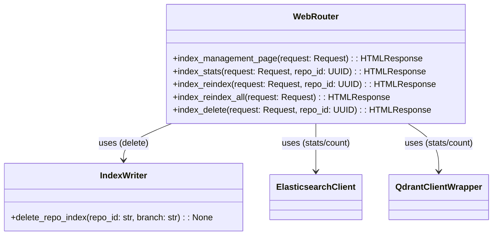
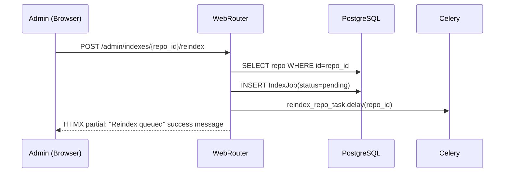
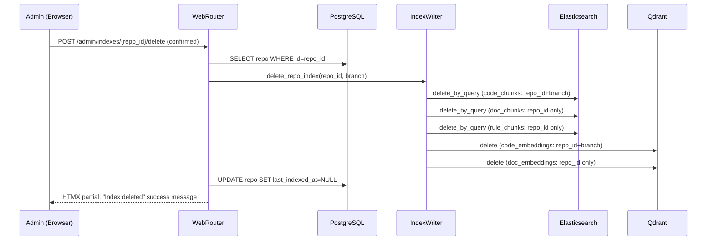
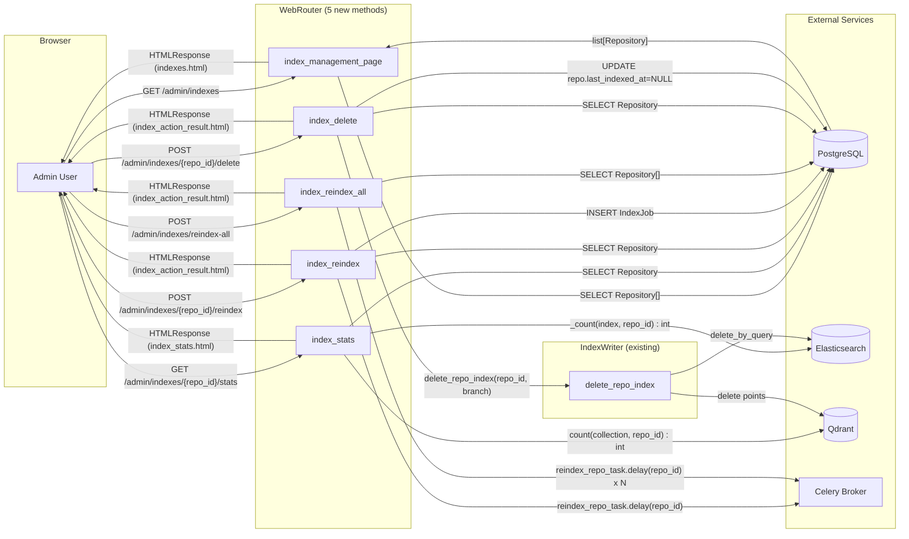
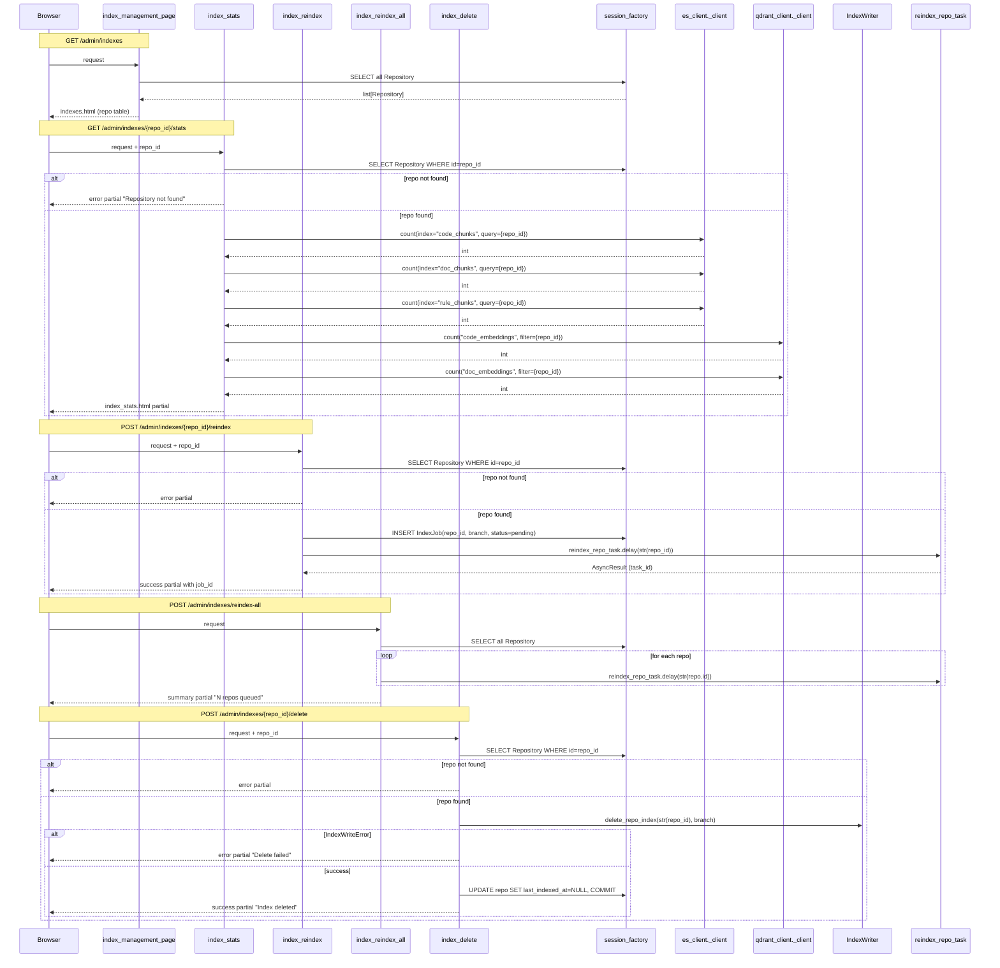
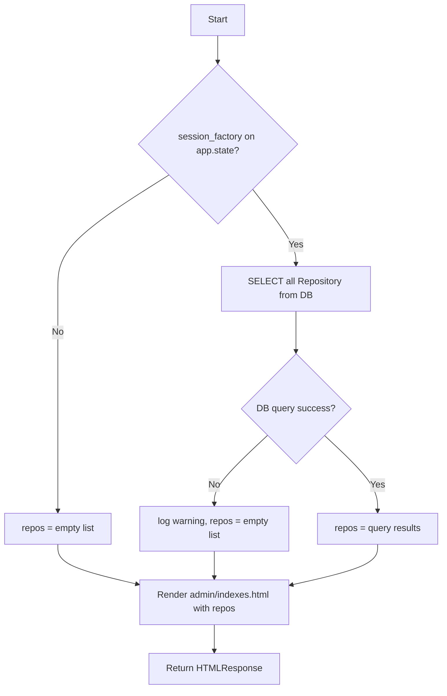
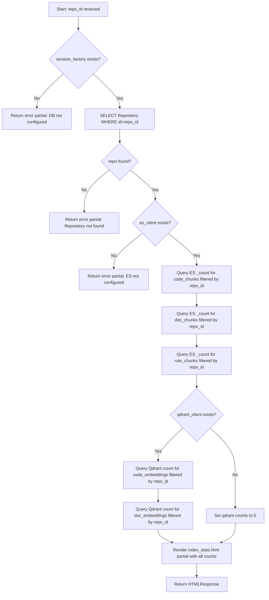
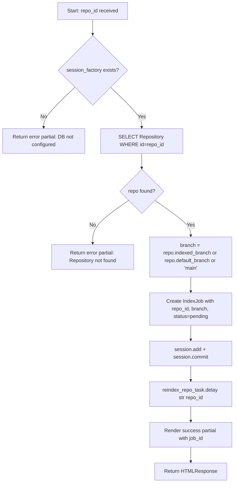
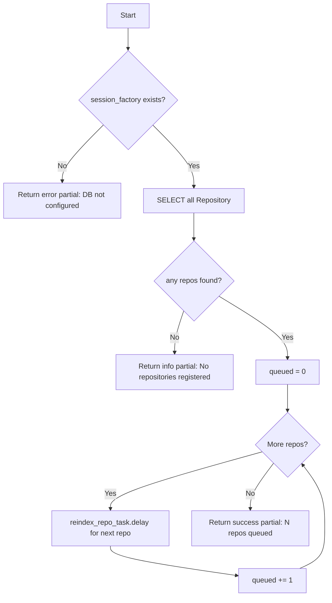
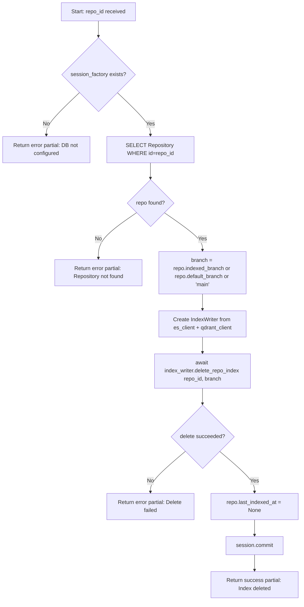

# Feature Detailed Design: Web UI Index Management Page (Feature #47)

**Date**: 2026-03-25
**Feature**: #47 — Web UI Index Management Page
**Priority**: high
**Dependencies**: Feature #19 (Web UI Search Page), Feature #22 (Scheduled Index Refresh)
**Design Reference**: docs/plans/2026-03-21-code-context-retrieval-design.md § 4.9
**SRS Reference**: FR-031

## Context

Admin page at `/admin/indexes` in the existing Web UI for managing repository indexes. Provides a table of all registered repos with status/branch/timestamp, plus actions: view stats (ES/Qdrant doc counts), reindex single repo, reindex all, and delete index data. All interactions use HTMX partials. Not exposed via MCP.

## Design Alignment

### System Design § 4.9 (Full Copy)

#### 4.9.1 Overview
Dedicated admin page (`/admin/indexes`) in the existing Web UI for managing repository indexes. Provides list, stats, reindex, reindex-all, and delete capabilities with confirmation prompts for destructive operations. Web UI only — **not exposed via MCP**.

#### 4.9.2 Class Diagram



#### 4.9.3 Sequence Diagram — Reindex Single Repo



#### 4.9.4 Sequence Diagram — Delete Index



#### 4.9.5 Page Layout

```
+-----------------------------------------------------+
|  Code Context Retrieval          [Search] [Indexes]  |  <- nav links
+-----------------------------------------------------+
|  Index Management                  [Reindex All]     |
+-------+----------+--------+----------+--------------+
| Name  | Status   | Branch | Indexed  | Actions      |
+-------+----------+--------+----------+--------------+
| repo1 | indexed  | main   | 2h ago   | [Stats][R][X]|
| repo2 | pending  | dev    | never    | [Stats][R][X]|
+-------+----------+--------+----------+--------------+
```

#### 4.9.6 Design Notes

- **HTMX integration**: All actions use HTMX (hx-post, hx-confirm for destructive ops, hx-target for partial updates). No full page reloads.
- **Confirmation**: `hx-confirm="Are you sure?"` attribute on Delete and Reindex All buttons — browser native confirm dialog.
- **Stats query**: ES `_count` API per index filtered by repo_id; Qdrant `count` API per collection filtered by repo_id. Rendered inline via HTMX partial.
- **Templates**: `templates/admin/indexes.html` (main page), `templates/partials/index_stats.html` (stats row), `templates/partials/index_action_result.html` (action feedback).
- **Auth**: Same API key cookie auth as search page. No additional permission level required (existing admin key sufficient).
- **No MCP exposure**: Routes registered on WebRouter only. MCP server has no knowledge of admin routes.
- **Celery dispatch**: Reindex uses `reindex_repo_task.delay()` from `src.indexing.scheduler` — same task used by scheduled refresh and the (fixed) REST API endpoint.

- **Key classes**: WebRouter (5 new methods), IndexWriter (existing `delete_repo_index`), ElasticsearchClient (existing `_client`), QdrantClientWrapper (existing `_client`)
- **Interaction flow**: Browser -> WebRouter -> DB (list/lookup) + ES/Qdrant (stats/delete) + Celery (reindex dispatch) -> HTMX partial response
- **Third-party deps**: htmx 2.0.4 (already included via CDN in `_base.html`), Jinja2 (already used)
- **Deviations**: none

## SRS Requirement

### FR-031: Web UI Index Management Page [Wave 6]

**Priority**: Must
**EARS**: When an administrator navigates to the index management page in the Web UI, the system shall display a table of all registered repositories with their index status, document counts, and last-indexed timestamp, and shall provide actions to reindex a single repository, reindex all repositories, delete a repository's index data, and view per-repository index statistics, with confirmation prompts for destructive operations.
**Scope**: Web UI only — not exposed via MCP protocol.
**Acceptance Criteria**:
- Given the Web UI is running, when a user navigates to `/admin/indexes`, then the system shall render a page listing all registered repositories with columns: name, status, indexed branch, last indexed timestamp.
- Given the index management page, when the user clicks "Stats" on a repository, then the system shall display per-index document counts: `code_chunks`, `doc_chunks`, `rule_chunks` (ES) and `code_embeddings`, `doc_embeddings` (Qdrant).
- Given the index management page, when the user clicks "Reindex" on a repository, then the system shall dispatch a Celery reindex task and display a success message with the job ID.
- Given the index management page, when the user clicks "Reindex All", then the system shall display a confirmation prompt; upon confirmation, dispatch reindex tasks for all indexed repositories and display a summary message.
- Given the index management page, when the user clicks "Delete Index" on a repository, then the system shall display a confirmation prompt; upon confirmation, delete all ES and Qdrant index data for that repository and display a success message.
- Given any action completes, the page shall update via HTMX partial without full page reload.
- Given the MCP server, the index management routes shall NOT be accessible via MCP tools.

## Component Data-Flow Diagram



## Interface Contract

| Method | Signature | Preconditions | Postconditions | Raises |
|--------|-----------|---------------|----------------|--------|
| `index_management_page` | `async index_management_page(request: Request) -> HTMLResponse` | Web UI is running, DB session_factory on app.state | Returns HTML page listing all registered repositories with columns: name, status, indexed_branch, last_indexed_at. Template: `admin/indexes.html`. | None (renders error partial on DB failure) |
| `index_stats` | `async index_stats(request: Request, repo_id: UUID) -> HTMLResponse` | repo_id is a valid UUID string; ES and Qdrant clients on app.state | Returns HTMX partial with doc counts: code_chunks, doc_chunks, rule_chunks (ES) and code_embeddings, doc_embeddings (Qdrant) for the given repo. Template: `partials/index_stats.html`. | Renders error partial if repo not found, or if ES/Qdrant unreachable |
| `index_reindex` | `async index_reindex(request: Request, repo_id: UUID) -> HTMLResponse` | repo_id exists in DB; Celery broker reachable | Creates IndexJob(status=pending), dispatches `reindex_repo_task.delay(repo_id)`, returns HTMX partial with success message containing job_id. | Renders error partial if repo not found |
| `index_reindex_all` | `async index_reindex_all(request: Request) -> HTMLResponse` | At least one registered repo exists | For each repo, dispatches `reindex_repo_task.delay(repo_id)`. Returns HTMX partial with summary: N repos queued. | Renders error partial if DB unavailable |
| `index_delete` | `async index_delete(request: Request, repo_id: UUID) -> HTMLResponse` | repo_id exists in DB; ES and Qdrant clients available via app.state | Calls `IndexWriter.delete_repo_index(repo_id, branch)`, sets `repo.last_indexed_at = None`, commits. Returns HTMX partial with "Index deleted" success message. | Renders error partial if repo not found or delete fails (IndexWriteError) |

**Design rationale**:
- All methods return HTMLResponse (never raise HTTP exceptions) because HTMX partial updates expect HTML fragments, not JSON error responses.
- `index_reindex_all` dispatches individual `reindex_repo_task.delay()` calls rather than using `scheduled_reindex_all` task because it needs synchronous count of queued repos for the summary message.
- `index_delete` constructs IndexWriter inline from `app.state.es_client` and `app.state.qdrant_client` rather than requiring it as a constructor dependency, matching the existing WebRouter pattern of accessing services from `request.app.state`.
- Stats endpoint uses raw ES `_count` API and Qdrant `count` API directly on the underlying clients rather than adding new wrapper methods, keeping the change surface minimal.

## Internal Sequence Diagram



## Algorithm / Core Logic

### index_management_page

#### Flow Diagram



#### Pseudocode

```
FUNCTION index_management_page(request: Request) -> HTMLResponse
  // Step 1: Load all registered repositories
  repos = []
  session_factory = request.app.state.session_factory
  IF session_factory is not None THEN
    TRY
      session = session_factory()
      repos = SELECT * FROM repository ORDER BY name
    CATCH Exception
      log.warning("Failed to load repos")
  // Step 2: Render full page template
  RETURN render("admin/indexes.html", repos=repos)
END
```

#### Boundary Decisions

| Parameter | Min | Max | Empty/Null | At boundary |
|-----------|-----|-----|------------|-------------|
| repos list | 0 repos | unbounded | Empty list renders table with "No repositories registered" message | 0 repos: empty state row shown; 1 repo: single row |

#### Error Handling

| Condition | Detection | Response | Recovery |
|-----------|-----------|----------|----------|
| session_factory is None | getattr returns None | Render page with empty repos list | Page shows empty state |
| DB query fails | Exception caught | Log warning, render with empty repos | Page shows empty state |

### index_stats

#### Flow Diagram



#### Pseudocode

```
FUNCTION index_stats(request: Request, repo_id: UUID) -> HTMLResponse
  // Step 1: Load repo from DB
  session_factory = request.app.state.session_factory
  IF session_factory is None THEN RETURN error_partial("Database not configured")
  repo = SELECT Repository WHERE id = repo_id
  IF repo is None THEN RETURN error_partial("Repository not found")

  // Step 2: Query ES doc counts per index
  es = request.app.state.es_client
  IF es is None OR es._client is None THEN RETURN error_partial("ES not configured")
  repo_id_str = str(repo.id)
  repo_query = {"query": {"term": {"repo_id": repo_id_str}}}
  code_chunks_count = await es._client.count(index="code_chunks", body=repo_query)["count"]
  doc_chunks_count  = await es._client.count(index="doc_chunks", body=repo_query)["count"]
  rule_chunks_count = await es._client.count(index="rule_chunks", body=repo_query)["count"]

  // Step 3: Query Qdrant doc counts per collection
  qdrant = request.app.state.qdrant_client
  code_embeddings_count = 0
  doc_embeddings_count = 0
  IF qdrant is not None AND qdrant._client is not None THEN
    filter = Filter(must=[FieldCondition(key="repo_id", match=MatchValue(value=repo_id_str))])
    code_embeddings_count = await qdrant._client.count("code_embeddings", count_filter=filter).count
    doc_embeddings_count  = await qdrant._client.count("doc_embeddings", count_filter=filter).count

  // Step 4: Render partial
  RETURN render("partials/index_stats.html",
    code_chunks=code_chunks_count,
    doc_chunks=doc_chunks_count,
    rule_chunks=rule_chunks_count,
    code_embeddings=code_embeddings_count,
    doc_embeddings=doc_embeddings_count)
END
```

#### Boundary Decisions

| Parameter | Min | Max | Empty/Null | At boundary |
|-----------|-----|-----|------------|-------------|
| repo_id | valid UUID | valid UUID | Invalid UUID -> 422 from FastAPI | Non-existent UUID -> "not found" error partial |
| ES count results | 0 | unbounded | ES unreachable -> renders error partial | 0 documents -> shows 0 for each count |
| Qdrant count results | 0 | unbounded | Qdrant unreachable -> shows 0 (graceful degrade) | 0 embeddings -> shows 0 |

#### Error Handling

| Condition | Detection | Response | Recovery |
|-----------|-----------|----------|----------|
| repo not found | DB query returns None | Error partial "Repository not found" | User corrects repo_id |
| ES client not configured | `es_client is None` or `_client is None` | Error partial "Search service not configured" | Admin configures ES |
| ES count query fails | Exception from ES client | Error partial "Failed to retrieve index stats" | User retries |
| Qdrant client unavailable | `qdrant_client is None` | Set Qdrant counts to 0, render with warning | Graceful degradation |
| Qdrant count query fails | Exception from Qdrant client | Set Qdrant counts to 0, render with warning | Graceful degradation |

### index_reindex

#### Flow Diagram



#### Pseudocode

```
FUNCTION index_reindex(request: Request, repo_id: UUID) -> HTMLResponse
  // Step 1: Load repo
  session_factory = request.app.state.session_factory
  IF session_factory is None THEN RETURN error_partial("Database not configured")
  repo = SELECT Repository WHERE id = repo_id
  IF repo is None THEN RETURN error_partial("Repository not found")

  // Step 2: Create IndexJob and dispatch Celery task
  branch = repo.indexed_branch OR repo.default_branch OR "main"
  job = IndexJob(repo_id=repo.id, branch=branch, status="pending")
  session.add(job)
  session.commit()
  reindex_repo_task.delay(str(repo.id))

  // Step 3: Render success
  RETURN render("partials/index_action_result.html",
    success=True, message=f"Reindex queued for {repo.name}", job_id=str(job.id))
END
```

#### Boundary Decisions

| Parameter | Min | Max | Empty/Null | At boundary |
|-----------|-----|-----|------------|-------------|
| repo_id | valid UUID | valid UUID | Invalid UUID -> 422 from FastAPI | Non-existent UUID -> "not found" error |
| branch resolution | "main" fallback | any string | All branch fields None -> falls back to "main" | indexed_branch preferred over default_branch |

#### Error Handling

| Condition | Detection | Response | Recovery |
|-----------|-----------|----------|----------|
| repo not found | DB query returns None | Error partial "Repository not found" | User corrects repo_id |
| DB commit fails | Exception during commit | Error partial "Failed to create reindex job" | User retries |
| Celery dispatch fails | Exception from .delay() | Error partial "Failed to dispatch reindex task" | Admin checks Celery broker |

### index_reindex_all

#### Flow Diagram



#### Pseudocode

```
FUNCTION index_reindex_all(request: Request) -> HTMLResponse
  // Step 1: Load all repos
  session_factory = request.app.state.session_factory
  IF session_factory is None THEN RETURN error_partial("Database not configured")
  repos = SELECT * FROM repository

  IF repos is empty THEN
    RETURN render("partials/index_action_result.html",
      success=False, message="No repositories registered")

  // Step 2: Dispatch reindex for each repo
  queued = 0
  FOR each repo IN repos
    TRY
      reindex_repo_task.delay(str(repo.id))
      queued += 1
    CATCH Exception
      log.warning("Failed to dispatch reindex for %s", repo.name)

  // Step 3: Render summary
  RETURN render("partials/index_action_result.html",
    success=True, message=f"Reindex queued for {queued} repositories")
END
```

#### Boundary Decisions

| Parameter | Min | Max | Empty/Null | At boundary |
|-----------|-----|-----|------------|-------------|
| repos list | 0 repos | unbounded | 0 repos -> "No repositories registered" message | 1 repo -> "1 repositories" (use plural-aware phrasing) |
| Celery dispatch | 0 success | all success | All fail -> "0 repos queued" | Partial failure -> shows actual queued count |

#### Error Handling

| Condition | Detection | Response | Recovery |
|-----------|-----------|----------|----------|
| No repos registered | Empty query result | Info partial "No repositories registered" | User registers repos first |
| Celery dispatch fails for one repo | Exception from .delay() | Log warning, continue to next repo | Partial success reported |
| DB query fails | Exception | Error partial "Failed to load repositories" | User retries |

### index_delete

#### Flow Diagram



#### Pseudocode

```
FUNCTION index_delete(request: Request, repo_id: UUID) -> HTMLResponse
  // Step 1: Load repo
  session_factory = request.app.state.session_factory
  IF session_factory is None THEN RETURN error_partial("Database not configured")
  repo = SELECT Repository WHERE id = repo_id
  IF repo is None THEN RETURN error_partial("Repository not found")

  // Step 2: Delete index data via IndexWriter
  es_client = request.app.state.es_client
  qdrant_client = request.app.state.qdrant_client
  index_writer = IndexWriter(es_client, qdrant_client)
  branch = repo.indexed_branch OR repo.default_branch OR "main"
  TRY
    await index_writer.delete_repo_index(str(repo.id), branch)
  CATCH IndexWriteError as e
    RETURN error_partial(f"Failed to delete index: {e}")

  // Step 3: Clear last_indexed_at
  repo.last_indexed_at = None
  session.commit()

  RETURN render("partials/index_action_result.html",
    success=True, message=f"Index deleted for {repo.name}")
END
```

#### Boundary Decisions

| Parameter | Min | Max | Empty/Null | At boundary |
|-----------|-----|-----|------------|-------------|
| repo_id | valid UUID | valid UUID | Invalid UUID -> 422 from FastAPI | Non-existent UUID -> "not found" error |
| branch resolution | "main" fallback | any string | All branch fields None -> falls back to "main" | Same logic as reindex |
| Index data | 0 docs (already empty) | unbounded | Deleting empty index succeeds silently | First delete vs. repeated delete both succeed |

#### Error Handling

| Condition | Detection | Response | Recovery |
|-----------|-----------|----------|----------|
| repo not found | DB query returns None | Error partial "Repository not found" | User corrects repo_id |
| ES/Qdrant delete fails | IndexWriteError from delete_repo_index | Error partial "Failed to delete index: ..." | Admin checks ES/Qdrant health |
| DB commit fails after delete | Exception during commit | Error partial "Failed to update repository status" | Data inconsistency: index deleted but timestamp not cleared; next page load shows stale timestamp |

## State Diagram

N/A — stateless feature. The WebRouter methods are request-response handlers with no object lifecycle. Repository status is managed by the existing Repository model and is not modified by index management actions (only `last_indexed_at` is cleared on delete).

## Test Inventory

| ID | Category | Traces To | Input / Setup | Expected | Kills Which Bug? |
|----|----------|-----------|---------------|----------|-----------------|
| T01 | happy path | VS-1, FR-031 AC-1 | GET /admin/indexes with 2 repos in DB (repo1: status=indexed, branch=main, last_indexed_at=2h ago; repo2: status=pending, branch=dev, last_indexed_at=None) | HTML 200 containing table with both repos, columns: name, status, branch, last_indexed_at. repo1 shows "main" and timestamp, repo2 shows "dev" and "never" | Missing DB query or wrong template rendering |
| T02 | happy path | VS-2, FR-031 AC-2 | GET /admin/indexes/{repo_id}/stats with repo in DB; ES mock returns code_chunks=100, doc_chunks=50, rule_chunks=10; Qdrant mock returns code_embeddings=100, doc_embeddings=50 | HTML partial with all 5 counts: code_chunks=100, doc_chunks=50, rule_chunks=10, code_embeddings=100, doc_embeddings=50 | Wrong count API call or missing index in query |
| T03 | happy path | VS-3, FR-031 AC-3 | POST /admin/indexes/{repo_id}/reindex with repo in DB (indexed_branch="main") | IndexJob created with status=pending, reindex_repo_task.delay called with str(repo.id), HTML partial contains "Reindex queued" and job_id | Missing Celery dispatch or wrong job creation |
| T04 | happy path | VS-4, FR-031 AC-4 | POST /admin/indexes/reindex-all with 3 repos in DB | reindex_repo_task.delay called 3 times (once per repo), HTML partial contains "3 repositories" | Missing loop over repos or wrong dispatch count |
| T05 | happy path | VS-5, FR-031 AC-5 | POST /admin/indexes/{repo_id}/delete with repo in DB (indexed_branch="main"); IndexWriter.delete_repo_index mocked | delete_repo_index called with (str(repo_id), "main"), repo.last_indexed_at set to None, HTML partial contains "Index deleted" | Missing delete call or last_indexed_at not cleared |
| T06 | happy path | VS-6, FR-031 AC-6 | All action endpoints return HTMLResponse (not redirect, not JSON) | Response content_type is text/html; no full-page HTML (no `<!DOCTYPE>` in partial responses for stats/reindex/delete) | Returning JSON instead of HTML partial |
| T07 | happy path | VS-7, FR-031 AC-7 | Import MCP server module, inspect registered tools | No tool or endpoint matching /admin/indexes pattern exists in MCP tool registry | Accidental MCP exposure of admin routes |
| T08 | error | §IC index_stats Raises | GET /admin/indexes/{nonexistent_uuid}/stats | HTML partial containing "Repository not found" | Missing repo-not-found guard |
| T09 | error | §IC index_reindex Raises | POST /admin/indexes/{nonexistent_uuid}/reindex | HTML partial containing "Repository not found" | Missing repo-not-found guard in reindex |
| T10 | error | §IC index_delete Raises | POST /admin/indexes/{nonexistent_uuid}/delete | HTML partial containing "Repository not found" | Missing repo-not-found guard in delete |
| T11 | error | §IC index_delete Raises, §EH delete fails | POST /admin/indexes/{repo_id}/delete with IndexWriter.delete_repo_index raising IndexWriteError | HTML partial containing "Failed to delete index" | Missing try/except around delete_repo_index |
| T12 | error | §IC index_stats Raises, §EH ES fails | GET /admin/indexes/{repo_id}/stats with ES count raising Exception | HTML partial containing error message about stats failure | Missing try/except around ES count query |
| T13 | error | §IC index_reindex Raises, §EH Celery fails | POST /admin/indexes/{repo_id}/reindex with reindex_repo_task.delay raising Exception | HTML partial containing error message about dispatch failure | Missing try/except around Celery dispatch |
| T14 | boundary | §Alg index_management_page boundary | GET /admin/indexes with 0 repos in DB | HTML 200 with empty table or "No repositories registered" message | Missing empty state handling |
| T15 | boundary | §Alg index_reindex boundary, branch fallback | POST /admin/indexes/{repo_id}/reindex with repo having indexed_branch=None, default_branch=None | IndexJob.branch is "main" (fallback), Celery dispatched | Missing branch fallback chain |
| T16 | boundary | §Alg index_delete boundary, branch fallback | POST /admin/indexes/{repo_id}/delete with repo having indexed_branch="develop" | delete_repo_index called with branch="develop" | Using wrong branch field |
| T17 | boundary | §Alg index_reindex_all boundary | POST /admin/indexes/reindex-all with 0 repos in DB | HTML partial with "No repositories registered" message, reindex_repo_task.delay NOT called | Dispatching tasks for empty list |
| T18 | error | §Alg index_stats boundary, Qdrant down | GET /admin/indexes/{repo_id}/stats with ES working but qdrant_client is None | HTML partial shows ES counts normally, Qdrant counts shown as 0 | Hard failure when Qdrant unavailable instead of graceful degrade |
| T19 | error | §IC index_management_page, §EH session_factory None | GET /admin/indexes with session_factory=None on app.state | HTML 200 with empty repos list (graceful degrade) | Hard crash when DB not configured |
| T20 | error | §Alg index_reindex_all, partial Celery failure | POST /admin/indexes/reindex-all with 3 repos, Celery .delay() fails on 2nd repo | reindex_repo_task.delay called 3 times, success partial shows "2 repositories" queued (skips failed one) | Entire operation aborts on single Celery failure |
| T21 | boundary | §Alg index_stats, zero counts | GET /admin/indexes/{repo_id}/stats with repo in DB but no indexed data (all counts = 0) | HTML partial with all counts showing 0 | Division by zero or None-type error on empty counts |
| T22 | error | §IC index_management_page, DB query fails | GET /admin/indexes with session_factory present but DB query raises Exception | HTML 200 with empty repos list, warning logged | Unhandled exception crashes page |

**Negative test ratio**: 11 negative tests (T08-T13, T18-T20, T22) + 4 boundary tests (T14-T17, T21) = 15 out of 22 total = **68%** >= 40% threshold.

### Design Interface Coverage Gate

Functions from § 4.9:
1. `index_management_page` -> T01, T14, T19, T22
2. `index_stats` -> T02, T08, T12, T18, T21
3. `index_reindex` -> T03, T09, T13, T15
4. `index_delete` -> T05, T10, T11, T16
5. `index_reindex_all` -> T04, T17, T20
6. `delete_repo_index` (called by index_delete) -> T05, T11
7. HTMX partial responses (design note) -> T06
8. No MCP exposure (design note) -> T07

All 8 named items have Test Inventory coverage. **8/8 covered.**

## Tasks

### Task 1: Write failing tests
**Files**: `tests/unit/query/test_web_router_index_management.py`
**Steps**:
1. Create test file with imports: `pytest`, `unittest.mock`, `AsyncMock`, `MagicMock`, `uuid`, `HTMLResponse`
2. Create `_make_app()` fixture that builds a minimal FastAPI app with WebRouter, mocked `session_factory`, `es_client`, `qdrant_client`, and httpx `AsyncClient`
3. Create mock Repository factory: `_make_repo(name, status, indexed_branch, last_indexed_at)`
4. Write test functions for each Test Inventory row:
   - `test_index_management_page_lists_repos` (T01)
   - `test_index_stats_returns_counts` (T02)
   - `test_index_reindex_dispatches_celery` (T03)
   - `test_index_reindex_all_dispatches_for_all_repos` (T04)
   - `test_index_delete_calls_delete_repo_index` (T05)
   - `test_actions_return_html_partials` (T06)
   - `test_no_mcp_exposure` (T07)
   - `test_index_stats_repo_not_found` (T08)
   - `test_index_reindex_repo_not_found` (T09)
   - `test_index_delete_repo_not_found` (T10)
   - `test_index_delete_write_error` (T11)
   - `test_index_stats_es_failure` (T12)
   - `test_index_reindex_celery_failure` (T13)
   - `test_index_management_page_empty_repos` (T14)
   - `test_index_reindex_branch_fallback` (T15)
   - `test_index_delete_uses_indexed_branch` (T16)
   - `test_index_reindex_all_no_repos` (T17)
   - `test_index_stats_qdrant_unavailable` (T18)
   - `test_index_management_page_no_db` (T19)
   - `test_index_reindex_all_partial_celery_failure` (T20)
   - `test_index_stats_zero_counts` (T21)
   - `test_index_management_page_db_error` (T22)
5. Run: `python -m pytest tests/unit/query/test_web_router_index_management.py -x`
6. **Expected**: All tests FAIL (methods not yet implemented)

### Task 2: Implement minimal code
**Files**: `src/query/web_router.py`, `src/query/templates/admin/indexes.html`, `src/query/templates/partials/index_stats.html`, `src/query/templates/partials/index_action_result.html`
**Steps**:
1. Add 5 new route methods to `WebRouter` class per Interface Contract and Algorithm pseudocode:
   - `index_management_page`: query all repos, render `admin/indexes.html`
   - `index_stats`: query repo, count ES/Qdrant docs, render `partials/index_stats.html`
   - `index_reindex`: create IndexJob, dispatch Celery task, render success partial
   - `index_reindex_all`: loop repos, dispatch Celery per repo, render summary partial
   - `index_delete`: lookup repo, call `IndexWriter.delete_repo_index`, clear `last_indexed_at`, render success partial
2. Register 5 new routes in `_register_routes()`:
   - `GET /admin/indexes` -> `index_management_page`
   - `GET /admin/indexes/{repo_id}/stats` -> `index_stats`
   - `POST /admin/indexes/{repo_id}/reindex` -> `index_reindex`
   - `POST /admin/indexes/reindex-all` -> `index_reindex_all`
   - `POST /admin/indexes/{repo_id}/delete` -> `index_delete`
3. Add imports: `IndexWriter`, `IndexJob`, `Repository`, `reindex_repo_task`, `select`, `uuid`
4. Create template `admin/indexes.html` extending `_base.html` with repo table and HTMX action buttons (per UCD dark theme tokens)
5. Create template `partials/index_stats.html` with 5-count display (code_chunks, doc_chunks, rule_chunks, code_embeddings, doc_embeddings)
6. Create template `partials/index_action_result.html` with success/error message display
7. Run: `python -m pytest tests/unit/query/test_web_router_index_management.py -x`
8. **Expected**: All tests PASS

### Task 3: Coverage Gate
1. Run: `python -m pytest tests/unit/query/test_web_router_index_management.py --cov=src/query/web_router --cov-report=term-missing --cov-branch`
2. Check thresholds: line >= 90%, branch >= 80%. If below: return to Task 1.
3. Record coverage output as evidence.

### Task 4: Refactor
1. Extract common repo-lookup pattern (used by stats/reindex/delete) into `_get_repo_or_error(session, repo_id)` helper returning `(repo, error_response)` tuple
2. Extract branch-resolution into `_resolve_branch(repo)` helper
3. Ensure all error partials use consistent message format
4. Run full test suite: `python -m pytest tests/ -x`
5. All tests PASS.

### Task 5: Mutation Gate
1. Run: `python -m pytest tests/unit/query/test_web_router_index_management.py --timeout=300 && mutmut run --paths-to-mutate=src/query/web_router.py --tests-dir=tests/unit/query/test_web_router_index_management.py`
2. Check threshold: mutation score >= 80%. If below: improve assertions.
3. Record mutation output as evidence.

### Task 6: Create example
1. Create `examples/47-web-ui-index-management.sh` demonstrating curl commands for each endpoint
2. Update `examples/README.md` with entry for example #47
3. Run example to verify (manual — requires running server).

## Verification Checklist
- [x] All verification_steps traced to Interface Contract postconditions
- [x] All verification_steps traced to Test Inventory rows (VS-1->T01, VS-2->T02, VS-3->T03, VS-4->T04, VS-5->T05, VS-6->T06, VS-7->T07)
- [x] Algorithm pseudocode covers all non-trivial methods (index_management_page, index_stats, index_reindex, index_reindex_all, index_delete)
- [x] Boundary table covers all algorithm parameters
- [x] Error handling table covers all Raises entries
- [x] Test Inventory negative ratio >= 40% (68%)
- [x] Every skipped section has explicit "N/A — [reason]" (State Diagram: stateless feature)
- [x] All functions/methods named in §4.9 have at least one Test Inventory row (8/8)
