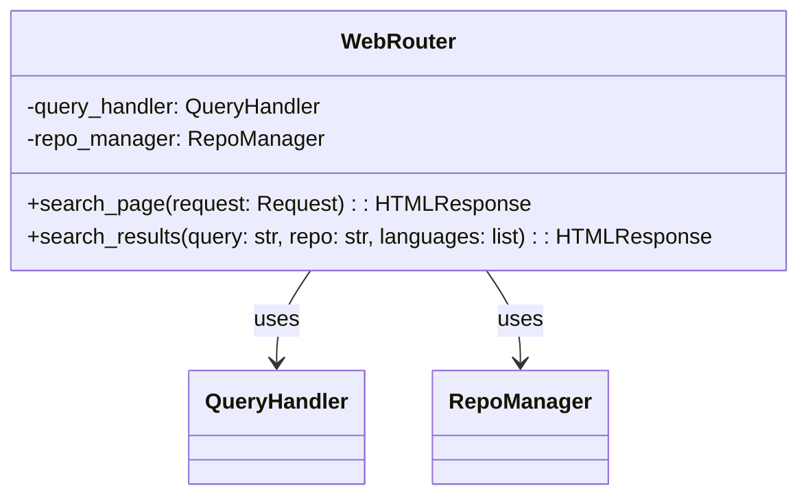
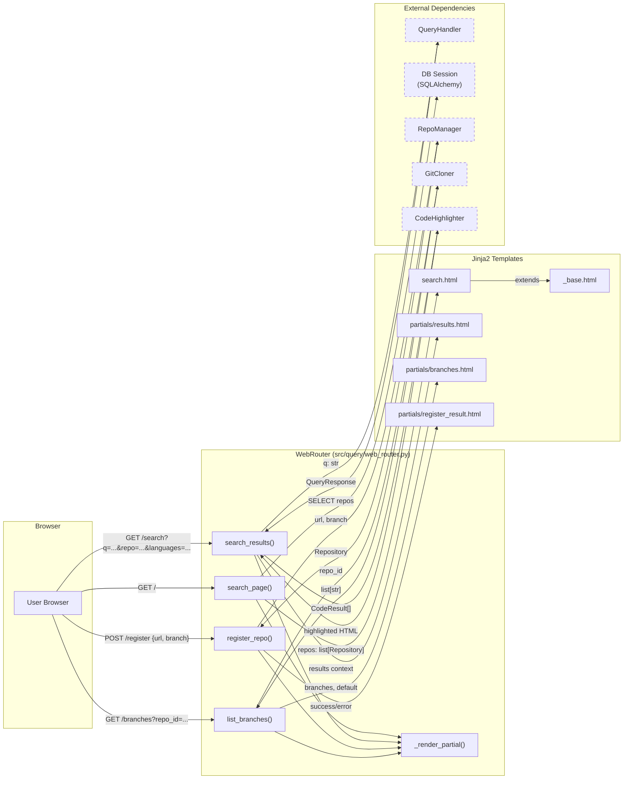
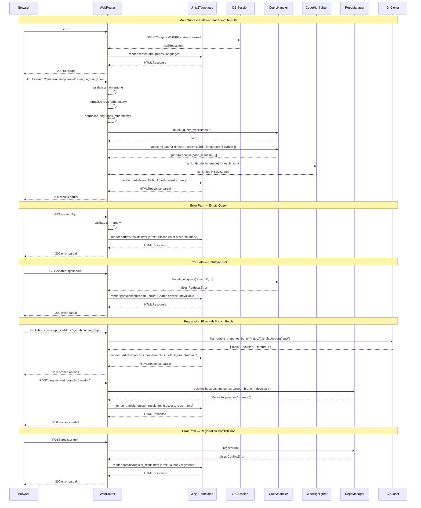
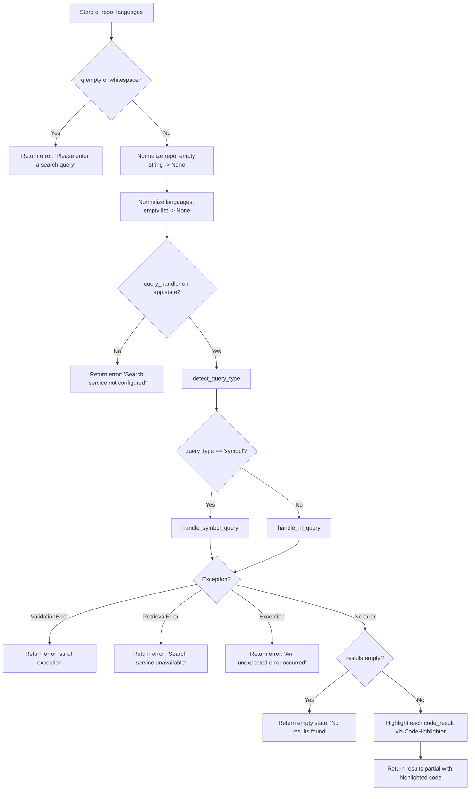
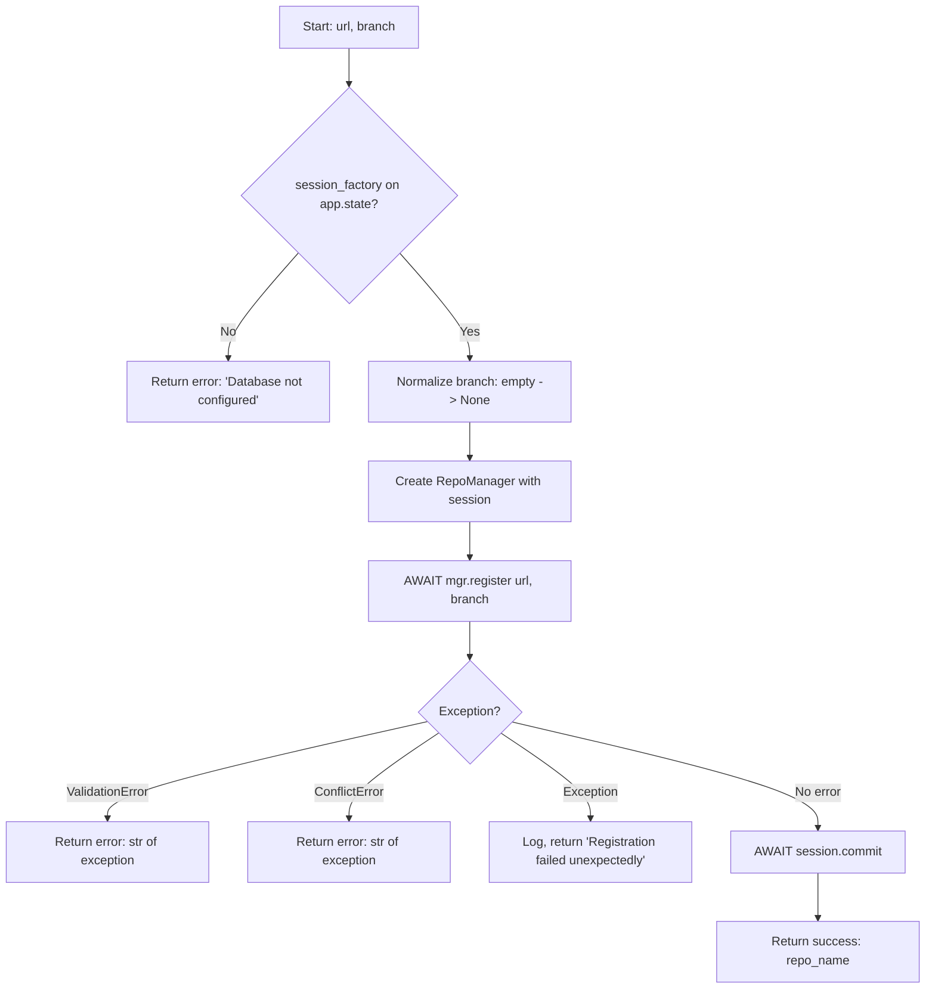

# Feature Detailed Design: Web UI Search Page (Feature #19)

**Date**: 2026-03-25
**Feature**: #19 — Web UI Search Page
**Priority**: medium
**Dependencies**: #17 (Branch Listing API)
**Design Reference**: docs/plans/2026-03-21-code-context-retrieval-design.md § 4.4
**SRS Reference**: FR-017, FR-018

## Context

The Web UI Search Page provides a Jinja2 server-side rendered interface for developers to search code context across indexed repositories. It combines a search input with mandatory repository selection, language filtering, syntax-highlighted result cards, branch-aware repository registration, and htmx-driven partial updates — all themed with the UCD Developer Dark palette.

## Design Alignment

### § 4.4 Feature: Web UI (FR-017, FR-018)

#### 4.4.1 Overview
Server-side rendered search page using Jinja2 templates. Single page with search input, repository dropdown, language checkboxes, and syntax-highlighted result cards.

#### 4.4.2 Class Diagram



#### 4.4.3 Design Notes
- **SSR approach**: Jinja2 templates rendered server-side. No JavaScript framework needed — the UI is a single search form with results. HTMX for partial page updates (search without full reload).
- **UCD mapping**: CSS custom properties map directly to UCD style tokens (Section 2 of UCD). Code highlighting via Pygments with a custom Monokai-inspired formatter using UCD syntax tokens.
- **Component mapping**: UCD Component to Implementation:
  - Search Input: `<input>` + `<button>` styled with UCD tokens
  - Repository Dropdown: `<select>` populated from repo list API
  - Branch Selector: `<select>` populated via `GET /branches?repo_id=<url>` after URL entry (HTMX partial update). Defaults to repo's default branch. Shown in repository registration form.
  - Language Checkboxes: `<input type="checkbox">` x 6 languages
  - Result Card: Jinja2 partial `partials/results.html` with Pygments highlighting
  - Empty State: Jinja2 conditional block
  - Header: Jinja2 base template `_base.html`
  - Loading Skeleton: CSS animation (shimmer), shown via HTMX indicator

- **Key classes**: `WebRouter` (main controller, `src/query/web_router.py`), `CodeHighlighter` (syntax highlighting, `src/query/highlighter.py`)
- **Interaction flow**: Browser GET `/` -> `WebRouter.search_page()` -> Jinja2 renders `search.html`. User submits search -> htmx GET `/search?q=...&repo=...&languages=...` -> `WebRouter.search_results()` -> `QueryHandler.handle_nl_query()` or `handle_symbol_query()` -> Jinja2 renders `partials/results.html`. Registration: POST `/register` -> `RepoManager.register()`. Branch fetch: GET `/branches?repo_id=<url>` -> `GitCloner.list_remote_branches_by_url()`.
- **Third-party deps**: Jinja2 (via FastAPI/Starlette), htmx 2.0.4 (CDN), Pygments (syntax highlighting)
- **Deviations**: None — implementation follows the design exactly.

## SRS Requirement

### FR-017: Web UI Search Page

**Priority**: Should
**EARS**: When a developer accesses the Web UI, the system shall display a search interface with a **mandatory** repository selector (only indexed repos), language filtering, and natural language / symbol search, with results displayed as syntax-highlighted code snippets with metadata. The repository registration form shall include a branch selector.
**Acceptance Criteria**:
- Given a developer accessing the Web UI root URL, when the page loads, then it shall display a search input, a **required** repository dropdown (only `status=indexed` repos, no "all repos" option), and language filter checkboxes.
- Given no repository selected, when a search is submitted, then the UI shall display a validation message requiring repository selection.
- Given a search query submitted with a selected repository, when results are returned, then each result shall display: code snippet with syntax highlighting, repository name, file path, symbol name, and relevance score.
- Given no results for a query, when displayed, then the UI shall show a "No results found" message.
- Given the repository registration form, when the user enters a repository URL and the repo is already cloned, then the UI shall fetch available branches via the Branch Listing API and display a branch selector dropdown defaulting to the repo's default branch.

### FR-018: Language Filter

**Priority**: Should
**EARS**: Where a language filter is specified in the query, the system shall restrict retrieval to chunks matching the specified programming language(s).
**Acceptance Criteria**:
- Given query "timeout" with language filter ["java"], when retrieval runs, then all returned chunks shall have `language` = "java".
- Given multiple language filters ["java", "python"], when retrieval runs, then returned chunks shall be in either Java or Python.
- Given an unrecognized language value (e.g., "rust"), when submitted, then the system shall return a 400 error listing the supported languages.
- Given an empty language filter list, when submitted, then the system shall search across all languages (no filter applied).

## Component Data-Flow Diagram



## Interface Contract

| Method | Signature | Preconditions | Postconditions | Raises |
|--------|-----------|---------------|----------------|--------|
| `search_page` | `async search_page(request: Request) -> HTMLResponse` | GET `/` request received; `request.app.state` may or may not have `session_factory` | Returns HTTP 200 with full HTML page containing: search input, repo `<select>` (only `status=indexed` repos from DB, no "all repos" fallback option), language checkboxes for all 6 CON-001 languages, UCD dark theme bg `#0d1117`, htmx script loaded; if DB unavailable, renders with empty repo list (graceful degradation) | Never raises to caller — all exceptions caught internally |
| `search_results` | `async search_results(request: Request, q: str, repo: str|None, languages: list[str]|None) -> HTMLResponse` | GET `/search` request; `q` is a query string param (may be empty); `repo` is optional repo ID; `languages` is optional list of language strings | If `q` is empty/whitespace: returns partial with "Please enter a search query" error. If `repo` is empty string: treated as None. If `languages` is empty: treated as None. On success: returns partial HTML with result cards containing file_path, symbol, relevance_score (as float), syntax-highlighted code. On empty results: returns "No results found" message. On degraded pipeline: includes degraded warning indicator | Never raises — catches `ValidationError` (shows message), `RetrievalError` (shows "Search service unavailable"), generic `Exception` (shows "An unexpected error occurred") |
| `register_repo` | `async register_repo(request: Request, url: str, branch: str) -> HTMLResponse` | POST `/register` with form data `url` and `branch`; `session_factory` should be on `app.state` | On success: returns partial with "registered successfully" message with repo name. On missing DB config: returns "Database not configured" error. Empty branch treated as None (default branch) | Never raises — catches `ValidationError` (shows message), `ConflictError` (shows "already registered"), generic `Exception` (shows "Registration failed unexpectedly") |
| `list_branches` | `async list_branches(request: Request, repo_id: str) -> HTMLResponse` | GET `/branches?repo_id=<url>`; `git_cloner` should be on `app.state` | Returns partial HTML with `<option>` elements for each branch. If "main" in branches, selects it as default; otherwise first branch is default. On failure: returns partial with only "Default branch" option (graceful degradation) | Never raises — catches all exceptions internally |
| `CodeHighlighter.highlight` | `highlight(code: str, language: str|None) -> str` | `code` is source text (may be empty); `language` is Pygments alias or None | Returns HTML string with syntax-highlighted code using UCD Monokai tokens. Unknown/None language falls back to plain text (TextLexer) | Never raises — unknown languages handled via fallback |
| `CodeHighlighter._resolve_lexer` | `_resolve_lexer(language: str|None) -> Lexer` | `language` param (any string or None) | Returns Pygments lexer for known languages (with alias mapping: `c++` -> `cpp`, `typescript` -> `ts`, `javascript` -> `js`); returns `TextLexer` for unknown/None | Never raises |

**Design rationale**:
- All handler methods return HTTP 200 with error messages in HTML rather than HTTP 4xx/5xx — this is by design for htmx partial updates which replace DOM content; a non-200 status would require htmx error handling configuration.
- Repository dropdown only shows `status=indexed` repos per SRS wave 5 requirement — no "all repos" option. Repo selection is mandatory for search.
- Empty string parameters are normalized to None before passing to QueryHandler to prevent downstream empty-string filter issues.
- Branch listing uses `repo_id` which is the repository URL (not DB id) for HTMX blur-trigger on the URL input before the repo is registered.

## Internal Sequence Diagram



## Algorithm / Core Logic

### search_page()

Delegates to DB query + Jinja2 render — see Interface Contract above. The only logic is the try/except around DB access for graceful degradation.

#### Pseudocode

```
FUNCTION search_page(request: Request) -> HTMLResponse
  repos = []
  TRY
    session_factory = request.app.state.session_factory
    IF session_factory IS NOT None THEN
      session = AWAIT session_factory()
      repos = AWAIT session.execute(SELECT Repository WHERE status='indexed')
  CATCH Exception
    log.warning("Failed to load repository list")
    // repos remains empty — graceful degradation
  END TRY
  RETURN render("search.html", {repos, languages: SUPPORTED_LANGUAGES})
END
```

#### Boundary Decisions

| Parameter | Min | Max | Empty/Null | At boundary |
|-----------|-----|-----|------------|-------------|
| `session_factory` | N/A | N/A | None — render with empty repos list | Present but throws — catch and render with empty list |
| `repos` result | 0 repos | Unlimited | Empty list — dropdown has no options | 1 repo — single option in dropdown |

#### Error Handling

| Condition | Detection | Response | Recovery |
|-----------|-----------|----------|----------|
| `session_factory` is None | `getattr` returns None | Skip DB query, use empty repos list | Page renders normally with empty dropdown |
| DB query fails | Exception caught in try/except | Log warning, use empty repos list | Page renders normally with empty dropdown |

### search_results()

#### Flow Diagram



#### Pseudocode

```
FUNCTION search_results(request, q, repo, languages) -> HTMLResponse
  // Step 1: Validate query
  IF q IS empty OR q.strip() IS empty THEN
    RETURN render_partial("partials/results.html", error="Please enter a search query")
  END IF

  // Step 2: Normalize filters
  repo_filter = repo IF repo AND repo.strip() ELSE None
  lang_list = languages IF languages AND any non-empty ELSE None

  // Step 3: Check query handler availability
  query_handler = request.app.state.query_handler
  IF query_handler IS None THEN
    RETURN render_partial("partials/results.html", error="Search service not configured")
  END IF

  // Step 4: Detect query type and dispatch
  TRY
    query_type = query_handler.detect_query_type(q)
    IF query_type == "symbol" THEN
      response = AWAIT query_handler.handle_symbol_query(q, repo=repo_filter, languages=lang_list)
    ELSE
      response = AWAIT query_handler.handle_nl_query(q, repo=repo_filter, languages=lang_list)
    END IF
  CATCH ValidationError AS e
    RETURN render_partial(error=str(e))
  CATCH RetrievalError
    RETURN render_partial(error="Search service unavailable. Please try again.")
  CATCH Exception
    log.exception("Unexpected error during search")
    RETURN render_partial(error="An unexpected error occurred.")
  END TRY

  // Step 5: Check for empty results
  IF response.code_results IS empty AND response.doc_results IS empty THEN
    RETURN render_partial(empty=True, query=q)
  END IF

  // Step 6: Highlight code results
  highlighted_results = []
  FOR EACH result IN response.code_results
    html = highlighter.highlight(result.content, result.language)
    highlighted_results.append({result, highlighted: html})
  END FOR

  RETURN render_partial(code_results=highlighted_results, doc_results=response.doc_results,
                        query=q, degraded=response.degraded)
END
```

#### Boundary Decisions

| Parameter | Min | Max | Empty/Null | At boundary |
|-----------|-----|-----|------------|-------------|
| `q` | 1 char (valid) | 500 chars (upstream limit) | Empty/whitespace -> validation error | Single char "x" -> passed to QueryHandler |
| `repo` | Non-empty string | Arbitrary | Empty string or None -> treated as None (no repo filter) | Single char repo ID -> passed through |
| `languages` | 1 language | 6 languages (CON-001) | None/empty -> no language filter | Single language list -> passed through |
| `code_results` | 0 results | 3 results (Top-K default) | Empty -> "No results found" | 1 result -> single result card |

#### Error Handling

| Condition | Detection | Response | Recovery |
|-----------|-----------|----------|----------|
| Empty/whitespace query | `not q or not q.strip()` | Render partial with "Please enter a search query" | User corrects query |
| QueryHandler not configured | `getattr` returns None | Render partial with "Search service not configured" | Admin configures service |
| `ValidationError` from QueryHandler | Exception type check | Render partial with exception message text | User corrects input |
| `RetrievalError` from QueryHandler | Exception type check | Render partial with "Search service unavailable. Please try again." | User retries or admin fixes ES/Qdrant |
| Generic exception | Catch-all Exception | Log traceback, render "An unexpected error occurred." | Admin investigates logs |

### register_repo()

#### Flow Diagram



#### Pseudocode

```
FUNCTION register_repo(request, url, branch) -> HTMLResponse
  session_factory = request.app.state.session_factory
  IF session_factory IS None THEN
    RETURN render_partial("partials/register_result.html", error="Database not configured")
  END IF

  branch_val = branch IF branch AND branch.strip() ELSE None
  TRY
    session = AWAIT session_factory()
    mgr = RepoManager(session)
    repo = AWAIT mgr.register(url, branch=branch_val)
    AWAIT session.commit()
    RETURN render_partial(success=True, repo_name=repo.name)
  CATCH ValidationError AS e
    RETURN render_partial(error=str(e))
  CATCH ConflictError AS e
    RETURN render_partial(error=str(e))
  CATCH Exception
    log.exception("Unexpected error during registration")
    RETURN render_partial(error="Registration failed unexpectedly.")
  END TRY
END
```

#### Boundary Decisions

| Parameter | Min | Max | Empty/Null | At boundary |
|-----------|-----|-----|------------|-------------|
| `url` | Valid Git URL | Arbitrary length | Empty -> ValidationError from RepoManager | Minimal valid URL -> accepted |
| `branch` | Non-empty string | Arbitrary | Empty string -> None (default branch) | Branch name with special chars -> passed to RepoManager |

#### Error Handling

| Condition | Detection | Response | Recovery |
|-----------|-----------|----------|----------|
| DB not configured | `session_factory` is None | Render "Database not configured" | Admin configures DB |
| Invalid URL | `ValidationError` from RepoManager | Render error message text | User corrects URL |
| Duplicate URL | `ConflictError` from RepoManager | Render "already registered" message | User acknowledges |
| Generic failure | Catch-all Exception | Log, render "Registration failed unexpectedly." | Admin investigates |

### list_branches()

#### Pseudocode

```
FUNCTION list_branches(request, repo_id) -> HTMLResponse
  branches = []
  default_branch = "main"
  TRY
    git_cloner = request.app.state.git_cloner
    IF git_cloner IS NOT None AND repo_id IS truthy THEN
      result = AWAIT git_cloner.list_remote_branches_by_url(repo_id)
      IF result THEN
        branches = result
        IF "main" IN branches THEN default_branch = "main"
        ELSE IF branches IS non-empty THEN default_branch = branches[0]
      END IF
    END IF
  CATCH Exception
    log.warning("Failed to list branches")
    // branches remains empty — graceful degradation
  END TRY
  RETURN render_partial("partials/branches.html", branches=branches, default_branch=default_branch)
END
```

#### Boundary Decisions

| Parameter | Min | Max | Empty/Null | At boundary |
|-----------|-----|-----|------------|-------------|
| `repo_id` | Non-empty URL string | Arbitrary | Empty string -> skip branch fetch, return default option only | Valid URL with no branches -> empty branches, "Default branch" only |
| `branches` result | 0 branches | Unlimited | Empty -> only "Default branch" option | 1 branch -> that branch selected as default |

#### Error Handling

| Condition | Detection | Response | Recovery |
|-----------|-----------|----------|----------|
| `git_cloner` not configured | `getattr` returns None | Return partial with only "Default branch" option | Admin configures cloner |
| Network error fetching branches | Exception caught | Log warning, return "Default branch" only | User can retry or type branch manually |
| No "main" branch in list | "main" not in branches | First branch becomes default | Correct behavior per design |

### CodeHighlighter.highlight()

Delegates to Pygments — see Feature #19 `src/query/highlighter.py`. The `_resolve_lexer` method maps language aliases (`c++` -> `cpp`, `typescript` -> `ts`, `javascript` -> `js`) and falls back to `TextLexer` for unknown languages.

#### Boundary Decisions

| Parameter | Min | Max | Empty/Null | At boundary |
|-----------|-----|-----|------------|-------------|
| `code` | Empty string "" | Arbitrary large | Empty -> returns empty highlighted HTML | Single char -> highlighted normally |
| `language` | Known alias | N/A | None or "" -> TextLexer fallback | Unknown language "rust" -> TextLexer fallback |

#### Error Handling

| Condition | Detection | Response | Recovery |
|-----------|-----------|----------|----------|
| Unknown language | `ClassNotFound` from Pygments | Fall back to `TextLexer` (plain text) | Code displayed without highlighting |
| None/empty language | Conditional check | Use `TextLexer` | Code displayed without highlighting |

## State Diagram

N/A — stateless feature. The WebRouter does not manage any object lifecycle. Each request is independent; templates are rendered from current DB state. Repository lifecycle is managed by Feature #3 (Repository Registration) not this feature.

## Test Inventory

| ID | Category | Traces To | Input / Setup | Expected | Kills Which Bug? |
|----|----------|-----------|---------------|----------|-----------------|
| T01 | happy path | VS-1, FR-017 | GET `/` with mock session returning 2 repos (status=indexed) | HTTP 200; HTML contains `<input` search, `<select` with 2 repo options, 6 language checkboxes, `#0d1117` bg color, `htmx` script | Missing template render, wrong UCD theme, missing form elements |
| T02 | happy path | VS-1, FR-017 | GET `/search?q=timeout` with mock QueryHandler returning 2 CodeResults (file_path, symbol, score) | HTTP 200; HTML contains both file paths, both symbols, both scores, syntax-highlighted code | Missing result rendering, broken highlight pipeline |
| T03 | happy path | VS-1, FR-017 | GET `/search?q=timeout&repo=uuid1` with mock | HTTP 200; `handle_nl_query` called with `repo="uuid1"` | Repo filter not passed through to QueryHandler |
| T04 | happy path | VS-1, FR-018 | GET `/search?q=timeout&languages=python&languages=java` with mock | HTTP 200; `handle_nl_query` called with `languages=["python","java"]` | Language filter not passed through |
| T05 | happy path | VS-4, FR-017 | GET `/branches?repo_id=<url>` with mock GitCloner returning `["main","develop"]` | HTTP 200; HTML contains `<option` for "main" (selected) and "develop" | Branch selector not rendering options |
| T06 | happy path | VS-4, FR-017 | POST `/register` with `url=https://github.com/org/repo&branch=develop`, mock RepoManager returning repo | HTTP 200; `register()` called with `branch="develop"`; success message with repo name | Branch not passed to RepoManager |
| T07 | happy path | VS-1, FR-017 | GET `/search?q=myFunc` with mock `detect_query_type` returning "symbol" | HTTP 200; `handle_symbol_query` called, `handle_nl_query` NOT called | Symbol dispatch broken |
| T08 | happy path | FR-017 | GET `/search?q=timeout` with mock returning `degraded=True` | HTTP 200; HTML contains "degraded" or "partial" text | Degraded indicator missing |
| T09 | error | VS-2, FR-017, §Interface Contract search_results Raises | GET `/search?q=` (empty query) | HTTP 200; HTML contains "Please enter a search query" | Empty query not validated, passes to QueryHandler |
| T10 | error | VS-2, FR-017, §Interface Contract search_results Raises | GET `/search?q=%20%20` (whitespace-only) | HTTP 200; HTML contains "Please enter a search query" | Whitespace-only query not caught |
| T11 | error | VS-3, FR-017, §Interface Contract search_results | GET `/search?q=xyznonexistent` with mock returning empty results | HTTP 200; HTML contains "No results found" | Empty state not rendered |
| T12 | error | §Interface Contract search_results Raises | GET `/search?q=timeout` with mock raising `RetrievalError` | HTTP 200; HTML contains "Search service unavailable" | RetrievalError not caught or wrong message |
| T13 | error | §Interface Contract search_results Raises | GET `/search?q=timeout` with mock raising `ValidationError("exceeds limit")` | HTTP 200; HTML contains "exceeds limit" | ValidationError message not surfaced |
| T14 | error | §Interface Contract search_page | GET `/` with DB session raising Exception | HTTP 200; page renders with empty repo dropdown, no crash | DB failure crashes page |
| T15 | error | §Interface Contract register_repo Raises | POST `/register` with empty URL, mock raising `ValidationError` | HTTP 200; HTML contains URL validation error | Empty URL not validated |
| T16 | error | §Interface Contract register_repo Raises | POST `/register` with duplicate URL, mock raising `ConflictError("already registered")` | HTTP 200; HTML contains "already registered" | ConflictError not caught |
| T17 | error | §Interface Contract list_branches | GET `/branches?repo_id=<url>` with mock raising Exception | HTTP 200; partial renders with no branch options (graceful degradation) | Branch failure crashes endpoint |
| T18 | error | §Interface Contract search_results Raises | GET `/search?q=timeout` with mock raising generic `RuntimeError` | HTTP 200; HTML contains "unexpected error" or "error" | Generic exception not caught |
| T19 | error | §Interface Contract register_repo | POST `/register` when `session_factory` is None | HTTP 200; HTML contains "not configured" or "database" | Missing DB config crashes endpoint |
| T20 | error | §Interface Contract register_repo Raises | POST `/register` with mock raising generic `RuntimeError` | HTTP 200; HTML contains "failed" or "error" | Generic registration exception not caught |
| T21 | boundary | §Algorithm search_results boundary | GET `/search?q=x` (1-char query) | HTTP 200; QueryHandler invoked (single char is valid) | Off-by-one in empty check rejects 1-char queries |
| T22 | boundary | §Algorithm search_results boundary | GET `/search?q=timeout&repo=` (empty repo string) | HTTP 200; `handle_nl_query` called with `repo=None` | Empty string passed as repo filter instead of None |
| T23 | boundary | §Algorithm search_results boundary | GET `/search?q=timeout` (no languages param) | HTTP 200; `handle_nl_query` called with `languages=None` | Missing languages param not normalized to None |
| T24 | boundary | §Algorithm list_branches boundary | GET `/branches?repo_id=<url>` with mock returning `["develop","feature-x"]` (no "main") | HTTP 200; "develop" is selected default | Default branch logic fails when "main" absent |
| T25 | boundary | §Algorithm search_page boundary | GET `/` with no `session_factory` on app.state | HTTP 200; page renders with search input, empty repo list | Missing session_factory crashes page |
| T26 | happy path | VS-1, FR-017 | GET `/` — check htmx CDN script and `hx-get`/`hx-post` attributes | HTTP 200; HTML contains "htmx.org" or "htmx.min.js" and "hx-get" or "hx-post" | HTMX integration missing |
| T27 | happy path | VS-1, FR-017 | GET `/` — check UCD color tokens in HTML/CSS | HTTP 200; HTML contains `#0d1117` | UCD theme not applied |
| T28 | error | §Interface Contract search_results | GET `/search?q=timeout` when `query_handler` is None on app.state | HTTP 200; HTML contains "Search service not configured" | Missing handler crashes search |
| T29 | happy path (real) | VS-1, FR-017 | GET `/` — real Jinja2 template render (no template mock) | HTTP 200; HTML contains `<!DOCTYPE html>`, `<input`, "Code Context", "htmx", `#0d1117` | Template files missing or malformed on disk |

**Negative test ratio**: 17 negative tests (T09-T20, T28) out of 29 total = 58.6% (threshold: >= 40%) -- PASS

### Design Interface Coverage Gate

Functions/methods from § 4.4:

| Design Item | Test Coverage |
|-------------|--------------|
| `WebRouter.search_page()` | T01, T14, T25, T26, T27, T29 |
| `WebRouter.search_results()` | T02, T03, T04, T07, T08, T09, T10, T11, T12, T13, T18, T21, T22, T23, T28 |
| `WebRouter.register_repo()` | T06, T15, T16, T19, T20 |
| `WebRouter.list_branches()` | T05, T17, T24 |
| `WebRouter._render_partial()` | Exercised by all above (internal helper) |
| `CodeHighlighter.highlight()` | T02 (through search results pipeline) |
| `CodeHighlighter._resolve_lexer()` | T02 (through highlight) |

All 7 named functions/methods have at least one test row. Coverage: 7/7 -- PASS

## Tasks

### Task 1: Write failing tests
**Files**: `tests/test_web_ui.py`
**Steps**:
1. Tests already exist in `tests/test_web_ui.py` covering T01-T28 (see current file). Verify all 29 test IDs from the Test Inventory are covered:
   - T01: `test_search_page_renders_form` — verify repo dropdown shows only indexed repos (update assertion to check `status=indexed` filtering)
   - T02: `test_search_results_with_hits`
   - T03: `test_search_results_repo_filter`
   - T04: `test_search_results_language_filter`
   - T05: `test_list_branches`
   - T06: `test_register_repo_with_branch`
   - T07: `test_symbol_query_dispatch`
   - T08: `test_degraded_indicator`
   - T09: `test_empty_query_validation`
   - T10: `test_whitespace_query_validation`
   - T11: `test_no_results_empty_state`
   - T12: `test_retrieval_error_display`
   - T13: `test_validation_error_display`
   - T14: `test_db_failure_graceful`
   - T15: `test_register_empty_url`
   - T16: `test_register_duplicate_url`
   - T17: `test_branches_failure_graceful`
   - T18: `test_search_generic_exception`
   - T19: `test_register_db_not_configured`
   - T20: `test_register_generic_exception`
   - T21: `test_single_char_query`
   - T22: `test_empty_repo_string_treated_as_none`
   - T23: `test_empty_languages_treated_as_none`
   - T24: `test_branches_no_main_defaults_to_first`
   - T25: `test_search_page_no_session_factory`
   - T26: `test_htmx_integration`
   - T27: `test_ucd_theme_tokens`
   - T28: `test_no_query_handler_error`
   - T29: `test_real_jinja2_template_renders_search_page`
2. Add new test for mandatory repo filtering (indexed-only repos) if not already covered. Update `mock_session_factory` to return repos with `status=indexed` and verify dropdown excludes non-indexed repos.
3. Run: `python -m pytest tests/test_web_ui.py -x`
4. **Expected**: New/modified tests FAIL (red phase) because `search_page` currently does `SELECT Repository` without `WHERE status='indexed'` filter.

### Task 2: Implement minimal code
**Files**: `src/query/web_router.py`, `src/query/templates/search.html`
**Steps**:
1. In `WebRouter.search_page()`: add `WHERE Repository.status == 'indexed'` filter to the SELECT query (per FR-017 wave 5 requirement).
2. In `search.html`: remove the "All repositories" `<option value="">` to make repo selection mandatory per SRS. Add `required` attribute to repo `<select>`.
3. Verify template files (`_base.html`, `search.html`, `partials/results.html`, `partials/branches.html`, `partials/register_result.html`) match UCD component prompts for Developer Dark theme.
4. Run: `python -m pytest tests/test_web_ui.py -x`
5. **Expected**: All tests PASS

### Task 3: Coverage Gate
1. Run: `python -m pytest tests/test_web_ui.py --cov=src/query/web_router --cov=src/query/highlighter --cov-report=term-missing --cov-branch`
2. Check thresholds: line >= 90%, branch >= 80%. If below: return to Task 1.
3. Record coverage output as evidence.

### Task 4: Refactor
1. Review WebRouter for any duplication in error handling (consider extracting common try/except patterns if 3+ similar blocks).
2. Verify CSS custom properties align exactly with UCD Section 2 tokens.
3. Run full test suite. All tests PASS.

### Task 5: Mutation Gate
1. Run: `python -m mutmut run --paths-to-mutate=src/query/web_router.py,src/query/highlighter.py --tests-dir=tests/ --runner="python -m pytest tests/test_web_ui.py -x -q"`
2. Check threshold: mutation score >= 80%. If below: improve assertions.
3. Record mutation output as evidence.

### Task 6: Create example
1. Create `examples/07-web-ui-search.py` — a standalone script that starts the FastAPI app with WebRouter mounted, serves the search page at `/`, and demonstrates the search flow with mock data.
2. Update `examples/README.md` with entry for example 07.
3. Run example to verify it starts and renders the page.

## Verification Checklist
- [x] All verification_steps traced to Interface Contract postconditions
  - VS-1 (search page renders) -> search_page postconditions
  - VS-2 (empty query validation) -> search_results postconditions (empty query)
  - VS-3 (no results message) -> search_results postconditions (empty results)
  - VS-4 (branch selector) -> list_branches + register_repo postconditions
  - VS-5 (repo required) -> search_page postconditions (no "all repos" option)
  - VS-6 (only indexed repos) -> search_page postconditions (status=indexed filter)
- [x] All verification_steps traced to Test Inventory rows
  - VS-1 -> T01, T02, T26, T27
  - VS-2 -> T09, T10
  - VS-3 -> T11
  - VS-4 -> T05, T06, T24
  - VS-5 -> T01 (no "All repositories" option)
  - VS-6 -> T01 (only indexed repos)
- [x] Algorithm pseudocode covers all non-trivial methods
- [x] Boundary table covers all algorithm parameters
- [x] Error handling table covers all Raises entries
- [x] Test Inventory negative ratio >= 40% (58.6%)
- [x] Every skipped section has explicit "N/A — [reason]" (State Diagram: stateless feature)
- [x] All functions/methods named in § 4.4 have at least one Test Inventory row (7/7)
