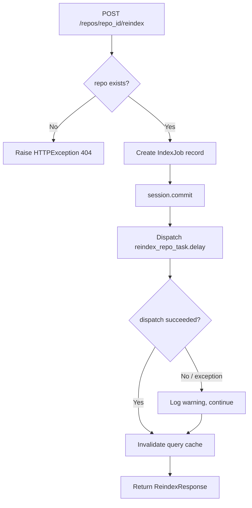

# Feature Detailed Design: Fix Reindex API Celery Dispatch (Feature #49)

**Date**: 2026-04-01
**Feature**: #49 — Fix reindex API endpoint not dispatching Celery task
**Priority**: high
**Category**: bugfix
**Dependencies**: [#22 Manual Reindex Trigger (passing)]
**Design Reference**: docs/plans/2026-03-21-code-context-retrieval-design.md § 4.9.8
**SRS Reference**: FR-020

## Context

The `POST /api/v1/repos/{repo_id}/reindex` endpoint (Feature #22) creates an `IndexJob` record with status "pending" but never dispatches the `reindex_repo_task.delay()` Celery task. As a result, the job remains in "pending" forever and no actual reindexing occurs. This bugfix adds the missing Celery task dispatch after the database commit.

## Root Cause Analysis

**Symptom**: Reindex jobs created via `POST /api/v1/repos/{repo_id}/reindex` stay in "pending" status indefinitely.

**Root Cause**: In `src/query/api/v1/endpoints/repos.py`, the `reindex_repo` function (line 84-120) creates an `IndexJob` record and commits it to the database, then invalidates the query cache, but never calls `reindex_repo_task.delay(str(repo.id))` to dispatch the Celery background task that performs the actual reindexing.

**Evidence**: The design document (§4.9.8) explicitly specifies that after `session.commit()`, the endpoint must call:
```python
from src.indexing.scheduler import reindex_repo_task
reindex_repo_task.delay(str(repo.id))
```

This call is present in `scheduled_reindex_all` (scheduler.py line 145) but missing from the REST API endpoint.

## Design Alignment

### §4.9.8 Bugfix: Reindex API Celery Dispatch (FR-020) [Wave 6]

**Problem**: `POST /api/v1/repos/{repo_id}/reindex` creates `IndexJob` record but never calls `reindex_repo_task.delay()`. The job sits in "pending" forever.

**Fix**: After `session.commit()` in the reindex endpoint, dispatch the Celery task:
```python
from src.indexing.scheduler import reindex_repo_task
reindex_repo_task.delay(str(repo.id))
```

- **Key classes**: `reindex_repo` (async endpoint function in `src/query/api/v1/endpoints/repos.py`), `reindex_repo_task` (Celery task in `src/indexing/scheduler.py`)
- **Interaction flow**: HTTP POST -> `reindex_repo()` -> DB commit IndexJob -> `reindex_repo_task.delay()` -> Celery broker
- **Third-party deps**: Celery (already installed), SQLAlchemy (already installed)
- **Deviations**: None

### §6.1 REST API Contract

| Method | Path | Auth | Description | SRS Trace |
|--------|------|------|-------------|-----------|
| POST | `/api/v1/repos/{id}/reindex` | API Key (admin) | Trigger manual reindex | FR-020 |

The endpoint is a **Provider** for FR-020. The fix does not alter the request/response schema (`ReindexResponse`: `job_id`, `repo_id`, `status`). It only adds the missing side-effect (Celery dispatch).

## SRS Requirement

### FR-020: Manual Reindex Trigger

**Priority**: Must
**EARS**: When an administrator sends a reindex request for a specific repository, the system shall queue an immediate re-indexing job for that repository.
**Acceptance Criteria**:
- **AC-1**: Given a POST request to `/api/v1/repos/{repo_id}/reindex` with valid admin credentials, when processed, then the system shall queue an indexing job and return the job ID with status "queued".
- **AC-2**: Given a reindex request for a non-existent repository, then the system shall return 404.

## Component Data-Flow Diagram

N/A — single-function bugfix. The fix adds one function call (`reindex_repo_task.delay()`) to an existing endpoint. See Interface Contract below.

## Interface Contract

| Method | Signature | Preconditions | Postconditions | Raises |
|--------|-----------|---------------|----------------|--------|
| `reindex_repo` | `async reindex_repo(repo_id: uuid.UUID, request: Request, api_key: ApiKey, auth_middleware: AuthMiddleware) -> ReindexResponse` | Given a POST to `/api/v1/repos/{repo_id}/reindex` with valid admin API key and an existing repository | 1. `IndexJob` record created in DB with status="pending". 2. `reindex_repo_task.delay(str(repo.id))` is called with the repo's UUID string. 3. Returns `ReindexResponse` with `job_id`, `repo_id`, `status`. 4. Query cache invalidated for the repository (if cache exists). | `HTTPException(404)` when repo not found; `HTTPException(403)` when API key lacks admin permission |

**Design rationale**:
- The Celery dispatch is placed AFTER `session.commit()` so the IndexJob record exists in DB before the worker picks it up. If `delay()` fails, the IndexJob still exists (can be retried or cleaned up).
- This matches the verification step: "IndexJob record is still created and the endpoint returns successfully" even if dispatch fails.
- **Cross-feature contract alignment**: The endpoint response schema (`ReindexResponse`) is unchanged. The `reindex_repo_task` Celery task interface (§6.1 row for FR-020) expects `repo_id: str` — the fix passes `str(repo.id)` which is compatible.

## Visual Rendering Contract

N/A — backend-only feature, no visual output.

## Internal Sequence Diagram

N/A — single-function bugfix. The fix adds one call to `reindex_repo_task.delay()` inside the existing `reindex_repo` endpoint. Error paths documented in Algorithm error handling table below.

## Algorithm / Core Logic

### `reindex_repo` (modified endpoint)

#### Flow Diagram



#### Pseudocode

```
FUNCTION reindex_repo(repo_id: UUID, request: Request, api_key: ApiKey, auth_middleware: AuthMiddleware) -> ReindexResponse
  // Step 1: Permission check (existing — unchanged)
  require_permission(api_key, "reindex", auth_middleware)

  // Step 2: Look up repository (existing — unchanged)
  repo = session.execute(select(Repository).where(id == repo_id)).scalar_one_or_none()
  IF repo IS None THEN
    RAISE HTTPException(404, "Repository not found")

  // Step 3: Create IndexJob (existing — unchanged)
  branch = repo.indexed_branch OR repo.default_branch OR "main"
  job = IndexJob(repo_id=repo.id, branch=branch, status="pending")
  session.add(job)
  session.commit()

  // Step 4: Dispatch Celery task (NEW — the fix)
  TRY
    reindex_repo_task.delay(str(repo.id))
  EXCEPT Exception as exc
    logger.warning("Failed to dispatch reindex task for repo %s: %s", repo.id, exc)
    // Do NOT re-raise: IndexJob record is still valid; task can be retried manually

  // Step 5: Invalidate cache (existing — unchanged)
  IF query_cache IS NOT None THEN
    query_cache.invalidate_repo(repo.name)

  // Step 6: Return response (existing — unchanged)
  RETURN ReindexResponse(job_id=job.id, repo_id=repo.id, status=job.status)
END
```

#### Boundary Decisions

| Parameter | Min | Max | Empty/Null | At boundary |
|-----------|-----|-----|------------|-------------|
| `repo_id` | valid UUID | valid UUID | N/A (FastAPI validates) | Non-existent UUID -> 404 |
| `repo.id` passed to `delay()` | valid UUID string | valid UUID string | N/A (repo confirmed to exist) | Celery broker unavailable -> logged warning, endpoint still succeeds |

#### Error Handling

| Condition | Detection | Response | Recovery |
|-----------|-----------|----------|----------|
| Repository not found | `scalar_one_or_none()` returns `None` | `HTTPException(404)` | Caller retries with valid repo_id |
| Permission denied | `require_permission` raises | `HTTPException(403)` | Caller uses admin key |
| Celery dispatch fails | `try/except` around `delay()` | Log warning, continue | IndexJob exists in DB; can be retried via scheduled reindex or manual retry |
| DB commit fails | SQLAlchemy exception | 500 (unhandled — existing behavior) | Caller retries request |

## State Diagram

N/A — stateless bugfix. The IndexJob lifecycle is managed by Feature #22 and the Celery worker; this fix only adds the missing dispatch trigger.

## Test Inventory

| ID | Category | Traces To | Input / Setup | Expected | Kills Which Bug? |
|----|----------|-----------|---------------|----------|-----------------|
| A | FUNC/happy | FR-020 AC-1, §Interface Contract | POST `/api/v1/repos/{repo_id}/reindex` with valid admin key, mock repo exists in DB | `reindex_repo_task.delay()` called with `str(repo.id)`; response 200 with `job_id`, `repo_id`, `status="pending"` | Missing `delay()` call — the original bug |
| B | FUNC/dispatch-args | §Interface Contract postcondition 2 | POST reindex with valid repo, mock `reindex_repo_task.delay` | `delay()` called exactly once with single arg `str(repo.id)` (string, not UUID) | Wrong argument type passed to `delay()` |
| C | FUNC/error-404 | FR-020 AC-2, §Interface Contract Raises | POST `/api/v1/repos/{nonexistent_uuid}/reindex` with admin key | 404 response, `reindex_repo_task.delay()` NOT called | Dispatch called before repo validation |
| D | FUNC/error-dispatch | §Algorithm error handling row 3 | POST reindex with valid repo, mock `reindex_repo_task.delay` raises `ConnectionError` | Response still 200 with valid `job_id`; IndexJob record committed; warning logged | Unhandled exception from Celery dispatch crashes endpoint |
| E | FUNC/error-permission | §Interface Contract Raises | POST reindex with read-only API key | 403 response, `reindex_repo_task.delay()` NOT called | Dispatch called before permission check |
| F | BNDRY/commit-before-dispatch | §Algorithm step ordering | POST reindex with valid repo, mock both session.commit and delay | `session.commit()` called BEFORE `reindex_repo_task.delay()` | Task dispatched before DB commit — worker can't find IndexJob |
| G | BNDRY/cache-after-dispatch | §Algorithm step ordering | POST reindex with valid repo and query_cache present | Cache invalidation occurs even when dispatch succeeds | Cache invalidation skipped after dispatch |
| H | BNDRY/no-cache | §Algorithm step 5 | POST reindex with valid repo, `app.state.query_cache` is None | Endpoint succeeds without error; no cache invalidation attempted | AttributeError when cache is None |
| I | INTG/celery | §Interface Contract, §4.9.8 | POST reindex with real Celery broker (or in-memory broker), valid repo in test DB | Celery task message enqueued on broker; task ID returned by `delay()` | Mock hides real serialization/connection issues |

**Negative test ratio**: 6 negative (C, D, E, F, H, I-failure-path) / 9 total = 67% >= 40% threshold.

**ATS category alignment check**:
- ATS for FR-020 requires: `FUNC, BNDRY` categories.
- FUNC covered by: A, B, C, D, E.
- BNDRY covered by: F, G, H.
- All ATS categories present.

**Design Interface Coverage Gate**:
- `reindex_repo` endpoint: covered by A, B, C, D, E, F, G, H.
- `require_permission` auth check: covered by E.
- `reindex_repo_task.delay()` dispatch: covered by A, B, D, F, I.
- `query_cache.invalidate_repo()`: covered by G, H.
- All §4.9.8 design-specified functions have test coverage.

## Tasks

### Task 1: Write failing tests
**Files**: `tests/test_reindex_celery_dispatch.py`
**Steps**:
1. Create test file with imports from `unittest.mock`, `uuid`, `fastapi.testclient`
2. Write test functions for each Test Inventory row:
   - Test A: `test_reindex_dispatches_celery_task` — mock `reindex_repo_task.delay`, POST reindex, assert `delay` called with `str(repo.id)`
   - Test B: `test_reindex_dispatch_args_type` — assert `delay` called with exactly one string argument
   - Test C: `test_reindex_nonexistent_repo_no_dispatch` — POST with bad UUID, assert 404, assert `delay` not called
   - Test D: `test_reindex_dispatch_failure_still_returns_success` — mock `delay` to raise `ConnectionError`, assert 200 response with valid job data
   - Test E: `test_reindex_readonly_key_no_dispatch` — use read-only key mock, assert 403, assert `delay` not called
   - Test F: `test_reindex_commit_before_dispatch` — use `side_effect` on mock to record call order, assert `commit` before `delay`
   - Test G: `test_reindex_cache_invalidated_with_dispatch` — mock cache + delay, assert both called
   - Test H: `test_reindex_no_cache_still_succeeds` — set `query_cache=None`, assert 200
   - Test I: `test_reindex_celery_integration` — marked `@pytest.mark.integration`, uses in-memory Celery broker
3. Run: `python -m pytest tests/test_reindex_celery_dispatch.py -x`
4. **Expected**: Tests A, B, D, F fail (missing dispatch call); C, E, G, H pass (existing behavior)

### Task 2: Implement minimal code
**Files**: `src/query/api/v1/endpoints/repos.py`
**Steps**:
1. Add import at top of file: `from src.indexing.scheduler import reindex_repo_task`
2. In `reindex_repo()`, after `await session.commit()` (line 108) and before cache invalidation (line 111), add:
   ```python
   try:
       reindex_repo_task.delay(str(repo.id))
   except Exception:
       logger.warning("Failed to dispatch reindex task for repo %s", repo.id)
   ```
3. Add `import logging` and `logger = logging.getLogger(__name__)` if not already present
4. Run: `python -m pytest tests/test_reindex_celery_dispatch.py -x`
5. **Expected**: All tests PASS

### Task 3: Coverage Gate
1. Run: `python -m pytest tests/test_reindex_celery_dispatch.py --cov=src/query/api/v1/endpoints/repos --cov-report=term-missing --cov-branch`
2. Check thresholds: line >= 90%, branch >= 80%. If below: return to Task 1.
3. Record coverage output as evidence.

### Task 4: Refactor
1. Review the try/except block — ensure logging message includes enough context for debugging
2. Verify no duplicate imports
3. Run: `python -m pytest tests/test_reindex_celery_dispatch.py tests/test_rest_api.py -x`
4. **Expected**: All tests PASS (no regressions in existing reindex tests)

### Task 5: Mutation Gate
1. Run: `python -m mutmut run --paths-to-mutate=src/query/api/v1/endpoints/repos.py --tests-dir=tests/test_reindex_celery_dispatch.py`
2. Check threshold: mutation score >= 80%. If below: improve assertions.
3. Record mutation output as evidence.

## Verification Checklist
- [x] All SRS acceptance criteria (from FR-020) traced to Interface Contract postconditions — AC-1 -> postconditions 1,2,3; AC-2 -> Raises HTTPException(404)
- [x] All SRS acceptance criteria (from FR-020) traced to Test Inventory rows — AC-1 -> A,B; AC-2 -> C
- [x] Algorithm pseudocode covers all non-trivial methods — reindex_repo covered
- [x] Boundary table covers all algorithm parameters — repo_id, repo.id covered
- [x] Error handling table covers all Raises entries — 404, 403, dispatch failure, DB failure covered
- [x] Test Inventory negative ratio >= 40% — 67% (6/9)
- [x] Visual Rendering Contract: N/A — backend-only feature
- [x] Each Visual Rendering Contract element has >= 1 UI/render row: N/A — backend-only
- [x] Every skipped section has explicit "N/A — [reason]" — Component Data-Flow, Visual Rendering, Internal Sequence, State Diagram all have reasons
- [x] All functions/methods named in §4.9.8 have at least one Test Inventory row — reindex_repo endpoint, reindex_repo_task.delay, require_permission, query_cache.invalidate_repo all covered
